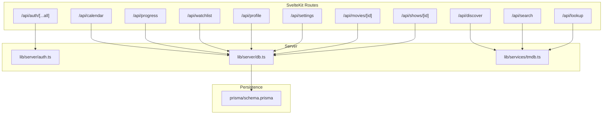
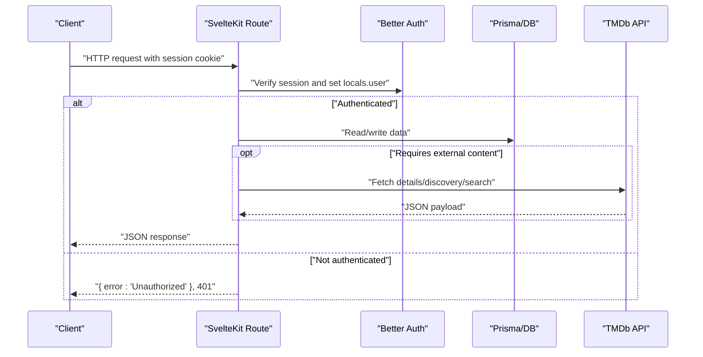
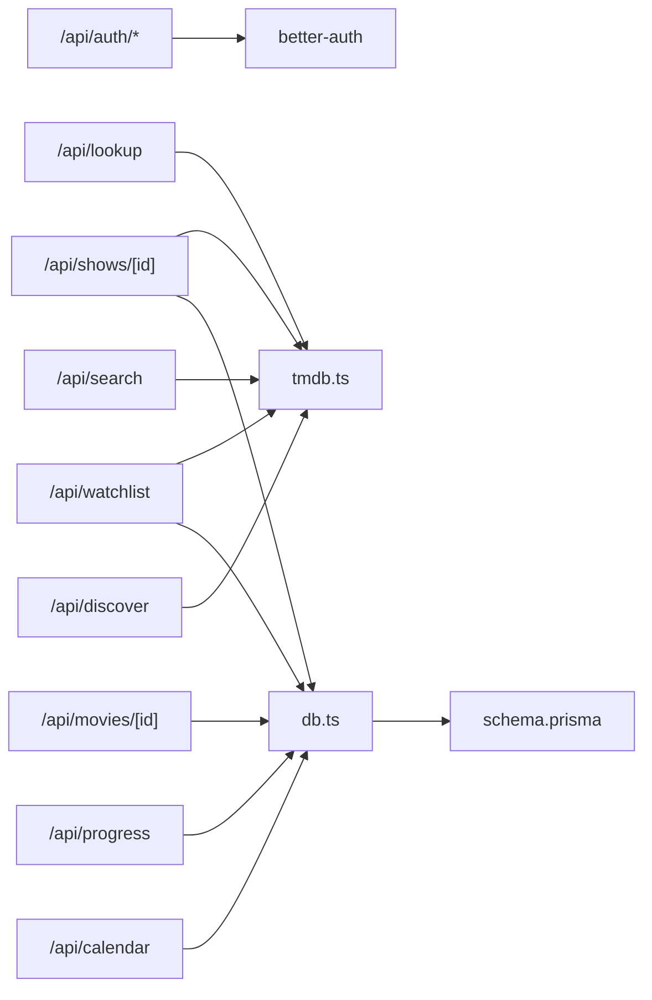

# API Reference

<cite>
**Referenced Files in This Document**
- [src/routes/api/auth/[...all]/+server.ts](file://src/routes/api/auth/[...all]/+server.ts)
- [src/lib/server/auth.ts](file://src/lib/server/auth.ts)
- [src/routes/api/discover/+server.ts](file://src/routes/api/discover/+server.ts)
- [src/routes/api/search/+server.ts](file://src/routes/api/search/+server.ts)
- [src/lib/services/tmdb.ts](file://src/lib/services/tmdb.ts)
- [src/routes/api/calendar/+server.ts](file://src/routes/api/calendar/+server.ts)
- [src/lib/server/db.ts](file://src/lib/server/db.ts)
- [prisma/schema.prisma](file://prisma/schema.prisma)
- [src/routes/api/lookup/+server.ts](file://src/routes/api/lookup/+server.ts)
- [src/routes/api/profile/+server.ts](file://src/routes/api/profile/+server.ts)
- [src/routes/api/settings/+server.ts](file://src/routes/api/settings/+server.ts)
- [src/routes/api/progress/+server.ts](file://src/routes/api/progress/+server.ts)
- [src/routes/api/watchlist/+server.ts](file://src/routes/api/watchlist/+server.ts)
- [src/routes/api/movies/[id]/+server.ts](file://src/routes/api/movies/[id]/+server.ts)
- [src/routes/api/shows/[id]/+server.ts](file://src/routes/api/shows/[id]/+server.ts)
</cite>

## Table of Contents
1. [Introduction](#introduction)
2. [Project Structure](#project-structure)
3. [Core Components](#core-components)
4. [Architecture Overview](#architecture-overview)
5. [Detailed Component Analysis](#detailed-component-analysis)
6. [Dependency Analysis](#dependency-analysis)
7. [Performance Considerations](#performance-considerations)
8. [Troubleshooting Guide](#troubleshooting-guide)
9. [Conclusion](#conclusion)
10. [Appendices](#appendices)

## Introduction
This document describes Screenlog’s public REST API surface implemented via SvelteKit server routes. It covers authentication, content discovery, search, content management, progress tracking, watchlist, profile, settings, calendar, and lookup endpoints. For each endpoint, you will find HTTP method, URL pattern, request/response schemas, authentication requirements, error codes, and usage notes. It also outlines rate limiting, pagination, filtering, caching strategies, and client integration patterns.

## Project Structure
The API is organized under src/routes/api/<group>/ with per-route handlers exporting GET/POST/DELETE as needed. Shared backend concerns include:
- Authentication via better-auth integrated into SvelteKit
- PostgreSQL persistence via Prisma
- Third-party content via The Movie Database (TMDb)

**Diagram sources**
- [src/routes/api/auth/[...all]/+server.ts](file://src/routes/api/auth/[...all]/+server.ts#L1-L7)
- [src/lib/server/auth.ts:1-27](file://src/lib/server/auth.ts#L1-L27)
- [src/routes/api/discover/+server.ts:1-21](file://src/routes/api/discover/+server.ts#L1-L21)
- [src/routes/api/search/+server.ts:1-16](file://src/routes/api/search/+server.ts#L1-L16)
- [src/lib/services/tmdb.ts:1-167](file://src/lib/services/tmdb.ts#L1-L167)
- [src/routes/api/calendar/+server.ts:1-82](file://src/routes/api/calendar/+server.ts#L1-L82)
- [src/lib/server/db.ts:1-11](file://src/lib/server/db.ts#L1-L11)
- [prisma/schema.prisma:1-258](file://prisma/schema.prisma#L1-L258)

**Section sources**
- [src/routes/api/auth/[...all]/+server.ts](file://src/routes/api/auth/[...all]/+server.ts#L1-L7)
- [src/lib/server/auth.ts:1-27](file://src/lib/server/auth.ts#L1-L27)
- [src/routes/api/discover/+server.ts:1-21](file://src/routes/api/discover/+server.ts#L1-L21)
- [src/routes/api/search/+server.ts:1-16](file://src/routes/api/search/+server.ts#L1-L16)
- [src/lib/services/tmdb.ts:1-167](file://src/lib/services/tmdb.ts#L1-L167)
- [src/routes/api/calendar/+server.ts:1-82](file://src/routes/api/calendar/+server.ts#L1-L82)
- [src/lib/server/db.ts:1-11](file://src/lib/server/db.ts#L1-L11)
- [prisma/schema.prisma:1-258](file://prisma/schema.prisma#L1-L258)

## Core Components
- Authentication: Managed by better-auth with cookie-based sessions. Routes enforce a logged-in user via the SvelteKit locals.user.
- Content Services: TMDb integration for discovery, search, and details.
- Persistence: Prisma-backed PostgreSQL schema modeling users, shows, seasons, episodes, movies, user lists, progress, preferences, and activity.

Key shared behaviors:
- Authentication requirement: All API endpoints require a valid session (locals.user present).
- Error responses: JSON bodies with an error field and appropriate HTTP status codes.
- Rate limiting: Not explicitly implemented in code; see Performance Considerations.

**Section sources**
- [src/lib/server/auth.ts:1-27](file://src/lib/server/auth.ts#L1-L27)
- [src/lib/services/tmdb.ts:1-167](file://src/lib/services/tmdb.ts#L1-L167)
- [prisma/schema.prisma:1-258](file://prisma/schema.prisma#L1-L258)

## Architecture Overview
High-level flow for a typical authenticated request:

**Diagram sources**
- [src/routes/api/discover/+server.ts:5-20](file://src/routes/api/discover/+server.ts#L5-L20)
- [src/lib/server/auth.ts:1-27](file://src/lib/server/auth.ts#L1-L27)
- [src/lib/services/tmdb.ts:19-37](file://src/lib/services/tmdb.ts#L19-L37)
- [src/lib/server/db.ts:1-11](file://src/lib/server/db.ts#L1-L11)

## Detailed Component Analysis

### Authentication API
- Purpose: Serves better-auth endpoints for sign-up, sign-in, sign-out, and related flows.
- Base URL: /api/auth/[...all]
- Methods: GET, POST, PUT, DELETE mapped to the same handler.
- Authentication: None required by the route itself; session cookie is validated internally by better-auth.
- Response: Delegated to better-auth; typically JSON with tokens/session info or errors.
- Notes: Cookie domain/origin configured via better-auth settings.

Usage example (conceptual):
- POST /api/auth/sign-in with email/password
- Store returned session cookie and reuse for subsequent requests

**Section sources**
- [src/routes/api/auth/[...all]/+server.ts](file://src/routes/api/auth/[...all]/+server.ts#L1-L7)
- [src/lib/server/auth.ts:6-24](file://src/lib/server/auth.ts#L6-L24)

### Content Discovery API
- Endpoint: GET /api/discover
- Authentication: Required
- Query parameters: None
- Response fields:
  - trendingShows: array of items
  - trendingMovies: array of items
  - popularShows: array of items
  - popularMovies: array of items
  - topRatedShows: array of items
  - topRatedMovies: array of items
- Behavior: Fetches multiple discovery feeds concurrently and returns a single aggregated payload.
- External service: TMDb discovery endpoints.

Example request:
- GET /api/discover

**Section sources**
- [src/routes/api/discover/+server.ts:5-20](file://src/routes/api/discover/+server.ts#L5-L20)
- [src/lib/services/tmdb.ts:106-140](file://src/lib/services/tmdb.ts#L106-L140)

### Search API
- Endpoint: GET /api/search?q={query}
- Authentication: Required
- Query parameters:
  - q: string, required. Non-empty trimmed query string.
- Response fields:
  - results: array of search result items (type inferred from media_type)
- Behavior:
  - Returns empty results if query is empty after trimming.
  - Delegates to TMDb multi-search and filters to TV/movie entries.
- External service: TMDb multi search.

Example request:
- GET /api/search?q=matrix

**Section sources**
- [src/routes/api/search/+server.ts:5-15](file://src/routes/api/search/+server.ts#L5-L15)
- [src/lib/services/tmdb.ts:19-37](file://src/lib/services/tmdb.ts#L19-L37)

### Lookup API
- Endpoint: POST /api/lookup
- Authentication: Required
- Request body fields:
  - type: "show" or "movie"
  - tmdbId: integer
  - title, overview, posterPath, backdropPath, firstAirDate/status/genres/runtime/releaseDate/network/language/status/runtime are accepted for fallbacks when creating records
- Response fields:
  - id: internal database ID of the created/queried record
  - type: "show" or "movie"
- Behavior:
  - If record exists, returns existing ID.
  - If not, fetches details from TMDb and creates local records (show/season/episode or movie).
- External service: TMDb details endpoints.

Example request:
- POST /api/lookup with {"type":"show","tmdbId":1399}

**Section sources**
- [src/routes/api/lookup/+server.ts:6-52](file://src/routes/api/lookup/+server.ts#L6-L52)
- [src/lib/services/tmdb.ts:39-104](file://src/lib/services/tmdb.ts#L39-L104)

### Calendar API
- Endpoint: GET /api/calendar?timezone={tz}
- Authentication: Required
- Query parameters:
  - timezone: string, optional. Defaults to Asia/Colombo if omitted.
- Response fields:
  - groups: object with keys today, tomorrow, thisWeek, nextWeek, later. Each key maps to an array of episode items.
  - Episode item fields include: id, showId, showTitle, posterPath, seasonNumber, episodeNumber, episodeTitle, airDate.
- Behavior:
  - Aggregates episodes from tracked shows for the current user.
  - Filters out watched episodes and those aired before today in the given timezone.
  - Sorts and groups episodes by proximity to today.
- External service: Local DB only.

Example request:
- GET /api/calendar?timezone=UTC

**Section sources**
- [src/routes/api/calendar/+server.ts:9-81](file://src/routes/api/calendar/+server.ts#L9-L81)
- [src/lib/server/db.ts:1-11](file://src/lib/server/db.ts#L1-L11)

### Progress Tracking API
- Endpoint: GET /api/progress?showId={id}
- Endpoint: POST /api/progress
- Authentication: Required
- GET parameters:
  - showId: optional. If present, returns progress for episodes of that show; otherwise returns recent progress entries (limited).
- GET response fields:
  - progress: array of episode progress entries with episode metadata and ordering by most recent.
- POST actions (request body.action):
  - watch: marks an episode as watched, creates activity, optionally updates show status.
  - unwatch: removes episode watch record, updates show status.
  - markSeason: marks all episodes in a season as watched, updates show status.
  - markCaughtUp: marks all episodes of a show as watched, sets status to COMPLETED or CAUGHT_UP.
  - resetShow: clears progress and resets show status to PLAN_TO_WATCH.
- Response fields:
  - success: boolean
  - progress/item/count depending on action
- Behavior:
  - Updates derived show status based on episode completion counts.
  - Creates activity logs for relevant actions.

Example requests:
- GET /api/progress?showId=abc123
- POST /api/progress with {"action":"watch","episodeId":"ep1","showId":"show1"}

**Section sources**
- [src/routes/api/progress/+server.ts:34-132](file://src/routes/api/progress/+server.ts#L34-L132)
- [prisma/schema.prisma:168-182](file://prisma/schema.prisma#L168-L182)

### Watchlist API
- Endpoint: GET /api/watchlist
- Endpoint: POST /api/watchlist
- Endpoint: DELETE /api/watchlist
- Authentication: Required
- GET response fields:
  - shows: array of user-show entries with nested seasons/episodes
  - movies: array of user-movie entries with movie details
- POST body fields:
  - type: "show" or "movie"
  - tmdbId: integer
  - userStatus: optional status for the user record
  - Fallback fields for creation: title, overview, posterPath, backdropPath, firstAirDate/status/genres/runtime/releaseDate/network/language/status/runtime
- POST response fields:
  - success: boolean
  - item: created/updated user-show or user-movie
- DELETE body fields:
  - type: "show" or "movie"
  - id: internal ID to remove
- Behavior:
  - For show creation, eagerly fetches and persists seasons and episodes from TMDb.
  - Creates activity logs for additions.

Example requests:
- GET /api/watchlist
- POST /api/watchlist with {"type":"movie","tmdbId":456}
- DELETE /api/watchlist with {"type":"show","id":"userShowId"}

**Section sources**
- [src/routes/api/watchlist/+server.ts:6-140](file://src/routes/api/watchlist/+server.ts#L6-L140)
- [src/lib/services/tmdb.ts:39-104](file://src/lib/services/tmdb.ts#L39-L104)

### Profile API
- Endpoint: GET /api/profile
- Authentication: Required
- Response fields:
  - showsTracked: number
  - showsCompleted: number
  - episodesWatched: number
  - moviesWatched: number
  - totalMovies: number
  - totalWatchTimeMinutes: number (sum of episode runtime + watched movie runtime)
  - topGenres: array of top 5 genres by count
- Behavior:
  - Aggregates counts and computed metrics from user data.

Example request:
- GET /api/profile

**Section sources**
- [src/routes/api/profile/+server.ts:5-65](file://src/routes/api/profile/+server.ts#L5-L65)

### Settings API
- Endpoint: GET /api/settings
- Endpoint: POST /api/settings
- Authentication: Required
- GET response fields:
  - preferences: user preference object (theme, region, language, timezone)
- POST body fields:
  - theme, region, language, timezone
- POST response fields:
  - preferences: upserted user preference object
- Behavior:
  - Upserts preferences keyed by userId.

Example requests:
- GET /api/settings
- POST /api/settings with {"theme":"dark","timezone":"America/New_York"}

**Section sources**
- [src/routes/api/settings/+server.ts:5-28](file://src/routes/api/settings/+server.ts#L5-L28)

### Content Details APIs
- Movies Detail: GET /api/movies/[id]
  - Authentication: Required
  - Response fields:
    - movie: movie object
    - userMovie: user-movie record for the current user
- Shows Detail: GET /api/shows/[id]
  - Authentication: Required
  - Response fields:
    - show: show with seasons and episodes (caches seasons/episodes if missing)
    - userShow: user-show record for the current user
  - Behavior:
    - If seasons are missing locally, fetches details from TMDb and persists seasons/episodes.

Example requests:
- GET /api/movies/[id]
- GET /api/shows/[id]

**Section sources**
- [src/routes/api/movies/[id]/+server.ts](file://src/routes/api/movies/[id]/+server.ts#L5-L18)
- [src/routes/api/shows/[id]/+server.ts](file://src/routes/api/shows/[id]/+server.ts#L6-L62)
- [src/lib/services/tmdb.ts:39-104](file://src/lib/services/tmdb.ts#L39-L104)

## Dependency Analysis
- Route-layer dependencies:
  - All routes depend on better-auth for session validation via SvelteKit’s locals.user.
  - Many routes depend on Prisma models for persistence.
  - Some routes depend on TMDb service functions for external data.
- Data model dependencies:
  - UserShow/UserMovie link users to content and statuses.
  - EpisodeProgress links users to episodes and captures watch history.
  - Activity tracks user actions.

**Diagram sources**
- [src/routes/api/discover/+server.ts:1-21](file://src/routes/api/discover/+server.ts#L1-L21)
- [src/routes/api/search/+server.ts:1-16](file://src/routes/api/search/+server.ts#L1-L16)
- [src/routes/api/lookup/+server.ts:1-53](file://src/routes/api/lookup/+server.ts#L1-L53)
- [src/routes/api/calendar/+server.ts:1-82](file://src/routes/api/calendar/+server.ts#L1-L82)
- [src/routes/api/progress/+server.ts:1-133](file://src/routes/api/progress/+server.ts#L1-L133)
- [src/routes/api/watchlist/+server.ts:1-141](file://src/routes/api/watchlist/+server.ts#L1-L141)
- [src/routes/api/movies/[id]/+server.ts](file://src/routes/api/movies/[id]/+server.ts#L1-L19)
- [src/routes/api/shows/[id]/+server.ts](file://src/routes/api/shows/[id]/+server.ts#L1-L63)
- [src/lib/services/tmdb.ts:1-167](file://src/lib/services/tmdb.ts#L1-L167)
- [src/lib/server/db.ts:1-11](file://src/lib/server/db.ts#L1-L11)
- [prisma/schema.prisma:1-258](file://prisma/schema.prisma#L1-L258)

**Section sources**
- [prisma/schema.prisma:84-258](file://prisma/schema.prisma#L84-L258)

## Performance Considerations
- Concurrency:
  - Discovery endpoint performs parallel fetches for multiple feeds.
  - Progress endpoint updates derived status after write operations.
- Pagination and limits:
  - Progress GET returns a bounded number of recent items.
  - Discovery and search cap results to a small fixed number.
- Filtering:
  - Search filters to TV/movie media types.
  - Calendar excludes watched episodes and future dates outside the grouping window.
- Caching:
  - Shows details may be lazily populated from TMDb when seasons are missing.
- Rate limiting:
  - No explicit server-side rate limiting is implemented in the routes or auth module.
- Recommendations:
  - Add client-side request de-duplication and exponential backoff.
  - Consider adding server-side rate limiting and caching headers where appropriate.
  - Cache TMDb responses at the application layer for repeated queries.

[No sources needed since this section provides general guidance]

## Troubleshooting Guide
Common issues and resolutions:
- Unauthorized responses:
  - Ensure the session cookie is attached to requests.
  - Verify better-auth base URL and trusted origins match deployment.
- Empty search results:
  - Confirm the query is non-empty after trimming.
- Episode progress not updating show status:
  - Verify the episode belongs to a tracked show and that the user ID matches.
- Calendar grouping anomalies:
  - Confirm the timezone parameter matches the user’s expectation and DST transitions.

**Section sources**
- [src/lib/server/auth.ts:16-23](file://src/lib/server/auth.ts#L16-L23)
- [src/routes/api/search/+server.ts:7-8](file://src/routes/api/search/+server.ts#L7-L8)
- [src/routes/api/progress/+server.ts:6-32](file://src/routes/api/progress/+server.ts#L6-L32)
- [src/routes/api/calendar/+server.ts:12-13](file://src/routes/api/calendar/+server.ts#L12-L13)

## Conclusion
Screenlog’s API provides a cohesive set of endpoints for discovering, searching, managing, and tracking entertainment content. Authentication is enforced centrally, while content and persistence are handled through TMDb and Prisma. The design favors simplicity and reliability, with clear separation of concerns across routes and services.

[No sources needed since this section summarizes without analyzing specific files]

## Appendices

### Authentication Requirements
- All endpoints require a valid session cookie issued by better-auth.
- On failure, endpoints return a 401 Unauthorized with an error message.

**Section sources**
- [src/routes/api/discover/+server.ts](file://src/routes/api/discover/+server.ts#L6)
- [src/lib/server/auth.ts:16-23](file://src/lib/server/auth.ts#L16-L23)

### Error Codes
- 400 Bad Request: Invalid action/type or malformed request body.
- 401 Unauthorized: Missing or invalid session.
- 404 Not Found: Resource not found (e.g., movie/show).
- 500 Internal Server Error: Unexpected server error with an error message.

**Section sources**
- [src/routes/api/progress/+server.ts:128-129](file://src/routes/api/progress/+server.ts#L128-L129)
- [src/routes/api/watchlist/+server.ts:118-119](file://src/routes/api/watchlist/+server.ts#L118-L119)
- [src/routes/api/movies/[id]/+server.ts](file://src/routes/api/movies/[id]/+server.ts#L10)
- [src/routes/api/shows/[id]/+server.ts](file://src/routes/api/shows/[id]/+server.ts#L14)

### Pagination, Filtering, and Caching
- Pagination: Progress GET limits recent items; Discovery/Search cap results.
- Filtering: Search filters to TV/movie; Calendar excludes watched and past episodes.
- Caching: Lazy population of show seasons/episodes; consider adding memoization for repeated TMDb calls.

**Section sources**
- [src/routes/api/progress/+server.ts:51-54](file://src/routes/api/progress/+server.ts#L51-L54)
- [src/routes/api/discover/+server.ts:8-15](file://src/routes/api/discover/+server.ts#L8-L15)
- [src/routes/api/search/+server.ts:7-8](file://src/routes/api/search/+server.ts#L7-L8)
- [src/routes/api/calendar/+server.ts:33-50](file://src/routes/api/calendar/+server.ts#L33-L50)

### Client Implementation Guidelines
- Use a persistent HTTP client with cookie support to maintain the session.
- Implement retry with exponential backoff for transient failures.
- Cache responses for repeated reads of the same resources.
- Respect server-side limits and avoid flooding endpoints.

[No sources needed since this section provides general guidance]