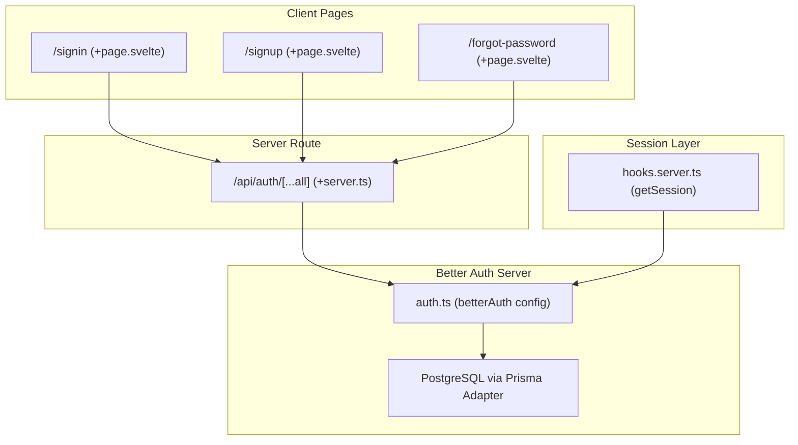
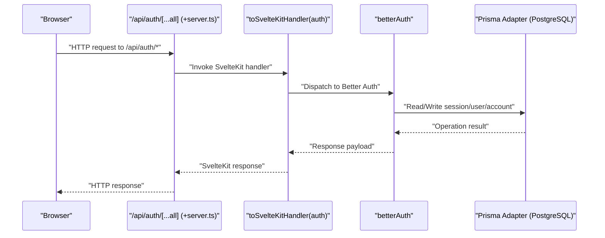
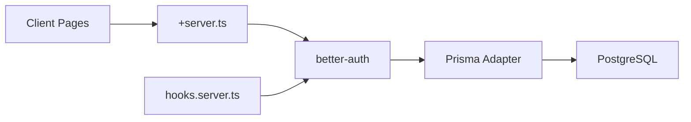

# Authentication API

<cite>
**Referenced Files in This Document**
- [auth.ts](file://src/lib/server/auth.ts)
- [+server.ts](file://src/routes/api/auth/[...all]/+server.ts)
- [hooks.server.ts](file://src/hooks.server.ts)
- [signin/+page.svelte](file://src/routes/signin/+page.svelte)
- [signup/+page.svelte](file://src/routes/signup/+page.svelte)
- [forgot-password/+page.svelte](file://src/routes/forgot-password/+page.svelte)
- [schema.prisma](file://prisma/schema.prisma)
- [package.json](file://package.json)
- [SKILL.md](file://.agents/skills/better-auth-best-practices/SKILL.md)
- [SKILL.MD](file://.agents/skills/better-auth-security-best-practices/SKILL.MD)
</cite>

## Table of Contents
1. [Introduction](#introduction)
2. [Project Structure](#project-structure)
3. [Core Components](#core-components)
4. [Architecture Overview](#architecture-overview)
5. [Detailed Component Analysis](#detailed-component-analysis)
6. [Dependency Analysis](#dependency-analysis)
7. [Performance Considerations](#performance-considerations)
8. [Troubleshooting Guide](#troubleshooting-guide)
9. [Conclusion](#conclusion)
10. [Appendices](#appendices)

## Introduction
This document provides comprehensive API documentation for Screenlog’s authentication endpoints powered by Better Auth. It covers all endpoints under /api/auth/*, including user registration, email-based login, logout, password reset initiation, and session management. It also documents HTTP methods, URL patterns, request/response schemas, authentication headers, error responses, security considerations, rate limiting, and practical client implementation examples for common authentication workflows.

## Project Structure
Screenlog integrates Better Auth via a SvelteKit-compatible route handler that forwards all /api/auth/* requests to Better Auth. The server-side configuration defines database adapter, session lifecycle, and security policies. Client pages demonstrate typical flows for email/password registration and login.

**Diagram sources**
- [+server.ts:1-7](file://src/routes/api/auth/[...all]/+server.ts#L1-L7)
- [auth.ts:1-27](file://src/lib/server/auth.ts#L1-L27)
- [hooks.server.ts:1-18](file://src/hooks.server.ts#L1-L18)
- [schema.prisma:1-258](file://prisma/schema.prisma#L1-L258)

**Section sources**
- [+server.ts:1-7](file://src/routes/api/auth/[...all]/+server.ts#L1-L7)
- [auth.ts:1-27](file://src/lib/server/auth.ts#L1-L27)
- [hooks.server.ts:1-18](file://src/hooks.server.ts#L1-L18)
- [schema.prisma:1-258](file://prisma/schema.prisma#L1-L258)

## Core Components
- Better Auth configuration: Defines database adapter, base URL, email/password settings, session lifecycle, trusted origins, and cookie prefix.
- SvelteKit route handler: Exposes a catch-all handler for /api/auth/* and delegates to Better Auth.
- Client pages: Demonstrate email/password registration and login flows against Better Auth endpoints.
- Session retrieval middleware: Attaches user/session to locals for protected routes.

Key configuration highlights:
- Email/password enabled with auto sign-in.
- Session expiration and update age configured.
- Trusted origins set to the base URL.
- Cookie prefix customized for the application.

**Section sources**
- [auth.ts:6-24](file://src/lib/server/auth.ts#L6-L24)
- [+server.ts:1-7](file://src/routes/api/auth/[...all]/+server.ts#L1-L7)
- [hooks.server.ts:4-17](file://src/hooks.server.ts#L4-L17)

## Architecture Overview
The authentication flow leverages Better Auth’s built-in endpoints behind /api/auth/*. Requests are routed through a SvelteKit server handler that converts Better Auth’s internal handlers to SvelteKit-compatible responses. Sessions are stored in the database via Prisma adapter and retrieved by the server hook for per-request access.

**Diagram sources**
- [+server.ts:1-7](file://src/routes/api/auth/[...all]/+server.ts#L1-L7)
- [auth.ts:1-27](file://src/lib/server/auth.ts#L1-L27)
- [schema.prisma:11-82](file://prisma/schema.prisma#L11-L82)

## Detailed Component Analysis

### Endpoint Catalog and Behavior
All Better Auth endpoints under /api/auth/* are exposed via the catch-all route handler. The following subsections describe the primary flows documented in this repository.

#### Registration: Email/Password
- Endpoint: POST /api/auth/sign-up/email
- Purpose: Create a new user account using email and password.
- Request body:
  - name: string (required)
  - email: string (required)
  - password: string (required)
- Response:
  - On success: 200 OK with session data.
  - On failure: 400 Bad Request with error message.
- Typical client behavior:
  - Submit registration form.
  - On success, redirect to home and optionally set user preferences.

Client example reference:
- [Registration flow in signup page:20-56](file://src/routes/signup/+page.svelte#L20-L56)

**Section sources**
- [signup/+page.svelte:20-56](file://src/routes/signup/+page.svelte#L20-L56)

#### Login: Email/Password
- Endpoint: POST /api/auth/sign-in/email
- Purpose: Authenticate a user with email and password.
- Request body:
  - email: string (required)
  - password: string (required)
- Response:
  - On success: 200 OK with session data.
  - On failure: 400 Bad Request with error message.
- Typical client behavior:
  - Submit login form.
  - On success, navigate to home.

Client example reference:
- [Login flow in sign-in page:11-35](file://src/routes/signin/+page.svelte#L11-L35)

**Section sources**
- [signin/+page.svelte:11-35](file://src/routes/signin/+page.svelte#L11-L35)

#### Logout
- Endpoint: POST /api/auth/sign-out
- Purpose: Invalidate the current session.
- Request:
  - No body required; session inferred from cookies.
- Response:
  - On success: 200 OK with empty body or confirmation.
- Typical client behavior:
  - Trigger logout action and clear local state.

Reference:
- [Logout endpoint in Better Auth client config](file://package.json#L33)

**Section sources**
- [package.json](file://package.json#L33)

#### Password Reset Initiation
- Endpoint: POST /api/auth/forgot-password
- Purpose: Send a password reset link to the provided email address.
- Request body:
  - email: string (required)
- Response:
  - On success: 200 OK with confirmation message.
  - On failure: 400 Bad Request with error message.
- Note: The frontend currently shows a placeholder flow; integrate the backend endpoint for full functionality.

Client example reference:
- [Forgot password page behavior:9-17](file://src/routes/forgot-password/+page.svelte#L9-L17)

**Section sources**
- [forgot-password/+page.svelte:9-17](file://src/routes/forgot-password/+page.svelte#L9-L17)

#### Session Verification and Refresh
- Endpoint: GET /api/auth/session
- Purpose: Verify and retrieve the current session.
- Request:
  - Authorization: Cookie-based (no explicit header required).
- Response:
  - On success: 200 OK with session data.
  - On failure: 401 Unauthorized.
- Typical client behavior:
  - Call during app initialization to hydrate user state.
  - Use for guarded route checks.

Reference:
- [Session retrieval in hooks.server.ts:6-8](file://src/hooks.server.ts#L6-L8)

**Section sources**
- [hooks.server.ts:6-8](file://src/hooks.server.ts#L6-L8)

### HTTP Methods and URL Patterns
- POST /api/auth/sign-up/email: Register a new user.
- POST /api/auth/sign-in/email: Authenticate a user.
- POST /api/auth/sign-out: End the current session.
- POST /api/auth/forgot-password: Initiate password reset.
- GET /api/auth/session: Retrieve current session.

These patterns are provided by Better Auth and exposed through the SvelteKit route handler.

**Section sources**
- [+server.ts:1-7](file://src/routes/api/auth/[...all]/+server.ts#L1-L7)
- [package.json](file://package.json#L33)

### Request and Response Schemas
- Common request bodies:
  - Registration: { name, email, password }
  - Login: { email, password }
  - Password reset: { email }
- Common response bodies:
  - Success: { session, user } (fields may vary by Better Auth version)
  - Error: { message, code?, errors? }
- Status codes:
  - 200 OK on success
  - 400 Bad Request on validation or authentication failure
  - 401 Unauthorized when session is missing or invalid

Notes:
- The exact field names and shapes depend on Better Auth’s current schema. Consult the Better Auth documentation for authoritative definitions.

**Section sources**
- [signin/+page.svelte:17-26](file://src/routes/signin/+page.svelte#L17-L26)
- [signup/+page.svelte:26-35](file://src/routes/signup/+page.svelte#L26-L35)
- [forgot-password/+page.svelte:9-17](file://src/routes/forgot-password/+page.svelte#L9-L17)

### Authentication Headers
- Cookies: Session cookies are managed automatically by Better Auth. Clients should enable cookie support and include cookies on subsequent requests.
- CORS/CSRF: Trusted origins are configured in the Better Auth setup. Ensure the frontend origin matches the configured base URL.

**Section sources**
- [auth.ts:20-20](file://src/lib/server/auth.ts#L20-L20)
- [auth.ts:11-11](file://src/lib/server/auth.ts#L11-L11)

### Error Responses
- Typical error fields:
  - message: Human-readable error description
  - code: Machine-readable error code (when provided)
  - errors: Structured validation errors (when applicable)
- Examples:
  - Invalid credentials: message indicates invalid email or password.
  - Validation failures: message reflects missing or invalid fields.

**Section sources**
- [signin/+page.svelte:23-26](file://src/routes/signin/+page.svelte#L23-L26)
- [signup/+page.svelte:32-35](file://src/routes/signup/+page.svelte#L32-L35)

### Security Considerations
- Secret management:
  - Use a strong, randomly generated secret via environment variables.
- Rate limiting:
  - Enabled by default in production; customize per-endpoint rules if needed.
- Session security:
  - Configure session expiration and update age.
  - Consider encrypted cookie caching strategies for sensitive data.
- Cookie security:
  - Secure, HttpOnly, SameSite, and custom cookie prefix are configurable.
- Trusted origins:
  - Restrict allowed origins to mitigate CSRF risks.
- IP tracking:
  - Configure IP headers for accurate rate limiting and auditing.

**Section sources**
- [SKILL.MD:30-46](file://.agents/skills/better-auth-security-best-practices/SKILL.MD#L30-L46)
- [SKILL.MD:151-181](file://.agents/skills/better-auth-security-best-practices/SKILL.MD#L151-L181)
- [SKILL.MD:182-201](file://.agents/skills/better-auth-security-best-practices/SKILL.MD#L182-L201)
- [SKILL.MD:339-417](file://.agents/skills/better-auth-security-best-practices/SKILL.MD#L339-L417)
- [auth.ts:10-11](file://src/lib/server/auth.ts#L10-L11)
- [auth.ts:20-20](file://src/lib/server/auth.ts#L20-L20)

### Rate Limiting
- Enabled by default in production environments.
- Customize storage and per-endpoint rules for endpoints like sign-in and sign-up.

**Section sources**
- [SKILL.MD:30-46](file://.agents/skills/better-auth-security-best-practices/SKILL.MD#L30-L46)
- [SKILL.MD:353-360](file://.agents/skills/better-auth-security-best-practices/SKILL.MD#L353-L360)

### Session Handling
- Session lifetime and refresh intervals are configurable.
- Sessions are persisted in the database via Prisma adapter.
- Server hook retrieves session for each request to populate event.locals.

**Section sources**
- [auth.ts:16-19](file://src/lib/server/auth.ts#L16-L19)
- [schema.prisma:33-46](file://prisma/schema.prisma#L33-L46)
- [hooks.server.ts:6-10](file://src/hooks.server.ts#L6-L10)

### Client Implementation Examples
Below are practical client workflows aligned with the repository’s pages and Better Auth endpoints.

#### User Registration with Email/Password
- Steps:
  - Collect name, email, password.
  - POST to /api/auth/sign-up/email with JSON body.
  - On success, redirect to home; optionally set user preferences.
- Example reference:
  - [Registration submission:26-35](file://src/routes/signup/+page.svelte#L26-L35)

**Section sources**
- [signup/+page.svelte:20-56](file://src/routes/signup/+page.svelte#L20-L56)

#### Email/Password Login
- Steps:
  - Collect email, password.
  - POST to /api/auth/sign-in/email with JSON body.
  - On success, navigate to home.
- Example reference:
  - [Login submission:17-26](file://src/routes/signin/+page.svelte#L17-L26)

**Section sources**
- [signin/+page.svelte:11-35](file://src/routes/signin/+page.svelte#L11-L35)

#### Session Verification
- Steps:
  - Call GET /api/auth/session to verify session validity.
  - Use returned session data to hydrate UI state.
- Example reference:
  - [Session retrieval in hooks:6-8](file://src/hooks.server.ts#L6-L8)

**Section sources**
- [hooks.server.ts:6-8](file://src/hooks.server.ts#L6-L8)

#### Logout
- Steps:
  - POST to /api/auth/sign-out.
  - Clear local session state and redirect to sign-in.
- Example reference:
  - [Logout endpoint availability](file://package.json#L33)

**Section sources**
- [package.json](file://package.json#L33)

#### Password Reset Initiation
- Steps:
  - Collect email.
  - POST to /api/auth/forgot-password with JSON body.
  - Show confirmation message if an account exists for the email.
- Example reference:
  - [Forgot password submission:9-17](file://src/routes/forgot-password/+page.svelte#L9-L17)

**Section sources**
- [forgot-password/+page.svelte:9-17](file://src/routes/forgot-password/+page.svelte#L9-L17)

### Social Login Integration
- Better Auth supports social providers. Configure provider credentials and enable OAuth flows in the Better Auth configuration.
- After successful OAuth, Better Auth manages sessions similarly to email/password flows.

**Section sources**
- [SKILL.md:54-54](file://.agents/skills/better-auth-best-practices/SKILL.md#L54-L54)
- [auth.ts:1-1](file://src/lib/server/auth.ts#L1-L1)

### Token Refresh Mechanisms
- Sessions refresh automatically based on configured update age.
- For client-driven refresh, call GET /api/auth/session to renew session cookies.

**Section sources**
- [auth.ts:18-18](file://src/lib/server/auth.ts#L18-L18)
- [hooks.server.ts:6-8](file://src/hooks.server.ts#L6-L8)

## Dependency Analysis
The authentication stack depends on Better Auth, SvelteKit, and Prisma for persistence. The route handler bridges Better Auth to SvelteKit, while the server hook integrates session data into the request lifecycle.

**Diagram sources**
- [+server.ts:1-7](file://src/routes/api/auth/[...all]/+server.ts#L1-L7)
- [auth.ts:1-27](file://src/lib/server/auth.ts#L1-L27)
- [hooks.server.ts:1-18](file://src/hooks.server.ts#L1-L18)
- [schema.prisma:1-258](file://prisma/schema.prisma#L1-L258)

**Section sources**
- [+server.ts:1-7](file://src/routes/api/auth/[...all]/+server.ts#L1-L7)
- [auth.ts:1-27](file://src/lib/server/auth.ts#L1-L27)
- [hooks.server.ts:1-18](file://src/hooks.server.ts#L1-L18)
- [schema.prisma:1-258](file://prisma/schema.prisma#L1-L258)

## Performance Considerations
- Session caching: Enable cookie caching strategies to reduce database load.
- Rate limiting: Tune window and max values per endpoint to balance security and usability.
- Database adapter: Ensure efficient indexing on user and session tables.

**Section sources**
- [SKILL.MD:166-181](file://.agents/skills/better-auth-security-best-practices/SKILL.MD#L166-L181)
- [SKILL.MD:30-46](file://.agents/skills/better-auth-security-best-practices/SKILL.MD#L30-L46)
- [schema.prisma:33-46](file://prisma/schema.prisma#L33-L46)

## Troubleshooting Guide
- Invalid credentials:
  - Symptom: 400 error with message indicating invalid email or password.
  - Resolution: Verify email/password correctness; ensure auto sign-in is enabled.
- Registration failures:
  - Symptom: 400 error with message indicating could not create account.
  - Resolution: Check validation rules and required fields.
- Session verification:
  - Symptom: 401 Unauthorized on GET /api/auth/session.
  - Resolution: Ensure cookies are included; confirm session validity.
- Rate limiting:
  - Symptom: 429 responses after repeated attempts.
  - Resolution: Reduce request frequency or adjust rate limit configuration.

**Section sources**
- [signin/+page.svelte:23-26](file://src/routes/signin/+page.svelte#L23-L26)
- [signup/+page.svelte:32-35](file://src/routes/signup/+page.svelte#L32-L35)
- [hooks.server.ts:6-14](file://src/hooks.server.ts#L6-L14)
- [SKILL.MD:30-46](file://.agents/skills/better-auth-security-best-practices/SKILL.MD#L30-L46)

## Conclusion
Screenlog’s authentication system is powered by Better Auth with a clean SvelteKit integration. The /api/auth/* endpoints provide robust support for email/password registration, login, logout, password reset initiation, and session management. By leveraging the provided configuration, client pages, and security best practices, developers can implement secure and reliable authentication flows tailored to Screenlog’s needs.

## Appendices

### Appendix A: Database Schema Highlights
- User: email, emailVerified, name, image, timestamps.
- Session: token, userId, expiresAt, timestamps, optional IP and UA.
- Account: providerId, accountId, tokens, scopes, timestamps.
- Verification: identifier, value, expiresAt, timestamps.

**Section sources**
- [schema.prisma:11-82](file://prisma/schema.prisma#L11-L82)