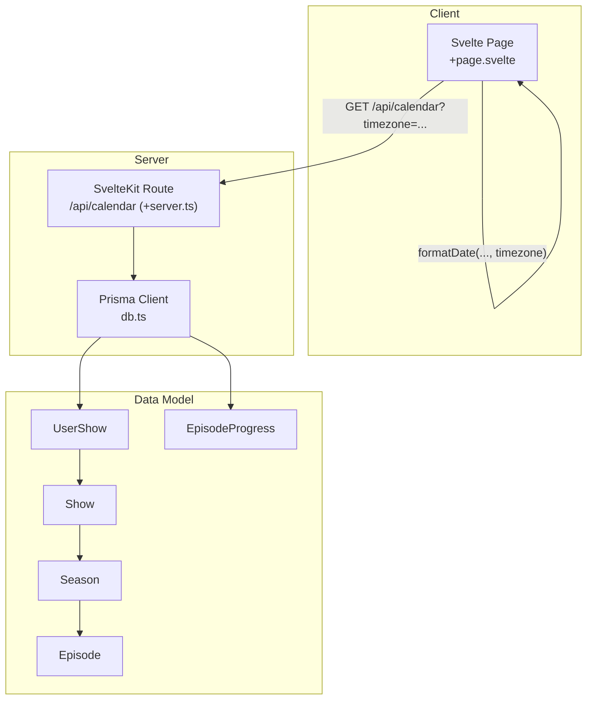
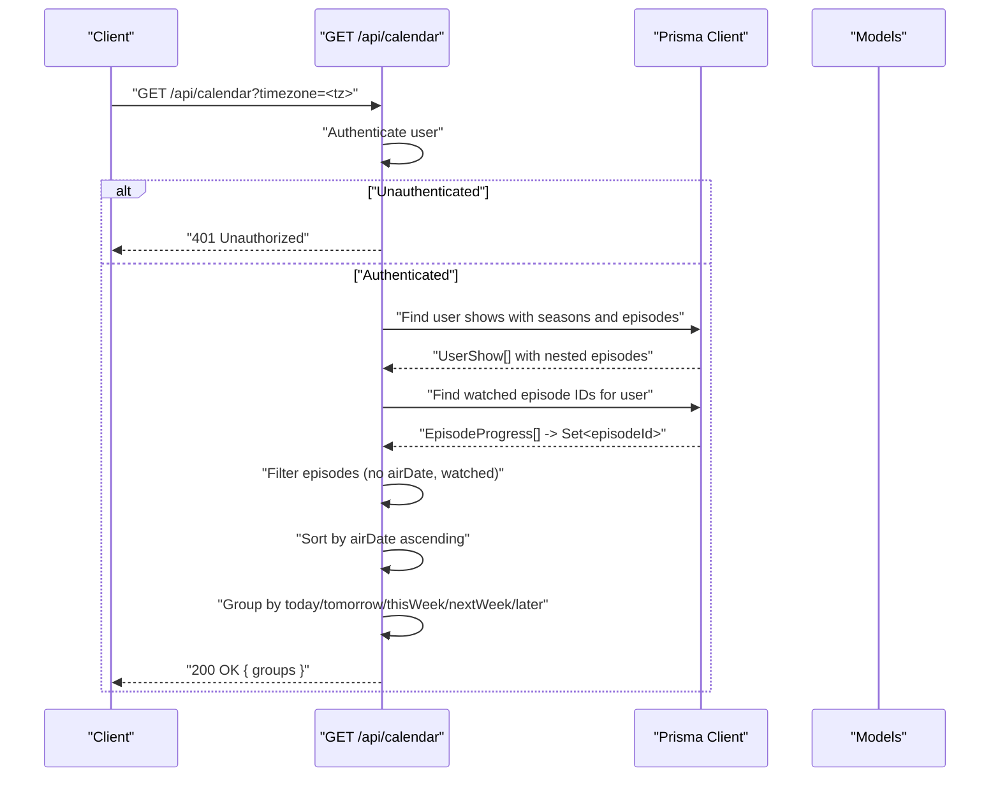
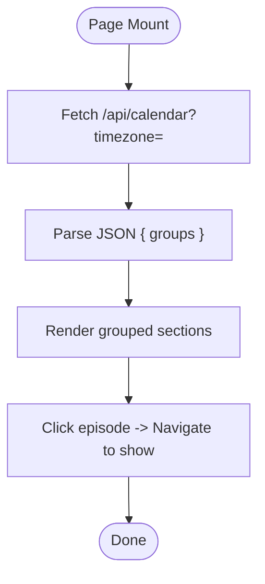
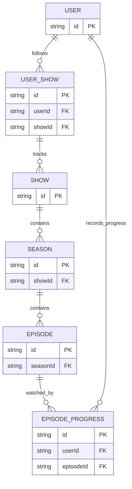
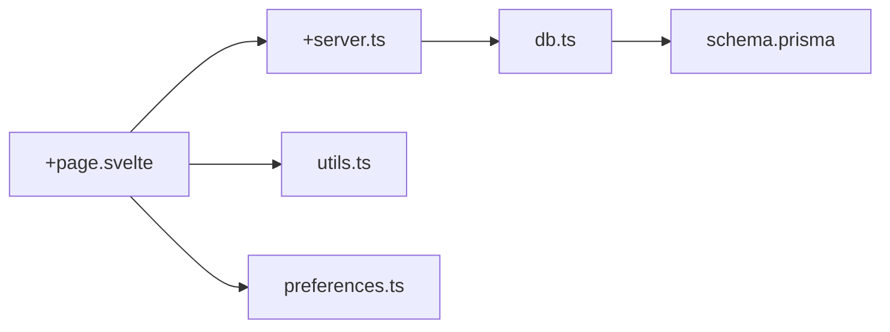

# Calendar API

<cite>
**Referenced Files in This Document**
- [+server.ts](file://src/routes/api/calendar/+server.ts)
- [+page.svelte](file://src/routes/(app)/calendar/+page.svelte)
- [db.ts](file://src/lib/server/db.ts)
- [schema.prisma](file://prisma/schema.prisma)
- [utils.ts](file://src/lib/utils.ts)
- [preferences.ts](file://src/lib/stores/preferences.ts)
</cite>

## Table of Contents
1. [Introduction](#introduction)
2. [Project Structure](#project-structure)
3. [Core Components](#core-components)
4. [Architecture Overview](#architecture-overview)
5. [Detailed Component Analysis](#detailed-component-analysis)
6. [Dependency Analysis](#dependency-analysis)
7. [Performance Considerations](#performance-considerations)
8. [Troubleshooting Guide](#troubleshooting-guide)
9. [Conclusion](#conclusion)
10. [Appendices](#appendices)

## Introduction
This document provides comprehensive API documentation for Screenlog’s calendar endpoint that surfaces upcoming episodes for authenticated users. It covers:
- Endpoint definition and HTTP method
- URL pattern and query parameters
- Response schema and grouping strategy
- Filtering logic (watched vs unwatched, future dates)
- Date/time handling and timezone management
- Frontend integration and calendar grouping
- Examples for fetching upcoming episodes and weekly schedule views
- Recommendations for calendar synchronization and notification delivery

## Project Structure
The calendar API is implemented as a SvelteKit server route and consumed by a Svelte page component. Supporting infrastructure includes:
- Database access via Prisma
- Data models for shows, seasons, episodes, and user progress
- Utility functions for date formatting and timezone enumeration
- A user preference store for timezone

**Diagram sources**
- [+server.ts:1-82](file://src/routes/api/calendar/+server.ts#L1-L82)
- [+page.svelte](file://src/routes/(app)/calendar/+page.svelte#L1-L93)
- [db.ts:1-11](file://src/lib/server/db.ts#L1-L11)
- [schema.prisma:184-226](file://prisma/schema.prisma#L184-L226)
- [utils.ts:8-30](file://src/lib/utils.ts#L8-L30)

**Section sources**
- [+server.ts:1-82](file://src/routes/api/calendar/+server.ts#L1-L82)
- [+page.svelte](file://src/routes/(app)/calendar/+page.svelte#L1-L93)
- [db.ts:1-11](file://src/lib/server/db.ts#L1-L11)
- [schema.prisma:84-146](file://prisma/schema.prisma#L84-L146)
- [utils.ts:8-30](file://src/lib/utils.ts#L8-L30)

## Core Components
- Calendar API route: Implements the GET handler for /api/calendar, authenticates users, queries episodes, filters by watch status and future dates, groups by day/week buckets, and returns grouped results.
- Frontend page: Fetches calendar data, displays grouped upcoming episodes, and formats dates using the user’s timezone.
- Database models: Shows, seasons, episodes, and episode progress define the data relationships used by the API.
- Utilities: Provide date formatting and timezone enumeration helpers used by the frontend.

Key behaviors:
- Authentication: Requires a logged-in user; otherwise returns unauthorized.
- Filtering: Excludes episodes without an air date and those already marked watched by the user.
- Grouping: Produces five groups: today, tomorrow, this week, next week, later.
- Timezone: Uses the timezone query parameter or defaults to Asia/Colombo.

**Section sources**
- [+server.ts:9-81](file://src/routes/api/calendar/+server.ts#L9-L81)
- [+page.svelte](file://src/routes/(app)/calendar/+page.svelte#L14-L28)
- [schema.prisma:128-146](file://prisma/schema.prisma#L128-L146)
- [utils.ts:8-30](file://src/lib/utils.ts#L8-L30)

## Architecture Overview
The calendar endpoint orchestrates data retrieval, filtering, sorting, and grouping before responding with a structured payload.

**Diagram sources**
- [+server.ts:9-81](file://src/routes/api/calendar/+server.ts#L9-L81)

## Detailed Component Analysis

### Endpoint Definition
- Method: GET
- URL Pattern: /api/calendar
- Query Parameters:
  - timezone: Optional. IANA timezone string. Defaults to Asia/Colombo if omitted.
- Authentication: Required. Returns 401 Unauthorized if not authenticated.
- Response: JSON object containing a groups field with keys today, tomorrow, thisWeek, nextWeek, later. Each key maps to an array of episode items.

Episode item schema (selected fields):
- id: string (episode identifier)
- showId: string
- showTitle: string
- posterPath: string | null
- seasonNumber: number
- episodeNumber: number
- episodeTitle: string
- airDate: string (ISO 8601)

Grouping logic:
- today: Episodes with air date equal to the current date in the user’s timezone.
- tomorrow: Episodes with air date equal to tomorrow’s date in the user’s timezone.
- thisWeek: Episodes with air date greater than today and less than or equal to the end of the current week in the user’s timezone.
- nextWeek: Episodes with air date greater than the end of the current week and less than or equal to the end of the next week in the user’s timezone.
- later: Episodes with air date beyond next week in the user’s timezone.

Filtering logic:
- Exclude episodes without an air date.
- Exclude episodes already marked watched by the user (based on EpisodeProgress records).
- Include only episodes on or after today in the user’s timezone.

Sorting:
- Episodes are sorted chronologically by airDate ascending.

**Section sources**
- [+server.ts:9-81](file://src/routes/api/calendar/+server.ts#L9-L81)

### Frontend Integration
- The Svelte page component fetches calendar data on mount using the user’s timezone store.
- It renders grouped sections (Today, Tomorrow, This Week, Next Week, Later) and displays episode metadata with localized date formatting.
- Navigation: Clicking an item navigates to the show detail page.

**Diagram sources**
- [+page.svelte](file://src/routes/(app)/calendar/+page.svelte#L14-L38)

**Section sources**
- [+page.svelte](file://src/routes/(app)/calendar/+page.svelte#L14-L38)

### Data Model Relationships
The API relies on the following Prisma models and relations:
- UserShow links users to shows and includes show details.
- Show contains seasons.
- Season contains episodes.
- EpisodeProgress tracks watched episodes per user.

**Diagram sources**
- [schema.prisma:84-146](file://prisma/schema.prisma#L84-L146)
- [schema.prisma:184-226](file://prisma/schema.prisma#L184-L226)

**Section sources**
- [schema.prisma:84-146](file://prisma/schema.prisma#L84-L146)
- [schema.prisma:184-226](file://prisma/schema.prisma#L184-L226)

### Date/Time Handling and Timezone Management
- Backend:
  - The endpoint accepts a timezone query parameter or defaults to Asia/Colombo.
  - A helper computes a date key in YYYY-MM-DD format for a given date and timezone using locale-aware formatting.
  - Sorting uses the ISO string representation of airDate.
- Frontend:
  - The page passes the user’s timezone to the API.
  - Dates are formatted for display using a utility that respects the provided timezone.

Supported timezones:
- Enumerated via Intl.supportedValuesOf('timeZone') when available; otherwise a curated list is returned.

**Section sources**
- [+server.ts:5-7](file://src/routes/api/calendar/+server.ts#L5-L7)
- [+server.ts](file://src/routes/api/calendar/+server.ts#L12)
- [+page.svelte](file://src/routes/(app)/calendar/+page.svelte#L16)
- [utils.ts:62-81](file://src/lib/utils.ts#L62-L81)

### Filtering Options
- Watched filter: Excludes episodes present in EpisodeProgress for the user.
- Future-only filter: Includes only episodes with airDate on or after today in the user’s timezone.
- Presence filter: Excludes episodes without an airDate.

These filters ensure the calendar shows only upcoming, unwatched episodes relevant to the user.

**Section sources**
- [+server.ts:20-24](file://src/routes/api/calendar/+server.ts#L20-L24)
- [+server.ts:33-36](file://src/routes/api/calendar/+server.ts#L33-L36)

### Response Schema
- groups: object
  - today: Episode[] (sorted ascending by airDate)
  - tomorrow: Episode[] (sorted ascending by airDate)
  - thisWeek: Episode[] (sorted ascending by airDate)
  - nextWeek: Episode[] (sorted ascending by airDate)
  - later: Episode[] (sorted ascending by airDate)

Each Episode item includes:
- id, showId, showTitle, posterPath, seasonNumber, episodeNumber, episodeTitle, airDate

**Section sources**
- [+server.ts:54-77](file://src/routes/api/calendar/+server.ts#L54-L77)

### Examples

- Example 1: Fetch upcoming episodes for a user in a specific timezone
  - Request: GET /api/calendar?timezone=America/New_York
  - Response: { groups: { today: [...], tomorrow: [...], thisWeek: [...], nextWeek: [...], later: [...] } }

- Example 2: Weekly schedule view
  - Request: GET /api/calendar?timezone=Europe/London
  - Behavior: The endpoint returns episodes grouped into thisWeek and nextWeek, enabling a weekly view.

- Example 3: Calendar integration
  - Frontend fetch: The page component calls /api/calendar with the user’s timezone and renders grouped sections.

- Example 4: Release notifications
  - Conceptual usage: Clients can poll the endpoint to detect episodes becoming “today” or “tomorrow” and trigger local notifications.

Note: Replace the timezone value with a valid IANA timezone string supported by the environment.

**Section sources**
- [+server.ts](file://src/routes/api/calendar/+server.ts#L12)
- [+page.svelte](file://src/routes/(app)/calendar/+page.svelte#L16)

## Dependency Analysis
- Route depends on:
  - Authentication via SvelteKit locals.user
  - Prisma client for data access
  - Helper function for timezone-aware date key computation
- Frontend depends on:
  - User timezone store
  - Utility functions for date formatting and poster URLs
- Data model dependencies:
  - UserShow → Show → Season → Episode
  - EpisodeProgress constrains watched episodes

**Diagram sources**
- [+page.svelte](file://src/routes/(app)/calendar/+page.svelte#L1-L93)
- [+server.ts:1-82](file://src/routes/api/calendar/+server.ts#L1-L82)
- [db.ts:1-11](file://src/lib/server/db.ts#L1-L11)
- [schema.prisma:84-146](file://prisma/schema.prisma#L84-L146)
- [utils.ts:8-30](file://src/lib/utils.ts#L8-L30)
- [preferences.ts:1-4](file://src/lib/stores/preferences.ts#L1-L4)

**Section sources**
- [+page.svelte](file://src/routes/(app)/calendar/+page.svelte#L1-L93)
- [+server.ts:1-82](file://src/routes/api/calendar/+server.ts#L1-L82)
- [db.ts:1-11](file://src/lib/server/db.ts#L1-L11)
- [schema.prisma:84-146](file://prisma/schema.prisma#L84-L146)
- [utils.ts:8-30](file://src/lib/utils.ts#L8-L30)
- [preferences.ts:1-4](file://src/lib/stores/preferences.ts#L1-L4)

## Performance Considerations
- Data retrieval:
  - The route loads user shows with nested seasons and episodes. Consider pagination or limiting seasons/episodes for very large libraries.
- Watched filtering:
  - EpisodeProgress lookup builds a set of watched IDs; ensure appropriate indexing in the database for efficient lookups.
- Sorting and grouping:
  - Sorting by airDate is O(n log n); grouping is O(n). For large datasets, consider precomputing date keys or caching grouped results per user.
- Timezone computations:
  - Using locale-aware date keys is robust but adds minor overhead; cache computed keys if repeated calculations occur frequently.
- Frontend rendering:
  - Rendering grouped lists is lightweight; avoid unnecessary re-renders by deriving state appropriately.

[No sources needed since this section provides general guidance]

## Troubleshooting Guide
- 401 Unauthorized:
  - Cause: Missing or invalid session.
  - Resolution: Ensure the user is authenticated before calling the endpoint.

- Empty groups:
  - Cause: No upcoming episodes, all episodes watched, or wrong timezone.
  - Resolution: Verify user’s timezone, ensure shows are added to the watchlist, and confirm episodes have air dates.

- Incorrect dates:
  - Cause: Misaligned timezone or date parsing.
  - Resolution: Confirm the timezone parameter matches the user’s intended timezone and that airDate is stored consistently.

- Frontend errors:
  - Symptom: Toast indicates failure to load calendar.
  - Resolution: Check network tab for request failures and console logs for exceptions.

**Section sources**
- [+server.ts](file://src/routes/api/calendar/+server.ts#L10)
- [+page.svelte](file://src/routes/(app)/calendar/+page.svelte#L19-L21)

## Conclusion
The Calendar API provides a concise, user-focused view of upcoming episodes by combining user-specific data, watch progress, and timezone-aware date handling. Its simple grouping and straightforward schema enable easy integration for weekly views and basic notification triggers. For production-scale deployments, consider optimizing queries, adding caching, and supporting pagination to improve responsiveness.

[No sources needed since this section summarizes without analyzing specific files]

## Appendices

### API Reference Summary
- Endpoint: GET /api/calendar
- Query Parameters:
  - timezone: IANA timezone string (optional; defaults to Asia/Colombo)
- Response:
  - groups: { today, tomorrow, thisWeek, nextWeek, later }, each mapping to an array of episode items
- Episode Item Fields:
  - id, showId, showTitle, posterPath, seasonNumber, episodeNumber, episodeTitle, airDate

**Section sources**
- [+server.ts](file://src/routes/api/calendar/+server.ts#L12)
- [+server.ts:54-77](file://src/routes/api/calendar/+server.ts#L54-L77)