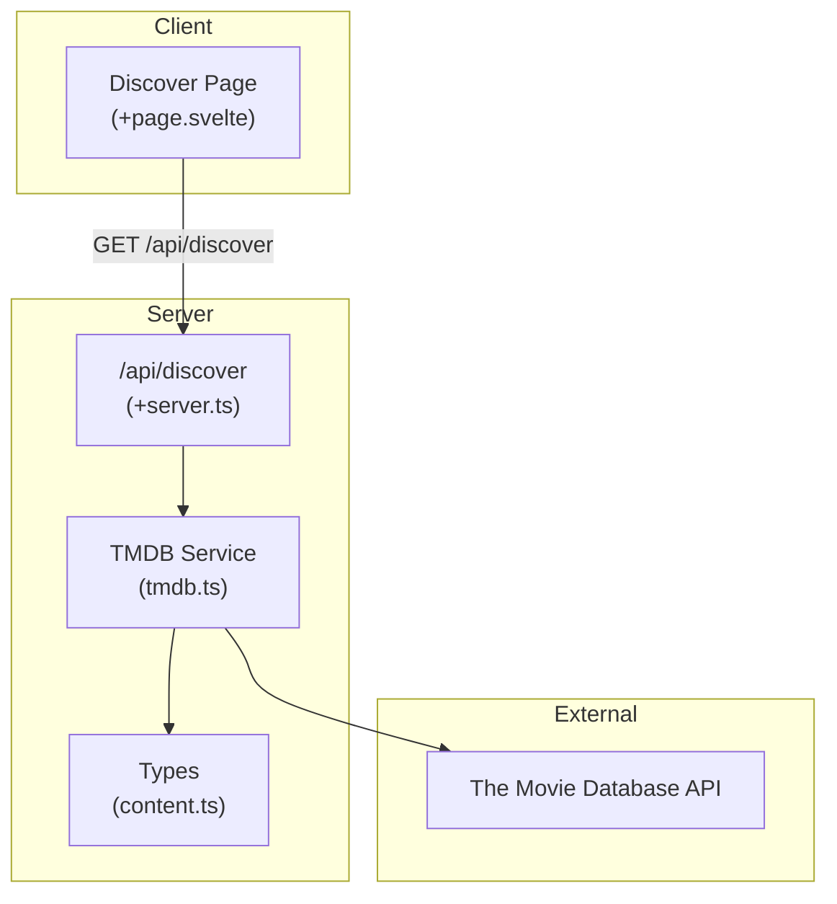
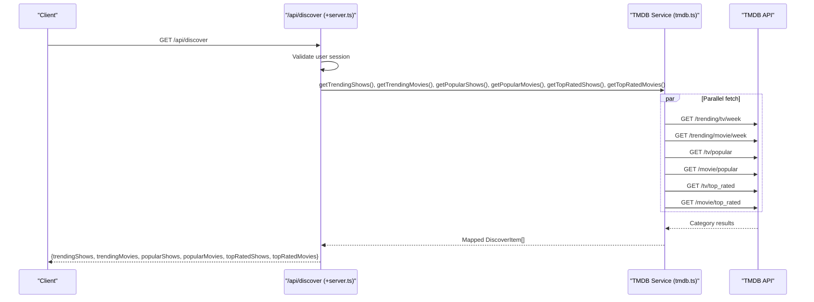
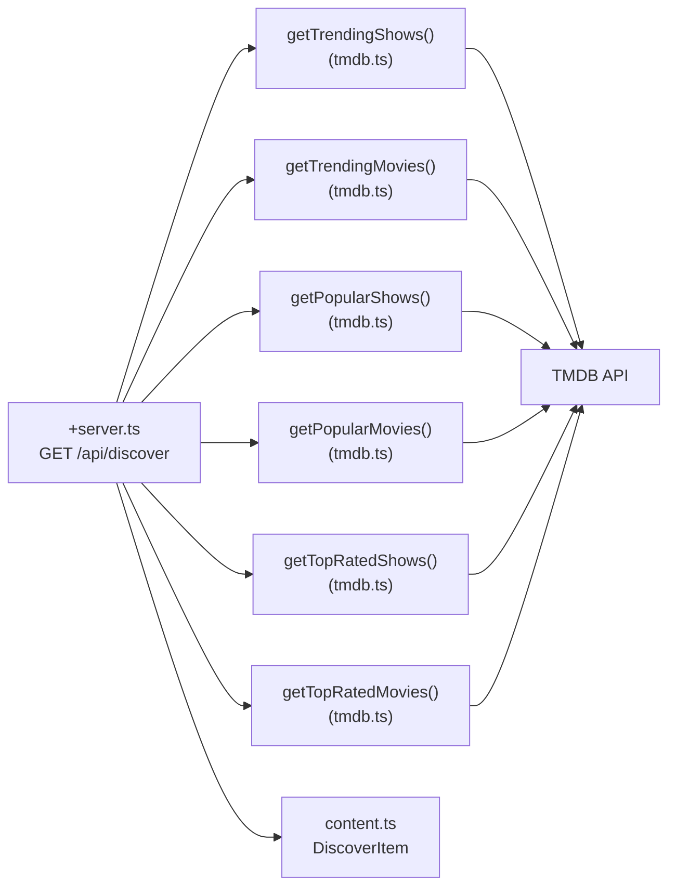

# Content Discovery API

<cite>
**Referenced Files in This Document**
- [+server.ts](file://src/routes/api/discover/+server.ts)
- [tmdb.ts](file://src/lib/services/tmdb.ts)
- [content.ts](file://src/lib/types/content.ts)
- [+page.svelte](file://src/routes/(app)/discover/+page.svelte)
- [hooks.server.ts](file://src/hooks.server.ts)
- [schema.prisma](file://prisma/schema.prisma)
- [package.json](file://package.json)
</cite>

## Table of Contents
1. [Introduction](#introduction)
2. [Project Structure](#project-structure)
3. [Core Components](#core-components)
4. [Architecture Overview](#architecture-overview)
5. [Detailed Component Analysis](#detailed-component-analysis)
6. [Dependency Analysis](#dependency-analysis)
7. [Performance Considerations](#performance-considerations)
8. [Troubleshooting Guide](#troubleshooting-guide)
9. [Conclusion](#conclusion)

## Introduction
This document describes the content discovery API endpoints used to surface trending, popular, and top-rated movies and TV shows. It covers HTTP methods, URL patterns, request and response schemas, pagination behavior, TMDB integration, and operational guidance for caching and performance. It also documents rate limiting and error handling for external API failures.

## Project Structure
The discovery feature is implemented as a SvelteKit server route that aggregates multiple TMDB endpoints and returns a single response grouped by categories. The frontend renders these categories on the Discover page.

**Diagram sources**
- [+server.ts:1-20](file://src/routes/api/discover/+server.ts#L1-L20)
- [tmdb.ts:1-166](file://src/lib/services/tmdb.ts#L1-L166)
- [content.ts:77-86](file://src/lib/types/content.ts#L77-L86)
- [+page.svelte](file://src/routes/(app)/discover/+page.svelte#L12-L21)

**Section sources**
- [+server.ts:1-20](file://src/routes/api/discover/+server.ts#L1-L20)
- [tmdb.ts:1-166](file://src/lib/services/tmdb.ts#L1-L166)
- [content.ts:77-86](file://src/lib/types/content.ts#L77-L86)
- [+page.svelte](file://src/routes/(app)/discover/+page.svelte#L12-L21)

## Core Components
- Server route: Aggregates trending, popular, and top-rated content for both shows and movies.
- TMDB service: Wraps TMDB API calls and maps responses to internal types.
- Frontend page: Fetches and renders the discovery sections.

Key behaviors:
- Authentication: All discovery endpoints require a valid user session.
- Parallelization: The server route concurrently fetches all six categories.
- Response shape: A single JSON object containing categorized arrays.

**Section sources**
- [+server.ts:5-20](file://src/routes/api/discover/+server.ts#L5-L20)
- [tmdb.ts:106-140](file://src/lib/services/tmdb.ts#L106-L140)
- [content.ts:77-86](file://src/lib/types/content.ts#L77-L86)
- [+page.svelte](file://src/routes/(app)/discover/+page.svelte#L12-L21)

## Architecture Overview
The discovery API is a thin aggregation layer over TMDB. The server route invokes multiple TMDB endpoints concurrently, transforms the results into a unified shape, and returns them to the client.

**Diagram sources**
- [+server.ts:8-15](file://src/routes/api/discover/+server.ts#L8-L15)
- [tmdb.ts:106-140](file://src/lib/services/tmdb.ts#L106-L140)

## Detailed Component Analysis

### Endpoint Definition
- Method: GET
- URL: /api/discover
- Authentication: Required (user session must be present)
- Response: JSON object with six fields, each an array of DiscoverItem entries

Response schema outline:
- trendingShows: DiscoverItem[]
- trendingMovies: DiscoverItem[]
- popularShows: DiscoverItem[]
- popularMovies: DiscoverItem[]
- topRatedShows: DiscoverItem[]
- topRatedMovies: DiscoverItem[]

DiscoverItem fields:
- id: string
- tmdbId: number
- title: string
- posterPath: string | null
- backdropPath: string | null
- year: string | null
- type: "show" | "movie"
- genres: string[]

Pagination:
- No pagination parameters are supported.
- Each category returns a fixed-size slice (approximately 20 items).

Query parameters:
- None for this endpoint.

Examples:
- Fetch trending movies: GET /api/discover → response.trendingMovies
- Fetch popular TV shows: GET /api/discover → response.popularShows
- Fetch top-rated content by genre: Not supported by this endpoint; see limitations.

Notes:
- Genre filtering is not exposed by this endpoint.
- Region/language are not configurable here; the service uses a fixed language setting.

**Section sources**
- [+server.ts:5-20](file://src/routes/api/discover/+server.ts#L5-L20)
- [tmdb.ts:106-140](file://src/lib/services/tmdb.ts#L106-L140)
- [content.ts:77-86](file://src/lib/types/content.ts#L77-L86)

### TMDB Integration Details
- Base URL: https://api.themoviedb.org/3
- Authorization: Uses a private environment variable for bearer token.
- Supported endpoints:
  - Trending: /trending/tv/week, /trending/movie/week
  - Popular: /tv/popular, /movie/popular
  - Top rated: /tv/top_rated, /movie/top_rated
- Response mapping:
  - TV shows mapped to DiscoverItem with type "show".
  - Movies mapped to DiscoverItem with type "movie".
- Error handling:
  - Non-OK responses raise an error with status and message.
  - Caller should handle errors and return appropriate HTTP status.

**Section sources**
- [tmdb.ts:4-17](file://src/lib/services/tmdb.ts#L4-L17)
- [tmdb.ts:106-140](file://src/lib/services/tmdb.ts#L106-L140)

### Frontend Consumption
- The Discover page fetches /api/discover on mount and renders six horizontal sections.
- Each section corresponds to a category returned by the server.

**Section sources**
- [+page.svelte](file://src/routes/(app)/discover/+page.svelte#L12-L21)
- [+page.svelte](file://src/routes/(app)/discover/+page.svelte#L66-L73)

### Authentication and Authorization
- The server route checks for a valid user session and returns 401 Unauthorized if absent.
- The session is resolved in hooks using the Better Auth integration.

**Section sources**
- [+server.ts](file://src/routes/api/discover/+server.ts#L6)
- [hooks.server.ts:4-17](file://src/hooks.server.ts#L4-L17)

## Dependency Analysis
- Server route depends on TMDB service functions for each category.
- TMDB service depends on:
  - Environment variable for API key
  - TMDB HTTP API
  - Internal types for mapping
- Frontend depends on the server route for data.

**Diagram sources**
- [+server.ts:8-15](file://src/routes/api/discover/+server.ts#L8-L15)
- [tmdb.ts:106-140](file://src/lib/services/tmdb.ts#L106-L140)
- [content.ts:77-86](file://src/lib/types/content.ts#L77-L86)

**Section sources**
- [+server.ts:1-20](file://src/routes/api/discover/+server.ts#L1-L20)
- [tmdb.ts:1-166](file://src/lib/services/tmdb.ts#L1-L166)
- [content.ts:77-86](file://src/lib/types/content.ts#L77-L86)

## Performance Considerations
- Concurrency: The server route uses concurrent fetches for all categories, reducing total latency.
- Payload size: Each category returns a bounded number of items; keep this in mind when considering caching strategies.
- Caching:
  - Static categories (trending/popular/top rated) change over time; cache with short TTLs (e.g., minutes).
  - Consider caching at CDN edge or reverse proxy for repeated requests.
- Pagination: Not applicable for this endpoint; avoid requesting large pages.
- External API limits: Respect TMDB rate limits; consider staggered retries and exponential backoff on 429/5xx.
- Database egress: While discovery does not query the local database, the project uses Prisma with Neon Postgres; follow general egress optimization practices for other endpoints.

[No sources needed since this section provides general guidance]

## Troubleshooting Guide
Common issues and resolutions:
- Unauthorized:
  - Cause: Missing or invalid session.
  - Resolution: Ensure the user is logged in; the route returns 401 Unauthorized.
- TMDB errors:
  - Cause: Non-OK HTTP responses from TMDB.
  - Resolution: The service throws an error with status and message; callers should catch and return 500.
- Empty results:
  - Cause: No items returned by TMDB for the requested category.
  - Resolution: Verify category and language settings; retry after a delay.
- Rate limiting:
  - Cause: Exceeding TMDB request quotas.
  - Resolution: Implement client-side backoff and consider server-side caching.

Operational tips:
- Monitor TMDB response times and error rates.
- Log upstream errors with status codes for debugging.
- Consider circuit breakers for upstream failures.

**Section sources**
- [+server.ts:6-19](file://src/routes/api/discover/+server.ts#L6-L19)
- [tmdb.ts:14-17](file://src/lib/services/tmdb.ts#L14-L17)

## Conclusion
The Content Discovery API provides a consolidated view of trending, popular, and top-rated movies and TV shows by aggregating TMDB endpoints. It is designed for simplicity and speed, with concurrency and a fixed payload size. For production deployments, pair this endpoint with short-lived caching, robust error handling, and careful monitoring of TMDB quotas.