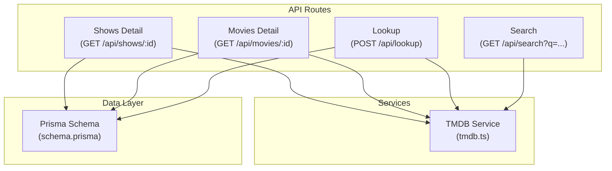
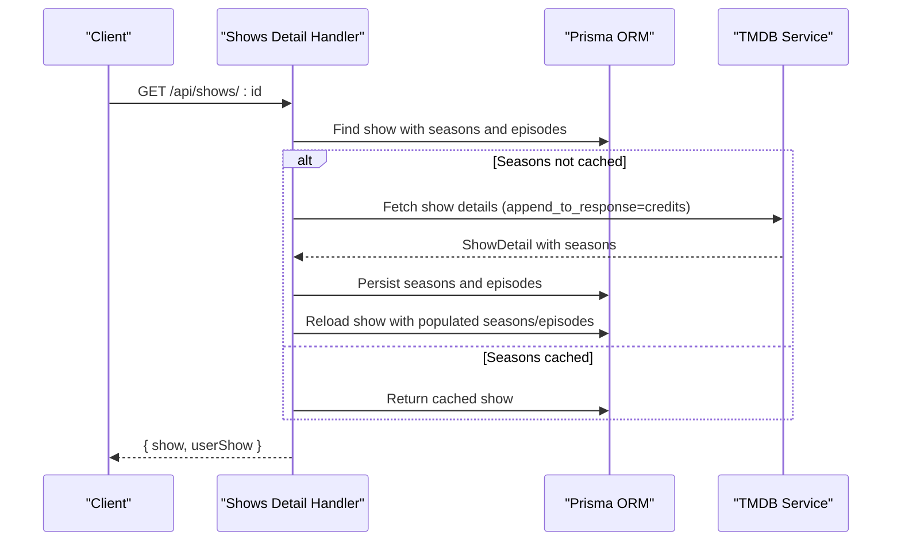
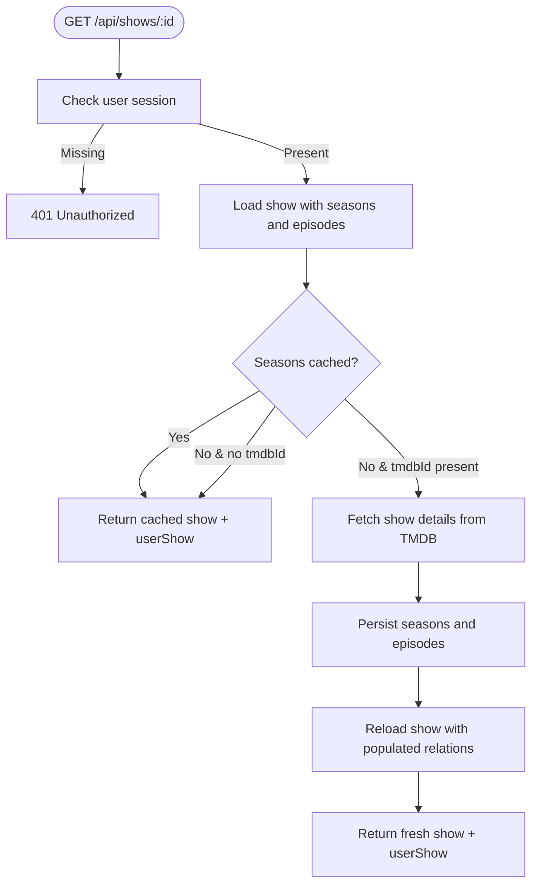
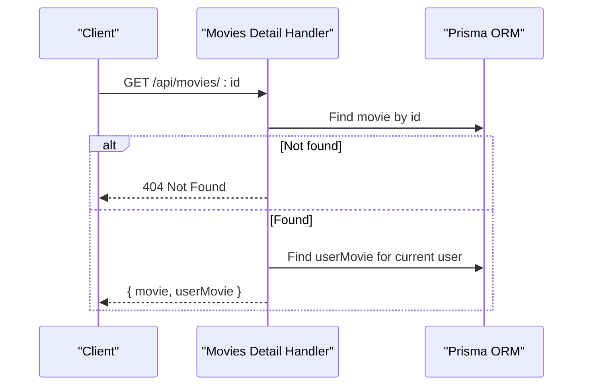
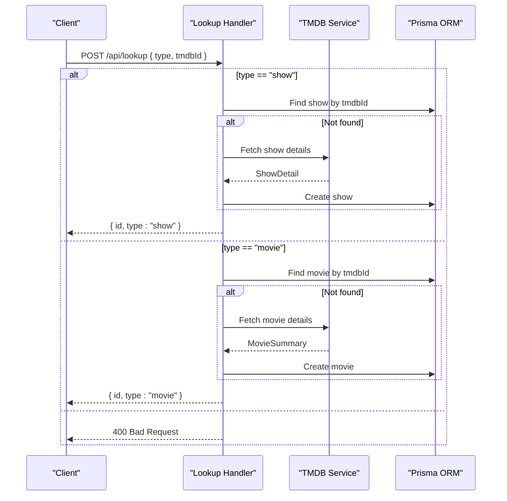
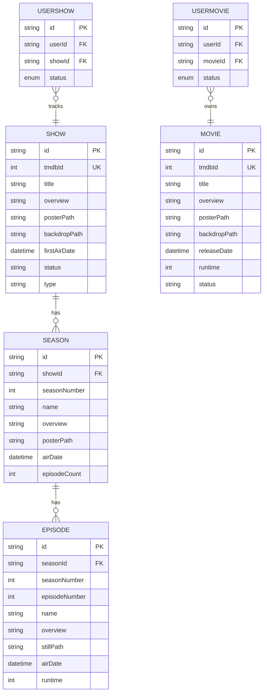
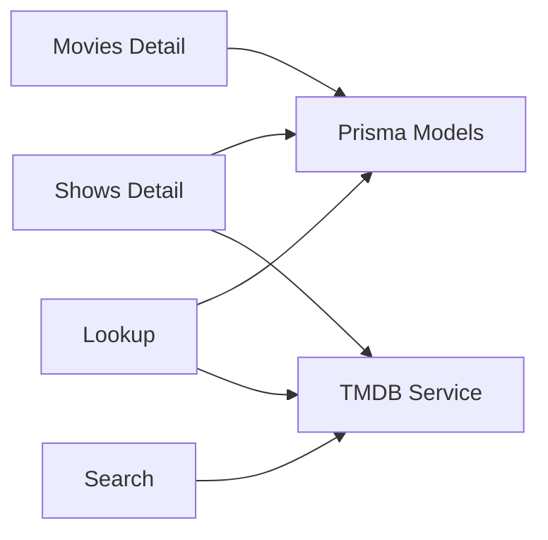

# Content Management API

<cite>
**Referenced Files in This Document**
- [shows/[id]/+server.ts](file://src/routes/api/shows/[id]/+server.ts)
- [movies/[id]/+server.ts](file://src/routes/api/movies/[id]/+server.ts)
- [lookup/+server.ts](file://src/routes/api/lookup/+server.ts)
- [search/+server.ts](file://src/routes/api/search/+server.ts)
- [tmdb.ts](file://src/lib/services/tmdb.ts)
- [content.ts](file://src/lib/types/content.ts)
- [utils.ts](file://src/lib/utils.ts)
- [schema.prisma](file://prisma/schema.prisma)
</cite>

## Table of Contents
1. [Introduction](#introduction)
2. [Project Structure](#project-structure)
3. [Core Components](#core-components)
4. [Architecture Overview](#architecture-overview)
5. [Detailed Component Analysis](#detailed-component-analysis)
6. [Dependency Analysis](#dependency-analysis)
7. [Performance Considerations](#performance-considerations)
8. [Troubleshooting Guide](#troubleshooting-guide)
9. [Conclusion](#conclusion)

## Introduction
This document provides comprehensive API documentation for Screenlog's content detail and lookup endpoints. It covers:
- Show and movie detail retrieval endpoints
- Episode information for TV shows
- HTTP methods, URL patterns, and request/response schemas
- Metadata enrichment from TMDB API
- Image URL construction and caching behavior
- Error handling for missing content and API errors

## Project Structure
The relevant API endpoints are located under the SvelteKit routes API directory:
- Shows detail endpoint: `/src/routes/api/shows/[id]/+server.ts`
- Movies detail endpoint: `/src/routes/api/movies/[id]/+server.ts`
- Lookup endpoint: `/src/routes/api/lookup/+server.ts`
- Search endpoint: `/src/routes/api/search/+server.ts`
- TMDB service: `/src/lib/services/tmdb.ts`
- Types: `/src/lib/types/content.ts`
- Utilities: `/src/lib/utils.ts`
- Database schema: `/prisma/schema.prisma`

**Diagram sources**
- [shows/[id]/+server.ts](file://src/routes/api/shows/[id]/+server.ts#L1-L63)
- [movies/[id]/+server.ts](file://src/routes/api/movies/[id]/+server.ts#L1-L19)
- [lookup/+server.ts:1-53](file://src/routes/api/lookup/+server.ts#L1-L53)
- [search/+server.ts:1-16](file://src/routes/api/search/+server.ts#L1-L16)
- [tmdb.ts:1-167](file://src/lib/services/tmdb.ts#L1-L167)
- [schema.prisma:84-166](file://prisma/schema.prisma#L84-L166)

**Section sources**
- [shows/[id]/+server.ts](file://src/routes/api/shows/[id]/+server.ts#L1-L63)
- [movies/[id]/+server.ts](file://src/routes/api/movies/[id]/+server.ts#L1-L19)
- [lookup/+server.ts:1-53](file://src/routes/api/lookup/+server.ts#L1-L53)
- [search/+server.ts:1-16](file://src/routes/api/search/+server.ts#L1-L16)
- [tmdb.ts:1-167](file://src/lib/services/tmdb.ts#L1-L167)
- [content.ts:1-116](file://src/lib/types/content.ts#L1-L116)
- [utils.ts:50-60](file://src/lib/utils.ts#L50-L60)
- [schema.prisma:84-166](file://prisma/schema.prisma#L84-L166)

## Core Components
- Shows Detail Endpoint: Retrieves show details, seasons, and episodes. On first access without cached seasons, it fetches from TMDB and persists seasons and episodes to the database.
- Movies Detail Endpoint: Retrieves movie details and associated user movie record.
- Lookup Endpoint: Creates or retrieves local content IDs for shows or movies using TMDB IDs.
- TMDB Service: Wraps TMDB API calls, handles authentication, and normalizes responses into typed structures.
- Utilities: Provides image URL helpers for posters/backdrops and other formatting utilities.

Key behaviors:
- Authentication: All endpoints require a valid user session; unauthorized requests receive a 401 response.
- Caching: Shows cache seasons and episodes locally; subsequent requests return cached data.
- Enrichment: Show details include cast credits via TMDB's append_to_response parameter.

**Section sources**
- [shows/[id]/+server.ts](file://src/routes/api/shows/[id]/+server.ts#L6-L62)
- [movies/[id]/+server.ts](file://src/routes/api/movies/[id]/+server.ts#L5-L18)
- [lookup/+server.ts:6-52](file://src/routes/api/lookup/+server.ts#L6-L52)
- [tmdb.ts:39-67](file://src/lib/services/tmdb.ts#L39-L67)
- [utils.ts:50-60](file://src/lib/utils.ts#L50-L60)

## Architecture Overview
The API follows a layered architecture:
- Route handlers validate authentication and orchestrate data retrieval.
- Services encapsulate TMDB integration and response normalization.
- Prisma models represent persisted content and relationships.
- Utilities provide consistent image URL generation.

**Diagram sources**
- [shows/[id]/+server.ts](file://src/routes/api/shows/[id]/+server.ts#L9-L58)
- [tmdb.ts:39-67](file://src/lib/services/tmdb.ts#L39-L67)

**Section sources**
- [shows/[id]/+server.ts](file://src/routes/api/shows/[id]/+server.ts#L6-L62)
- [tmdb.ts:39-67](file://src/lib/services/tmdb.ts#L39-L67)
- [schema.prisma:84-146](file://prisma/schema.prisma#L84-L146)

## Detailed Component Analysis

### Shows Detail Endpoint
- Method: GET
- URL: `/api/shows/:id`
- Authentication: Required (401 Unauthorized if missing)
- Behavior:
  - Loads show with nested seasons and episodes.
  - If no seasons are cached and a TMDB ID exists, fetches show details from TMDB, creates seasons and episodes, then reloads the show.
  - Returns both the show object and the user's show status record.
- Query parameters: None
- Response schema:
  - show: ShowDetail with seasons and episodes populated
  - userShow: UserShow record for the current user and show
- Error responses:
  - 404 Not Found if the show does not exist
  - 500 Internal Server Error on unexpected failures

**Diagram sources**
- [shows/[id]/+server.ts](file://src/routes/api/shows/[id]/+server.ts#L6-L58)
- [tmdb.ts:39-67](file://src/lib/services/tmdb.ts#L39-L67)

**Section sources**
- [shows/[id]/+server.ts](file://src/routes/api/shows/[id]/+server.ts#L6-L62)

### Movies Detail Endpoint
- Method: GET
- URL: `/api/movies/:id`
- Authentication: Required (401 Unauthorized if missing)
- Behavior:
  - Loads movie by ID.
  - Returns the movie object and the user's movie status record.
- Query parameters: None
- Response schema:
  - movie: MovieSummary
  - userMovie: UserMovie record for the current user and movie
- Error responses:
  - 404 Not Found if the movie does not exist
  - 500 Internal Server Error on unexpected failures

**Diagram sources**
- [movies/[id]/+server.ts](file://src/routes/api/movies/[id]/+server.ts#L5-L18)

**Section sources**
- [movies/[id]/+server.ts](file://src/routes/api/movies/[id]/+server.ts#L5-L18)

### Lookup Endpoint
- Method: POST
- URL: `/api/lookup`
- Authentication: Required (401 Unauthorized if missing)
- Request body:
  - type: "show" or "movie"
  - tmdbId: integer TMDB ID
- Behavior:
  - If type is "show": finds or creates a Show record using tmdbId, then returns the local ID.
  - If type is "movie": finds or creates a Movie record using tmdbId, then returns the local ID.
  - Invalid type returns 400 Bad Request.
- Response schema:
  - id: string local content ID
  - type: "show" or "movie"
- Error responses:
  - 400 Bad Request for invalid type
  - 500 Internal Server Error on unexpected failures

**Diagram sources**
- [lookup/+server.ts:6-52](file://src/routes/api/lookup/+server.ts#L6-L52)
- [tmdb.ts:39-104](file://src/lib/services/tmdb.ts#L39-L104)

**Section sources**
- [lookup/+server.ts:6-52](file://src/routes/api/lookup/+server.ts#L6-L52)

### Search Endpoint
- Method: GET
- URL: `/api/search?q=...`
- Authentication: Required (401 Unauthorized if missing)
- Query parameters:
  - q: search query string
- Behavior:
  - Calls TMDB multi-search and filters to TV and movie results.
  - Returns normalized search results.
- Response schema:
  - results: array of SearchResult items
- Error responses:
  - 500 Internal Server Error on unexpected failures

**Section sources**
- [search/+server.ts:5-15](file://src/routes/api/search/+server.ts#L5-L15)
- [tmdb.ts:19-37](file://src/lib/services/tmdb.ts#L19-L37)
- [content.ts:1-11](file://src/lib/types/content.ts#L1-L11)

### Data Models and Relationships
The following ER diagram shows the core content models and their relationships:

**Diagram sources**
- [schema.prisma:84-212](file://prisma/schema.prisma#L84-L212)

**Section sources**
- [schema.prisma:84-212](file://prisma/schema.prisma#L84-L212)

### Response Schemas

#### ShowDetail
- Fields: id, tmdbId, title, overview, posterPath, backdropPath, firstAirDate, status, genres, network, seasons
- seasons: array of SeasonSummary
- Seasons include seasonNumber, name, overview, posterPath, airDate, episodeCount

**Section sources**
- [content.ts:26-28](file://src/lib/types/content.ts#L26-L28)
- [content.ts:30-38](file://src/lib/types/content.ts#L30-L38)

#### SeasonSummary
- Fields: id, seasonNumber, name, overview, posterPath, airDate, episodeCount

**Section sources**
- [content.ts:30-38](file://src/lib/types/content.ts#L30-L38)

#### EpisodeSummary
- Fields: id, seasonId, seasonNumber, episodeNumber, name, overview, stillPath, airDate, runtime

**Section sources**
- [content.ts:40-50](file://src/lib/types/content.ts#L40-L50)

#### MovieSummary
- Fields: id, tmdbId, title, overview, posterPath, backdropPath, releaseDate, runtime, genres, status

**Section sources**
- [content.ts:52-63](file://src/lib/types/content.ts#L52-L63)

#### SearchResult
- Fields: id, tmdbId, title, overview, posterPath, backdropPath, year, type, genres

**Section sources**
- [content.ts:1-11](file://src/lib/types/content.ts#L1-L11)

### Image URL Construction
- Poster and backdrop images are constructed using TMDB's image base URL with sizing parameters.
- Helpers:
  - getPosterUrl(path, size): returns https://image.tmdb.org/t/p/{size}{path} if path is not absolute
  - getBackdropUrl(path, size): returns https://image.tmdb.org/t/p/{size}{path} if path is not absolute

**Section sources**
- [utils.ts:50-60](file://src/lib/utils.ts#L50-L60)

### Metadata Enrichment from TMDB
- Shows: Details fetched with append_to_response=credits to include cast information.
- Movies: Details fetched without additional append_to_response.
- Trending, popular, and top-rated lists are exposed via dedicated endpoints.

**Section sources**
- [tmdb.ts:39-67](file://src/lib/services/tmdb.ts#L39-L67)
- [tmdb.ts:88-104](file://src/lib/services/tmdb.ts#L88-L104)
- [tmdb.ts:106-140](file://src/lib/services/tmdb.ts#L106-L140)

## Dependency Analysis
- Shows Detail depends on:
  - Prisma models for Show, Season, Episode
  - TMDB service for show details and season episodes
- Movies Detail depends on:
  - Prisma models for Movie
  - No external API call for movie details
- Lookup depends on:
  - Prisma models for Show/Movie
  - TMDB service for creation when records are missing
- Search depends on:
  - TMDB service for multi-search

**Diagram sources**
- [shows/[id]/+server.ts](file://src/routes/api/shows/[id]/+server.ts#L1-L63)
- [movies/[id]/+server.ts](file://src/routes/api/movies/[id]/+server.ts#L1-L19)
- [lookup/+server.ts:1-53](file://src/routes/api/lookup/+server.ts#L1-L53)
- [search/+server.ts:1-16](file://src/routes/api/search/+server.ts#L1-L16)
- [tmdb.ts:1-167](file://src/lib/services/tmdb.ts#L1-L167)
- [schema.prisma:84-166](file://prisma/schema.prisma#L84-L166)

**Section sources**
- [shows/[id]/+server.ts](file://src/routes/api/shows/[id]/+server.ts#L1-L63)
- [movies/[id]/+server.ts](file://src/routes/api/movies/[id]/+server.ts#L1-L19)
- [lookup/+server.ts:1-53](file://src/routes/api/lookup/+server.ts#L1-L53)
- [search/+server.ts:1-16](file://src/routes/api/search/+server.ts#L1-L16)
- [tmdb.ts:1-167](file://src/lib/services/tmdb.ts#L1-L167)
- [schema.prisma:84-166](file://prisma/schema.prisma#L84-L166)

## Performance Considerations
- Caching: Shows detail caches seasons and episodes locally after first access, reducing repeated TMDB calls.
- Batch operations: Discovery endpoints use Promise.all to fetch multiple lists concurrently.
- Image URLs: Using standardized sizes reduces bandwidth and improves rendering performance.

[No sources needed since this section provides general guidance]

## Troubleshooting Guide
Common issues and resolutions:
- Unauthorized Access
  - Symptom: 401 Unauthorized
  - Cause: Missing or invalid user session
  - Resolution: Authenticate the user before calling these endpoints
- Content Not Found
  - Symptom: 404 Not Found for shows/movies
  - Cause: Local ID does not exist
  - Resolution: Use the Lookup endpoint to create or retrieve the local ID
- TMDB API Errors
  - Symptom: 500 Internal Server Error with TMDB error message
  - Cause: TMDB returned non-OK status or rate limiting
  - Resolution: Retry after exponential backoff; verify TMDB API key validity
- Rate Limits
  - Symptom: Frequent TMDB errors
  - Cause: Exceeded TMDB API rate limits
  - Resolution: Implement client-side throttling and caching; monitor TMDB quota

**Section sources**
- [shows/[id]/+server.ts](file://src/routes/api/shows/[id]/+server.ts#L59-L61)
- [movies/[id]/+server.ts](file://src/routes/api/movies/[id]/+server.ts#L15-L17)
- [lookup/+server.ts:49-51](file://src/routes/api/lookup/+server.ts#L49-L51)
- [tmdb.ts:14-17](file://src/lib/services/tmdb.ts#L14-L17)

## Conclusion
Screenlog's Content Management API provides robust endpoints for retrieving show and movie details, managing seasons and episodes, and creating local content references from TMDB IDs. It leverages caching and TMDB enrichment to deliver a responsive and feature-rich experience while maintaining clear error handling and consistent image URL generation.