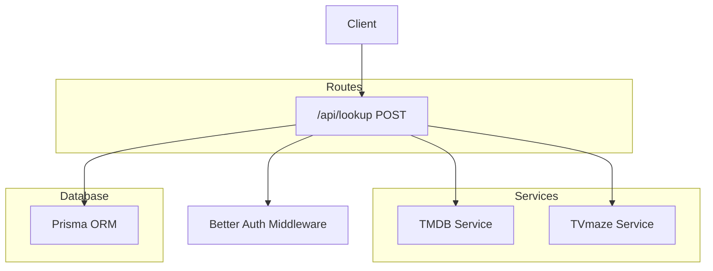
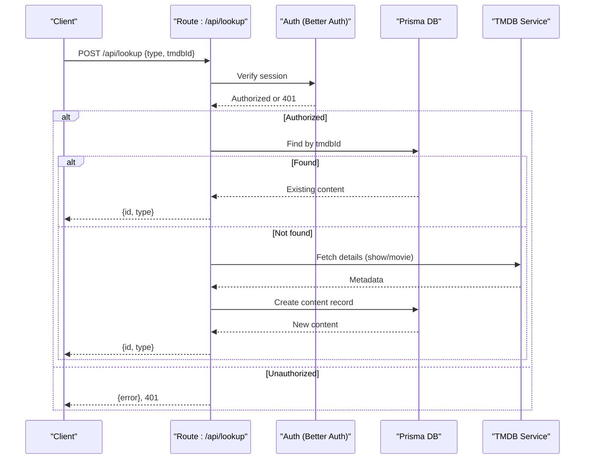
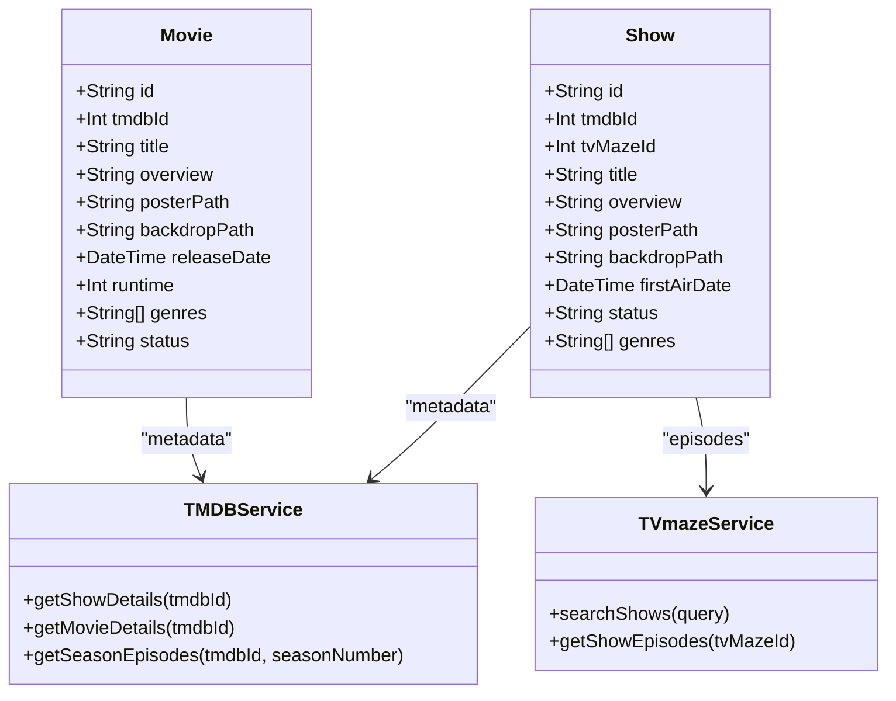
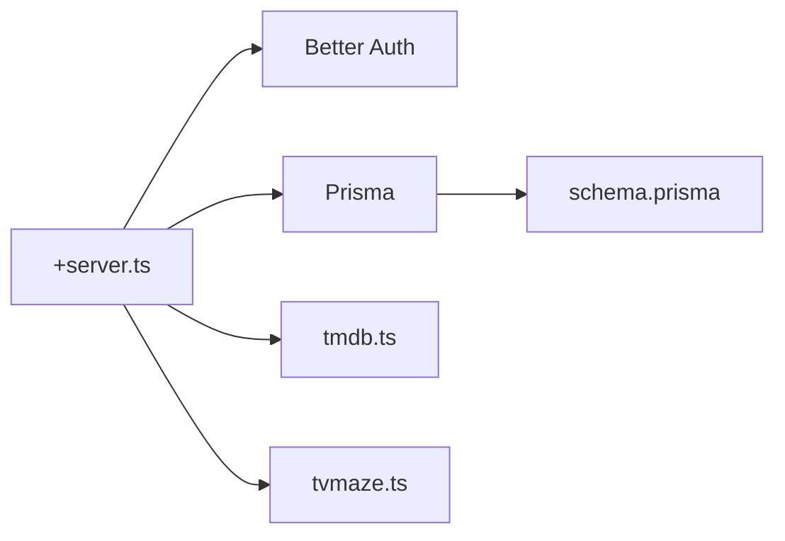

# Lookup API

<cite>
**Referenced Files in This Document**
- [+server.ts](file://src/routes/api/lookup/+server.ts)
- [tmdb.ts](file://src/lib/services/tmdb.ts)
- [tvmaze.ts](file://src/lib/services/tvmaze.ts)
- [content.ts](file://src/lib/types/content.ts)
- [schema.prisma](file://prisma/schema.prisma)
- [README.md](file://README.md)
</cite>

## Table of Contents
1. [Introduction](#introduction)
2. [Project Structure](#project-structure)
3. [Core Components](#core-components)
4. [Architecture Overview](#architecture-overview)
5. [Detailed Component Analysis](#detailed-component-analysis)
6. [Dependency Analysis](#dependency-analysis)
7. [Performance Considerations](#performance-considerations)
8. [Troubleshooting Guide](#troubleshooting-guide)
9. [Conclusion](#conclusion)

## Introduction
This document describes the Lookup API used to identify content (movies and TV shows) by external identifiers and to normalize provider-specific metadata. It focuses on:
- External ID lookups and content identification
- Cross-provider awareness and integration (TMDB and TVmaze)
- Provider mapping and fallback behavior
- Rate limiting considerations and data freshness
- Request/response contracts and examples

The Lookup API endpoint is implemented under the SvelteKit routes API surface and integrates with TMDB for metadata and TVmaze for episode-level data.

## Project Structure
The Lookup API resides in the SvelteKit API routes and interacts with provider services and the local database.

**Diagram sources**
- [+server.ts:1-53](file://src/routes/api/lookup/+server.ts#L1-L53)
- [tmdb.ts:1-167](file://src/lib/services/tmdb.ts#L1-L167)
- [tvmaze.ts:1-24](file://src/lib/services/tvmaze.ts#L1-L24)
- [schema.prisma:85-166](file://prisma/schema.prisma#L85-L166)

**Section sources**
- [+server.ts:1-53](file://src/routes/api/lookup/+server.ts#L1-L53)
- [README.md:16-26](file://README.md#L16-L26)

## Core Components
- Lookup endpoint: POST /api/lookup
  - Validates authentication
  - Accepts a payload specifying content type and TMDB ID
  - Returns normalized internal identifiers and type
- TMDB service: Provides show/movie metadata and episode listings
- TVmaze service: Provides show episode lists (episode-level data)
- Database schema: Stores normalized content records with optional provider IDs

Key behaviors:
- If a record does not exist for the given external ID, the endpoint fetches metadata from TMDB and persists it locally
- The response contains an internal ID and type for subsequent operations
- The database schema supports optional TVmaze IDs alongside TMDB IDs

**Section sources**
- [+server.ts:6-52](file://src/routes/api/lookup/+server.ts#L6-L52)
- [tmdb.ts:39-104](file://src/lib/services/tmdb.ts#L39-L104)
- [tvmaze.ts:1-24](file://src/lib/services/tvmaze.ts#L1-L24)
- [schema.prisma:85-166](file://prisma/schema.prisma#L85-L166)

## Architecture Overview
The Lookup API orchestrates authentication, database lookup, and provider integration to return a normalized internal representation of content.

**Diagram sources**
- [+server.ts:6-52](file://src/routes/api/lookup/+server.ts#L6-L52)
- [tmdb.ts:39-104](file://src/lib/services/tmdb.ts#L39-L104)
- [schema.prisma:85-166](file://prisma/schema.prisma#L85-L166)

## Detailed Component Analysis

### Endpoint Definition
- Method: POST
- Path: /api/lookup
- Authentication: Required (session-based)
- Request body:
  - type: "show" | "movie"
  - tmdbId: number (external TMDB identifier)
- Response:
  - On success: { id: string, type: "show" | "movie" }
  - On unauthorized: { error: string }, 401
  - On invalid type: { error: string }, 400
  - On errors: { error: string }, 500

Notes:
- The endpoint does not accept TVDB or IMDB IDs directly; it expects TMDB IDs
- If the content does not exist in the database, it is fetched from TMDB and stored locally

**Section sources**
- [+server.ts:6-52](file://src/routes/api/lookup/+server.ts#L6-L52)

### Request/Response Contracts
- Request body fields:
  - type: string, required
  - tmdbId: number, required
- Response fields:
  - id: string, internal content identifier
  - type: "show" | "movie", derived from request

Provider-specific metadata returned by TMDB (used during creation):
- Title, overview, poster/backdrop paths
- Release date for movies, first air date for shows
- Status, runtime, genres
- Seasons and episodes for shows (via TMDB details and episodes)

**Section sources**
- [+server.ts:10-47](file://src/routes/api/lookup/+server.ts#L10-L47)
- [tmdb.ts:39-104](file://src/lib/services/tmdb.ts#L39-L104)
- [content.ts:13-63](file://src/lib/types/content.ts#L13-L63)

### Provider Integration and Cross-Referencing
- TMDB integration:
  - Used for show/movie metadata and episode listings
  - Supports fetching details and episodes via dedicated service functions
- TVmaze integration:
  - Used for episode-level data (episode list retrieval)
  - The database schema includes an optional TVmaze ID field for shows
- Cross-provider mapping:
  - The current Lookup endpoint uses TMDB IDs and returns normalized internal IDs
  - There is no explicit cross-reference resolution between TMDB and TVDB/IMDB in the Lookup endpoint

**Diagram sources**
- [schema.prisma:85-166](file://prisma/schema.prisma#L85-L166)
- [tmdb.ts:39-104](file://src/lib/services/tmdb.ts#L39-L104)
- [tvmaze.ts:1-24](file://src/lib/services/tvmaze.ts#L1-L24)

**Section sources**
- [schema.prisma:85-166](file://prisma/schema.prisma#L85-L166)
- [tmdb.ts:39-104](file://src/lib/services/tmdb.ts#L39-L104)
- [tvmaze.ts:1-24](file://src/lib/services/tvmaze.ts#L1-L24)

### Data Normalization and Fallback Mechanisms
- Normalization:
  - Internal IDs are generated by the database and returned to clients
  - Provider-specific IDs (TMDB) are stored for future lookups
- Fallback:
  - If a content record is not found by TMDB ID, the endpoint fetches metadata from TMDB and creates a new record
- Missing external IDs:
  - The Lookup endpoint currently requires a TMDB ID
  - No built-in fallback to TVDB/IMDB is implemented in this endpoint

**Section sources**
- [+server.ts:10-47](file://src/routes/api/lookup/+server.ts#L10-L47)
- [schema.prisma:85-166](file://prisma/schema.prisma#L85-L166)

### Examples

- Lookup a show by TMDB ID
  - Request: POST /api/lookup with body { type: "show", tmdbId: 12345 }
  - Response: { id: "<internal-show-id>", type: "show" }

- Lookup a movie by TMDB ID
  - Request: POST /api/lookup with body { type: "movie", tmdbId: 67890 }
  - Response: { id: "<internal-movie-id>", type: "movie" }

- Behavior when content is not found
  - The endpoint fetches metadata from TMDB and persists it before returning the internal ID

Note: These examples describe expected behavior based on the implementation. They do not include literal code.

**Section sources**
- [+server.ts:6-52](file://src/routes/api/lookup/+server.ts#L6-L52)
- [tmdb.ts:39-104](file://src/lib/services/tmdb.ts#L39-L104)

## Dependency Analysis
- Route depends on:
  - Authentication middleware (Better Auth)
  - Prisma ORM for database operations
  - TMDB service for metadata
- Services depend on:
  - External APIs (TMDB, TVmaze)
- Database schema supports:
  - Unique TMDB IDs for shows/movies
  - Optional TVmaze IDs for shows
  - Rich metadata fields for content

**Diagram sources**
- [+server.ts:1-53](file://src/routes/api/lookup/+server.ts#L1-L53)
- [tmdb.ts:1-167](file://src/lib/services/tmdb.ts#L1-L167)
- [tvmaze.ts:1-24](file://src/lib/services/tvmaze.ts#L1-L24)
- [schema.prisma:85-166](file://prisma/schema.prisma#L85-L166)

**Section sources**
- [+server.ts:1-53](file://src/routes/api/lookup/+server.ts#L1-L53)
- [schema.prisma:85-166](file://prisma/schema.prisma#L85-L166)

## Performance Considerations
- Provider rate limits:
  - TMDB and TVmaze impose rate limits on API calls
  - The Lookup endpoint performs a single metadata fetch per request when creating content
  - Consider caching responses at the application layer or using background workers to pre-fetch popular content
- Data freshness:
  - Metadata is fetched on-demand when a record is not present
  - For frequently accessed content, consider periodic background updates to keep local copies fresh
- Network latency:
  - Minimize round-trips by batching lookups when possible and leveraging local caching

[No sources needed since this section provides general guidance]

## Troubleshooting Guide
- Unauthorized access
  - Symptom: 401 Unauthorized response
  - Cause: Missing or invalid session
  - Resolution: Authenticate and retry
- Invalid type
  - Symptom: 400 Bad Request with error message
  - Cause: type is not "show" or "movie"
  - Resolution: Ensure type is one of the supported values
- TMDB errors
  - Symptom: 500 Internal Server Error with provider error message
  - Causes: TMDB API failures, invalid TMDB ID, rate limiting
  - Resolutions:
    - Retry later
    - Verify TMDB API key and ID validity
    - Implement exponential backoff and circuit breaker logic
- TVmaze errors
  - Symptom: Provider error thrown for TVmaze operations
  - Resolution: Retry with jitter and monitor TVmaze availability

**Section sources**
- [+server.ts:49-51](file://src/routes/api/lookup/+server.ts#L49-L51)
- [tmdb.ts:14-16](file://src/lib/services/tmdb.ts#L14-L16)
- [tvmaze.ts:3-6](file://src/lib/services/tvmaze.ts#L3-L6)

## Conclusion
The Lookup API provides a straightforward mechanism to identify and normalize content using TMDB IDs. It integrates with TMDB for metadata and TVmaze for episode data, while storing normalized records in the database. The current implementation focuses on TMDB-centric workflows and does not include explicit cross-provider ID mapping. For production deployments, consider adding caching, rate-limiting safeguards, and background refresh strategies to improve performance and reliability.