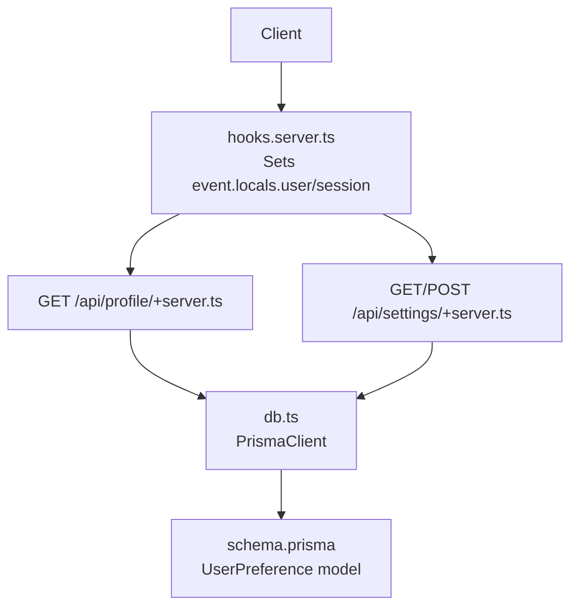
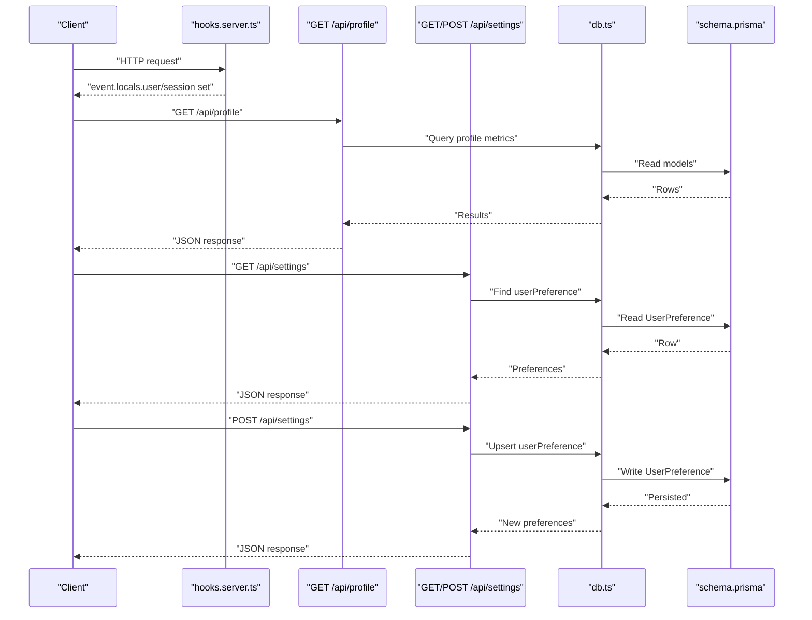
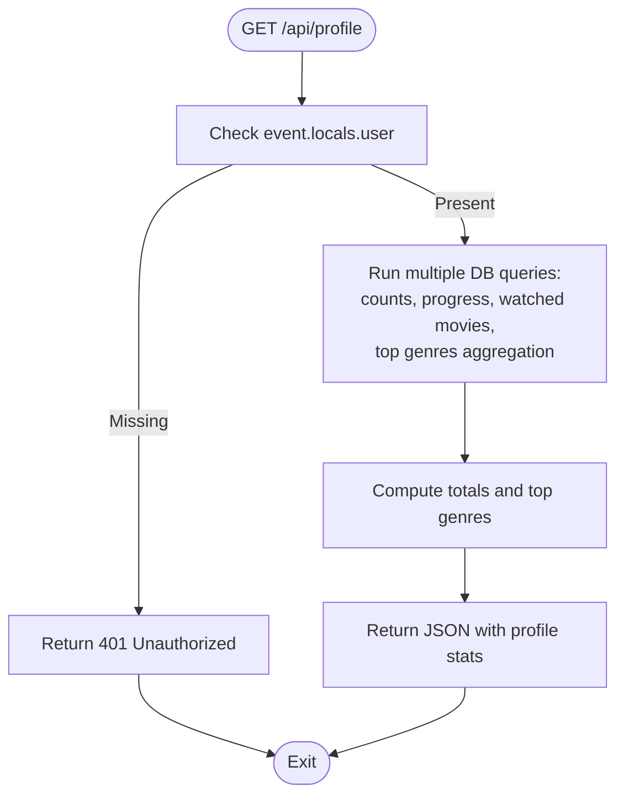
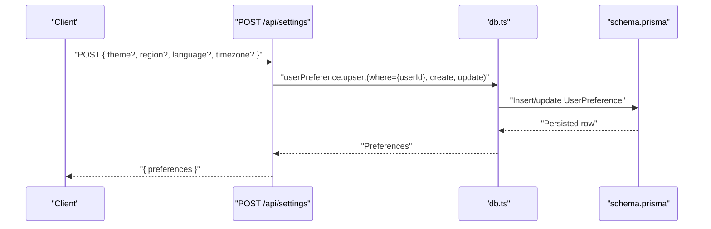
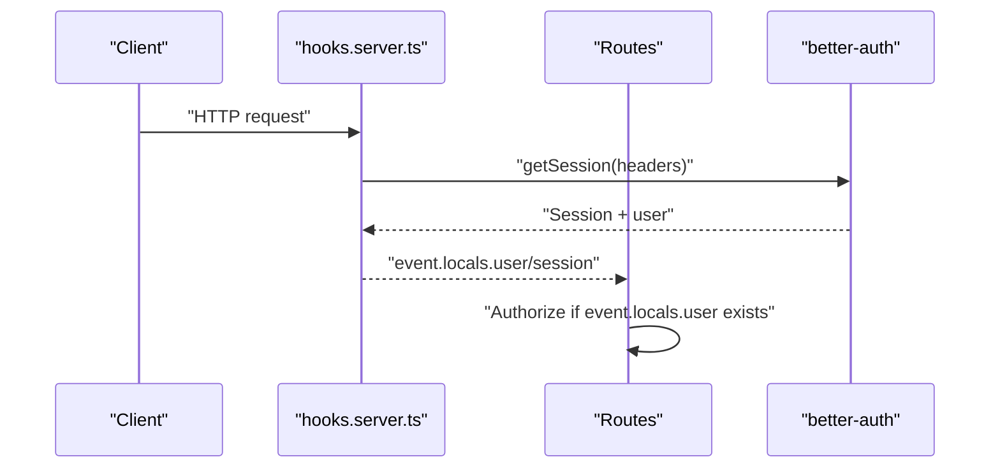
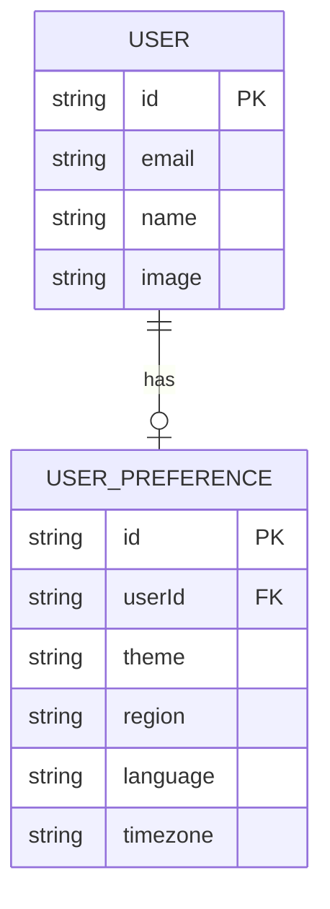
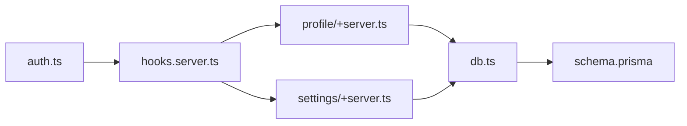

# Profile & Settings API

<cite>
**Referenced Files in This Document**
- [profile/+server.ts](file://src/routes/api/profile/+server.ts)
- [settings/+server.ts](file://src/routes/api/settings/+server.ts)
- [hooks.server.ts](file://src/hooks.server.ts)
- [db.ts](file://src/lib/server/db.ts)
- [auth.ts](file://src/lib/server/auth.ts)
- [schema.prisma](file://prisma/schema.prisma)
- [+layout.server.ts](file://src/routes/(app)/+layout.server.ts)
</cite>

## Table of Contents
1. [Introduction](#introduction)
2. [Project Structure](#project-structure)
3. [Core Components](#core-components)
4. [Architecture Overview](#architecture-overview)
5. [Detailed Component Analysis](#detailed-component-analysis)
6. [Dependency Analysis](#dependency-analysis)
7. [Performance Considerations](#performance-considerations)
8. [Troubleshooting Guide](#troubleshooting-guide)
9. [Conclusion](#conclusion)

## Introduction
This document describes the Profile and Settings APIs used by Screenlog’s backend. It focuses on:
- Retrieving user profile statistics via the profile endpoint
- Managing user preferences via the settings endpoint
- Authentication and authorization flow
- Data models and persistence
- Privacy and data protection considerations

Endpoints covered:
- GET /api/profile
- GET /api/settings
- POST /api/settings

## Project Structure
The relevant API endpoints are implemented as SvelteKit server routes under src/routes/api/. They rely on:
- A shared database client initialized in src/lib/server/db.ts
- Authentication middleware in src/hooks.server.ts using better-auth
- Database schema defined in prisma/schema.prisma

**Diagram sources**
- [hooks.server.ts:1-18](file://src/hooks.server.ts#L1-L18)
- [profile/+server.ts:1-66](file://src/routes/api/profile/+server.ts#L1-L66)
- [settings/+server.ts:1-29](file://src/routes/api/settings/+server.ts#L1-L29)
- [db.ts:1-11](file://src/lib/server/db.ts#L1-L11)
- [schema.prisma:244-257](file://prisma/schema.prisma#L244-L257)

**Section sources**
- [profile/+server.ts:1-66](file://src/routes/api/profile/+server.ts#L1-L66)
- [settings/+server.ts:1-29](file://src/routes/api/settings/+server.ts#L1-L29)
- [hooks.server.ts:1-18](file://src/hooks.server.ts#L1-L18)
- [db.ts:1-11](file://src/lib/server/db.ts#L1-L11)
- [schema.prisma:244-257](file://prisma/schema.prisma#L244-L257)

## Core Components
- Authentication and Authorization
  - The hooks layer obtains the current session and attaches user/session to event.locals for downstream routes.
  - Routes check event.locals.user and return 401 Unauthorized if absent.
- Profile Endpoint
  - Computes and returns aggregated stats for the authenticated user, including counts and top genres.
- Settings Endpoint
  - Retrieves user preferences.
  - Upserts user preferences with defaults for missing fields.

**Section sources**
- [hooks.server.ts:4-17](file://src/hooks.server.ts#L4-L17)
- [profile/+server.ts:5-65](file://src/routes/api/profile/+server.ts#L5-L65)
- [settings/+server.ts:5-28](file://src/routes/api/settings/+server.ts#L5-L28)

## Architecture Overview
The API follows a simple request-response pattern:
- Incoming requests are authenticated via better-auth
- Routes validate presence of event.locals.user
- Database queries compute profile metrics or manage preferences
- Responses are JSON-formatted

**Diagram sources**
- [hooks.server.ts:4-17](file://src/hooks.server.ts#L4-L17)
- [profile/+server.ts:9-61](file://src/routes/api/profile/+server.ts#L9-L61)
- [settings/+server.ts:8-24](file://src/routes/api/settings/+server.ts#L8-L24)
- [db.ts:8](file://src/lib/server/db.ts#L8)
- [schema.prisma:244-257](file://prisma/schema.prisma#L244-L257)

## Detailed Component Analysis

### Profile Endpoint
- Method: GET
- Path: /api/profile
- Purpose: Return user-specific profile statistics and top genres.

Response shape:
- Integer fields: showsTracked, showsCompleted, episodesWatched, moviesWatched, totalMovies
- Numeric field: totalWatchTimeMinutes
- Array of objects: topGenres with name and count

Processing logic:
- Counts tracked/completed shows, episodes watched, and watched movies
- Computes total watch time by summing episode runtime and watched movie runtime
- Aggregates top genres from tracked shows and movies

**Diagram sources**
- [profile/+server.ts:5-65](file://src/routes/api/profile/+server.ts#L5-L65)

**Section sources**
- [profile/+server.ts:5-65](file://src/routes/api/profile/+server.ts#L5-L65)

### Settings Endpoint
- Methods: GET, POST
- Path: /api/settings

GET /api/settings
- Returns the user’s preferences object.
- If no preferences exist, returns null for preferences (client should handle defaults).

POST /api/settings
- Upserts user preferences for the authenticated user.
- Defaults applied when fields are missing:
  - theme: system
  - timezone: Asia/Colombo
- Other fields: region, language

**Diagram sources**
- [settings/+server.ts:15-28](file://src/routes/api/settings/+server.ts#L15-L28)
- [db.ts:8](file://src/lib/server/db.ts#L8)
- [schema.prisma:244-257](file://prisma/schema.prisma#L244-L257)

**Section sources**
- [settings/+server.ts:5-28](file://src/routes/api/settings/+server.ts#L5-L28)
- [schema.prisma:244-257](file://prisma/schema.prisma#L244-L257)

### Authentication and Authorization
- Session retrieval and user assignment occur in hooks.server.ts.
- Routes guard access by checking event.locals.user and returning 401 if missing.
- The application uses better-auth with a PostgreSQL adapter and cookie-based sessions.

**Diagram sources**
- [hooks.server.ts:4-17](file://src/hooks.server.ts#L4-L17)
- [auth.ts:1-27](file://src/lib/server/auth.ts#L1-L27)

**Section sources**
- [hooks.server.ts:4-17](file://src/hooks.server.ts#L4-L17)
- [auth.ts:1-27](file://src/lib/server/auth.ts#L1-L27)

### Data Models and Persistence
- UserPreference model persists per-user preferences.
- The layout server load initializes default preferences if none exist.

**Diagram sources**
- [schema.prisma:11-31](file://prisma/schema.prisma#L11-L31)
- [schema.prisma:244-257](file://prisma/schema.prisma#L244-L257)
- [+layout.server.ts:9-15](file://src/routes/(app)/+layout.server.ts#L9-L15)

**Section sources**
- [schema.prisma:244-257](file://prisma/schema.prisma#L244-L257)
- [+layout.server.ts:9-15](file://src/routes/(app)/+layout.server.ts#L9-L15)

## Dependency Analysis
- Route dependencies
  - profile/+server.ts depends on db.ts and prisma/schema.prisma models for counts and aggregations.
  - settings/+server.ts depends on db.ts and prisma/schema.prisma for preferences retrieval/upsert.
- Runtime dependencies
  - hooks.server.ts sets event.locals.user/session used by all protected routes.
  - better-auth manages sessions and integrates with Prisma adapter.

**Diagram sources**
- [hooks.server.ts:4-17](file://src/hooks.server.ts#L4-L17)
- [profile/+server.ts:1-3](file://src/routes/api/profile/+server.ts#L1-L3)
- [settings/+server.ts:1-3](file://src/routes/api/settings/+server.ts#L1-L3)
- [db.ts:8](file://src/lib/server/db.ts#L8)
- [auth.ts:1-27](file://src/lib/server/auth.ts#L1-L27)

**Section sources**
- [profile/+server.ts:1-3](file://src/routes/api/profile/+server.ts#L1-L3)
- [settings/+server.ts:1-3](file://src/routes/api/settings/+server.ts#L1-L3)
- [hooks.server.ts:4-17](file://src/hooks.server.ts#L4-L17)
- [db.ts:8](file://src/lib/server/db.ts#L8)
- [auth.ts:1-27](file://src/lib/server/auth.ts#L1-L27)

## Performance Considerations
- Profile endpoint performs multiple database queries and loops over results to compute totals and top genres. Consider:
  - Indexing relevant columns (e.g., userId on userShow, userMovie, episodeProgress).
  - Limiting result sizes for expensive joins (e.g., top genres aggregation).
  - Caching computed aggregates per user if frequency of reads is high.
- Settings endpoint upserts preferences; ensure minimal writes by batching updates client-side.

[No sources needed since this section provides general guidance]

## Troubleshooting Guide
Common issues and resolutions:
- Unauthorized
  - Symptom: 401 Unauthorized on profile/settings.
  - Cause: Missing or invalid session.
  - Resolution: Ensure cookies are sent and session is active; verify better-auth base URL and trusted origins.
- Internal errors
  - Symptom: 500 error with error message.
  - Causes: Database connectivity, invalid query parameters, or transient failures.
  - Resolution: Check database logs, retry after transient conditions clear.
- Preferences not persisted
  - Symptom: POST settings returns old values.
  - Causes: Missing userId in request context or malformed payload.
  - Resolution: Confirm authentication is active and payload includes expected fields.

**Section sources**
- [profile/+server.ts:62-64](file://src/routes/api/profile/+server.ts#L62-L64)
- [settings/+server.ts:10-12](file://src/routes/api/settings/+server.ts#L10-L12)
- [settings/+server.ts:25-27](file://src/routes/api/settings/+server.ts#L25-L27)

## Conclusion
The Profile and Settings APIs provide essential user-centric functionality:
- Profile endpoint delivers aggregated viewing statistics and top genres.
- Settings endpoint supports retrieval and persistence of user preferences with sensible defaults.
- Authentication is enforced centrally via better-auth, ensuring secure access to protected routes.

[No sources needed since this section summarizes without analyzing specific files]