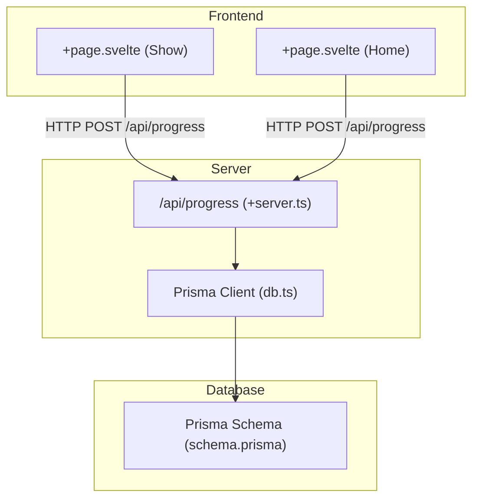
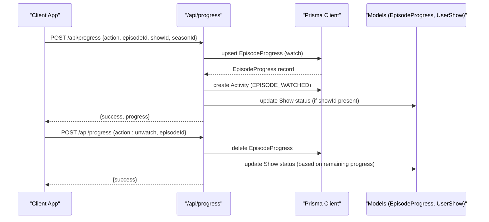
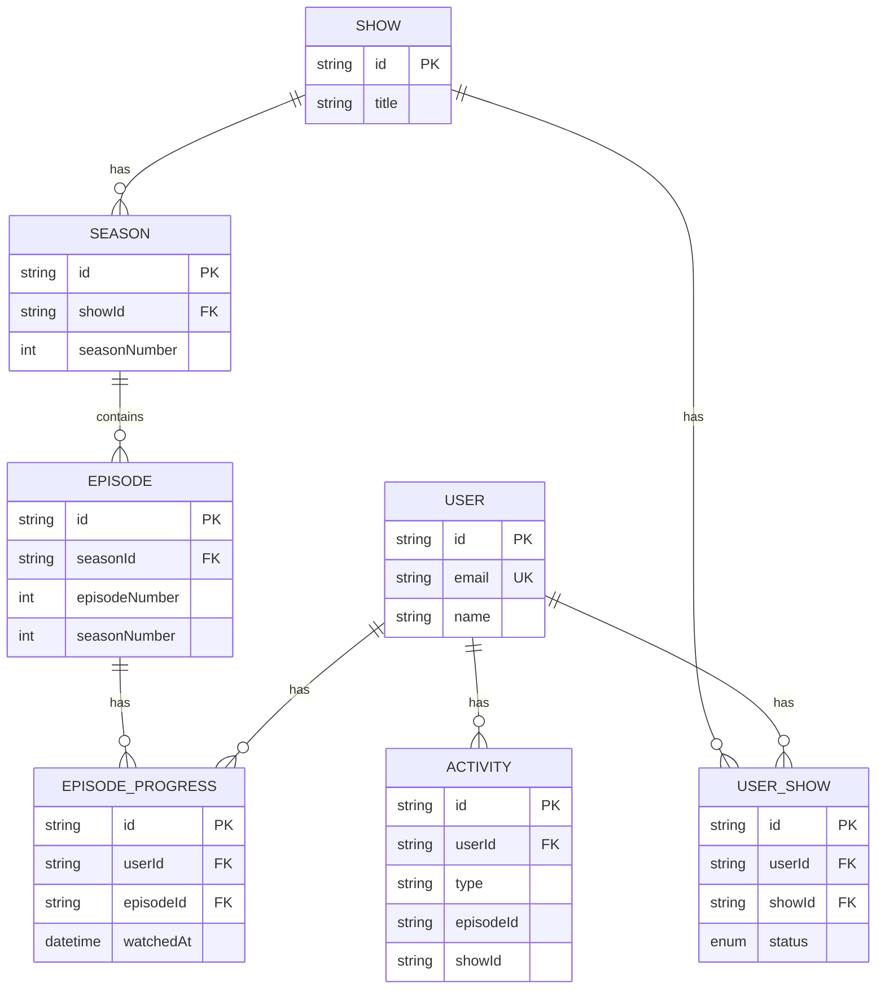
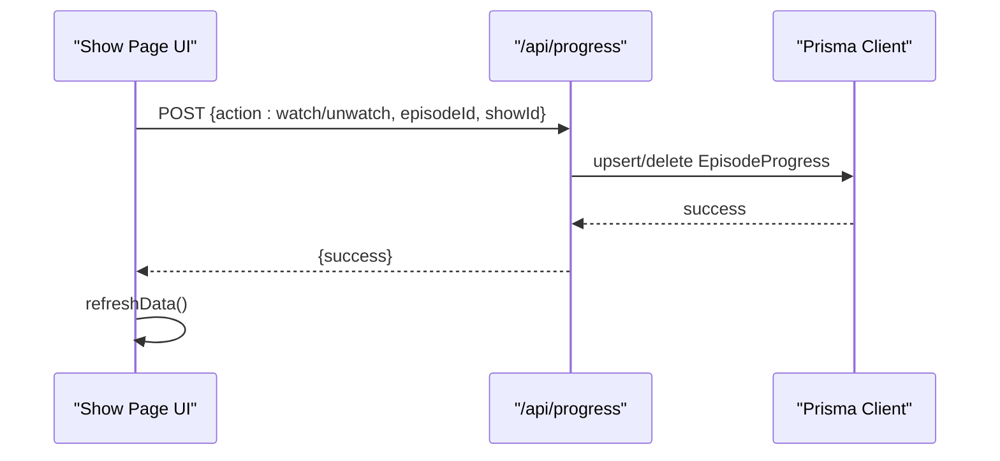
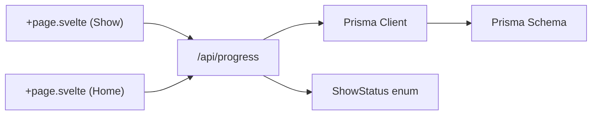

# Progress Tracking API

<cite>
**Referenced Files in This Document**
- [progress/+server.ts](file://src/routes/api/progress/+server.ts)
- [schema.prisma](file://prisma/schema.prisma)
- [db.ts](file://src/lib/server/db.ts)
- [+page.svelte (Show)](file://src/routes/(app)/show/[id]/+page.svelte)
- [+page.svelte (Home)](file://src/routes/(app)/home/+page.svelte)
</cite>

## Table of Contents
1. [Introduction](#introduction)
2. [Project Structure](#project-structure)
3. [Core Components](#core-components)
4. [Architecture Overview](#architecture-overview)
5. [Detailed Component Analysis](#detailed-component-analysis)
6. [Dependency Analysis](#dependency-analysis)
7. [Performance Considerations](#performance-considerations)
8. [Troubleshooting Guide](#troubleshooting-guide)
9. [Conclusion](#conclusion)

## Introduction
This document provides comprehensive API documentation for Screenlog’s episode progress tracking endpoints. It covers:
- Episode marking/unmarking
- Season completion status updates
- Bulk progress operations
- HTTP methods and URL patterns (/api/progress/*)
- Request payloads for episode updates
- Response schemas for progress snapshots
- Real-time progress updates and synchronization
- Validation, duplicate prevention, and consistency guarantees

## Project Structure
The progress tracking API is implemented as a SvelteKit server route under `/src/routes/api/progress/+server.ts`. It integrates with Prisma ORM for database operations and interacts with frontend components to reflect real-time progress updates.

**Diagram sources**
- [progress/+server.ts:1-133](file://src/routes/api/progress/+server.ts#L1-L133)
- [db.ts:1-11](file://src/lib/server/db.ts#L1-L11)
- [schema.prisma:214-242](file://prisma/schema.prisma#L214-L242)

**Section sources**
- [progress/+server.ts:1-133](file://src/routes/api/progress/+server.ts#L1-L133)
- [db.ts:1-11](file://src/lib/server/db.ts#L1-L11)
- [schema.prisma:214-242](file://prisma/schema.prisma#L214-L242)

## Core Components
- Endpoint: /api/progress
- Methods:
  - GET: Retrieve progress snapshots
  - POST: Perform episode marking/unmarking, season operations, and bulk progress updates
- Authentication: Requires a logged-in user session; unauthorized requests receive 401 Unauthorized
- Data models involved:
  - EpisodeProgress: Stores per-user episode watch records
  - Episode: Episode metadata and relations
  - Season: Season metadata and episodes
  - Show: Show metadata and seasons
  - UserShow: Per-user show status
  - Activity: Tracks user activity events

**Section sources**
- [progress/+server.ts:34-58](file://src/routes/api/progress/+server.ts#L34-L58)
- [progress/+server.ts:60-132](file://src/routes/api/progress/+server.ts#L60-L132)
- [schema.prisma:214-242](file://prisma/schema.prisma#L214-L242)

## Architecture Overview
The progress tracking API orchestrates:
- Episode watch/unwatch operations via upsert/delete
- Season-wide marking and caught-up logic
- Show status transitions based on episode completion
- Activity logging for watched episodes
- Frontend synchronization via refresh calls

**Diagram sources**
- [progress/+server.ts:60-132](file://src/routes/api/progress/+server.ts#L60-L132)
- [schema.prisma:214-242](file://prisma/schema.prisma#L214-L242)

## Detailed Component Analysis

### Endpoint: GET /api/progress
- Purpose: Fetch progress snapshots for the authenticated user
- Query parameters:
  - showId: Optional. When provided, returns progress for episodes belonging to the specified show
- Response:
  - progress: Array of progress records
    - Each record includes episode metadata and season/show context when showId is omitted
    - When showId is provided, each record includes episode metadata only
  - Pagination/Ordering:
    - Without showId: Returns latest 50 entries ordered by watchedAt descending
- Error handling:
  - 401 Unauthorized if not authenticated
  - 500 Internal Server Error on failure

Example usage:
- GET /api/progress?showId=show-id
- GET /api/progress

Response schema (progress items):
- id: string
- userId: string
- episodeId: string
- watchedAt: datetime
- updatedAt: datetime
- episode: {
  id: string
  name: string
  episodeNumber: number
  seasonNumber: number
  season: {
    show: {
      id: string
      title: string
    }
  }
}

**Section sources**
- [progress/+server.ts:34-58](file://src/routes/api/progress/+server.ts#L34-L58)

### Endpoint: POST /api/progress
- Purpose: Perform episode marking/unmarking, season operations, and bulk progress updates
- Request payload:
  - action: string (required)
    - watch: Mark a specific episode as watched
    - unwatch: Unmark a specific episode
    - markSeason: Mark all episodes in a season as watched
    - markCaughtUp: Mark all episodes in a show as watched and set show status accordingly
    - resetShow: Clear all progress for a show and reset status to PLAN_TO_WATCH
  - episodeId: string (required for watch/unwatch)
  - showId: string (required for watch and markCaughtUp/resetShow)
  - seasonId: string (required for markSeason)
- Response:
  - watch/unwatch: { success: boolean, progress: EpisodeProgress }
  - markSeason: { success: boolean, count: number }
  - markCaughtUp: { success: boolean, count: number }
  - resetShow: { success: boolean }
  - Error responses: { error: string } with appropriate HTTP status

Validation and duplicate prevention:
- watch: Uses upsert on the unique constraint (userId, episodeId). Duplicate prevention is enforced by the database uniqueness constraint.
- unwatch: Deletes matching records; no duplicates can exist due to uniqueness.
- markSeason/markCaughtUp: Iterates through episodes and upserts each; duplicates are prevented by the unique constraint.
- resetShow: Clears all progress for the given show and resets status.

Real-time progress updates:
- Frontend components call /api/progress after mutations and refresh local state to reflect changes immediately.

Consistency guarantees:
- The endpoint performs operations in sequence per action. While not wrapped in a single transaction, the database enforces uniqueness and cascading deletes. Show status updates occur after progress changes to ensure consistency.

Examples:

- Mark episode as watched
  - Method: POST
  - URL: /api/progress
  - Body: { action: "watch", episodeId: "episode-id", showId: "show-id" }
  - Response: { success: true, progress: EpisodeProgress }

- Unmark episode as watched
  - Method: POST
  - URL: /api/progress
  - Body: { action: "unwatch", episodeId: "episode-id" }
  - Response: { success: true }

- Mark all episodes in a season as watched
  - Method: POST
  - URL: /api/progress
  - Body: { action: "markSeason", seasonId: "season-id" }
  - Response: { success: true, count: number }

- Mark all episodes in a show as watched and set status
  - Method: POST
  - URL: /api/progress
  - Body: { action: "markCaughtUp", showId: "show-id" }
  - Response: { success: true, count: number }

- Reset progress for a show
  - Method: POST
  - URL: /api/progress
  - Body: { action: "resetShow", showId: "show-id" }
  - Response: { success: true }

**Section sources**
- [progress/+server.ts:60-132](file://src/routes/api/progress/+server.ts#L60-L132)
- [+page.svelte (Show)](file://src/routes/(app)/show/[id]/+page.svelte#L63-L90)
- [+page.svelte (Home)](file://src/routes/(app)/home/+page.svelte#L155-L168)

### Data Models Involved

**Diagram sources**
- [schema.prisma:214-242](file://prisma/schema.prisma#L214-L242)

**Section sources**
- [schema.prisma:214-242](file://prisma/schema.prisma#L214-L242)

### Frontend Integration
- Show page:
  - Toggles episode watched state via POST /api/progress
  - Marks entire season as watched via POST /api/progress
  - Refreshes progress snapshot after mutation
- Home page:
  - Marks next episode as watched via POST /api/progress
  - Refreshes data after mutation

**Diagram sources**
- [+page.svelte (Show)](file://src/routes/(app)/show/[id]/+page.svelte#L63-L90)
- [progress/+server.ts:60-132](file://src/routes/api/progress/+server.ts#L60-L132)

**Section sources**
- [+page.svelte (Show)](file://src/routes/(app)/show/[id]/+page.svelte#L63-L90)
- [+page.svelte (Home)](file://src/routes/(app)/home/+page.svelte#L155-L168)

## Dependency Analysis
- Route handler depends on:
  - Prisma client for database operations
  - ShowStatus enum for show status transitions
- Database schema defines:
  - Unique constraints on (userId, episodeId) for EpisodeProgress
  - Cascading relations for show/season/episode
- Frontend components depend on:
  - Progress endpoint for real-time updates
  - Progress snapshot for UI state

**Diagram sources**
- [progress/+server.ts:1-133](file://src/routes/api/progress/+server.ts#L1-L133)
- [schema.prisma:214-242](file://prisma/schema.prisma#L214-L242)

**Section sources**
- [progress/+server.ts:1-133](file://src/routes/api/progress/+server.ts#L1-L133)
- [schema.prisma:214-242](file://prisma/schema.prisma#L214-L242)

## Performance Considerations
- GET /api/progress:
  - Limits results to 50 entries when fetching all progress for a user
  - Orders by watchedAt descending to prioritize recent activity
- POST /api/progress:
  - markSeason and markCaughtUp iterate through episodes; consider batching for very large seasons
  - upsert operations leverage unique constraints to prevent duplicates efficiently
- Frontend:
  - refreshData() after mutations ensures minimal latency for UI updates

[No sources needed since this section provides general guidance]

## Troubleshooting Guide
Common issues and resolutions:
- 401 Unauthorized:
  - Ensure the user is authenticated before calling /api/progress
- Invalid action:
  - Verify the action field matches one of the supported actions
- Season not found:
  - Confirm seasonId exists and belongs to the authenticated user’s shows
- Database errors:
  - Check Prisma client connectivity and schema migrations

**Section sources**
- [progress/+server.ts:60-132](file://src/routes/api/progress/+server.ts#L60-L132)

## Conclusion
The Progress Tracking API provides robust endpoints for managing episode progress, season completion, and bulk operations. It enforces data integrity through database constraints, updates show status consistently, and integrates seamlessly with frontend components to deliver real-time progress updates. The design balances simplicity and reliability while supporting common user workflows such as marking episodes as watched, resetting progress, and synchronizing progress across devices.