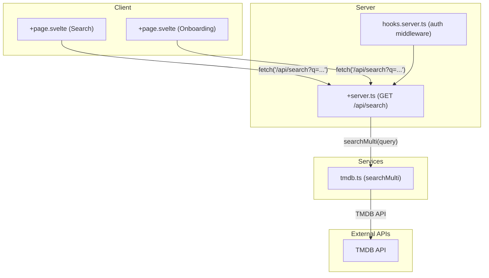
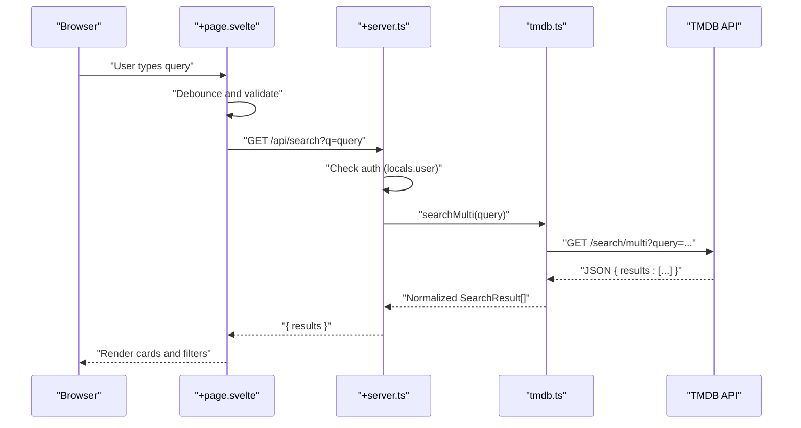
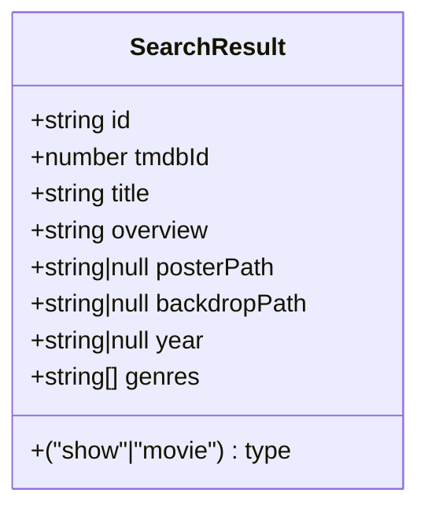
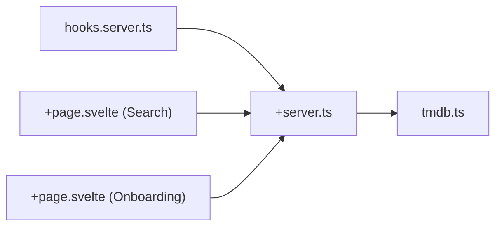

# Search API

<cite>
**Referenced Files in This Document**
- [README.md](file://README.md)
- [hooks.server.ts](file://src/hooks.server.ts)
- [+server.ts](file://src/routes/api/search/+server.ts)
- [tmdb.ts](file://src/lib/services/tmdb.ts)
- [content.ts](file://src/lib/types/content.ts)
- [+page.svelte](file://src/routes/(app)/search/+page.svelte)
- [+page.svelte](file://src/routes/(app)/onboarding/+page.svelte)
</cite>

## Table of Contents
1. [Introduction](#introduction)
2. [Project Structure](#project-structure)
3. [Core Components](#core-components)
4. [Architecture Overview](#architecture-overview)
5. [Detailed Component Analysis](#detailed-component-analysis)
6. [Dependency Analysis](#dependency-analysis)
7. [Performance Considerations](#performance-considerations)
8. [Troubleshooting Guide](#troubleshooting-guide)
9. [Conclusion](#conclusion)

## Introduction
This document provides comprehensive API documentation for Screenlog’s search functionality. It focuses on the multi-source search endpoint that queries movies, TV shows, and people via TMDB’s multi-search API. The documentation covers HTTP methods, URL patterns, query parameters, response schemas, filtering options, and client-side usage. It also addresses search behavior such as ranking, fuzzy matching, autocomplete, performance, caching, and external API rate limiting considerations.

## Project Structure
The search API is implemented as a SvelteKit server route backed by a service that integrates with TMDB. The frontend components trigger search requests and apply client-side filtering.

**Diagram sources**
- [+page.svelte](file://src/routes/(app)/search/+page.svelte#L18-L36)
- [+page.svelte](file://src/routes/(app)/onboarding/+page.svelte#L25-L37)
- [+server.ts:5-15](file://src/routes/api/search/+server.ts#L5-L15)
- [hooks.server.ts:4-17](file://src/hooks.server.ts#L4-L17)
- [tmdb.ts:19-37](file://src/lib/services/tmdb.ts#L19-L37)

**Section sources**
- [README.md:1-122](file://README.md#L1-L122)
- [+server.ts:1-16](file://src/routes/api/search/+server.ts#L1-L16)
- [tmdb.ts:1-167](file://src/lib/services/tmdb.ts#L1-L167)
- [+page.svelte](file://src/routes/(app)/search/+page.svelte#L1-L154)
- [+page.svelte](file://src/routes/(app)/onboarding/+page.svelte#L1-L39)
- [hooks.server.ts:1-18](file://src/hooks.server.ts#L1-L18)

## Core Components
- Search API endpoint: GET /api/search
- Backend handler: src/routes/api/search/+server.ts
- Service: src/lib/services/tmdb.ts (searchMulti)
- Types: src/lib/types/content.ts (SearchResult)
- Frontend consumers: src/routes/(app)/search/+page.svelte and src/routes/(app)/onboarding/+page.svelte

Key behaviors:
- Authentication: Requires a valid user session; otherwise returns unauthorized.
- Query parameter: q (required; trimmed empty query returns empty results).
- Response: JSON object containing results array of SearchResult items.
- Filtering: Client-side filtering by type ('all' | 'show' | 'movie').

**Section sources**
- [+server.ts:5-15](file://src/routes/api/search/+server.ts#L5-L15)
- [tmdb.ts:19-37](file://src/lib/services/tmdb.ts#L19-L37)
- [content.ts:1-11](file://src/lib/types/content.ts#L1-L11)
- [+page.svelte](file://src/routes/(app)/search/+page.svelte#L38-L40)

## Architecture Overview
The search flow is a thin proxy through the server route to TMDB’s multi-search endpoint. The server enforces authentication and returns normalized results.

**Diagram sources**
- [+page.svelte](file://src/routes/(app)/search/+page.svelte#L18-L36)
- [+server.ts:5-15](file://src/routes/api/search/+server.ts#L5-L15)
- [tmdb.ts:19-37](file://src/lib/services/tmdb.ts#L19-L37)

## Detailed Component Analysis

### Endpoint Definition
- Method: GET
- URL Pattern: /api/search
- Query Parameters:
  - q (string, required): Search query string. Empty or whitespace-only query returns empty results.
  - include_adult (boolean, optional): Not exposed by current implementation; the service uses include_adult=false.
  - page (integer, optional): Not exposed by current implementation; the service uses page=1.
- Authentication: Required. The server checks for a valid user session via hooks and rejects unauthenticated requests.
- Response:
  - Success: 200 OK with JSON body: { results: SearchResult[] }
  - Unauthorized: 401 with JSON body: { error: string }
  - Error: 500 with JSON body: { error: string }

Response Schema (SearchResult):
- id: string (normalized internal ID)
- tmdbId: number (TMDB identifier)
- title: string
- overview: string
- posterPath: string | null
- backdropPath: string | null
- year: string | null
- type: "show" | "movie"
- genres: string[] (empty in current implementation)

Filtering:
- Client-side filter supports 'all', 'show', 'movie'.
- The backend filters to media_type 'tv' or 'movie' and normalizes to 'show'/'movie'.

**Section sources**
- [+server.ts:5-15](file://src/routes/api/search/+server.ts#L5-L15)
- [tmdb.ts:19-37](file://src/lib/services/tmdb.ts#L19-L37)
- [content.ts:1-11](file://src/lib/types/content.ts#L1-L11)
- [+page.svelte](file://src/routes/(app)/search/+page.svelte#L38-L40)

### Client-Side Usage
- Debounced search input triggers fetch('/api/search?q=...').
- Onboarding and Search pages both use the same endpoint.
- Client renders skeleton loaders while loading and applies type filters.

Example flows:
- Searching movies by title: type 'movie' filter after receiving results.
- Searching TV shows by name: type 'show' filter after receiving results.
- Combined multi-category search: default 'all' filter.
- People search: not supported by the current multi-search endpoint; users can search for shows/movies and then manually select cast members from details if needed.

**Section sources**
- [+page.svelte](file://src/routes/(app)/search/+page.svelte#L18-L36)
- [+page.svelte](file://src/routes/(app)/onboarding/+page.svelte#L25-L37)

### Data Model

**Diagram sources**
- [content.ts:1-11](file://src/lib/types/content.ts#L1-L11)

## Dependency Analysis
- Authentication middleware: hooks.server.ts sets event.locals.user/session for every request.
- Search route depends on tmdb.ts for searchMulti.
- Frontend components depend on the route for search results and apply client-side filtering.

**Diagram sources**
- [hooks.server.ts:4-17](file://src/hooks.server.ts#L4-L17)
- [+server.ts:1-16](file://src/routes/api/search/+server.ts#L1-L16)
- [tmdb.ts:1-167](file://src/lib/services/tmdb.ts#L1-L167)
- [+page.svelte](file://src/routes/(app)/search/+page.svelte#L1-L154)
- [+page.svelte](file://src/routes/(app)/onboarding/+page.svelte#L1-L39)

**Section sources**
- [hooks.server.ts:1-18](file://src/hooks.server.ts#L1-L18)
- [+server.ts:1-16](file://src/routes/api/search/+server.ts#L1-L16)
- [tmdb.ts:1-167](file://src/lib/services/tmdb.ts#L1-L167)
- [+page.svelte](file://src/routes/(app)/search/+page.svelte#L1-L154)
- [+page.svelte](file://src/routes/(app)/onboarding/+page.svelte#L1-L39)

## Performance Considerations
- Client-side debouncing: Both search and onboarding pages debounce input to reduce network requests.
- Minimal payload: The endpoint returns a compact SearchResult array without pagination or adult toggles.
- External API cost: Calls TMDB’s multi-search endpoint; costs scale with request volume.
- Caching: No explicit caching is implemented in the route or service. Consider adding:
  - In-memory cache keyed by query (with TTL).
  - CDN-level caching for repeated queries.
  - Browser caching via ETags or Cache-Control headers.
- Rate limiting:
  - TMDB rate limits apply to external API calls.
  - Consider implementing server-side rate limiting for /api/search to protect upstream dependencies.
  - Use Better Auth rate limiting for authentication endpoints; similar patterns can be applied to API routes.

[No sources needed since this section provides general guidance]

## Troubleshooting Guide
Common issues and resolutions:
- Unauthorized error: Ensure the user is logged in; the route checks event.locals.user and returns 401 if missing.
- Empty results: Verify q is not empty or only whitespace; empty queries return empty results.
- Search failures: The route catches errors and returns 500 with an error message; check server logs for upstream TMDB errors.
- Missing people results: The current implementation searches movies and TV shows only; cast/person search is not supported by this endpoint.

**Section sources**
- [+server.ts:5-15](file://src/routes/api/search/+server.ts#L5-L15)

## Conclusion
Screenlog’s search API provides a simple, authenticated multi-source search for movies and TV shows via TMDB. It offers client-side debouncing, lightweight responses, and straightforward filtering by content type. For production deployments, consider adding caching and rate limiting to improve performance and protect external API usage.