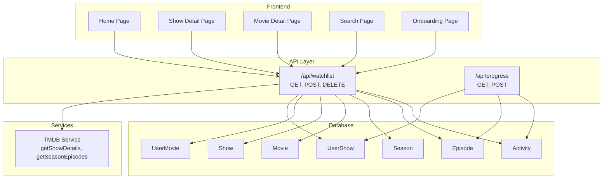
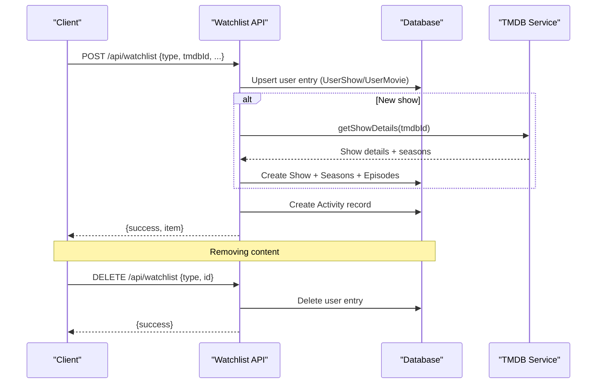
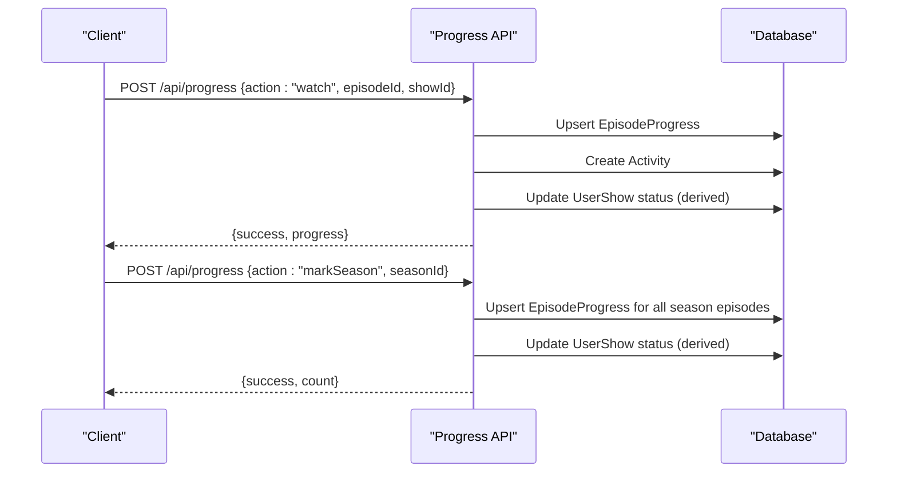
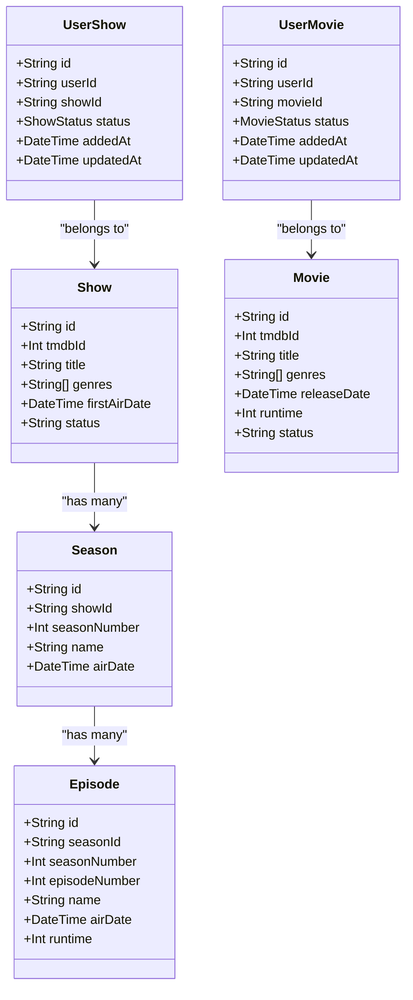

# Watchlist API

<cite>
**Referenced Files in This Document**
- [watchlist/+server.ts](file://src/routes/api/watchlist/+server.ts)
- [schema.prisma](file://prisma/schema.prisma)
- [progress/+server.ts](file://src/routes/api/progress/+server.ts)
- [tmdb.ts](file://src/lib/services/tmdb.ts)
- [home/+page.svelte](file://src/routes/(app)/home/+page.svelte)
- [show/[id]/+page.svelte](file://src/routes/(app)/show/[id]/+page.svelte)
- [movie/[id]/+page.svelte](file://src/routes/(app)/movie/[id]/+page.svelte)
- [search/+page.svelte](file://src/routes/(app)/search/+page.svelte)
- [onboarding/+page.svelte](file://src/routes/(app)/onboarding/+page.svelte)
- [profile/+server.ts](file://src/routes/api/profile/+server.ts)
</cite>

## Table of Contents
1. [Introduction](#introduction)
2. [Project Structure](#project-structure)
3. [Core Components](#core-components)
4. [Architecture Overview](#architecture-overview)
5. [Detailed Component Analysis](#detailed-component-analysis)
6. [Dependency Analysis](#dependency-analysis)
7. [Performance Considerations](#performance-considerations)
8. [Troubleshooting Guide](#troubleshooting-guide)
9. [Conclusion](#conclusion)

## Introduction
This document provides comprehensive API documentation for Screenlog’s watchlist management endpoints. It covers adding/removing content, updating watchlist status, bulk-like operations via progress actions, and watchlist synchronization. It also documents request/response schemas, validation rules, duplicate prevention, content type handling, and privacy considerations.

## Project Structure
The watchlist API is implemented as a SvelteKit server route under `/api/watchlist`. Supporting components include:
- Database models and enums for shows, movies, and user entries
- Progress API for derived status updates
- TMDB integration for show metadata and episodes
- Frontend pages that call the watchlist API

**Diagram sources**
- [watchlist/+server.ts:1-141](file://src/routes/api/watchlist/+server.ts#L1-L141)
- [progress/+server.ts:1-133](file://src/routes/api/progress/+server.ts#L1-L133)
- [tmdb.ts:1-167](file://src/lib/services/tmdb.ts#L1-L167)
- [schema.prisma:85-212](file://prisma/schema.prisma#L85-L212)

**Section sources**
- [watchlist/+server.ts:1-141](file://src/routes/api/watchlist/+server.ts#L1-L141)
- [schema.prisma:85-212](file://prisma/schema.prisma#L85-L212)

## Core Components
- Watchlist API: Handles listing, adding, and removing content for the authenticated user.
- Progress API: Updates watchlist status based on episode progress and supports bulk-like operations.
- TMDB Service: Fetches show metadata and episodes for new content.
- Database Models: Define watchlist entries, statuses, and relationships.

Key behaviors:
- Adding content upserts user entries and creates content records if missing.
- Removing content deletes user entries by type and ID.
- Status updates are derived from episode progress and explicit status changes.

**Section sources**
- [watchlist/+server.ts:6-141](file://src/routes/api/watchlist/+server.ts#L6-L141)
- [progress/+server.ts:6-133](file://src/routes/api/progress/+server.ts#L6-L133)
- [tmdb.ts:39-86](file://src/lib/services/tmdb.ts#L39-L86)
- [schema.prisma:168-212](file://prisma/schema.prisma#L168-L212)

## Architecture Overview
The watchlist API integrates with the database and TMDB service. It enforces authentication and returns structured responses. Status updates propagate from progress actions to user entries.

**Diagram sources**
- [watchlist/+server.ts:28-140](file://src/routes/api/watchlist/+server.ts#L28-L140)
- [tmdb.ts:39-86](file://src/lib/services/tmdb.ts#L39-L86)

## Detailed Component Analysis

### Endpoint: GET /api/watchlist
- Method: GET
- Purpose: Retrieve the authenticated user’s watchlist items (shows and movies).
- Authentication: Requires a valid session; returns unauthorized if missing.
- Response: `{ shows: UserShow[], movies: UserMovie[] }`
  - Shows include nested seasons and episodes.
  - Movies include basic metadata.
- Sorting: Items ordered by last updated descending.

Example usage:
- Call from frontend to populate watchlist views.

**Section sources**
- [watchlist/+server.ts:6-26](file://src/routes/api/watchlist/+server.ts#L6-L26)

### Endpoint: POST /api/watchlist
- Method: POST
- Purpose: Add a show or movie to the user’s watchlist or update its status.
- Authentication: Requires a valid session; returns unauthorized if missing.
- Request payload:
  - type: "show" or "movie"
  - tmdbId: integer (optional for movies)
  - title: string
  - overview: string (optional)
  - posterPath/backdropPath: string (optional)
  - firstAirDate/releaseDate: date string (optional)
  - genres: string[] (optional)
  - userStatus: enum (see below)
  - Additional fields for movies: runtime, status
- Behavior:
  - For shows:
    - If show does not exist, fetch details from TMDB and create Show, Seasons, and Episodes.
    - Upsert UserShow with status derived from userStatus (defaults to PLAN_TO_WATCH).
  - For movies:
    - If movie does not exist, create Movie.
    - Upsert UserMovie with status derived from userStatus (defaults to PLAN_TO_WATCH).
  - On successful add, create an Activity record.
- Response: `{ success: true, item: UserShow | UserMovie }`
- Validation and duplicates:
  - Unique constraint on (userId, showId) and (userId, movieId) prevents duplicates.
  - If a show/movie already exists, the existing record is reused and status updated accordingly.

Status enums:
- ShowStatus: PLAN_TO_WATCH, WATCHING, CAUGHT_UP, COMPLETED, PAUSED, DROPPED
- MovieStatus: PLAN_TO_WATCH, WATCHED, FAVOURITE, DROPPED

Examples:
- Add a show to WATCHING:
  - type: "show"
  - tmdbId: 123
  - userStatus: "WATCHING"
- Add a movie to PLAN_TO_WATCH:
  - type: "movie"
  - tmdbId: 456
  - userStatus: "PLAN_TO_WATCH"
- Update show status:
  - type: "show"
  - tmdbId: 123
  - userStatus: "COMPLETED"

Bulk-like operations:
- Use progress actions to mark whole seasons or shows as watched; these derive status updates for the watchlist.

**Section sources**
- [watchlist/+server.ts:28-122](file://src/routes/api/watchlist/+server.ts#L28-L122)
- [schema.prisma:168-212](file://prisma/schema.prisma#L168-L212)
- [tmdb.ts:39-86](file://src/lib/services/tmdb.ts#L39-L86)

### Endpoint: DELETE /api/watchlist
- Method: DELETE
- Purpose: Remove a show or movie from the user’s watchlist.
- Authentication: Requires a valid session; returns unauthorized if missing.
- Request payload:
  - type: "show" or "movie"
  - id: string (user entry ID for removal)
- Behavior:
  - Deletes UserShow or UserMovie entries matching userId and provided ID.
- Response: `{ success: true }`

Examples:
- Remove a show by user entry ID
- Remove a movie by user entry ID

**Section sources**
- [watchlist/+server.ts:124-140](file://src/routes/api/watchlist/+server.ts#L124-L140)

### Status Updates and Bulk Operations
While there is no dedicated bulk watchlist endpoint, status updates and bulk-like operations are handled via the progress API:
- Mark episode watched/unwatched
- Mark a season watched
- Mark a show as caught up or reset progress
These actions update derived watchlist status and can be used to synchronize watchlist state.

**Diagram sources**
- [progress/+server.ts:60-127](file://src/routes/api/progress/+server.ts#L60-L127)

**Section sources**
- [progress/+server.ts:6-133](file://src/routes/api/progress/+server.ts#L6-L133)

### Filtering Options
- The watchlist GET endpoint returns all items for the user, sorted by last updated.
- Filtering is not implemented at the API level; clients should filter on the frontend (e.g., by status or content type).
- Example frontend filters:
  - Watching shows: status === "WATCHING" or "CAUGHT_UP"
  - Completed shows: status === "COMPLETED"
  - Plan-to-watch shows: status === "PLAN_TO_WATCH"
  - Paused/Dropped shows: status === "PAUSED" or "DROPPED"

**Section sources**
- [watchlist/+server.ts:6-26](file://src/routes/api/watchlist/+server.ts#L6-L26)
- [home/+page.svelte](file://src/routes/(app)/home/+page.svelte#L96-L129)

### Watchlist Validation and Duplicate Prevention
- Database constraints:
  - Unique index on (userId, showId) for UserShow
  - Unique index on (userId, movieId) for UserMovie
- Behavior:
  - Upsert operations ensure only one entry per user-content pair.
  - If content is new, metadata is fetched from TMDB (shows) and stored with seasons and episodes.
- Error handling:
  - Returns 400 for invalid type and 500 for internal errors.

**Section sources**
- [schema.prisma:195-211](file://prisma/schema.prisma#L195-L211)
- [watchlist/+server.ts:33-84](file://src/routes/api/watchlist/+server.ts#L33-L84)
- [watchlist/+server.ts:89-116](file://src/routes/api/watchlist/+server.ts#L89-L116)

### Content Type Handling
- Shows:
  - Requires tmdbId; metadata fetched from TMDB including seasons and episodes.
  - Status enum: ShowStatus
- Movies:
  - Supports tmdbId; metadata fetched from TMDB; runtime/status included.
  - Status enum: MovieStatus

**Section sources**
- [watchlist/+server.ts:33-84](file://src/routes/api/watchlist/+server.ts#L33-L84)
- [watchlist/+server.ts:89-116](file://src/routes/api/watchlist/+server.ts#L89-L116)
- [tmdb.ts:39-104](file://src/lib/services/tmdb.ts#L39-L104)
- [schema.prisma:168-182](file://prisma/schema.prisma#L168-L182)

### Privacy and Sharing Features
- Privacy policy indicates that watchlist data is stored to provide the tracking service.
- No explicit sharing features are implemented in the watchlist API; operations are user-scoped.
- Profile statistics include counts and top genres derived from the user’s watchlist.

**Section sources**
- [profile/+server.ts:10-61](file://src/routes/api/profile/+server.ts#L10-L61)

## Dependency Analysis
- Watchlist API depends on:
  - Database models for UserShow/UserMovie and Show/Movie/Season/Episode
  - TMDB service for show metadata and episodes
  - Activity logging for audit trail
- Progress API depends on:
  - EpisodeProgress and derived status calculations
  - Activity logging for episode events

**Diagram sources**
- [schema.prisma:85-212](file://prisma/schema.prisma#L85-L212)

**Section sources**
- [schema.prisma:85-212](file://prisma/schema.prisma#L85-L212)

## Performance Considerations
- Eagerly fetching and storing seasons and episodes for new shows reduces subsequent lookups but increases initial write cost.
- Upsert operations minimize duplicate entries and reduce repeated lookups.
- Consider batching progress updates on the client to reduce API calls when marking many episodes watched.

## Troubleshooting Guide
Common issues and resolutions:
- Unauthorized access:
  - Ensure the user is authenticated; endpoints return 401 if missing.
- Invalid type:
  - Only "show" and "movie" are accepted; otherwise returns 400.
- Internal errors:
  - API returns 500 with error message; check logs for details.
- Duplicate prevention:
  - Unique constraints prevent duplicate entries; upsert behavior ensures idempotency.
- Status not updating:
  - Use progress actions to derive status updates; explicit status changes via watchlist POST with userStatus.

**Section sources**
- [watchlist/+server.ts:7-121](file://src/routes/api/watchlist/+server.ts#L7-L121)
- [progress/+server.ts:60-133](file://src/routes/api/progress/+server.ts#L60-L133)

## Conclusion
Screenlog’s watchlist API provides a focused set of endpoints for managing user content lists, with robust validation and duplicate prevention through database constraints. Status updates are derived from progress actions, enabling bulk-like operations without requiring a separate bulk endpoint. Privacy is respected with user-scoped operations and clear data handling policies.