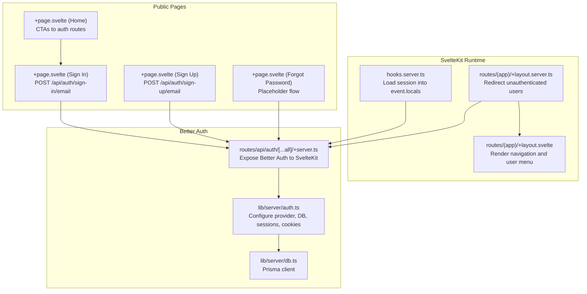
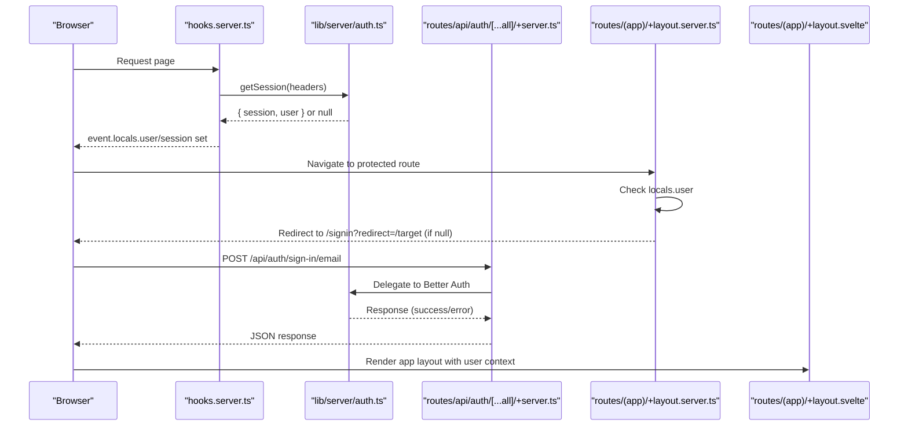
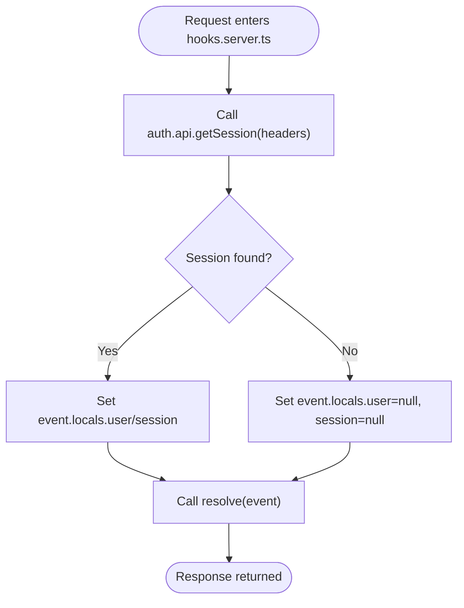
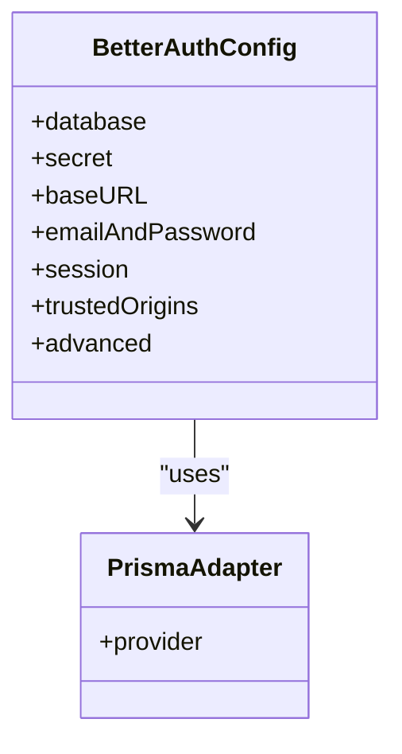
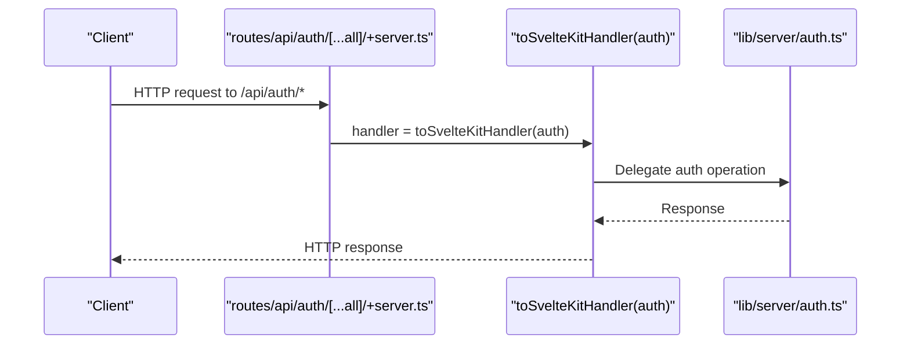
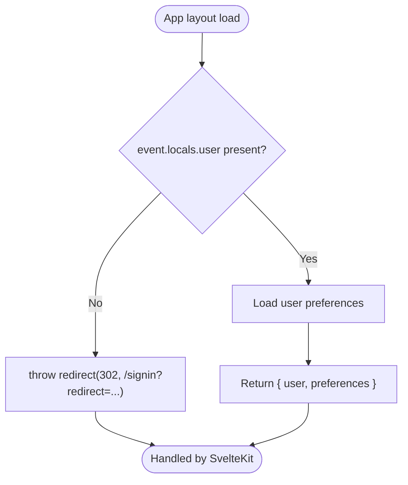
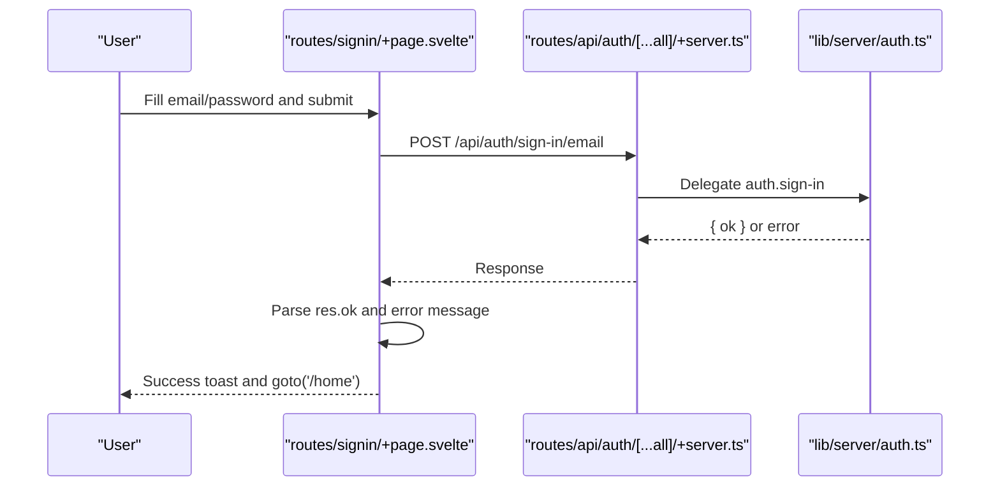
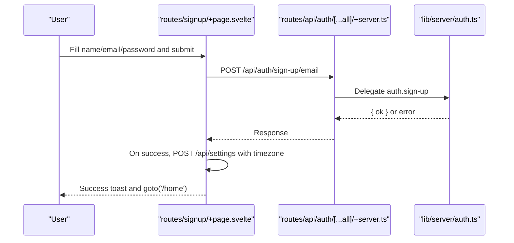
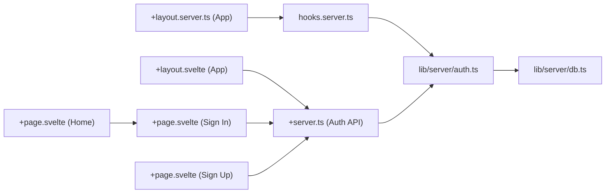

# Authentication Flow & Routes

<cite>
**Referenced Files in This Document**
- [hooks.server.ts](file://src/hooks.server.ts)
- [auth.ts](file://src/lib/server/auth.ts)
- [db.ts](file://src/lib/server/db.ts)
- [+page.svelte (Home)](file://src/routes/+page.svelte)
- [+layout.svelte (App)](file://src/routes/(app)/+layout.svelte)
- [+layout.server.ts (App)](file://src/routes/(app)/+layout.server.ts)
- [+page.svelte (Sign In)](file://src/routes/signin/+page.svelte)
- [+page.svelte (Sign Up)](file://src/routes/signup/+page.svelte)
- [+page.svelte (Forgot Password)](file://src/routes/forgot-password/+page.svelte)
- [+server.ts (Auth API)](file://src/routes/api/auth/[...all]/+server.ts)
</cite>

## Table of Contents
1. [Introduction](#introduction)
2. [Project Structure](#project-structure)
3. [Core Components](#core-components)
4. [Architecture Overview](#architecture-overview)
5. [Detailed Component Analysis](#detailed-component-analysis)
6. [Dependency Analysis](#dependency-analysis)
7. [Performance Considerations](#performance-considerations)
8. [Troubleshooting Guide](#troubleshooting-guide)
9. [Conclusion](#conclusion)

## Introduction
This document explains the authentication flow and route protection mechanisms in Screenlog. It covers the complete user journey from registration through login to session management, route protection using SvelteKit hooks, authentication state propagation, and redirect handling for authenticated/unauthenticated users. It also documents the API endpoints for authentication operations, form handling, and error responses, along with examples of protected route implementation and session validation.

## Project Structure
Authentication in Screenlog is implemented using Better Auth with SvelteKit. The key pieces are:
- A SvelteKit server hook that loads the current session and exposes user/session to the request context
- A Better Auth configuration that defines database adapter, credentials, session duration, and cookie behavior
- Public pages for sign-in, sign-up, and forgot-password that call Better Auth endpoints
- An app layout that enforces authentication and displays user context
- A dedicated auth API route that proxies Better Auth handlers to SvelteKit

**Diagram sources**
- [hooks.server.ts:1-18](file://src/hooks.server.ts#L1-L18)
- [auth.ts:1-27](file://src/lib/server/auth.ts#L1-L27)
- [db.ts:1-11](file://src/lib/server/db.ts#L1-L11)
- [+page.svelte (Sign In):1-77](file://src/routes/signin/+page.svelte#L1-L77)
- [+page.svelte (Sign Up):1-98](file://src/routes/signup/+page.svelte#L1-L98)
- [+page.svelte (Forgot Password):1-52](file://src/routes/forgot-password/+page.svelte#L1-L52)
- [+page.svelte (Home):1-81](file://src/routes/+page.svelte#L1-L81)
- [+layout.server.ts:1-17](file://src/routes/(app)/+layout.server.ts#L1-L17)
- [+layout.svelte (App):1-147](file://src/routes/(app)/+layout.svelte#L1-L147)
- [+server.ts (Auth API):1-7](file://src/routes/api/auth/[...all]/+server.ts#L1-L7)

**Section sources**
- [hooks.server.ts:1-18](file://src/hooks.server.ts#L1-L18)
- [auth.ts:1-27](file://src/lib/server/auth.ts#L1-L27)
- [db.ts:1-11](file://src/lib/server/db.ts#L1-L11)
- [+page.svelte (Sign In):1-77](file://src/routes/signin/+page.svelte#L1-L77)
- [+page.svelte (Sign Up):1-98](file://src/routes/signup/+page.svelte#L1-L98)
- [+page.svelte (Forgot Password):1-52](file://src/routes/forgot-password/+page.svelte#L1-L52)
- [+page.svelte (Home):1-81](file://src/routes/+page.svelte#L1-L81)
- [+layout.server.ts:1-17](file://src/routes/(app)/+layout.server.ts#L1-L17)
- [+layout.svelte (App):1-147](file://src/routes/(app)/+layout.svelte#L1-L147)
- [+server.ts (Auth API):1-7](file://src/routes/api/auth/[...all]/+server.ts#L1-L7)

## Core Components
- SvelteKit server hook: Loads the current session from Better Auth and attaches user/session to event.locals for downstream loaders and routes.
- Better Auth configuration: Defines database adapter (Prisma), email/password auth, session lifetime, cookie prefix, and base URL.
- Auth API route: Proxies Better Auth to SvelteKit using a unified handler for all HTTP methods.
- Protected app layout: Enforces authentication by redirecting unauthenticated users to the sign-in page with a redirect parameter.
- Public auth forms: Submit to Better Auth endpoints and navigate on success.

Key responsibilities:
- Session propagation: event.locals.user/session populated by the server hook
- Route protection: redirect in the app layout’s server load
- API surface: unified auth endpoint for all HTTP methods
- Form handling: client-side fetch calls to Better Auth endpoints with error parsing

**Section sources**
- [hooks.server.ts:1-18](file://src/hooks.server.ts#L1-L18)
- [auth.ts:1-27](file://src/lib/server/auth.ts#L1-L27)
- [+server.ts (Auth API):1-7](file://src/routes/api/auth/[...all]/+server.ts#L1-L7)
- [+layout.server.ts:1-17](file://src/routes/(app)/+layout.server.ts#L1-L17)
- [+page.svelte (Sign In):1-77](file://src/routes/signin/+page.svelte#L1-L77)
- [+page.svelte (Sign Up):1-98](file://src/routes/signup/+page.svelte#L1-L98)

## Architecture Overview
The authentication architecture integrates SvelteKit and Better Auth as follows:
- On every request, the server hook calls Better Auth to retrieve the session and sets event.locals.user/session
- App routes use a server load to enforce authentication and redirect if missing
- Public auth pages submit to Better Auth endpoints exposed via the unified API route
- The app layout renders navigation and user menu based on the presence of event.locals.user

**Diagram sources**
- [hooks.server.ts:1-18](file://src/hooks.server.ts#L1-L18)
- [auth.ts:1-27](file://src/lib/server/auth.ts#L1-L27)
- [+server.ts (Auth API):1-7](file://src/routes/api/auth/[...all]/+server.ts#L1-L7)
- [+layout.server.ts:1-17](file://src/routes/(app)/+layout.server.ts#L1-L17)
- [+layout.svelte (App):1-147](file://src/routes/(app)/+layout.svelte#L1-L147)

## Detailed Component Analysis

### SvelteKit Server Hook: Session Loading
- Purpose: Load the current session on every request and attach user/session to event.locals
- Behavior: Calls Better Auth API to retrieve session from request headers; on failure, clears user/session
- Impact: Makes user/session available to all loaders and routes via event.locals

**Diagram sources**
- [hooks.server.ts:1-18](file://src/hooks.server.ts#L1-L18)

**Section sources**
- [hooks.server.ts:1-18](file://src/hooks.server.ts#L1-L18)

### Better Auth Configuration: Provider, DB, Sessions, Cookies
- Provider: Email/password enabled with auto sign-in
- Database: Prisma adapter configured with PostgreSQL
- Sessions: 7-day expiry with 1-day update age
- Cookies: Custom cookie prefix applied
- Base URL and trusted origins: Controlled by environment variables

**Diagram sources**
- [auth.ts:1-27](file://src/lib/server/auth.ts#L1-L27)

**Section sources**
- [auth.ts:1-27](file://src/lib/server/auth.ts#L1-L27)
- [db.ts:1-11](file://src/lib/server/db.ts#L1-L11)

### Auth API Route: Unified Handler
- Purpose: Expose Better Auth to SvelteKit using a single handler for GET/POST/PUT/DELETE
- Behavior: Converts Better Auth to a SvelteKit-compatible handler and exports it for all methods

**Diagram sources**
- [+server.ts (Auth API):1-7](file://src/routes/api/auth/[...all]/+server.ts#L1-L7)
- [auth.ts:1-27](file://src/lib/server/auth.ts#L1-L27)

**Section sources**
- [+server.ts (Auth API):1-7](file://src/routes/api/auth/[...all]/+server.ts#L1-L7)

### Protected App Layout: Authentication Enforcement
- Purpose: Ensure all routes under the app layout require authentication
- Behavior: If event.locals.user is missing, redirect to /signin with the current pathname as a redirect parameter
- Additional: Loads user preferences and passes them to the UI

**Diagram sources**
- [+layout.server.ts:1-17](file://src/routes/(app)/+layout.server.ts#L1-L17)

**Section sources**
- [+layout.server.ts:1-17](file://src/routes/(app)/+layout.server.ts#L1-L17)

### Sign-In Page: Form Submission and Redirects
- Purpose: Authenticate existing users via email/password
- Behavior: Submits to the Better Auth sign-in endpoint; on success, navigates to /home; on error, parses message and shows toast

**Diagram sources**
- [+page.svelte (Sign In):1-77](file://src/routes/signin/+page.svelte#L1-L77)
- [+server.ts (Auth API):1-7](file://src/routes/api/auth/[...all]/+server.ts#L1-L7)
- [auth.ts:1-27](file://src/lib/server/auth.ts#L1-L27)

**Section sources**
- [+page.svelte (Sign In):1-77](file://src/routes/signin/+page.svelte#L1-L77)

### Sign-Up Page: Registration and Preferences
- Purpose: Create new accounts and set initial preferences
- Behavior: Submits to the Better Auth sign-up endpoint; on success, attempts to save timezone via a settings endpoint; navigates to /home

**Diagram sources**
- [+page.svelte (Sign Up):1-98](file://src/routes/signup/+page.svelte#L1-L98)
- [+server.ts (Auth API):1-7](file://src/routes/api/auth/[...all]/+server.ts#L1-L7)
- [auth.ts:1-27](file://src/lib/server/auth.ts#L1-L27)

**Section sources**
- [+page.svelte (Sign Up):1-98](file://src/routes/signup/+page.svelte#L1-L98)

### Forgot Password Page: Placeholder Flow
- Purpose: Present a placeholder for password reset initiation
- Behavior: On submission, simulates a network delay and shows a success toast; actual reset flow can be wired to Better Auth later

**Section sources**
- [+page.svelte (Forgot Password):1-52](file://src/routes/forgot-password/+page.svelte#L1-L52)

### App Layout UI: Navigation and User Menu
- Purpose: Render navigation and user controls when authenticated
- Behavior: Displays theme selector, settings, profile, and logout; logout triggers a POST to the Better Auth sign-out endpoint and redirects to home

**Section sources**
- [+layout.svelte (App):1-147](file://src/routes/(app)/+layout.svelte#L1-L147)

## Dependency Analysis
The authentication subsystem exhibits clear separation of concerns:
- hooks.server.ts depends on auth.ts to load sessions
- auth.ts depends on db.ts for Prisma client
- routes/api/auth/[...all]/+server.ts depends on auth.ts and Better Auth’s SvelteKit adapter
- routes/(app)/+layout.server.ts depends on event.locals.user to enforce protection
- Public auth pages depend on the unified auth API route

**Diagram sources**
- [hooks.server.ts:1-18](file://src/hooks.server.ts#L1-L18)
- [auth.ts:1-27](file://src/lib/server/auth.ts#L1-L27)
- [db.ts:1-11](file://src/lib/server/db.ts#L1-L11)
- [+server.ts (Auth API):1-7](file://src/routes/api/auth/[...all]/+server.ts#L1-L7)
- [+layout.server.ts:1-17](file://src/routes/(app)/+layout.server.ts#L1-L17)
- [+layout.svelte (App):1-147](file://src/routes/(app)/+layout.svelte#L1-L147)
- [+page.svelte (Sign In):1-77](file://src/routes/signin/+page.svelte#L1-L77)
- [+page.svelte (Sign Up):1-98](file://src/routes/signup/+page.svelte#L1-L98)
- [+page.svelte (Home):1-81](file://src/routes/+page.svelte#L1-L81)

**Section sources**
- [hooks.server.ts:1-18](file://src/hooks.server.ts#L1-L18)
- [auth.ts:1-27](file://src/lib/server/auth.ts#L1-L27)
- [db.ts:1-11](file://src/lib/server/db.ts#L1-L11)
- [+server.ts (Auth API):1-7](file://src/routes/api/auth/[...all]/+server.ts#L1-L7)
- [+layout.server.ts:1-17](file://src/routes/(app)/+layout.server.ts#L1-L17)
- [+layout.svelte (App):1-147](file://src/routes/(app)/+layout.svelte#L1-L147)
- [+page.svelte (Sign In):1-77](file://src/routes/signin/+page.svelte#L1-L77)
- [+page.svelte (Sign Up):1-98](file://src/routes/signup/+page.svelte#L1-L98)
- [+page.svelte (Home):1-81](file://src/routes/+page.svelte#L1-L81)

## Performance Considerations
- Session retrieval cost: The server hook performs a single session lookup per request; caching strategies can be considered at the Better Auth level (e.g., cookie cache) to reduce backend calls.
- Redirect overhead: The app layout redirect occurs only when event.locals.user is missing; ensure minimal work in server load beyond session checks.
- Network latency: Public auth forms rely on fetch calls to the unified auth API; keep payloads small and responses fast.

[No sources needed since this section provides general guidance]

## Troubleshooting Guide
Common issues and remedies:
- Unauthenticated redirect loop: Ensure event.locals.user is being set by the server hook; verify Better Auth base URL and trusted origins match deployment.
- Login failures: Check that the sign-in form posts to the correct endpoint and that error messages are parsed from the response body.
- Logout not reflected: Confirm the sign-out endpoint is invoked and that the app layout reloads user context on next request.
- Session persistence: Verify cookie prefix and secure cookie settings align with deployment environment.

**Section sources**
- [hooks.server.ts:1-18](file://src/hooks.server.ts#L1-L18)
- [+page.svelte (Sign In):1-77](file://src/routes/signin/+page.svelte#L1-L77)
- [+layout.server.ts:1-17](file://src/routes/(app)/+layout.server.ts#L1-L17)
- [+layout.svelte (App):1-147](file://src/routes/(app)/+layout.svelte#L1-L147)

## Conclusion
Screenlog’s authentication system leverages Better Auth with SvelteKit hooks and a unified auth API route to provide a seamless user experience. The server hook ensures session availability across requests, the app layout enforces protection, and public pages integrate with Better Auth endpoints for sign-in, sign-up, and password reset. Together, these components deliver robust session management, route protection, and user context propagation throughout the application.