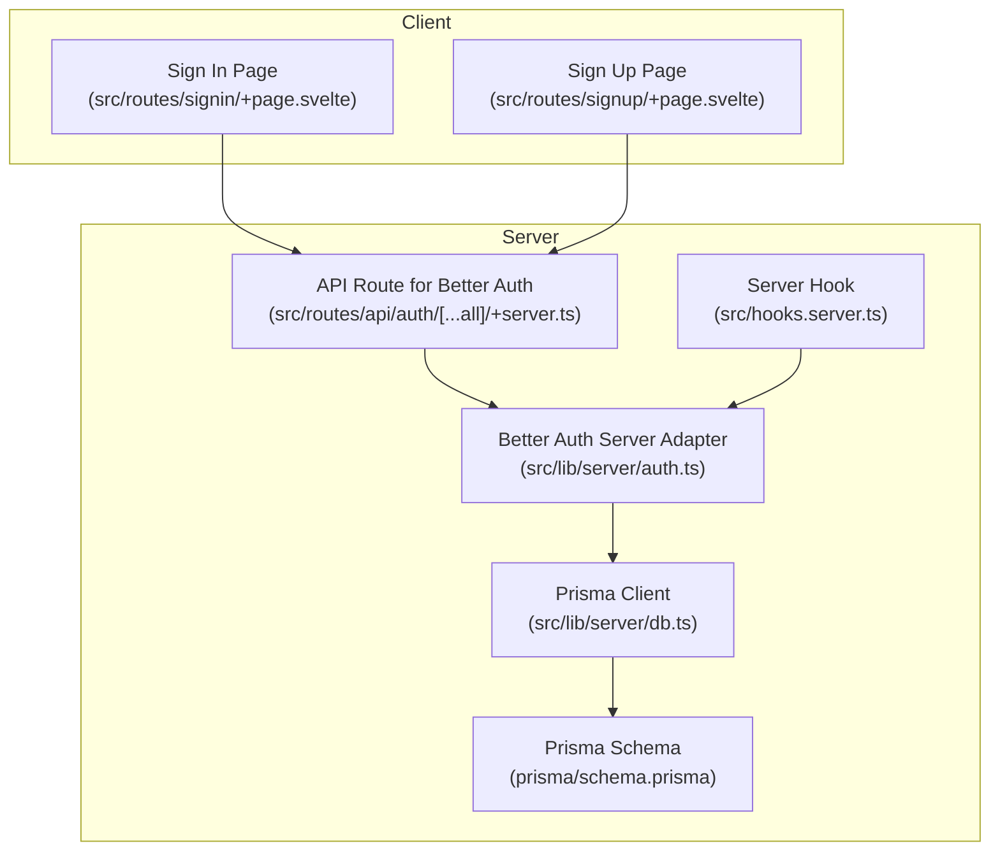
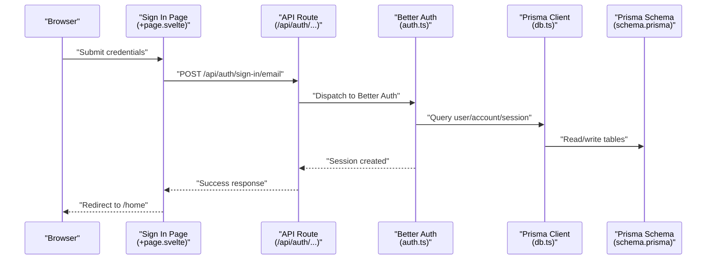
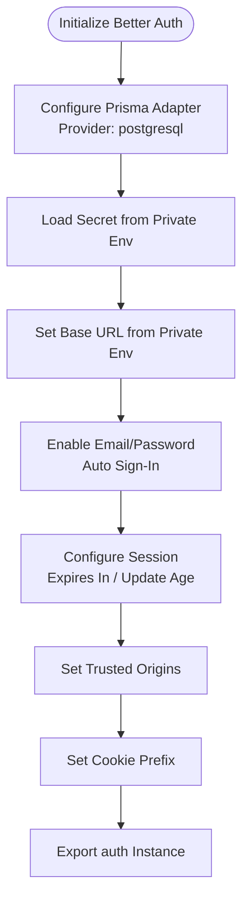
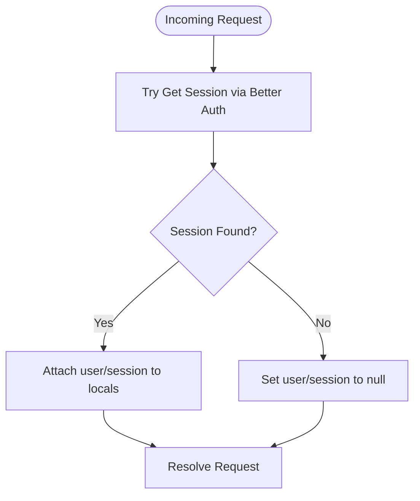
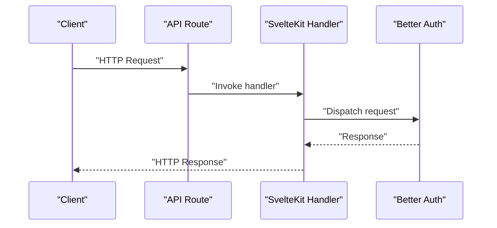
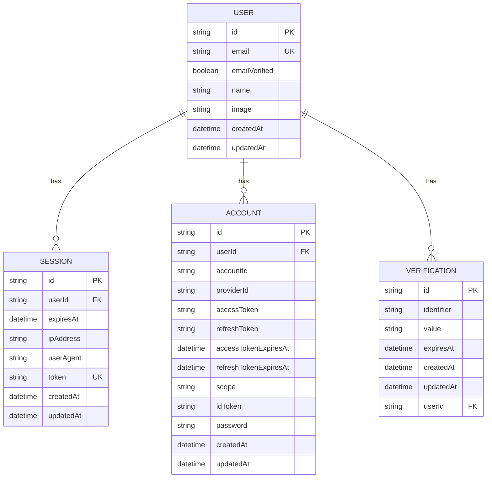
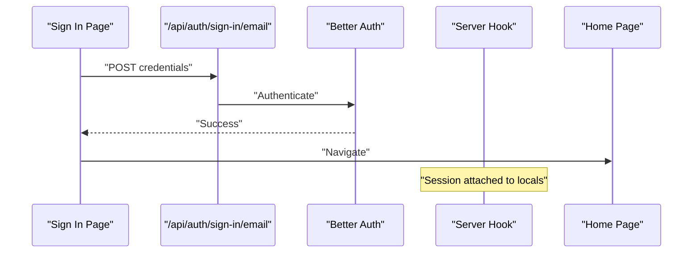
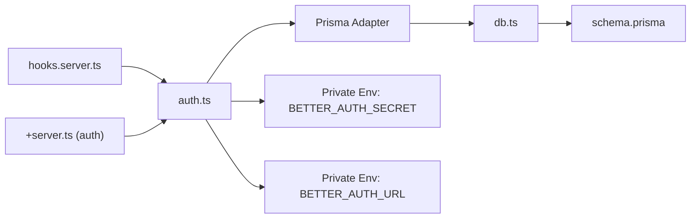

# Authentication System

<cite>
**Referenced Files in This Document**
- [src/lib/server/auth.ts](file://src/lib/server/auth.ts)
- [src/routes/api/auth/[...all]/+server.ts](file://src/routes/api/auth/[...all]/+server.ts)
- [src/hooks.server.ts](file://src/hooks.server.ts)
- [src/lib/server/db.ts](file://src/lib/server/db.ts)
- [prisma/schema.prisma](file://prisma/schema.prisma)
- [package.json](file://package.json)
- [src/routes/signin/+page.svelte](file://src/routes/signin/+page.svelte)
- [src/routes/signup/+page.svelte](file://src/routes/signup/+page.svelte)
</cite>

## Table of Contents
1. [Introduction](#introduction)
2. [Project Structure](#project-structure)
3. [Core Components](#core-components)
4. [Architecture Overview](#architecture-overview)
5. [Detailed Component Analysis](#detailed-component-analysis)
6. [Dependency Analysis](#dependency-analysis)
7. [Performance Considerations](#performance-considerations)
8. [Security Best Practices](#security-best-practices)
9. [Troubleshooting Guide](#troubleshooting-guide)
10. [Conclusion](#conclusion)

## Introduction
This document explains the authentication system for Screenlog with Better Auth integration and security implementation. It covers the end-to-end authentication flow from user registration to session management, server-side setup, session handling, route protection, Prisma integration for user persistence, environment variable usage, and security considerations. It also provides troubleshooting guidance and security audit recommendations.

## Project Structure
The authentication system spans SvelteKit server hooks, a dedicated Better Auth server adapter, SvelteKit API routes, and Prisma models. The following diagram shows how these pieces fit together.

**Diagram sources**
- [src/routes/signin/+page.svelte:1-77](file://src/routes/signin/+page.svelte#L1-L77)
- [src/routes/signup/+page.svelte:1-98](file://src/routes/signup/+page.svelte#L1-L98)
- [src/routes/api/auth/[...all]/+server.ts:1-7](file://src/routes/api/auth/[...all]/+server.ts#L1-L7)
- [src/lib/server/auth.ts:1-27](file://src/lib/server/auth.ts#L1-L27)
- [src/lib/server/db.ts:1-11](file://src/lib/server/db.ts#L1-L11)
- [prisma/schema.prisma:1-258](file://prisma/schema.prisma#L1-L258)
- [src/hooks.server.ts:1-18](file://src/hooks.server.ts#L1-L18)

**Section sources**
- [src/routes/signin/+page.svelte:1-77](file://src/routes/signin/+page.svelte#L1-L77)
- [src/routes/signup/+page.svelte:1-98](file://src/routes/signup/+page.svelte#L1-L98)
- [src/routes/api/auth/[...all]/+server.ts:1-7](file://src/routes/api/auth/[...all]/+server.ts#L1-L7)
- [src/lib/server/auth.ts:1-27](file://src/lib/server/auth.ts#L1-L27)
- [src/lib/server/db.ts:1-11](file://src/lib/server/db.ts#L1-L11)
- [prisma/schema.prisma:1-258](file://prisma/schema.prisma#L1-L258)
- [src/hooks.server.ts:1-18](file://src/hooks.server.ts#L1-L18)

## Core Components
- Better Auth configuration and session management
  - Configures Better Auth with Prisma adapter, secret, base URL, email/password, session durations, trusted origins, and cookie prefix.
  - Exports the auth instance for use across the app.
- SvelteKit server hook
  - Resolves Better Auth session on every request and attaches user/session to locals for downstream routes.
- API route for Better Auth
  - Bridges Better Auth to SvelteKit via the SvelteKit handler wrapper.
- Prisma integration
  - Provides a singleton Prisma client and defines Better Auth tables and application content tables.
- Frontend sign-in and sign-up pages
  - Submit credentials to Better Auth endpoints and redirect on success.

**Section sources**
- [src/lib/server/auth.ts:1-27](file://src/lib/server/auth.ts#L1-L27)
- [src/hooks.server.ts:1-18](file://src/hooks.server.ts#L1-L18)
- [src/routes/api/auth/[...all]/+server.ts:1-7](file://src/routes/api/auth/[...all]/+server.ts#L1-L7)
- [src/lib/server/db.ts:1-11](file://src/lib/server/db.ts#L1-L11)
- [prisma/schema.prisma:1-258](file://prisma/schema.prisma#L1-L258)
- [src/routes/signin/+page.svelte:1-77](file://src/routes/signin/+page.svelte#L1-L77)
- [src/routes/signup/+page.svelte:1-98](file://src/routes/signup/+page.svelte#L1-L98)

## Architecture Overview
The authentication flow integrates SvelteKit’s server hook, Better Auth, and Prisma. The server hook initializes the session on each request, while the API route exposes Better Auth endpoints. The frontend interacts with these endpoints via the sign-in and sign-up pages.

**Diagram sources**
- [src/routes/signin/+page.svelte:1-77](file://src/routes/signin/+page.svelte#L1-L77)
- [src/routes/api/auth/[...all]/+server.ts:1-7](file://src/routes/api/auth/[...all]/+server.ts#L1-L7)
- [src/lib/server/auth.ts:1-27](file://src/lib/server/auth.ts#L1-L27)
- [src/lib/server/db.ts:1-11](file://src/lib/server/db.ts#L1-L11)
- [prisma/schema.prisma:1-258](file://prisma/schema.prisma#L1-L258)

## Detailed Component Analysis

### Better Auth Configuration
- Database adapter: Prisma adapter configured with PostgreSQL provider.
- Secret and base URL: Loaded from private environment variables.
- Email/password: Enabled with auto sign-in.
- Session policy: Fixed lifetime and rolling update age.
- Security: Trusted origins and cookie prefix configured.
- Export: Provides the auth instance for use in handlers and hooks.

**Diagram sources**
- [src/lib/server/auth.ts:1-27](file://src/lib/server/auth.ts#L1-L27)

**Section sources**
- [src/lib/server/auth.ts:1-27](file://src/lib/server/auth.ts#L1-L27)

### SvelteKit Server Hook
- On every request, resolves the current session using Better Auth.
- Attaches user and session to event.locals for downstream usage.
- Gracefully handles errors by clearing user/session on failure.

**Diagram sources**
- [src/hooks.server.ts:1-18](file://src/hooks.server.ts#L1-L18)

**Section sources**
- [src/hooks.server.ts:1-18](file://src/hooks.server.ts#L1-L18)

### API Route for Better Auth
- Wraps Better Auth with SvelteKit handler.
- Exposes unified GET/POST/PUT/DELETE handlers for all Better Auth endpoints.

**Diagram sources**
- [src/routes/api/auth/[...all]/+server.ts:1-7](file://src/routes/api/auth/[...all]/+server.ts#L1-L7)

**Section sources**
- [src/routes/api/auth/[...all]/+server.ts:1-7](file://src/routes/api/auth/[...all]/+server.ts#L1-L7)

### Prisma Integration and Models
- Prisma client is initialized as a singleton.
- Better Auth tables: User, Session, Account, Verification.
- Application content tables: Show, Season, Episode, Movie, UserShow, UserMovie, EpisodeProgress, Activity, UserPreference.
- Relations: Sessions belong to Users; Accounts belong to Users; Verifications belong to Users; Content relations connect to users via foreign keys.

**Diagram sources**
- [prisma/schema.prisma:1-258](file://prisma/schema.prisma#L1-L258)
- [src/lib/server/db.ts:1-11](file://src/lib/server/db.ts#L1-L11)

**Section sources**
- [prisma/schema.prisma:1-258](file://prisma/schema.prisma#L1-L258)
- [src/lib/server/db.ts:1-11](file://src/lib/server/db.ts#L1-L11)

### Frontend Authentication Pages
- Sign In page
  - Submits email/password to the Better Auth sign-in endpoint.
  - Handles errors and redirects to home on success.
- Sign Up page
  - Submits name, email, password to the Better Auth sign-up endpoint.
  - Optionally sets user timezone via a subsequent API call.

**Diagram sources**
- [src/routes/signin/+page.svelte:1-77](file://src/routes/signin/+page.svelte#L1-L77)
- [src/routes/api/auth/[...all]/+server.ts:1-7](file://src/routes/api/auth/[...all]/+server.ts#L1-L7)
- [src/hooks.server.ts:1-18](file://src/hooks.server.ts#L1-L18)

**Section sources**
- [src/routes/signin/+page.svelte:1-77](file://src/routes/signin/+page.svelte#L1-L77)
- [src/routes/signup/+page.svelte:1-98](file://src/routes/signup/+page.svelte#L1-L98)
- [src/routes/api/auth/[...all]/+server.ts:1-7](file://src/routes/api/auth/[...all]/+server.ts#L1-L7)
- [src/hooks.server.ts:1-18](file://src/hooks.server.ts#L1-L18)

## Dependency Analysis
- Better Auth depends on Prisma adapter and the Prisma client.
- The SvelteKit server hook depends on Better Auth to populate session data.
- The API route depends on Better Auth to handle authentication requests.
- Environment variables provide secrets and base URLs to Better Auth.

**Diagram sources**
- [src/lib/server/auth.ts:1-27](file://src/lib/server/auth.ts#L1-L27)
- [src/hooks.server.ts:1-18](file://src/hooks.server.ts#L1-L18)
- [src/routes/api/auth/[...all]/+server.ts:1-7](file://src/routes/api/auth/[...all]/+server.ts#L1-L7)
- [src/lib/server/db.ts:1-11](file://src/lib/server/db.ts#L1-L11)
- [prisma/schema.prisma:1-258](file://prisma/schema.prisma#L1-L258)

**Section sources**
- [src/lib/server/auth.ts:1-27](file://src/lib/server/auth.ts#L1-L27)
- [src/hooks.server.ts:1-18](file://src/hooks.server.ts#L1-L18)
- [src/routes/api/auth/[...all]/+server.ts:1-7](file://src/routes/api/auth/[...all]/+server.ts#L1-L7)
- [src/lib/server/db.ts:1-11](file://src/lib/server/db.ts#L1-L11)
- [prisma/schema.prisma:1-258](file://prisma/schema.prisma#L1-L258)
- [package.json:26-45](file://package.json#L26-L45)

## Performance Considerations
- Session lifecycle: Configure session expiration and update age to balance security and UX.
- Prisma client reuse: The singleton pattern avoids connection overhead.
- Network boundaries: Ensure base URL and trusted origins are correctly set to prevent unnecessary CORS or redirect loops.
- Frontend redirects: Minimize extra API calls after successful authentication to reduce latency.

[No sources needed since this section provides general guidance]

## Security Best Practices
- Environment variables
  - Keep BETTER_AUTH_SECRET and BETTER_AUTH_URL in private environment variables.
  - Avoid committing secrets to version control.
- Cookie security
  - Use secure, same-site, and httpOnly cookie policies in production deployments.
  - Ensure BASE_URL matches the deployed origin.
- Session management
  - Set appropriate session expiry and update intervals.
  - Enforce trusted origins to mitigate CSRF risks.
- Input validation and sanitization
  - Validate and sanitize user inputs on the server.
- Rate limiting and monitoring
  - Implement rate limits on authentication endpoints.
  - Monitor failed attempts and suspicious activity.
- HTTPS enforcement
  - Serve the application over HTTPS in production.
- Least privilege
  - Restrict access to sensitive routes and data.

[No sources needed since this section provides general guidance]

## Troubleshooting Guide
- Session not persisting
  - Verify server hook is installed and resolves session on every request.
  - Confirm cookies are being sent and accepted by the browser.
- Authentication endpoint failures
  - Check that the API route is correctly forwarding requests to Better Auth.
  - Validate base URL and trusted origins configuration.
- Database connectivity
  - Ensure DATABASE_URL is set and reachable.
  - Confirm Prisma client initialization and migrations are applied.
- Environment variables missing
  - Verify BETTER_AUTH_SECRET and BETTER_AUTH_URL are present in the runtime environment.
- Redirect loops or CORS errors
  - Align BETTER_AUTH_URL with the deployed origin.
  - Confirm trusted origins include the base URL.

**Section sources**
- [src/hooks.server.ts:1-18](file://src/hooks.server.ts#L1-L18)
- [src/routes/api/auth/[...all]/+server.ts:1-7](file://src/routes/api/auth/[...all]/+server.ts#L1-L7)
- [src/lib/server/auth.ts:1-27](file://src/lib/server/auth.ts#L1-L27)
- [src/lib/server/db.ts:1-11](file://src/lib/server/db.ts#L1-L11)
- [prisma/schema.prisma:1-258](file://prisma/schema.prisma#L1-L258)

## Conclusion
Screenlog’s authentication system integrates SvelteKit with Better Auth and Prisma to provide a robust, secure, and maintainable solution. The server hook ensures consistent session availability, the API route exposes Better Auth endpoints, and Prisma persists user and session data. By following the security best practices and troubleshooting steps outlined here, you can maintain a reliable and secure authentication experience.