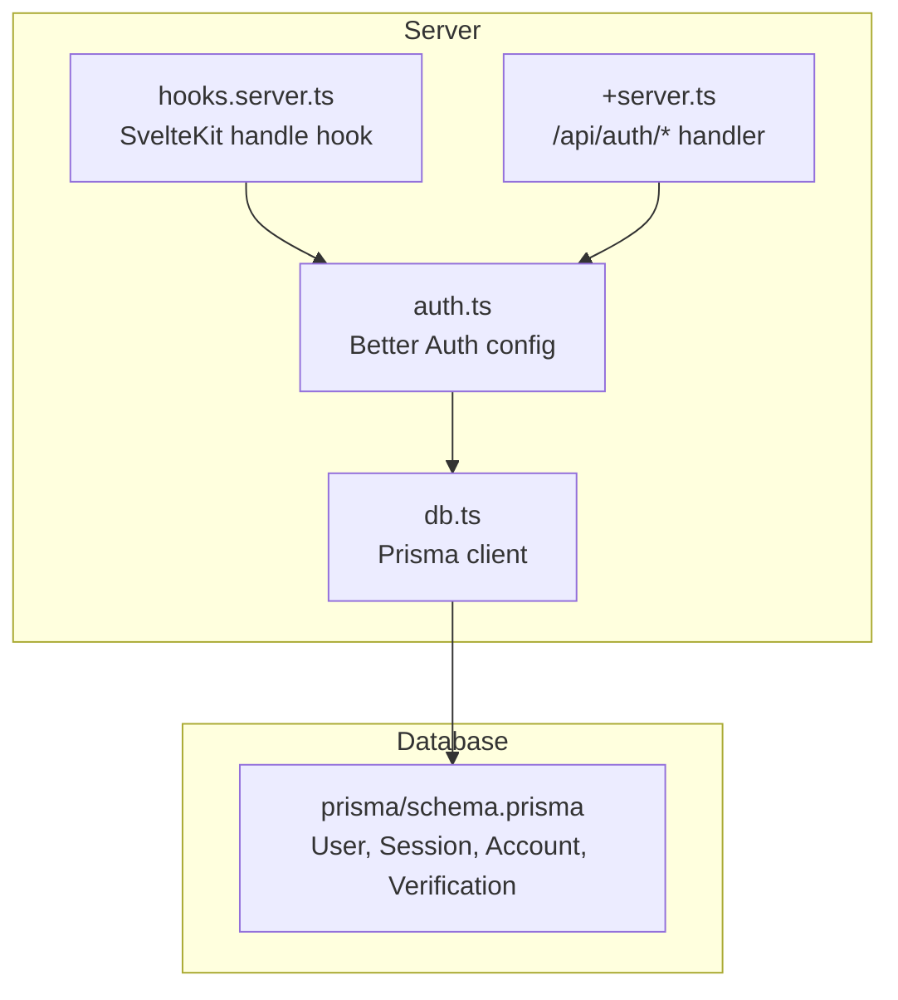
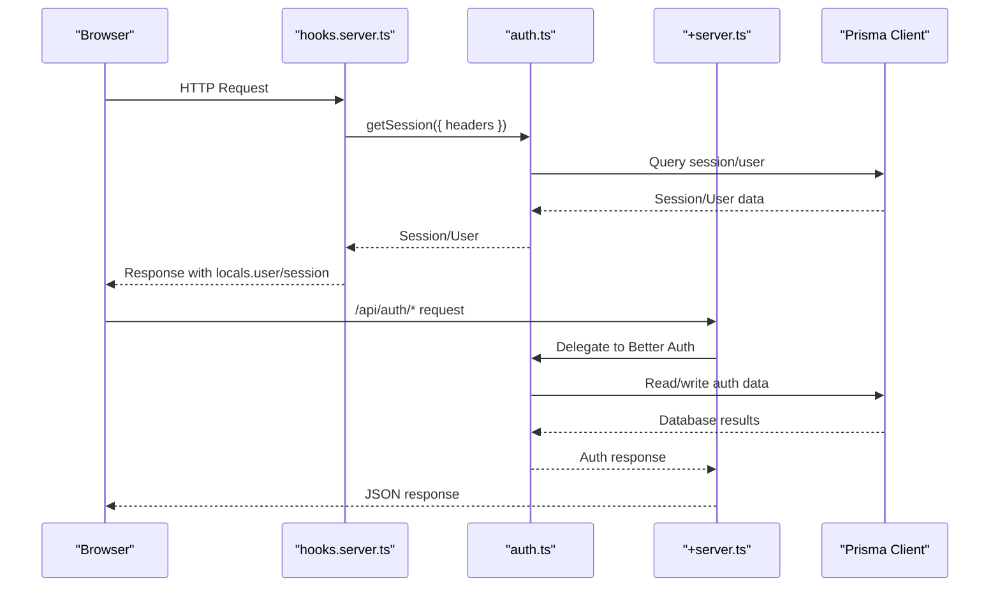
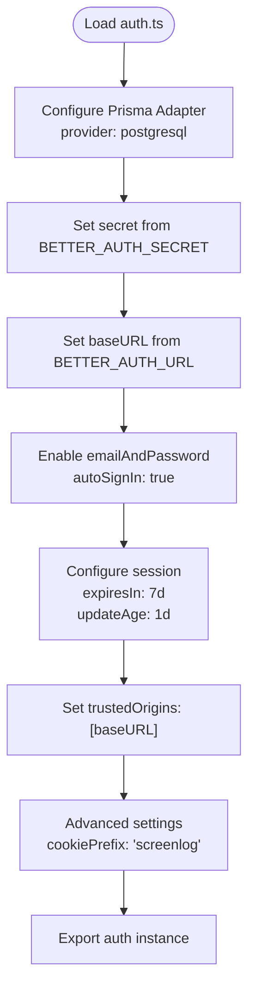
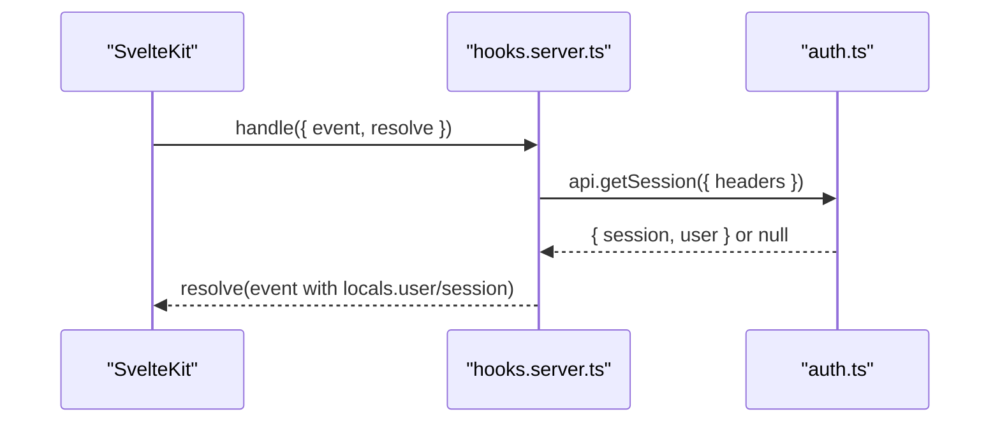
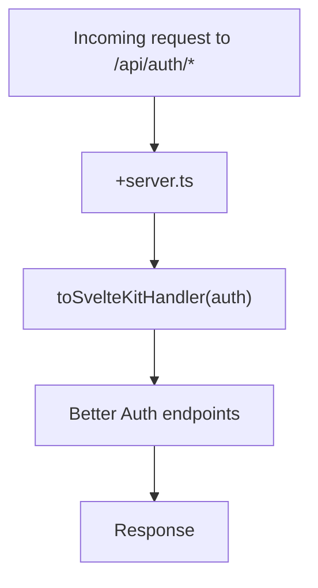
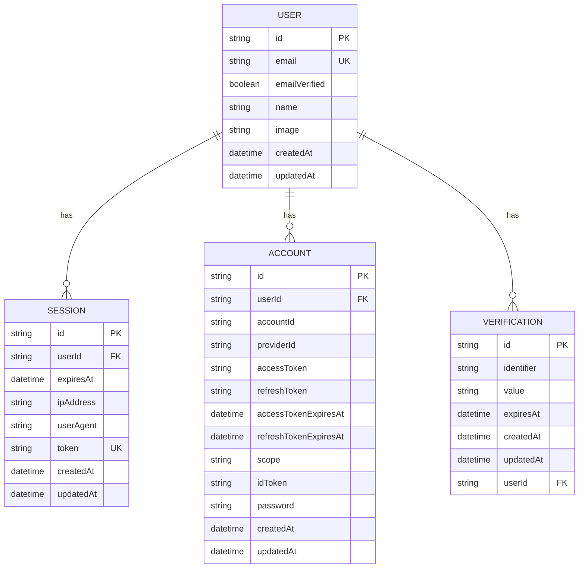
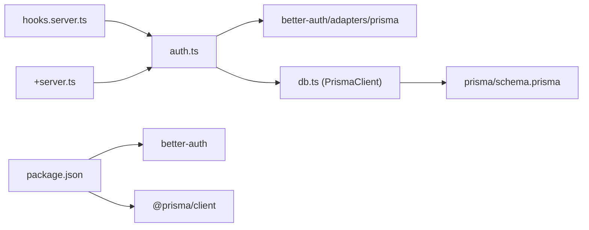

# Better Auth Configuration

<cite>
**Referenced Files in This Document**
- [auth.ts](file://src/lib/server/auth.ts)
- [hooks.server.ts](file://src/hooks.server.ts)
- [db.ts](file://src/lib/server/db.ts)
- [schema.prisma](file://prisma/schema.prisma)
- [prisma.config.ts](file://prisma.config.ts)
- [package.json](file://package.json)
- [SKILL.md](file://.agents/skills/better-auth-best-practices/SKILL.md)
- [+server.ts](file://src/routes/api/auth/[...all]/+server.ts)
</cite>

## Table of Contents
1. [Introduction](#introduction)
2. [Project Structure](#project-structure)
3. [Core Components](#core-components)
4. [Architecture Overview](#architecture-overview)
5. [Detailed Component Analysis](#detailed-component-analysis)
6. [Dependency Analysis](#dependency-analysis)
7. [Performance Considerations](#performance-considerations)
8. [Troubleshooting Guide](#troubleshooting-guide)
9. [Conclusion](#conclusion)
10. [Appendices](#appendices)

## Introduction
This document explains the Better Auth configuration in Screenlog, focusing on database adapter setup with Prisma, email/password authentication, session management, security configurations, secret key management, base URL configuration, trusted origins, cookie prefix settings, environment variables, session expiration policies, and advanced configuration options. It also provides guidance on customizing authentication behavior and integrating with existing Prisma models.

## Project Structure
Better Auth is configured centrally and integrated with SvelteKit hooks and a dedicated API route. The Prisma schema defines the database models used by Better Auth, including user, session, account, and verification records. The configuration is encapsulated in a single module and consumed by the SvelteKit server hooks and API handlers.

**Diagram sources**
- [hooks.server.ts:1-18](file://src/hooks.server.ts#L1-L18)
- [auth.ts:1-27](file://src/lib/server/auth.ts#L1-L27)
- [+server.ts:1-7](file://src/routes/api/auth/[...all]/+server.ts#L1-L7)
- [db.ts:1-11](file://src/lib/server/db.ts#L1-L11)
- [schema.prisma:1-258](file://prisma/schema.prisma#L1-L258)

**Section sources**
- [auth.ts:1-27](file://src/lib/server/auth.ts#L1-L27)
- [hooks.server.ts:1-18](file://src/hooks.server.ts#L1-L18)
- [schema.prisma:1-258](file://prisma/schema.prisma#L1-L258)

## Core Components
- Better Auth configuration module: Defines database adapter, email/password settings, session policies, trusted origins, and advanced cookie prefix.
- SvelteKit handle hook: Extracts session and user from Better Auth on every request.
- API route handler: Exposes Better Auth endpoints to SvelteKit.
- Prisma client and schema: Provides database adapter and models for Better Auth.

Key configuration highlights:
- Database adapter: Prisma adapter connected to a PostgreSQL datasource.
- Email/password: Enabled with auto sign-in.
- Session: 7-day expiry with 1-day update age.
- Trusted origins: Derived from base URL.
- Cookie prefix: "screenlog".

**Section sources**
- [auth.ts:6-24](file://src/lib/server/auth.ts#L6-L24)
- [hooks.server.ts:4-16](file://src/hooks.server.ts#L4-L16)
- [+server.ts:1-7](file://src/routes/api/auth/[...all]/+server.ts#L1-L7)
- [schema.prisma:10-82](file://prisma/schema.prisma#L10-L82)

## Architecture Overview
The authentication flow integrates Better Auth with SvelteKit through a server hook and a unified API route. The hook retrieves the current session and attaches user/session data to the request locals. The API route exposes all Better Auth endpoints to the application.

**Diagram sources**
- [hooks.server.ts:4-16](file://src/hooks.server.ts#L4-L16)
- [auth.ts:6-24](file://src/lib/server/auth.ts#L6-L24)
- [+server.ts:1-7](file://src/routes/api/auth/[...all]/+server.ts#L1-L7)
- [db.ts:1-11](file://src/lib/server/db.ts#L1-L11)

## Detailed Component Analysis

### Better Auth Configuration Module
This module initializes Better Auth with:
- Database adapter: Prisma adapter bound to a PostgreSQL datasource.
- Secrets and base URL: Loaded from SvelteKit private static environment variables.
- Email/password: Enabled with automatic sign-in.
- Session policy: 7-day expiry and 1-day update age.
- Trusted origins: Whitelisted to the base URL.
- Advanced: Cookie prefix set to "screenlog".

**Diagram sources**
- [auth.ts:6-24](file://src/lib/server/auth.ts#L6-L24)

**Section sources**
- [auth.ts:1-27](file://src/lib/server/auth.ts#L1-L27)

### SvelteKit Handle Hook Integration
The SvelteKit handle hook calls Better Auth to retrieve the current session and user, attaching them to the request locals. It wraps the operation in a try/catch to ensure graceful failure handling.

**Diagram sources**
- [hooks.server.ts:4-16](file://src/hooks.server.ts#L4-L16)
- [auth.ts:6-24](file://src/lib/server/auth.ts#L6-L24)

**Section sources**
- [hooks.server.ts:1-18](file://src/hooks.server.ts#L1-L18)

### API Route Handler
The API route handler delegates all Better Auth endpoints to SvelteKit using the provided adapter. This ensures all auth routes (/api/auth/...) are served consistently within the SvelteKit ecosystem.

**Diagram sources**
- [+server.ts:1-7](file://src/routes/api/auth/[...all]/+server.ts#L1-L7)
- [auth.ts:1-27](file://src/lib/server/auth.ts#L1-L27)

**Section sources**
- [+server.ts:1-7](file://src/routes/api/auth/[...all]/+server.ts#L1-L7)

### Prisma Database Adapter and Models
Better Auth relies on Prisma models for user, session, account, and verification records. The schema defines:
- User: email, emailVerified, name, image, timestamps, and relations to sessions/accounts/verifications.
- Session: token, userId, expiresAt, IP/user agent, timestamps, and relation to User.
- Account: providerId, account credentials/tokens, scopes, and relation to User.
- Verification: identifier/value/expiresAt with relation to User.

The Prisma client is initialized globally and used by the Better Auth adapter.

**Diagram sources**
- [schema.prisma:10-82](file://prisma/schema.prisma#L10-L82)

**Section sources**
- [schema.prisma:10-82](file://prisma/schema.prisma#L10-L82)
- [db.ts:1-11](file://src/lib/server/db.ts#L1-L11)

### Environment Variables and Secrets
Secret management and base URL configuration are loaded from SvelteKit private static environment variables:
- BETTER_AUTH_SECRET: Used as the encryption secret for Better Auth.
- BETTER_AUTH_URL: Used as the base URL and trusted origin.

The configuration module sets both secret and baseURL from these environment variables.

**Section sources**
- [auth.ts:4,10-11](file://src/lib/server/auth.ts#L4,L10-L11)
- [SKILL.md:25-29](file://.agents/skills/better-auth-best-practices/SKILL.md#L25-L29)

### Session Management Parameters
Session behavior is configured with:
- expiresIn: 7 days
- updateAge: 1 day

These values control token lifetime and renewal thresholds.

**Section sources**
- [auth.ts:16-19](file://src/lib/server/auth.ts#L16-L19)

### Security and Advanced Configuration
Security and advanced settings include:
- trustedOrigins: Set to the base URL to enable CSRF protection against same-origin violations.
- advanced.cookiePrefix: "screenlog" to namespace cookies for this application.

These settings help isolate auth cookies and mitigate cross-origin risks.

**Section sources**
- [auth.ts:20,21-23](file://src/lib/server/auth.ts#L20,L21-L23)

### Integrating with Existing Prisma Models
Better Auth uses the following models from the schema:
- User: core identity and relations
- Session: session lifecycle and device info
- Account: providerId/accountId and password/token storage
- Verification: email verification records

To integrate Better Auth with existing application models, ensure:
- The User model remains unchanged to preserve identity.
- Additional application-specific models (shows, movies, progress) coexist with Better Auth tables.
- Migrations are applied to align with Better Auth adapter expectations.

**Section sources**
- [schema.prisma:10-82](file://prisma/schema.prisma#L10-L82)
- [schema.prisma:84-257](file://prisma/schema.prisma#L84-L257)

## Dependency Analysis
Better Auth depends on Prisma for persistence and SvelteKit for server integration. The dependency chain is:

**Diagram sources**
- [auth.ts:1-3](file://src/lib/server/auth.ts#L1-L3)
- [db.ts:1-11](file://src/lib/server/db.ts#L1-L11)
- [schema.prisma:1-258](file://prisma/schema.prisma#L1-L258)
- [hooks.server.ts:1](file://src/hooks.server.ts#L1)
- [+server.ts:1-2](file://src/routes/api/auth/[...all]/+server.ts#L1-L2)
- [package.json:26-44](file://package.json#L26-L44)

**Section sources**
- [auth.ts:1-3](file://src/lib/server/auth.ts#L1-L3)
- [db.ts:1-11](file://src/lib/server/db.ts#L1-L11)
- [hooks.server.ts:1](file://src/hooks.server.ts#L1)
- [+server.ts:1-2](file://src/routes/api/auth/[...all]/+server.ts#L1-L2)
- [package.json:26-44](file://package.json#L26-L44)

## Performance Considerations
- Session caching: Consider enabling cookie cache strategies for reduced server load when scaling.
- Rate limiting: Enable and tune rate limits for authentication endpoints to prevent abuse.
- Database indexing: Ensure proper indexing on User.email, Session.token, and Account.providerId/accountId for efficient lookups.
- Background tasks: Use background task handlers for cleanup jobs (e.g., expired sessions).

[No sources needed since this section provides general guidance]

## Troubleshooting Guide
Common issues and resolutions:
- Missing environment variables: Ensure BETTER_AUTH_SECRET and BETTER_AUTH_URL are set. The configuration module requires both.
- Session retrieval failures: The handle hook catches errors and sets user/session to null; verify headers and CORS/trusted origins.
- Cookie conflicts: If multiple apps share domains, adjust advanced.cookiePrefix to avoid collisions.
- Database connectivity: Confirm Prisma client initialization and DATABASE_URL in prisma.config.ts.

**Section sources**
- [auth.ts:4,10-11](file://src/lib/server/auth.ts#L4,L10-L11)
- [hooks.server.ts:5-14](file://src/hooks.server.ts#L5-L14)
- [prisma.config.ts:11-14](file://prisma.config.ts#L11-L14)

## Conclusion
Screenlog’s Better Auth setup leverages a centralized configuration module, SvelteKit hooks for session injection, and a unified API route for auth endpoints. The configuration uses Prisma for persistence, enables email/password authentication with auto sign-in, enforces secure session policies, and applies security hardening via trusted origins and cookie prefixing. By following the environment variable requirements and advanced configuration options outlined here, teams can customize authentication behavior and integrate seamlessly with existing Prisma models.

## Appendices

### Environment Variables Reference
- BETTER_AUTH_SECRET: Encryption secret for Better Auth.
- BETTER_AUTH_URL: Base URL used for cookies, trusted origins, and endpoint routing.

**Section sources**
- [auth.ts:4,10-11](file://src/lib/server/auth.ts#L4,L10-L11)
- [SKILL.md:25-29](file://.agents/skills/better-auth-best-practices/SKILL.md#L25-L29)

### Session Expiration Policies
- expiresIn: 7 days
- updateAge: 1 day

These values define token lifetime and renewal behavior.

**Section sources**
- [auth.ts:16-19](file://src/lib/server/auth.ts#L16-L19)

### Advanced Configuration Options
- advanced.cookiePrefix: "screenlog"
- trustedOrigins: [BETTER_AUTH_URL]

These settings isolate cookies and enforce CSRF protection.

**Section sources**
- [auth.ts:20,21-23](file://src/lib/server/auth.ts#L20,L21-L23)