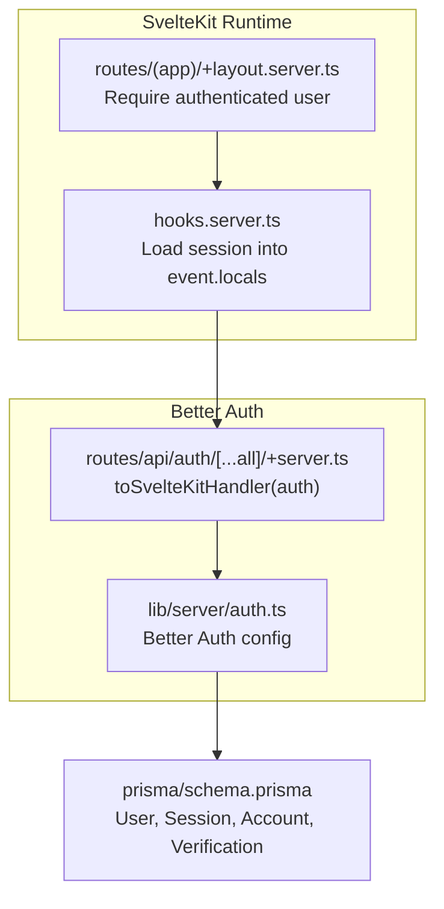
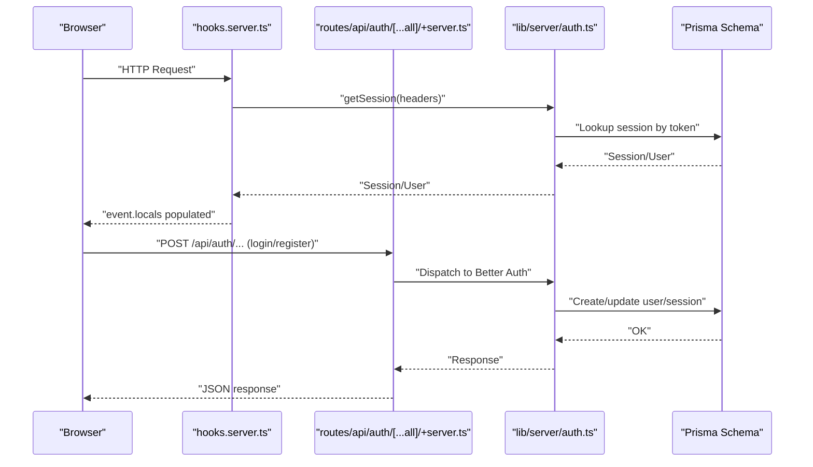
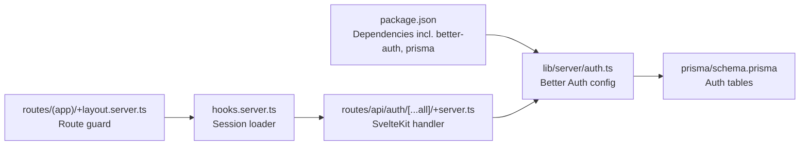

# Security Best Practices

<cite>
**Referenced Files in This Document**
- [src/lib/server/auth.ts](file://src/lib/server/auth.ts)
- [src/routes/api/auth/[...all]/+server.ts](file://src/routes/api/auth/[...all]/+server.ts)
- [src/hooks.server.ts](file://src/hooks.server.ts)
- [src/routes/(app)/+layout.server.ts](file://src/routes/(app)/+layout.server.ts)
- [prisma/schema.prisma](file://prisma/schema.prisma)
- [package.json](file://package.json)
- [.agents/skills/better-auth-security-best-practices/SKILL.MD](file://.agents/skills/better-auth-security-best-practices/SKILL.MD)
</cite>

## Table of Contents
1. [Introduction](#introduction)
2. [Project Structure](#project-structure)
3. [Core Components](#core-components)
4. [Architecture Overview](#architecture-overview)
5. [Detailed Component Analysis](#detailed-component-analysis)
6. [Dependency Analysis](#dependency-analysis)
7. [Performance Considerations](#performance-considerations)
8. [Troubleshooting Guide](#troubleshooting-guide)
9. [Conclusion](#conclusion)
10. [Appendices](#appendices)

## Introduction
This document provides comprehensive security guidance for the Screenlog authentication system. It focuses on password policies, session security, CSRF protection, secure cookie configuration, threat mitigation strategies, security headers, and secure authentication patterns. It also covers environment variable management, secret rotation, and security monitoring tailored to Screenlog’s implementation using Better Auth and SvelteKit.

## Project Structure
Screenlog’s authentication stack centers around:
- A SvelteKit server hook that loads the current session and exposes user/session to route handlers.
- A unified Better Auth API endpoint that serves all authentication routes.
- A Prisma schema defining user, session, account, and verification tables used by Better Auth.

**Diagram sources**
- [src/hooks.server.ts:1-18](file://src/hooks.server.ts#L1-L18)
- [src/routes/(app)/+layout.server.ts:1-17](file://src/routes/(app)/+layout.server.ts#L1-L17)
- [src/lib/server/auth.ts:1-27](file://src/lib/server/auth.ts#L1-L27)
- [src/routes/api/auth/[...all]/+server.ts:1-7](file://src/routes/api/auth/[...all]/+server.ts#L1-L7)
- [prisma/schema.prisma:1-258](file://prisma/schema.prisma#L1-L258)

**Section sources**
- [src/hooks.server.ts:1-18](file://src/hooks.server.ts#L1-L18)
- [src/routes/(app)/+layout.server.ts:1-17](file://src/routes/(app)/+layout.server.ts#L1-L17)
- [src/lib/server/auth.ts:1-27](file://src/lib/server/auth.ts#L1-L27)
- [src/routes/api/auth/[...all]/+server.ts:1-7](file://src/routes/api/auth/[...all]/+server.ts#L1-L7)
- [prisma/schema.prisma:1-258](file://prisma/schema.prisma#L1-L258)

## Core Components
- Authentication configuration: Better Auth configured with Prisma adapter, email/password enabled, session expiration, trusted origins, and cookie prefix.
- API surface: Unified Better Auth endpoint routed through SvelteKit’s toSvelteKitHandler.
- Session loading: Server hook retrieves session from Better Auth and attaches user/session to event.locals.
- Route protection: App layout requires a logged-in user and redirects unauthenticated users to sign-in.

Key security-relevant configuration points:
- Secret and base URL from private environment variables.
- Session lifetime and refresh behavior.
- Cookie prefix for isolation.
- Trusted origins enforcement.

**Section sources**
- [src/lib/server/auth.ts:1-27](file://src/lib/server/auth.ts#L1-L27)
- [src/routes/api/auth/[...all]/+server.ts:1-7](file://src/routes/api/auth/[...all]/+server.ts#L1-L7)
- [src/hooks.server.ts:1-18](file://src/hooks.server.ts#L1-L18)
- [src/routes/(app)/+layout.server.ts:1-17](file://src/routes/(app)/+layout.server.ts#L1-L17)

## Architecture Overview
The authentication flow integrates SvelteKit’s server-side request lifecycle with Better Auth’s session and API capabilities.

**Diagram sources**
- [src/hooks.server.ts:1-18](file://src/hooks.server.ts#L1-L18)
- [src/routes/api/auth/[...all]/+server.ts:1-7](file://src/routes/api/auth/[...all]/+server.ts#L1-L7)
- [src/lib/server/auth.ts:1-27](file://src/lib/server/auth.ts#L1-L27)
- [prisma/schema.prisma:1-258](file://prisma/schema.prisma#L1-L258)

## Detailed Component Analysis

### Password Policies
- Email/password is enabled in Better Auth configuration.
- To align with robust password hygiene, adopt strong password requirements (length, character diversity, and history constraints) at the application boundary. Enforce these during sign-up and password change flows.
- Consider integrating rate limiting per endpoint to mitigate brute-force attempts.

Recommended controls:
- Minimum length and complexity requirements.
- No reuse of recent passwords.
- Account lockout or CAPTCHA after repeated failures.
- Use of rate limiting tailored to authentication endpoints.

**Section sources**
- [src/lib/server/auth.ts:12-15](file://src/lib/server/auth.ts#L12-L15)
- [.agents/skills/better-auth-security-best-practices/SKILL.MD:30-73](file://.agents/skills/better-auth-security-best-practices/SKILL.MD#L30-L73)

### Session Security
- Sessions expire after a fixed period and refresh at a defined cadence.
- Consider adding “fresh age” for sensitive actions to require reauthentication for high-risk operations.

Recommended controls:
- Shorten session TTL for highly sensitive environments.
- Enforce “fresh” requirement for actions like password change or deletion.
- Enable session cache with encryption strategy for reduced database load while maintaining security.

**Section sources**
- [src/lib/server/auth.ts:16-19](file://src/lib/server/auth.ts#L16-L19)
- [.agents/skills/better-auth-security-best-practices/SKILL.MD:151-181](file://.agents/skills/better-auth-security-best-practices/SKILL.MD#L151-L181)

### CSRF Protection
- CSRF checks are enabled by default in Better Auth. Keep them enabled except for controlled testing scenarios.
- Validate origin headers and fetch metadata to strengthen CSRF defenses.

Recommended controls:
- Do not disable CSRF checks.
- Ensure trusted origins are correctly configured to avoid false positives.
- Consider stricter SameSite policies for internal applications if acceptable to UX.

**Section sources**
- [.agents/skills/better-auth-security-best-practices/SKILL.MD:91-108](file://.agents/skills/better-auth-security-best-practices/SKILL.MD#L91-L108)
- [src/lib/server/auth.ts:20](file://src/lib/server/auth.ts#L20)

### Secure Cookie Configuration
- Cookies use a custom prefix for isolation.
- In production, cookies are secure and HttpOnly by default when served over HTTPS.
- Consider tightening SameSite and path scoping for additional protection.

Recommended controls:
- Use strict SameSite for internal services.
- Limit cookie path to minimal scope.
- Ensure secure cookies are enforced in production deployments.

**Section sources**
- [src/lib/server/auth.ts:22-23](file://src/lib/server/auth.ts#L22-L23)
- [.agents/skills/better-auth-security-best-practices/SKILL.MD:182-216](file://.agents/skills/better-auth-security-best-practices/SKILL.MD#L182-L216)

### Trusted Origins
- Trusted origins include the base URL, preventing open redirect and callback hijacking.
- Configure additional trusted origins for frontend and preview domains.

Recommended controls:
- Explicitly enumerate all valid origins.
- Avoid wildcards unless necessary; prefer subdomain wildcards with caution.
- Validate callback URLs against trusted origins.

**Section sources**
- [src/lib/server/auth.ts:20](file://src/lib/server/auth.ts#L20)
- [.agents/skills/better-auth-security-best-practices/SKILL.MD:109-148](file://.agents/skills/better-auth-security-best-practices/SKILL.MD#L109-L148)

### Rate Limiting
- Rate limiting is enabled by default in production and can be customized per endpoint.
- Apply stricter limits to sign-in/sign-up endpoints.

Recommended controls:
- Configure endpoint-specific rules for authentication endpoints.
- Use persistent storage for rate limiting in serverless environments.
- Monitor and log rate-limit triggers for incident response.

**Section sources**
- [.agents/skills/better-auth-security-best-practices/SKILL.MD:30-73](file://.agents/skills/better-auth-security-best-practices/SKILL.MD#L30-L73)
- [src/lib/server/auth.ts:12-15](file://src/lib/server/auth.ts#L12-L15)

### Environment Variable Management and Secret Rotation
- Secrets are loaded from private environment variables for Better Auth and base URL.
- Rotate secrets regularly and ensure they are not committed to version control.

Recommended controls:
- Use a secrets manager for rotation.
- Enforce secret entropy and length requirements.
- Test deployments with placeholder secrets disabled in production.

**Section sources**
- [src/lib/server/auth.ts:4](file://src/lib/server/auth.ts#L4)
- [.agents/skills/better-auth-security-best-practices/SKILL.MD:6-29](file://.agents/skills/better-auth-security-best-practices/SKILL.MD#L6-L29)

### Security Headers Implementation
- Ensure HTTPS is enforced at the base URL and in production.
- Add security headers at the CDN or edge level to complement cookie security.

Recommended controls:
- HSTS, Content-Security-Policy, X-Frame-Options, X-Content-Type-Options, Referrer-Policy.
- Align with your deployment platform’s capabilities.

**Section sources**
- [src/lib/server/auth.ts:11](file://src/lib/server/auth.ts#L11)
- [.agents/skills/better-auth-security-best-practices/SKILL.MD:421-432](file://.agents/skills/better-auth-security-best-practices/SKILL.MD#L421-L432)

### Secure Authentication Patterns
- Centralize authentication via the unified API endpoint.
- Use server hooks to attach session context to requests.
- Protect routes by requiring authenticated users.

Recommended controls:
- Avoid exposing session tokens in logs or client-side state unnecessarily.
- Sanitize inputs and enforce consistent error messaging to prevent enumeration.

**Section sources**
- [src/routes/api/auth/[...all]/+server.ts:1-7](file://src/routes/api/auth/[...all]/+server.ts#L1-L7)
- [src/hooks.server.ts:1-18](file://src/hooks.server.ts#L1-L18)
- [src/routes/(app)/+layout.server.ts:1-17](file://src/routes/(app)/+layout.server.ts#L1-L17)
- [.agents/skills/better-auth-security-best-practices/SKILL.MD:335-337](file://.agents/skills/better-auth-security-best-practices/SKILL.MD#L335-L337)

### Data Model Security Considerations
- Better Auth tables include user, session, account, and verification records.
- Ensure database access is restricted and secrets are stored securely.

Recommended controls:
- Use least-privilege database credentials.
- Encrypt sensitive fields if storing tokens or PII.
- Audit database access and monitor anomalies.

**Section sources**
- [prisma/schema.prisma:11-82](file://prisma/schema.prisma#L11-L82)
- [package.json:26-45](file://package.json#L26-L45)

## Dependency Analysis

**Diagram sources**
- [package.json:1-47](file://package.json#L1-L47)
- [src/lib/server/auth.ts:1-27](file://src/lib/server/auth.ts#L1-L27)
- [src/routes/api/auth/[...all]/+server.ts:1-7](file://src/routes/api/auth/[...all]/+server.ts#L1-L7)
- [src/hooks.server.ts:1-18](file://src/hooks.server.ts#L1-L18)
- [src/routes/(app)/+layout.server.ts:1-17](file://src/routes/(app)/+layout.server.ts#L1-L17)
- [prisma/schema.prisma:1-258](file://prisma/schema.prisma#L1-L258)

**Section sources**
- [package.json:1-47](file://package.json#L1-L47)
- [src/lib/server/auth.ts:1-27](file://src/lib/server/auth.ts#L1-L27)
- [src/routes/api/auth/[...all]/+server.ts:1-7](file://src/routes/api/auth/[...all]/+server.ts#L1-L7)
- [src/hooks.server.ts:1-18](file://src/hooks.server.ts#L1-L18)
- [src/routes/(app)/+layout.server.ts:1-17](file://src/routes/(app)/+layout.server.ts#L1-L17)
- [prisma/schema.prisma:1-258](file://prisma/schema.prisma#L1-L258)

## Performance Considerations
- Session caching strategies can reduce database load; choose compact or encrypted strategies depending on sensitivity.
- Rate limiting storage affects performance; prefer persistent storage in serverless environments.
- Keep cookie attributes scoped to minimize overhead.

[No sources needed since this section provides general guidance]

## Troubleshooting Guide
Common issues and mitigations:
- Authentication fails due to misconfigured trusted origins: Verify base URL and trusted origins match deployment domains.
- Session not persisting: Confirm secure cookies are enabled in production and SameSite/path are appropriate.
- Brute-force attempts: Increase rate limit thresholds for authentication endpoints and enable persistent storage.
- Secret warnings in production: Replace placeholder secrets with high-entropy values.

**Section sources**
- [src/lib/server/auth.ts:4](file://src/lib/server/auth.ts#L4)
- [src/lib/server/auth.ts:20](file://src/lib/server/auth.ts#L20)
- [.agents/skills/better-auth-security-best-practices/SKILL.MD:30-73](file://.agents/skills/better-auth-security-best-practices/SKILL.MD#L30-L73)
- [.agents/skills/better-auth-security-best-practices/SKILL.MD:421-432](file://.agents/skills/better-auth-security-best-practices/SKILL.MD#L421-L432)

## Conclusion
Screenlog’s authentication system leverages Better Auth for robust session and API management, with SvelteKit hooks ensuring consistent session availability and route protection. By enforcing strong password policies, tightening CSRF and cookie protections, configuring trusted origins, enabling rate limiting, managing secrets securely, and implementing security headers, the system can achieve a strong security posture aligned with industry best practices.

[No sources needed since this section summarizes without analyzing specific files]

## Appendices

### Appendix A: Security Checklist
- Use a strong, unique secret and rotate regularly.
- Enforce HTTPS for base URL and secure cookies.
- Configure trusted origins for all valid clients.
- Keep CSRF protection enabled.
- Apply rate limiting to authentication endpoints.
- Log and monitor suspicious activity.
- Audit database access and enforce least privilege.

**Section sources**
- [.agents/skills/better-auth-security-best-practices/SKILL.MD:419-432](file://.agents/skills/better-auth-security-best-practices/SKILL.MD#L419-L432)