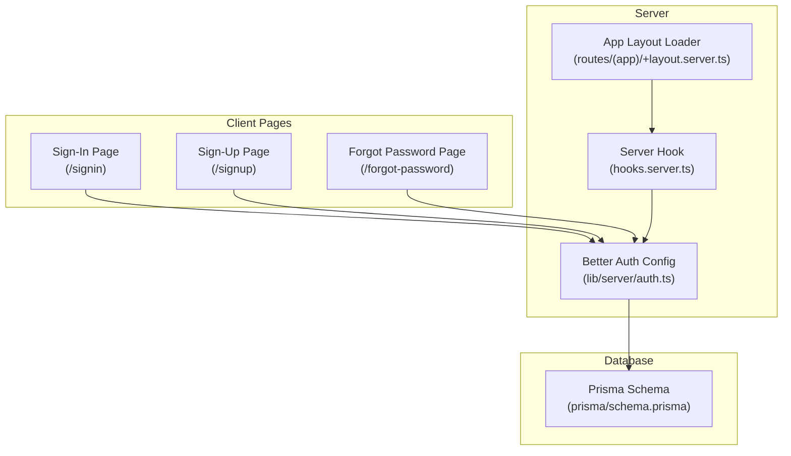
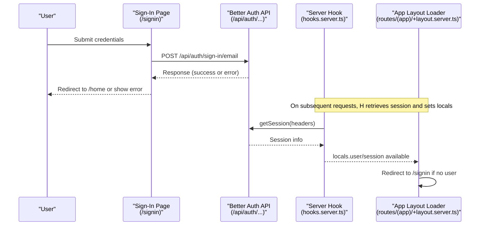
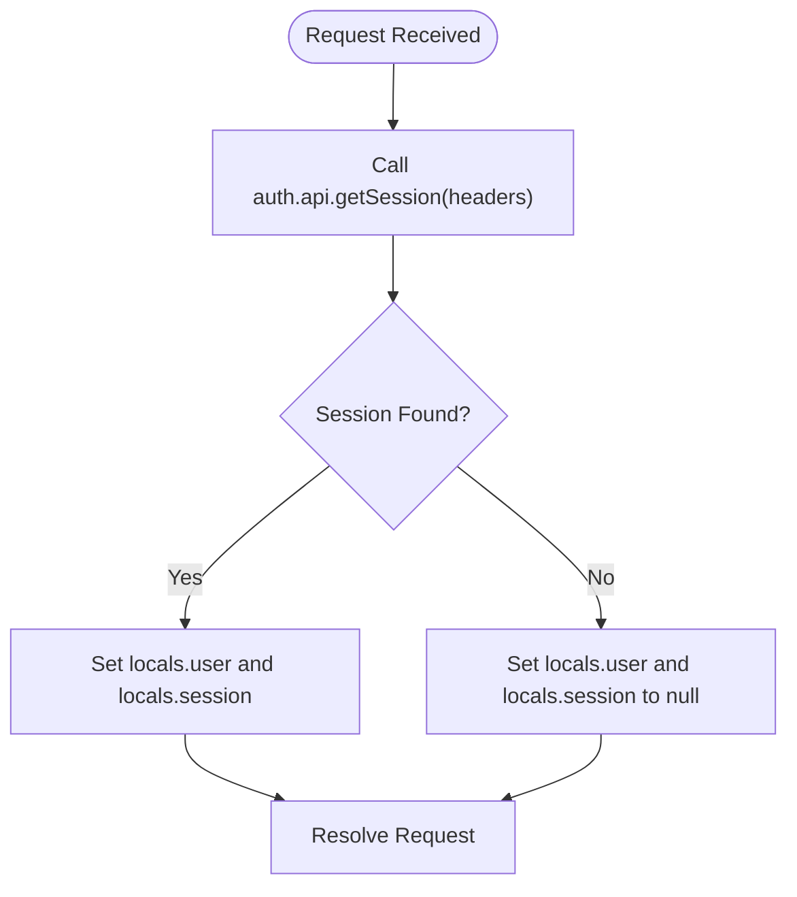
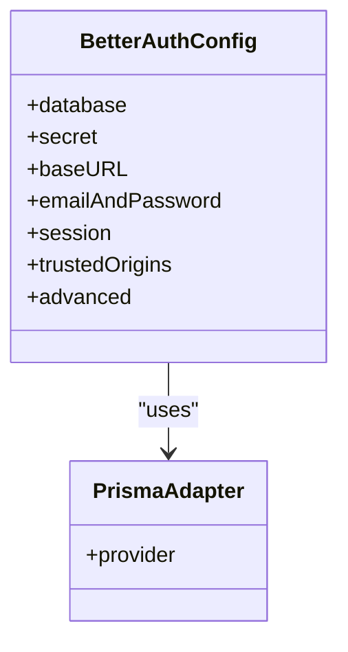
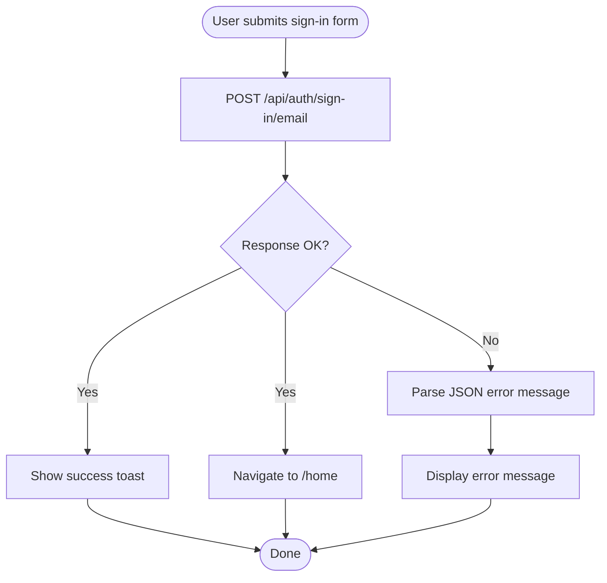
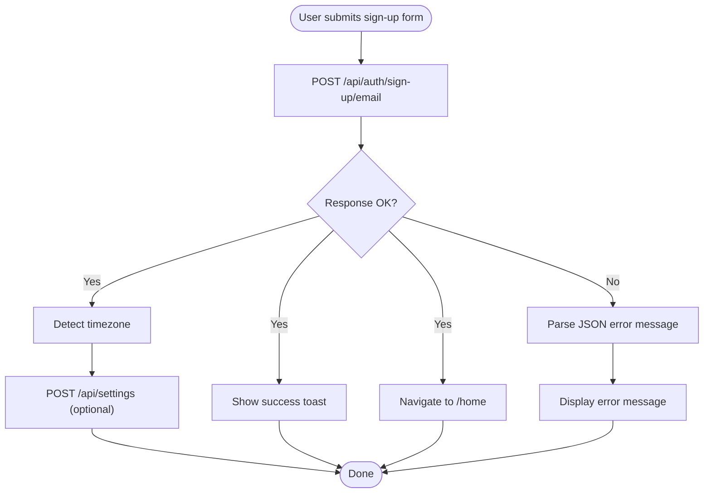
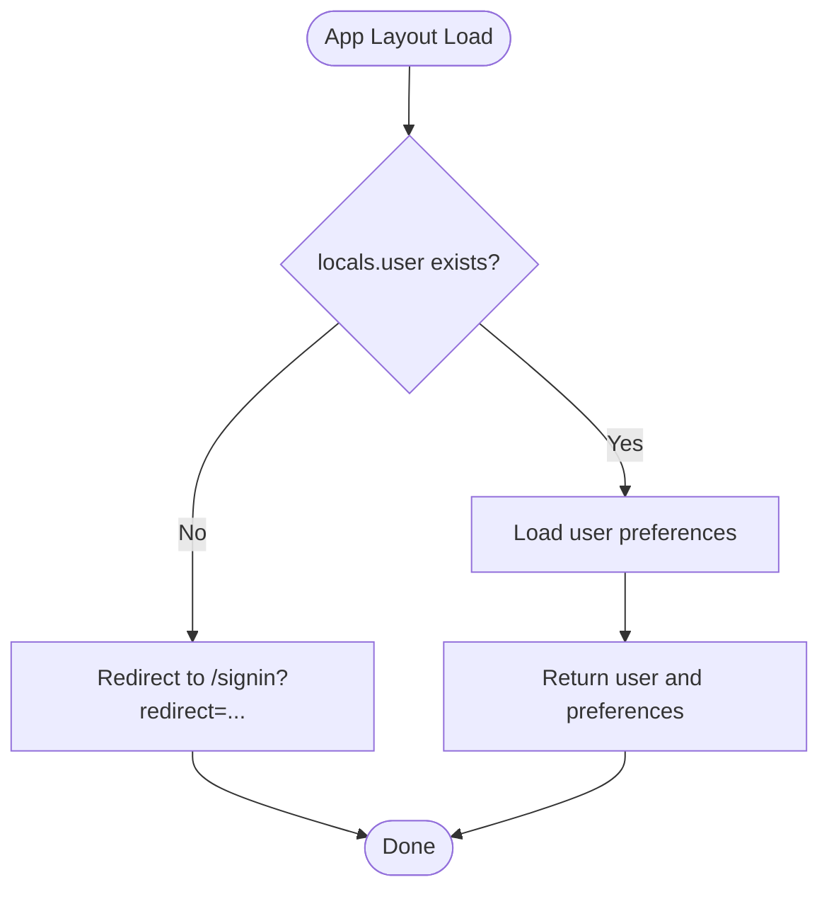
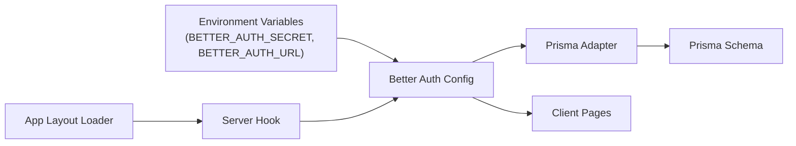

# Troubleshooting Authentication Issues

<cite>
**Referenced Files in This Document**
- [hooks.server.ts](file://src/hooks.server.ts)
- [auth.ts](file://src/lib/server/auth.ts)
- [signin page](file://src/routes/signin/+page.svelte)
- [signup page](file://src/routes/signup/+page.svelte)
- [forgot-password page](file://src/routes/forgot-password/+page.svelte)
- [+layout.server.ts](file://src/routes/(app)/+layout.server.ts)
- [schema.prisma](file://prisma/schema.prisma)
</cite>

## Table of Contents
1. [Introduction](#introduction)
2. [Project Structure](#project-structure)
3. [Core Components](#core-components)
4. [Architecture Overview](#architecture-overview)
5. [Detailed Component Analysis](#detailed-component-analysis)
6. [Dependency Analysis](#dependency-analysis)
7. [Performance Considerations](#performance-considerations)
8. [Troubleshooting Guide](#troubleshooting-guide)
9. [Conclusion](#conclusion)

## Introduction
This document provides a comprehensive troubleshooting guide for authentication issues in Screenlog. It focuses on diagnosing and resolving authentication failures, session problems, email verification issues, and login/logout errors. It also covers debugging techniques for environment configuration, database connectivity, and session management, along with step-by-step resolution guides for common error scenarios, log analysis techniques, and diagnostic commands. Browser-specific and cross-origin authentication issues are addressed with practical solutions.

## Project Structure
Screenlog uses SvelteKit with a server hook to initialize authentication state per request and exposes client pages for sign-in, sign-up, and password reset. Authentication is powered by Better Auth with Prisma adapter and PostgreSQL. The application enforces authentication via a layout loader that redirects unauthenticated users to the sign-in page.

**Diagram sources**
- [hooks.server.ts:1-18](file://src/hooks.server.ts#L1-L18)
- [auth.ts:1-27](file://src/lib/server/auth.ts#L1-L27)
- [signin page:1-77](file://src/routes/signin/+page.svelte#L1-L77)
- [signup page:1-98](file://src/routes/signup/+page.svelte#L1-L98)
- [forgot-password page:1-52](file://src/routes/forgot-password/+page.svelte#L1-L52)
- [+layout.server.ts](file://src/routes/(app)/+layout.server.ts#L1-L17)
- [schema.prisma](file://prisma/schema.prisma)

**Section sources**
- [hooks.server.ts:1-18](file://src/hooks.server.ts#L1-L18)
- [auth.ts:1-27](file://src/lib/server/auth.ts#L1-L27)
- [signin page:1-77](file://src/routes/signin/+page.svelte#L1-L77)
- [signup page:1-98](file://src/routes/signup/+page.svelte#L1-L98)
- [forgot-password page:1-52](file://src/routes/forgot-password/+page.svelte#L1-L52)
- [+layout.server.ts](file://src/routes/(app)/+layout.server.ts#L1-L17)
- [schema.prisma](file://prisma/schema.prisma)

## Core Components
- Server Hook: Initializes user and session on each request using Better Auth API and sets locals for downstream usage.
- Better Auth Configuration: Defines database adapter, secret, base URL, email/password settings, session duration, trusted origins, and cookie prefix.
- Client Pages: Sign-in, sign-up, and forgot-password pages submit requests to Better Auth endpoints and handle error messages.
- App Layout Loader: Enforces authentication by redirecting unauthenticated users to the sign-in page with a redirect parameter.

Key behaviors:
- Session retrieval occurs on every request and is resilient to transient errors by falling back to null.
- Authentication enforcement redirects to sign-in with a redirect URL when no user is present.
- Email/password auto-sign-in is enabled, and sessions expire after seven days with daily updates.

**Section sources**
- [hooks.server.ts:4-17](file://src/hooks.server.ts#L4-L17)
- [auth.ts:6-24](file://src/lib/server/auth.ts#L6-L24)
- [signin page:11-35](file://src/routes/signin/+page.svelte#L11-L35)
- [signup page:20-56](file://src/routes/signup/+page.svelte#L20-L56)
- [forgot-password page:9-17](file://src/routes/forgot-password/+page.svelte#L9-L17)
- [+layout.server.ts](file://src/routes/(app)/+layout.server.ts#L5-L8)

## Architecture Overview
The authentication flow integrates client-side form submissions with Better Auth endpoints and server-side session management.

**Diagram sources**
- [signin page:17-26](file://src/routes/signin/+page.svelte#L17-L26)
- [auth.ts:6-24](file://src/lib/server/auth.ts#L6-L24)
- [hooks.server.ts:4-17](file://src/hooks.server.ts#L4-L17)
- [+layout.server.ts](file://src/routes/(app)/+layout.server.ts#L5-L8)

## Detailed Component Analysis

### Server Hook: Session Initialization
Responsibilities:
- Retrieve session using Better Auth API with request headers.
- Populate event.locals.user and event.locals.session.
- On failure, set both to null to avoid stale state.

Common issues:
- Missing or invalid headers causing session retrieval to fail.
- Misconfigured base URL or secret leading to session validation errors.

**Diagram sources**
- [hooks.server.ts:4-17](file://src/hooks.server.ts#L4-L17)

**Section sources**
- [hooks.server.ts:4-17](file://src/hooks.server.ts#L4-L17)

### Better Auth Configuration
Responsibilities:
- Configure Prisma adapter with PostgreSQL provider.
- Define secret, base URL, email/password settings, session durations, trusted origins, and cookie prefix.

Common issues:
- Incorrect BETTER_AUTH_SECRET or BETTER_AUTH_URL.
- Trusted origins mismatch causing cross-origin authentication failures.
- Cookie prefix conflicts if multiple apps share domains.

**Diagram sources**
- [auth.ts:6-24](file://src/lib/server/auth.ts#L6-L24)

**Section sources**
- [auth.ts:6-24](file://src/lib/server/auth.ts#L6-L24)

### Sign-In Page
Responsibilities:
- Collect email and password.
- POST to Better Auth sign-in endpoint.
- Handle non-OK responses and display user-friendly errors.
- Navigate to home on success.

Common issues:
- Network errors or CORS misconfiguration preventing API calls.
- Invalid credentials or auto-sign-in disabled.
- Frontend error handling not surfacing backend messages.

**Diagram sources**
- [signin page:11-35](file://src/routes/signin/+page.svelte#L11-L35)

**Section sources**
- [signin page:11-35](file://src/routes/signin/+page.svelte#L11-L35)

### Sign-Up Page
Responsibilities:
- Collect name, email, and password.
- POST to Better Auth sign-up endpoint.
- On success, optionally save user preferences (timezone) via a settings endpoint.
- Navigate to home on success.

Common issues:
- Password length or strength requirements.
- Backend errors during sign-up or settings creation.

**Diagram sources**
- [signup page:20-56](file://src/routes/signup/+page.svelte#L20-L56)

**Section sources**
- [signup page:20-56](file://src/routes/signup/+page.svelte#L20-L56)

### Forgot Password Page
Responsibilities:
- Collect email and send a reset link placeholder.
- On success, show a message indicating whether an account exists.

Note: The current implementation is a placeholder; wiring Better Auth’s built-in password reset is recommended.

**Section sources**
- [forgot-password page:9-17](file://src/routes/forgot-password/+page.svelte#L9-L17)

### App Layout Loader: Authentication Enforcement
Responsibilities:
- Redirect unauthenticated users to the sign-in page with a redirect URL.
- Load user preferences for authenticated users.

Common issues:
- Missing user in locals due to failed session retrieval.
- Infinite redirect loops caused by malformed redirect URLs.

**Diagram sources**
- [+layout.server.ts](file://src/routes/(app)/+layout.server.ts#L5-L16)

**Section sources**
- [+layout.server.ts](file://src/routes/(app)/+layout.server.ts#L5-L16)

## Dependency Analysis
Authentication depends on:
- Environment variables for Better Auth secret and base URL.
- Prisma adapter for database operations.
- Client pages invoking Better Auth endpoints.
- Server hook and layout loader enforcing session availability.

Potential issues:
- Unset or incorrect environment variables.
- Prisma schema mismatches or migration issues.
- Client-side endpoint mismatches if Better Auth routes change.

**Diagram sources**
- [auth.ts:4-24](file://src/lib/server/auth.ts#L4-L24)
- [hooks.server.ts:4-17](file://src/hooks.server.ts#L4-L17)
- [+layout.server.ts](file://src/routes/(app)/+layout.server.ts#L5-L8)
- [schema.prisma](file://prisma/schema.prisma)

**Section sources**
- [auth.ts:4-24](file://src/lib/server/auth.ts#L4-L24)
- [hooks.server.ts:4-17](file://src/hooks.server.ts#L4-L17)
- [+layout.server.ts](file://src/routes/(app)/+layout.server.ts#L5-L8)
- [schema.prisma](file://prisma/schema.prisma)

## Performance Considerations
- Session expiration and update age are configured to balance security and user experience.
- Using a single Prisma client connection pool helps reduce overhead.
- Minimizing unnecessary redirects improves perceived performance.

## Troubleshooting Guide

### Authentication Failures (Login)
Symptoms:
- Immediate redirect to sign-in after submitting credentials.
- Error message indicating invalid credentials or service failure.

Step-by-step resolution:
1. Verify environment variables:
   - Ensure BETTER_AUTH_SECRET and BETTER_AUTH_URL are set and match Better Auth configuration.
2. Check client request:
   - Confirm the sign-in page posts to the correct endpoint.
   - Inspect network tab for response status and body.
3. Validate session retrieval:
   - Ensure the server hook executes without throwing and populates locals.user.
4. Review layout enforcement:
   - Confirm the app layout loader does not redirect unexpectedly.

Diagnostic commands:
- Inspect environment variables in the runtime environment.
- Use curl to test the sign-in endpoint with valid payload.
- Enable Better Auth logs to capture session validation steps.

Browser-specific checks:
- Clear cookies for the domain and retry.
- Disable ad blockers or extensions interfering with cookies.
- Test in an incognito window to eliminate cached state.

Cross-origin checks:
- Verify BETTER_AUTH_URL matches the origin serving the app.
- Ensure trustedOrigins includes the base URL.
- Confirm SameSite and Secure cookie attributes align with deployment.

**Section sources**
- [signin page:11-35](file://src/routes/signin/+page.svelte#L11-L35)
- [hooks.server.ts:4-17](file://src/hooks.server.ts#L4-L17)
- [+layout.server.ts](file://src/routes/(app)/+layout.server.ts#L5-L8)
- [auth.ts:10-24](file://src/lib/server/auth.ts#L10-L24)

### Session Problems
Symptoms:
- Logged-in users intermittently become unauthenticated.
- Session expires earlier than expected.

Step-by-step resolution:
1. Confirm session configuration:
   - Check session expiration and update age settings.
2. Inspect server hook behavior:
   - Ensure getSession is called and locals are set consistently.
3. Validate cookie prefix and domain:
   - Prevent conflicts with other applications sharing the same host.

Diagnostic commands:
- Monitor cookie expiration and SameSite settings.
- Add logging around session retrieval in the server hook.
- Use browser dev tools to inspect cookie presence across requests.

**Section sources**
- [auth.ts:16-19](file://src/lib/server/auth.ts#L16-L19)
- [hooks.server.ts:4-17](file://src/hooks.server.ts#L4-L17)
- [auth.ts:22-23](file://src/lib/server/auth.ts#L22-L23)

### Email Verification Issues
Symptoms:
- Users report missing verification emails.
- Password reset links appear to be sent but are ineffective.

Step-by-step resolution:
1. Review Better Auth email configuration:
   - Ensure SMTP settings are configured if verification/reset emails are enabled.
2. Check placeholder implementation:
   - The forgot password page currently shows a placeholder; wire Better Auth’s built-in reset flow.
3. Validate email delivery:
   - Use a test mailbox or local SMTP for development.

Diagnostic commands:
- Send test emails via Better Auth admin or CLI.
- Verify email templates and sender address.

**Section sources**
- [forgot-password page:9-17](file://src/routes/forgot-password/+page.svelte#L9-L17)
- [auth.ts:12-15](file://src/lib/server/auth.ts#L12-L15)

### Login/Logout Errors
Symptoms:
- Logout does not clear session state.
- Users remain stuck on sign-in despite logout actions.

Step-by-step resolution:
1. Confirm logout endpoint usage:
   - Ensure client invokes the appropriate Better Auth logout endpoint.
2. Verify server hook cleanup:
   - Confirm locals are cleared after logout.
3. Check cookie removal:
   - Ensure the application clears the session cookie on logout.

Diagnostic commands:
- Use network panel to confirm logout request and response.
- Inspect cookies before and after logout.

**Section sources**
- [signin page:11-35](file://src/routes/signin/+page.svelte#L11-L35)
- [hooks.server.ts:4-17](file://src/hooks.server.ts#L4-L17)

### Environment Configuration
Symptoms:
- Authentication works locally but fails in production.
- Session retrieval fails intermittently.

Step-by-step resolution:
1. Validate environment variables:
   - Confirm BETTER_AUTH_SECRET and BETTER_AUTH_URL are present and identical across environments.
2. Match base URL:
   - Ensure BETTER_AUTH_URL reflects the deployed origin.
3. Check trusted origins:
   - Include the base URL in trustedOrigins.

Diagnostic commands:
- Print environment variables at startup.
- Compare configuration across environments.

**Section sources**
- [auth.ts:4-24](file://src/lib/server/auth.ts#L4-L24)

### Database Connectivity Issues
Symptoms:
- Authentication requests fail with database errors.
- User records cannot be created or retrieved.

Step-by-step resolution:
1. Verify Prisma client configuration:
   - Ensure DATABASE_URL is set and reachable.
2. Run migrations:
   - Apply pending migrations to align schema with the adapter.
3. Check Prisma schema:
   - Confirm tables and relationships match Better Auth expectations.

Diagnostic commands:
- Run Prisma studio or introspection to inspect schema.
- Execute a simple query to test connectivity.

**Section sources**
- [auth.ts:7-9](file://src/lib/server/auth.ts#L7-L9)
- [schema.prisma](file://prisma/schema.prisma)

### Session Management Problems
Symptoms:
- Session not persisted across browser restarts.
- Conflicts when multiple tabs open.

Step-by-step resolution:
1. Adjust session settings:
   - Increase expiration or update age if needed.
2. Ensure cookie prefix uniqueness:
   - Avoid conflicts if multiple apps share the same host.
3. Validate SameSite and Secure flags:
   - Align with HTTPS and cross-site requirements.

Diagnostic commands:
- Inspect cookie attributes in browser dev tools.
- Log session lifecycle events.

**Section sources**
- [auth.ts:16-23](file://src/lib/server/auth.ts#L16-L23)

### Browser-Specific Authentication Issues
Symptoms:
- Works in Chrome but not Safari or Firefox.
- Cookies blocked or not set properly.

Step-by-step resolution:
1. Check SameSite and Secure flags:
   - Ensure compatibility with the target browsers.
2. Disable private browsing restrictions:
   - Some modes block third-party cookies.
3. Clear site data for the domain.

Diagnostic commands:
- Compare cookie behavior across browsers.
- Use browser developer tools to inspect cookie storage.

**Section sources**
- [auth.ts:20-23](file://src/lib/server/auth.ts#L20-L23)

### Cross-Origin Authentication Problems
Symptoms:
- Authentication succeeds locally but fails behind reverse proxies or subpaths.
- CORS or CSRF errors occur.

Step-by-step resolution:
1. Set BETTER_AUTH_URL to the effective base URL:
   - Include scheme, host, and port if applicable.
2. Configure trustedOrigins:
   - Include the base URL to allow cross-origin requests.
3. Verify proxy headers:
   - Ensure X-Forwarded-* headers are correctly passed if behind a proxy.

Diagnostic commands:
- Inspect request headers and response cookies.
- Test with curl to simulate proxied requests.

**Section sources**
- [auth.ts:10-24](file://src/lib/server/auth.ts#L10-L24)

## Conclusion
This guide provides actionable steps to diagnose and resolve common authentication issues in Screenlog. By validating environment configuration, ensuring proper session management, verifying database connectivity, and addressing browser and cross-origin concerns, most authentication problems can be quickly identified and resolved. Regular monitoring of logs and environment parity across deployments further reduces recurrence of such issues.