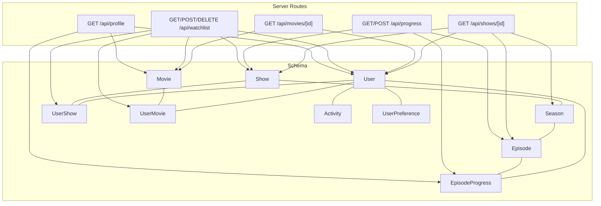
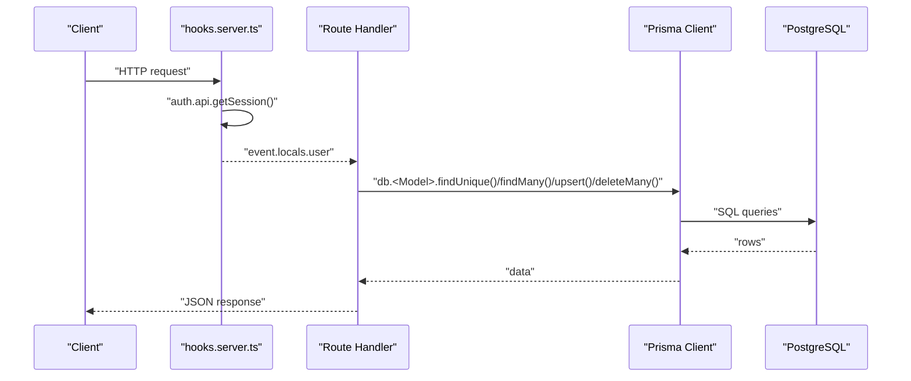
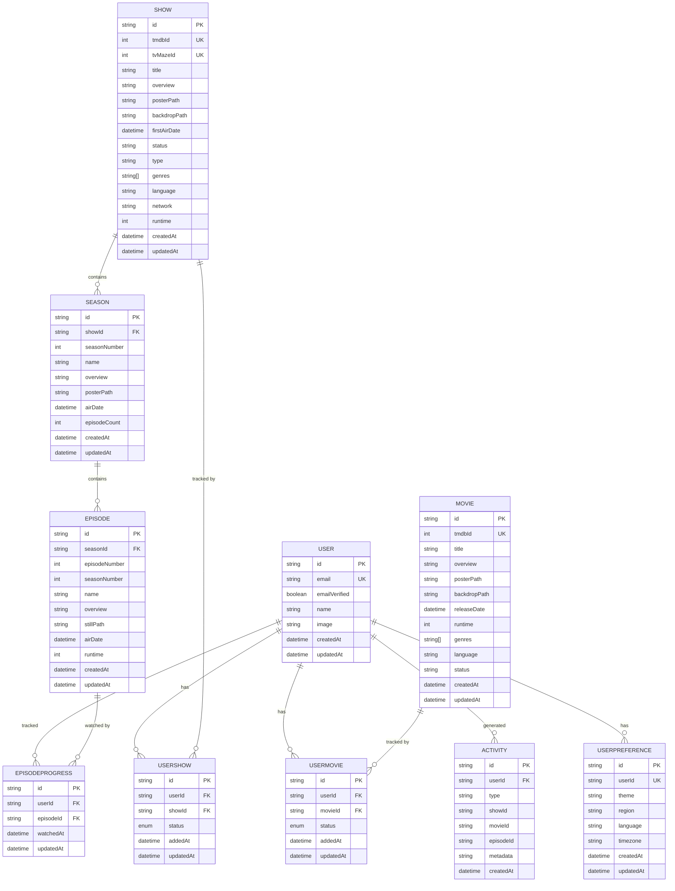
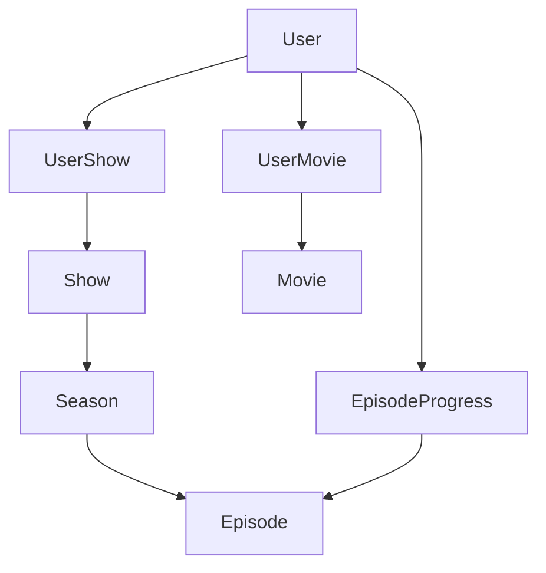
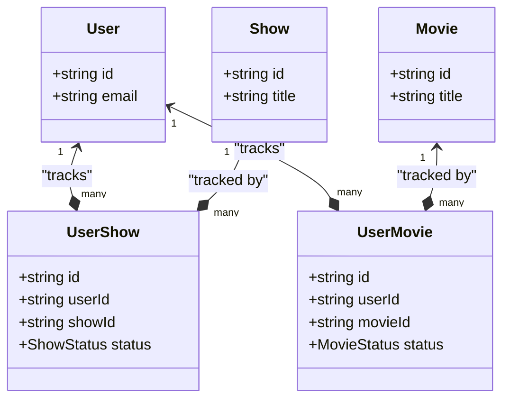
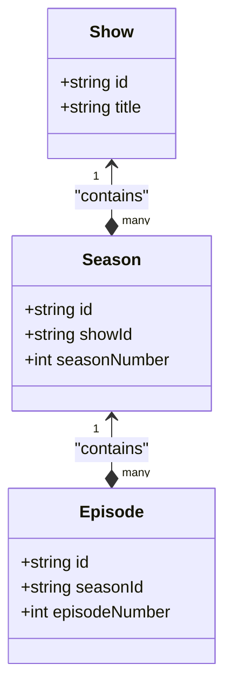
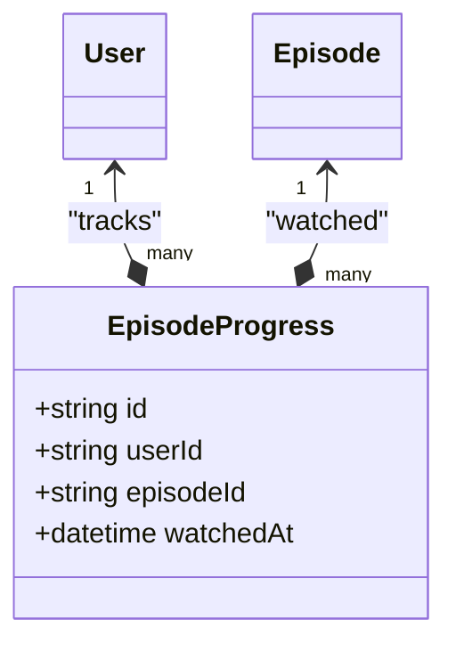
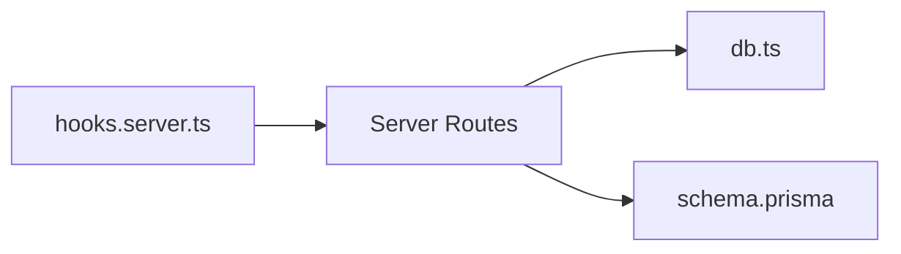

# Data Model Relationships

<cite>
**Referenced Files in This Document**
- [schema.prisma](file://prisma/schema.prisma)
- [db.ts](file://src/lib/server/db.ts)
- [hooks.server.ts](file://src/hooks.server.ts)
- [+server.ts (shows)](file://src/routes/api/shows/[id]/+server.ts)
- [+server.ts (movies)](file://src/routes/api/movies/[id]/+server.ts)
- [+server.ts (progress)](file://src/routes/api/progress/+server.ts)
- [+server.ts (watchlist)](file://src/routes/api/watchlist/+server.ts)
- [+server.ts (profile)](file://src/routes/api/profile/+server.ts)
</cite>

## Table of Contents
1. [Introduction](#introduction)
2. [Project Structure](#project-structure)
3. [Core Components](#core-components)
4. [Architecture Overview](#architecture-overview)
5. [Detailed Component Analysis](#detailed-component-analysis)
6. [Dependency Analysis](#dependency-analysis)
7. [Performance Considerations](#performance-considerations)
8. [Troubleshooting Guide](#troubleshooting-guide)
9. [Conclusion](#conclusion)

## Introduction
This document explains Screenlog’s data model relationships and entity connections. It focuses on the hierarchy from Users through Shows/Movies to Seasons and Episodes, details many-to-many relationships via UserShow and UserMovie with status tracking, and documents one-to-many relationships with cascade deletion. It also covers junction tables (UserShow, UserMovie, EpisodeProgress), referential integrity constraints, and efficient query patterns to avoid the N+1 problem. Practical examples of common queries and their implementation are included, along with diagrams to visualize the relationships.

## Project Structure
The data model is defined in the Prisma schema and consumed by SvelteKit server routes. Authentication sets the user context in hooks, and database access is centralized via a Prisma client singleton.

**Diagram sources**
- [schema.prisma](file://prisma/schema.prisma)
- [+server.ts (shows)](file://src/routes/api/shows/[id]/+server.ts)
- [+server.ts (movies)](file://src/routes/api/movies/[id]/+server.ts)
- [+server.ts (progress)](file://src/routes/api/progress/+server.ts)
- [+server.ts (watchlist)](file://src/routes/api/watchlist/+server.ts)
- [+server.ts (profile)](file://src/routes/api/profile/+server.ts)

**Section sources**
- [schema.prisma](file://prisma/schema.prisma)
- [db.ts](file://src/lib/server/db.ts)
- [hooks.server.ts](file://src/hooks.server.ts)

## Core Components
- User: Authenticates via Better Auth; tracks sessions, accounts, verifications, and personal preferences. Participates in many-to-many relationships with content and tracks progress.
- Show: Represents TV series with seasons; linked to users via UserShow.
- Season: One-to-many with Episode under Show; uniquely identified by Show plus season number.
- Episode: One-to-many with User via EpisodeProgress; uniquely identified by Season plus episode number.
- Movie: Standalone movie entity; linked to users via UserMovie.
- UserShow: Junction table linking User and Show with status tracking and timestamps.
- UserMovie: Junction table linking User and Movie with status tracking and timestamps.
- EpisodeProgress: Tracks per-user episode watching events with timestamps.
- Activity: Audit trail for user actions (e.g., adding content, watching episodes).
- UserPreference: Per-user preferences (theme, region, language, timezone).

Key constraints and relationships:
- Unique combinations:
  - UserShow: unique(userId, showId)
  - UserMovie: unique(userId, movieId)
  - EpisodeProgress: unique(userId, episodeId)
  - Season: unique(showId, seasonNumber)
  - Episode: unique(seasonId, episodeNumber)
  - Account: unique(providerId, accountId)
  - Verification: unique(identifier, value)
- Cascade deletion:
  - Show, Season, Episode, UserShow, UserMovie, EpisodeProgress, Activity, UserPreference, Session, Account, Verification delete with user.
- Enums:
  - ShowStatus: PLAN_TO_WATCH, WATCHING, CAUGHT_UP, COMPLETED, PAUSED, DROPPED
  - MovieStatus: PLAN_TO_WATCH, WATCHED, FAVOURITE, DROPPED

**Section sources**
- [schema.prisma](file://prisma/schema.prisma)

## Architecture Overview
Screenlog’s backend uses SvelteKit server routes to expose REST-like endpoints. Each route resolves the current user from the Better Auth session, performs Prisma queries, and returns JSON responses. The Prisma client is a singleton initialized once and reused across requests.

**Diagram sources**
- [hooks.server.ts](file://src/hooks.server.ts)
- [db.ts](file://src/lib/server/db.ts)
- [schema.prisma](file://prisma/schema.prisma)

## Detailed Component Analysis

### Entity Relationship Diagram
This ER diagram maps the actual entities and their relationships as defined in the schema.

**Diagram sources**
- [schema.prisma](file://prisma/schema.prisma)

### Hierarchical Structure: Users → Shows/Movies → Seasons → Episodes
- Users track content via UserShow (TV) and UserMovie (movies).
- Shows contain Seasons; Seasons contain Episodes.
- EpisodeProgress records individual episode watches per user.
- Status updates propagate from EpisodeProgress to UserShow (e.g., COMPLETED when all episodes watched).

**Diagram sources**
- [schema.prisma](file://prisma/schema.prisma)

### Many-to-Many Relationships: User ↔ Content (UserShow, UserMovie) with Status Tracking
- UserShow links users to shows with a ShowStatus field and timestamps.
- UserMovie links users to movies with a MovieStatus field and timestamps.
- Unique constraints prevent duplicate entries per user-content pair.
- Status transitions are computed from episode progress for shows.

**Diagram sources**
- [schema.prisma](file://prisma/schema.prisma)

**Section sources**
- [schema.prisma](file://prisma/schema.prisma)

### One-to-Many Relationships: Show → Season, Season → Episode and Cascade Deletion
- Show to Season: one show has many seasons; unique constraint ensures no duplicate season numbers per show.
- Season to Episode: one season has many episodes; unique constraint ensures no duplicate episode numbers per season.
- Cascade deletion: deleting a Show deletes its Seasons; deleting a Season deletes its Episodes; deleting a User deletes related UserShow, UserMovie, EpisodeProgress, Activity, and UserPreference.

**Diagram sources**
- [schema.prisma](file://prisma/schema.prisma)

**Section sources**
- [schema.prisma](file://prisma/schema.prisma)

### Junction Tables: UserShow, UserMovie, EpisodeProgress
- UserShow: tracks user-show relationships with status and timestamps; unique(userId, showId).
- UserMovie: tracks user-movie relationships with status and timestamps; unique(userId, movieId).
- EpisodeProgress: tracks per-user episode watches; unique(userId, episodeId); cascades with user and episode.

**Diagram sources**
- [schema.prisma](file://prisma/schema.prisma)

**Section sources**
- [schema.prisma](file://prisma/schema.prisma)

### Relationship Queries and Efficient Loading Strategies
Common patterns observed in server routes:

- Load a show with seasons and episodes:
  - Use include with nested relations to eager-load the hierarchy in a single query.
  - Example path: [GET /api/shows/[id]](file://src/routes/api/shows/[id]/+server.ts)

- Load a movie with user-specific status:
  - Fetch movie and upsert/find user-movie relationship in one request.
  - Example path: [GET /api/movies/[id]](file://src/routes/api/movies/[id]/+server.ts)

- Track episode progress and update show status:
  - Upsert EpisodeProgress; optionally update UserShow status based on episode counts.
  - Example path: [POST /api/progress](file://src/routes/api/progress/+server.ts)

- Bulk operations on seasons and shows:
  - Mark all episodes of a season watched; recalculate show status.
  - Example path: [POST /api/progress](file://src/routes/api/progress/+server.ts)

- Watchlist composition:
  - Retrieve all user shows with seasons/episodes and user movies with movies.
  - Example path: [GET /api/watchlist](file://src/routes/api/watchlist/+server.ts)

- Preventing N+1:
  - Use include to fetch related data in a single query rather than iterating and querying per item.
  - Example path: [GET /api/shows/[id]](file://src/routes/api/shows/[id]/+server.ts)

**Section sources**
- [+server.ts (shows)](file://src/routes/api/shows/[id]/+server.ts)
- [+server.ts (movies)](file://src/routes/api/movies/[id]/+server.ts)
- [+server.ts (progress)](file://src/routes/api/progress/+server.ts)
- [+server.ts (watchlist)](file://src/routes/api/watchlist/+server.ts)

### Practical Examples of Common Query Patterns
- Get user’s recent episode progress with show/season context:
  - Query EpisodeProgress with include for episode → season → show.
  - Example path: [GET /api/progress](file://src/routes/api/progress/+server.ts)

- Compute show completion status from episode progress:
  - Count total episodes for a show; compare with watched count; set UserShow status accordingly.
  - Example path: [GET /api/progress](file://src/routes/api/progress/+server.ts)

- Add a show to the user’s watchlist and cache seasons/episodes:
  - Upsert UserShow; create Show/Season/Episode as needed; emit activity.
  - Example path: [POST /api/watchlist](file://src/routes/api/watchlist/+server.ts)

- Aggregate profile metrics (shows tracked, completed, episodes watched, movies watched, top genres):
  - Join UserShow/UserMovie with Show/Movie; sum runtimes; compute top genres.
  - Example path: [GET /api/profile](file://src/routes/api/profile/+server.ts)

**Section sources**
- [+server.ts (progress)](file://src/routes/api/progress/+server.ts)
- [+server.ts (watchlist)](file://src/routes/api/watchlist/+server.ts)
- [+server.ts (profile)](file://src/routes/api/profile/+server.ts)

## Dependency Analysis
- Authentication dependency:
  - hooks.server.ts resolves Better Auth session and attaches user to locals for all routes.
- Database client:
  - db.ts initializes a singleton PrismaClient; used by all routes.
- Route-to-model dependencies:
  - Shows/movies endpoints depend on Show/Movie and UserShow/UserMovie.
  - Progress endpoint depends on EpisodeProgress, Episode, Season, Show, and UserShow.
  - Watchlist endpoint depends on UserShow/UserMovie and Show/Movie.
  - Profile endpoint depends on UserShow/UserMovie, EpisodeProgress, Show/Movie.

**Diagram sources**
- [hooks.server.ts](file://src/hooks.server.ts)
- [db.ts](file://src/lib/server/db.ts)
- [schema.prisma](file://prisma/schema.prisma)

**Section sources**
- [hooks.server.ts](file://src/hooks.server.ts)
- [db.ts](file://src/lib/server/db.ts)
- [schema.prisma](file://prisma/schema.prisma)

## Performance Considerations
- Prefer include with nested relations to avoid N+1 queries when loading hierarchical data (e.g., show with seasons and episodes).
- Use select projections to limit returned fields when full objects are unnecessary.
- Batch operations for bulk marking seasons or shows as watched to minimize round-trips.
- Indexes:
  - Activity table has a composite index on [userId, createdAt] to optimize timeline queries.
  - Unique constraints on junction tables prevent duplicates and speed up lookups.
- Cascading deletes reduce orphaned data but can trigger cascade effects; monitor for heavy deletions on large hierarchies.

[No sources needed since this section provides general guidance]

## Troubleshooting Guide
- Unauthorized access:
  - Routes check for locals.user presence and return 401 if missing.
  - Verify Better Auth session resolution in hooks.server.ts.
- Not found errors:
  - Routes return 404 when requested content (show/movie) is absent; confirm IDs and seeding.
- Constraint violations:
  - Unique constraints on UserShow, UserMovie, EpisodeProgress, Season, Episode will cause errors if duplicated entries are attempted.
- Cascade deletion side effects:
  - Deleting a user removes related records; ensure backups or soft-deletion strategies if needed.
- Status synchronization:
  - Show status relies on episode progress counts; verify progress endpoint logic and episode totals.

**Section sources**
- [+server.ts (shows)](file://src/routes/api/shows/[id]/+server.ts)
- [+server.ts (movies)](file://src/routes/api/movies/[id]/+server.ts)
- [+server.ts (progress)](file://src/routes/api/progress/+server.ts)
- [+server.ts (watchlist)](file://src/routes/api/watchlist/+server.ts)
- [+server.ts (profile)](file://src/routes/api/profile/+server.ts)
- [hooks.server.ts](file://src/hooks.server.ts)

## Conclusion
Screenlog’s data model cleanly separates users from content, with explicit many-to-many relationships for shows and movies tracked via UserShow and UserMovie. The hierarchy from Show to Season to Episode is enforced with unique constraints and cascade deletion. EpisodeProgress enables granular tracking and status computation for shows. Server routes demonstrate efficient loading strategies and practical query patterns, while constraints and indexes maintain referential integrity and performance. Together, these patterns support scalable and maintainable content tracking.