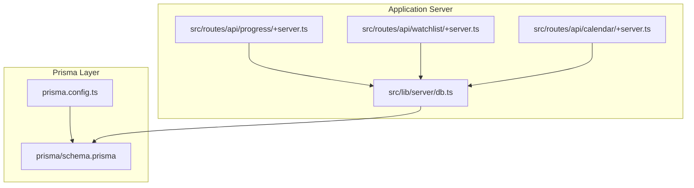
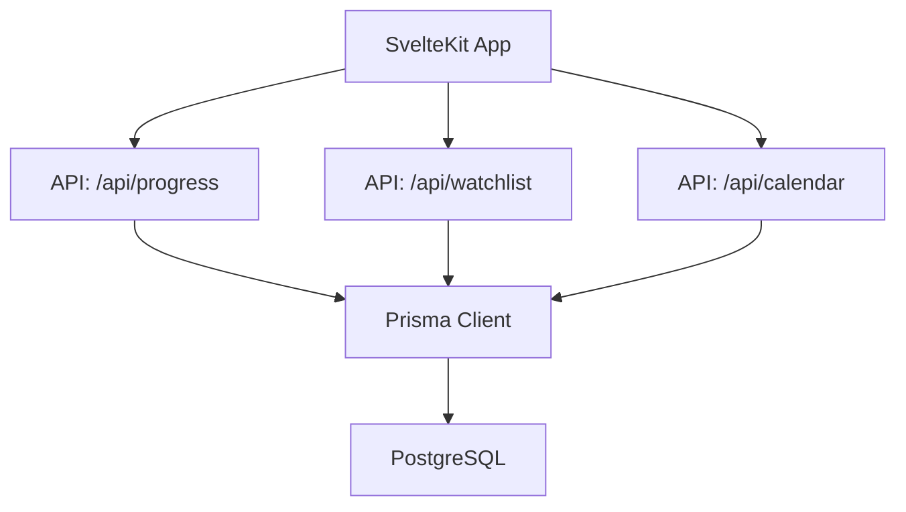
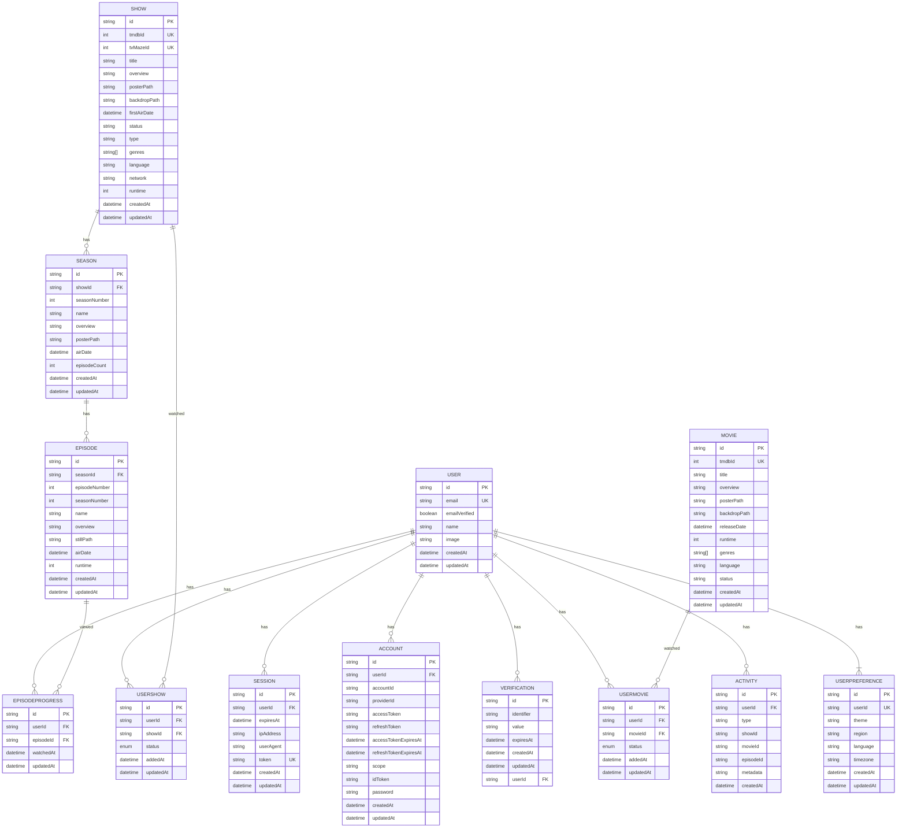
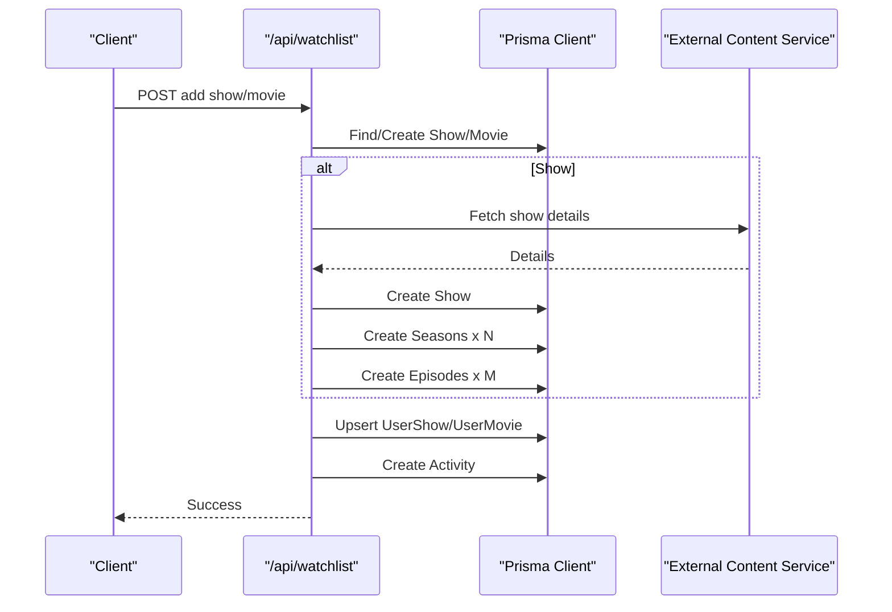
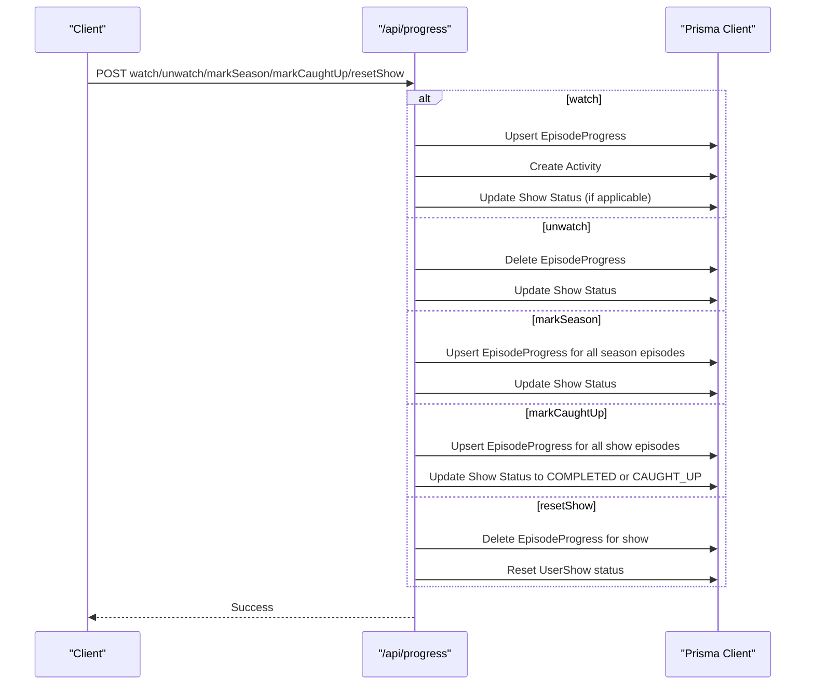
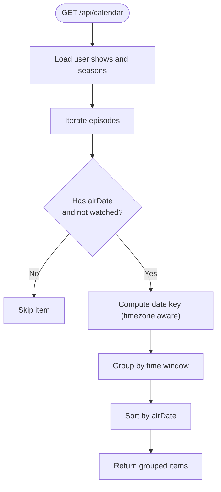
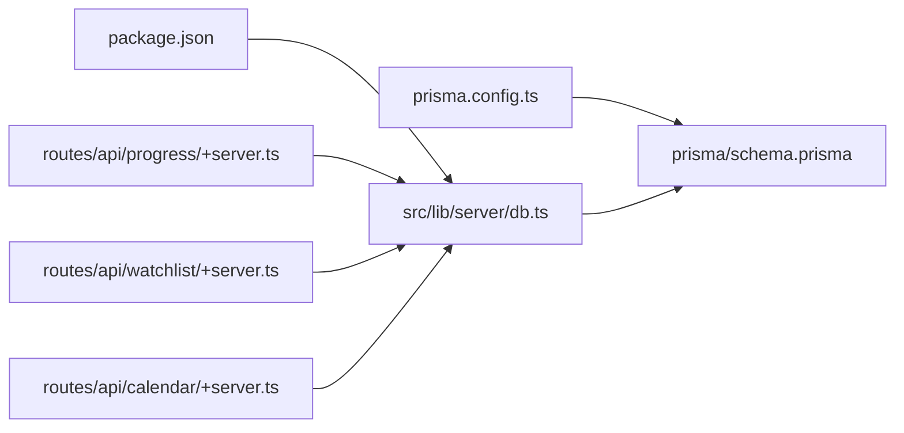

# Database Architecture

<cite>
**Referenced Files in This Document**
- [schema.prisma](file://prisma/schema.prisma)
- [prisma.config.ts](file://prisma.config.ts)
- [db.ts](file://src/lib/server/db.ts)
- [+server.ts (progress)](file://src/routes/api/progress/+server.ts)
- [+server.ts (watchlist)](file://src/routes/api/watchlist/+server.ts)
- [+server.ts (calendar)](file://src/routes/api/calendar/+server.ts)
- [package.json](file://package.json)
</cite>

## Table of Contents
1. [Introduction](#introduction)
2. [Project Structure](#project-structure)
3. [Core Components](#core-components)
4. [Architecture Overview](#architecture-overview)
5. [Detailed Component Analysis](#detailed-component-analysis)
6. [Dependency Analysis](#dependency-analysis)
7. [Performance Considerations](#performance-considerations)
8. [Troubleshooting Guide](#troubleshooting-guide)
9. [Conclusion](#conclusion)
10. [Appendices](#appendices)

## Introduction
This document describes the database architecture for Screenlog with a focus on the Prisma ORM implementation and the relational schema. It explains the data model for Users, Content (shows/movies), Seasons, Episodes, Watchlists, and Progress tracking. It documents relationships, foreign keys, referential integrity constraints, Prisma configuration, migration management, and practical query optimization techniques observed in the codebase. It also outlines operational considerations for performance, scaling, and data lifecycle management.

## Project Structure
The database layer is centered around:
- Prisma schema defining models, relations, and indexes
- Prisma configuration specifying schema and migration paths
- A shared PrismaClient instance used by server endpoints
- API endpoints that read/write data and maintain derived state

**Diagram sources**
- [prisma.config.ts:1-15](file://prisma.config.ts#L1-L15)
- [schema.prisma:1-258](file://prisma/schema.prisma#L1-L258)
- [db.ts:1-11](file://src/lib/server/db.ts#L1-L11)
- [+server.ts (progress):1-133](file://src/routes/api/progress/+server.ts#L1-L133)
- [+server.ts (watchlist):1-141](file://src/routes/api/watchlist/+server.ts#L1-L141)
- [+server.ts (calendar):1-120](file://src/routes/api/calendar/+server.ts#L1-L120)

**Section sources**
- [prisma.config.ts:1-15](file://prisma.config.ts#L1-L15)
- [schema.prisma:1-258](file://prisma/schema.prisma#L1-L258)
- [db.ts:1-11](file://src/lib/server/db.ts#L1-L11)
- [+server.ts (progress):1-133](file://src/routes/api/progress/+server.ts#L1-L133)
- [+server.ts (watchlist):1-141](file://src/routes/api/watchlist/+server.ts#L1-L141)
- [+server.ts (calendar):1-120](file://src/routes/api/calendar/+server.ts#L1-L120)

## Core Components
- Prisma Client: A singleton PrismaClient instance is exported for use across server endpoints.
- Prisma Schema: Defines PostgreSQL-backed models, relations, uniqueness constraints, enums, and indexes.
- API Endpoints: Provide CRUD and derived-state updates for watchlist items and progress tracking.

Key observations:
- The Prisma client is configured to connect to a PostgreSQL datasource via DATABASE_URL.
- The schema defines models for Users, Sessions, Accounts, Verifications, Shows, Seasons, Episodes, Movies, UserShow, UserMovie, EpisodeProgress, Activity, and UserPreference.
- Relations enforce referential integrity with cascade deletes where appropriate.
- Enums encapsulate domain-specific statuses for shows and movies.
- Indexes are defined to support common query patterns.

**Section sources**
- [db.ts:1-11](file://src/lib/server/db.ts#L1-L11)
- [schema.prisma:1-258](file://prisma/schema.prisma#L1-L258)

## Architecture Overview
The database architecture follows a layered approach:
- Data definition: Prisma schema
- Migration management: Prisma migrations stored under the configured migrations path
- Runtime access: Shared PrismaClient instance
- Business logic: API endpoints orchestrate reads/writes and derive state

**Diagram sources**
- [db.ts:1-11](file://src/lib/server/db.ts#L1-L11)
- [schema.prisma:1-258](file://prisma/schema.prisma#L1-L258)
- [+server.ts (progress):1-133](file://src/routes/api/progress/+server.ts#L1-L133)
- [+server.ts (watchlist):1-141](file://src/routes/api/watchlist/+server.ts#L1-L141)
- [+server.ts (calendar):1-120](file://src/routes/api/calendar/+server.ts#L1-L120)

## Detailed Component Analysis

### Data Model and Relationships
The schema defines a normalized relational model with explicit foreign keys and referential integrity. Highlights:
- Users can have multiple Sessions, Accounts, Verifications, Watchlist entries (UserShow/UserMovie), EpisodeProgress entries, Activities, and Preferences.
- Shows have Seasons; Seasons have Episodes.
- UserShow links Users to Shows with a status enum.
- UserMovie links Users to Movies with a status enum.
- EpisodeProgress records per-user episode viewing events.
- Activity logs user actions with optional associations to content entities.
- UserPreference stores per-user UI and localization settings.

**Diagram sources**
- [schema.prisma:11-257](file://prisma/schema.prisma#L11-L257)

**Section sources**
- [schema.prisma:11-257](file://prisma/schema.prisma#L11-L257)

### Prisma Configuration and Migrations
- Datasource: PostgreSQL configured via DATABASE_URL environment variable.
- Generator: Prisma client for JavaScript.
- Migrations: Managed under the configured migrations path.
- Adapter: The project includes the Neon adapter for Prisma, indicating compatibility with serverless PostgreSQL environments.

Operational implications:
- Use Prisma CLI commands to manage migrations (create, apply).
- Ensure DATABASE_URL is set appropriately for development, preview, and production environments.
- The Neon adapter suggests deployment on Neon or compatible serverless Postgres.

**Section sources**
- [schema.prisma:1-8](file://prisma/schema.prisma#L1-L8)
- [prisma.config.ts:6-14](file://prisma.config.ts#L6-L14)
- [package.json:28-29](file://package.json#L28-L29)

### Watchlist API: Adding Items and Seeding Content
The watchlist endpoint integrates with external content services to seed Shows and Seasons with Episodes when adding items to a user’s watchlist. It upserts UserShow/UserMovie entries and records activity events.

**Diagram sources**
- [+server.ts (watchlist):28-122](file://src/routes/api/watchlist/+server.ts#L28-L122)
- [schema.prisma:84-212](file://prisma/schema.prisma#L84-L212)

**Section sources**
- [+server.ts (watchlist):28-122](file://src/routes/api/watchlist/+server.ts#L28-L122)
- [schema.prisma:84-212](file://prisma/schema.prisma#L84-L212)

### Progress Tracking API: Derived Status Updates
The progress endpoint maintains derived show status by counting watched episodes per show and updating the UserShow status accordingly. It also creates activity entries and supports bulk operations for seasons and catch-up marking.

**Diagram sources**
- [+server.ts (progress):60-132](file://src/routes/api/progress/+server.ts#L60-L132)
- [schema.prisma:184-226](file://prisma/schema.prisma#L184-L226)

**Section sources**
- [+server.ts (progress):6-32](file://src/routes/api/progress/+server.ts#L6-L32)
- [+server.ts (progress):60-132](file://src/routes/api/progress/+server.ts#L60-L132)
- [schema.prisma:184-226](file://prisma/schema.prisma#L184-L226)

### Calendar API: Episode Air Dates and Grouping
The calendar endpoint compiles upcoming episodes for a user’s watchlist, grouping them by time windows and filtering out watched episodes. It leverages timezone-aware date keys to present relevant items.

**Diagram sources**
- [+server.ts (calendar):26-66](file://src/routes/api/calendar/+server.ts#L26-L66)
- [schema.prisma:128-146](file://prisma/schema.prisma#L128-L146)

**Section sources**
- [+server.ts (calendar):26-66](file://src/routes/api/calendar/+server.ts#L26-L66)

## Dependency Analysis
- Prisma Client depends on the Prisma schema and datasource configuration.
- API endpoints depend on Prisma Client for data access.
- The project includes the Neon adapter, indicating a serverless Postgres deployment target.

**Diagram sources**
- [package.json:28-29](file://package.json#L28-L29)
- [prisma.config.ts:6-14](file://prisma.config.ts#L6-L14)
- [schema.prisma:1-8](file://prisma/schema.prisma#L1-L8)
- [db.ts:1-11](file://src/lib/server/db.ts#L1-L11)
- [+server.ts (progress):1-5](file://src/routes/api/progress/+server.ts#L1-L5)
- [+server.ts (watchlist):1-4](file://src/routes/api/watchlist/+server.ts#L1-L4)
- [+server.ts (calendar):1-1](file://src/routes/api/calendar/+server.ts#L1-L1)

**Section sources**
- [package.json:28-29](file://package.json#L28-L29)
- [prisma.config.ts:6-14](file://prisma.config.ts#L6-L14)
- [schema.prisma:1-8](file://prisma/schema.prisma#L1-L8)
- [db.ts:1-11](file://src/lib/server/db.ts#L1-L11)
- [+server.ts (progress):1-5](file://src/routes/api/progress/+server.ts#L1-L5)
- [+server.ts (watchlist):1-4](file://src/routes/api/watchlist/+server.ts#L1-L4)
- [+server.ts (calendar):1-1](file://src/routes/api/calendar/+server.ts#L1-L1)

## Performance Considerations
Observed patterns and recommendations:
- Prefer selective field retrieval: Use select to limit returned columns and avoid unnecessary data transfer.
- Apply pagination: Use take and orderBy to bound result sets for list endpoints.
- Minimize JOIN duplication: Avoid retrieving wide parent rows repeatedly when aggregating child data.
- Index usage: The schema defines a composite index on user activity timestamps to accelerate timeline queries.
- Caching: Frequently accessed static data (e.g., genre lists, status enums) can be cached to reduce repeated database calls.
- Connection pooling: When deploying to serverless environments, consider pooled connections to handle bursty concurrency efficiently.

[No sources needed since this section provides general guidance]

## Troubleshooting Guide
Common areas to investigate:
- Unauthorized access: API endpoints check for a valid user session and return unauthorized responses when absent.
- Missing or invalid parameters: Actions like watch/unwatch require episodeId and optionally showId; invalid actions return error responses.
- Integrity constraints: Upserts ensure existence of linking records; missing relations can cause failures.
- Cascading deletes: Deleting a user cascades related sessions, accounts, verifications, watchlist entries, progress, and preferences.

**Section sources**
- [+server.ts (progress):34-58](file://src/routes/api/progress/+server.ts#L34-L58)
- [+server.ts (watchlist):28-122](file://src/routes/api/watchlist/+server.ts#L28-L122)
- [schema.prisma:43](file://prisma/schema.prisma#L43)
- [schema.prisma:63](file://prisma/schema.prisma#L63)
- [schema.prisma:78](file://prisma/schema.prisma#L78)
- [schema.prisma:121](file://prisma/schema.prisma#L121)
- [schema.prisma:142](file://prisma/schema.prisma#L142)
- [schema.prisma:193](file://prisma/schema.prisma#L193)
- [schema.prisma:208](file://prisma/schema.prisma#L208)
- [schema.prisma:222](file://prisma/schema.prisma#L222)

## Conclusion
Screenlog’s database architecture centers on a clear relational schema defined in Prisma, with robust relations and enums to represent users, content, seasons, episodes, watchlists, and progress. The API layer orchestrates seeding, state derivation, and timeline generation. Operational readiness is supported by Prisma migrations, a Neon-compatible adapter, and a shared PrismaClient instance. Performance and scalability can be further enhanced by selective queries, pagination, caching, and careful index usage aligned with query patterns.

[No sources needed since this section summarizes without analyzing specific files]

## Appendices

### Database Relationships Reference
- Users to Sessions, Accounts, Verifications, Watchlists, Progress, Activities, Preferences: One-to-many with cascade delete on user deletion.
- Shows to Seasons: One-to-many with cascade delete on show deletion.
- Seasons to Episodes: One-to-many with cascade delete on season deletion.
- UserShow/UserMovie: Many-to-one to Users and Shows/Movies respectively.
- EpisodeProgress: Many-to-one to Users and Episodes.
- Activity: Many-to-one to Users; optional associations to Shows, Movies, Episodes.

**Section sources**
- [schema.prisma:11-257](file://prisma/schema.prisma#L11-L257)

### Migration and Seed Strategy
- Migrations: Managed by Prisma under the configured migrations path; create and apply migrations using Prisma CLI.
- Seeding: Content seeding occurs in the watchlist endpoint when adding items; it fetches external details and creates Shows, Seasons, and Episodes as needed.

**Section sources**
- [prisma.config.ts:8-10](file://prisma.config.ts#L8-L10)
- [+server.ts (watchlist):33-78](file://src/routes/api/watchlist/+server.ts#L33-L78)

### Deployment Notes
- Datasource: PostgreSQL via DATABASE_URL.
- Adapter: Neon adapter included for serverless Postgres compatibility.
- Consider connection pooling and autoscaling for serverless runtimes.

**Section sources**
- [schema.prisma:5-8](file://prisma/schema.prisma#L5-L8)
- [package.json:28-29](file://package.json#L28-L29)