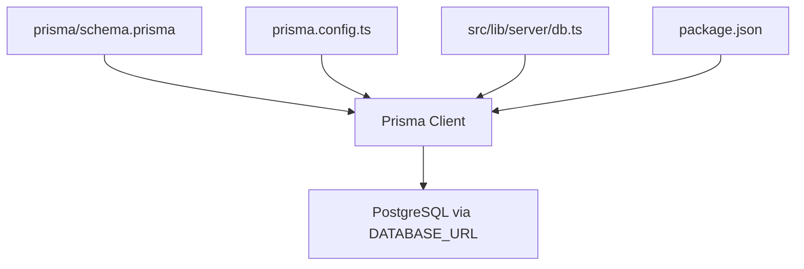
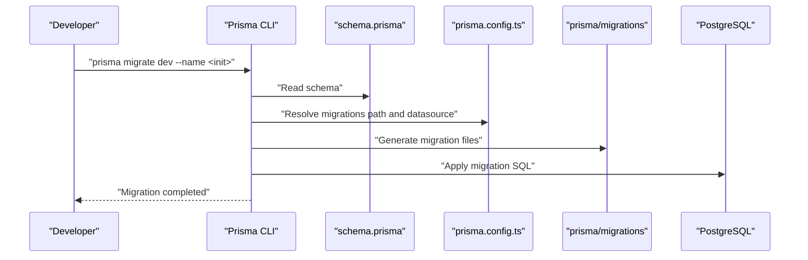
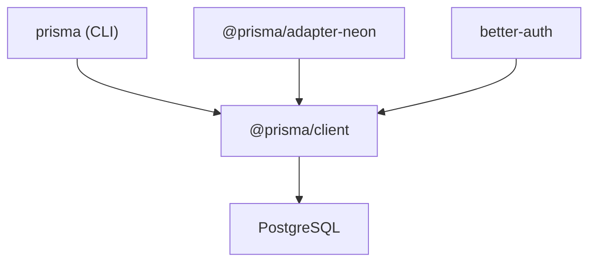

# Database Migrations

<cite>
**Referenced Files in This Document**
- [schema.prisma](file://prisma/schema.prisma)
- [prisma.config.ts](file://prisma.config.ts)
- [package.json](file://package.json)
- [README.md](file://README.md)
- [db.ts](file://src/lib/server/db.ts)
</cite>

## Table of Contents
1. [Introduction](#introduction)
2. [Project Structure](#project-structure)
3. [Core Components](#core-components)
4. [Architecture Overview](#architecture-overview)
5. [Detailed Component Analysis](#detailed-component-analysis)
6. [Dependency Analysis](#dependency-analysis)
7. [Performance Considerations](#performance-considerations)
8. [Troubleshooting Guide](#troubleshooting-guide)
9. [Conclusion](#conclusion)
10. [Appendices](#appendices)

## Introduction
This document explains how Screenlog manages database migrations using Prisma Migrate. It covers the migration workflow from schema changes to database updates, migration file structure and naming conventions, version control practices, and operational procedures for development, deployment, and rollbacks. It also provides best practices, testing strategies, production deployment considerations, common migration scenarios, troubleshooting guidance, and seed data management.

## Project Structure
Screenlog’s database schema and migration configuration are centralized under the prisma directory. The Prisma Client is initialized in the server layer and used across API routes and services.

**Diagram sources**
- [schema.prisma:1-258](file://prisma/schema.prisma#L1-L258)
- [prisma.config.ts:1-15](file://prisma.config.ts#L1-L15)
- [db.ts:1-11](file://src/lib/server/db.ts#L1-L11)
- [package.json:1-47](file://package.json#L1-L47)

**Section sources**
- [schema.prisma:1-258](file://prisma/schema.prisma#L1-L258)
- [prisma.config.ts:1-15](file://prisma.config.ts#L1-L15)
- [db.ts:1-11](file://src/lib/server/db.ts#L1-L11)
- [package.json:1-47](file://package.json#L1-L47)

## Core Components
- Prisma Schema: Defines models, relations, enums, and database provider settings.
- Prisma Config: Declares schema location, migration output path, and datasource URL.
- Prisma Client: Instantiated once and reused across the backend to execute queries.
- Package Dependencies: Includes Prisma CLI and client, and the Neon adapter for PostgreSQL.

Key responsibilities:
- schema.prisma: Central source of truth for database structure.
- prisma.config.ts: Ensures migrations are written to prisma/migrations and reads DATABASE_URL from environment.
- db.ts: Provides a singleton PrismaClient instance for the server.
- package.json: Installs Prisma CLI and client; the project targets Node.js 18.18+.

**Section sources**
- [schema.prisma:1-258](file://prisma/schema.prisma#L1-L258)
- [prisma.config.ts:6-14](file://prisma.config.ts#L6-L14)
- [db.ts:1-11](file://src/lib/server/db.ts#L1-L11)
- [package.json:26-44](file://package.json#L26-L44)

## Architecture Overview
The migration lifecycle integrates Prisma CLI, the configured datasource, and the application’s Prisma Client.

**Diagram sources**
- [README.md:61-64](file://README.md#L61-L64)
- [prisma.config.ts:6-14](file://prisma.config.ts#L6-L14)
- [schema.prisma:1-8](file://prisma/schema.prisma#L1-L8)

## Detailed Component Analysis

### Migration Workflow: From Schema Changes to Database Updates
- Development workflow:
  - Modify schema.prisma.
  - Run prisma migrate dev with a descriptive migration name to generate and apply a new migration.
  - Commit migration files to version control.
- Production workflow:
  - Use prisma migrate deploy to apply pending migrations without an interactive prompt.
  - Optionally use prisma migrate resolve to mark failed or pending migrations as resolved.

Operational steps:
- Initialize database with an initial migration using the documented command.
- For subsequent changes, create a new migration with prisma migrate dev and commit the generated files.
- On CI/CD or production servers, run prisma migrate deploy to apply migrations safely.

**Section sources**
- [README.md:61-64](file://README.md#L61-L64)
- [prisma.config.ts:6-14](file://prisma.config.ts#L6-L14)
- [schema.prisma:1-8](file://prisma/schema.prisma#L1-L8)

### Migration File Structure and Naming Conventions
- Location: prisma/migrations.
- Structure: Each migration consists of a folder named with a timestamp and a human-readable name, containing SQL and optional datamodel changes.
- Naming convention: prisma migrate dev generates folders with a timestamp prefix followed by a descriptive name (e.g., init). Keep names descriptive and consistent across teams.

Version control practices:
- Commit migration folders alongside schema changes.
- Do not edit generated migration files manually after creation; use prisma migrate dev to regenerate when schema evolves.
- Treat migrations as immutable; avoid renaming or deleting migration folders.

**Section sources**
- [prisma.config.ts:8-10](file://prisma.config.ts#L8-L10)
- [README.md:61-64](file://README.md#L61-L64)

### Migration Commands and Procedures
- prisma migrate dev:
  - Purpose: Create and apply a new migration for local development.
  - Usage: prisma migrate dev --name <init> or prisma migrate dev --name add_user_preferences.
- prisma migrate deploy:
  - Purpose: Apply pending migrations in production environments without an interactive prompt.
  - Usage: prisma migrate deploy.
- Rollback procedures:
  - Prisma Migrate does not support automatic rollback of applied migrations. Recommended approaches:
    - Write compensating migrations to revert changes.
    - Use database-level backups and restores when applicable.
    - Maintain a staging environment to test rollbacks before attempting in production.

Production deployment considerations:
- Ensure DATABASE_URL is set in production.
- Run prisma migrate deploy during deployment to apply pending migrations.
- Monitor migration status and logs; use prisma migrate resolve to handle stuck or failed states.

**Section sources**
- [README.md:61-64](file://README.md#L61-L64)
- [prisma.config.ts:11-13](file://prisma.config.ts#L11-L13)

### Common Migration Scenarios
- Adding a new field:
  - Modify schema.prisma to add the field to the relevant model.
  - Run prisma migrate dev --name add_new_field.
  - Commit the generated migration.
- Creating relationships:
  - Define relation fields and referential actions in schema.prisma.
  - Run prisma migrate dev --name create_relation.
  - Commit the generated migration.
- Modifying constraints:
  - Update unique, default, or relation attributes in schema.prisma.
  - Run prisma migrate dev --name modify_constraints.
  - Commit the generated migration.

Data preservation techniques:
- Avoid destructive changes to existing columns when possible.
- Prefer additive changes (new columns, new indexes) and deprecate old ones gradually.
- Use database transactions in application code when updating data alongside schema changes.

**Section sources**
- [schema.prisma:184-257](file://prisma/schema.prisma#L184-L257)
- [README.md:61-64](file://README.md#L61-L64)

### Seed Data Management and Initial Population
- Seed command: The Prisma configuration references a seed script path. Use prisma db seed to populate initial data after migrations are applied.
- Strategy:
  - Create a seed script that inserts initial records (e.g., admin users, default preferences).
  - Run prisma db seed after prisma migrate deploy in CI/CD or locally.
  - Keep seeds deterministic and idempotent to avoid inconsistent states.

Note: The repository currently defines the seed path in configuration. Implement the seed script file and update the path if needed.

**Section sources**
- [prisma.config.ts:6-14](file://prisma.config.ts#L6-L14)

### Prisma Client Integration
- The application initializes a singleton PrismaClient instance and exposes it via a shared module for use in server routes and services.
- This ensures efficient resource usage and consistent database connections across the backend.

**Section sources**
- [db.ts:1-11](file://src/lib/server/db.ts#L1-L11)

## Dependency Analysis
Prisma-related dependencies and their roles:
- prisma: CLI and engine for schema introspection, migration generation, and client building.
- @prisma/client: TypeScript client library for database access.
- @prisma/adapter-neon: Adapter for PostgreSQL-compatible databases (e.g., Neon).
- better-auth: Authentication provider; integrates with the database via Prisma.

**Diagram sources**
- [package.json:26-44](file://package.json#L26-L44)

**Section sources**
- [package.json:26-44](file://package.json#L26-L44)

## Performance Considerations
- Keep migrations small and focused to reduce downtime and risk.
- Avoid long-running migrations in production; split large changes into multiple smaller migrations.
- Use indexes judiciously; excessive indexing can slow writes.
- Test migrations on a staging replica before applying to production.

[No sources needed since this section provides general guidance]

## Troubleshooting Guide
Common issues and resolutions:
- Migration fails due to pending state:
  - Use prisma migrate resolve to mark the state as resolved (e.g., applied or rolled back).
- Migration conflicts or drift:
  - Reconcile schema.prisma with the actual database state.
  - Recreate migrations using prisma migrate dev with a new descriptive name.
- Production deployment stalls:
  - Confirm DATABASE_URL is present and reachable.
  - Run prisma migrate deploy again; inspect logs for errors.
- Seed failures:
  - Ensure the seed script exists and is executable.
  - Run prisma db seed after successful migration application.

**Section sources**
- [prisma.config.ts:6-14](file://prisma.config.ts#L6-L14)
- [README.md:61-64](file://README.md#L61-L64)

## Conclusion
Screenlog leverages Prisma Migrate to manage database schema evolution safely and predictably. By following the documented workflow—schema changes, prisma migrate dev, committing migrations, and prisma migrate deploy—you can maintain a reliable and auditable database state across development and production. Adhering to best practices, testing strategies, and robust version control practices ensures smooth deployments and minimal risk.

[No sources needed since this section summarizes without analyzing specific files]

## Appendices

### Appendix A: Migration Lifecycle Checklist
- After schema changes:
  - Run prisma migrate dev --name describe_the_change.
  - Review generated SQL and confirm correctness.
  - Commit migration files.
- Before deploying:
  - Run prisma migrate deploy in CI/CD.
  - Optionally run prisma db seed.
  - Verify application connectivity and basic queries.

**Section sources**
- [README.md:61-64](file://README.md#L61-L64)
- [prisma.config.ts:6-14](file://prisma.config.ts#L6-L14)