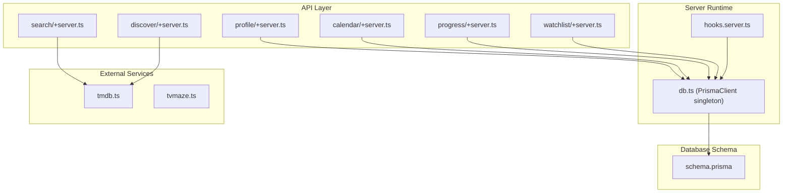
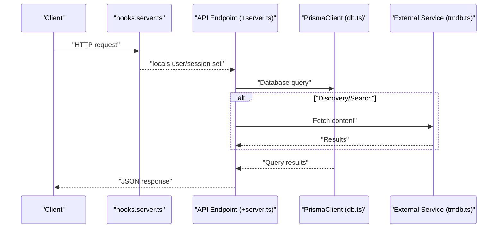
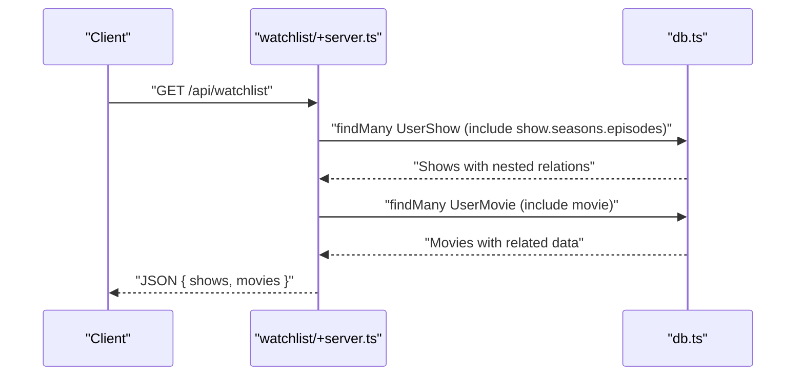
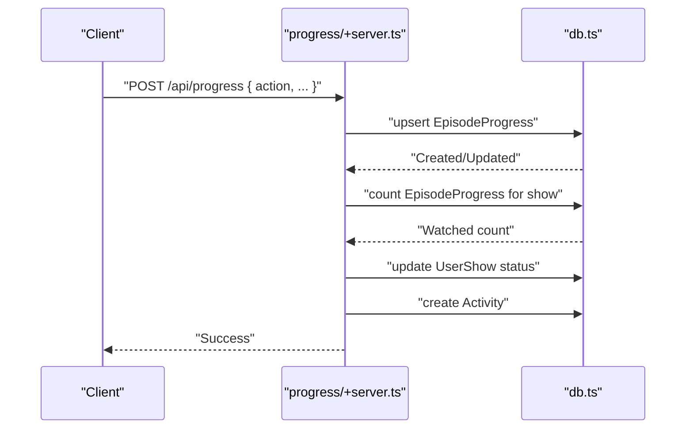
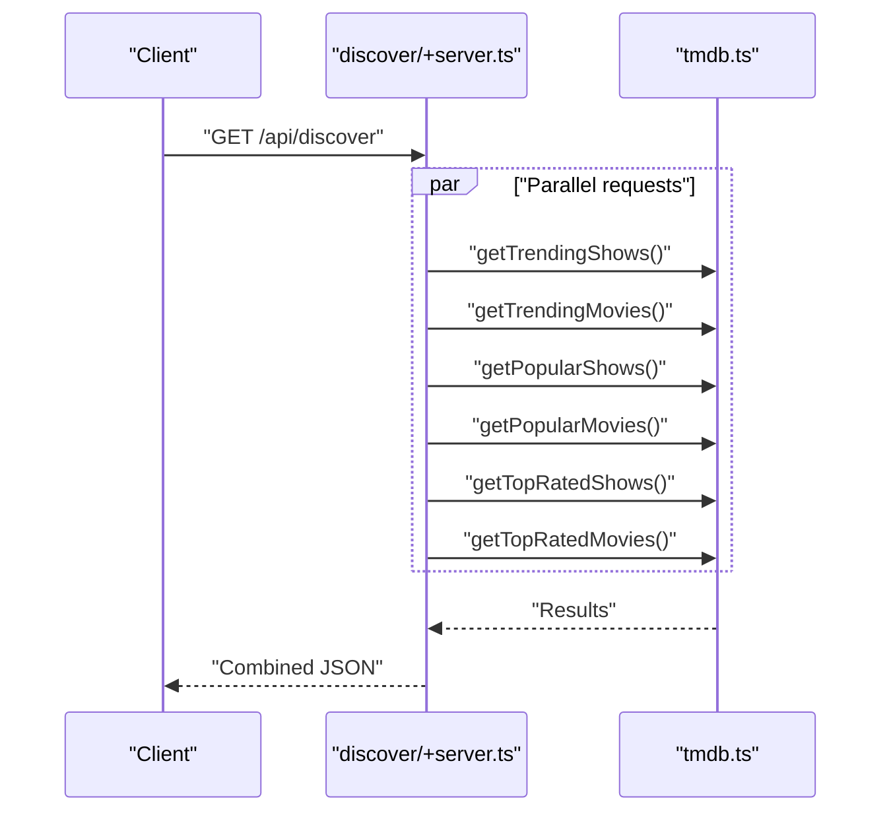
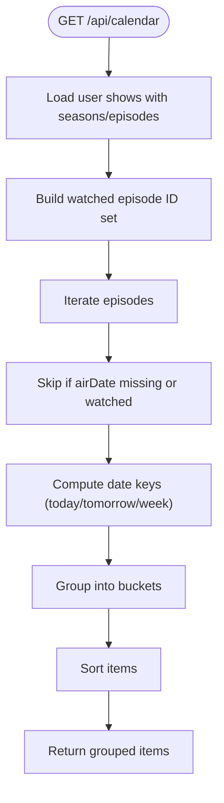
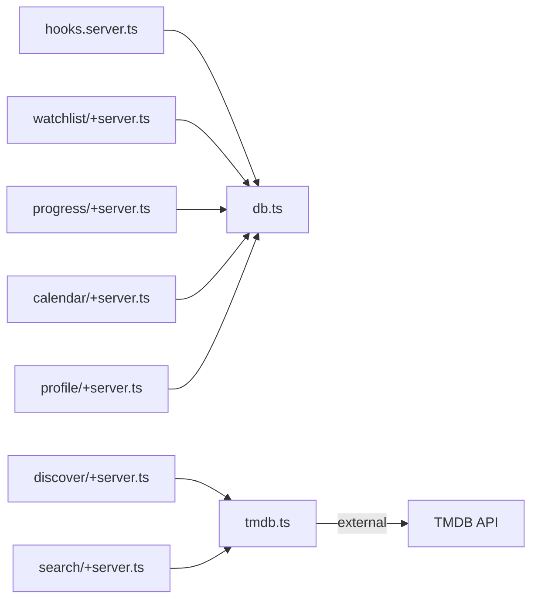

# Performance Optimization

<cite>
**Referenced Files in This Document**
- [schema.prisma](file://prisma/schema.prisma)
- [prisma.config.ts](file://prisma.config.ts)
- [db.ts](file://src/lib/server/db.ts)
- [hooks.server.ts](file://src/hooks.server.ts)
- [watchlist/+server.ts](file://src/routes/api/watchlist/+server.ts)
- [progress/+server.ts](file://src/routes/api/progress/+server.ts)
- [discover/+server.ts](file://src/routes/api/discover/+server.ts)
- [search/+server.ts](file://src/routes/api/search/+server.ts)
- [calendar/+server.ts](file://src/routes/api/calendar/+server.ts)
- [profile/+server.ts](file://src/routes/api/profile/+server.ts)
- [tmdb.ts](file://src/lib/services/tmdb.ts)
- [tvmaze.ts](file://src/lib/services/tvmaze.ts)
- [SKILL.md](file://.agents/skills/neon-postgres-egress-optimizer/SKILL.md)
</cite>

## Table of Contents
1. [Introduction](#introduction)
2. [Project Structure](#project-structure)
3. [Core Components](#core-components)
4. [Architecture Overview](#architecture-overview)
5. [Detailed Component Analysis](#detailed-component-analysis)
6. [Dependency Analysis](#dependency-analysis)
7. [Performance Considerations](#performance-considerations)
8. [Troubleshooting Guide](#troubleshooting-guide)
9. [Conclusion](#conclusion)
10. [Appendices](#appendices)

## Introduction
This document provides comprehensive performance optimization guidance for Screenlog’s database implementation. It focuses on indexing strategies (unique and composite indexes), query optimization for watchlist retrieval, progress tracking, and content discovery, along with connection pooling, query batching, and lazy-loading patterns. It also covers performance monitoring, slow query identification, scaling with read replicas, caching integration, and benchmarking approaches tailored to the current codebase.

## Project Structure
Screenlog uses Prisma ORM with PostgreSQL. The database schema defines core entities (users, shows, seasons, episodes, movies, user content associations, progress, and activity). API endpoints under src/routes/api/ orchestrate database operations and integrate with external content providers for discovery and search.

**Diagram sources**
- [hooks.server.ts:1-18](file://src/hooks.server.ts#L1-L18)
- [db.ts:1-10](file://src/lib/server/db.ts#L1-L10)
- [watchlist/+server.ts:1-141](file://src/routes/api/watchlist/+server.ts#L1-L141)
- [progress/+server.ts:1-133](file://src/routes/api/progress/+server.ts#L1-L133)
- [discover/+server.ts:1-21](file://src/routes/api/discover/+server.ts#L1-L21)
- [search/+server.ts:1-16](file://src/routes/api/search/+server.ts#L1-L16)
- [calendar/+server.ts:1-82](file://src/routes/api/calendar/+server.ts#L1-L82)
- [profile/+server.ts:1-66](file://src/routes/api/profile/+server.ts#L1-L66)
- [tmdb.ts:1-167](file://src/lib/services/tmdb.ts#L1-L167)
- [tvmaze.ts:1-24](file://src/lib/services/tvmaze.ts#L1-L24)
- [schema.prisma:1-258](file://prisma/schema.prisma#L1-L258)

**Section sources**
- [hooks.server.ts:1-18](file://src/hooks.server.ts#L1-L18)
- [db.ts:1-10](file://src/lib/server/db.ts#L1-L10)
- [schema.prisma:1-258](file://prisma/schema.prisma#L1-L258)

## Core Components
- Database client: PrismaClient singleton initialized once and reused across requests.
- Authentication hook attaches session/user to locals for endpoint authorization.
- API endpoints encapsulate CRUD and analytics operations against the schema.

Key performance-relevant observations:
- Watchlist retrieval eagerly loads nested relations, which can increase payload size and transfer volume.
- Progress tracking performs multiple queries per operation and recomputes derived statuses.
- Calendar and profile endpoints iterate over large result sets in memory before grouping/aggregation.
- Discovery and search endpoints rely on external APIs and batch calls to TMDB.

**Section sources**
- [db.ts:1-10](file://src/lib/server/db.ts#L1-L10)
- [hooks.server.ts:1-18](file://src/hooks.server.ts#L1-L18)
- [watchlist/+server.ts:1-141](file://src/routes/api/watchlist/+server.ts#L1-L141)
- [progress/+server.ts:1-133](file://src/routes/api/progress/+server.ts#L1-L133)
- [calendar/+server.ts:1-82](file://src/routes/api/calendar/+server.ts#L1-L82)
- [profile/+server.ts:1-66](file://src/routes/api/profile/+server.ts#L1-L66)
- [discover/+server.ts:1-21](file://src/routes/api/discover/+server.ts#L1-L21)
- [search/+server.ts:1-16](file://src/routes/api/search/+server.ts#L1-L16)
- [tmdb.ts:1-167](file://src/lib/services/tmdb.ts#L1-L167)

## Architecture Overview
The runtime initializes a single PrismaClient instance and exposes it via a module-level export. API endpoints use this client to query the database. Some endpoints also call external services for discovery/search.

**Diagram sources**
- [hooks.server.ts:1-18](file://src/hooks.server.ts#L1-L18)
- [db.ts:1-10](file://src/lib/server/db.ts#L1-L10)
- [discover/+server.ts:1-21](file://src/routes/api/discover/+server.ts#L1-L21)
- [search/+server.ts:1-16](file://src/routes/api/search/+server.ts#L1-L16)
- [tmdb.ts:1-167](file://src/lib/services/tmdb.ts#L1-L167)

## Detailed Component Analysis

### Indexing Strategies
Current schema indexes and uniqueness constraints:
- Unique indexes: email, token, providerId+accountId, identifier+value, tmdbId, tvMazeId, userId+showId, userId+movieId, userId+episodeId, userId+createdAt (composite).
- Composite index: userId+createdAt on Activity.

Recommended improvements:
- Add composite indexes for frequent filter patterns:
  - EpisodeProgress(userId, episodeId) to speed up existence checks and updates.
  - UserShow(userId, status) to accelerate status-based filtering and analytics.
  - Episode(seasonId, episodeNumber) to optimize season-scoped lookups.
  - Activity(userId, createdAt) already exists; ensure it is leveraged by queries ordering/filtering by time.
- Consider selective indexes for low-cardinality enums (status) if queries filter heavily by status.

Impact:
- Reduced index scans and improved join performance for watchlist, progress, and calendar queries.
- Lower network egress by minimizing overfetching and enabling targeted selects.

**Section sources**
- [schema.prisma:13, 39, 65, 80, 87, 88, 124, 144, 195, 210, 224, 240:13-240](file://prisma/schema.prisma#L13-L240)

### Watchlist Retrieval
Current behavior:
- Retrieves user shows and movies with nested includes for related entities.
- Orders by updatedAt descending.

Optimization opportunities:
- Select only needed fields for list views; avoid including entire related trees unless necessary.
- Paginate results to bound payload size.
- Defer deep eager loading; use separate queries for details on demand.
- Cache recent watchlist snapshots per user for short intervals.

**Diagram sources**
- [watchlist/+server.ts:6-26](file://src/routes/api/watchlist/+server.ts#L6-L26)

**Section sources**
- [watchlist/+server.ts:6-26](file://src/routes/api/watchlist/+server.ts#L6-L26)

### Progress Tracking
Current behavior:
- Upsert episode progress records.
- Recompute show status based on episode counts and watched episodes.
- Emit activity events on progress changes.

Optimization opportunities:
- Batch upserts for season or show-wide marking to reduce round-trips.
- Use atomic updates and counts to minimize redundant reads.
- Cache derived status per show per user to avoid recomputation.

**Diagram sources**
- [progress/+server.ts:60-132](file://src/routes/api/progress/+server.ts#L60-L132)

**Section sources**
- [progress/+server.ts:6-32](file://src/routes/api/progress/+server.ts#L6-L32)
- [progress/+server.ts:60-132](file://src/routes/api/progress/+server.ts#L60-L132)

### Content Discovery
Current behavior:
- Parallel fetches from TMDB for trending, popular, and top-rated content.
- Returns combined results.

Optimization opportunities:
- Cache TMDB responses with short TTLs (e.g., minutes) to reduce repeated network calls.
- Apply pagination and limit results to reduce payload sizes.
- Consider CDN caching for images returned by TMDB.

**Diagram sources**
- [discover/+server.ts:5-20](file://src/routes/api/discover/+server.ts#L5-L20)
- [tmdb.ts:106-140](file://src/lib/services/tmdb.ts#L106-L140)

**Section sources**
- [discover/+server.ts:5-20](file://src/routes/api/discover/+server.ts#L5-L20)
- [tmdb.ts:106-140](file://src/lib/services/tmdb.ts#L106-L140)

### Search Functionality
Current behavior:
- Calls TMDB multi-search endpoint and filters results.
- Returns a compact subset suitable for UI rendering.

Optimization opportunities:
- Cache search results keyed by query for short TTL.
- Limit results and apply client-side debouncing to reduce network churn.

**Section sources**
- [search/+server.ts:5-15](file://src/routes/api/search/+server.ts#L5-L15)
- [tmdb.ts:19-37](file://src/lib/services/tmdb.ts#L19-L37)

### Calendar Analytics
Current behavior:
- Loads user shows with nested seasons and episodes.
- Builds a set of watched episode IDs.
- Iterates over episodes to build calendar items and groups them by date windows.

Optimization opportunities:
- Use select projections to fetch only required fields for calendar computation.
- Precompute and cache calendar windows per user for a rolling period.
- Offload grouping/aggregation to SQL where possible.

**Diagram sources**
- [calendar/+server.ts:9-81](file://src/routes/api/calendar/+server.ts#L9-L81)

**Section sources**
- [calendar/+server.ts:9-81](file://src/routes/api/calendar/+server.ts#L9-L81)

### Profile Analytics
Current behavior:
- Counts tracked/completed shows, watched episodes/movies.
- Computes total watch time by iterating over progress and movie lists.
- Aggregates top genres by iterating over user associations.

Optimization opportunities:
- Replace application-side loops with SQL aggregations to reduce data transfer and CPU usage.
- Cache computed metrics per user for short intervals.

**Section sources**
- [profile/+server.ts:5-65](file://src/routes/api/profile/+server.ts#L5-L65)

## Dependency Analysis
- API endpoints depend on the Prisma client exported from db.ts.
- Authentication hook populates locals.user/session for authorization checks.
- Discovery/search endpoints depend on external services (tmdb.ts, tvmaze.ts).
- Database schema defines relationships and indexes used by queries.

**Diagram sources**
- [hooks.server.ts:1-18](file://src/hooks.server.ts#L1-L18)
- [db.ts:1-10](file://src/lib/server/db.ts#L1-L10)
- [watchlist/+server.ts:1-141](file://src/routes/api/watchlist/+server.ts#L1-L141)
- [progress/+server.ts:1-133](file://src/routes/api/progress/+server.ts#L1-L133)
- [calendar/+server.ts:1-82](file://src/routes/api/calendar/+server.ts#L1-L82)
- [profile/+server.ts:1-66](file://src/routes/api/profile/+server.ts#L1-L66)
- [discover/+server.ts:1-21](file://src/routes/api/discover/+server.ts#L1-L21)
- [search/+server.ts:1-16](file://src/routes/api/search/+server.ts#L1-L16)
- [tmdb.ts:1-167](file://src/lib/services/tmdb.ts#L1-L167)

**Section sources**
- [hooks.server.ts:1-18](file://src/hooks.server.ts#L1-L18)
- [db.ts:1-10](file://src/lib/server/db.ts#L1-L10)
- [tmdb.ts:1-167](file://src/lib/services/tmdb.ts#L1-L167)

## Performance Considerations

### Database Indexing
- Leverage existing unique and composite indexes for efficient lookups.
- Add targeted composite indexes for common filter/order patterns (e.g., EpisodeProgress(userId, episodeId), UserShow(userId, status)).
- Ensure queries utilize indexes by avoiding expressions on indexed columns and using selective filters.

**Section sources**
- [schema.prisma:13, 39, 65, 80, 87, 88, 124, 144, 195, 210, 224, 240:13-240](file://prisma/schema.prisma#L13-L240)

### Query Optimization Techniques
- Prefer selective field retrieval (select) over include to reduce payload size.
- Apply pagination (take/skip) for list endpoints to bound network egress.
- Use atomic operations and server-side aggregation to minimize client-side loops.
- Batch operations (e.g., bulk upserts for season marking) to reduce round-trips.

Examples of optimized patterns:
- Watchlist retrieval: select only identifiers and minimal fields; defer nested includes until detail navigation.
- Progress updates: batch markSeason/markCaughtUp operations; cache derived status.
- Calendar: precompute date keys and group in SQL where feasible; limit future windows.
- Profile: replace loops with SQL COUNTs and GROUP BY aggregations.

**Section sources**
- [watchlist/+server.ts:6-26](file://src/routes/api/watchlist/+server.ts#L6-L26)
- [progress/+server.ts:85-99](file://src/routes/api/progress/+server.ts#L85-L99)
- [calendar/+server.ts:14-52](file://src/routes/api/calendar/+server.ts#L14-L52)
- [profile/+server.ts:10-32](file://src/routes/api/profile/+server.ts#L10-L32)

### Database Connection Pooling
- Prisma uses a default pool managed by the underlying driver. Configure pool size and timeouts according to deployment capacity and expected concurrency.
- Keep the PrismaClient instance global (as currently implemented) to reuse connections efficiently.

**Section sources**
- [db.ts:1-10](file://src/lib/server/db.ts#L1-L10)

### Query Batching and Lazy Loading
- Batch related writes (e.g., season/episode creation) to reduce latency.
- Use lazy loading for detail views; load nested data only when requested.
- Defer expensive computations (e.g., calendar grouping) to background jobs if acceptable.

**Section sources**
- [watchlist/+server.ts:33-78](file://src/routes/api/watchlist/+server.ts#L33-L78)
- [calendar/+server.ts:29-75](file://src/routes/api/calendar/+server.ts#L29-L75)

### Caching Integration Patterns
- Cache TMDB responses for trending/popular/top-rated with short TTLs.
- Cache watchlist snapshots and calendar windows per user for brief intervals.
- Cache profile-derived metrics (counts, top genres) to reduce repeated scans.

**Section sources**
- [discover/+server.ts:8-16](file://src/routes/api/discover/+server.ts#L8-L16)
- [tmdb.ts:106-140](file://src/lib/services/tmdb.ts#L106-L140)

### Performance Monitoring and Slow Query Identification
- Enable pg_stat_statements to identify top egress contributors and long-running queries.
- Focus on queries with high row counts, wide rows, or extreme call frequencies.
- Cross-reference with the schema to identify large columns (TEXT, JSON) that amplify egress.

**Section sources**
- [SKILL.md:20-89](file://.agents/skills/neon-postgres-egress-optimizer/SKILL.md#L20-L89)

### Scaling and Read Replicas
- Use read replicas for read-heavy endpoints (discover, search, calendar, profile).
- Route write operations to primary; offload analytics queries to replicas.
- Implement eventual consistency for non-critical reads to reduce primary load.

[No sources needed since this section provides general guidance]

### Benchmarking Guidelines
- Measure end-to-end latency and throughput for watchlist, progress, calendar, and profile endpoints.
- Track database rows returned per call and calls per second to estimate egress impact.
- Compare before/after after applying selective field retrieval, pagination, and caching.

**Section sources**
- [SKILL.md:205-207](file://.agents/skills/neon-postgres-egress-optimizer/SKILL.md#L205-L207)

## Troubleshooting Guide
Common issues and remedies:
- Excessive egress from overfetching: switch from include to select and apply pagination.
- Unbounded list endpoints: enforce take/skip limits.
- High-frequency static queries: add caching layers.
- Expensive client-side aggregations: push aggregation to SQL.

Verification steps:
- Run diagnostic queries to rank top egress contributors.
- Confirm reduced rows per call and improved query plans.
- Validate API responses remain consistent after changes.

**Section sources**
- [SKILL.md:46-89](file://.agents/skills/neon-postgres-egress-optimizer/SKILL.md#L46-L89)
- [SKILL.md:109-157](file://.agents/skills/neon-postgres-egress-optimizer/SKILL.md#L109-L157)

## Conclusion
By leveraging existing unique and composite indexes, adopting selective field retrieval, pagination, and caching, and optimizing query patterns for watchlist, progress, and calendar analytics, Screenlog can significantly reduce database egress and improve responsiveness. Implementing read replicas, monitoring with pg_stat_statements, and establishing benchmarking practices will support sustainable growth and predictable performance.

## Appendices

### Example Optimized Queries (Paths)
- Watchlist retrieval with selective fields and pagination:
  - [watchlist/+server.ts:10-21](file://src/routes/api/watchlist/+server.ts#L10-L21)
- Progress marking for a season (batched upserts):
  - [progress/+server.ts:91-99](file://src/routes/api/progress/+server.ts#L91-L99)
- Calendar item grouping and sorting:
  - [calendar/+server.ts:52-75](file://src/routes/api/calendar/+server.ts#L52-L75)
- Profile analytics aggregation (conceptual):
  - Replace loops with SQL COUNT/GROUP BY patterns similar to:
    - [profile/+server.ts:10-32](file://src/routes/api/profile/+server.ts#L10-L32)

[No sources needed since this section references paths without analyzing specific files]