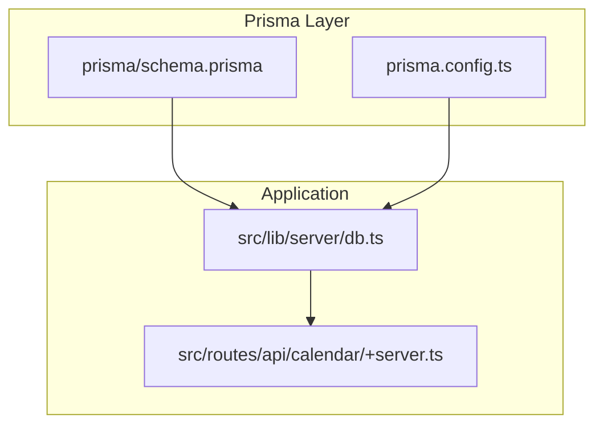
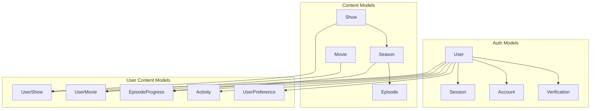
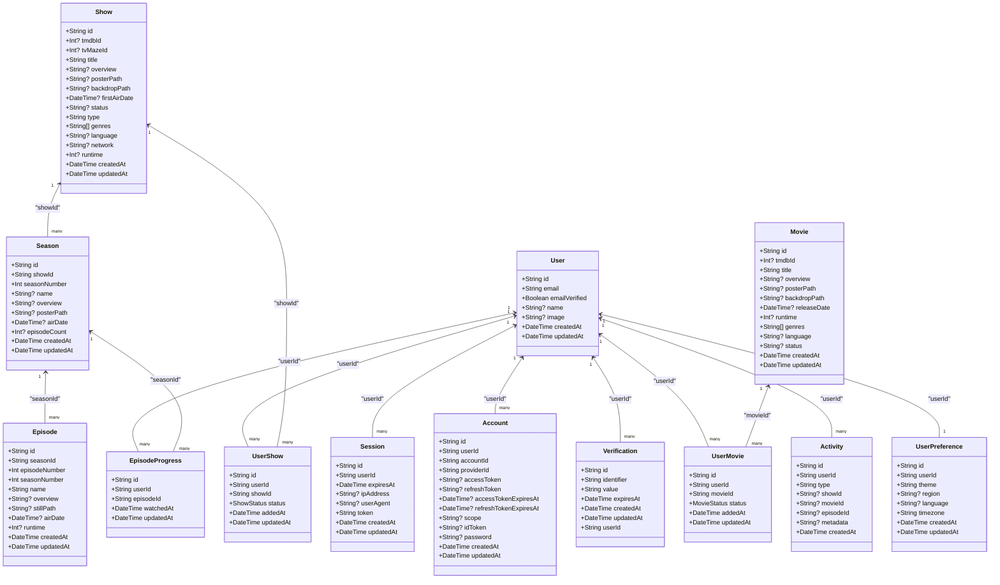
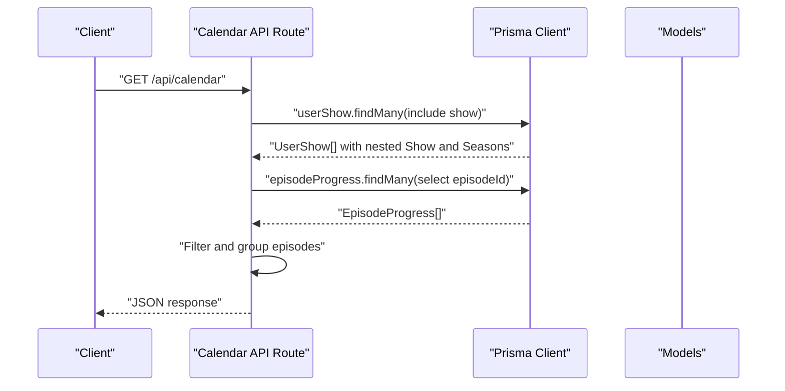
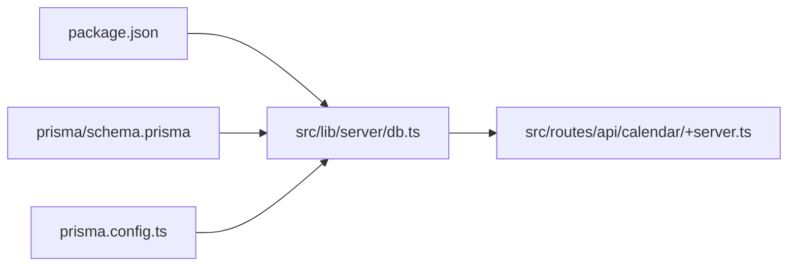

# Prisma Schema Design

<cite>
**Referenced Files in This Document**
- [schema.prisma](file://prisma/schema.prisma)
- [prisma.config.ts](file://prisma.config.ts)
- [package.json](file://package.json)
- [README.md](file://README.md)
- [db.ts](file://src/lib/server/db.ts)
- [+server.ts (calendar)](file://src/routes/api/calendar/+server.ts)
</cite>

## Table of Contents
1. [Introduction](#introduction)
2. [Project Structure](#project-structure)
3. [Core Components](#core-components)
4. [Architecture Overview](#architecture-overview)
5. [Detailed Component Analysis](#detailed-component-analysis)
6. [Dependency Analysis](#dependency-analysis)
7. [Performance Considerations](#performance-considerations)
8. [Troubleshooting Guide](#troubleshooting-guide)
9. [Conclusion](#conclusion)
10. [Appendices](#appendices)

## Introduction
This document provides comprehensive Prisma schema documentation for Screenlog’s database implementation. It explains the complete schema structure, including all models, enums, relations, constraints, and Prisma configuration. It also covers Prisma generator and datasource setup, foreign key constraints, referential integrity rules, indexes, and best practices for schema evolution and migrations.

## Project Structure
The database layer is centered around a single Prisma schema file and a minimal Prisma configuration. The application uses a shared Prisma client instance for database access across server routes.

**Diagram sources**
- [schema.prisma](file://prisma/schema.prisma)
- [prisma.config.ts](file://prisma.config.ts)
- [db.ts](file://src/lib/server/db.ts)
- [+server.ts (calendar)](file://src/routes/api/calendar/+server.ts)

**Section sources**
- [schema.prisma](file://prisma/schema.prisma)
- [prisma.config.ts](file://prisma.config.ts)
- [db.ts](file://src/lib/server/db.ts)
- [README.md](file://README.md)

## Core Components
This section summarizes the Prisma configuration and the complete schema, including models, enums, relations, and annotations.

- Prisma configuration
  - Generator: client with provider set to the JavaScript client.
  - Datasource: PostgreSQL provider with DATABASE_URL from environment.
  - Migrations path configured under prisma/migrations.
  - Datasource URL sourced from environment variable.

- Models and fields
  - User: identity, Better Auth integration, timestamps, and relations to session, account, verification, user-show, user-movie, episode-progress, activity, and user-preference.
  - Session: session token, expiry, IP, user agent, timestamps, and a cascade-deleted relation to User.
  - Account: provider-specific identifiers, tokens, scopes, timestamps, and a cascade-deleted relation to User; composite unique constraint on providerId and accountId.
  - Verification: verification records with expiry and relation to User; composite unique constraint on identifier and value.
  - Show: media metadata, optional external IDs, genres array with default empty array, timestamps, and relations to seasons and user-show.
  - Season: season-level metadata, unique constraint on showId and seasonNumber, and a cascade-deleted relation to Show.
  - Episode: episode-level metadata, unique constraint on seasonId and episodeNumber, and a cascade-deleted relation to Season.
  - Movie: movie metadata, optional external IDs, genres array with default empty array, timestamps, and a relation to user-movie.
  - UserShow: user-to-show mapping with ShowStatus enum and defaults, timestamps, and cascade-deleted relations to User and Show.
  - UserMovie: user-to-movie mapping with MovieStatus enum and defaults, timestamps, and cascade-deleted relations to User and Movie.
  - EpisodeProgress: per-user episode watch tracking with timestamps and cascade-deleted relations to User and Episode.
  - Activity: user activity entries with optional content references, metadata, and index on userId and createdAt.
  - UserPreference: per-user preferences with defaults and a cascade-deleted relation to User.

- Enums
  - ShowStatus: PLAN_TO_WATCH, WATCHING, CAUGHT_UP, COMPLETED, PAUSED, DROPPED.
  - MovieStatus: PLAN_TO_WATCH, WATCHED, FAVOURITE, DROPPED.

- Annotations
  - @@map: explicit table mapping for User, Session, Account, Verification, Show, Season, Episode, Movie, UserShow, UserMovie, EpisodeProgress, Activity, UserPreference.
  - @@unique: composite unique constraints on providerId+accountId and identifier+value; unique constraints on tmdbId and tvMazeId for Show; unique constraints on userId+showId and userId+movieId for UserShow and UserMovie; unique constraint on userId for UserPreference; unique constraint on token for Session.
  - @@index: index on userId and createdAt for Activity.

**Section sources**
- [schema.prisma](file://prisma/schema.prisma)

## Architecture Overview
The schema enforces referential integrity via explicit relations and onDelete: Cascade rules. The application accesses the database through a globally cached Prisma client initialized in a server module.

**Diagram sources**
- [schema.prisma](file://prisma/schema.prisma)

## Detailed Component Analysis

### Prisma Configuration
- Generator
  - Provider: prisma-client-js.
- Datasource
  - Provider: postgresql.
  - URL: resolved from DATABASE_URL environment variable.
- Migrations
  - Path: prisma/migrations.
- Datasource URL
  - Resolved from process.env.DATABASE_URL.

Best practices:
- Keep DATABASE_URL in environment variables.
- Use prisma migrate dev for local development and CI/CD pipelines for production migrations.

**Section sources**
- [schema.prisma](file://prisma/schema.prisma)
- [prisma.config.ts](file://prisma.config.ts)
- [README.md](file://README.md)

### Enum Definitions
- ShowStatus
  - Values: PLAN_TO_WATCH, WATCHING, CAUGHT_UP, COMPLETED, PAUSED, DROPPED.
- MovieStatus
  - Values: PLAN_TO_WATCH, WATCHED, FAVOURITE, DROPPED.

Usage patterns:
- Enum fields are used in UserShow and UserMovie to represent user intent and completion state.
- Defaults are applied at the model level to ensure consistent initial states.

**Section sources**
- [schema.prisma](file://prisma/schema.prisma)

### Model Relations and Referential Integrity
- One-to-many
  - User to Session, Account, Verification, UserShow, UserMovie, EpisodeProgress, Activity, UserPreference.
  - Show to Season and UserShow.
  - Season to Episode and EpisodeProgress.
  - Movie to UserMovie.
- Many-to-one
  - Session, Account, Verification, UserShow, UserMovie, EpisodeProgress, Activity, UserPreference reference User.
  - Season references Show.
  - Episode references Season.
- Cascade delete
  - All relations to User and Show/Season/Episode enforce onDelete: Cascade to maintain referential integrity.

**Diagram sources**
- [schema.prisma](file://prisma/schema.prisma)

### Field Types, Defaults, Uniques, and Indexes
- Identity and timestamps
  - All primary keys are String with @id and default cuid().
  - createdAt defaults to now(); updatedAt uses @updatedAt.
- Defaults
  - Show.type defaults to "tv".
  - Show.genres defaults to [].
  - Movie.genres defaults to [].
  - UserPreference.theme defaults to "system"; timezone defaults to "Asia/Colombo".
  - UserShow.status and UserMovie.status default to PLAN_TO_WATCH.
- Unique constraints
  - User.email is unique.
  - Session.token is unique.
  - Show.tmdbId and Show.tvMazeId are unique.
  - Account.providerId + accountId form a composite unique.
  - Verification.identifier + value form a composite unique.
  - UserShow.userId + showId form a composite unique.
  - UserMovie.userId + movieId form a composite unique.
  - UserPreference.userId is unique.
- Indexes
  - Activity has an index on userId and createdAt.

**Section sources**
- [schema.prisma](file://prisma/schema.prisma)

### Application Integration
- Prisma client initialization
  - A singleton PrismaClient is exported and cached in development to avoid multiple clients.
- Route usage
  - Server routes import the db client and perform queries, for example, loading user shows and episode progress for calendar generation.

**Diagram sources**
- [+server.ts (calendar)](file://src/routes/api/calendar/+server.ts)
- [db.ts](file://src/lib/server/db.ts)
- [schema.prisma](file://prisma/schema.prisma)

**Section sources**
- [db.ts](file://src/lib/server/db.ts)
- [+server.ts (calendar)](file://src/routes/api/calendar/+server.ts)

## Dependency Analysis
- External dependencies
  - Prisma client and adapter for Neon are included in dependencies.
- Internal dependencies
  - Routes depend on the db module, which depends on Prisma client.
  - Prisma client depends on the schema and datasource configuration.

**Diagram sources**
- [package.json](file://package.json)
- [schema.prisma](file://prisma/schema.prisma)
- [prisma.config.ts](file://prisma.config.ts)
- [db.ts](file://src/lib/server/db.ts)
- [+server.ts (calendar)](file://src/routes/api/calendar/+server.ts)

**Section sources**
- [package.json](file://package.json)
- [schema.prisma](file://prisma/schema.prisma)
- [prisma.config.ts](file://prisma.config.ts)
- [db.ts](file://src/lib/server/db.ts)
- [+server.ts (calendar)](file://src/routes/api/calendar/+server.ts)

## Performance Considerations
- Indexes
  - Consider adding indexes on frequently filtered or joined columns (e.g., Show.tmdbId, EpisodeProgress.userId, UserShow.userId).
- Queries
  - Use selective projections (select) to reduce payload size.
  - Batch operations where possible to minimize round-trips.
- Enums
  - Enum usage reduces storage overhead and improves query readability.
- Migrations
  - Keep migrations small and incremental; test in staging before applying to production.

[No sources needed since this section provides general guidance]

## Troubleshooting Guide
- Migration errors
  - Ensure DATABASE_URL is set and reachable.
  - Run prisma migrate dev to initialize and update schema.
- Relation errors
  - Verify foreign key fields and onDelete: Cascade rules.
  - Confirm unique constraints are satisfied before inserts.
- Client initialization
  - Ensure the Prisma client is initialized once and reused across the app lifecycle.

**Section sources**
- [README.md](file://README.md)
- [schema.prisma](file://prisma/schema.prisma)
- [db.ts](file://src/lib/server/db.ts)

## Conclusion
Screenlog’s Prisma schema defines a robust, normalized relational model supporting user-centric media tracking with strong referential integrity and clear constraints. The configuration is straightforward, leveraging environment-driven datasource URLs and a clean separation between schema and configuration. Following the recommended practices ensures safe evolution and reliable operation across environments.

[No sources needed since this section summarizes without analyzing specific files]

## Appendices

### Best Practices for Schema Evolution and Migrations
- Use prisma migrate dev for local schema updates.
- Review generated SQL and test in a staging environment.
- Keep migrations reversible where feasible.
- Document breaking changes and communicate them to stakeholders.
- Use enums for controlled sets of values to prevent data anomalies.

**Section sources**
- [README.md](file://README.md)
- [schema.prisma](file://prisma/schema.prisma)
- [prisma.config.ts](file://prisma.config.ts)