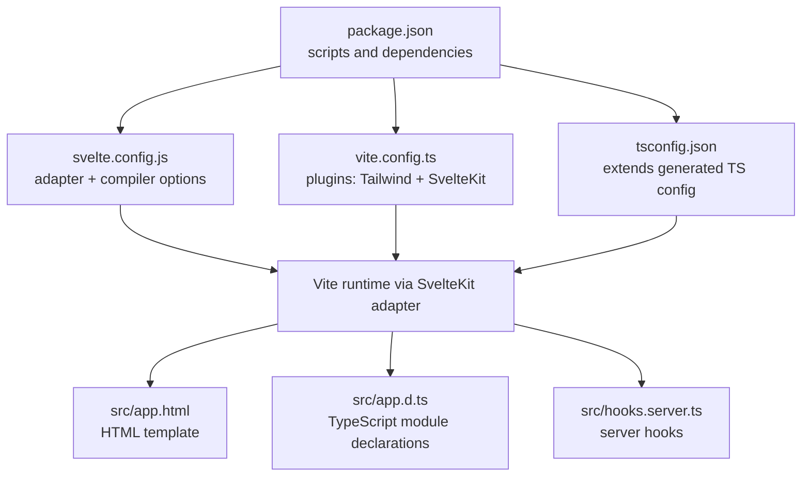
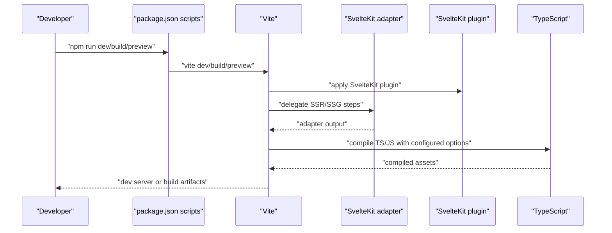
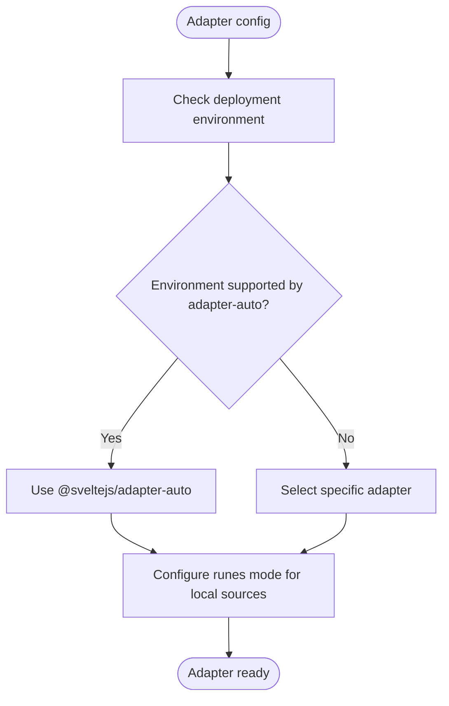
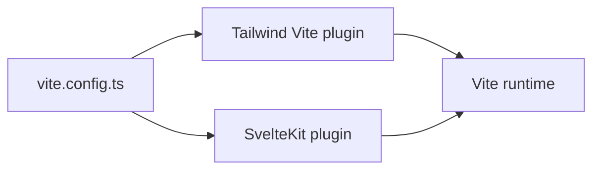
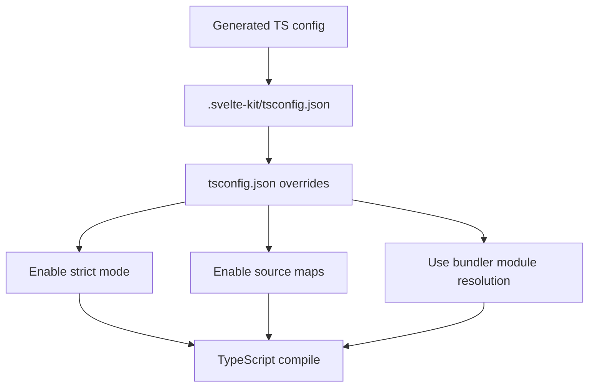
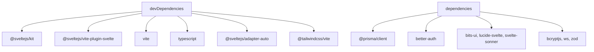

# Build Configuration

<cite>
**Referenced Files in This Document**
- [package.json](file://package.json)
- [svelte.config.js](file://svelte.config.js)
- [vite.config.ts](file://vite.config.ts)
- [tsconfig.json](file://tsconfig.json)
- [src/app.html](file://src/app.html)
- [src/app.d.ts](file://src/app.d.ts)
- [src/hooks.server.ts](file://src/hooks.server.ts)
- [prisma.config.ts](file://prisma.config.ts)
</cite>

## Table of Contents
1. [Introduction](#introduction)
2. [Project Structure](#project-structure)
3. [Core Components](#core-components)
4. [Architecture Overview](#architecture-overview)
5. [Detailed Component Analysis](#detailed-component-analysis)
6. [Dependency Analysis](#dependency-analysis)
7. [Performance Considerations](#performance-considerations)
8. [Troubleshooting Guide](#troubleshooting-guide)
9. [Conclusion](#conclusion)
10. [Appendices](#appendices)

## Introduction
This document explains the build configuration for Screenlog with a focus on SvelteKit and Vite. It covers adapter selection (auto-detected and manual), compiler options, runes mode configuration, TypeScript settings, and Vite plugin configuration. It also outlines development and production build behaviors, performance optimization techniques, and troubleshooting steps grounded in the repository’s configuration files.

## Project Structure
The build pipeline centers on three primary configuration files:
- SvelteKit configuration defines the adapter and compiler options.
- Vite configuration defines plugins and build behavior.
- TypeScript configuration extends SvelteKit’s generated TS config and enables strictness and related flags.

**Diagram sources**
- [package.json:1-47](file://package.json#L1-L47)
- [svelte.config.js:1-18](file://svelte.config.js#L1-L18)
- [vite.config.ts:1-8](file://vite.config.ts#L1-L8)
- [tsconfig.json:1-21](file://tsconfig.json#L1-L21)
- [src/app.html:1-25](file://src/app.html#L1-L25)
- [src/app.d.ts:1-23](file://src/app.d.ts#L1-L23)
- [src/hooks.server.ts:1-18](file://src/hooks.server.ts#L1-L18)

**Section sources**
- [package.json:1-47](file://package.json#L1-L47)
- [svelte.config.js:1-18](file://svelte.config.js#L1-L18)
- [vite.config.ts:1-8](file://vite.config.ts#L1-L8)
- [tsconfig.json:1-21](file://tsconfig.json#L1-L21)

## Core Components
- SvelteKit adapter configuration
  - Uses the auto-detected adapter by default. The configuration explicitly notes that adapter-auto supports specific environments and can be switched to a specific adapter if needed.
  - Compiler option “runes” is configured to force runes mode for local sources while leaving third-party libraries unaffected.
- Vite configuration
  - Plugins include Tailwind CSS integration and the SvelteKit plugin.
  - Scripts in package.json drive development, build, and preview tasks.
- TypeScript configuration
  - Extends SvelteKit’s generated TS config.
  - Enables strict mode, sourcemaps, bundler module resolution, and related flags.

**Section sources**
- [svelte.config.js:1-18](file://svelte.config.js#L1-L18)
- [vite.config.ts:1-8](file://vite.config.ts#L1-L8)
- [package.json:7-14](file://package.json#L7-L14)
- [tsconfig.json:2-14](file://tsconfig.json#L2-L14)

## Architecture Overview
The build pipeline integrates SvelteKit and Vite as follows:
- package.json scripts orchestrate development, production build, and preview.
- svelte.config.js configures the adapter and compiler options.
- vite.config.ts registers plugins and delegates SvelteKit-specific build steps to the adapter.
- tsconfig.json aligns TypeScript behavior with SvelteKit’s expectations.

**Diagram sources**
- [package.json:7-14](file://package.json#L7-L14)
- [vite.config.ts:1-8](file://vite.config.ts#L1-L8)
- [svelte.config.js:1-18](file://svelte.config.js#L1-L18)
- [tsconfig.json:2-14](file://tsconfig.json#L2-L14)

## Detailed Component Analysis

### SvelteKit Adapter Configuration
- Auto-detected adapter
  - The project uses the auto-detected adapter, which supports common hosting environments. If the target environment is unsupported or a specific adapter is preferred, the adapter can be manually selected as documented in the configuration comments.
- Compiler options
  - Runes mode is forced for local sources, excluding third-party libraries. This ensures consistent behavior during development and production while preserving library defaults.

**Diagram sources**
- [svelte.config.js:1-18](file://svelte.config.js#L1-L18)

**Section sources**
- [svelte.config.js:1-18](file://svelte.config.js#L1-L18)

### Compiler Options and Runes Mode
- Runes mode is enabled for local sources via a filename-based predicate, ensuring libraries remain unaffected. This pattern helps maintain compatibility with third-party packages while leveraging Svelte 5’s runes in application code.

**Section sources**
- [svelte.config.js:5-8](file://svelte.config.js#L5-L8)

### Vite Configuration
- Plugins
  - Tailwind CSS integration is registered via the Tailwind Vite plugin.
  - The SvelteKit plugin is included to integrate SvelteKit’s build and dev server capabilities.
- Development and production
  - Development is launched via the Vite dev command.
  - Production build and preview are driven by the corresponding Vite commands.

**Diagram sources**
- [vite.config.ts:1-8](file://vite.config.ts#L1-L8)

**Section sources**
- [vite.config.ts:1-8](file://vite.config.ts#L1-L8)
- [package.json:7-14](file://package.json#L7-L14)

### TypeScript Compilation Settings
- Extends SvelteKit’s generated TS config to inherit base settings.
- Strict mode is enabled along with sourcemaps, bundler module resolution, and related flags to improve correctness and debugging.
- Additional flags allow JavaScript interop and JSON module resolution.

**Diagram sources**
- [tsconfig.json:2-14](file://tsconfig.json#L2-L14)

**Section sources**
- [tsconfig.json:2-14](file://tsconfig.json#L2-L14)

### HTML Template and Module Declarations
- HTML template
  - The HTML template sets the theme color, favicon placeholder, and initializes a theme based on local storage preferences.
- TypeScript module declarations
  - Global module declarations augment page data and locals with Better Auth types, enabling type-safe server hooks and page data.

**Section sources**
- [src/app.html:1-25](file://src/app.html#L1-L25)
- [src/app.d.ts:1-23](file://src/app.d.ts#L1-L23)

### Server Hooks Integration
- Server hooks populate user and session data into event locals for downstream pages and API routes, integrating with the authentication system.

**Section sources**
- [src/hooks.server.ts:1-18](file://src/hooks.server.ts#L1-L18)

### Prisma Configuration
- Prisma configuration references the schema and migrations directory and reads the database URL from environment variables. While not a build-time setting, it informs the overall build and deployment context.

**Section sources**
- [prisma.config.ts:1-15](file://prisma.config.ts#L1-L15)

## Dependency Analysis
- Toolchain versions
  - SvelteKit, Svelte, Vite, and TypeScript versions are declared in devDependencies.
  - SvelteKit adapter-auto is used for adapter selection.
- Plugin dependencies
  - Tailwind Vite plugin is registered in Vite configuration.
- Runtime dependencies
  - Application dependencies include database clients, authentication, UI libraries, and utilities.

**Diagram sources**
- [package.json:15-45](file://package.json#L15-L45)

**Section sources**
- [package.json:15-45](file://package.json#L15-L45)

## Performance Considerations
- Enable runes mode locally to leverage fine-grained reactivity and improved performance characteristics in application code.
- Keep strict TypeScript mode enabled to catch potential performance pitfalls early.
- Use sourcemaps during development for efficient debugging without impacting production performance.
- Prefer bundler module resolution to align with modern toolchains and reduce resolution overhead.
- Integrate Tailwind CSS via the Vite plugin to ensure efficient CSS processing and purging in production builds.

[No sources needed since this section provides general guidance]

## Troubleshooting Guide
- Adapter environment support
  - If the current environment is not supported by the auto-detected adapter, switch to a specific adapter as indicated in the SvelteKit adapter documentation.
- Runes mode conflicts
  - If third-party libraries rely on legacy Svelte APIs, verify that runes mode is not unintentionally applied to those libraries by checking the runes configuration predicate.
- TypeScript strictness errors
  - Review strict mode diagnostics and adjust types or add explicit type guards as needed. Confirm module resolution and sourcemap settings align with the project’s expectations.
- Vite plugin conflicts
  - Ensure Tailwind and SvelteKit plugins are both present and ordered correctly in the Vite configuration.
- Server hooks and authentication
  - Verify server hooks populate locals correctly and that Better Auth is initialized before accessing session data in hooks.

**Section sources**
- [svelte.config.js:1-18](file://svelte.config.js#L1-L18)
- [tsconfig.json:2-14](file://tsconfig.json#L2-L14)
- [vite.config.ts:1-8](file://vite.config.ts#L1-L8)
- [src/hooks.server.ts:1-18](file://src/hooks.server.ts#L1-L18)

## Conclusion
Screenlog’s build configuration leverages SvelteKit’s adapter-auto with a clear path to manual adapter selection, enforces runes mode for local sources, and aligns TypeScript settings with SvelteKit’s generated config. Vite is configured with Tailwind and SvelteKit plugins, while scripts in package.json provide straightforward development, build, and preview workflows. Following the guidance here will help maintain a robust, performant, and debuggable build pipeline.

[No sources needed since this section summarizes without analyzing specific files]

## Appendices
- Build targets and scripts
  - Development: starts the Vite dev server.
  - Build: produces production-ready artifacts via the SvelteKit adapter.
  - Preview: serves built artifacts locally for testing.
- Additional notes
  - The HTML template initializes theme preferences and includes a favicon placeholder.
  - Prisma configuration is separate from build config but informs deployment readiness.

**Section sources**
- [package.json:7-14](file://package.json#L7-L14)
- [src/app.html:1-25](file://src/app.html#L1-L25)
- [prisma.config.ts:1-15](file://prisma.config.ts#L1-L15)