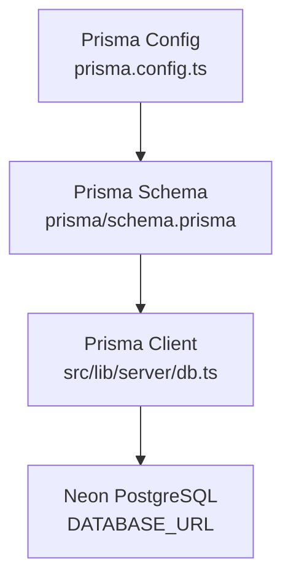
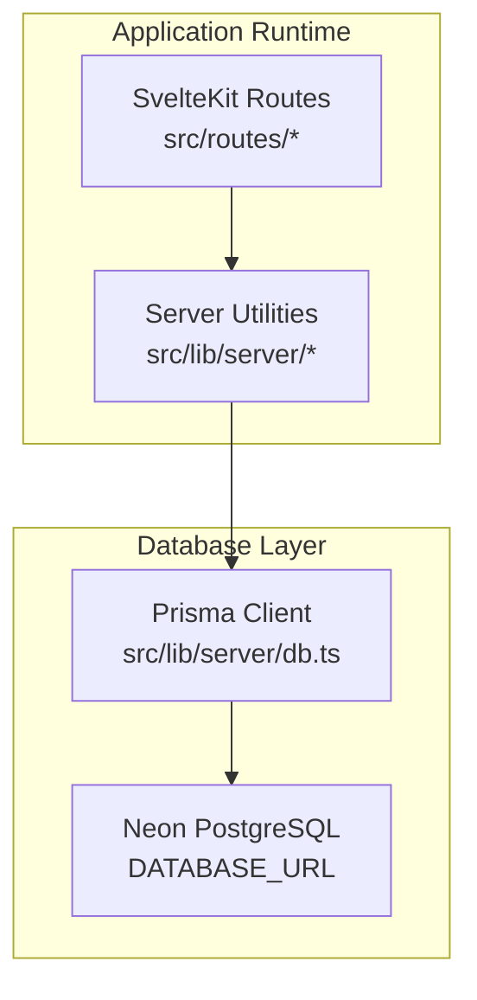
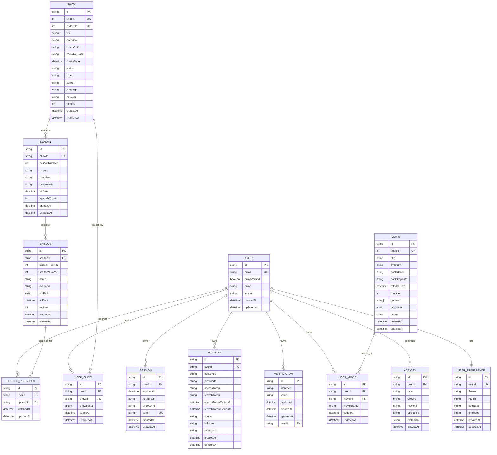
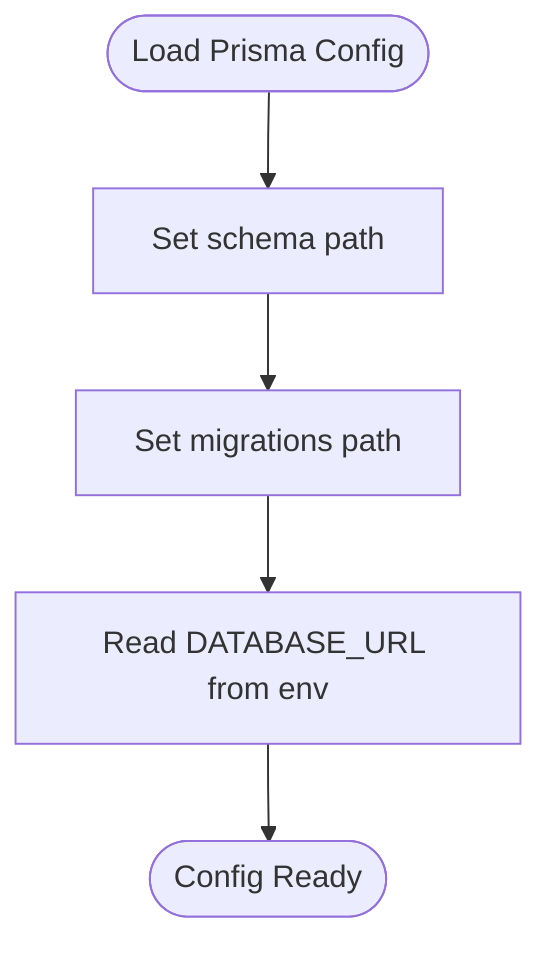
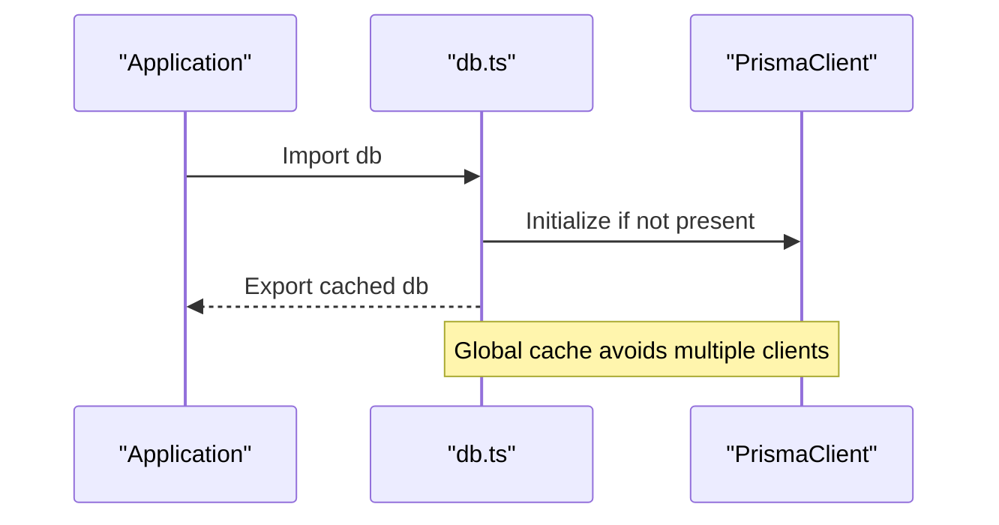
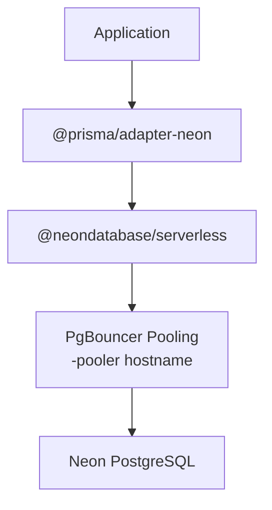
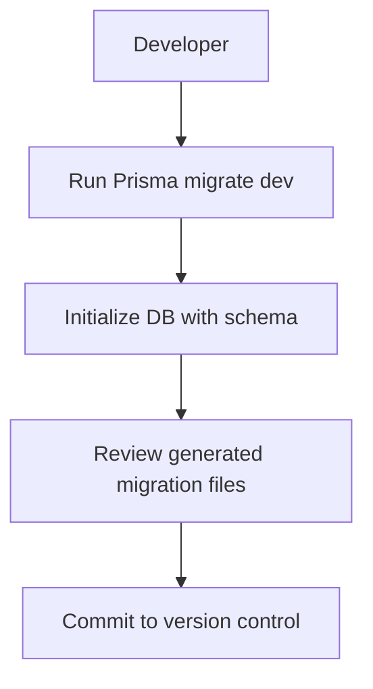
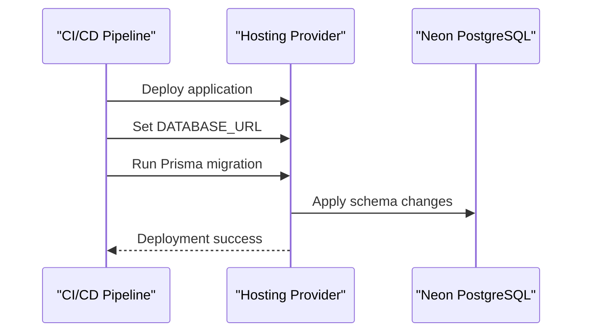
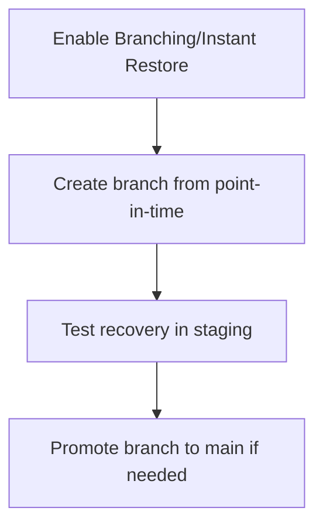
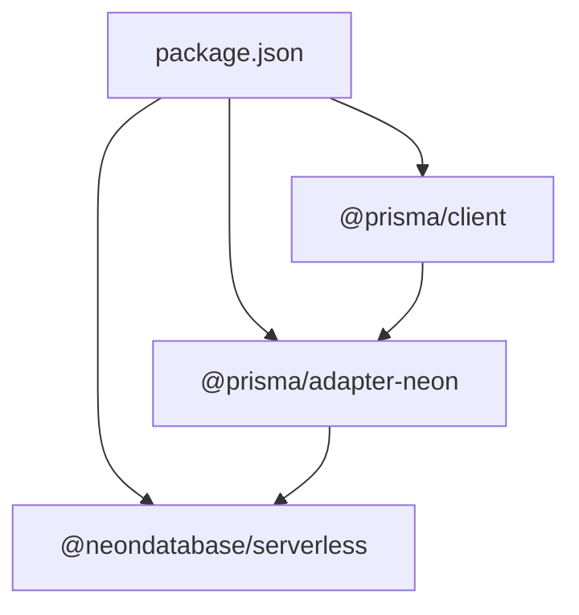

# Database Deployment

<cite>
**Referenced Files in This Document**
- [schema.prisma](file://prisma/schema.prisma)
- [prisma.config.ts](file://prisma.config.ts)
- [package.json](file://package.json)
- [db.ts](file://src/lib/server/db.ts)
- [README.md](file://README.md)
- [SKILL.md](file://.agents/skills/neon-postgres/SKILL.md)
</cite>

## Table of Contents
1. [Introduction](#introduction)
2. [Project Structure](#project-structure)
3. [Core Components](#core-components)
4. [Architecture Overview](#architecture-overview)
5. [Detailed Component Analysis](#detailed-component-analysis)
6. [Dependency Analysis](#dependency-analysis)
7. [Performance Considerations](#performance-considerations)
8. [Troubleshooting Guide](#troubleshooting-guide)
9. [Conclusion](#conclusion)
10. [Appendices](#appendices)

## Introduction
This document provides comprehensive database deployment guidance for Screenlog with Prisma ORM and Neon PostgreSQL. It covers schema management, migration strategies, connection configuration, deployment automation, seeding, backups, disaster recovery, performance optimization, and monitoring. The project integrates Prisma with Neon’s serverless driver and uses a shared Prisma client instance across the application.

## Project Structure
The database stack centers on:
- Prisma schema defining models and relations
- Prisma configuration for migrations and datasource
- Neon PostgreSQL as the data source
- A shared Prisma client singleton for database access

**Diagram sources**
- [schema.prisma:1-258](file://prisma/schema.prisma#L1-L258)
- [prisma.config.ts:1-15](file://prisma.config.ts#L1-L15)
- [db.ts:1-11](file://src/lib/server/db.ts#L1-L11)

**Section sources**
- [schema.prisma:1-258](file://prisma/schema.prisma#L1-L258)
- [prisma.config.ts:1-15](file://prisma.config.ts#L1-L15)
- [db.ts:1-11](file://src/lib/server/db.ts#L1-L11)
- [README.md:27-82](file://README.md#L27-L82)

## Core Components
- Prisma schema defines authentication tables (User, Session, Account, Verification), content tables (Show, Season, Episode, Movie), user content associations (UserShow, UserMovie, EpisodeProgress), activity tracking (Activity), and user preferences (UserPreference). It includes indexes and enums for status tracking.
- Prisma configuration sets the schema path, migration directory, and reads the datasource URL from environment variables.
- Neon PostgreSQL is configured via the DATABASE_URL environment variable. The project depends on the Neon serverless driver and Prisma adapter for Neon.
- The Prisma client is initialized as a singleton to avoid multiple client instances and to improve connection reuse during development.

**Section sources**
- [schema.prisma:10-258](file://prisma/schema.prisma#L10-L258)
- [prisma.config.ts:6-14](file://prisma.config.ts#L6-L14)
- [package.json:26-45](file://package.json#L26-L45)
- [db.ts:4-10](file://src/lib/server/db.ts#L4-L10)
- [README.md:54-59](file://README.md#L54-L59)

## Architecture Overview
The application uses a serverless-first architecture with Neon. Prisma manages schema and migrations, while the Neon serverless driver handles connections. The Prisma client is globally cached in development to reduce overhead.

**Diagram sources**
- [db.ts:1-11](file://src/lib/server/db.ts#L1-L11)
- [schema.prisma:5-8](file://prisma/schema.prisma#L5-L8)
- [README.md:54-59](file://README.md#L54-L59)

## Detailed Component Analysis

### Prisma Schema and Models
The schema defines:
- Authentication domain: User, Session, Account, Verification
- Content domain: Show, Season, Episode, Movie
- User-content relationships: UserShow, UserMovie, EpisodeProgress
- Activity and preferences: Activity, UserPreference
- Indexes and enums for efficient querying and status tracking

**Diagram sources**
- [schema.prisma:11-258](file://prisma/schema.prisma#L11-L258)

**Section sources**
- [schema.prisma:11-258](file://prisma/schema.prisma#L11-L258)

### Prisma Configuration
- Schema location is set to prisma/schema.prisma.
- Migrations directory is prisma/migrations.
- Datasource URL is read from process.env.DATABASE_URL.

**Diagram sources**
- [prisma.config.ts:6-14](file://prisma.config.ts#L6-L14)

**Section sources**
- [prisma.config.ts:6-14](file://prisma.config.ts#L6-L14)

### Database Connection Management
- A global singleton pattern caches the Prisma client to avoid multiple instances.
- In non-production environments, the client is stored in a global object to support hot reloading.

**Diagram sources**
- [db.ts:4-10](file://src/lib/server/db.ts#L4-L10)

**Section sources**
- [db.ts:4-10](file://src/lib/server/db.ts#L4-L10)

### Neon PostgreSQL Setup and Connection Pooling
- The project uses @neondatabase/serverless and @prisma/adapter-neon.
- Connection pooling is recommended for serverless environments; use the -pooler hostname suffix for pooled connections.
- For serverless runtimes with bursty concurrency, pooling is essential.

**Diagram sources**
- [package.json:27-29](file://package.json#L27-L29)
- [SKILL.md:159-169](file://.agents/skills/neon-postgres/SKILL.md#L159-L169)

**Section sources**
- [package.json:27-29](file://package.json#L27-L29)
- [SKILL.md:159-169](file://.agents/skills/neon-postgres/SKILL.md#L159-L169)

### Migration Strategies
- Use the documented Prisma migration command to initialize the database.
- Keep migrations under version control in prisma/migrations.

**Diagram sources**
- [README.md:61-64](file://README.md#L61-L64)

**Section sources**
- [README.md:61-64](file://README.md#L61-L64)

### Deployment Automation
- Set DATABASE_URL in your hosting environment.
- Use the standard Prisma migration command during deployment to apply schema changes.
- Ensure the Prisma client is bundled with the application build.

**Diagram sources**
- [README.md:54-59](file://README.md#L54-L59)
- [README.md:61-64](file://README.md#L61-L64)

**Section sources**
- [README.md:54-59](file://README.md#L54-L59)
- [README.md:61-64](file://README.md#L61-L64)

### Database Seeding Strategies
- Seed data can be added via Prisma seed scripts or manual SQL insertions.
- Keep seeds deterministic and idempotent for repeatable environments.

[No sources needed since this section provides general guidance]

### Backup Procedures and Disaster Recovery
- Use Neon’s branching and instant restore for point-in-time recovery.
- Branches can be created from historical points-in-time for recovery scenarios.

**Diagram sources**
- [SKILL.md:135-145](file://.agents/skills/neon-postgres/SKILL.md#L135-L145)

**Section sources**
- [SKILL.md:135-145](file://.agents/skills/neon-postgres/SKILL.md#L135-L145)

### Monitoring and Observability
- Monitor query performance and connection usage through Neon’s observability features.
- Track slow queries and optimize indexes as needed.

[No sources needed since this section provides general guidance]

## Dependency Analysis
The project depends on Prisma and Neon for database operations. The adapter bridges Prisma and the Neon driver.

**Diagram sources**
- [package.json:26-45](file://package.json#L26-L45)

**Section sources**
- [package.json:26-45](file://package.json#L26-L45)

## Performance Considerations
- Use connection pooling for serverless runtimes with bursty concurrency.
- Optimize queries with existing indexes (e.g., Activity table index on userId and createdAt).
- Keep migrations minimal and incremental to reduce downtime during deployments.

**Section sources**
- [SKILL.md:159-169](file://.agents/skills/neon-postgres/SKILL.md#L159-L169)
- [schema.prisma:240](file://prisma/schema.prisma#L240)

## Troubleshooting Guide
- Verify DATABASE_URL format and connectivity to Neon.
- Ensure Prisma migrations are applied before starting the application.
- In development, confirm the singleton client is reused to avoid connection thrash.

**Section sources**
- [README.md:54-59](file://README.md#L54-L59)
- [README.md:61-64](file://README.md#L61-L64)
- [db.ts:4-10](file://src/lib/server/db.ts#L4-L10)

## Conclusion
Screenlog leverages Prisma and Neon PostgreSQL for a scalable, serverless backend. By following the migration and deployment strategies outlined here, and applying the performance and monitoring recommendations, you can maintain a reliable and efficient database infrastructure.

## Appendices
- Environment variables: DATABASE_URL, BETTER_AUTH_SECRET, BETTER_AUTH_URL, TMDB_API_KEY, TVMAZE_API_KEY.

**Section sources**
- [README.md:73-82](file://README.md#L73-L82)