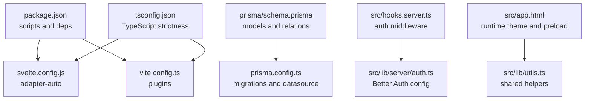
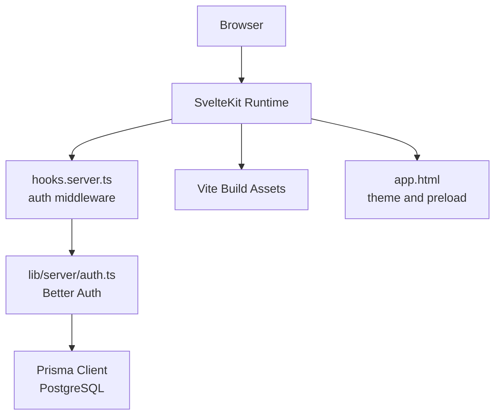
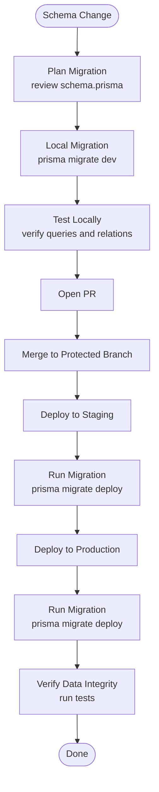
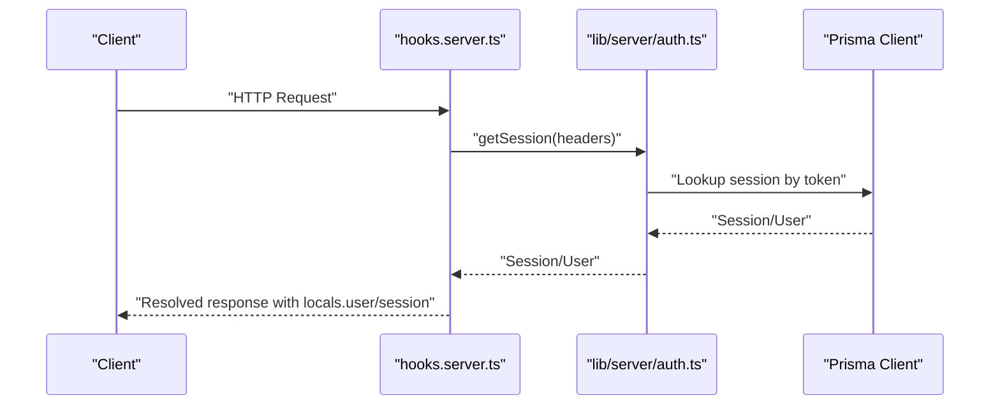
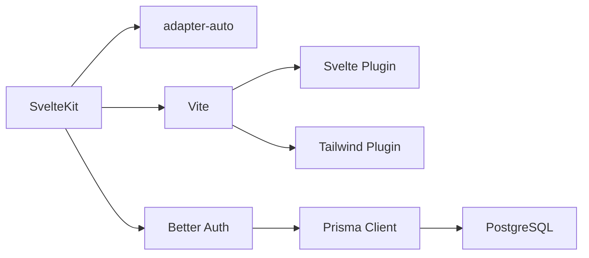

# Deployment & Configuration

<cite>
**Referenced Files in This Document**
- [package.json](file://package.json)
- [svelte.config.js](file://svelte.config.js)
- [vite.config.ts](file://vite.config.ts)
- [prisma/schema.prisma](file://prisma/schema.prisma)
- [prisma.config.ts](file://prisma.config.ts)
- [src/hooks.server.ts](file://src/hooks.server.ts)
- [src/lib/server/auth.ts](file://src/lib/server/auth.ts)
- [src/app.html](file://src/app.html)
- [tsconfig.json](file://tsconfig.json)
</cite>

## Table of Contents
1. [Introduction](#introduction)
2. [Project Structure](#project-structure)
3. [Core Components](#core-components)
4. [Architecture Overview](#architecture-overview)
5. [Detailed Component Analysis](#detailed-component-analysis)
6. [Dependency Analysis](#dependency-analysis)
7. [Performance Considerations](#performance-considerations)
8. [Troubleshooting Guide](#troubleshooting-guide)
9. [Conclusion](#conclusion)
10. [Appendices](#appendices)

## Introduction
This document provides production-focused deployment and configuration guidance for Screenlog. It covers SvelteKit adapter configuration, Vite build optimization, environment variable management, database migrations with Prisma, CI/CD considerations, performance tuning, monitoring, scaling, backups, disaster recovery, and troubleshooting. The goal is to enable reliable, scalable deployments across common hosting targets while maintaining strong security and operational hygiene.

## Project Structure
Screenlog is a SvelteKit 2 application using Svelte 5, Vite, and Prisma with a PostgreSQL data source. Authentication is powered by Better Auth with Prisma adapter. The repository includes:
- Application source under src/
- Build and adapter configuration via svelte.config.js and vite.config.ts
- Prisma schema and configuration for database modeling and migrations
- Environment-sensitive configuration for authentication and database connectivity
- Global app HTML template and shared utilities

**Diagram sources**
- [package.json:1-47](file://package.json#L1-L47)
- [svelte.config.js:1-18](file://svelte.config.js#L1-L18)
- [vite.config.ts:1-8](file://vite.config.ts#L1-L8)
- [prisma/schema.prisma:1-258](file://prisma/schema.prisma#L1-L258)
- [prisma.config.ts:1-15](file://prisma.config.ts#L1-L15)
- [src/hooks.server.ts:1-18](file://src/hooks.server.ts#L1-L18)
- [src/lib/server/auth.ts:1-27](file://src/lib/server/auth.ts#L1-L27)
- [src/app.html:1-25](file://src/app.html#L1-L25)
- [tsconfig.json:1-21](file://tsconfig.json#L1-L21)

**Section sources**
- [package.json:1-47](file://package.json#L1-L47)
- [svelte.config.js:1-18](file://svelte.config.js#L1-L18)
- [vite.config.ts:1-8](file://vite.config.ts#L1-L8)
- [prisma/schema.prisma:1-258](file://prisma/schema.prisma#L1-L258)
- [prisma.config.ts:1-15](file://prisma.config.ts#L1-L15)
- [src/hooks.server.ts:1-18](file://src/hooks.server.ts#L1-L18)
- [src/lib/server/auth.ts:1-27](file://src/lib/server/auth.ts#L1-L27)
- [src/app.html:1-25](file://src/app.html#L1-L25)
- [tsconfig.json:1-21](file://tsconfig.json#L1-L21)

## Core Components
- SvelteKit adapter configuration: Uses adapter-auto, which selects an appropriate adapter automatically. For production, review target compatibility and consider switching to a specific adapter if needed.
- Vite build configuration: Minimal setup with Tailwind and SvelteKit plugins; ensure production builds leverage Vite’s defaults and consider adding explicit build optimization flags for production.
- Prisma data model: Defines authentication, content, and user preference entities with relations and indexes. Migrations are managed via Prisma CLI and environment-driven datasource URL.
- Authentication: Better Auth configured with Prisma adapter, secret, base URL, session durations, trusted origins, and cookie prefix.
- Runtime environment: Authentication relies on private environment variables; database URL is sourced from environment variables.

**Section sources**
- [svelte.config.js:1-18](file://svelte.config.js#L1-L18)
- [vite.config.ts:1-8](file://vite.config.ts#L1-L8)
- [prisma/schema.prisma:1-258](file://prisma/schema.prisma#L1-L258)
- [prisma.config.ts:1-15](file://prisma.config.ts#L1-L15)
- [src/lib/server/auth.ts:1-27](file://src/lib/server/auth.ts#L1-L27)
- [src/hooks.server.ts:1-18](file://src/hooks.server.ts#L1-L18)

## Architecture Overview
The runtime architecture integrates client-side rendering with server-side authentication and database access. Requests pass through SvelteKit’s hooks to establish session context, which Better Auth resolves from cookies and headers.

**Diagram sources**
- [src/hooks.server.ts:1-18](file://src/hooks.server.ts#L1-L18)
- [src/lib/server/auth.ts:1-27](file://src/lib/server/auth.ts#L1-L27)
- [prisma/schema.prisma:1-258](file://prisma/schema.prisma#L1-L258)
- [src/app.html:1-25](file://src/app.html#L1-L25)

## Detailed Component Analysis

### SvelteKit Adapter Configuration
- Current setup: adapter-auto is used, which auto-selects an adapter based on the environment. Review the official adapter documentation to confirm compatibility for your target platform.
- Production recommendation: Pin to a specific adapter (e.g., adapter-static, adapter-netlify, adapter-vercel) to ensure deterministic behavior and optimal asset handling for your deployment target.

Operational implications:
- adapter-auto simplifies local development but may require manual overrides for serverless or static hosting.
- Ensure environment variables for base URLs and secrets are present during build and runtime.

**Section sources**
- [svelte.config.js:1-18](file://svelte.config.js#L1-L18)

### Vite Build Optimization
- Plugins: Tailwind and SvelteKit plugins are enabled. For production, consider adding:
  - Minification and chunk splitting via Vite defaults.
  - Asset hashing and long-term caching headers.
  - Pre-bundling and externalization strategies for large dependencies.
- TypeScript: Strict compiler options improve correctness; ensure bundler resolution aligns with moduleResolution.

Build lifecycle:
- Development: vite dev
- Production: vite build
- Preview: vite preview

**Section sources**
- [vite.config.ts:1-8](file://vite.config.ts#L1-L8)
- [package.json:7-14](file://package.json#L7-L14)
- [tsconfig.json:1-21](file://tsconfig.json#L1-L21)

### Environment Variable Management
Critical variables for authentication:
- BETTER_AUTH_SECRET: Cryptographic secret for signing sessions and tokens.
- BETTER_AUTH_URL: Base URL for Better Auth, used for trusted origins and redirects.
- DATABASE_URL: Connection string for PostgreSQL (via Prisma).

Guidelines:
- Store secrets in your platform’s secure secret storage.
- Keep BASE_URL aligned with deployed domain.
- Avoid committing secrets to version control; use environment injection at build/runtime.

**Section sources**
- [src/lib/server/auth.ts:4-4](file://src/lib/server/auth.ts#L4-L4)
- [prisma/schema.prisma:5-8](file://prisma/schema.prisma#L5-L8)
- [prisma.config.ts:11-14](file://prisma.config.ts#L11-L14)

### Database Migration Strategies
- Schema: Defined in Prisma schema with models for users, sessions, accounts, verification, content (shows/movies), progress, activity, and preferences.
- Migrations: Managed via Prisma CLI; migrations are stored under prisma/migrations and driven by DATABASE_URL.
- Recommended workflow:
  - Run prisma:migrate in CI/CD after schema changes.
  - Use prisma:generate to update client types after migrations.
  - Back up database before major migrations in production.

**Diagram sources**
- [prisma/schema.prisma:1-258](file://prisma/schema.prisma#L1-L258)
- [prisma.config.ts:8-10](file://prisma.config.ts#L8-L10)

**Section sources**
- [prisma/schema.prisma:1-258](file://prisma/schema.prisma#L1-L258)
- [prisma.config.ts:1-15](file://prisma.config.ts#L1-L15)

### Authentication Flow
Better Auth integrates with Prisma to manage sessions and user data. The server hook resolves session context for each request.

**Diagram sources**
- [src/hooks.server.ts:4-17](file://src/hooks.server.ts#L4-L17)
- [src/lib/server/auth.ts:6-24](file://src/lib/server/auth.ts#L6-L24)

**Section sources**
- [src/hooks.server.ts:1-18](file://src/hooks.server.ts#L1-L18)
- [src/lib/server/auth.ts:1-27](file://src/lib/server/auth.ts#L1-L27)

### Theme and Runtime Behavior
The global HTML template initializes theme selection from localStorage and applies a preload strategy for better perceived performance.

Key behaviors:
- Theme initialization based on user preference or system setting.
- Preload strategy for resources to reduce initial load latency.

**Section sources**
- [src/app.html:9-22](file://src/app.html#L9-L22)

## Dependency Analysis
- SvelteKit and adapter-auto: Determine deployment target capabilities.
- Prisma and Neon adapter: Postgres-compatible data access; ensure DATABASE_URL points to a supported endpoint.
- Better Auth: Centralized authentication with session management and trusted origins.
- Vite and plugins: Build-time integration for Svelte and Tailwind.

**Diagram sources**
- [package.json:15-45](file://package.json#L15-L45)
- [svelte.config.js:1-18](file://svelte.config.js#L1-L18)
- [vite.config.ts:1-8](file://vite.config.ts#L1-L8)
- [prisma/schema.prisma:1-258](file://prisma/schema.prisma#L1-L258)

**Section sources**
- [package.json:15-45](file://package.json#L15-L45)
- [svelte.config.js:1-18](file://svelte.config.js#L1-L18)
- [vite.config.ts:1-8](file://vite.config.ts#L1-L8)
- [prisma/schema.prisma:1-258](file://prisma/schema.prisma#L1-L258)

## Performance Considerations
- Build optimization
  - Enable minification and chunk splitting via Vite defaults for production builds.
  - Leverage long-term caching with asset hashing and cache headers.
  - Externalize large dependencies where appropriate.
- Runtime performance
  - Use preload strategies judiciously; ensure critical resources are prioritized.
  - Optimize database queries and indexes (as defined in schema).
  - Consider connection pooling and read replicas for PostgreSQL.
- Observability
  - Instrument server-side requests and database operations.
  - Track key metrics: response times, error rates, and resource utilization.

[No sources needed since this section provides general guidance]

## Troubleshooting Guide
Common deployment and configuration issues:

- Adapter compatibility
  - Symptom: Unexpected adapter behavior or build failures on target platform.
  - Action: Switch from adapter-auto to a specific adapter suited for your platform and redeploy.

- Authentication errors
  - Symptom: Login failures or session not persisting.
  - Checks:
    - Ensure BETTER_AUTH_SECRET and BETTER_AUTH_URL are set and consistent across environments.
    - Confirm trusted origins include your BASE_URL.
    - Verify cookies are not blocked by SameSite or CORS policies.

- Database connectivity
  - Symptom: Migration failures or connection errors.
  - Checks:
    - Confirm DATABASE_URL points to a reachable PostgreSQL endpoint.
    - Ensure Prisma migrations are applied before deploying new application code.
    - Validate credentials and network access in the target environment.

- Build failures
  - Symptom: Missing dependencies or TypeScript errors during build.
  - Checks:
    - Ensure all dependencies are installed and up to date.
    - Align moduleResolution with bundler expectations.
    - Verify Vite and Svelte plugin configurations match your deployment target.

**Section sources**
- [svelte.config.js:10-13](file://svelte.config.js#L10-L13)
- [src/lib/server/auth.ts:4-4](file://src/lib/server/auth.ts#L4-L4)
- [prisma/schema.prisma:5-8](file://prisma/schema.prisma#L5-L8)
- [prisma.config.ts:11-14](file://prisma.config.ts#L11-L14)
- [package.json:7-14](file://package.json#L7-L14)
- [tsconfig.json:13-13](file://tsconfig.json#L13-L13)
- [vite.config.ts:5-7](file://vite.config.ts#L5-L7)

## Conclusion
Screenlog’s current configuration provides a solid foundation for production deployment. By pinning to a specific adapter, securing environment variables, automating Prisma migrations, and optimizing builds and runtime behavior, teams can achieve reliable, scalable, and observable deployments across diverse hosting targets. Adopt robust CI/CD practices, monitoring, and disaster recovery procedures to maintain high availability and data integrity.

[No sources needed since this section summarizes without analyzing specific files]

## Appendices

### CI/CD Pipeline Setup (Recommended)
- Build stage
  - Install dependencies and run TypeScript checks.
  - Execute Vite build for production assets.
- Test stage
  - Run unit and integration tests against a test database.
- Deploy stage
  - Apply Prisma migrations safely (preferably with a maintenance window).
  - Deploy application code and assets.
  - Verify health endpoints and basic functionality.

[No sources needed since this section provides general guidance]

### Scaling Considerations
- Horizontal scaling
  - Stateless application servers; persist sessions via database.
  - Use load balancers and autoscaling groups.
- Database scaling
  - Implement read replicas and connection pooling.
  - Consider partitioning or sharding for large datasets.
- Caching
  - Add CDN and caching layers for static assets and API responses.

[No sources needed since this section provides general guidance]

### Backup and Disaster Recovery
- Database backups
  - Schedule regular logical backups of PostgreSQL.
  - Test restoration procedures periodically.
- Secrets rotation
  - Rotate BETTER_AUTH_SECRET and reissue sessions as needed.
- Recovery plan
  - Document rollback procedures and RTO/RPO targets.
  - Automate remediation steps where possible.

[No sources needed since this section provides general guidance]