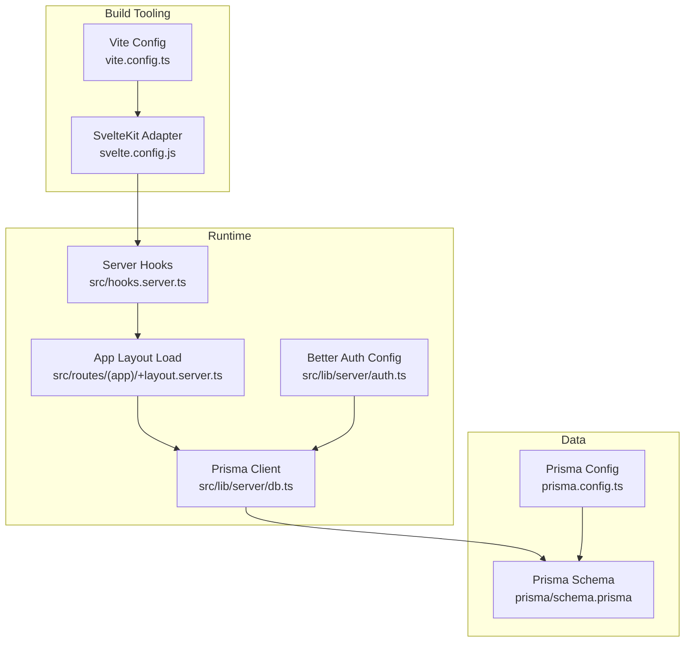
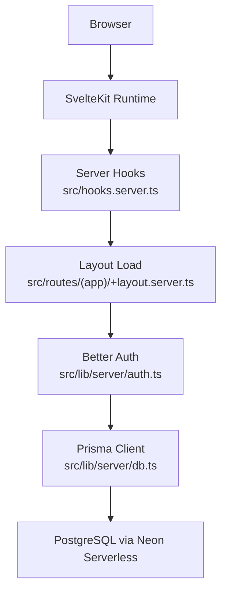
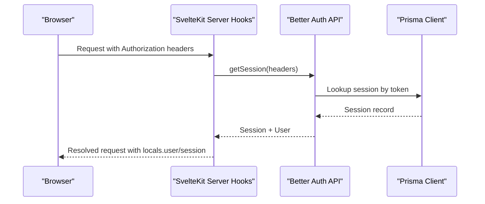
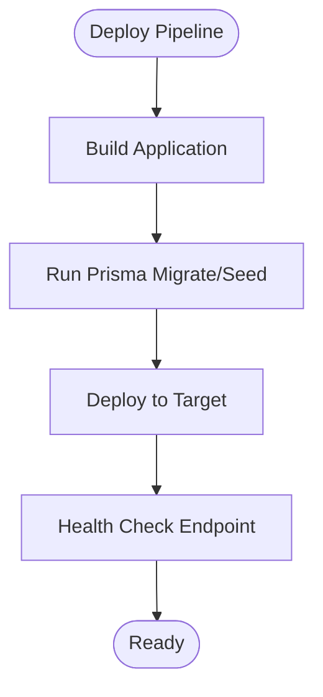
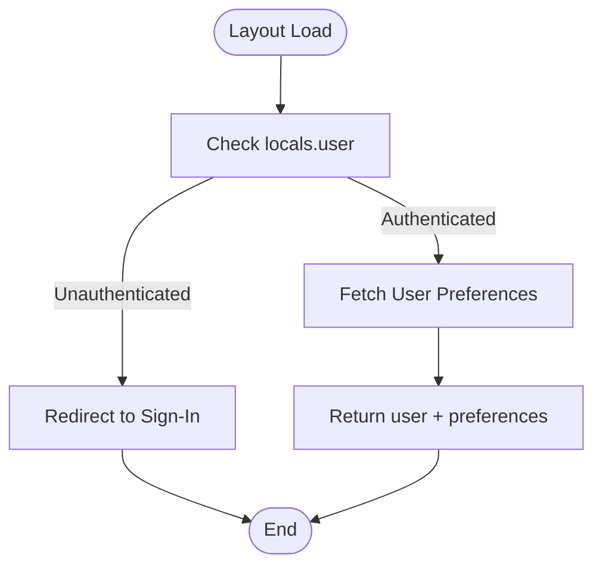
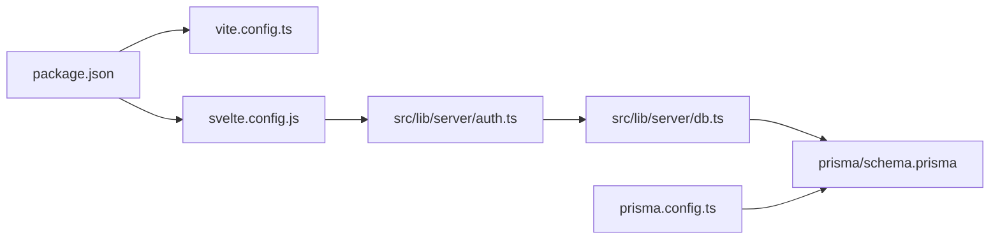

# Deployment Strategies

<cite>
**Referenced Files in This Document**
- [package.json](file://package.json)
- [svelte.config.js](file://svelte.config.js)
- [vite.config.ts](file://vite.config.ts)
- [prisma/schema.prisma](file://prisma/schema.prisma)
- [prisma.config.ts](file://prisma.config.ts)
- [src/lib/server/db.ts](file://src/lib/server/db.ts)
- [src/lib/server/auth.ts](file://src/lib/server/auth.ts)
- [src/hooks.server.ts](file://src/hooks.server.ts)
- [src/routes/(app)/+layout.server.ts](file://src/routes/(app)/+layout.server.ts)
- [src/app.html](file://src/app.html)
</cite>

## Table of Contents
1. [Introduction](#introduction)
2. [Project Structure](#project-structure)
3. [Core Components](#core-components)
4. [Architecture Overview](#architecture-overview)
5. [Detailed Component Analysis](#detailed-component-analysis)
6. [Dependency Analysis](#dependency-analysis)
7. [Performance Considerations](#performance-considerations)
8. [Troubleshooting Guide](#troubleshooting-guide)
9. [Conclusion](#conclusion)
10. [Appendices](#appendices)

## Introduction
This document provides a production-focused deployment strategy for Screenlog, covering platform targets (Vercel, Netlify, and custom servers), adapter selection for serverless versus traditional environments, CI/CD pipeline setup, automated testing, deployment automation, rollback and blue-green strategies, monitoring and health checks, and deployment validation procedures. It synthesizes configuration and runtime behavior from the repository to guide safe, repeatable, and observable deployments.

## Project Structure
Screenlog is a SvelteKit v2 application configured with adapter-auto, Vite, and Prisma. Authentication is powered by Better Auth with a Prisma adapter. Database connectivity is configured via environment variables and a Prisma client singleton. The application enforces authentication at the layout level and uses a dark theme by default with a theme preference stored locally.

**Diagram sources**
- [vite.config.ts:1-8](file://vite.config.ts#L1-L8)
- [svelte.config.js:1-18](file://svelte.config.js#L1-L18)
- [src/hooks.server.ts:1-18](file://src/hooks.server.ts#L1-L18)
- [src/routes/(app)/+layout.server.ts:1-17](file://src/routes/(app)/+layout.server.ts#L1-L17)
- [src/lib/server/auth.ts:1-26](file://src/lib/server/auth.ts#L1-L26)
- [src/lib/server/db.ts:1-11](file://src/lib/server/db.ts#L1-L11)
- [prisma/schema.prisma:1-258](file://prisma/schema.prisma#L1-L258)
- [prisma.config.ts:1-15](file://prisma.config.ts#L1-L15)

**Section sources**
- [package.json:1-47](file://package.json#L1-L47)
- [svelte.config.js:1-18](file://svelte.config.js#L1-L18)
- [vite.config.ts:1-8](file://vite.config.ts#L1-L8)
- [prisma/schema.prisma:1-258](file://prisma/schema.prisma#L1-L258)
- [prisma.config.ts:1-15](file://prisma.config.ts#L1-L15)
- [src/lib/server/db.ts:1-11](file://src/lib/server/db.ts#L1-L11)
- [src/lib/server/auth.ts:1-26](file://src/lib/server/auth.ts#L1-L26)
- [src/hooks.server.ts:1-18](file://src/hooks.server.ts#L1-L18)
- [src/routes/(app)/+layout.server.ts:1-17](file://src/routes/(app)/+layout.server.ts#L1-L17)
- [src/app.html:1-25](file://src/app.html#L1-L25)

## Core Components
- Build and adapter configuration: SvelteKit adapter-auto enables platform-agnostic builds; platform-specific adapters can be selected later for explicit serverless or custom server targets.
- Runtime hooks: Server-side hooks integrate Better Auth session retrieval and attach user/session to request locals.
- Authentication: Better Auth with Prisma adapter, configured via private environment variables for secret and base URL, and session caching strategy.
- Database: Prisma client singleton pattern with environment-driven datasource URL; schema defines relational models and enums.
- Theme and UI: Default dark theme with local preference persistence.

**Section sources**
- [svelte.config.js:1-18](file://svelte.config.js#L1-L18)
- [src/hooks.server.ts:1-18](file://src/hooks.server.ts#L1-L18)
- [src/lib/server/auth.ts:1-26](file://src/lib/server/auth.ts#L1-L26)
- [src/lib/server/db.ts:1-11](file://src/lib/server/db.ts#L1-L11)
- [prisma/schema.prisma:1-258](file://prisma/schema.prisma#L1-L258)
- [src/app.html:1-25](file://src/app.html#L1-L25)

## Architecture Overview
The runtime architecture ties together client-side rendering, server hooks, API routes, and database access. Authentication is enforced at the application layout level, ensuring protected routes.

**Diagram sources**
- [src/hooks.server.ts:1-18](file://src/hooks.server.ts#L1-L18)
- [src/routes/(app)/+layout.server.ts:1-17](file://src/routes/(app)/+layout.server.ts#L1-L17)
- [src/lib/server/auth.ts:1-26](file://src/lib/server/auth.ts#L1-L26)
- [src/lib/server/db.ts:1-11](file://src/lib/server/db.ts#L1-L11)
- [prisma/schema.prisma:1-258](file://prisma/schema.prisma#L1-L258)

## Detailed Component Analysis

### Adapter Selection and Serverless Considerations
- Current adapter: adapter-auto is configured, which selects an appropriate adapter at build time. For production, choose a specific adapter for deterministic behavior:
  - Vercel: use the official SvelteKit adapter for Vercel to leverage serverless functions and edge capabilities.
  - Netlify: use the official SvelteKit adapter for Netlify to target Functions and Edge.
  - Custom server: use the Node adapter for traditional server deployments.
- Serverless constraints:
  - Stateful sessions require external secondary storage (e.g., Redis) or database-backed sessions to avoid cold-start penalties.
  - File system writes are not persistent; ensure all state is stored remotely.
  - Cold starts: minimize initialization cost by avoiding heavy synchronous work during module load.
- Recommendations:
  - For Vercel/Netlify serverless: keep Better Auth session caching in cookies and rely on database sessions; configure rate limiting storage to use database or secondary storage.
  - For custom servers: Node adapter allows filesystem writes and long-lived connections; consider enabling background tasks and persistent sessions.

**Section sources**
- [svelte.config.js:1-18](file://svelte.config.js#L1-L18)
- [src/lib/server/auth.ts:1-26](file://src/lib/server/auth.ts#L1-L26)

### Authentication and Session Strategy
- Secret and base URL are sourced from private environment variables.
- Session expiration and refresh intervals are configured; cookie caching strategy can be tuned for serverless environments.
- Trusted origins are set to the base URL to enforce CSRF protections and callback safety.
- For serverless, prefer cookie caching with compact or JWE strategies and ensure secondary storage for rate limiting and session persistence.

**Diagram sources**
- [src/hooks.server.ts:1-18](file://src/hooks.server.ts#L1-L18)
- [src/lib/server/auth.ts:1-26](file://src/lib/server/auth.ts#L1-L26)
- [src/lib/server/db.ts:1-11](file://src/lib/server/db.ts#L1-L11)

**Section sources**
- [src/lib/server/auth.ts:1-26](file://src/lib/server/auth.ts#L1-L26)
- [src/hooks.server.ts:1-18](file://src/hooks.server.ts#L1-L18)

### Database Connectivity and Migrations
- Datasource URL is sourced from an environment variable and loaded via Prisma config.
- The Prisma client is initialized as a singleton to avoid multiple connections and to support development hot-reload safely.
- Migrations are managed through Prisma; ensure migration steps are part of CI/CD to apply schema changes before deploying application code.

**Diagram sources**
- [prisma.config.ts:1-15](file://prisma.config.ts#L1-L15)
- [prisma/schema.prisma:1-258](file://prisma/schema.prisma#L1-L258)
- [src/lib/server/db.ts:1-11](file://src/lib/server/db.ts#L1-L11)

**Section sources**
- [prisma.config.ts:1-15](file://prisma.config.ts#L1-L15)
- [prisma/schema.prisma:1-258](file://prisma/schema.prisma#L1-L258)
- [src/lib/server/db.ts:1-11](file://src/lib/server/db.ts#L1-L11)

### Protected Routes and Layout Load
- The application layout enforces authentication by redirecting unauthenticated users to the sign-in page.
- Preferences are fetched for authenticated users and returned to the client.

**Diagram sources**
- [src/routes/(app)/+layout.server.ts:1-17](file://src/routes/(app)/+layout.server.ts#L1-L17)

**Section sources**
- [src/routes/(app)/+layout.server.ts:1-17](file://src/routes/(app)/+layout.server.ts#L1-L17)

### Theme and Client Rendering
- The HTML template initializes theme preference from local storage and applies a dark theme by default.
- Client-side rendering remains unaffected by server-side authentication enforcement.

**Section sources**
- [src/app.html:1-25](file://src/app.html#L1-L25)

## Dependency Analysis
- Build-time dependencies: Vite, SvelteKit, adapter-auto, TypeScript tooling.
- Runtime dependencies: Better Auth with Prisma adapter, Prisma client, Neon serverless driver, Tailwind CSS.
- Database dependency: PostgreSQL via Neon serverless; environment variable controls connection URL.

**Diagram sources**
- [package.json:1-47](file://package.json#L1-L47)
- [vite.config.ts:1-8](file://vite.config.ts#L1-L8)
- [svelte.config.js:1-18](file://svelte.config.js#L1-L18)
- [src/lib/server/auth.ts:1-26](file://src/lib/server/auth.ts#L1-L26)
- [src/lib/server/db.ts:1-11](file://src/lib/server/db.ts#L1-L11)
- [prisma/schema.prisma:1-258](file://prisma/schema.prisma#L1-L258)
- [prisma.config.ts:1-15](file://prisma.config.ts#L1-L15)

**Section sources**
- [package.json:1-47](file://package.json#L1-L47)
- [svelte.config.js:1-18](file://svelte.config.js#L1-L18)
- [vite.config.ts:1-8](file://vite.config.ts#L1-L8)
- [src/lib/server/auth.ts:1-26](file://src/lib/server/auth.ts#L1-L26)
- [src/lib/server/db.ts:1-11](file://src/lib/server/db.ts#L1-L11)
- [prisma/schema.prisma:1-258](file://prisma/schema.prisma#L1-L258)
- [prisma.config.ts:1-15](file://prisma.config.ts#L1-L15)

## Performance Considerations
- Serverless cold starts: Minimize initialization cost; avoid synchronous heavy work in module scope.
- Database connections: Leverage the Prisma singleton to reuse connections; ensure connection pooling is configured appropriately for the platform.
- Authentication caching: Use cookie caching for sessions in serverless; offload rate limiting to secondary storage or database.
- Asset optimization: Tailwind CSS is integrated via Vite; ensure production builds optimize CSS and JS bundles.

[No sources needed since this section provides general guidance]

## Troubleshooting Guide
- Authentication failures:
  - Verify Better Auth secret and base URL environment variables are set and consistent across environments.
  - Confirm trusted origins include the application’s base URL and any preview domains.
- Database connectivity:
  - Ensure DATABASE_URL is present and reachable; test connectivity outside the app (e.g., psql) to isolate environment issues.
  - Confirm Prisma migrations have been applied before deployment.
- Session issues in serverless:
  - If sessions expire unexpectedly, review cookie cache strategy and session TTL settings.
  - Ensure secondary storage (e.g., Redis) is configured for rate limiting and session persistence if required by the platform.
- Layout redirects:
  - Unauthenticated users are redirected to sign-in; confirm that redirect logic and protected routes behave as expected.

**Section sources**
- [src/lib/server/auth.ts:1-26](file://src/lib/server/auth.ts#L1-L26)
- [prisma.config.ts:1-15](file://prisma.config.ts#L1-L15)
- [prisma/schema.prisma:1-258](file://prisma/schema.prisma#L1-L258)
- [src/routes/(app)/+layout.server.ts:1-17](file://src/routes/(app)/+layout.server.ts#L1-L17)

## Conclusion
Screenlog’s deployment strategy should align adapter selection with the chosen platform, enforce authentication at the layout level, and ensure database migrations precede deployments. For serverless platforms, adopt cookie-cached sessions and database-backed rate limiting; for custom servers, leverage persistent sessions and background tasks. CI/CD should automate testing, migrations, and deployment with health checks and rollback procedures.

[No sources needed since this section summarizes without analyzing specific files]

## Appendices

### CI/CD Pipeline Setup
- Build and Test:
  - Use the project’s build script to compile the application.
  - Run type checking and linting as part of CI.
- Database:
  - Apply Prisma migrations and seeds before deploying application code.
- Deploy:
  - For Vercel/Netlify: configure platform-specific adapter and environment variables.
  - For custom servers: deploy using the Node adapter and ensure environment variables are set.
- Rollback and Blue-Green:
  - Maintain multiple deployment slots; swap traffic after validating health checks.
  - Keep previous artifacts for quick rollback.
- Monitoring and Health Checks:
  - Expose a health endpoint returning application and database connectivity status.
  - Monitor error rates, latency, and session availability.
- Validation:
  - Smoke tests: verify sign-in, protected route access, and basic CRUD flows.
  - Post-deploy checks: run database migration verification and session persistence tests.

[No sources needed since this section provides general guidance]