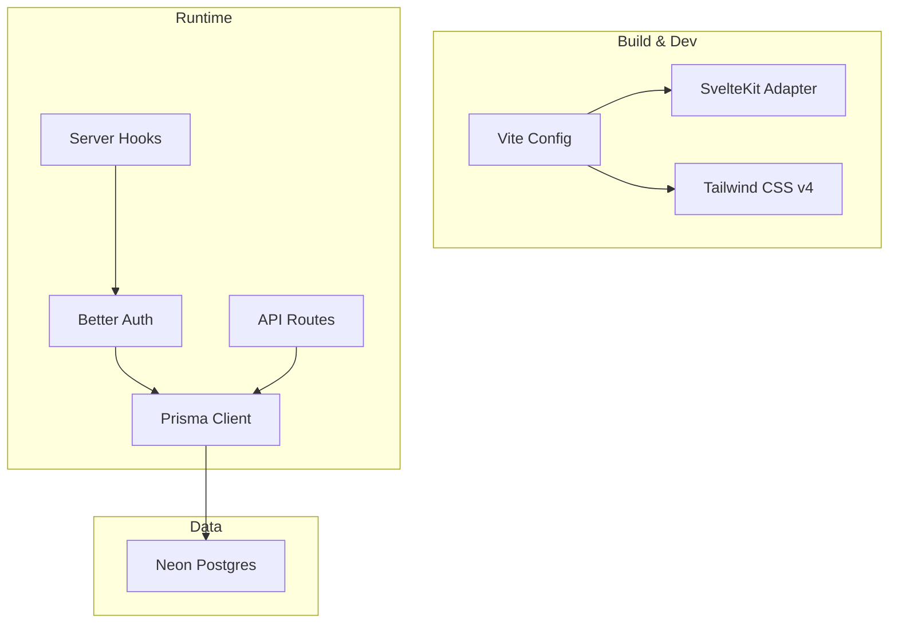
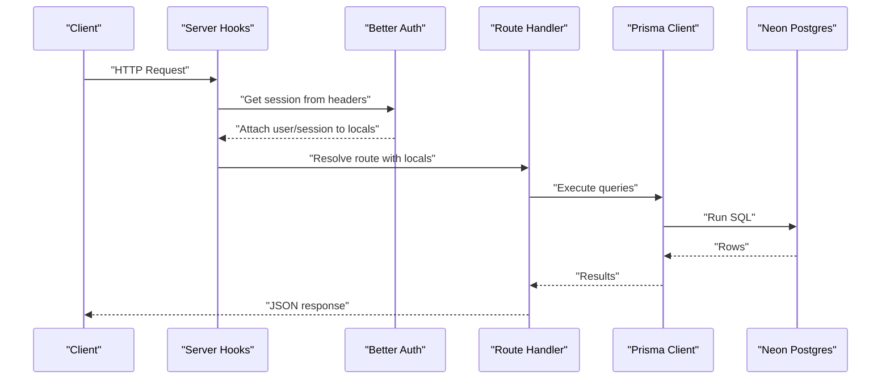
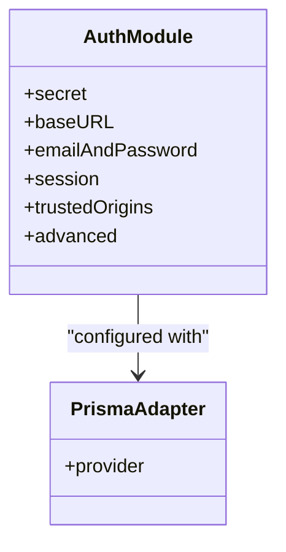
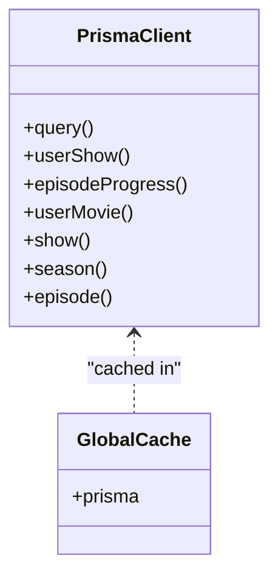
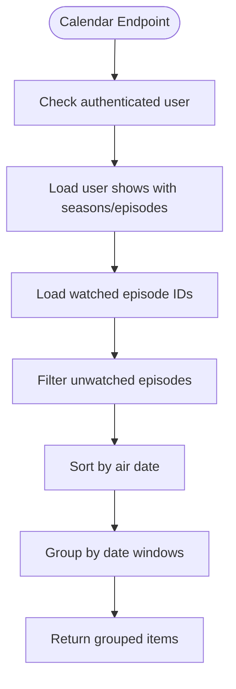
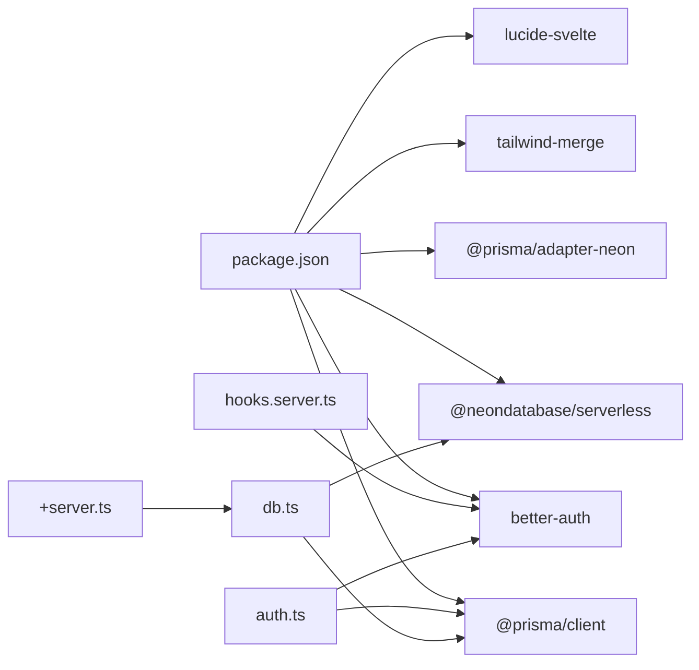

# Performance & Monitoring

<cite>
**Referenced Files in This Document**
- [package.json](file://package.json)
- [vite.config.ts](file://vite.config.ts)
- [svelte.config.js](file://svelte.config.js)
- [src/hooks.server.ts](file://src/hooks.server.ts)
- [src/lib/server/auth.ts](file://src/lib/server/auth.ts)
- [src/lib/server/db.ts](file://src/lib/server/db.ts)
- [src/lib/utils.ts](file://src/lib/utils.ts)
- [src/app.html](file://src/app.html)
- [src/app.d.ts](file://src/app.d.ts)
- [src/routes/api/auth/[...all]/+server.ts](file://src/routes/api/auth/[...all]/+server.ts)
- [src/routes/api/calendar/+server.ts](file://src/routes/api/calendar/+server.ts)
- [src/routes/api/discover/+server.ts](file://src/routes/api/discover/+server.ts)
- [src/routes/api/search/+server.ts](file://src/routes/api/search/+server.ts)
- [src/routes/api/profile/+server.ts](file://src/routes/api/profile/+server.ts)
- [prisma/schema.prisma](file://prisma/schema.prisma)
</cite>

## Table of Contents
1. [Introduction](#introduction)
2. [Project Structure](#project-structure)
3. [Core Components](#core-components)
4. [Architecture Overview](#architecture-overview)
5. [Detailed Component Analysis](#detailed-component-analysis)
6. [Dependency Analysis](#dependency-analysis)
7. [Performance Considerations](#performance-considerations)
8. [Troubleshooting Guide](#troubleshooting-guide)
9. [Conclusion](#conclusion)
10. [Appendices](#appendices)

## Introduction
This document provides comprehensive performance and monitoring guidance for Screenlog. It focuses on application performance optimization, operational monitoring, database performance tuning, caching strategies, CDN configuration, asset optimization, error tracking, log aggregation, alerting, performance budgeting, load testing, capacity planning, dashboarding, profiling, and troubleshooting common performance issues. The guidance is grounded in the repository’s current architecture and codebase.

## Project Structure
Screenlog is a SvelteKit application built with Vite, using Prisma for data access and Neon Postgres via the serverless driver. Authentication is handled by Better Auth with Prisma adapter. The runtime stack includes:
- Build tooling: Vite and SvelteKit
- UI framework: Svelte 5 with Tailwind CSS v4
- Backend runtime: Node.js (server-side)
- Data access: Prisma Client with Neon Postgres adapter
- Authentication: Better Auth with session management



**Diagram sources**
- [vite.config.ts:1-8](file://vite.config.ts#L1-L8)
- [svelte.config.js:1-18](file://svelte.config.js#L1-L18)
- [src/hooks.server.ts:1-18](file://src/hooks.server.ts#L1-L18)
- [src/lib/server/auth.ts:1-27](file://src/lib/server/auth.ts#L1-L27)
- [src/lib/server/db.ts:1-11](file://src/lib/server/db.ts#L1-L11)
- [prisma/schema.prisma:1-258](file://prisma/schema.prisma#L1-L258)

**Section sources**
- [package.json:1-47](file://package.json#L1-L47)
- [vite.config.ts:1-8](file://vite.config.ts#L1-L8)
- [svelte.config.js:1-18](file://svelte.config.js#L1-L18)
- [src/app.html:1-25](file://src/app.html#L1-L25)

## Core Components
- Server hooks: Extract Better Auth session and attach user/session to locals for downstream handlers.
- Authentication: Better Auth configured with Prisma adapter, PostgreSQL provider, session TTL, and trusted origins.
- Database: Prisma Client singleton pattern with global reference to avoid multiple clients.
- API routes: Calendar, Discover, Search, Profile, and Auth endpoints; most require authenticated users.
- Utilities: Formatting helpers for dates, runtime, posters/backdrops, and timezone support.

**Section sources**
- [src/hooks.server.ts:1-18](file://src/hooks.server.ts#L1-L18)
- [src/lib/server/auth.ts:1-27](file://src/lib/server/auth.ts#L1-L27)
- [src/lib/server/db.ts:1-11](file://src/lib/server/db.ts#L1-L11)
- [src/routes/api/calendar/+server.ts:1-82](file://src/routes/api/calendar/+server.ts#L1-L82)
- [src/routes/api/discover/+server.ts:1-21](file://src/routes/api/discover/+server.ts#L1-L21)
- [src/routes/api/search/+server.ts:1-16](file://src/routes/api/search/+server.ts#L1-L16)
- [src/routes/api/profile/+server.ts:1-66](file://src/routes/api/profile/+server.ts#L1-L66)
- [src/lib/utils.ts:1-82](file://src/lib/utils.ts#L1-L82)

## Architecture Overview
The runtime flow for authenticated requests:
- Incoming request enters SvelteKit server hooks.
- Better Auth retrieves session from headers and attaches user/session to locals.
- Route handlers validate presence of user and delegate to database or external services.
- Prisma Client executes queries against Neon Postgres.



**Diagram sources**
- [src/hooks.server.ts:1-18](file://src/hooks.server.ts#L1-L18)
- [src/lib/server/auth.ts:1-27](file://src/lib/server/auth.ts#L1-L27)
- [src/lib/server/db.ts:1-11](file://src/lib/server/db.ts#L1-L11)
- [prisma/schema.prisma:1-258](file://prisma/schema.prisma#L1-L258)

## Detailed Component Analysis

### Authentication and Session Handling
- Session retrieval occurs on every request via server hooks.
- Better Auth uses Prisma adapter with PostgreSQL provider and defines session expiration and update age.
- Cookie prefix is set for isolation.



**Diagram sources**
- [src/lib/server/auth.ts:1-27](file://src/lib/server/auth.ts#L1-L27)

**Section sources**
- [src/hooks.server.ts:1-18](file://src/hooks.server.ts#L1-L18)
- [src/lib/server/auth.ts:1-27](file://src/lib/server/auth.ts#L1-L27)
- [src/app.d.ts:1-23](file://src/app.d.ts#L1-L23)

### Database Access and Prisma Client
- Singleton Prisma Client initialized once and cached in a global variable during development.
- Neon Postgres adapter is used via Prisma client.



**Diagram sources**
- [src/lib/server/db.ts:1-11](file://src/lib/server/db.ts#L1-L11)

**Section sources**
- [src/lib/server/db.ts:1-11](file://src/lib/server/db.ts#L1-L11)
- [prisma/schema.prisma:1-258](file://prisma/schema.prisma#L1-L258)

### API Endpoints and Performance Implications
- Calendar endpoint: Aggregates user shows, seasons, episodes, and watched progress; sorts and groups episodes by date windows.
- Discover endpoint: Concurrently fetches trending/popular/top-rated content from TMDB service.
- Search endpoint: Delegates to TMDB multi-search with minimal processing.
- Profile endpoint: Computes counts, aggregates watch time from episodes/movies, and computes top genres.



**Diagram sources**
- [src/routes/api/calendar/+server.ts:1-82](file://src/routes/api/calendar/+server.ts#L1-L82)

**Section sources**
- [src/routes/api/calendar/+server.ts:1-82](file://src/routes/api/calendar/+server.ts#L1-L82)
- [src/routes/api/discover/+server.ts:1-21](file://src/routes/api/discover/+server.ts#L1-L21)
- [src/routes/api/search/+server.ts:1-16](file://src/routes/api/search/+server.ts#L1-L16)
- [src/routes/api/profile/+server.ts:1-66](file://src/routes/api/profile/+server.ts#L1-L66)

### Data Model and Indexing
- Entities include User, Session, Account, Verification, Show, Season, Episode, UserShow, UserMovie, EpisodeProgress, Activity, and UserPreference.
- Indexes include a composite index on Activity(userId, createdAt).
- Enums for ShowStatus and MovieStatus are defined.

```mermaid
erDiagram
USER {
string id PK
string email UK
string name
datetime createdAt
datetime updatedAt
}
SESSION {
string id PK
string userId FK
datetime expiresAt
string token UK
datetime createdAt
datetime updatedAt
}
ACCOUNT {
string id PK
string userId FK
string providerId
string accountId
datetime createdAt
datetime updatedAt
}
SHOW {
string id PK
int tmdbId UK
string title
string[] genres
datetime createdAt
datetime updatedAt
}
SEASON {
string id PK
string showId FK
int seasonNumber
datetime createdAt
datetime updatedAt
}
EPISODE {
string id PK
string seasonId FK
int episodeNumber
int seasonNumber
datetime createdAt
datetime updatedAt
}
USER_SHOW {
string id PK
string userId FK
string showId FK
enum status
datetime addedAt
datetime updatedAt
}
USER_MOVIE {
string id PK
string userId FK
string movieId FK
enum status
datetime addedAt
datetime updatedAt
}
EPISODE_PROGRESS {
string id PK
string userId FK
string episodeId FK
datetime watchedAt
datetime updatedAt
}
ACTIVITY {
string id PK
string userId FK
string type
string metadata
datetime createdAt
}
USER_PREFERENCE {
string id PK
string userId UK FK
string theme
string language
string timezone
datetime createdAt
datetime updatedAt
}
USER ||--o{ SESSION : "has"
USER ||--o{ ACCOUNT : "has"
USER ||--o{ USER_SHOW : "tracks"
USER ||--o{ USER_MOVIE : "owns"
USER ||--o{ EPISODE_PROGRESS : "progress"
USER ||--o{ ACTIVITY : "generates"
USER ||--|| USER_PREFERENCE : "has"
SHOW ||--o{ SEASON : "contains"
SEASON ||--o{ EPISODE : "contains"
SHOW ||--o{ USER_SHOW : "tracked_by"
EPISODE ||--o{ EPISODE_PROGRESS : "watched_by"
```

**Diagram sources**
- [prisma/schema.prisma:1-258](file://prisma/schema.prisma#L1-L258)

**Section sources**
- [prisma/schema.prisma:1-258](file://prisma/schema.prisma#L1-L258)

## Dependency Analysis
- Build-time dependencies: Vite, SvelteKit, Tailwind CSS v4, TypeScript.
- Runtime dependencies: Better Auth, Prisma client, Neon serverless adapter, bcrypt, lucide-svelte, ws, zod.
- Server hooks depend on Better Auth; API routes depend on Prisma Client; UI relies on Svelte and Tailwind.



**Diagram sources**
- [package.json:1-47](file://package.json#L1-L47)
- [src/hooks.server.ts:1-18](file://src/hooks.server.ts#L1-L18)
- [src/lib/server/auth.ts:1-27](file://src/lib/server/auth.ts#L1-L27)
- [src/lib/server/db.ts:1-11](file://src/lib/server/db.ts#L1-L11)

**Section sources**
- [package.json:1-47](file://package.json#L1-L47)

## Performance Considerations

### Application Performance Optimization
- Minimize per-request work in server hooks. Session retrieval is synchronous; keep middleware lightweight.
- Prefer concurrent operations in route handlers where appropriate (already used in Discover endpoint).
- Avoid N+1 queries by leveraging Prisma includes judiciously; review nested includes in Calendar and Profile endpoints.
- Use pagination for large lists; consider cursor-based pagination for Discover/Search results.
- Cache frequently accessed data in memory for short-lived processes (development) or use a cache layer in production.

### Operational Monitoring Setup
- Instrument route handlers to capture request duration, user ID, endpoint path, and status code.
- Log structured errors with correlation IDs and user context.
- Export metrics to a monitoring backend (Prometheus/OpenTelemetry) and dashboards (Grafana).

### Database Performance Optimization
- Leverage existing indexes (e.g., Activity composite index on (userId, createdAt)).
- Add missing indexes for frequent filters and joins (e.g., EpisodeProgress(userId, episodeId), UserMovie(userId, status), UserShow(userId, status)).
- Use Prisma’s select/include carefully to reduce payload sizes.
- Batch writes for progress updates and activity logging.
- Monitor slow queries and query plans via Neon’s observability tools.

### Caching Strategies
- HTTP caching: Add ETags/Last-Modified headers for immutable resources; leverage Vercel/Cloudflare caching for public pages.
- In-memory caching: Cache TMDB responses for trending/popular/top-rated content with TTL.
- CDN caching: Serve images via CDN; configure cache-control headers for posters/backdrops.
- Browser caching: Use long-term caching for static assets; invalidate on versioned builds.

### CDN Configuration and Asset Optimization
- Configure CDN for static assets and media URLs returned by utilities (posters/backdrops).
- Optimize images: Use modern formats (AVIF/WebP), responsive sizes, and lazy loading.
- Compress assets: Enable gzip/Brotli compression at the edge.
- Minimize render-blocking resources: Defer non-critical CSS/JS; preload critical fonts/icons.

### Error Tracking, Log Aggregation, and Alerting
- Centralize logs with structured JSON; ship to a log aggregation platform (e.g., Loki, Elasticsearch).
- Integrate error tracking (e.g., Sentry) to capture unhandled exceptions and performance regressions.
- Set up alerts for error rates, latency P95/P99, database query timeouts, and cache miss ratios.

### Performance Budgeting, Load Testing, and Capacity Planning
- Define budgets: Max page weight, TTFB, LCP, FID, CLS thresholds.
- Run load tests simulating concurrent users performing key journeys (discover, search, calendar).
- Plan capacity: Scale compute and database connections; monitor CPU/memory/disk on hosting platform.

### Monitoring Dashboards and Profiling
- Dashboards: Track RPS, latency, error rate, database utilization, cache hit ratio, and CDN metrics.
- Profiling: Use CPU/heap profilers during builds and runtime; instrument hotspots in route handlers and database queries.

### Troubleshooting Common Performance Issues
- High latency in Calendar: Review sorting/grouping logic and consider precomputing date keys; offload grouping to database if feasible.
- Heavy Profile queries: Pre-aggregate metrics or materialize summaries; avoid repeated scans of large tables.
- Auth overhead: Ensure session retrieval is efficient; avoid redundant session checks.
- Database bottlenecks: Add indexes, optimize queries, and consider read replicas for reporting-like queries.

[No sources needed since this section provides general guidance]

## Troubleshooting Guide
- Unauthorized responses: Verify server hooks attach user/session to locals; check Better Auth cookie presence and trusted origins.
- Database errors: Wrap route handlers with centralized error handling; return structured error payloads; log stack traces with correlation IDs.
- Slow endpoints: Add timing instrumentation around Prisma queries and external service calls; identify hotspots via profiling.
- Asset delivery issues: Confirm CDN configuration and cache-control headers; test fallbacks for posters/backdrops.

**Section sources**
- [src/hooks.server.ts:1-18](file://src/hooks.server.ts#L1-L18)
- [src/lib/server/auth.ts:1-27](file://src/lib/server/auth.ts#L1-L27)
- [src/routes/api/calendar/+server.ts:1-82](file://src/routes/api/calendar/+server.ts#L1-L82)
- [src/routes/api/profile/+server.ts:1-66](file://src/routes/api/profile/+server.ts#L1-L66)

## Conclusion
Screenlog’s architecture provides a solid foundation for performance and monitoring. By focusing on efficient database indexing, judicious use of includes, concurrent operations, caching strategies, CDN optimization, and robust error tracking/log aggregation, the application can achieve strong performance and reliability. Implementing monitoring dashboards, profiling, and load testing will enable continuous improvement and informed capacity planning.

[No sources needed since this section summarizes without analyzing specific files]

## Appendices

### Build and Runtime Configuration References
- Build plugins and adapter configuration.
- Environment-specific settings and secrets.

**Section sources**
- [vite.config.ts:1-8](file://vite.config.ts#L1-L8)
- [svelte.config.js:1-18](file://svelte.config.js#L1-L18)
- [src/app.html:1-25](file://src/app.html#L1-L25)