# API Endpoint Development

<cite>
**Referenced Files in This Document**
- [src/routes/api/calendar/+server.ts](file://src/routes/api/calendar/+server.ts)
- [src/routes/api/discover/+server.ts](file://src/routes/api/discover/+server.ts)
- [src/routes/api/movies/[id]/+server.ts](file://src/routes/api/movies/[id]/+server.ts)
- [src/routes/api/profile/+server.ts](file://src/routes/api/profile/+server.ts)
- [src/routes/api/search/+server.ts](file://src/routes/api/search/+server.ts)
- [src/routes/api/shows/[id]/+server.ts](file://src/routes/api/shows/[id]/+server.ts)
- [src/routes/api/watchlist/+server.ts](file://src/routes/api/watchlist/+server.ts)
- [src/routes/api/progress/+server.ts](file://src/routes/api/progress/+server.ts)
- [src/routes/api/settings/+server.ts](file://src/routes/api/settings/+server.ts)
- [src/routes/api/lookup/+server.ts](file://src/routes/api/lookup/+server.ts)
- [src/routes/api/auth/[...all]/+server.ts](file://src/routes/api/auth/[...all]/+server.ts)
- [src/hooks.server.ts](file://src/hooks.server.ts)
- [src/lib/server/auth.ts](file://src/lib/server/auth.ts)
- [src/lib/server/db.ts](file://src/lib/server/db.ts)
- [src/lib/services/tmdb.ts](file://src/lib/services/tmdb.ts)
- [prisma/schema.prisma](file://prisma/schema.prisma)
- [package.json](file://package.json)
</cite>

## Table of Contents
1. [Introduction](#introduction)
2. [Project Structure](#project-structure)
3. [Core Components](#core-components)
4. [Architecture Overview](#architecture-overview)
5. [Detailed Component Analysis](#detailed-component-analysis)
6. [Dependency Analysis](#dependency-analysis)
7. [Performance Considerations](#performance-considerations)
8. [Troubleshooting Guide](#troubleshooting-guide)
9. [Conclusion](#conclusion)
10. [Appendices](#appendices)

## Introduction
This document provides comprehensive API endpoint development guidelines for Screenlog’s SvelteKit server routes. It consolidates the current server-side patterns, request/response handling, error management, authentication integration, and operational best practices observed in the codebase. It also outlines recommended patterns for parameter validation, data transformation, API versioning, documentation, testing, external API integration, caching, and performance optimization. The goal is to help developers consistently implement robust, secure, and maintainable server routes aligned with the existing architecture.

## Project Structure
Screenlog organizes API endpoints under the SvelteKit routes directory with a dedicated api folder. Each route module exports a RequestHandler for one or more HTTP methods. Authentication is centralized via a SvelteKit server hook that injects user/session into locals. Data access uses Prisma, and external media data is fetched from TMDB through dedicated service functions.

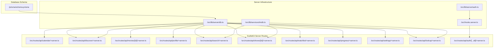

**Diagram sources**
- [src/routes/api/calendar/+server.ts:1-82](file://src/routes/api/calendar/+server.ts#L1-L82)
- [src/routes/api/discover/+server.ts:1-21](file://src/routes/api/discover/+server.ts#L1-L21)
- [src/routes/api/movies/[id]/+server.ts](file://src/routes/api/movies/[id]/+server.ts#L1-L19)
- [src/routes/api/profile/+server.ts:1-66](file://src/routes/api/profile/+server.ts#L1-L66)
- [src/routes/api/search/+server.ts:1-16](file://src/routes/api/search/+server.ts#L1-L16)
- [src/routes/api/shows/[id]/+server.ts](file://src/routes/api/shows/[id]/+server.ts#L1-L63)
- [src/routes/api/watchlist/+server.ts:1-141](file://src/routes/api/watchlist/+server.ts#L1-L141)
- [src/routes/api/progress/+server.ts:1-133](file://src/routes/api/progress/+server.ts#L1-L133)
- [src/routes/api/settings/+server.ts:1-29](file://src/routes/api/settings/+server.ts#L1-L29)
- [src/routes/api/lookup/+server.ts:1-53](file://src/routes/api/lookup/+server.ts#L1-L53)
- [src/routes/api/auth/[...all]/+server.ts](file://src/routes/api/auth/[...all]/+server.ts#L1-L7)
- [src/hooks.server.ts:1-18](file://src/hooks.server.ts#L1-L18)
- [src/lib/server/auth.ts:1-27](file://src/lib/server/auth.ts#L1-L27)
- [src/lib/server/db.ts:1-11](file://src/lib/server/db.ts#L1-L11)
- [src/lib/services/tmdb.ts:1-167](file://src/lib/services/tmdb.ts#L1-L167)
- [prisma/schema.prisma:1-258](file://prisma/schema.prisma#L1-L258)

**Section sources**
- [src/routes/api/calendar/+server.ts:1-82](file://src/routes/api/calendar/+server.ts#L1-L82)
- [src/routes/api/discover/+server.ts:1-21](file://src/routes/api/discover/+server.ts#L1-L21)
- [src/routes/api/movies/[id]/+server.ts](file://src/routes/api/movies/[id]/+server.ts#L1-L19)
- [src/routes/api/profile/+server.ts:1-66](file://src/routes/api/profile/+server.ts#L1-L66)
- [src/routes/api/search/+server.ts:1-16](file://src/routes/api/search/+server.ts#L1-L16)
- [src/routes/api/shows/[id]/+server.ts](file://src/routes/api/shows/[id]/+server.ts#L1-L63)
- [src/routes/api/watchlist/+server.ts:1-141](file://src/routes/api/watchlist/+server.ts#L1-L141)
- [src/routes/api/progress/+server.ts:1-133](file://src/routes/api/progress/+server.ts#L1-L133)
- [src/routes/api/settings/+server.ts:1-29](file://src/routes/api/settings/+server.ts#L1-L29)
- [src/routes/api/lookup/+server.ts:1-53](file://src/routes/api/lookup/+server.ts#L1-L53)
- [src/routes/api/auth/[...all]/+server.ts](file://src/routes/api/auth/[...all]/+server.ts#L1-L7)
- [src/hooks.server.ts:1-18](file://src/hooks.server.ts#L1-L18)
- [src/lib/server/auth.ts:1-27](file://src/lib/server/auth.ts#L1-L27)
- [src/lib/server/db.ts:1-11](file://src/lib/server/db.ts#L1-L11)
- [src/lib/services/tmdb.ts:1-167](file://src/lib/services/tmdb.ts#L1-L167)
- [prisma/schema.prisma:1-258](file://prisma/schema.prisma#L1-L258)

## Core Components
- Authentication middleware: Injects user/session into locals via a server hook using better-auth.
- Database client: Prisma client singleton initialized in a server module.
- External service: TMDB service encapsulates HTTP calls, response parsing, and data mapping.
- Route handlers: Each route exports a RequestHandler for GET/POST/DELETE/etc., performing auth checks, parameter extraction, data access, and JSON responses.

Key patterns observed:
- Unauthorized guard: Handlers check locals.user and return 401 JSON on absence.
- JSON responses: All endpoints return json(payload, options) with appropriate status codes.
- Error handling: Try/catch blocks wrap operations; errors are returned as JSON with 500 status.
- Parameter handling: Query parameters via URL.searchParams; request body via request.json().
- Data shaping: Results are normalized into domain-appropriate shapes before serialization.

**Section sources**
- [src/hooks.server.ts:1-18](file://src/hooks.server.ts#L1-L18)
- [src/lib/server/auth.ts:1-27](file://src/lib/server/auth.ts#L1-L27)
- [src/lib/server/db.ts:1-11](file://src/lib/server/db.ts#L1-L11)
- [src/lib/services/tmdb.ts:1-167](file://src/lib/services/tmdb.ts#L1-L167)
- [src/routes/api/calendar/+server.ts:9-81](file://src/routes/api/calendar/+server.ts#L9-L81)
- [src/routes/api/discover/+server.ts:5-20](file://src/routes/api/discover/+server.ts#L5-L20)
- [src/routes/api/movies/[id]/+server.ts](file://src/routes/api/movies/[id]/+server.ts#L5-L18)
- [src/routes/api/profile/+server.ts:5-65](file://src/routes/api/profile/+server.ts#L5-L65)
- [src/routes/api/search/+server.ts:5-15](file://src/routes/api/search/+server.ts#L5-L15)
- [src/routes/api/shows/[id]/+server.ts](file://src/routes/api/shows/[id]/+server.ts#L6-L62)
- [src/routes/api/watchlist/+server.ts:6-140](file://src/routes/api/watchlist/+server.ts#L6-L140)
- [src/routes/api/progress/+server.ts:34-132](file://src/routes/api/progress/+server.ts#L34-L132)
- [src/routes/api/settings/+server.ts:5-28](file://src/routes/api/settings/+server.ts#L5-L28)
- [src/routes/api/lookup/+server.ts:6-52](file://src/routes/api/lookup/+server.ts#L6-L52)

## Architecture Overview
The API architecture follows a layered pattern:
- Presentation layer: SvelteKit server routes.
- Application layer: Route handlers orchestrate data access and transformations.
- Domain services: TMDB service for external media data.
- Data layer: Prisma client with PostgreSQL adapter.
- Identity layer: better-auth manages sessions and injects user into locals.

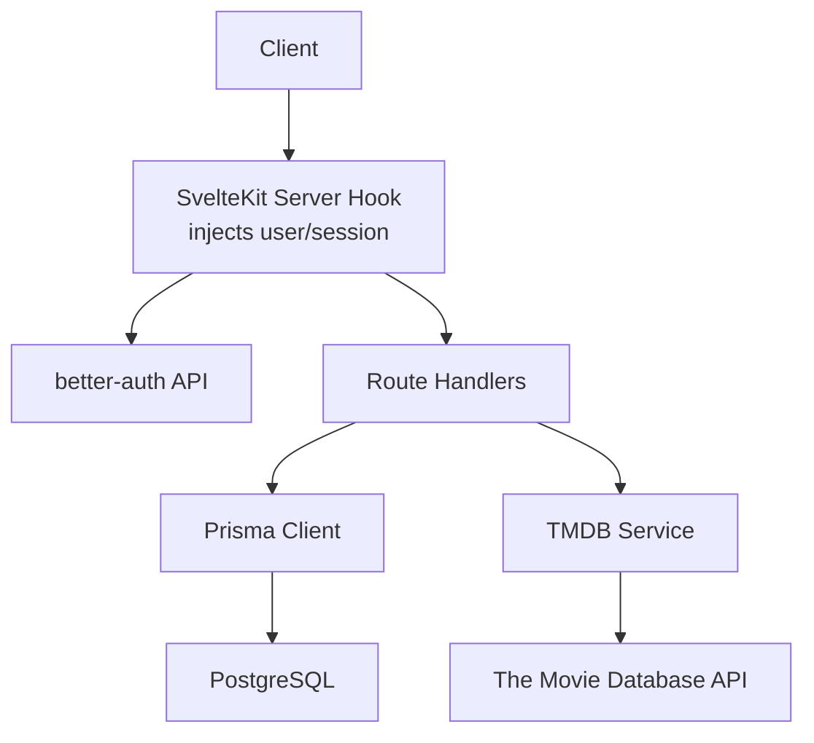

**Diagram sources**
- [src/hooks.server.ts:4-17](file://src/hooks.server.ts#L4-L17)
- [src/lib/server/auth.ts:6-24](file://src/lib/server/auth.ts#L6-L24)
- [src/lib/server/db.ts:8-10](file://src/lib/server/db.ts#L8-L10)
- [src/lib/services/tmdb.ts:1-167](file://src/lib/services/tmdb.ts#L1-L167)
- [prisma/schema.prisma:1-258](file://prisma/schema.prisma#L1-L258)

## Detailed Component Analysis

### Calendar Endpoint
Purpose: Returns upcoming episodes grouped by time buckets for the authenticated user’s timezone.

Processing logic:
- Validates user presence.
- Reads timezone from query parameters with a default.
- Loads user shows and episode progress, builds a set of watched episode IDs.
- Filters episodes by air date and watched status, sorts by air date.
- Groups items into today, tomorrow, this week, next week, later.

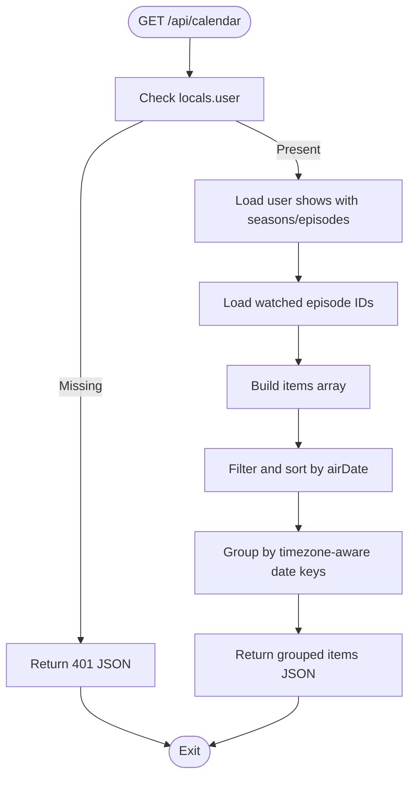

**Diagram sources**
- [src/routes/api/calendar/+server.ts:9-81](file://src/routes/api/calendar/+server.ts#L9-L81)

**Section sources**
- [src/routes/api/calendar/+server.ts:1-82](file://src/routes/api/calendar/+server.ts#L1-L82)

### Discover Endpoint
Purpose: Aggregates trending and popular content for shows and movies.

Processing logic:
- Validates user presence.
- Concurrently fetches trending and popular data for shows and movies.
- Returns combined payload.

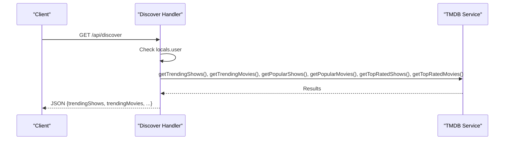

**Diagram sources**
- [src/routes/api/discover/+server.ts:5-20](file://src/routes/api/discover/+server.ts#L5-L20)
- [src/lib/services/tmdb.ts:106-140](file://src/lib/services/tmdb.ts#L106-L140)

**Section sources**
- [src/routes/api/discover/+server.ts:1-21](file://src/routes/api/discover/+server.ts#L1-L21)
- [src/lib/services/tmdb.ts:1-167](file://src/lib/services/tmdb.ts#L1-L167)

### Movies by ID Endpoint
Purpose: Retrieves a single movie and the user’s relationship to it.

Processing logic:
- Validates user presence.
- Loads movie by ID; returns 404 if not found.
- Loads user-movie record and returns both.

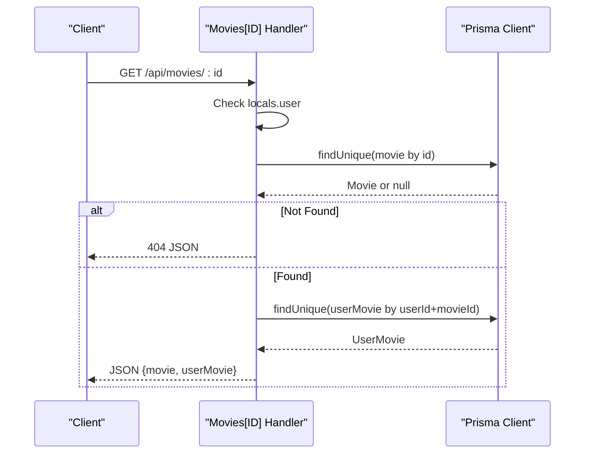

**Diagram sources**
- [src/routes/api/movies/[id]/+server.ts](file://src/routes/api/movies/[id]/+server.ts#L5-L18)
- [src/lib/server/db.ts:8-10](file://src/lib/server/db.ts#L8-L10)

**Section sources**
- [src/routes/api/movies/[id]/+server.ts](file://src/routes/api/movies/[id]/+server.ts#L1-L19)
- [src/lib/server/db.ts:1-11](file://src/lib/server/db.ts#L1-L11)

### Profile Endpoint
Purpose: Computes aggregated stats and top genres for the authenticated user.

Processing logic:
- Validates user presence.
- Counts tracked shows, completed shows, watched episodes, and watched movies.
- Computes total watch time from episode runtimes and watched movies.
- Aggregates top genres from tracked shows and movies.
- Returns structured stats.

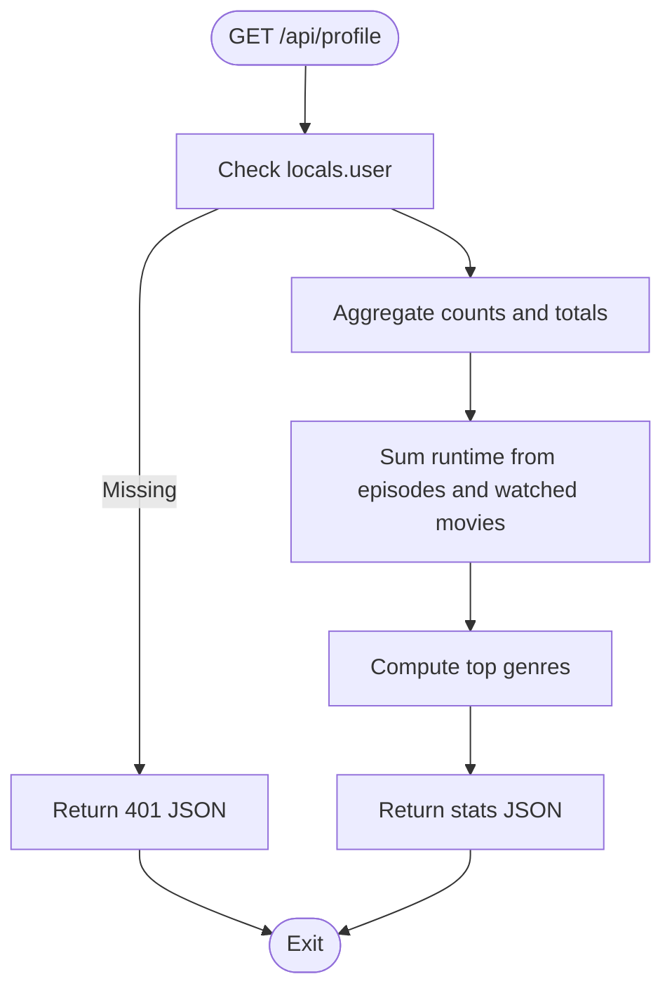

**Diagram sources**
- [src/routes/api/profile/+server.ts:5-65](file://src/routes/api/profile/+server.ts#L5-L65)

**Section sources**
- [src/routes/api/profile/+server.ts:1-66](file://src/routes/api/profile/+server.ts#L1-L66)

### Search Endpoint
Purpose: Multi-type search across shows and movies.

Processing logic:
- Validates user presence.
- Reads query from URL search parameters.
- Returns empty results for empty query.
- Calls TMDB searchMulti and returns mapped results.

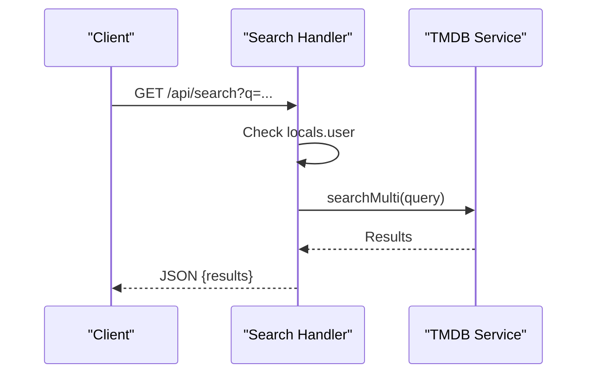

**Diagram sources**
- [src/routes/api/search/+server.ts:5-15](file://src/routes/api/search/+server.ts#L5-L15)
- [src/lib/services/tmdb.ts:19-37](file://src/lib/services/tmdb.ts#L19-L37)

**Section sources**
- [src/routes/api/search/+server.ts:1-16](file://src/routes/api/search/+server.ts#L1-L16)
- [src/lib/services/tmdb.ts:1-167](file://src/lib/services/tmdb.ts#L1-L167)

### Shows by ID Endpoint
Purpose: Retrieves show details and user association; lazily caches seasons and episodes from TMDB if missing.

Processing logic:
- Validates user presence.
- Loads show with seasons and episodes; returns 404 if not found.
- If no seasons cached and tmdbId exists, fetches details and episodes, persists to DB, then reloads.
- Returns show and user-show.

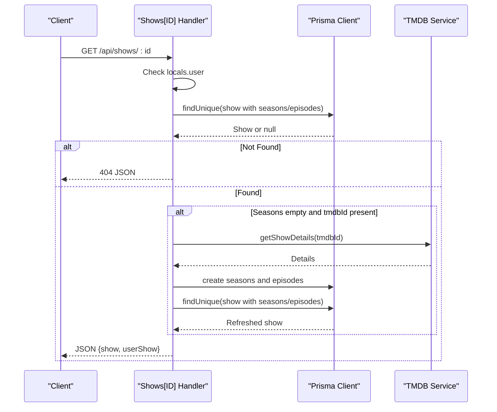

**Diagram sources**
- [src/routes/api/shows/[id]/+server.ts](file://src/routes/api/shows/[id]/+server.ts#L6-L62)
- [src/lib/services/tmdb.ts:39-86](file://src/lib/services/tmdb.ts#L39-L86)
- [src/lib/server/db.ts:8-10](file://src/lib/server/db.ts#L8-L10)

**Section sources**
- [src/routes/api/shows/[id]/+server.ts](file://src/routes/api/shows/[id]/+server.ts#L1-L63)
- [src/lib/services/tmdb.ts:1-167](file://src/lib/services/tmdb.ts#L1-L167)
- [src/lib/server/db.ts:1-11](file://src/lib/server/db.ts#L1-L11)

### Watchlist Endpoint
Purpose: Lists, adds, and removes items from the authenticated user’s watchlist.

Capabilities:
- GET: Returns user shows and movies ordered by recency.
- POST: Adds a show or movie by tmdbId; creates show/movie if needed; upserts user-show/user-movie; records activity.
- DELETE: Removes a show or movie from the watchlist.

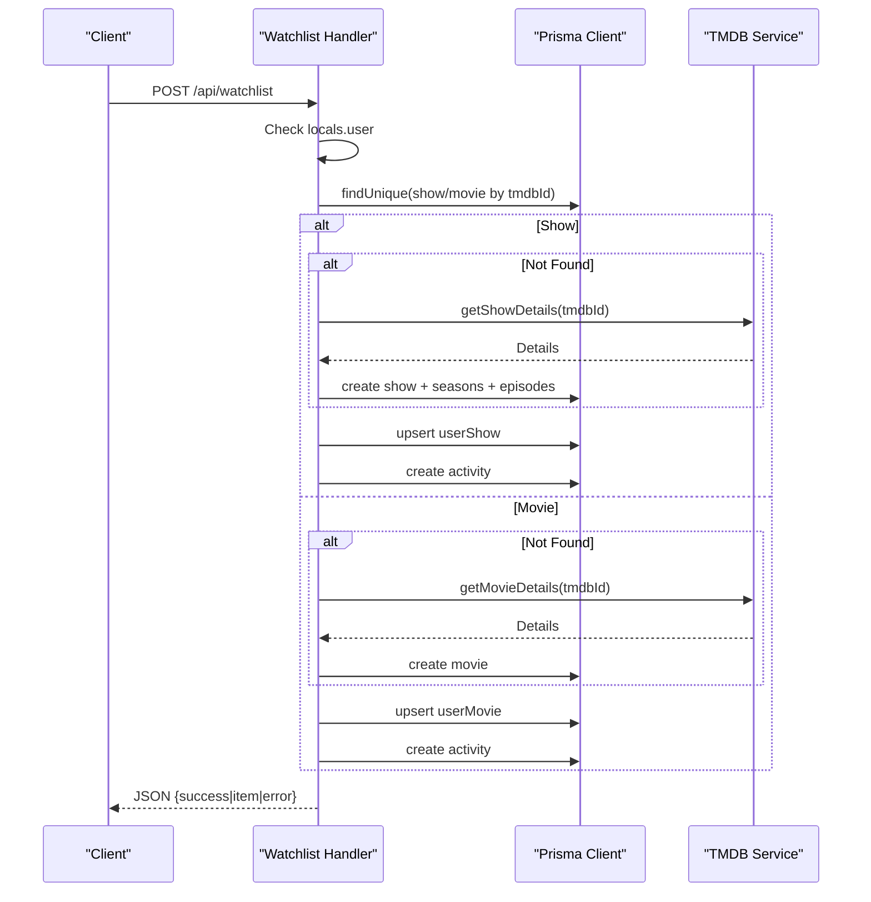

**Diagram sources**
- [src/routes/api/watchlist/+server.ts:28-122](file://src/routes/api/watchlist/+server.ts#L28-L122)
- [src/lib/services/tmdb.ts:88-104](file://src/lib/services/tmdb.ts#L88-L104)
- [src/lib/server/db.ts:8-10](file://src/lib/server/db.ts#L8-L10)

**Section sources**
- [src/routes/api/watchlist/+server.ts:1-141](file://src/routes/api/watchlist/+server.ts#L1-L141)
- [src/lib/services/tmdb.ts:1-167](file://src/lib/services/tmdb.ts#L1-L167)
- [src/lib/server/db.ts:1-11](file://src/lib/server/db.ts#L1-L11)

### Progress Endpoint
Purpose: Manages episode progress and derived show status.

Capabilities:
- GET: Lists recent progress for the user or progress scoped to a show.
- POST: Supports actions such as marking an episode as watched/unwatched, marking a season, marking caught-up, and resetting a show.

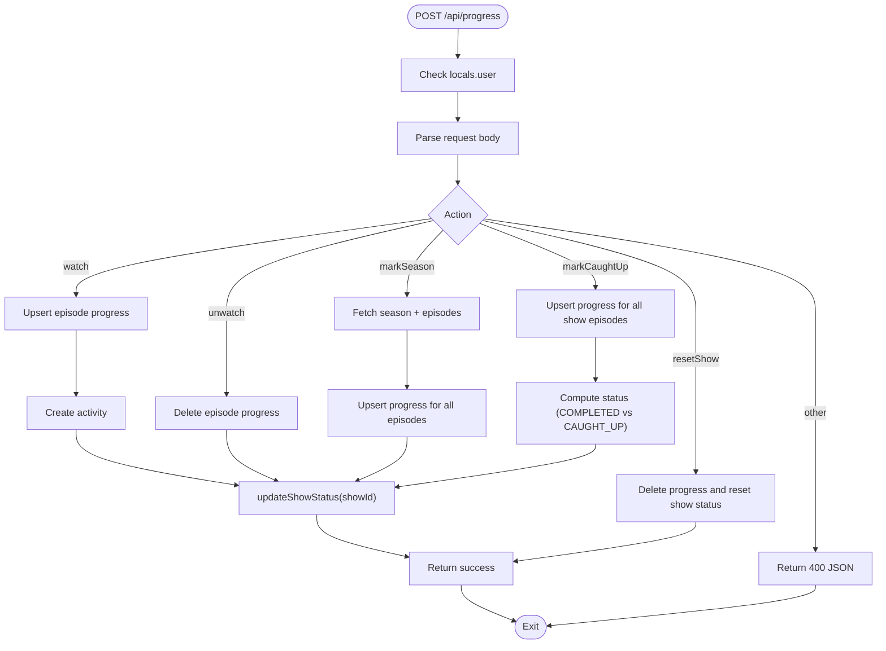

**Diagram sources**
- [src/routes/api/progress/+server.ts:60-132](file://src/routes/api/progress/+server.ts#L60-L132)

**Section sources**
- [src/routes/api/progress/+server.ts:1-133](file://src/routes/api/progress/+server.ts#L1-L133)

### Settings Endpoint
Purpose: Retrieves and updates user preferences.

Processing logic:
- GET: Loads user preference by userId.
- POST: Upserts preferences with defaults for theme, region, language, and timezone.

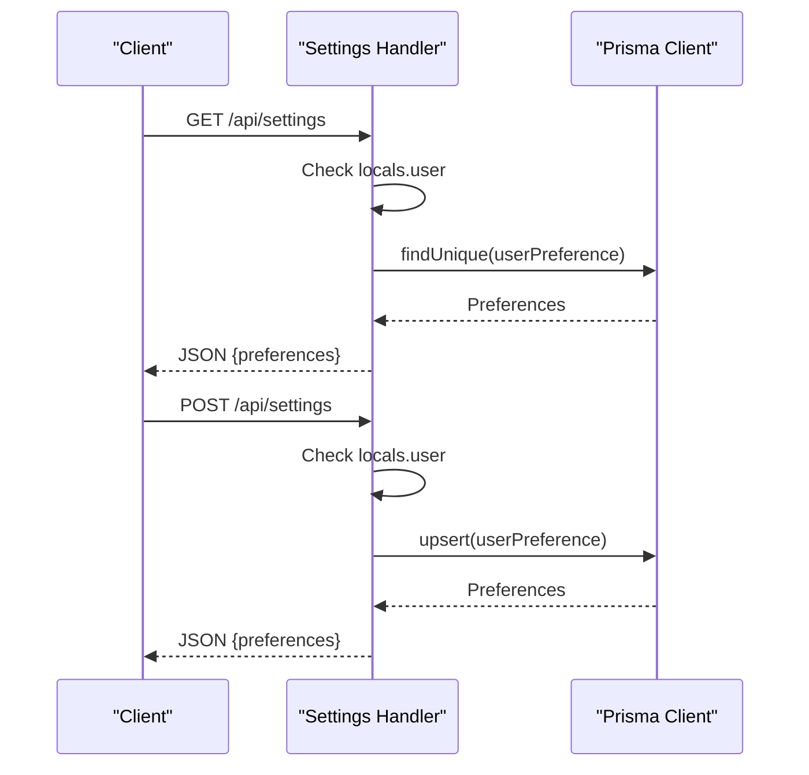

**Diagram sources**
- [src/routes/api/settings/+server.ts:5-28](file://src/routes/api/settings/+server.ts#L5-L28)
- [src/lib/server/db.ts:8-10](file://src/lib/server/db.ts#L8-L10)

**Section sources**
- [src/routes/api/settings/+server.ts:1-29](file://src/routes/api/settings/+server.ts#L1-L29)
- [src/lib/server/db.ts:1-11](file://src/lib/server/db.ts#L1-L11)

### Lookup Endpoint
Purpose: Resolves a TMDB entity to a local ID for shows or movies.

Processing logic:
- Validates user presence.
- For shows: fetches details if needed and returns local ID.
- For movies: similar behavior.
- Returns error for invalid type.

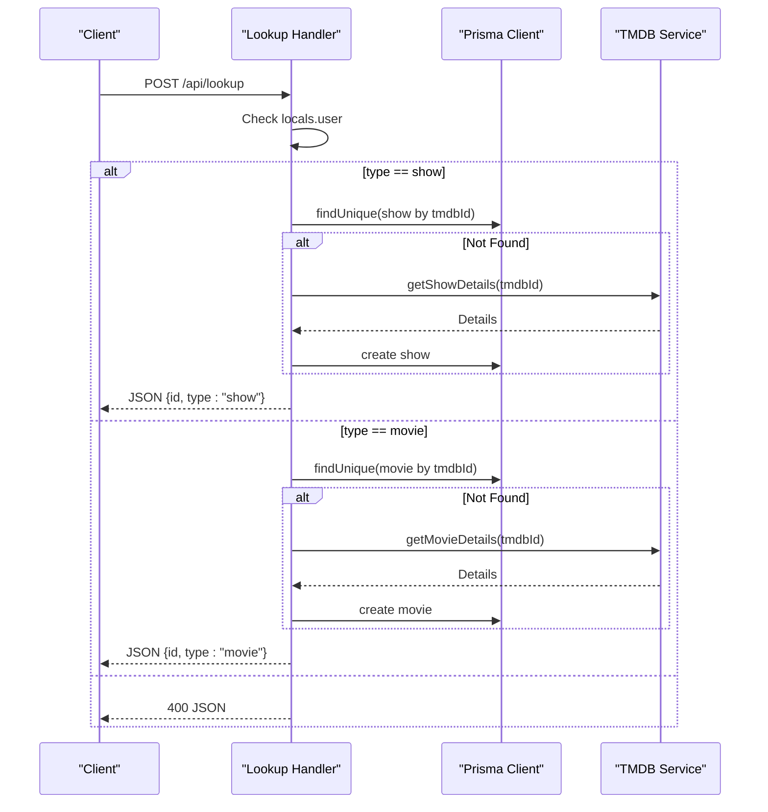

**Diagram sources**
- [src/routes/api/lookup/+server.ts:6-52](file://src/routes/api/lookup/+server.ts#L6-L52)
- [src/lib/services/tmdb.ts:88-104](file://src/lib/services/tmdb.ts#L88-L104)
- [src/lib/server/db.ts:8-10](file://src/lib/server/db.ts#L8-L10)

**Section sources**
- [src/routes/api/lookup/+server.ts:1-53](file://src/routes/api/lookup/+server.ts#L1-L53)
- [src/lib/services/tmdb.ts:1-167](file://src/lib/services/tmdb.ts#L1-L167)
- [src/lib/server/db.ts:1-11](file://src/lib/server/db.ts#L1-L11)

### Authentication Endpoint
Purpose: Exposes better-auth endpoints through SvelteKit.

Processing logic:
- Wraps better-auth with SvelteKit handler and forwards all methods.

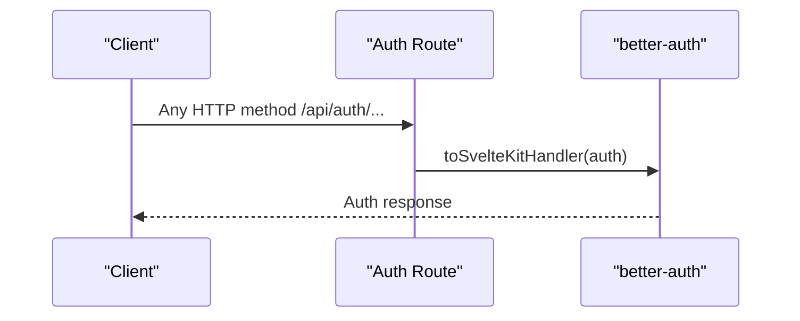

**Diagram sources**
- [src/routes/api/auth/[...all]/+server.ts](file://src/routes/api/auth/[...all]/+server.ts#L1-L7)
- [src/lib/server/auth.ts:1-27](file://src/lib/server/auth.ts#L1-L27)

**Section sources**
- [src/routes/api/auth/[...all]/+server.ts](file://src/routes/api/auth/[...all]/+server.ts#L1-L7)
- [src/lib/server/auth.ts:1-27](file://src/lib/server/auth.ts#L1-L27)

## Dependency Analysis
- Route handlers depend on:
  - Authentication hook for user/session injection.
  - Prisma client for data persistence.
  - TMDB service for external media data.
- Database schema defines entities and relationships used across handlers.
- better-auth configures session lifecycle and trusted origins.

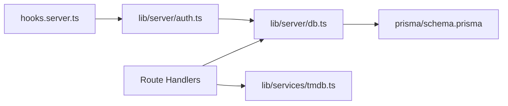

**Diagram sources**
- [src/hooks.server.ts:1-18](file://src/hooks.server.ts#L1-L18)
- [src/lib/server/auth.ts:1-27](file://src/lib/server/auth.ts#L1-L27)
- [src/lib/server/db.ts:1-11](file://src/lib/server/db.ts#L1-L11)
- [src/lib/services/tmdb.ts:1-167](file://src/lib/services/tmdb.ts#L1-L167)
- [prisma/schema.prisma:1-258](file://prisma/schema.prisma#L1-L258)

**Section sources**
- [src/hooks.server.ts:1-18](file://src/hooks.server.ts#L1-L18)
- [src/lib/server/auth.ts:1-27](file://src/lib/server/auth.ts#L1-L27)
- [src/lib/server/db.ts:1-11](file://src/lib/server/db.ts#L1-L11)
- [src/lib/services/tmdb.ts:1-167](file://src/lib/services/tmdb.ts#L1-L167)
- [prisma/schema.prisma:1-258](file://prisma/schema.prisma#L1-L258)

## Performance Considerations
- Concurrency: Use Promise.all for independent external requests (as seen in discover).
- Lazy caching: Populate seasons and episodes on demand to reduce cold-start latency.
- Sorting and grouping: Prefer efficient grouping strategies and avoid unnecessary allocations.
- Pagination: Limit result sets (e.g., take: N) for recent activity endpoints.
- Indexes: Leverage database indexes (e.g., unique constraints and indices) to speed lookups.
- Network efficiency: Reuse normalized data shapes and avoid redundant round-trips.

[No sources needed since this section provides general guidance]

## Troubleshooting Guide
Common issues and resolutions:
- Unauthorized access: Ensure the server hook is applied and locals.user is present before processing.
- JSON parse errors: Always wrap request.json() in a safe block to avoid unhandled exceptions.
- External API failures: Validate response.ok and propagate meaningful error messages.
- Database errors: Wrap operations in try/catch and return 500 JSON with error message.
- Missing entities: Return 404 JSON when resources are not found.

**Section sources**
- [src/hooks.server.ts:4-17](file://src/hooks.server.ts#L4-L17)
- [src/routes/api/discover/+server.ts:8-19](file://src/routes/api/discover/+server.ts#L8-L19)
- [src/routes/api/search/+server.ts:10-14](file://src/routes/api/search/+server.ts#L10-L14)
- [src/routes/api/shows/[id]/+server.ts](file://src/routes/api/shows/[id]/+server.ts#L10-L14)
- [src/routes/api/watchlist/+server.ts:30-121](file://src/routes/api/watchlist/+server.ts#L30-L121)
- [src/routes/api/progress/+server.ts:62-131](file://src/routes/api/progress/+server.ts#L62-L131)

## Conclusion
The current API follows a consistent pattern: strict authentication checks, safe JSON responses, centralized error handling, and modular services for data access and external integrations. By adhering to these patterns and applying the recommendations below, new endpoints can be developed efficiently and securely while maintaining performance and readability.

## Appendices

### API Development Guidelines

- Route Organization
  - Place endpoints under src/routes/api/<resource>/ with +server.ts per route segment.
  - Use plural nouns for resource collections and parameterized segments for individual resources.

- Request/Response Handling
  - Always check locals.user and return 401 JSON if absent.
  - Use URL.searchParams for query parameters; parse request.body safely with request.json().catch(() => ({})) to avoid crashes.
  - Return json(payload, { status }) with appropriate HTTP status codes.

- Parameter Validation
  - Validate presence and types of query/body parameters early.
  - Reject empty or malformed inputs with 400 JSON.

- Data Transformation
  - Normalize external API responses into internal domain shapes.
  - Avoid leaking raw database relations; shape payloads for clients.

- Error Management
  - Wrap operations in try/catch; return 500 JSON with error.message.
  - For external API errors, propagate meaningful messages after checking res.ok.

- Authentication Middleware Integration
  - Rely on the server hook to inject user/session into locals.
  - Enforce auth checks at the beginning of each handler.

- Rate Limiting Considerations
  - Apply rate limiting at the edge or reverse proxy level.
  - For TMDB calls, batch and reuse data where possible to minimize external requests.

- Security Best Practices
  - Sanitize and validate inputs; avoid SQL injection via Prisma.
  - Use HTTPS and secure cookies; configure trusted origins appropriately.
  - Avoid exposing sensitive fields in responses.

- API Versioning
  - Consider prefixing routes with /api/v1/ to enable future versions.
  - Maintain backward compatibility when evolving endpoints.

- Documentation Generation
  - Document endpoints with OpenAPI/Swagger using comments and shared schemas.
  - Keep examples of request/response payloads synchronized with handlers.

- Testing Approaches
  - Unit test route handlers with mocked db and tmdb services.
  - Test error paths and boundary conditions (401, 404, 400, 500).
  - Snapshot test representative responses to prevent regressions.

- External API Integration Patterns
  - Centralize external calls in a service module with typed return shapes.
  - Implement retry/backoff and circuit breaker patterns for resilience.
  - Cache responses for repeated reads within short TTL windows.

- Caching Strategies
  - Cache frequently accessed external data keyed by tmdbId.
  - Use in-memory cache for hot paths; persist to DB for durability.
  - Invalidate cache on mutations.

- Performance Optimization Techniques
  - Use select/include judiciously to limit payload sizes.
  - Batch database writes and reads; leverage transactions for consistency.
  - Minimize N+1 queries by eager-loading relations.

### CRUD and Common Patterns

- CRUD Operations
  - GET list: Paginate and filter; return shaped arrays.
  - GET by ID: Return 404 if not found; include related entities as needed.
  - POST create: Validate inputs; upsert or create; emit activity/notifications.
  - PATCH/PUT update: Partial updates with validation; return updated resource.
  - DELETE remove: Cascade as appropriate; return success.

- Search Functionality
  - Support fuzzy or exact matching; normalize query strings.
  - Combine results from multiple sources; deduplicate by tmdbId.

- Data Aggregation
  - Compute metrics server-side to reduce client work.
  - Use database aggregates and joins to avoid loading unnecessary rows.

[No sources needed since this section provides general guidance]