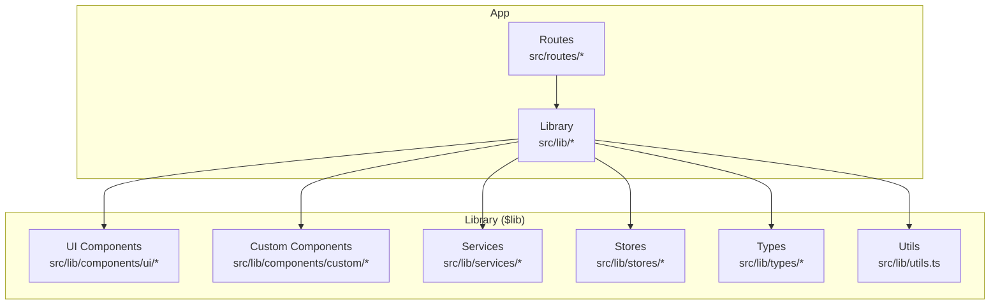
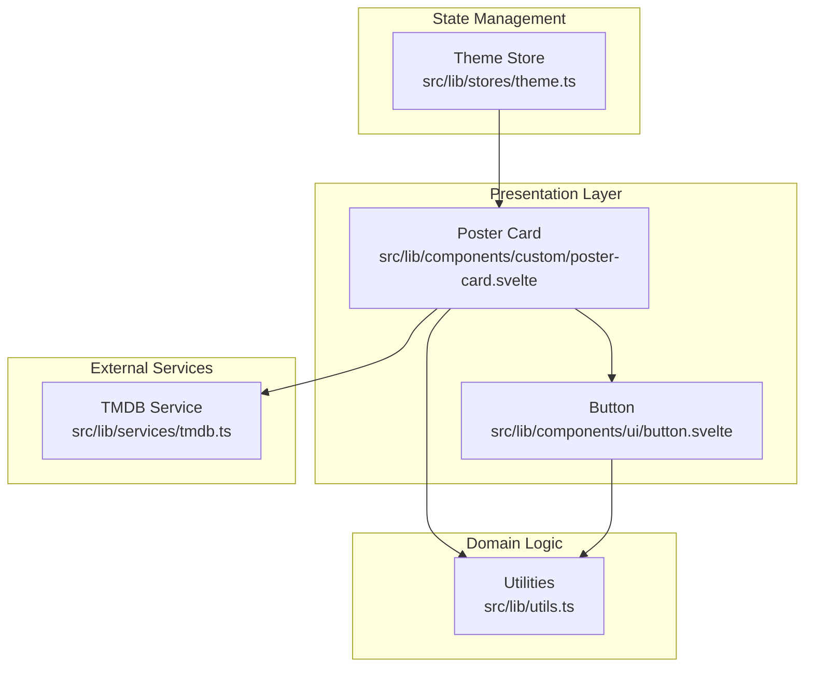
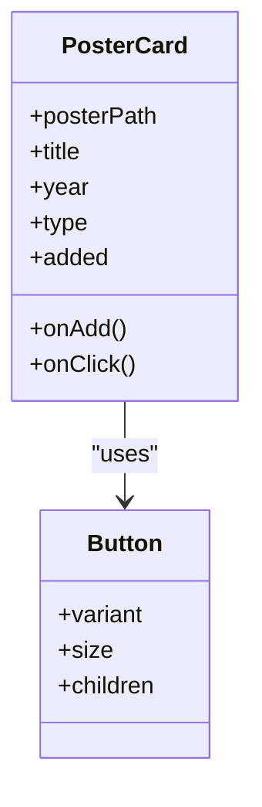
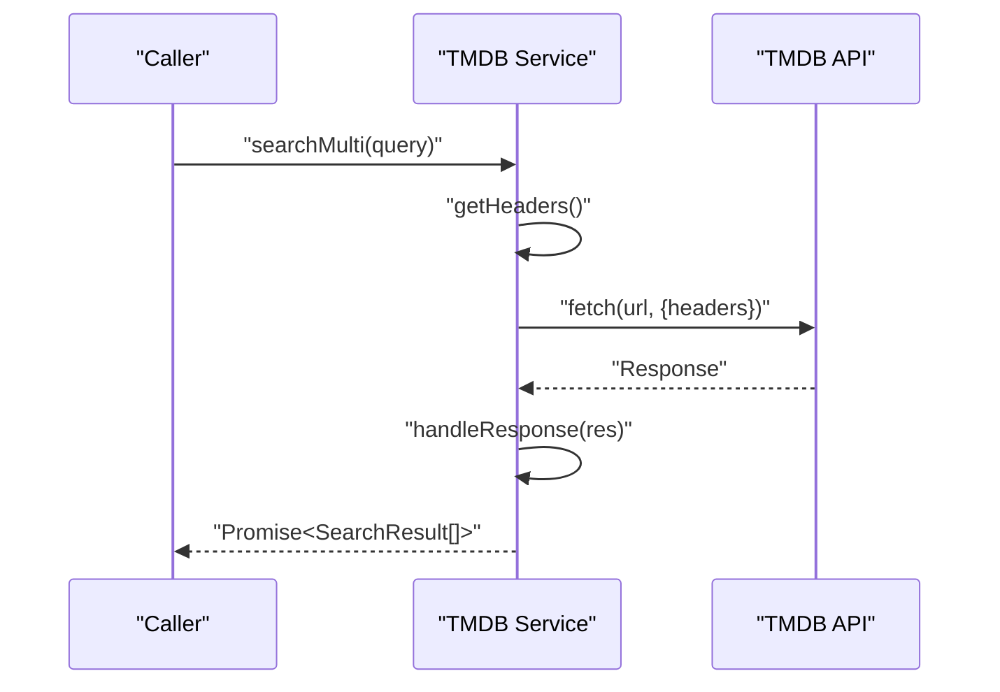
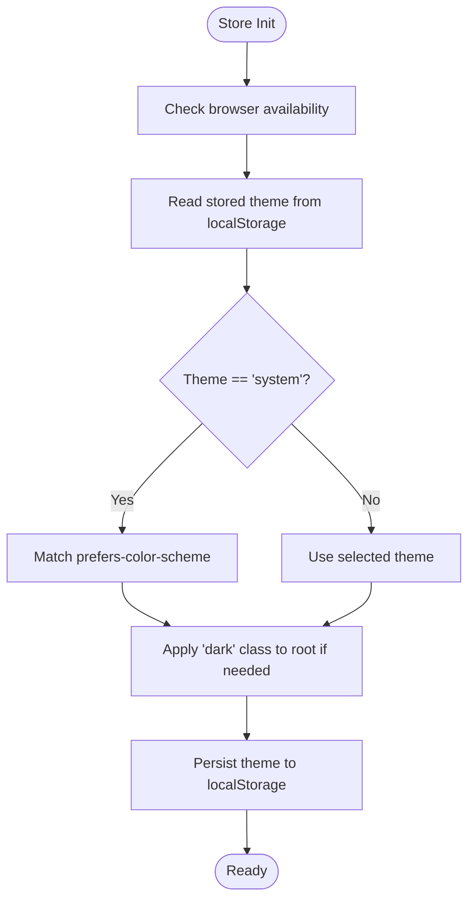
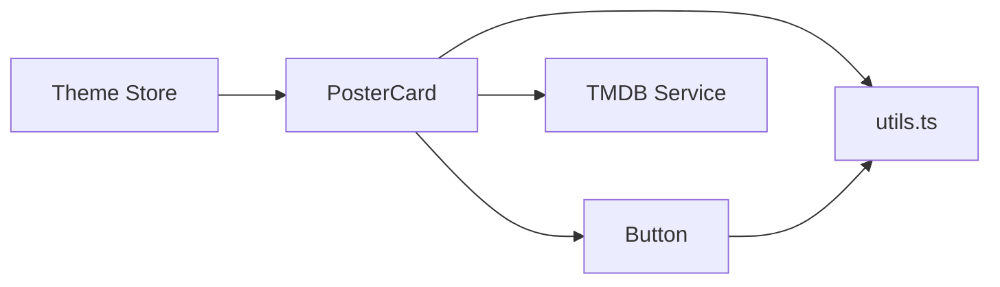

# Code Structure & Organization

<cite>
**Referenced Files in This Document**
- [package.json](file://package.json)
- [tsconfig.json](file://tsconfig.json)
- [svelte.config.js](file://svelte.config.js)
- [src/lib/index.ts](file://src/lib/index.ts)
- [src/lib/utils.ts](file://src/lib/utils.ts)
- [src/lib/components/ui/button.svelte](file://src/lib/components/ui/button.svelte)
- [src/lib/components/custom/poster-card.svelte](file://src/lib/components/custom/poster-card.svelte)
- [src/lib/services/tmdb.ts](file://src/lib/services/tmdb.ts)
- [src/lib/stores/theme.ts](file://src/lib/stores/theme.ts)
- [src/app.d.ts](file://src/app.d.ts)
</cite>

## Table of Contents
1. [Introduction](#introduction)
2. [Project Structure](#project-structure)
3. [Core Components](#core-components)
4. [Architecture Overview](#architecture-overview)
5. [Detailed Component Analysis](#detailed-component-analysis)
6. [Dependency Analysis](#dependency-analysis)
7. [Performance Considerations](#performance-considerations)
8. [Troubleshooting Guide](#troubleshooting-guide)
9. [Conclusion](#conclusion)
10. [Appendices](#appendices)

## Introduction
This document defines code structure and organization guidelines for Screenlog’s SvelteKit + TypeScript codebase. It establishes modular architecture patterns, file organization conventions, and naming standards. It also documents the $lib alias usage, component categorization (UI vs custom), service layer organization, TypeScript interface patterns, type definitions organization, and store structure conventions. Guidance is provided for directory structure, file naming conventions, and module exports, along with examples of proper imports, exports, and module organization patterns used throughout the codebase.

## Project Structure
Screenlog follows a layered, feature-oriented structure under src/. The core library lives under src/lib and is exposed via the $lib alias. Routes are organized under src/routes with SvelteKit conventions for pages, layouts, and API endpoints. Build-time configuration is centralized in svelte.config.js and tsconfig.json.

Key conventions:
- $lib alias points to src/lib and is used for internal imports across the app.
- UI primitives live under src/lib/components/ui; reusable building blocks.
- Custom components live under src/lib/components/custom; domain-specific widgets.
- Services encapsulate external API integrations under src/lib/services.
- Stores define Svelte writable stores under src/lib/stores.
- Shared utilities under src/lib/utils.ts.
- Type definitions under src/lib/types.

**Diagram sources**
- [svelte.config.js:1-18](file://svelte.config.js#L1-L18)
- [tsconfig.json:1-21](file://tsconfig.json#L1-L21)
- [src/lib/index.ts:1-2](file://src/lib/index.ts#L1-L2)

**Section sources**
- [svelte.config.js:1-18](file://svelte.config.js#L1-L18)
- [tsconfig.json:1-21](file://tsconfig.json#L1-L21)
- [src/lib/index.ts:1-2](file://src/lib/index.ts#L1-L2)

## Core Components
This section outlines the foundational building blocks and their roles in the architecture.

- $lib alias and module resolution
  - The $lib alias is configured by SvelteKit to resolve to src/lib. Internal imports use $lib/parts to avoid relative path churn and improve portability.
  - TypeScript compiler options enable bundler module resolution and extension rewriting to streamline imports.

- Utilities
  - Centralized helpers for class merging, formatting dates/datetime/runtime, initials extraction, image URL construction, and timezone retrieval.

- UI primitives
  - Reusable base components (e.g., button) that accept variant and size props and compose Tailwind classes via the shared cn utility.

- Custom components
  - Domain-specific components (e.g., poster card) composed from UI primitives and utilities.

- Services
  - Encapsulated external API clients (e.g., TMDB) with typed return values and robust error handling.

- Stores
  - Svelte writable stores for cross-cutting concerns (e.g., theme) with persistence and SSR-safe initialization.

- Type definitions
  - Strongly typed interfaces for content entities and service return types.

**Section sources**
- [tsconfig.json:1-21](file://tsconfig.json#L1-L21)
- [src/lib/utils.ts:1-82](file://src/lib/utils.ts#L1-L82)
- [src/lib/components/ui/button.svelte:1-45](file://src/lib/components/ui/button.svelte#L1-L45)
- [src/lib/components/custom/poster-card.svelte:1-68](file://src/lib/components/custom/poster-card.svelte#L1-L68)
- [src/lib/services/tmdb.ts:1-167](file://src/lib/services/tmdb.ts#L1-L167)
- [src/lib/stores/theme.ts:1-40](file://src/lib/stores/theme.ts#L1-L40)

## Architecture Overview
The architecture separates concerns into UI, domain logic, services, and state management while enforcing strong typing and consistent utilities.

**Diagram sources**
- [src/lib/components/custom/poster-card.svelte:1-68](file://src/lib/components/custom/poster-card.svelte#L1-L68)
- [src/lib/components/ui/button.svelte:1-45](file://src/lib/components/ui/button.svelte#L1-L45)
- [src/lib/utils.ts:1-82](file://src/lib/utils.ts#L1-L82)
- [src/lib/services/tmdb.ts:1-167](file://src/lib/services/tmdb.ts#L1-L167)
- [src/lib/stores/theme.ts:1-40](file://src/lib/stores/theme.ts#L1-L40)

## Detailed Component Analysis

### $lib Alias Usage and Module Resolution
- Purpose: Provides a stable, project-root-relative import path for internal modules.
- Configuration: Managed by SvelteKit; TypeScript extends the generated tsconfig and enables bundler module resolution.
- Pattern: Import internal modules using $lib/parts to keep imports concise and portable.

**Section sources**
- [tsconfig.json:1-21](file://tsconfig.json#L1-L21)
- [svelte.config.js:1-18](file://svelte.config.js#L1-L18)
- [src/lib/index.ts:1-2](file://src/lib/index.ts#L1-L2)

### Component Categorization: UI vs Custom
- UI components
  - Located under src/lib/components/ui.
  - Provide base, composable primitives (e.g., button) with variant and size props.
  - Compose shared utilities for styling and accessibility.
- Custom components
  - Located under src/lib/components/custom.
  - Combine UI primitives and domain logic (e.g., poster-card).
  - Encapsulate presentation and interaction tailored to the application domain.

**Diagram sources**
- [src/lib/components/ui/button.svelte:1-45](file://src/lib/components/ui/button.svelte#L1-L45)
- [src/lib/components/custom/poster-card.svelte:1-68](file://src/lib/components/custom/poster-card.svelte#L1-L68)

**Section sources**
- [src/lib/components/ui/button.svelte:1-45](file://src/lib/components/ui/button.svelte#L1-L45)
- [src/lib/components/custom/poster-card.svelte:1-68](file://src/lib/components/custom/poster-card.svelte#L1-L68)

### Service Layer Organization
- Responsibilities
  - Encapsulate external API calls (e.g., TMDB).
  - Normalize raw API responses into domain-friendly types.
  - Centralize error handling and header management.
- Patterns
  - Exported async functions per endpoint.
  - Private helper functions for headers and response handling.
  - Typed return values imported from shared type definitions.

**Diagram sources**
- [src/lib/services/tmdb.ts:1-167](file://src/lib/services/tmdb.ts#L1-L167)

**Section sources**
- [src/lib/services/tmdb.ts:1-167](file://src/lib/services/tmdb.ts#L1-L167)

### Store Structure Conventions
- Pattern
  - Factory function creates a Svelte writable store with initial value determination.
  - Public methods expose subscribe, set, and init.
  - Side effects (e.g., DOM class toggling, localStorage persistence) are encapsulated within the factory.
- Example
  - Theme store persists user preference and applies system-aware dark mode.

**Diagram sources**
- [src/lib/stores/theme.ts:1-40](file://src/lib/stores/theme.ts#L1-L40)

**Section sources**
- [src/lib/stores/theme.ts:1-40](file://src/lib/stores/theme.ts#L1-L40)

### TypeScript Interfaces and Type Definitions Organization
- Global app types
  - Extend SvelteKit’s App namespace to define error, locals, and page data shapes.
- Domain types
  - Define content-related interfaces (e.g., SearchResult, ShowDetail, MovieSummary) used by services and components.
- Usage pattern
  - Services import and return typed results.
  - Components consume typed props and event handlers.

**Section sources**
- [src/app.d.ts:1-23](file://src/app.d.ts#L1-L23)
- [src/lib/services/tmdb.ts:1-167](file://src/lib/services/tmdb.ts#L1-L167)

### Directory Structure and Naming Conventions
- src/lib
  - components/ui: Base UI primitives (kebab-case filenames).
  - components/custom: Domain-specific components (kebab-case filenames).
  - services: Feature-scoped service modules (kebab-case filenames).
  - stores: Cross-cutting state modules (kebab-case filenames).
  - types: Shared type definitions (kebab-case filenames).
  - utils.ts: Shared utilities.
- Imports
  - Use $lib/parts for internal imports.
  - Prefer named exports for functions and types.
  - Group imports by internal, external, and type-only sections.

**Section sources**
- [src/lib/utils.ts:1-82](file://src/lib/utils.ts#L1-L82)
- [src/lib/components/ui/button.svelte:1-45](file://src/lib/components/ui/button.svelte#L1-L45)
- [src/lib/components/custom/poster-card.svelte:1-68](file://src/lib/components/custom/poster-card.svelte#L1-L68)
- [src/lib/services/tmdb.ts:1-167](file://src/lib/services/tmdb.ts#L1-L167)
- [src/lib/stores/theme.ts:1-40](file://src/lib/stores/theme.ts#L1-L40)

## Dependency Analysis
- Internal dependencies
  - Custom components depend on UI primitives and utilities.
  - Services depend on shared types and environment variables.
  - Stores depend on browser environment and DOM APIs.
- External dependencies
  - UI primitives rely on Tailwind-based class composition.
  - Services rely on external APIs and typed validation libraries.
- Coupling and cohesion
  - UI components are cohesive and loosely coupled to domain logic.
  - Services encapsulate external coupling and expose clean interfaces.
  - Stores isolate side effects and persistence concerns.

**Diagram sources**
- [src/lib/components/custom/poster-card.svelte:1-68](file://src/lib/components/custom/poster-card.svelte#L1-L68)
- [src/lib/components/ui/button.svelte:1-45](file://src/lib/components/ui/button.svelte#L1-L45)
- [src/lib/utils.ts:1-82](file://src/lib/utils.ts#L1-L82)
- [src/lib/services/tmdb.ts:1-167](file://src/lib/services/tmdb.ts#L1-L167)
- [src/lib/stores/theme.ts:1-40](file://src/lib/stores/theme.ts#L1-L40)

**Section sources**
- [src/lib/components/custom/poster-card.svelte:1-68](file://src/lib/components/custom/poster-card.svelte#L1-L68)
- [src/lib/components/ui/button.svelte:1-45](file://src/lib/components/ui/button.svelte#L1-L45)
- [src/lib/utils.ts:1-82](file://src/lib/utils.ts#L1-L82)
- [src/lib/services/tmdb.ts:1-167](file://src/lib/services/tmdb.ts#L1-L167)
- [src/lib/stores/theme.ts:1-40](file://src/lib/stores/theme.ts#L1-L40)

## Performance Considerations
- Lazy loading images in custom components reduces initial payload.
- Centralized utilities minimize repeated computations and improve cache locality.
- SvelteKit’s runes mode improves reactive performance; ensure only necessary parts are reactive.
- Avoid unnecessary re-renders by passing minimal props and memoizing derived values.

## Troubleshooting Guide
- Missing $lib alias
  - Verify SvelteKit configuration and that tsconfig extends the generated tsconfig.
- Type errors in App namespace
  - Ensure src/app.d.ts aligns with runtime shapes and imports correct types.
- API failures
  - Confirm environment variables are present and service error handling is invoked.
- Theme not applying
  - Check browser availability and localStorage persistence logic.

**Section sources**
- [svelte.config.js:1-18](file://svelte.config.js#L1-L18)
- [tsconfig.json:1-21](file://tsconfig.json#L1-L21)
- [src/app.d.ts:1-23](file://src/app.d.ts#L1-L23)
- [src/lib/services/tmdb.ts:1-167](file://src/lib/services/tmdb.ts#L1-L167)
- [src/lib/stores/theme.ts:1-40](file://src/lib/stores/theme.ts#L1-L40)

## Conclusion
Screenlog’s codebase enforces a clean, modular architecture with clear boundaries between UI, domain logic, services, and state. The $lib alias simplifies internal imports, while UI and custom components promote reuse and composability. Strong typing, centralized utilities, and encapsulated services and stores ensure maintainability and scalability. Following the conventions outlined here will help preserve architectural layer separation and improve code reusability across the project.

## Appendices

### Examples of Proper Imports, Exports, and Module Organization
- Internal imports via $lib
  - Import utilities and UI components using $lib/parts.
- Named exports
  - Export functions and types from services and stores for consumers.
- Grouped imports
  - Order imports by internal, external, and type-only sections for readability.

**Section sources**
- [src/lib/utils.ts:1-82](file://src/lib/utils.ts#L1-L82)
- [src/lib/components/ui/button.svelte:1-45](file://src/lib/components/ui/button.svelte#L1-L45)
- [src/lib/components/custom/poster-card.svelte:1-68](file://src/lib/components/custom/poster-card.svelte#L1-L68)
- [src/lib/services/tmdb.ts:1-167](file://src/lib/services/tmdb.ts#L1-L167)
- [src/lib/stores/theme.ts:1-40](file://src/lib/stores/theme.ts#L1-L40)