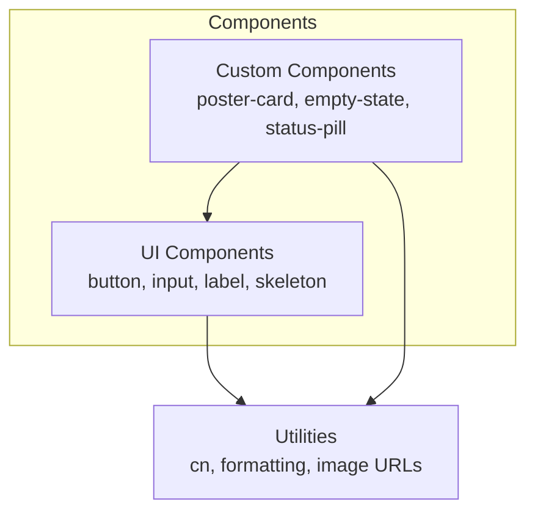
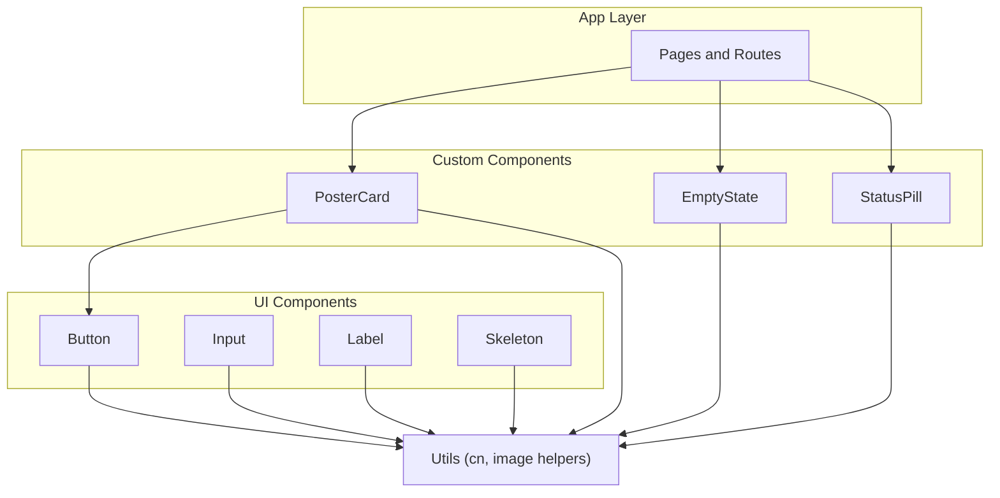
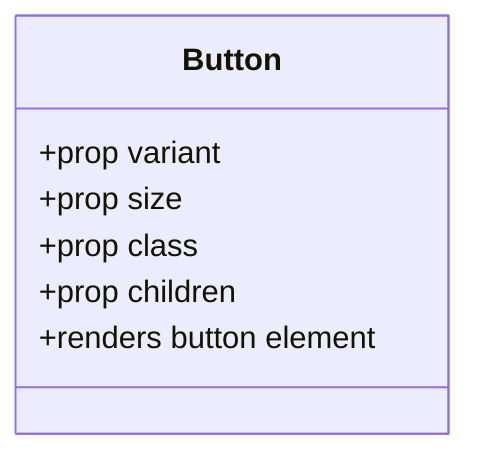
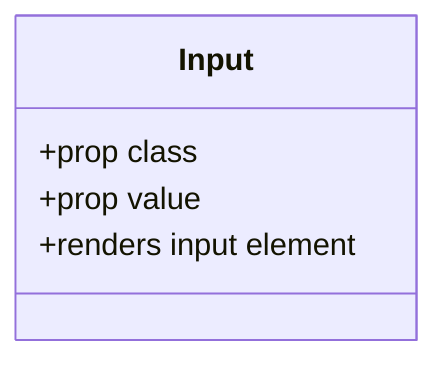
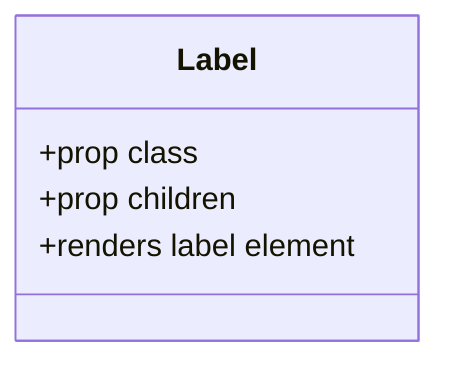
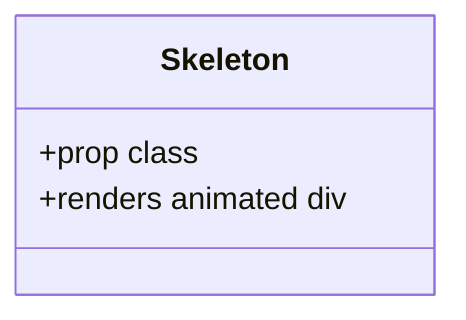
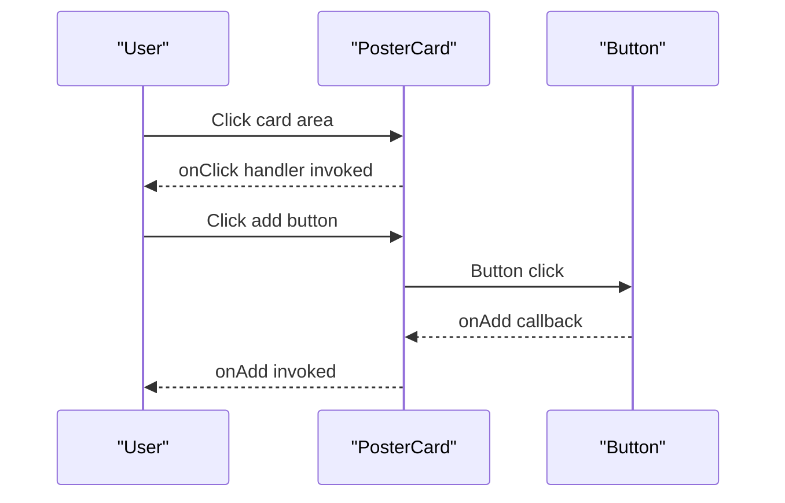
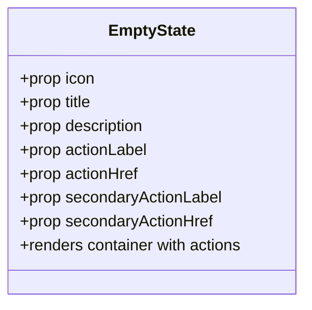
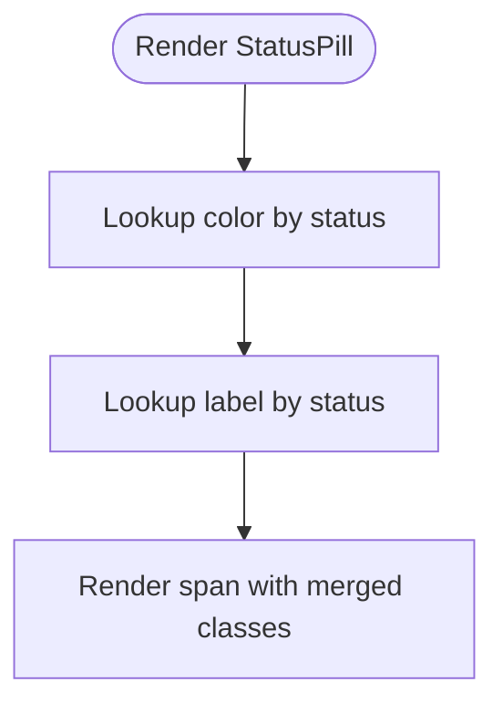
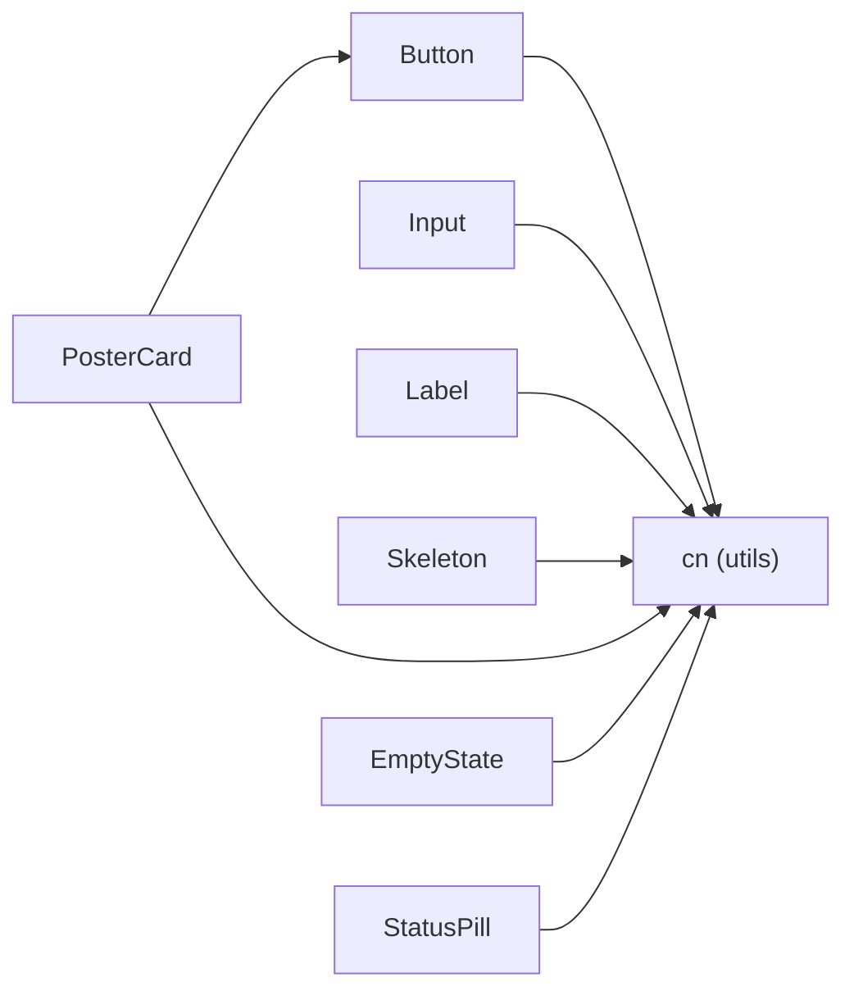

# Component Development

<cite>
**Referenced Files in This Document**
- [README.md](file://README.md)
- [package.json](file://package.json)
- [svelte.config.js](file://svelte.config.js)
- [src/lib/components/ui/index.ts](file://src/lib/components/ui/index.ts)
- [src/lib/components/custom/index.ts](file://src/lib/components/custom/index.ts)
- [src/lib/components/ui/button.svelte](file://src/lib/components/ui/button.svelte)
- [src/lib/components/ui/input.svelte](file://src/lib/components/ui/input.svelte)
- [src/lib/components/ui/label.svelte](file://src/lib/components/ui/label.svelte)
- [src/lib/components/ui/skeleton.svelte](file://src/lib/components/ui/skeleton.svelte)
- [src/lib/components/custom/poster-card.svelte](file://src/lib/components/custom/poster-card.svelte)
- [src/lib/components/custom/empty-state.svelte](file://src/lib/components/custom/empty-state.svelte)
- [src/lib/components/custom/status-pill.svelte](file://src/lib/components/custom/status-pill.svelte)
- [src/lib/utils.ts](file://src/lib/utils.ts)
</cite>

## Table of Contents
1. [Introduction](#introduction)
2. [Project Structure](#project-structure)
3. [Core Components](#core-components)
4. [Architecture Overview](#architecture-overview)
5. [Detailed Component Analysis](#detailed-component-analysis)
6. [Dependency Analysis](#dependency-analysis)
7. [Performance Considerations](#performance-considerations)
8. [Troubleshooting Guide](#troubleshooting-guide)
9. [Conclusion](#conclusion)
10. [Appendices](#appendices)

## Introduction
This document defines component development guidelines for Screenlog’s Svelte-based UI system. It focuses on reusable UI components and feature-specific custom components, covering creation patterns, props, events, slots, lifecycle/state management, inter-component communication, composition, styling, accessibility, testing, performance, and responsive design. The guidance is grounded in the existing codebase and aligns with the project’s tech stack and conventions.

## Project Structure
Screenlog organizes components under two primary categories:
- UI components: Reusable, generic building blocks (buttons, inputs, labels, skeletons)
- Custom components: Feature-specific wrappers and layout helpers (poster cards, empty states, status pills)

**Diagram sources**
- [src/lib/components/ui/index.ts:1-5](file://src/lib/components/ui/index.ts#L1-L5)
- [src/lib/components/custom/index.ts:1-4](file://src/lib/components/custom/index.ts#L1-L4)
- [src/lib/utils.ts:1-82](file://src/lib/utils.ts#L1-L82)

**Section sources**
- [README.md:90-110](file://README.md#L90-L110)
- [src/lib/components/ui/index.ts:1-5](file://src/lib/components/ui/index.ts#L1-L5)
- [src/lib/components/custom/index.ts:1-4](file://src/lib/components/custom/index.ts#L1-L4)

## Core Components
Reusable UI components define consistent behavior and styling across the app. They accept props for configuration, forward attributes, and expose minimal internal state. Examples:
- Button: Variant and size variants with Tailwind-based classes and optional children rendering
- Input: Bindable value with forwarded attributes and consistent styling
- Label: Minimal wrapper with children rendering
- Skeleton: Lightweight loading placeholder

Feature-specific custom components encapsulate domain logic and UI composition:
- PosterCard: Renders media posters, handles click/add actions, and displays metadata
- EmptyState: Presents icon, title, description, and optional actions
- StatusPill: Maps status values to color and label tokens

Key patterns:
- Props typing with explicit defaults and optional handlers
- Attribute forwarding for native element compatibility
- Composition via children rendering and optional icon injection
- Utility-driven styling with a shared cn helper

**Section sources**
- [src/lib/components/ui/button.svelte:1-45](file://src/lib/components/ui/button.svelte#L1-L45)
- [src/lib/components/ui/input.svelte:1-16](file://src/lib/components/ui/input.svelte#L1-L16)
- [src/lib/components/ui/label.svelte:1-11](file://src/lib/components/ui/label.svelte#L1-L11)
- [src/lib/components/ui/skeleton.svelte:1-8](file://src/lib/components/ui/skeleton.svelte#L1-L8)
- [src/lib/components/custom/poster-card.svelte:1-68](file://src/lib/components/custom/poster-card.svelte#L1-L68)
- [src/lib/components/custom/empty-state.svelte:1-44](file://src/lib/components/custom/empty-state.svelte#L1-L44)
- [src/lib/components/custom/status-pill.svelte:1-32](file://src/lib/components/custom/status-pill.svelte#L1-L32)
- [src/lib/utils.ts:1-6](file://src/lib/utils.ts#L1-L6)

## Architecture Overview
The component architecture separates concerns:
- UI layer: Generic, theme-aware primitives
- Custom layer: Domain-focused compositions built on UI primitives
- Utilities: Shared styling and formatting helpers

**Diagram sources**
- [src/lib/components/ui/button.svelte:1-45](file://src/lib/components/ui/button.svelte#L1-L45)
- [src/lib/components/ui/input.svelte:1-16](file://src/lib/components/ui/input.svelte#L1-L16)
- [src/lib/components/ui/label.svelte:1-11](file://src/lib/components/ui/label.svelte#L1-L11)
- [src/lib/components/ui/skeleton.svelte:1-8](file://src/lib/components/ui/skeleton.svelte#L1-L8)
- [src/lib/components/custom/poster-card.svelte:1-68](file://src/lib/components/custom/poster-card.svelte#L1-L68)
- [src/lib/components/custom/empty-state.svelte:1-44](file://src/lib/components/custom/empty-state.svelte#L1-L44)
- [src/lib/components/custom/status-pill.svelte:1-32](file://src/lib/components/custom/status-pill.svelte#L1-L32)
- [src/lib/utils.ts:1-6](file://src/lib/utils.ts#L1-L6)

## Detailed Component Analysis

### UI Button
- Purpose: Unified button primitive with variants and sizes
- Props: variant, size, class, forwarded attributes
- Rendering: Uses a cn helper for merging classes and applies variant/sizing maps
- Slots: Supports children rendering via a render slot
- Accessibility: Inherits button semantics; ensure aria-labels for icon-only buttons when needed

**Diagram sources**
- [src/lib/components/ui/button.svelte:1-45](file://src/lib/components/ui/button.svelte#L1-L45)

**Section sources**
- [src/lib/components/ui/button.svelte:1-45](file://src/lib/components/ui/button.svelte#L1-L45)

### UI Input
- Purpose: Text input primitive with bindable value
- Props: class, value (bindable), forwarded attributes
- Rendering: Applies consistent base styles and binds value for two-way binding
- Accessibility: Integrates naturally with Label; pair with Label for proper semantics

**Diagram sources**
- [src/lib/components/ui/input.svelte:1-16](file://src/lib/components/ui/input.svelte#L1-L16)

**Section sources**
- [src/lib/components/ui/input.svelte:1-16](file://src/lib/components/ui/input.svelte#L1-L16)

### UI Label
- Purpose: Associates text with form controls
- Props: class, children, forwarded attributes
- Rendering: Wraps content and forwards attributes to the underlying label

**Diagram sources**
- [src/lib/components/ui/label.svelte:1-11](file://src/lib/components/ui/label.svelte#L1-L11)

**Section sources**
- [src/lib/components/ui/label.svelte:1-11](file://src/lib/components/ui/label.svelte#L1-L11)

### UI Skeleton
- Purpose: Lightweight loading placeholder
- Props: class
- Rendering: Simple div with pulse animation

**Diagram sources**
- [src/lib/components/ui/skeleton.svelte:1-8](file://src/lib/components/ui/skeleton.svelte#L1-L8)

**Section sources**
- [src/lib/components/ui/skeleton.svelte:1-8](file://src/lib/components/ui/skeleton.svelte#L1-L8)

### Custom PosterCard
- Purpose: Media card with poster image, metadata, and optional add action
- Props: posterPath, title, year, type, genres, added, onAdd, onClick, class
- Rendering: Conditional image rendering, lazy loading, hover-triggered add button
- Inter-component communication: Composes Button and forwards click events; stops propagation for nested clicks
- Accessibility: Image alt set to title; ensure actionable elements have keyboard focus and visible focus styles

**Diagram sources**
- [src/lib/components/custom/poster-card.svelte:1-68](file://src/lib/components/custom/poster-card.svelte#L1-L68)
- [src/lib/components/ui/button.svelte:1-45](file://src/lib/components/ui/button.svelte#L1-L45)

**Section sources**
- [src/lib/components/custom/poster-card.svelte:1-68](file://src/lib/components/custom/poster-card.svelte#L1-L68)

### Custom EmptyState
- Purpose: Feature-level empty state with icon, title, description, and optional actions
- Props: icon, title, description, actionLabel/actionHref, secondaryActionLabel/secondaryActionHref
- Rendering: Conditional rendering of icon and action links; uses Tailwind classes for layout
- Composition: Accepts an icon component via prop for flexibility

**Diagram sources**
- [src/lib/components/custom/empty-state.svelte:1-44](file://src/lib/components/custom/empty-state.svelte#L1-L44)

**Section sources**
- [src/lib/components/custom/empty-state.svelte:1-44](file://src/lib/components/custom/empty-state.svelte#L1-L44)

### Custom StatusPill
- Purpose: Status indicator with color and label mapping
- Props: status, class
- Rendering: Maps status to color and label tokens; falls back gracefully for unknown statuses

**Diagram sources**
- [src/lib/components/custom/status-pill.svelte:1-32](file://src/lib/components/custom/status-pill.svelte#L1-L32)

**Section sources**
- [src/lib/components/custom/status-pill.svelte:1-32](file://src/lib/components/custom/status-pill.svelte#L1-L32)

## Dependency Analysis
Component dependencies are intentionally shallow and utility-driven:
- UI components depend on shared utilities for styling
- Custom components depend on UI primitives and utilities
- Utilities depend on Tailwind merge and clsx for class composition

**Diagram sources**
- [src/lib/components/ui/button.svelte:1-45](file://src/lib/components/ui/button.svelte#L1-L45)
- [src/lib/components/ui/input.svelte:1-16](file://src/lib/components/ui/input.svelte#L1-L16)
- [src/lib/components/ui/label.svelte:1-11](file://src/lib/components/ui/label.svelte#L1-L11)
- [src/lib/components/ui/skeleton.svelte:1-8](file://src/lib/components/ui/skeleton.svelte#L1-L8)
- [src/lib/components/custom/poster-card.svelte:1-68](file://src/lib/components/custom/poster-card.svelte#L1-L68)
- [src/lib/components/custom/empty-state.svelte:1-44](file://src/lib/components/custom/empty-state.svelte#L1-L44)
- [src/lib/components/custom/status-pill.svelte:1-32](file://src/lib/components/custom/status-pill.svelte#L1-L32)
- [src/lib/utils.ts:1-6](file://src/lib/utils.ts#L1-L6)

**Section sources**
- [src/lib/utils.ts:1-6](file://src/lib/utils.ts#L1-L6)
- [src/lib/components/ui/index.ts:1-5](file://src/lib/components/ui/index.ts#L1-L5)
- [src/lib/components/custom/index.ts:1-4](file://src/lib/components/custom/index.ts#L1-L4)

## Performance Considerations
- Prefer shallow props and avoid heavy computations in reactive statements
- Use lazy loading for images and conditional rendering for expensive slots
- Minimize re-renders by passing stable callbacks and avoiding unnecessary reactive declarations
- Utilize built-in Svelte features like bindable props for controlled inputs
- Keep component trees flat; compose via small, focused primitives

[No sources needed since this section provides general guidance]

## Troubleshooting Guide
Common issues and resolutions:
- Incorrect forwarded attributes: Ensure attributes are spread onto the native element
- Missing accessibility labels: Provide aria-label or associate labels with inputs
- Event bubbling conflicts: Stop propagation for nested interactive elements when necessary
- Styling overrides: Use the provided class prop and cn helper to merge classes safely

**Section sources**
- [src/lib/components/ui/button.svelte:34-44](file://src/lib/components/ui/button.svelte#L34-L44)
- [src/lib/components/ui/input.svelte:8-15](file://src/lib/components/ui/input.svelte#L8-L15)
- [src/lib/components/custom/poster-card.svelte:43-58](file://src/lib/components/custom/poster-card.svelte#L43-L58)

## Conclusion
Screenlog’s component system emphasizes reusable primitives, clear composition, and utility-driven styling. By following the patterns demonstrated in the UI and custom components, developers can build consistent, accessible, and maintainable features while preserving performance and responsiveness.

[No sources needed since this section summarizes without analyzing specific files]

## Appendices

### Component Creation Patterns
- Define props with explicit defaults and types
- Forward attributes to native elements for compatibility
- Use children rendering for flexible slot-like behavior
- Compose UI primitives for consistent styling and behavior
- Keep custom components feature-scoped and encapsulated

**Section sources**
- [src/lib/components/ui/button.svelte:5-15](file://src/lib/components/ui/button.svelte#L5-L15)
- [src/lib/components/ui/input.svelte:5-6](file://src/lib/components/ui/input.svelte#L5-L6)
- [src/lib/components/custom/poster-card.svelte:6-26](file://src/lib/components/custom/poster-card.svelte#L6-L26)
- [src/lib/components/custom/empty-state.svelte:4-20](file://src/lib/components/custom/empty-state.svelte#L4-L20)

### Styling Approaches
- Use the cn helper to merge Tailwind classes safely
- Centralize variant and size maps in UI components
- Apply consistent focus, disabled, and hover states
- Favor utility classes for quick iteration; extract shared styles into variants

**Section sources**
- [src/lib/utils.ts:4-6](file://src/lib/utils.ts#L4-L6)
- [src/lib/components/ui/button.svelte:17-31](file://src/lib/components/ui/button.svelte#L17-L31)

### Accessibility Implementation
- Pair labels with inputs and ensure visible focus states
- Provide meaningful aria-labels for icon-only buttons
- Use semantic elements (button, label) and ensure keyboard operability
- Respect disabled states and provide appropriate visual feedback

**Section sources**
- [src/lib/components/ui/button.svelte:34-44](file://src/lib/components/ui/button.svelte#L34-L44)
- [src/lib/components/ui/label.svelte:8-10](file://src/lib/components/ui/label.svelte#L8-L10)

### Inter-Component Communication
- Pass callbacks as props for parent-child communication
- Stop event propagation when nested interactive elements share the same container
- Use bindable props for controlled inputs to centralize state

**Section sources**
- [src/lib/components/custom/poster-card.svelte:13-25](file://src/lib/components/custom/poster-card.svelte#L13-L25)
- [src/lib/components/custom/poster-card.svelte:43-58](file://src/lib/components/custom/poster-card.svelte#L43-L58)
- [src/lib/components/ui/input.svelte:13-14](file://src/lib/components/ui/input.svelte#L13-L14)

### Testing Strategies
- Unit-test component props and rendering by mounting components and asserting DOM output
- Mock external utilities (e.g., cn, image helpers) to isolate component logic
- Verify event handlers by simulating user interactions and asserting callback invocations
- Test variant and size rendering by passing different prop combinations

[No sources needed since this section provides general guidance]

### Responsive Design Patterns
- Use Tailwind responsive prefixes to adapt layouts across breakpoints
- Prefer aspect ratios and padding utilities for consistent media presentation
- Ensure touch-friendly targets and spacing on small screens

**Section sources**
- [src/lib/components/custom/poster-card.svelte:29-67](file://src/lib/components/custom/poster-card.svelte#L29-L67)

### Well-Structured Component Examples
- UI Button: Demonstrates variant and size mapping, children rendering, and attribute forwarding
- UI Input: Shows bindable value and attribute forwarding
- Custom PosterCard: Composes UI primitives, handles click and add actions, and renders conditional content
- Custom EmptyState: Accepts an icon component and renders optional actions
- Custom StatusPill: Maps status to color and label tokens

**Section sources**
- [src/lib/components/ui/button.svelte:1-45](file://src/lib/components/ui/button.svelte#L1-L45)
- [src/lib/components/ui/input.svelte:1-16](file://src/lib/components/ui/input.svelte#L1-L16)
- [src/lib/components/custom/poster-card.svelte:1-68](file://src/lib/components/custom/poster-card.svelte#L1-L68)
- [src/lib/components/custom/empty-state.svelte:1-44](file://src/lib/components/custom/empty-state.svelte#L1-L44)
- [src/lib/components/custom/status-pill.svelte:1-32](file://src/lib/components/custom/status-pill.svelte#L1-L32)

### Anti-Patterns to Avoid
- Avoid inline styles; prefer utility classes and variants
- Do not hardcode colors or spacing; use theme tokens and the cn helper
- Do not render heavy content in slots without conditional checks
- Do not forget to forward attributes to native elements
- Do not mix feature logic with UI primitives; keep custom components feature-scoped

**Section sources**
- [src/lib/components/ui/button.svelte:34-44](file://src/lib/components/ui/button.svelte#L34-L44)
- [src/lib/components/ui/input.svelte:8-15](file://src/lib/components/ui/input.svelte#L8-L15)
- [src/lib/components/custom/poster-card.svelte:43-58](file://src/lib/components/custom/poster-card.svelte#L43-L58)