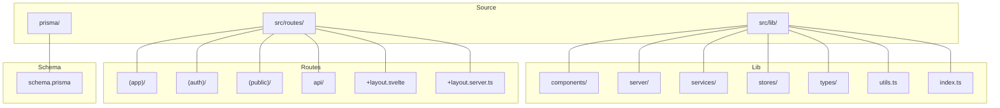
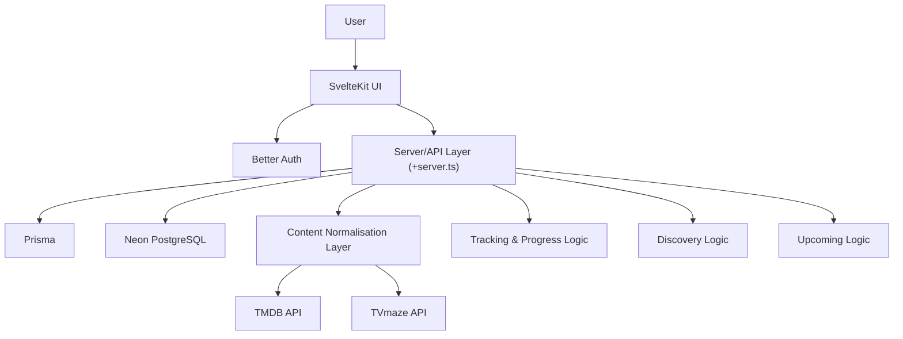
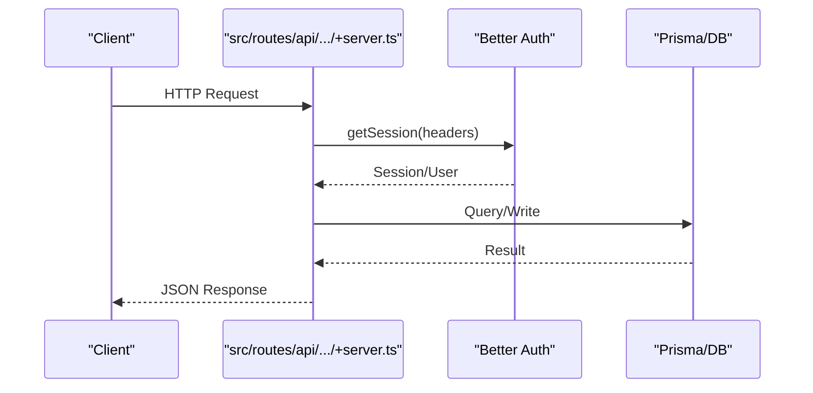
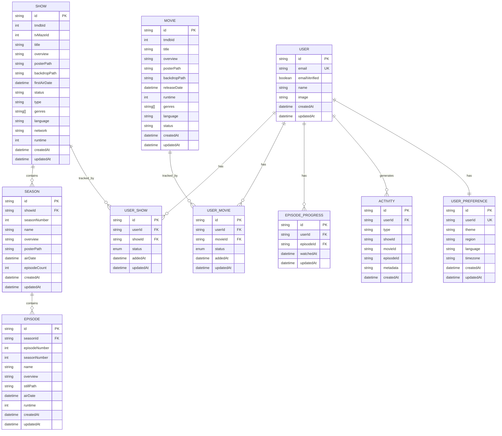
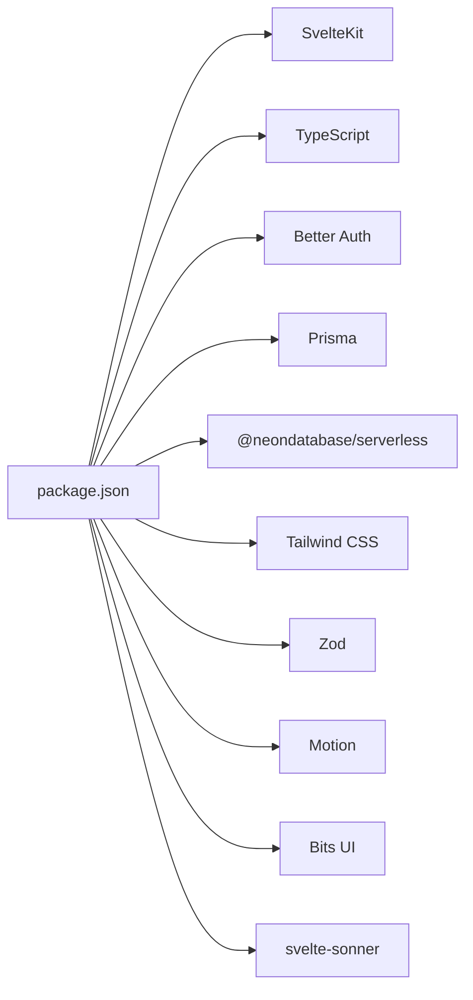

# Development Guidelines

<cite>
**Referenced Files in This Document**
- [README.md](file://README.md)
- [DESIGN.MD](file://DESIGN.MD)
- [SPEC.MD](file://SPEC.MD)
- [package.json](file://package.json)
- [tsconfig.json](file://tsconfig.json)
- [svelte.config.js](file://svelte.config.js)
- [vite.config.ts](file://vite.config.ts)
- [src/app.d.ts](file://src/app.d.ts)
- [src/hooks.server.ts](file://src/hooks.server.ts)
- [src/routes/+layout.svelte](file://src/routes/+layout.svelte)
- [src/lib/utils.ts](file://src/lib/utils.ts)
- [src/lib/index.ts](file://src/lib/index.ts)
- [prisma/schema.prisma](file://prisma/schema.prisma)
</cite>

## Table of Contents
1. [Introduction](#introduction)
2. [Project Structure](#project-structure)
3. [Core Components](#core-components)
4. [Architecture Overview](#architecture-overview)
5. [Detailed Component Analysis](#detailed-component-analysis)
6. [Dependency Analysis](#dependency-analysis)
7. [Performance Considerations](#performance-considerations)
8. [Troubleshooting Guide](#troubleshooting-guide)
9. [Conclusion](#conclusion)
10. [Appendices](#appendices)

## Introduction
This document provides comprehensive development guidelines for Screenlog, a modern, mobile-first watch tracker for TV shows, movies, and anime. It establishes coding standards, architectural patterns, and development workflows aligned with the existing codebase. It covers component development standards, API endpoint creation patterns, service layer implementation guidelines, project structure conventions, naming patterns, file organization principles, TypeScript usage guidelines, Svelte component best practices, state management patterns, code review processes, testing strategies, and deployment procedures. It also outlines how to extend functionality, add new features, and maintain code quality throughout the development lifecycle.

## Project Structure
Screenlog follows a SvelteKit-based monorepo-like structure under src/. The primary areas are:
- src/lib: Shared libraries including UI components, server-only code, services, stores, types, and utilities.
- src/routes: Pages and API endpoints organized by route groups and conventions.
- prisma/: Database schema and migrations.
- Root configs for TypeScript, SvelteKit, Vite, and package scripts.

Key conventions observed:
- Route groupings such as (app), (auth), (public) to separate authenticated, auth, and public pages.
- API endpoints under src/routes/api/ with +server.ts files for server logic.
- UI pages under src/routes/(app)/ and src/routes/(public)/ with +page.svelte files.
- Utilities centralized in src/lib/utils.ts for shared helpers.
- Global app typing in src/app.d.ts and server hooks in src/hooks.server.ts.

**Diagram sources**
- [src/lib/index.ts:1-2](file://src/lib/index.ts#L1-L2)
- [src/lib/utils.ts:1-82](file://src/lib/utils.ts#L1-L82)
- [src/routes/+layout.svelte:1-25](file://src/routes/+layout.svelte#L1-L25)
- [prisma/schema.prisma:1-258](file://prisma/schema.prisma#L1-L258)

**Section sources**
- [README.md:90-110](file://README.md#L90-L110)
- [DESIGN.MD:243-274](file://DESIGN.MD#L243-L274)

## Core Components
This section documents the foundational building blocks and their roles in the system.

- UI Layer
  - Pages and components are implemented using SvelteKit and Svelte. The layout initializes theme handling and toast notifications globally.
  - Utilities in utils.ts centralize formatting and image URL helpers.

- Server/API Layer
  - Server hooks integrate Better Auth session resolution into locals for protected routes.
  - API endpoints under src/routes/api/ implement server logic with +server.ts.

- Content Integration Layer
  - Services for external APIs (TMDB, TVmaze) are located under src/lib/services/.

- Tracking Logic Layer
  - Implemented in server handlers and services; database models under prisma/schema.prisma define persistence for shows, seasons, episodes, movies, user progress, and preferences.

- Persistence Layer
  - Prisma models encapsulate relational data for users, sessions, content metadata, watchlist relationships, progress, and activity.

Best practices derived from the codebase:
- Keep UI components declarative and stateless where possible; delegate side effects to server actions and stores.
- Centralize shared helpers in utils.ts to reduce duplication and improve testability.
- Enforce strict TypeScript usage and type-safe local/session typing via app.d.ts.

**Section sources**
- [src/routes/+layout.svelte:1-25](file://src/routes/+layout.svelte#L1-L25)
- [src/lib/utils.ts:1-82](file://src/lib/utils.ts#L1-L82)
- [src/hooks.server.ts:1-18](file://src/hooks.server.ts#L1-L18)
- [src/app.d.ts:1-23](file://src/app.d.ts#L1-L23)
- [prisma/schema.prisma:1-258](file://prisma/schema.prisma#L1-L258)

## Architecture Overview
The system architecture separates concerns across UI, server/API, content integration, tracking logic, and persistence layers. External API calls are restricted to the server, and UI consumes normalized internal payloads.

**Diagram sources**
- [DESIGN.MD:243-274](file://DESIGN.MD#L243-L274)

## Detailed Component Analysis

### TypeScript Usage Guidelines
- Strict TypeScript configuration ensures robust type checking across the project.
- Use app.d.ts to augment SvelteKit’s App namespace for typed locals, session, and page data.
- Prefer explicit types for props, events, and return values in components and services.
- Leverage path aliases ($lib) to keep imports concise and maintainable.

**Section sources**
- [tsconfig.json:1-21](file://tsconfig.json#L1-L21)
- [src/app.d.ts:1-23](file://src/app.d.ts#L1-L23)

### Svelte Component Best Practices
- Use runes mode for reactive state and granular updates.
- Initialize global theme and notifications in the root layout.
- Keep components small, composable, and focused on a single responsibility.
- Use centralized utilities for formatting and image URLs to ensure consistency.

**Section sources**
- [svelte.config.js:1-18](file://svelte.config.js#L1-L18)
- [src/routes/+layout.svelte:1-25](file://src/routes/+layout.svelte#L1-L25)
- [src/lib/utils.ts:1-82](file://src/lib/utils.ts#L1-L82)

### State Management Patterns
- Use Svelte stores for cross-component state where appropriate.
- Keep server-managed session state in locals via hooks to avoid exposing sensitive data to the client.
- Normalize UI state from server responses to minimize client-side complexity.

**Section sources**
- [src/hooks.server.ts:1-18](file://src/hooks.server.ts#L1-L18)
- [src/app.d.ts:1-23](file://src/app.d.ts#L1-L23)

### API Endpoint Creation Patterns
- Place server logic under src/routes/api/<route>/+server.ts.
- Use Better Auth to protect endpoints and access session data from locals.
- Return normalized JSON payloads to the UI; avoid leaking raw external API responses.
- Implement proper error handling and status codes.

**Diagram sources**
- [src/hooks.server.ts:1-18](file://src/hooks.server.ts#L1-L18)

**Section sources**
- [src/hooks.server.ts:1-18](file://src/hooks.server.ts#L1-L18)

### Service Layer Implementation Guidelines
- External API integrations belong under src/lib/services/.
- Centralize HTTP calls, error handling, and response normalization in services.
- Keep API keys server-side and never expose them in the browser.
- Cache or store useful content after first fetch to reduce repeated external calls.

**Section sources**
- [DESIGN.MD:315-325](file://DESIGN.MD#L315-L325)

### Component Development Standards
- UI components live under src/lib/components/.
- Use library components (shadcn-svelte, Bits UI) for common controls.
- Maintain consistent naming and file organization to improve discoverability.
- Export a barrel index via src/lib/index.ts to simplify imports.

**Section sources**
- [src/lib/index.ts:1-2](file://src/lib/index.ts#L1-L2)
- [DESIGN.MD:787-800](file://DESIGN.MD#L787-L800)

### Data Models and Persistence
- Prisma models define the schema for users, sessions, content metadata, watchlist relationships, progress, and preferences.
- Use enums for statuses (ShowStatus, MovieStatus) to enforce valid states.
- Index frequently queried columns (e.g., activity) to optimize performance.

**Diagram sources**
- [prisma/schema.prisma:1-258](file://prisma/schema.prisma#L1-L258)

**Section sources**
- [prisma/schema.prisma:1-258](file://prisma/schema.prisma#L1-L258)

## Dependency Analysis
The project relies on a cohesive set of dependencies for frontend, backend, authentication, database, and styling.

**Diagram sources**
- [package.json:1-47](file://package.json#L1-L47)

**Section sources**
- [package.json:1-47](file://package.json#L1-L47)

## Performance Considerations
- Minimize client-side work by delegating heavy logic to server endpoints.
- Cache normalized content server-side to reduce repeated external API calls.
- Use efficient Prisma queries and indexes for frequently accessed data (e.g., activity).
- Keep UI updates granular with Svelte runes to avoid unnecessary re-renders.
- Prefer lazy loading for images and defer non-critical resources.

## Troubleshooting Guide
Common areas to inspect during development and debugging:
- Environment variables and database connectivity for Prisma migrations and seeding.
- Server hooks for session resolution and user context propagation.
- API endpoints for proper error handling and normalized responses.
- UI layout initialization for theme and toast configuration.

Operational checks:
- Verify Prisma schema and migrations are applied.
- Confirm Better Auth configuration and session retrieval in hooks.
- Ensure API endpoints return consistent JSON payloads.
- Validate TypeScript compilation and Svelte checks.

**Section sources**
- [README.md:73-89](file://README.md#L73-L89)
- [src/hooks.server.ts:1-18](file://src/hooks.server.ts#L1-L18)
- [src/routes/+layout.svelte:1-25](file://src/routes/+layout.svelte#L1-L25)

## Conclusion
These guidelines consolidate the established patterns and standards in Screenlog. By adhering to the architectural layers, component and service conventions, TypeScript and Svelte best practices, and the outlined workflows, contributors can extend functionality reliably, maintain code quality, and ensure a consistent user experience across devices.

## Appendices

### Development Workflows
- Local setup: Install dependencies, configure environment variables, run Prisma migrations, and start the dev server.
- Code review: Focus on adherence to layer separation, type safety, and UI consistency.
- Testing: Use SvelteKit’s testing utilities and unit tests for services and utilities; validate API responses and UI behavior.
- Deployment: Build for production, preview the bundle, and deploy using the configured adapter.

**Section sources**
- [README.md:27-89](file://README.md#L27-L89)
- [package.json:7-14](file://package.json#L7-L14)