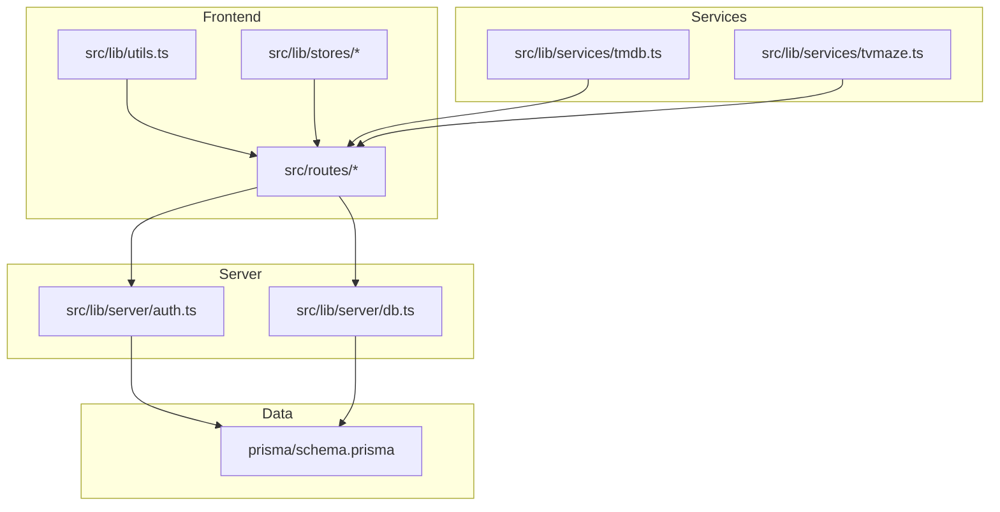
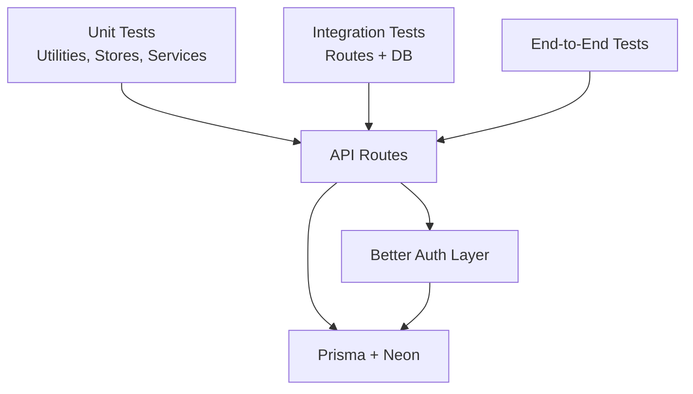
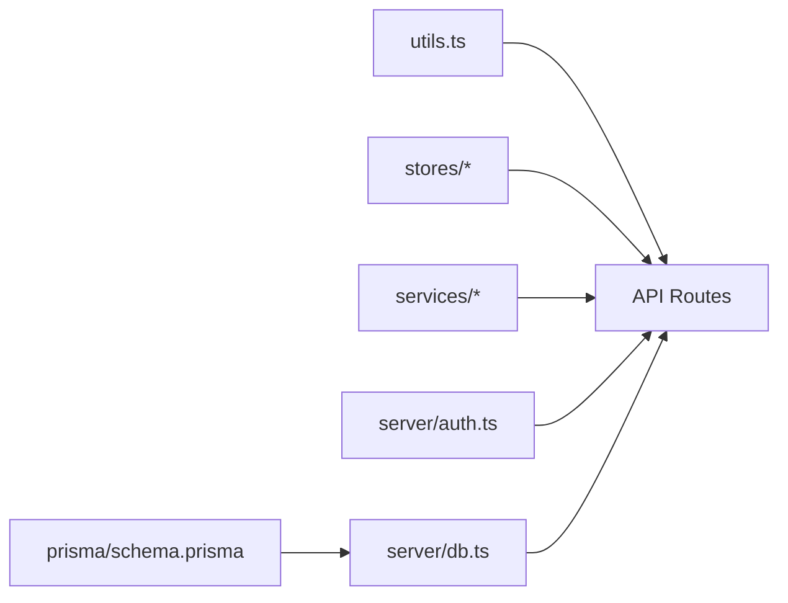

# Testing Strategy

<cite>
**Referenced Files in This Document**
- [package.json](file://package.json)
- [README.md](file://README.md)
- [src/lib/utils.ts](file://src/lib/utils.ts)
- [src/lib/server/auth.ts](file://src/lib/server/auth.ts)
- [src/lib/server/db.ts](file://src/lib/server/db.ts)
- [src/lib/services/tmdb.ts](file://src/lib/services/tmdb.ts)
- [src/lib/services/tvmaze.ts](file://src/lib/services/tvmaze.ts)
- [src/lib/stores/preferences.ts](file://src/lib/stores/preferences.ts)
- [src/lib/stores/theme.ts](file://src/lib/stores/theme.ts)
- [src/lib/types/content.ts](file://src/lib/types/content.ts)
- [src/hooks.server.ts](file://src/hooks.server.ts)
- [prisma/schema.prisma](file://prisma/schema.prisma)
- [src/routes/api/auth/[...all]/+server.ts](file://src/routes/api/auth/[...all]/+server.ts)
- [src/routes/api/calendar/+server.ts](file://src/routes/api/calendar/+server.ts)
- [src/routes/api/discover/+server.ts](file://src/routes/api/discover/+server.ts)
- [src/routes/api/lookup/+server.ts](file://src/routes/api/lookup/+server.ts)
- [src/routes/api/movies/[id]/+server.ts](file://src/routes/api/movies/[id]/+server.ts)
- [src/routes/api/profile/+server.ts](file://src/routes/api/profile/+server.ts)
- [src/routes/api/progress/+server.ts](file://src/routes/api/progress/+server.ts)
- [src/routes/api/search/+server.ts](file://src/routes/api/search/+server.ts)
- [src/routes/api/settings/+server.ts](file://src/routes/api/settings/+server.ts)
- [src/routes/api/shows/[id]/+server.ts](file://src/routes/api/shows/[id]/+server.ts)
- [src/routes/api/watchlist/+server.ts](file://src/routes/api/watchlist/+server.ts)
</cite>

## Table of Contents
1. [Introduction](#introduction)
2. [Project Structure](#project-structure)
3. [Core Components](#core-components)
4. [Architecture Overview](#architecture-overview)
5. [Detailed Component Analysis](#detailed-component-analysis)
6. [Dependency Analysis](#dependency-analysis)
7. [Performance Considerations](#performance-considerations)
8. [Troubleshooting Guide](#troubleshooting-guide)
9. [Conclusion](#conclusion)
10. [Appendices](#appendices)

## Introduction
This document defines a comprehensive testing strategy for Screenlog, covering unit tests for components, services, and utilities; integration tests for API endpoints and database operations; and guidance for end-to-end testing. It also outlines frameworks, mocking strategies, environment setup, coverage expectations, CI patterns, and automated workflows tailored to the current stack: SvelteKit, Better Auth, Prisma, Neon PostgreSQL, and external APIs (TMDB, TVmaze).

## Project Structure
Screenlog follows a SvelteKit project layout with clear separation of concerns:
- Utilities and helpers live under src/lib/utils.ts.
- Server-side authentication and database access live under src/lib/server/.
- External API integrations live under src/lib/services/.
- Svelte stores for UI state live under src/lib/stores/.
- API routes live under src/routes/api/.
- Database schema is defined in prisma/schema.prisma.

**Diagram sources**
- [src/lib/utils.ts:1-82](file://src/lib/utils.ts#L1-L82)
- [src/lib/server/auth.ts](file://src/lib/server/auth.ts)
- [src/lib/server/db.ts](file://src/lib/server/db.ts)
- [src/lib/services/tmdb.ts](file://src/lib/services/tmdb.ts)
- [src/lib/services/tvmaze.ts](file://src/lib/services/tvmaze.ts)
- [prisma/schema.prisma:1-258](file://prisma/schema.prisma#L1-L258)

**Section sources**
- [README.md:90-110](file://README.md#L90-L110)
- [package.json:1-47](file://package.json#L1-L47)

## Core Components
This section identifies core testing targets and their roles:
- Utilities: Formatting helpers, URL builders, timezone retrieval, and class merging.
- Services: TMDB and TVmaze integrations for metadata and episode data.
- Stores: Theme and preferences stores for reactive UI state.
- Server: Authentication and database access modules.
- API routes: HTTP endpoints implementing business logic and data access.

Key responsibilities for testing:
- Utilities: Validate deterministic transformations and edge cases (nulls, empty inputs).
- Services: Mock external HTTP responses; assert parsing and error handling.
- Stores: Verify derived state updates and persistence hooks.
- Server: Validate session retrieval, user/session population, and DB queries.
- API routes: Validate request parsing, auth guards, response shapes, and error propagation.

**Section sources**
- [src/lib/utils.ts:1-82](file://src/lib/utils.ts#L1-L82)
- [src/lib/services/tmdb.ts](file://src/lib/services/tmdb.ts)
- [src/lib/services/tvmaze.ts](file://src/lib/services/tvmaze.ts)
- [src/lib/stores/preferences.ts](file://src/lib/stores/preferences.ts)
- [src/lib/stores/theme.ts](file://src/lib/stores/theme.ts)
- [src/lib/server/auth.ts](file://src/lib/server/auth.ts)
- [src/lib/server/db.ts](file://src/lib/server/db.ts)

## Architecture Overview
The testing architecture aligns with the layered codebase:
- Unit tests for pure functions and small units.
- Integration tests for API routes and database interactions.
- End-to-end tests for user journeys across pages and protected routes.
- Mock external services for determinism and isolation.

[No sources needed since this diagram shows conceptual workflow, not actual code structure]

## Detailed Component Analysis

### Utilities Testing (src/lib/utils.ts)
Approach:
- Test deterministic functions: formatting dates, runtime, initials, poster/backdrop URLs.
- Edge-case coverage: null/undefined inputs, invalid dates, empty arrays.
- Timezone fallback behavior.

Recommended test scenarios:
- Format date/time functions with various inputs and timezones.
- Runtime formatting for zero, hours, and minutes.
- Initials extraction for single/multiple names and empty inputs.
- Poster/backdrop URL construction with absolute and relative paths.
- Timezone enumeration fallback when Intl is unavailable.

Mocking strategy:
- No external dependencies; pure functions. Use parameterized tests for inputs.

Coverage target:
- Aim for high coverage (>90%) on utility functions.

**Section sources**
- [src/lib/utils.ts:1-82](file://src/lib/utils.ts#L1-L82)

### Svelte Stores Testing (theme, preferences)
Approach:
- Verify initial state, derived computations, and reactive updates.
- Test persistence hooks if present.
- Simulate store subscriptions and state transitions.

Recommended test scenarios:
- Theme store toggling and persisted values.
- Preferences store default values and updates.
- Derived selectors and computed styles.

Mocking strategy:
- Use Svelte’s testing utilities to create minimal DOM and subscribe to stores.
- Stub localStorage if persistence is involved.

Coverage target:
- Aim for high coverage on store logic and derived computations.

**Section sources**
- [src/lib/stores/theme.ts](file://src/lib/stores/theme.ts)
- [src/lib/stores/preferences.ts](file://src/lib/stores/preferences.ts)

### External API Services Testing (TMDB, TVmaze)
Approach:
- Wrap fetch calls behind service functions.
- Mock HTTP responses using fetch mocks or interceptors.
- Validate parsing, error handling, and retry/backoff if applicable.

Recommended test scenarios:
- Successful responses for movies, shows, episodes.
- Error responses and timeouts.
- Parsing edge cases (missing fields, empty arrays).
- Rate-limit simulation and backoff behavior.

Mocking strategy:
- Use a fetch mock library to stub network requests.
- Snapshot or schema-validate parsed entities.

Coverage target:
- High coverage on parsing and error branches.

**Section sources**
- [src/lib/services/tmdb.ts](file://src/lib/services/tmdb.ts)
- [src/lib/services/tvmaze.ts](file://src/lib/services/tvmaze.ts)

### Server Authentication and Hooks Testing
Approach:
- Validate session retrieval and user/session population in hooks.
- Test error handling paths when auth fails.
- Verify protected route guards via route handlers.

Recommended test scenarios:
- Hook populates event.locals with valid session.
- Hook gracefully handles missing/invalid session.
- API routes enforce auth and return appropriate errors.

Mocking strategy:
- Stub Better Auth API responses.
- Use SvelteKit’s test server to simulate requests.

Coverage target:
- High coverage on auth guard logic and error paths.

**Section sources**
- [src/hooks.server.ts:1-18](file://src/hooks.server.ts#L1-L18)
- [src/lib/server/auth.ts](file://src/lib/server/auth.ts)

### Database Access and Prisma Testing
Approach:
- Use Prisma Client in tests with a test database.
- Seed test data and assert CRUD operations.
- Validate referential integrity and enums.

Recommended test scenarios:
- Create, read, update, delete for content and user entities.
- Cross-table relations (Show <-> Season <-> Episode).
- Enum validation and unique constraints.

Mocking strategy:
- Use a dedicated test Postgres instance or Docker container.
- Use Prisma Migrate and seed scripts for test setup.

Coverage target:
- High coverage on core queries and mutations.

**Section sources**
- [src/lib/server/db.ts](file://src/lib/server/db.ts)
- [prisma/schema.prisma:1-258](file://prisma/schema.prisma#L1-L258)

### API Endpoint Testing Patterns
Approach:
- Test request parsing, validation, auth guards, and response shape.
- Use SvelteKit’s test server to send requests to endpoints.
- Mock Better Auth and Prisma Client for isolation.

Recommended test scenarios per endpoint group:
- Auth endpoints: session creation, sign-in/sign-out flows.
- Discover/Search/Lookup: pagination, filters, and error responses.
- Profile/Settings: user preferences, protected writes.
- Calendar/Progress: derived calculations and aggregation.
- Watchlist: add/remove items and status updates.

Mocking strategy:
- Mock Better Auth session retrieval.
- Mock Prisma queries/mutations.
- Snapshot or schema-validate JSON responses.

Coverage target:
- High coverage on happy paths and error branches.

**Section sources**
- [src/routes/api/auth/[...all]/+server.ts](file://src/routes/api/auth/[...all]/+server.ts)
- [src/routes/api/calendar/+server.ts](file://src/routes/api/calendar/+server.ts)
- [src/routes/api/discover/+server.ts](file://src/routes/api/discover/+server.ts)
- [src/routes/api/lookup/+server.ts](file://src/routes/api/lookup/+server.ts)
- [src/routes/api/movies/[id]/+server.ts](file://src/routes/api/movies/[id]/+server.ts)
- [src/routes/api/profile/+server.ts](file://src/routes/api/profile/+server.ts)
- [src/routes/api/progress/+server.ts](file://src/routes/api/progress/+server.ts)
- [src/routes/api/search/+server.ts](file://src/routes/api/search/+server.ts)
- [src/routes/api/settings/+server.ts](file://src/routes/api/settings/+server.ts)
- [src/routes/api/shows/[id]/+server.ts](file://src/routes/api/shows/[id]/+server.ts)
- [src/routes/api/watchlist/+server.ts](file://src/routes/api/watchlist/+server.ts)

### End-to-End Testing Approaches
Approach:
- Use Playwright or similar to automate browser interactions.
- Test authenticated flows, navigation, and protected routes.
- Validate UI state updates driven by stores and server responses.

Recommended test scenarios:
- Landing page and navigation.
- Sign-in/sign-up flows.
- Content discovery and detail pages.
- Calendar and progress views.
- Settings and preferences updates.

Mocking strategy:
- Optionally mock external APIs for deterministic runs.
- Use isolated test databases per run.

Coverage target:
- Critical user journeys and regression coverage.

[No sources needed since this section provides general guidance]

## Dependency Analysis
Testing dependencies and coupling:
- Utilities are pure and low-coupling; easy to unit test in isolation.
- Services depend on external HTTP; isolate with mocks.
- Stores depend on reactive updates; test derived state and subscriptions.
- Server depends on Better Auth and Prisma; isolate with mocks/fakes.
- API routes depend on server modules; test with mocked dependencies.

**Diagram sources**
- [src/lib/utils.ts:1-82](file://src/lib/utils.ts#L1-L82)
- [src/lib/stores/preferences.ts](file://src/lib/stores/preferences.ts)
- [src/lib/stores/theme.ts](file://src/lib/stores/theme.ts)
- [src/lib/services/tmdb.ts](file://src/lib/services/tmdb.ts)
- [src/lib/services/tvmaze.ts](file://src/lib/services/tvmaze.ts)
- [src/lib/server/auth.ts](file://src/lib/server/auth.ts)
- [src/lib/server/db.ts](file://src/lib/server/db.ts)
- [prisma/schema.prisma:1-258](file://prisma/schema.prisma#L1-L258)

**Section sources**
- [src/lib/utils.ts:1-82](file://src/lib/utils.ts#L1-L82)
- [src/lib/stores/preferences.ts](file://src/lib/stores/preferences.ts)
- [src/lib/stores/theme.ts](file://src/lib/stores/theme.ts)
- [src/lib/services/tmdb.ts](file://src/lib/services/tmdb.ts)
- [src/lib/services/tvmaze.ts](file://src/lib/services/tvmaze.ts)
- [src/lib/server/auth.ts](file://src/lib/server/auth.ts)
- [src/lib/server/db.ts](file://src/lib/server/db.ts)
- [prisma/schema.prisma:1-258](file://prisma/schema.prisma#L1-L258)

## Performance Considerations
- Prefer in-memory mocks for fast unit tests.
- Use lightweight test databases for integration tests.
- Parallelize independent tests; avoid shared mutable state.
- Snapshot tests for API responses to detect unexpected changes.
- Limit external network calls in CI; rely on mocks.

[No sources needed since this section provides general guidance]

## Troubleshooting Guide
Common issues and resolutions:
- Authentication failures in tests: ensure Better Auth mock returns expected session; verify headers passed to hooks.
- Database flaky tests: use transaction rollbacks or separate test schemas; seed deterministically.
- External API instability: always mock network calls; validate error branches.
- Store subscription issues: create minimal DOM and subscribe to stores before assertions.

**Section sources**
- [src/hooks.server.ts:1-18](file://src/hooks.server.ts#L1-L18)
- [src/lib/server/auth.ts](file://src/lib/server/auth.ts)
- [src/lib/server/db.ts](file://src/lib/server/db.ts)

## Conclusion
A robust testing strategy for Screenlog emphasizes:
- Pure unit tests for utilities and stores.
- Service tests with comprehensive HTTP mocking.
- Integration tests for API routes and database operations.
- End-to-end tests for critical user journeys.
- Strong coverage targets and CI automation to maintain quality.

[No sources needed since this section summarizes without analyzing specific files]

## Appendices

### Test Environment Setup
- Use a test database (Postgres) and Prisma Migrate for schema initialization.
- Configure environment variables for Better Auth and external APIs in tests.
- Use SvelteKit’s test server to run API tests against mocked dependencies.

**Section sources**
- [README.md:73-82](file://README.md#L73-L82)
- [prisma/schema.prisma:1-8](file://prisma/schema.prisma#L1-L8)

### Continuous Integration and Coverage
- Run unit and integration tests on pull requests.
- Enforce coverage thresholds per module.
- Use caching for dependencies and database initialization in CI.

**Section sources**
- [package.json:7-14](file://package.json#L7-L14)

### Example Test Scenarios (by file)
- Utilities: Parameterized tests for formatting functions and URL builders.
- Stores: Verify initial state and derived values after updates.
- Services: Mock HTTP responses and assert parsed entities.
- Server: Validate session population and error handling.
- API routes: Test auth guards, request validation, and response shapes.

**Section sources**
- [src/lib/utils.ts:1-82](file://src/lib/utils.ts#L1-L82)
- [src/lib/stores/preferences.ts](file://src/lib/stores/preferences.ts)
- [src/lib/stores/theme.ts](file://src/lib/stores/theme.ts)
- [src/lib/services/tmdb.ts](file://src/lib/services/tmdb.ts)
- [src/lib/services/tvmaze.ts](file://src/lib/services/tvmaze.ts)
- [src/hooks.server.ts:1-18](file://src/hooks.server.ts#L1-L18)
- [src/lib/server/auth.ts](file://src/lib/server/auth.ts)
- [src/lib/server/db.ts](file://src/lib/server/db.ts)
- [src/routes/api/discover/+server.ts](file://src/routes/api/discover/+server.ts)
- [src/routes/api/search/+server.ts](file://src/routes/api/search/+server.ts)
- [src/routes/api/profile/+server.ts](file://src/routes/api/profile/+server.ts)
- [src/routes/api/calendar/+server.ts](file://src/routes/api/calendar/+server.ts)
- [src/routes/api/progress/+server.ts](file://src/routes/api/progress/+server.ts)
- [src/routes/api/watchlist/+server.ts](file://src/routes/api/watchlist/+server.ts)
- [src/routes/api/movies/[id]/+server.ts](file://src/routes/api/movies/[id]/+server.ts)
- [src/routes/api/shows/[id]/+server.ts](file://src/routes/api/shows/[id]/+server.ts)
- [src/routes/api/lookup/+server.ts](file://src/routes/api/lookup/+server.ts)
- [src/routes/api/settings/+server.ts](file://src/routes/api/settings/+server.ts)
- [src/routes/api/auth/[...all]/+server.ts](file://src/routes/api/auth/[...all]/+server.ts)