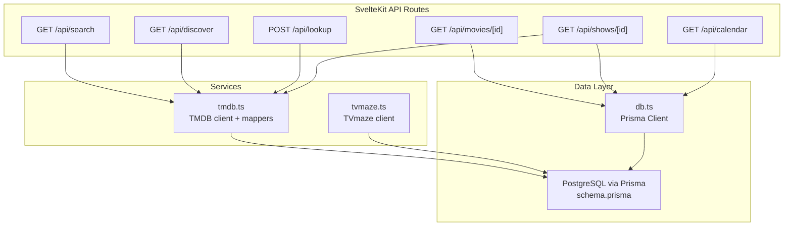
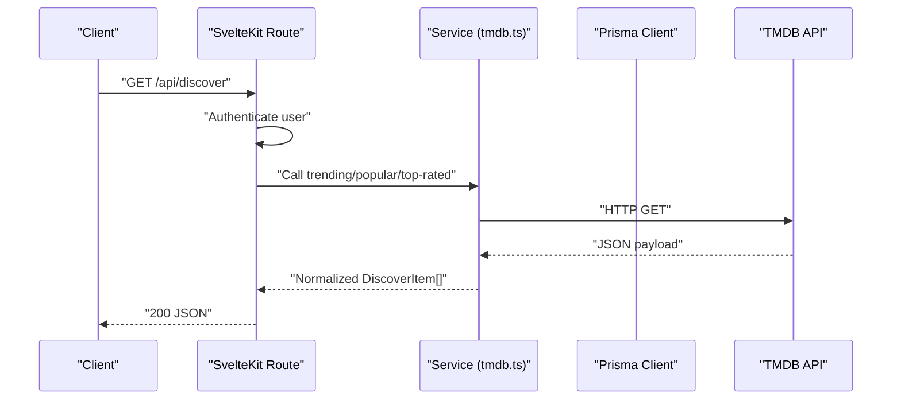
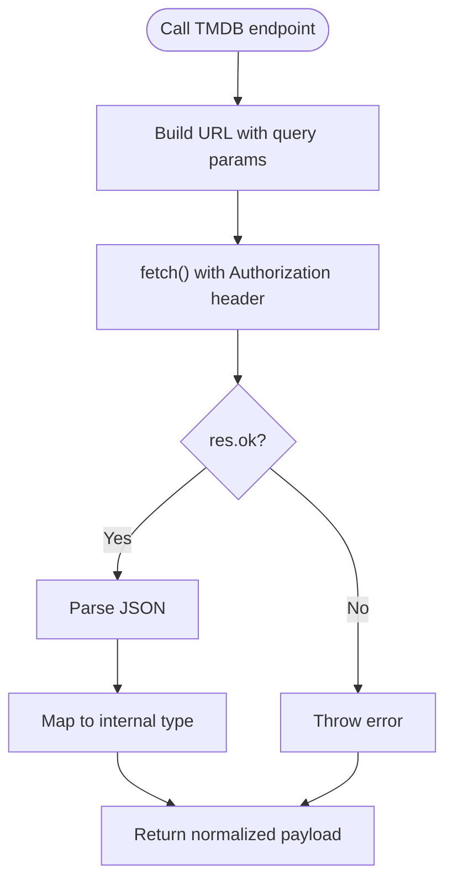
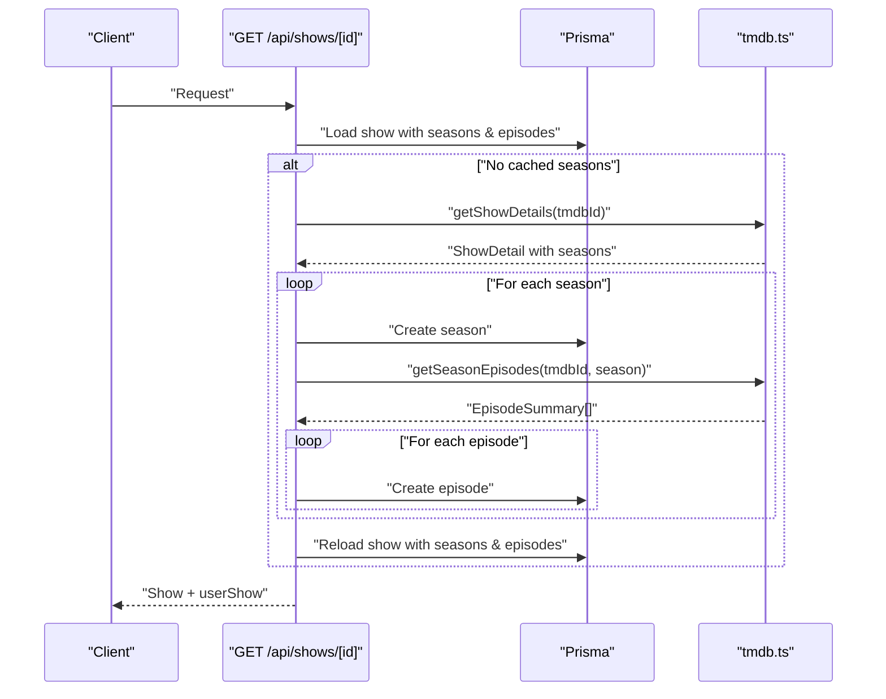
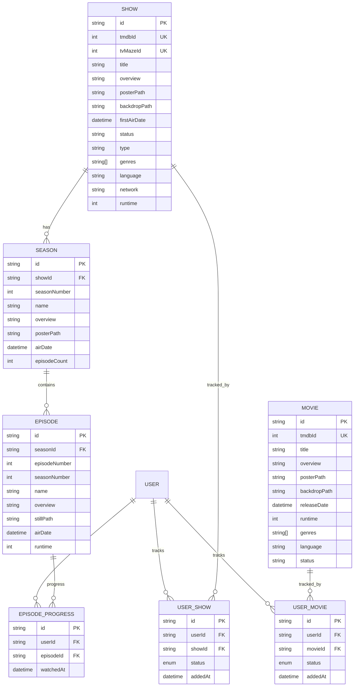
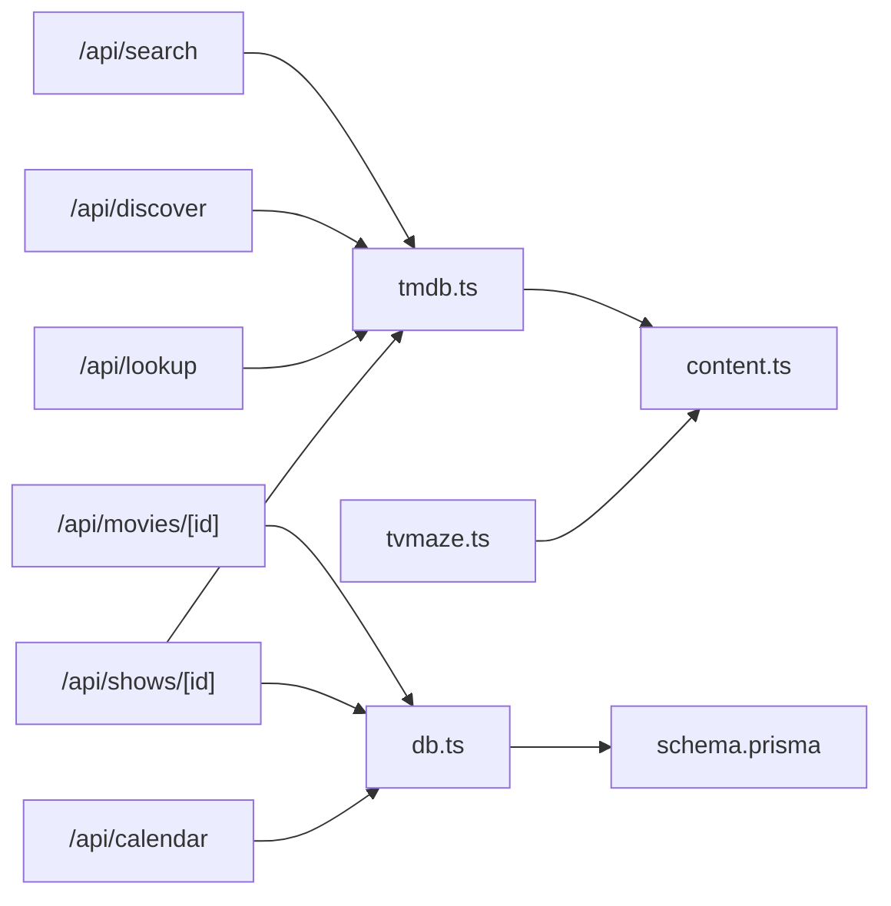

# External API Integration

<cite>
**Referenced Files in This Document**
- [tmdb.ts](file://src/lib/services/tmdb.ts)
- [tvmaze.ts](file://src/lib/services/tvmaze.ts)
- [+server.ts (search)](file://src/routes/api/search/+server.ts)
- [+server.ts (discover)](file://src/routes/api/discover/+server.ts)
- [+server.ts (lookup)](file://src/routes/api/lookup/+server.ts)
- [+server.ts (movies/[id])](
- [+server.ts (shows/[id])](file://src/routes/api/shows/[id]/+server.ts)
- [+server.ts (calendar)](file://src/routes/api/calendar/+server.ts)
- [schema.prisma](file://prisma/schema.prisma)
- [content.ts](file://src/lib/types/content.ts)
- [db.ts](file://src/lib/server/db.ts)
</cite>

## Table of Contents
1. [Introduction](#introduction)
2. [Project Structure](#project-structure)
3. [Core Components](#core-components)
4. [Architecture Overview](#architecture-overview)
5. [Detailed Component Analysis](#detailed-component-analysis)
6. [Dependency Analysis](#dependency-analysis)
7. [Performance Considerations](#performance-considerations)
8. [Troubleshooting Guide](#troubleshooting-guide)
9. [Conclusion](#conclusion)

## Introduction
This document explains the external API integration architecture for Screenlog with TMDB and TVMaze. It focuses on the service layer that orchestrates external HTTP calls, transforms third-party responses into normalized internal types, and integrates with the local PostgreSQL database via Prisma. It also documents search and discovery flows for movies and TV, episode and season details retrieval, calendar scheduling, and error handling patterns. Where applicable, it highlights missing caching and rate-limiting controls and provides recommendations for robustness and performance.

## Project Structure
The external API integration spans a small set of SvelteKit server routes and two service modules:
- TMDB service module: centralized HTTP clients and data mappers for movies and TV.
- TVMaze service module: minimal client for show search and episode listings.
- SvelteKit API routes: orchestrate user authentication checks, call services, and return JSON responses.
- Prisma schema: defines content models (Show, Season, Episode, Movie) and relationships used to cache and enrich data.

**Diagram sources**
- [tmdb.ts:1-167](file://src/lib/services/tmdb.ts#L1-L167)
- [tvmaze.ts:1-24](file://src/lib/services/tvmaze.ts#L1-L24)
- [+server.ts (search):1-16](file://src/routes/api/search/+server.ts#L1-L16)
- [+server.ts (discover):1-21](file://src/routes/api/discover/+server.ts#L1-L21)
- [+server.ts (lookup):1-53](file://src/routes/api/lookup/+server.ts#L1-L53)
- [+server.ts (movies/[id])](file://src/routes/api/movies/[id]/+server.ts#L1-L19)
- [+server.ts (shows/[id])](file://src/routes/api/shows/[id]/+server.ts#L1-L63)
- [+server.ts (calendar):1-82](file://src/routes/api/calendar/+server.ts#L1-L82)
- [db.ts:1-11](file://src/lib/server/db.ts#L1-L11)
- [schema.prisma:84-166](file://prisma/schema.prisma#L84-L166)

**Section sources**
- [tmdb.ts:1-167](file://src/lib/services/tmdb.ts#L1-L167)
- [tvmaze.ts:1-24](file://src/lib/services/tvmaze.ts#L1-L24)
- [+server.ts (search):1-16](file://src/routes/api/search/+server.ts#L1-L16)
- [+server.ts (discover):1-21](file://src/routes/api/discover/+server.ts#L1-L21)
- [+server.ts (lookup):1-53](file://src/routes/api/lookup/+server.ts#L1-L53)
- [+server.ts (movies/[id])](file://src/routes/api/movies/[id]/+server.ts#L1-L19)
- [+server.ts (shows/[id])](file://src/routes/api/shows/[id]/+server.ts#L1-L63)
- [+server.ts (calendar):1-82](file://src/routes/api/calendar/+server.ts#L1-L82)
- [schema.prisma:84-166](file://prisma/schema.prisma#L84-L166)
- [db.ts:1-11](file://src/lib/server/db.ts#L1-L11)

## Core Components
- TMDB service
  - Provides typed functions for search, trending, popular, top-rated, show details, season episodes, and movie details.
  - Normalizes responses into internal types and filters out adult content and unwanted seasons.
  - Uses a private API key via environment variable for Authorization.
- TVMaze service
  - Minimal client for show search and episode listing.
- SvelteKit API routes
  - Enforce user authentication, call services, and return JSON.
  - The shows detail route conditionally caches TMDB-derived seasons and episodes into the local database when empty.
- Prisma schema and database client
  - Defines Show/Season/Episode/Movie entities and relationships.
  - Used by routes to read/write content and user progress.

**Section sources**
- [tmdb.ts:1-167](file://src/lib/services/tmdb.ts#L1-L167)
- [tvmaze.ts:1-24](file://src/lib/services/tvmaze.ts#L1-L24)
- [+server.ts (shows/[id])](file://src/routes/api/shows/[id]/+server.ts#L1-L63)
- [schema.prisma:84-166](file://prisma/schema.prisma#L84-L166)
- [db.ts:1-11](file://src/lib/server/db.ts#L1-L11)

## Architecture Overview
The system follows a layered pattern:
- Presentation: SvelteKit server routes expose REST endpoints.
- Application: Routes validate auth, delegate to services, and assemble responses.
- Services: Encapsulate external API calls and data transformation.
- Persistence: Prisma ORM maps to PostgreSQL.

**Diagram sources**
- [+server.ts (discover):1-21](file://src/routes/api/discover/+server.ts#L1-L21)
- [tmdb.ts:106-140](file://src/lib/services/tmdb.ts#L106-L140)

## Detailed Component Analysis

### TMDB Service Layer
Responsibilities:
- Build authenticated requests with Authorization header.
- Fetch multi-search, trending, popular, top-rated, show details, season episodes, and movie details.
- Transform raw API payloads into internal types (SearchResult, DiscoverItem, ShowDetail, EpisodeSummary, MovieSummary).
- Filter out adult content and invalid seasons.

Key behaviors:
- Authentication: Uses a private API key via environment variable.
- Error handling: Throws on non-OK responses; callers should catch and map to user-friendly errors.
- Data normalization: Ensures consistent fields, safe defaults, and numeric/string conversions.

**Diagram sources**
- [tmdb.ts:7-17](file://src/lib/services/tmdb.ts#L7-L17)
- [tmdb.ts:19-37](file://src/lib/services/tmdb.ts#L19-L37)
- [tmdb.ts:39-66](file://src/lib/services/tmdb.ts#L39-L66)
- [tmdb.ts:69-86](file://src/lib/services/tmdb.ts#L69-L86)
- [tmdb.ts:88-104](file://src/lib/services/tmdb.ts#L88-L104)
- [tmdb.ts:106-140](file://src/lib/services/tmdb.ts#L106-L140)

**Section sources**
- [tmdb.ts:1-167](file://src/lib/services/tmdb.ts#L1-L167)
- [content.ts:1-116](file://src/lib/types/content.ts#L1-L116)

### TVMaze Service Layer
Responsibilities:
- Search shows by query.
- Retrieve episode lists for a given TVMaze show ID.

Key behaviors:
- No authentication.
- Minimal transformation to shape IDs and images.

**Section sources**
- [tvmaze.ts:1-24](file://src/lib/services/tvmaze.ts#L1-L24)

### API Routes and Orchestration

#### Search Multi
- Endpoint: GET /api/search
- Behavior: Validates query, calls TMDB multi-search, returns normalized results.

**Section sources**
- [+server.ts (search):1-16](file://src/routes/api/search/+server.ts#L1-L16)
- [tmdb.ts:19-37](file://src/lib/services/tmdb.ts#L19-L37)

#### Discover
- Endpoint: GET /api/discover
- Behavior: Concurrently fetches trending/popular/top-rated for shows and movies, returns grouped arrays.

**Section sources**
- [+server.ts (discover):1-21](file://src/routes/api/discover/+server.ts#L1-L21)
- [tmdb.ts:106-140](file://src/lib/services/tmdb.ts#L106-L140)

#### Lookup (Create or Resolve Content)
- Endpoint: POST /api/lookup
- Behavior: Given a TMDB type and ID, ensures a local Show or Movie record exists (creating if needed), returns the local ID.

**Section sources**
- [+server.ts (lookup):1-53](file://src/routes/api/lookup/+server.ts#L1-L53)
- [tmdb.ts:39-66](file://src/lib/services/tmdb.ts#L39-L66)
- [tmdb.ts:88-104](file://src/lib/services/tmdb.ts#L88-L104)
- [schema.prisma:84-166](file://prisma/schema.prisma#L84-L166)

#### Movies Details
- Endpoint: GET /api/movies/[id]
- Behavior: Loads a movie by local ID and associated user movie record.

**Section sources**
- [+server.ts (movies/[id])](file://src/routes/api/movies/[id]/+server.ts#L1-L19)
- [schema.prisma:148-166](file://prisma/schema.prisma#L148-L166)

#### Shows Details with On-Demand Caching
- Endpoint: GET /api/shows/[id]
- Behavior:
  - Loads a show with seasons and episodes from the database.
  - If no seasons are cached locally, fetches show details from TMDB and seeds seasons and episodes into the database.
  - Returns the refreshed show plus user show status.

**Diagram sources**
- [+server.ts (shows/[id])](file://src/routes/api/shows/[id]/+server.ts#L1-L63)
- [tmdb.ts:39-66](file://src/lib/services/tmdb.ts#L39-L66)
- [tmdb.ts:69-86](file://src/lib/services/tmdb.ts#L69-L86)

**Section sources**
- [+server.ts (shows/[id])](file://src/routes/api/shows/[id]/+server.ts#L1-L63)
- [tmdb.ts:39-86](file://src/lib/services/tmdb.ts#L39-L86)
- [schema.prisma:84-146](file://prisma/schema.prisma#L84-L146)

#### Calendar
- Endpoint: GET /api/calendar?timezone=...
- Behavior: Builds a schedule of upcoming episodes for the authenticated user’s tracked shows, grouped by time windows and filtered by user’s watched progress.

**Section sources**
- [+server.ts (calendar):1-82](file://src/routes/api/calendar/+server.ts#L1-L82)
- [schema.prisma:128-146](file://prisma/schema.prisma#L128-L146)

### Data Models and Relationships
The Prisma schema defines the content graph used by the integration:
- Show with seasons and episodes.
- Movie.
- UserShow and UserMovie for user content tracking.
- EpisodeProgress for watched episodes.

**Diagram sources**
- [schema.prisma:84-226](file://prisma/schema.prisma#L84-L226)

**Section sources**
- [schema.prisma:84-226](file://prisma/schema.prisma#L84-L226)

## Dependency Analysis
- Routes depend on services for external data and on Prisma for local persistence.
- Services depend on the external APIs and on Prisma models indirectly via routes.
- Internal types unify data shapes across services and routes.

**Diagram sources**
- [+server.ts (search):1-16](file://src/routes/api/search/+server.ts#L1-L16)
- [+server.ts (discover):1-21](file://src/routes/api/discover/+server.ts#L1-L21)
- [+server.ts (lookup):1-53](file://src/routes/api/lookup/+server.ts#L1-L53)
- [+server.ts (movies/[id])](file://src/routes/api/movies/[id]/+server.ts#L1-L19)
- [+server.ts (shows/[id])](file://src/routes/api/shows/[id]/+server.ts#L1-L63)
- [+server.ts (calendar):1-82](file://src/routes/api/calendar/+server.ts#L1-L82)
- [tmdb.ts:1-167](file://src/lib/services/tmdb.ts#L1-L167)
- [tvmaze.ts:1-24](file://src/lib/services/tvmaze.ts#L1-L24)
- [content.ts:1-116](file://src/lib/types/content.ts#L1-L116)
- [db.ts:1-11](file://src/lib/server/db.ts#L1-L11)
- [schema.prisma:84-166](file://prisma/schema.prisma#L84-L166)

**Section sources**
- [tmdb.ts:1-167](file://src/lib/services/tmdb.ts#L1-L167)
- [tvmaze.ts:1-24](file://src/lib/services/tvmaze.ts#L1-L24)
- [content.ts:1-116](file://src/lib/types/content.ts#L1-L116)
- [db.ts:1-11](file://src/lib/server/db.ts#L1-L11)
- [schema.prisma:84-166](file://prisma/schema.prisma#L84-L166)

## Performance Considerations
- Concurrency: Discovery aggregates multiple TMDB endpoints concurrently, reducing total latency.
- Local caching: The shows detail route conditionally seeds seasons and episodes into the database when empty, reducing repeated external calls for the same content.
- Pagination: Discovery endpoints limit results to a small window to reduce payload sizes.
- Timezone-aware grouping: Calendar groups episodes by user timezone to avoid rework and improve UX.

Recommendations (not currently implemented):
- Add HTTP caching (ETag/Last-Modified) and in-memory cache for frequent queries (e.g., details, trending).
- Implement exponential backoff and retry on transient TMDB errors.
- Apply rate limiting per-key and stagger heavy requests.
- Use database indexes on frequently queried fields (e.g., tmdbId, userId).
- Consider background jobs to refresh stale content periodically.

[No sources needed since this section provides general guidance]

## Troubleshooting Guide
Common issues and remedies:
- Unauthorized access
  - Symptom: 401 responses from protected endpoints.
  - Cause: Missing or invalid session.
  - Action: Ensure client sends session cookies and authenticates via the auth flow.
- TMDB API errors
  - Symptom: Errors thrown on non-2xx responses.
  - Cause: Network issues, invalid API key, quota exceeded, or malformed request.
  - Action: Verify API key, check external service status, and implement retries with backoff.
- Empty or partial data
  - Symptom: Missing seasons or episodes after lookup.
  - Cause: Local cache not populated yet.
  - Action: Trigger shows details route to seed seasons and episodes; confirm tmdbId alignment.
- Calendar discrepancies
  - Symptom: Episodes not appearing or misgrouped.
  - Cause: Incorrect timezone or watched progress filtering.
  - Action: Pass the correct timezone query param and confirm episode air dates and watched records.

**Section sources**
- [+server.ts (search):5-15](file://src/routes/api/search/+server.ts#L5-L15)
- [+server.ts (discover):5-20](file://src/routes/api/discover/+server.ts#L5-L20)
- [+server.ts (lookup):6-52](file://src/routes/api/lookup/+server.ts#L6-L52)
- [+server.ts (shows/[id])](file://src/routes/api/shows/[id]/+server.ts#L6-L62)
- [+server.ts (calendar):9-81](file://src/routes/api/calendar/+server.ts#L9-L81)
- [tmdb.ts:14-17](file://src/lib/services/tmdb.ts#L14-L17)

## Conclusion
Screenlog’s external API integration centers on a clean separation between SvelteKit routes, a dedicated TMDB service, and a lightweight TVMaze client. Data normalization and local caching reduce downstream complexity and improve responsiveness. While concurrency and local caching are present, production-grade resilience would benefit from explicit HTTP caching, retry/backoff, and rate limiting. The Prisma schema provides a solid foundation for content and user progress tracking, enabling features like calendar scheduling and profile analytics.