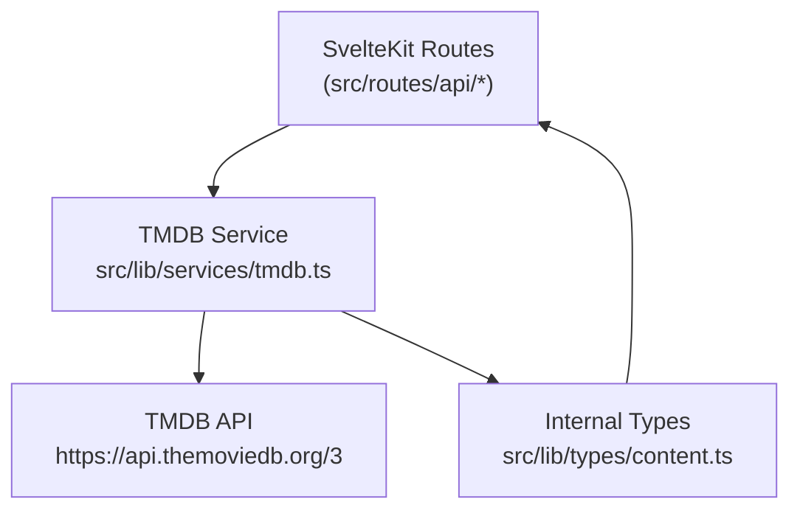
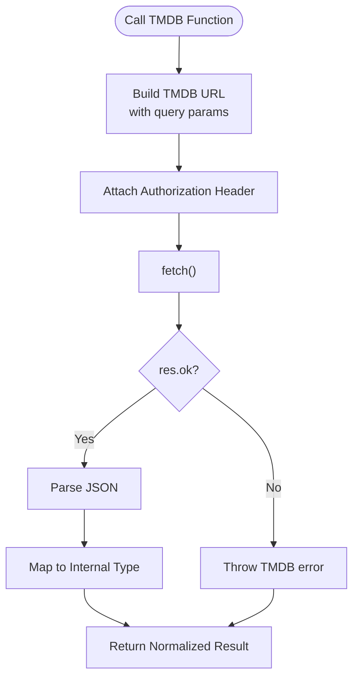
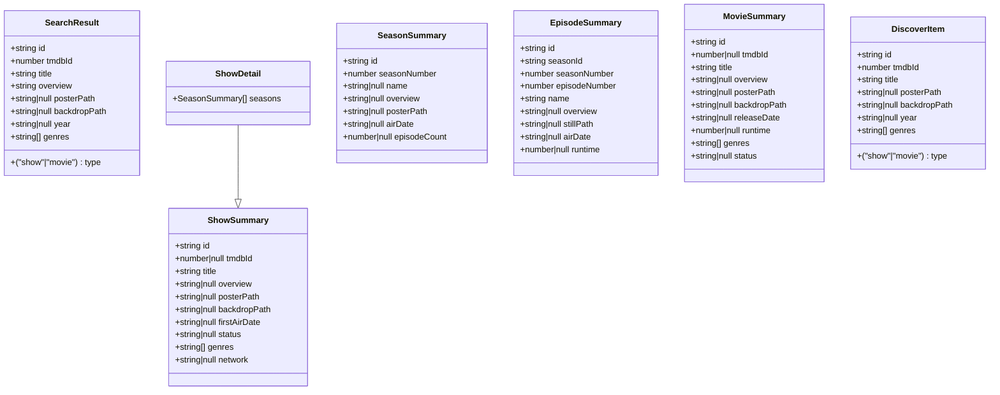
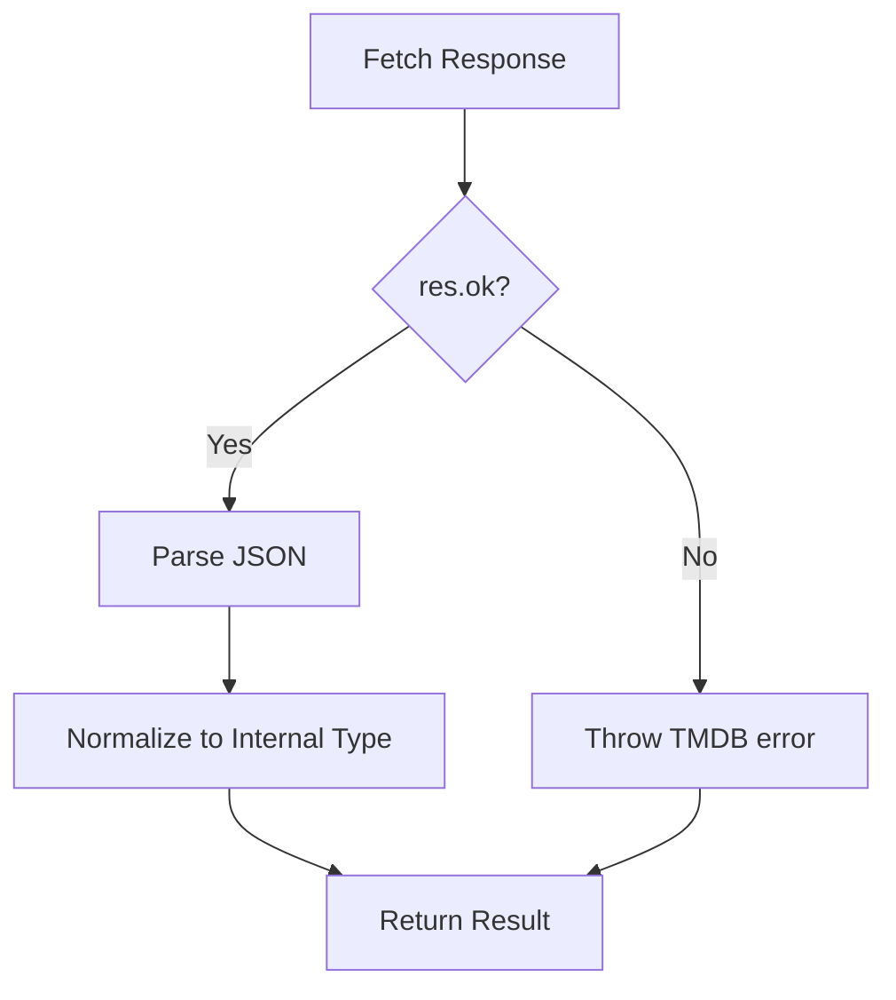
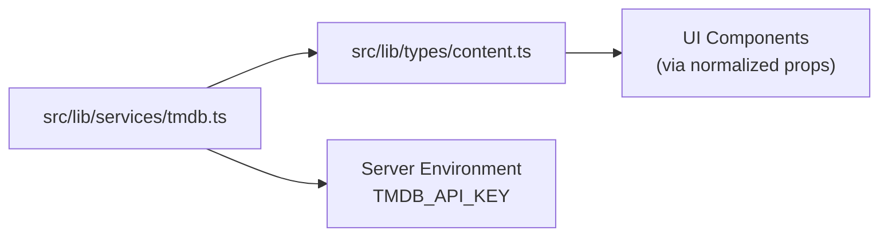

# TMDB API Integration

<cite>
**Referenced Files in This Document**
- [tmdb.ts](file://src/lib/services/tmdb.ts)
- [content.ts](file://src/lib/types/content.ts)
- [README.md](file://README.md)
- [SPEC.MD](file://SPEC.MD)
- [DESIGN.MD](file://DESIGN.MD)
</cite>

## Table of Contents
1. [Introduction](#introduction)
2. [Project Structure](#project-structure)
3. [Core Components](#core-components)
4. [Architecture Overview](#architecture-overview)
5. [Detailed Component Analysis](#detailed-component-analysis)
6. [Dependency Analysis](#dependency-analysis)
7. [Performance Considerations](#performance-considerations)
8. [Troubleshooting Guide](#troubleshooting-guide)
9. [Conclusion](#conclusion)

## Introduction
This document describes the complete TMDB API integration used by Screenlog. It covers the service implementation, data transformation patterns, authentication, error handling, and performance strategies. The integration exposes a set of server-side functions for multi-type search, content details retrieval (movies and shows), episode data for seasons, and curated content discovery endpoints (trending, popular, top-rated). All external API responses are normalized into internal content types before being returned to the application.

## Project Structure
The TMDB integration resides in the server-side services layer and is consumed by API routes and UI components. The primary module is the TMDB service, which defines the HTTP client behavior, authentication headers, and response normalization functions. Internal content types define the canonical shapes used across the application.

```mermaid
graph TB
subgraph "Server Services"
TMDB["src/lib/services/tmdb.ts"]
end
subgraph "Types"
Types["src/lib/types/content.ts"]
end
subgraph "Environment"
Env["README.md<br/>SPEC.MD<br/>DESIGN.MD"]
end
TMDB --> Types
Env --> TMDB
```

**Diagram sources**
- [tmdb.ts:1-167](file://src/lib/services/tmdb.ts#L1-L167)
- [content.ts:1-116](file://src/lib/types/content.ts#L1-L116)
- [README.md:24-81](file://README.md#L24-L81)
- [SPEC.MD:856-898](file://SPEC.MD#L856-L898)
- [DESIGN.MD:913-952](file://DESIGN.MD#L913-L952)

**Section sources**
- [tmdb.ts:1-167](file://src/lib/services/tmdb.ts#L1-L167)
- [content.ts:1-116](file://src/lib/types/content.ts#L1-L116)
- [README.md:24-81](file://README.md#L24-L81)
- [SPEC.MD:856-898](file://SPEC.MD#L856-L898)
- [DESIGN.MD:913-952](file://DESIGN.MD#L913-L952)

## Core Components
- TMDB Service: Provides all TMDB-backed functions and handles authentication, response processing, and data normalization.
- Internal Content Types: Define canonical shapes for search results, show summaries/details, seasons, episodes, movies, and discover items.

Key exported functions:
- searchMulti(query): Multi-type search across movies and TV shows.
- getShowDetails(tmdbId): Fetch show details including seasons.
- getSeasonEpisodes(tmdbId, seasonNumber): Fetch episode list for a given season.
- getMovieDetails(tmdbId): Fetch movie details.
- getTrendingShows(), getTrendingMovies(): Trending content discovery.
- getPopularShows(), getPopularMovies(): Popular content discovery.
- getTopRatedShows(), getTopRatedMovies(): Top-rated content discovery.

**Section sources**
- [tmdb.ts:19-140](file://src/lib/services/tmdb.ts#L19-L140)
- [content.ts:1-86](file://src/lib/types/content.ts#L1-L86)

## Architecture Overview
The integration follows a strict server-side-only policy for external APIs. The frontend interacts with SvelteKit API routes, which call the TMDB service to fetch and normalize data. The normalized types ensure UI stability and prevent exposure of raw external API structures.



**Diagram sources**
- [tmdb.ts:1-167](file://src/lib/services/tmdb.ts#L1-L167)
- [content.ts:1-116](file://src/lib/types/content.ts#L1-L116)

## Detailed Component Analysis

### TMDB Service Implementation
The service encapsulates:
- Base URLs and image proxy base.
- Authentication via Authorization header using a server-side private environment variable.
- Response handling with explicit error throwing for non-OK responses.
- Multi-type search filtering to movies and TV shows.
- Normalization of TMDB responses into internal types.
- Curated discovery endpoints returning DiscoverItem arrays.



**Diagram sources**
- [tmdb.ts:7-17](file://src/lib/services/tmdb.ts#L7-L17)
- [tmdb.ts:19-37](file://src/lib/services/tmdb.ts#L19-L37)
- [tmdb.ts:39-104](file://src/lib/services/tmdb.ts#L39-L104)
- [tmdb.ts:106-140](file://src/lib/services/tmdb.ts#L106-L140)

**Section sources**
- [tmdb.ts:1-167](file://src/lib/services/tmdb.ts#L1-L167)

### Data Transformation Patterns
- searchMulti: Filters results to media_type tv/movie and maps to SearchResult.
- getShowDetails: Maps TV details to ShowDetail, including seasons array normalization.
- getSeasonEpisodes: Maps episodes to EpisodeSummary with season linkage.
- getMovieDetails: Maps movie details to MovieSummary.
- Discovery endpoints: Map TV and Movie results to DiscoverItem with consistent fields.



**Diagram sources**
- [content.ts:1-116](file://src/lib/types/content.ts#L1-L116)

**Section sources**
- [content.ts:1-116](file://src/lib/types/content.ts#L1-L116)
- [tmdb.ts:19-37](file://src/lib/services/tmdb.ts#L19-L37)
- [tmdb.ts:39-104](file://src/lib/services/tmdb.ts#L39-L104)
- [tmdb.ts:106-140](file://src/lib/services/tmdb.ts#L106-L140)

### API Usage Examples
- Multi-type search: Call searchMulti with a query string; returns SearchResult[] filtered to show/movie.
- Show details: Call getShowDetails with a TMDB show ID; returns ShowDetail including seasons.
- Season episodes: Call getSeasonEpisodes with show TMDB ID and season number; returns EpisodeSummary[].
- Movie details: Call getMovieDetails with a TMDB movie ID; returns MovieSummary.
- Discovery: Call getTrendingShows/getTrendingMovies, getPopularShows/getPopularMovies, getTopRatedShows/getTopRatedMovies; returns DiscoverItem[].

These functions are designed to be invoked from SvelteKit server routes and return normalized data to the UI.

**Section sources**
- [tmdb.ts:19-140](file://src/lib/services/tmdb.ts#L19-L140)

### Authentication and Rate Limiting
- Authentication: Uses a server-side private environment variable for the Authorization header. This prevents exposing API keys to the browser.
- Rate limits: The implementation does not include client-side rate limiting. Follow TMDB’s documented rate limits and consider adding caching and retries at the server layer.

Security and environment guidance:
- TMDB API key is configured via environment variables and used server-side only.
- The project documentation emphasizes not exposing external API keys to the browser.

**Section sources**
- [tmdb.ts:1-12](file://src/lib/services/tmdb.ts#L1-L12)
- [README.md:58-81](file://README.md#L58-L81)
- [SPEC.MD:936-937](file://SPEC.MD#L936-L937)

### Error Handling and Response Processing
- Non-OK responses trigger an error with status and statusText.
- Missing fields are handled with safe defaults (null or empty arrays) to avoid breaking UI rendering.
- Discovery endpoints slice results to a fixed size to maintain consistent payload sizes.



**Diagram sources**
- [tmdb.ts:14-17](file://src/lib/services/tmdb.ts#L14-L17)
- [tmdb.ts](file://src/lib/services/tmdb.ts#L109)
- [tmdb.ts](file://src/lib/services/tmdb.ts#L115)
- [tmdb.ts](file://src/lib/services/tmdb.ts#L121)
- [tmdb.ts](file://src/lib/services/tmdb.ts#L127)
- [tmdb.ts](file://src/lib/services/tmdb.ts#L133)
- [tmdb.ts](file://src/lib/services/tmdb.ts#L139)

**Section sources**
- [tmdb.ts:14-17](file://src/lib/services/tmdb.ts#L14-L17)
- [tmdb.ts:106-140](file://src/lib/services/tmdb.ts#L106-L140)

## Dependency Analysis
The TMDB service depends on internal content types for normalization and uses server-side environment variables for authentication. The design documents specify that UI should only consume normalized internal shapes.



**Diagram sources**
- [tmdb.ts:1-167](file://src/lib/services/tmdb.ts#L1-L167)
- [content.ts:1-116](file://src/lib/types/content.ts#L1-L116)

**Section sources**
- [tmdb.ts:1-167](file://src/lib/services/tmdb.ts#L1-L167)
- [content.ts:1-116](file://src/lib/types/content.ts#L1-L116)
- [DESIGN.MD:938-952](file://DESIGN.MD#L938-L952)

## Performance Considerations
- Caching: Cache normalized content metadata after first fetch to avoid repeated external calls. Refresh time-sensitive episode data as needed.
- Payload sizing: Discovery endpoints limit results to a fixed number to keep payloads small.
- Image proxy: Use the provided image base URL for consistent image handling.
- Batch requests: Combine related operations where possible to minimize round trips.

[No sources needed since this section provides general guidance]

## Troubleshooting Guide
Common issues and resolutions:
- Authentication failures: Verify the server-side TMDB API key is present and valid.
- Network errors: Non-OK responses throw explicit errors; surface user-friendly messages and allow retry.
- Missing images or metadata: Use fallbacks (null or empty) to prevent broken UI; implement skeleton loaders.
- Rate limiting: Monitor TMDB rate limits and implement server-side caching or exponential backoff.

**Section sources**
- [tmdb.ts:14-17](file://src/lib/services/tmdb.ts#L14-L17)
- [DESIGN.MD:1008-1028](file://DESIGN.MD#L1008-L1028)
- [SPEC.MD:900-909](file://SPEC.MD#L900-L909)

## Conclusion
Screenlog’s TMDB integration is implemented as a server-side service that authenticates securely, normalizes external responses into internal types, and exposes a clean API for discovery, search, and content details. By adhering to the documented normalization and caching strategies, the integration remains robust, performant, and UI-safe.