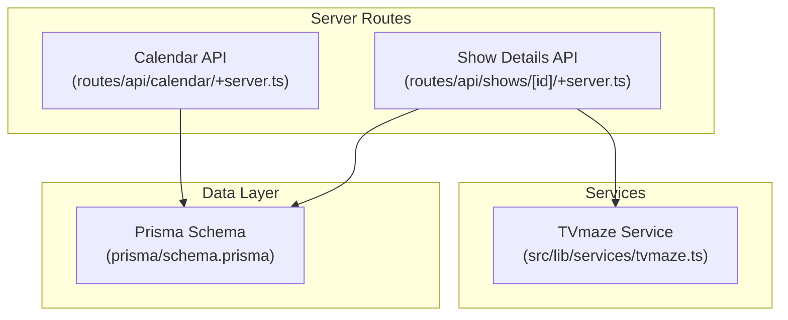
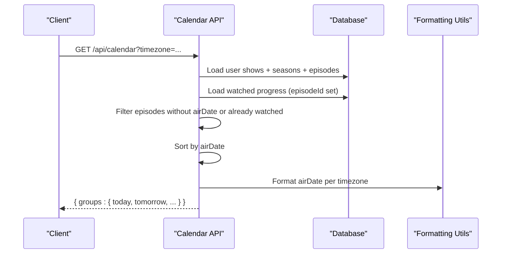
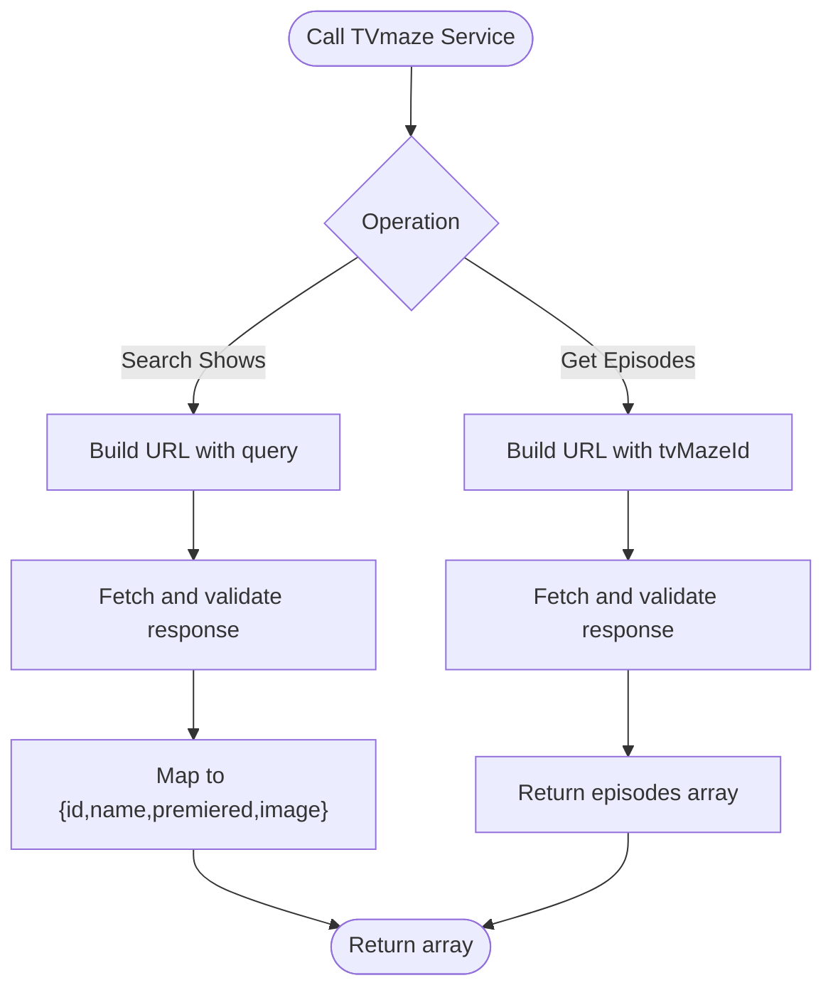
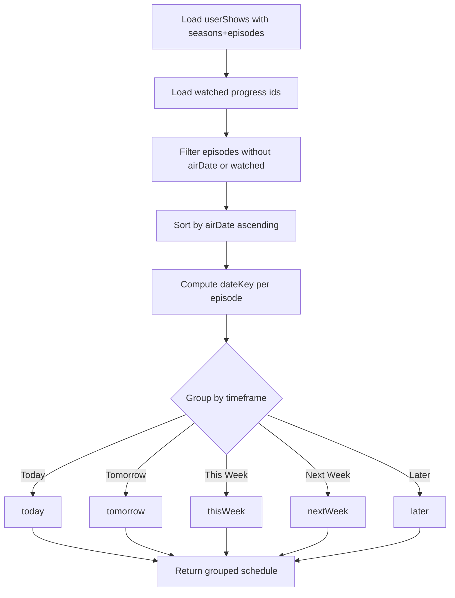
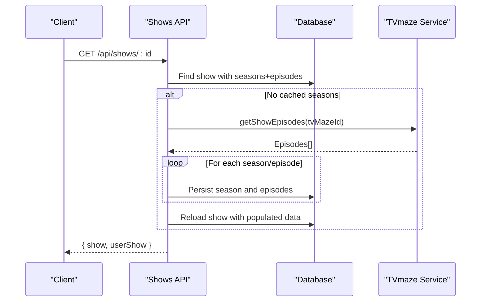
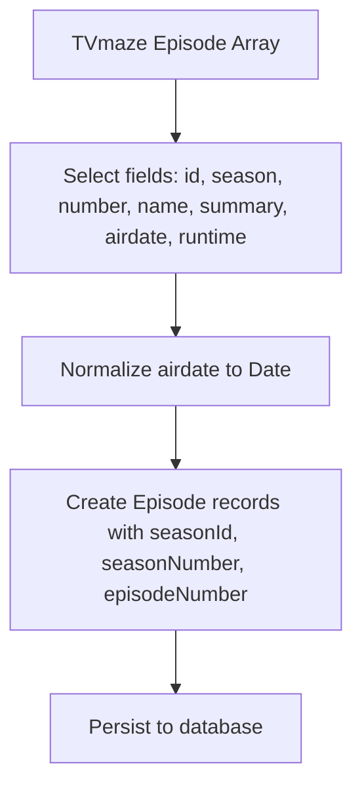
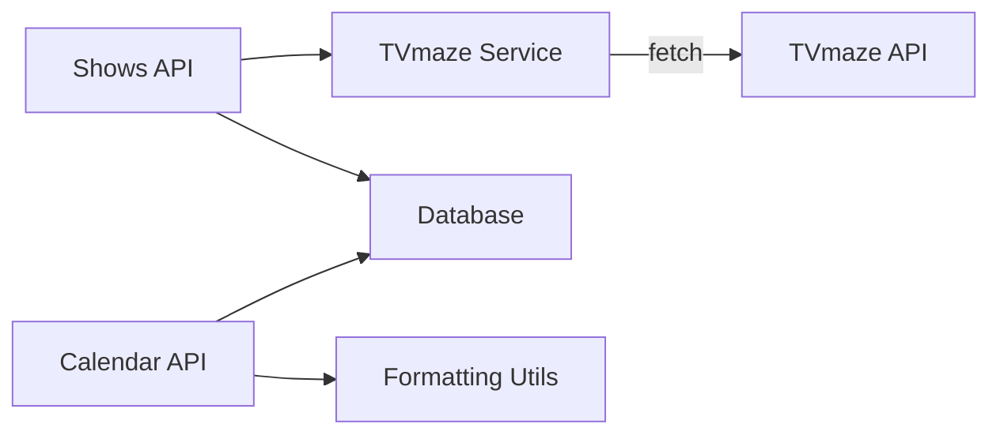

# TVmaze API Integration

<cite>
**Referenced Files in This Document**
- [tvmaze.ts](file://src/lib/services/tvmaze.ts)
- [calendar/+server.ts](file://src/routes/api/calendar/+server.ts)
- [shows/[id]/+server.ts](file://src/routes/api/shows/[id]/+server.ts)
- [schema.prisma](file://prisma/schema.prisma)
- [utils.ts](file://src/lib/utils.ts)
- [search/+server.ts](file://src/routes/api/search/+server.ts)
</cite>

## Table of Contents
1. [Introduction](#introduction)
2. [Project Structure](#project-structure)
3. [Core Components](#core-components)
4. [Architecture Overview](#architecture-overview)
5. [Detailed Component Analysis](#detailed-component-analysis)
6. [Dependency Analysis](#dependency-analysis)
7. [Performance Considerations](#performance-considerations)
8. [Troubleshooting Guide](#troubleshooting-guide)
9. [Conclusion](#conclusion)

## Introduction
This document explains how Screenlog integrates with the TVmaze API for episode data management. It covers the TVmaze service implementation, episode scheduling and air date tracking, episode-specific information retrieval, data transformations from TVmaze responses to internal episode types, error handling, rate limiting considerations, and fallback mechanisms. Practical examples and optimization techniques for episode-related API calls are included to help developers integrate and maintain the feature effectively.

## Project Structure
The TVmaze integration spans a small set of focused modules:
- TVmaze service module: Provides TVmaze API access for show search and episode listing.
- Calendar API route: Uses locally cached episode data to compute upcoming schedules grouped by timeframes.
- Shows API route: Manages show details and populates seasons and episodes from external sources (currently TMDB in the shown implementation).
- Prisma schema: Defines the Episode entity and relationships used by the calendar and UI layers.
- Utilities: Provide formatting helpers used by UI components consuming episode data.

**Diagram sources**
- [calendar/+server.ts:1-82](file://src/routes/api/calendar/+server.ts#L1-L82)
- [shows/[id]/+server.ts](file://src/routes/api/shows/[id]/+server.ts#L1-L63)
- [tvmaze.ts:1-24](file://src/lib/services/tvmaze.ts#L1-L24)
- [schema.prisma:128-146](file://prisma/schema.prisma#L128-L146)

**Section sources**
- [calendar/+server.ts:1-82](file://src/routes/api/calendar/+server.ts#L1-L82)
- [shows/[id]/+server.ts](file://src/routes/api/shows/[id]/+server.ts#L1-L63)
- [tvmaze.ts:1-24](file://src/lib/services/tvmaze.ts#L1-L24)
- [schema.prisma:128-146](file://prisma/schema.prisma#L128-L146)

## Core Components
- TVmaze Service
  - Provides two primary functions:
    - Search shows by query string.
    - Fetch all episodes for a given TVmaze show ID.
  - Handles response validation and throws on non-OK HTTP responses.

- Calendar API Route
  - Builds a user’s episode schedule by:
    - Loading user shows and their seasons/episodes from the database.
    - Filtering out episodes without air dates or already watched episodes.
    - Sorting episodes by air date.
    - Grouping episodes into “today,” “tomorrow,” “this week,” “next week,” and “later.”

- Shows API Route
  - Returns a show with populated seasons and episodes.
  - On first access, if no seasons are cached, it fetches show details and episodes from TMDB and persists them to the database.

- Prisma Episode Model
  - Stores episode-level metadata including identifiers, season/episode numbers, title, overview, still path, air date, and runtime.

- Utilities
  - Formatting helpers for dates and runtime are used by UI components to render episode information.

**Section sources**
- [tvmaze.ts:1-24](file://src/lib/services/tvmaze.ts#L1-L24)
- [calendar/+server.ts:1-82](file://src/routes/api/calendar/+server.ts#L1-L82)
- [shows/[id]/+server.ts](file://src/routes/api/shows/[id]/+server.ts#L1-L63)
- [schema.prisma:128-146](file://prisma/schema.prisma#L128-L146)
- [utils.ts:8-38](file://src/lib/utils.ts#L8-L38)

## Architecture Overview
The TVmaze integration is currently structured as follows:
- TVmaze service is defined but not actively used in the shown server routes.
- Episode scheduling and display rely on locally cached episode data (from TMDB in the provided implementation).
- The calendar route computes schedule groups using the local episode dataset and user preferences/timezone.

**Diagram sources**
- [calendar/+server.ts:9-81](file://src/routes/api/calendar/+server.ts#L9-L81)
- [utils.ts:8-30](file://src/lib/utils.ts#L8-L30)

## Detailed Component Analysis

### TVmaze Service
The TVmaze service exposes:
- A search function that queries TVmaze by show name and returns a minimal set of fields.
- An episode listing function that retrieves all episodes for a TVmaze show ID.

Implementation highlights:
- Base URL constant defines the upstream endpoint.
- A shared response handler validates HTTP status and parses JSON.
- The search function trims the query and returns mapped fields for downstream use.
- The episode listing function returns raw episode arrays for further processing.

**Diagram sources**
- [tvmaze.ts:8-23](file://src/lib/services/tvmaze.ts#L8-L23)

**Section sources**
- [tvmaze.ts:1-24](file://src/lib/services/tvmaze.ts#L1-L24)

### Episode Scheduling and Air Date Tracking
The calendar route:
- Loads user shows with nested seasons and episodes from the database.
- Builds a set of watched episode IDs to exclude them from the schedule.
- Filters episodes missing air dates or already watched.
- Sorts episodes by air date.
- Groups episodes into time buckets using timezone-aware date keys.

**Diagram sources**
- [calendar/+server.ts:14-77](file://src/routes/api/calendar/+server.ts#L14-L77)

**Section sources**
- [calendar/+server.ts:1-82](file://src/routes/api/calendar/+server.ts#L1-L82)

### Episode-Specific Information Retrieval
While the calendar route relies on cached episode data, the shows route demonstrates episode population via external APIs:
- On first access, if no seasons are cached, it fetches show details and episodes from TMDB and persists them to the database.
- This pattern can be adapted to TVmaze by replacing TMDB calls with TVmaze calls in the future.

**Diagram sources**
- [shows/[id]/+server.ts](file://src/routes/api/shows/[id]/+server.ts#L10-L56)
- [tvmaze.ts:20-23](file://src/lib/services/tvmaze.ts#L20-L23)

**Section sources**
- [shows/[id]/+server.ts](file://src/routes/api/shows/[id]/+server.ts#L1-L63)
- [tvmaze.ts:1-24](file://src/lib/services/tvmaze.ts#L1-L24)

### Data Transformation: TVmaze Responses to Internal Episode Types
Current implementation uses TMDB for episode data. To integrate TVmaze:
- TVmaze episode response fields include identifiers, season/episode numbers, name, summary, air date, and runtime.
- Transformations to internal Episode model:
  - Map seasonNumber and episodeNumber to the Episode entity.
  - Normalize airDate to a Date object.
  - Store runtime if present.
  - Populate name and overview fields as applicable.
- Maintain uniqueness constraints on (seasonId, episodeNumber) to prevent duplicates.

**Diagram sources**
- [tvmaze.ts:20-23](file://src/lib/services/tvmaze.ts#L20-L23)
- [schema.prisma:128-146](file://prisma/schema.prisma#L128-L146)

**Section sources**
- [tvmaze.ts:1-24](file://src/lib/services/tvmaze.ts#L1-L24)
- [schema.prisma:128-146](file://prisma/schema.prisma#L128-L146)

### Error Handling Strategies
- TVmaze service:
  - Throws on non-OK HTTP responses with a descriptive message.
- Calendar API:
  - Wraps logic in try/catch and returns JSON with an error message and 500 status on failure.
- Shows API:
  - Wraps logic in try/catch and returns JSON with an error message and 500 status on failure.

Recommendations:
- Surface user-friendly messages to clients.
- Log errors with context (user ID, operation, upstream status).
- Distinguish between transient upstream errors and local validation failures.

**Section sources**
- [tvmaze.ts:3-6](file://src/lib/services/tvmaze.ts#L3-L6)
- [calendar/+server.ts:78-81](file://src/routes/api/calendar/+server.ts#L78-L81)
- [shows/[id]/+server.ts](file://src/routes/api/shows/[id]/+server.ts#L59-L62)

### API Rate Limiting and Fallback Mechanisms
- Rate limiting:
  - TVmaze does not publish public rate limits in the current implementation. Consider adding retry with exponential backoff and jitter when encountering throttling indicators.
- Fallback mechanisms:
  - If upstream requests fail, serve cached episode data when available.
  - For calendar grouping, ensure that episodes without air dates are excluded rather than failing the entire computation.
  - Cache frequently accessed show/episode metadata to reduce upstream calls.

[No sources needed since this section provides general guidance]

### Practical Examples of Episode Data Usage
- Upcoming schedule display:
  - Use the calendar route to group episodes by timeframe and render lists in the UI.
- Episode details rendering:
  - Use formatting utilities to display air dates and runtime consistently across components.
- Marking episodes watched:
  - Use episode IDs returned by the calendar route to update progress and recompute schedule groups.

**Section sources**
- [calendar/+server.ts:29-77](file://src/routes/api/calendar/+server.ts#L29-L77)
- [utils.ts:8-38](file://src/lib/utils.ts#L8-L38)

### Common Integration Challenges
- Missing air dates:
  - Episodes without air dates are filtered out of the schedule. Ensure robust UI messaging when episodes are not yet scheduled.
- Timezone handling:
  - Schedule grouping uses timezone-aware date keys. Validate client-provided timezone and default appropriately.
- Episode deduplication:
  - Maintain uniqueness on (seasonId, episodeNumber) to avoid duplicates when repopulating data.
- External API reliability:
  - Implement retries and circuit breaker patterns for upstream failures.

**Section sources**
- [calendar/+server.ts:32-36](file://src/routes/api/calendar/+server.ts#L32-L36)
- [schema.prisma:144-145](file://prisma/schema.prisma#L144-L145)

### Optimization Techniques for Episode-Related API Calls
- Batch and cache:
  - Cache show and episode metadata per user to minimize repeated upstream calls.
- Lazy loading:
  - Populate episodes on first access for a show, as demonstrated in the shows route.
- Efficient filtering:
  - Filter out watched episodes and missing air dates early to reduce downstream processing.
- Sorting and grouping:
  - Sort by air date once and reuse the sorted list for multiple grouping operations.

**Section sources**
- [shows/[id]/+server.ts](file://src/routes/api/shows/[id]/+server.ts#L20-L56)
- [calendar/+server.ts:32-52](file://src/routes/api/calendar/+server.ts#L32-L52)

## Dependency Analysis
- TVmaze service depends on:
  - Network fetch for upstream requests.
  - Shared response handler for error propagation.
- Calendar route depends on:
  - Database queries for user shows, seasons, episodes, and watched progress.
  - Utility functions for date formatting.
- Shows route depends on:
  - Database persistence for caching seasons and episodes.
  - TVmaze service for episode retrieval (to be integrated).

**Diagram sources**
- [tvmaze.ts:1-24](file://src/lib/services/tvmaze.ts#L1-L24)
- [calendar/+server.ts:1-82](file://src/routes/api/calendar/+server.ts#L1-L82)
- [shows/[id]/+server.ts](file://src/routes/api/shows/[id]/+server.ts#L1-L63)
- [utils.ts:8-30](file://src/lib/utils.ts#L8-L30)

**Section sources**
- [tvmaze.ts:1-24](file://src/lib/services/tvmaze.ts#L1-L24)
- [calendar/+server.ts:1-82](file://src/routes/api/calendar/+server.ts#L1-L82)
- [shows/[id]/+server.ts](file://src/routes/api/shows/[id]/+server.ts#L1-L63)
- [utils.ts:8-30](file://src/lib/utils.ts#L8-L30)

## Performance Considerations
- Minimize upstream calls:
  - Cache episodes per show and invalidate on schedule changes.
- Reduce payload sizes:
  - Only fetch and store necessary fields from TVmaze.
- Optimize database queries:
  - Use includes to load nested seasons and episodes efficiently.
- Client-side rendering:
  - Group and sort once on the server; paginate or virtualize long lists on the client.

[No sources needed since this section provides general guidance]

## Troubleshooting Guide
- Unauthorized access:
  - Ensure authentication is checked before processing requests in all server routes.
- Empty or missing episode data:
  - Verify that episodes are cached for the show; trigger population if missing.
- Incorrect schedule grouping:
  - Confirm timezone parameter and dateKey computations align with user preferences.
- API failures:
  - Wrap calls with retries and fallback to cached data when upstream is unavailable.

**Section sources**
- [calendar/+server.ts:10-10](file://src/routes/api/calendar/+server.ts#L10-L10)
- [shows/[id]/+server.ts](file://src/routes/api/shows/[id]/+server.ts#L16-L18)
- [tvmaze.ts:3-6](file://src/lib/services/tvmaze.ts#L3-L6)

## Conclusion
Screenlog’s TVmaze integration is currently defined in the service module and leverages cached episode data for scheduling and display. By integrating TVmaze episode retrieval into the shows route and extending the calendar route to handle TVmaze-backed episodes, the system can fully support TVmaze-driven episode metadata, including episode numbering, air dates, and runtime. Robust error handling, rate-limiting strategies, and caching will ensure reliable performance and a smooth user experience.