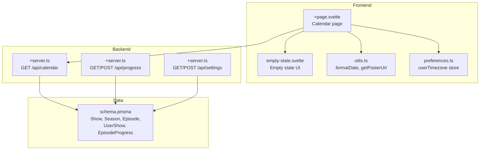
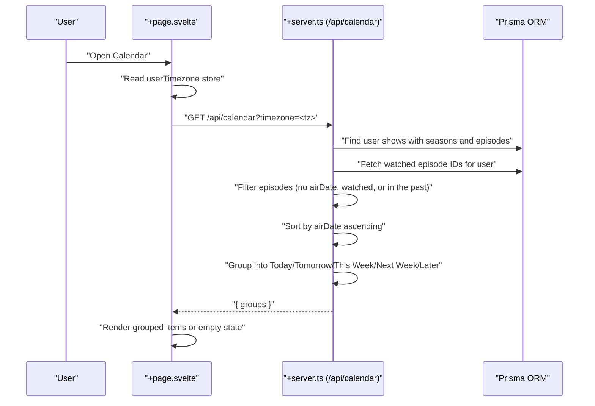
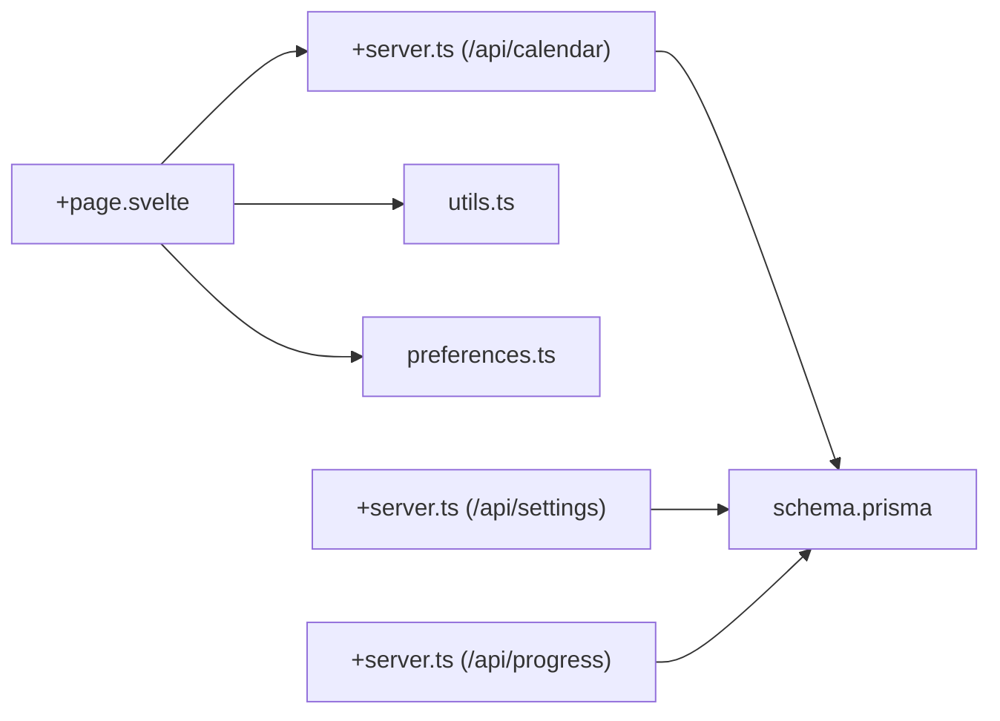

# Calendar View

<cite>
**Referenced Files in This Document**
- [+page.svelte](file://src/routes/(app)/calendar/+page.svelte)
- [+server.ts](file://src/routes/api/calendar/+server.ts)
- [preferences.ts](file://src/lib/stores/preferences.ts)
- [utils.ts](file://src/lib/utils.ts)
- [empty-state.svelte](file://src/lib/components/custom/empty-state.svelte)
- [schema.prisma](file://prisma/schema.prisma)
- [+server.ts](file://src/routes/api/settings/+server.ts)
- [+server.ts](file://src/routes/api/progress/+server.ts)
- [+page.svelte](file://src/routes/(app)/home/+page.svelte)
</cite>

## Table of Contents
1. [Introduction](#introduction)
2. [Project Structure](#project-structure)
3. [Core Components](#core-components)
4. [Architecture Overview](#architecture-overview)
5. [Detailed Component Analysis](#detailed-component-analysis)
6. [Dependency Analysis](#dependency-analysis)
7. [Performance Considerations](#performance-considerations)
8. [Troubleshooting Guide](#troubleshooting-guide)
9. [Conclusion](#conclusion)
10. [Appendices](#appendices)

## Introduction
This document describes the Calendar View feature that displays upcoming episodes based on a user’s watchlist and air dates. It covers how the calendar grid is constructed, how episodes are grouped by time windows, how date-based filtering and timezone handling work, and how the frontend integrates with backend APIs. It also outlines user customization options for timezone and notification preferences, and discusses performance considerations for large date ranges and caching strategies.

## Project Structure
The Calendar View is implemented as a SvelteKit page route that fetches scheduled episodes from a server endpoint and renders them in grouped sections. Supporting infrastructure includes:
- Frontend page and UI components
- Backend API for calendar data
- Shared utilities for date formatting and timezone handling
- Prisma schema defining the data model for shows, seasons, episodes, and progress
- Settings API for user timezone preferences
- Progress API for marking episodes as watched and updating show status

**Diagram sources**
- [+page.svelte](file://src/routes/(app)/calendar/+page.svelte#L1-L93)
- [+server.ts:1-82](file://src/routes/api/calendar/+server.ts#L1-L82)
- [preferences.ts:1-4](file://src/lib/stores/preferences.ts#L1-L4)
- [utils.ts:1-82](file://src/lib/utils.ts#L1-L82)
- [empty-state.svelte:1-44](file://src/lib/components/custom/empty-state.svelte#L1-L44)
- [schema.prisma:84-226](file://prisma/schema.prisma#L84-L226)
- [+server.ts:1-29](file://src/routes/api/settings/+server.ts#L1-L29)
- [+server.ts:1-132](file://src/routes/api/progress/+server.ts#L1-L132)

**Section sources**
- [+page.svelte](file://src/routes/(app)/calendar/+page.svelte#L1-L93)
- [+server.ts:1-82](file://src/routes/api/calendar/+server.ts#L1-L82)
- [preferences.ts:1-4](file://src/lib/stores/preferences.ts#L1-L4)
- [utils.ts:1-82](file://src/lib/utils.ts#L1-L82)
- [empty-state.svelte:1-44](file://src/lib/components/custom/empty-state.svelte#L1-L44)
- [schema.prisma:84-226](file://prisma/schema.prisma#L84-L226)
- [+server.ts:1-29](file://src/routes/api/settings/+server.ts#L1-L29)
- [+server.ts:1-132](file://src/routes/api/progress/+server.ts#L1-L132)

## Core Components
- Calendar page: Fetches calendar data, groups episodes by time windows, and renders a responsive list with poster images and formatted dates.
- Calendar API: Builds a list of eligible episodes from the user’s watchlist, filters out watched episodes and past air dates, sorts by air date, and groups into Today, Tomorrow, This Week, Next Week, and Later.
- Preferences store: Provides the user’s timezone for localizing dates.
- Utilities: Formats dates and constructs poster URLs.
- Empty state UI: Renders a friendly message when there are no upcoming episodes.
- Settings API: Reads and updates user preferences including timezone.
- Progress API: Supports marking episodes as watched/unwatched and batch operations like marking a season as watched.

**Section sources**
- [+page.svelte](file://src/routes/(app)/calendar/+page.svelte#L1-L93)
- [+server.ts:1-82](file://src/routes/api/calendar/+server.ts#L1-L82)
- [preferences.ts:1-4](file://src/lib/stores/preferences.ts#L1-L4)
- [utils.ts:1-82](file://src/lib/utils.ts#L1-L82)
- [empty-state.svelte:1-44](file://src/lib/components/custom/empty-state.svelte#L1-L44)
- [+server.ts:1-29](file://src/routes/api/settings/+server.ts#L1-L29)
- [+server.ts:1-132](file://src/routes/api/progress/+server.ts#L1-L132)

## Architecture Overview
The Calendar View follows a straightforward request-response pattern:
- The page initializes on mount and requests calendar data from the backend, passing the user’s timezone.
- The backend queries the user’s shows, flattens episodes, filters out watched episodes and past dates, sorts by air date, and groups into time buckets.
- The frontend renders the grouped episodes with skeleton loaders during initial load and an empty state when none match.

**Diagram sources**
- [+page.svelte](file://src/routes/(app)/calendar/+page.svelte#L14-L28)
- [+server.ts:9-81](file://src/routes/api/calendar/+server.ts#L9-L81)
- [preferences.ts:1-4](file://src/lib/stores/preferences.ts#L1-L4)

## Detailed Component Analysis

### Calendar Page (+page.svelte)
Responsibilities:
- Initialize loading state and groups.
- On mount, fetch calendar data from the backend, passing the current timezone from the preferences store.
- Render skeleton loaders while loading.
- Display an empty state when no episodes are available.
- Otherwise, render grouped sections in a fixed order: Today, Tomorrow, This Week, Next Week, Later.
- Each item shows poster, show title, season/episode info, and formatted air date localized to the user’s timezone.

Key behaviors:
- Uses a derived flag to detect whether any group has items.
- Navigates to a show detail page when an item is clicked.
- Uses shared utilities for poster URL and date formatting.

**Section sources**
- [+page.svelte](file://src/routes/(app)/calendar/+page.svelte#L1-L93)

### Calendar API (+server.ts)
Responsibilities:
- Authenticate user and extract timezone parameter.
- Load user’s shows with seasons and episodes.
- Load watched episode IDs for the user and exclude them from results.
- Filter episodes with no air date or air dates prior to the current date in the user’s timezone.
- Sort episodes by air date ascending.
- Group episodes into time buckets using date keys computed per timezone.
- Return structured groups to the client.

Important logic:
- dateKey function produces a date string in YYYY-MM-DD for a given timezone, ensuring grouping respects user timezone.
- Time window boundaries are computed using date arithmetic and dateKey normalization.
- Episodes are included from “today” onward in the user’s timezone.

**Section sources**
- [+server.ts:1-82](file://src/routes/api/calendar/+server.ts#L1-L82)

### Preferences Store (preferences.ts)
Responsibilities:
- Exposes a writable store for the user’s timezone.
- Defaults to a predefined timezone if not set.

Integration:
- The calendar page reads from this store to pass the timezone to the API.

**Section sources**
- [preferences.ts:1-4](file://src/lib/stores/preferences.ts#L1-L4)

### Utilities (utils.ts)
Responsibilities:
- formatDate: Converts a date to a readable string in the "en-US" locale with optional timezone.
- getPosterUrl: Constructs TMDB image URLs for posters.

Usage in Calendar:
- Poster URLs are built for each episode item.
- Dates are formatted for display using the user’s timezone.

**Section sources**
- [utils.ts:1-82](file://src/lib/utils.ts#L1-L82)

### Empty State Component (empty-state.svelte)
Responsibilities:
- Renders a centered message with icon, title, description, and optional actions.
- Used when the calendar has no upcoming episodes.

**Section sources**
- [empty-state.svelte:1-44](file://src/lib/components/custom/empty-state.svelte#L1-L44)

### Data Model (schema.prisma)
Relevant entities and relations:
- Show, Season, Episode define the content hierarchy.
- UserShow links users to shows with a status field.
- EpisodeProgress tracks which episodes a user has watched.
- UserPreference stores user timezone and other preferences.

Implications for Calendar:
- Calendar queries rely on UserShow to filter episodes belonging to the user’s watchlist.
- EpisodeProgress is used to exclude watched episodes from the calendar.
- UserPreference provides the timezone used for grouping and formatting.

**Section sources**
- [schema.prisma:84-226](file://prisma/schema.prisma#L84-L226)

### Settings API (+server.ts)
Responsibilities:
- GET: Returns current user preferences.
- POST: Upserts user preferences including timezone.

Integration:
- The calendar page passes the timezone to the API; the backend uses it for grouping and formatting.

**Section sources**
- [+server.ts:1-29](file://src/routes/api/settings/+server.ts#L1-L29)

### Progress API (+server.ts)
Responsibilities:
- Supports marking episodes as watched/unwatched.
- Supports batch operations like marking a season as watched.
- Updates show status based on episode progress.

Integration:
- While not directly used by the calendar page, it underpins the watched filtering logic used by the calendar API.

**Section sources**
- [+server.ts:1-132](file://src/routes/api/progress/+server.ts#L1-L132)

### Episode Timeline Visualization and Upcoming Releases
Visualization:
- The page renders grouped sections in a fixed order, each containing a list of upcoming episodes.
- Each row displays a small poster, show title, season/episode metadata, and the formatted air date.

Upcoming releases display:
- Items are sorted chronologically and grouped into time windows.
- The grouping ensures users can quickly scan near-future releases.

Navigation:
- Clicking an item navigates to the show detail page.

**Section sources**
- [+page.svelte](file://src/routes/(app)/calendar/+page.svelte#L45-L92)

### Date-Based Filtering and Timezone Handling
Filtering:
- Episodes without an air date are excluded.
- Episodes already watched by the user are excluded.
- Episodes occurring before today (in user’s timezone) are excluded.

Timezone handling:
- dateKey normalizes dates to YYYY-MM-DD in the user’s timezone for accurate grouping.
- Formatting uses the user’s timezone for display.

**Section sources**
- [+server.ts:5-7](file://src/routes/api/calendar/+server.ts#L5-L7)
- [+server.ts:33-36](file://src/routes/api/calendar/+server.ts#L33-L36)
- [+server.ts:69-75](file://src/routes/api/calendar/+server.ts#L69-L75)
- [utils.ts:8-17](file://src/lib/utils.ts#L8-L17)
- [preferences.ts:1-4](file://src/lib/stores/preferences.ts#L1-L4)

### Bulk Operations for Marking Episodes
Bulk operations supported by the progress API:
- Mark a season as watched: iterates through all episodes in a season and upserts progress records.
- Update show status after progress changes.

While the calendar page does not expose bulk operations directly, the underlying API enables efficient batch updates.

**Section sources**
- [+server.ts:85-99](file://src/routes/api/progress/+server.ts#L85-L99)

### Integration with User Watchlist
- The calendar API loads episodes from shows in the user’s watchlist via UserShow.
- It excludes episodes that the user has already watched using EpisodeProgress.
- This ensures the calendar only shows upcoming episodes from shows the user intends to follow.

**Section sources**
- [+server.ts:15-24](file://src/routes/api/calendar/+server.ts#L15-L24)

### Reminder System Integration
- The codebase does not include a dedicated reminder service or push notifications.
- Users can rely on the calendar view and their device’s native notifications if enabled by their OS/browser.
- No explicit integration with external calendar services is present in the current implementation.

[No sources needed since this section provides general guidance]

### Episode Status Indicators
- Episode progress is tracked via EpisodeProgress.
- Show-level status is derived from episode progress and updated by the progress API.
- Status indicators are used elsewhere in the application (e.g., status pill component) but are not part of the calendar rendering itself.

**Section sources**
- [+server.ts:6-32](file://src/routes/api/progress/+server.ts#L6-L32)
- [schema.prisma:214-226](file://prisma/schema.prisma#L214-L226)

### Calendar Navigation, Month/Year Views, and Grid Implementation
- Current implementation shows a vertical list grouped by time windows.
- There is no month/year grid or calendar grid component in the current codebase.
- Navigation is achieved by clicking an episode row to go to the show page.

**Section sources**
- [+page.svelte](file://src/routes/(app)/calendar/+page.svelte#L69-L86)

## Dependency Analysis
High-level dependencies:
- Calendar page depends on preferences store, utilities, and the calendar API.
- Calendar API depends on Prisma models for shows, seasons, episodes, user shows, and episode progress.
- Settings API manages timezone preferences used by the calendar.
- Progress API supports watched filtering and status updates.

**Diagram sources**
- [+page.svelte](file://src/routes/(app)/calendar/+page.svelte#L1-L93)
- [+server.ts:1-82](file://src/routes/api/calendar/+server.ts#L1-L82)
- [preferences.ts:1-4](file://src/lib/stores/preferences.ts#L1-L4)
- [utils.ts:1-82](file://src/lib/utils.ts#L1-L82)
- [schema.prisma:84-226](file://prisma/schema.prisma#L84-L226)
- [+server.ts:1-29](file://src/routes/api/settings/+server.ts#L1-L29)
- [+server.ts:1-132](file://src/routes/api/progress/+server.ts#L1-L132)

**Section sources**
- [+page.svelte](file://src/routes/(app)/calendar/+page.svelte#L1-L93)
- [+server.ts:1-82](file://src/routes/api/calendar/+server.ts#L1-L82)
- [preferences.ts:1-4](file://src/lib/stores/preferences.ts#L1-L4)
- [utils.ts:1-82](file://src/lib/utils.ts#L1-L82)
- [schema.prisma:84-226](file://prisma/schema.prisma#L84-L226)
- [+server.ts:1-29](file://src/routes/api/settings/+server.ts#L1-L29)
- [+server.ts:1-132](file://src/routes/api/progress/+server.ts#L1-L132)

## Performance Considerations
- Data volume: The calendar API iterates through all episodes of all shows in the user’s watchlist. For users with very large watchlists, consider pagination or limiting the query to recently added shows.
- Sorting and grouping: Sorting by air date and grouping by date keys are O(n log n) and O(n) respectively; acceptable for typical lists but may need optimization for very large datasets.
- Network efficiency: The page fetches data once on mount. Consider adding client-side caching (e.g., storing groups in memory with a TTL) to avoid repeated network calls during short sessions.
- Rendering: Rendering many rows can be heavy. Virtualization or lazy-loading could improve perceived performance for long lists.
- Database queries: The current queries are straightforward. Indexes on frequently queried fields (e.g., user ID, airDate) can help. Consider denormalizing or precomputing date keys if grouping becomes a bottleneck.

[No sources needed since this section provides general guidance]

## Troubleshooting Guide
Common issues and remedies:
- Unauthorized access: If the user is not authenticated, the calendar API returns an unauthorized response. Ensure the user is logged in before navigating to the calendar.
- No upcoming episodes: The page shows an empty state when no episodes match the criteria. Verify that the user has shows in their watchlist and that those shows have future air dates.
- Incorrect timezone: If the displayed dates appear off, check the user’s timezone setting in preferences. The calendar API uses the timezone parameter passed by the page.
- Watched episodes still visible: If watched episodes appear, confirm that the progress API has recorded the watch events and that the calendar API is excluding watched episodes.

**Section sources**
- [+server.ts:10-12](file://src/routes/api/calendar/+server.ts#L10-L12)
- [+page.svelte](file://src/routes/(app)/calendar/+page.svelte#L54-L61)
- [+server.ts:15-28](file://src/routes/api/settings/+server.ts#L15-L28)
- [+server.ts:65-76](file://src/routes/api/progress/+server.ts#L65-L76)

## Conclusion
The Calendar View provides a clean, timezone-aware display of upcoming episodes from a user’s watchlist. It leverages a simple grouping strategy and integrates with the progress system to hide watched content. While the current implementation focuses on a list layout, the underlying data model and APIs support future enhancements such as a grid view, bulk operations, and deeper reminder integrations.

## Appendices

### API Definitions
- GET /api/calendar
  - Query parameters:
    - timezone: string (optional; defaults to Asia/Colombo)
  - Response:
    - groups: object with keys "today", "tomorrow", "thisWeek", "nextWeek", "later"; each maps to an array of episode items
  - Notes:
    - Requires authentication; unauthenticated requests receive an error response

- GET /api/progress
  - Query parameters:
    - showId: string (optional)
  - Response:
    - progress: array of episode progress records (optionally filtered by showId)

- POST /api/progress
  - Body:
    - action: "watch" | "unwatch" | "markSeason" | "markCaughtUp" | "resetShow"
    - episodeId: string (when applicable)
    - seasonId: string (when applicable)
    - showId: string (when applicable)
  - Response:
    - success: boolean
    - progress: episode progress record (for watch/unwatch)
    - count: number (for markSeason/markCaughtUp)
    - status: updated show status (after status recalculation)

- GET /api/settings
  - Response:
    - preferences: user preferences including timezone

- POST /api/settings
  - Body:
    - theme: string (optional)
    - region: string (optional)
    - language: string (optional)
    - timezone: string (optional)
  - Response:
    - preferences: updated user preferences

**Section sources**
- [+server.ts:9-81](file://src/routes/api/calendar/+server.ts#L9-L81)
- [+server.ts:34-132](file://src/routes/api/progress/+server.ts#L34-L132)
- [+server.ts:5-28](file://src/routes/api/settings/+server.ts#L5-L28)