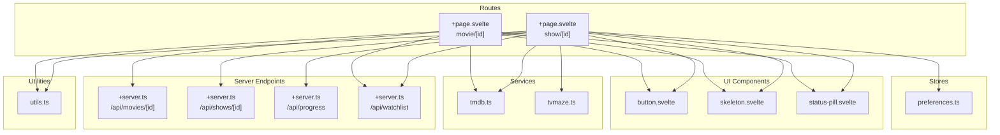
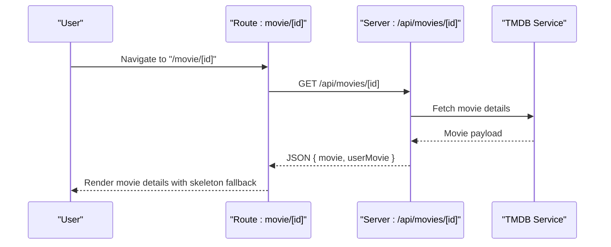
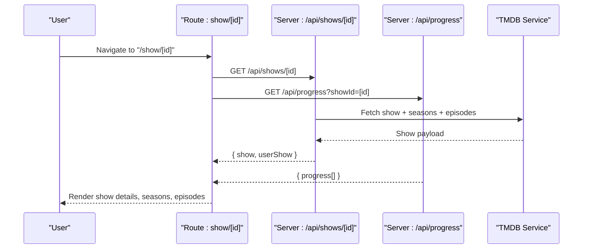
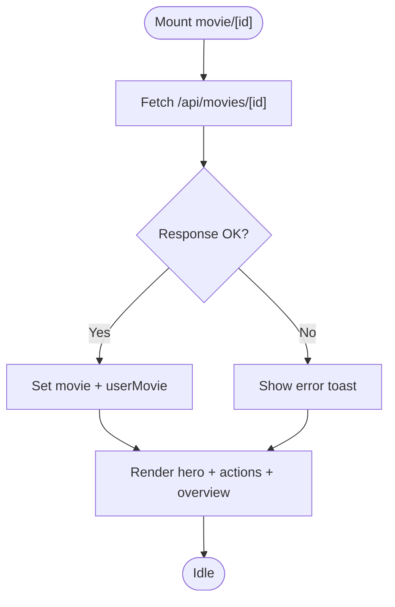
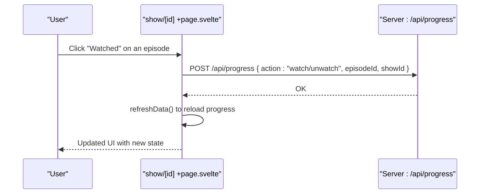
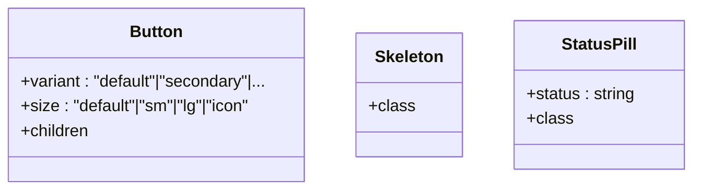
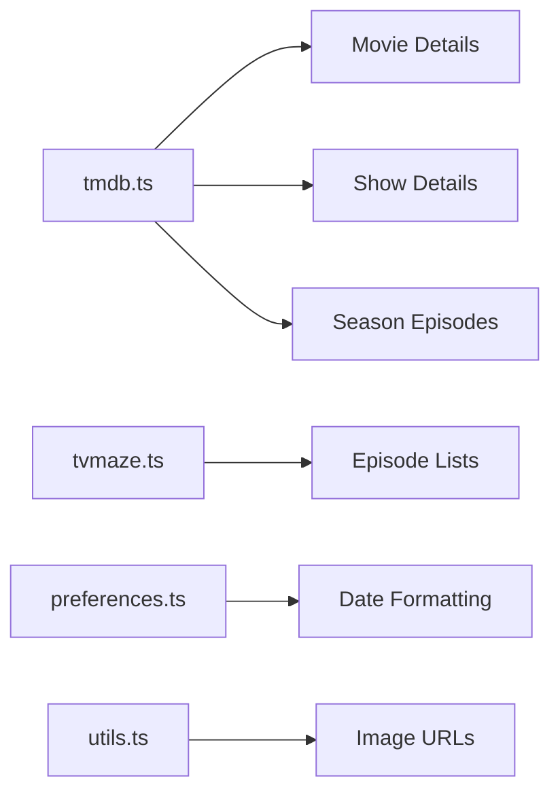
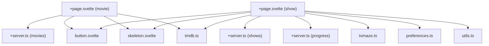

# Content Details

<cite>
**Referenced Files in This Document**
- [+page.svelte](file://src/routes/(app)/movie/[id]/+page.svelte)
- [+page.svelte](file://src/routes/(app)/show/[id]/+page.svelte)
- [status-pill.svelte](file://src/lib/components/custom/status-pill.svelte)
- [button.svelte](file://src/lib/components/ui/button.svelte)
- [skeleton.svelte](file://src/lib/components/ui/skeleton.svelte)
- [tmdb.ts](file://src/lib/services/tmdb.ts)
- [tvmaze.ts](file://src/lib/services/tvmaze.ts)
- [preferences.ts](file://src/lib/stores/preferences.ts)
- [utils.ts](file://src/lib/utils.ts)
- [+server.ts](file://src/routes/api/movies/[id]/+server.ts)
- [+server.ts](file://src/routes/api/shows/[id]/+server.ts)
- [+server.ts](file://src/routes/api/progress/+server.ts)
- [+server.ts](file://src/routes/api/watchlist/+server.ts)
</cite>

## Table of Contents
1. [Introduction](#introduction)
2. [Project Structure](#project-structure)
3. [Core Components](#core-components)
4. [Architecture Overview](#architecture-overview)
5. [Detailed Component Analysis](#detailed-component-analysis)
6. [Dependency Analysis](#dependency-analysis)
7. [Performance Considerations](#performance-considerations)
8. [Troubleshooting Guide](#troubleshooting-guide)
9. [Conclusion](#conclusion)
10. [Appendices](#appendices)

## Introduction
This document explains the Content Details pages for movies and TV shows in the application. It covers dynamic routing, metadata rendering, watchlist controls, season/episode progression for shows, skeleton-based loading, and how the UI integrates with backend APIs. It also outlines responsive design patterns, accessibility considerations, SEO optimization, and performance strategies for media-heavy pages.

## Project Structure
The Content Details feature spans client-side Svelte pages, UI components, and server endpoints:
- Dynamic routes:
  - Movie details: `/movie/[id]`
  - Show details: `/show/[id]`
- UI components:
  - Reusable button and skeleton components
  - Status pill for watch status
- Services:
  - TMDB service for movie/show metadata and images
  - TVMaze service for episode lists (when applicable)
- Stores:
  - Preferences store for timezone formatting
- Utilities:
  - Image URL helpers and shared utilities

**Diagram sources**
- [+page.svelte](file://src/routes/(app)/movie/[id]/+page.svelte#L1-L146)
- [+page.svelte](file://src/routes/(app)/show/[id]/+page.svelte#L1-L330)
- [button.svelte:1-45](file://src/lib/components/ui/button.svelte#L1-L45)
- [skeleton.svelte:1-8](file://src/lib/components/ui/skeleton.svelte#L1-L8)
- [status-pill.svelte:1-32](file://src/lib/components/custom/status-pill.svelte#L1-L32)
- [tmdb.ts:1-167](file://src/lib/services/tmdb.ts#L1-L167)
- [tvmaze.ts:1-24](file://src/lib/services/tvmaze.ts#L1-L24)
- [preferences.ts](file://src/lib/stores/preferences.ts)
- [utils.ts](file://src/lib/utils.ts)
- [+server.ts](file://src/routes/api/movies/[id]/+server.ts)
- [+server.ts](file://src/routes/api/shows/[id]/+server.ts)
- [+server.ts](file://src/routes/api/progress/+server.ts)
- [+server.ts](file://src/routes/api/watchlist/+server.ts)

**Section sources**
- [+page.svelte](file://src/routes/(app)/movie/[id]/+page.svelte#L1-L146)
- [+page.svelte](file://src/routes/(app)/show/[id]/+page.svelte#L1-L330)
- [button.svelte:1-45](file://src/lib/components/ui/button.svelte#L1-L45)
- [skeleton.svelte:1-8](file://src/lib/components/ui/skeleton.svelte#L1-L8)
- [status-pill.svelte:1-32](file://src/lib/components/custom/status-pill.svelte#L1-L32)
- [tmdb.ts:1-167](file://src/lib/services/tmdb.ts#L1-L167)
- [tvmaze.ts:1-24](file://src/lib/services/tvmaze.ts#L1-L24)
- [preferences.ts](file://src/lib/stores/preferences.ts)
- [utils.ts](file://src/lib/utils.ts)

## Core Components
- Movie Details Page
  - Loads movie metadata and user-specific watch status via a dedicated API endpoint.
  - Renders hero backdrop/poster, title, year/runtime/genres, overview, and watchlist actions.
  - Uses skeleton loaders during initial fetch and toast notifications for feedback.
- Show Details Page
  - Loads show metadata and episode progress concurrently.
  - Provides season selection, episode toggling, and bulk actions (mark season watched, mark caught up, reset progress).
  - Displays progress bar and status pill for user’s show status.
- Shared UI
  - Button component supports multiple variants and sizes.
  - Skeleton component provides lightweight loading placeholders.
  - Status pill renders semantic labels and colors for watch statuses.

**Section sources**
- [+page.svelte](file://src/routes/(app)/movie/[id]/+page.svelte#L1-L146)
- [+page.svelte](file://src/routes/(app)/show/[id]/+page.svelte#L1-L330)
- [button.svelte:1-45](file://src/lib/components/ui/button.svelte#L1-L45)
- [skeleton.svelte:1-8](file://src/lib/components/ui/skeleton.svelte#L1-L8)
- [status-pill.svelte:1-32](file://src/lib/components/custom/status-pill.svelte#L1-L32)

## Architecture Overview
The Content Details architecture follows a client-driven SvelteKit app with server endpoints for data and user operations.

**Diagram sources**
- [+page.svelte](file://src/routes/(app)/movie/[id]/+page.svelte#L17-L28)
- [+server.ts](file://src/routes/api/movies/[id]/+server.ts)
- [tmdb.ts:88-104](file://src/lib/services/tmdb.ts#L88-L104)

**Diagram sources**
- [+page.svelte](file://src/routes/(app)/show/[id]/+page.svelte#L25-L50)
- [+server.ts](file://src/routes/api/shows/[id]/+server.ts)
- [+server.ts](file://src/routes/api/progress/+server.ts)
- [tmdb.ts:39-66](file://src/lib/services/tmdb.ts#L39-L66)

## Detailed Component Analysis

### Movie Details Page
- Dynamic Route Handling
  - Reads the movie ID from route params and loads data on mount.
- Metadata Rendering
  - Backdrop/poster URLs constructed via image utilities.
  - Title, release year, runtime, genres, and overview rendered conditionally.
- Watchlist Controls
  - Add to watchlist with predefined statuses.
  - Remove from watchlist and update local state.
  - Toast notifications provide user feedback.
- Loading and Accessibility
  - Skeleton placeholders improve perceived performance.
  - Head tag sets page title dynamically.

**Diagram sources**
- [+page.svelte](file://src/routes/(app)/movie/[id]/+page.svelte#L17-L28)
- [+page.svelte](file://src/routes/(app)/movie/[id]/+page.svelte#L30-L69)

**Section sources**
- [+page.svelte](file://src/routes/(app)/movie/[id]/+page.svelte#L1-L146)

### Show Details Page
- Dynamic Route Handling
  - Loads show and progress concurrently on mount.
  - Selects a valid season and defaults to the first if invalid.
- Season and Episode Selection
  - Season dropdown drives episode list.
  - Expandable episode rows with optional synopsis.
- Progress Tracking
  - Toggle individual episodes as watched/unwatched.
  - Bulk actions: mark season watched, mark caught up, reset progress.
- Watchlist Controls
  - Change show status among multiple states.
  - Remove from watchlist and navigate to home.
- Rendering and UX
  - Progress bar shows overall completion percentage.
  - Status pill reflects current user status.
  - Timezone-aware air date formatting via preferences store.

**Diagram sources**
- [+page.svelte](file://src/routes/(app)/show/[id]/+page.svelte#L63-L75)
- [+page.svelte](file://src/routes/(app)/show/[id]/+page.svelte#L36-L50)
- [+server.ts](file://src/routes/api/progress/+server.ts)

**Section sources**
- [+page.svelte](file://src/routes/(app)/show/[id]/+page.svelte#L1-L330)

### UI Components
- Button
  - Supports variants (default, secondary, outline, ghost, destructive, link) and sizes (default, sm, lg, icon).
- Skeleton
  - Lightweight pulse animation for loading states.
- Status Pill
  - Maps status values to color classes and labels for consistent semantics.

**Diagram sources**
- [button.svelte:1-45](file://src/lib/components/ui/button.svelte#L1-L45)
- [skeleton.svelte:1-8](file://src/lib/components/ui/skeleton.svelte#L1-L8)
- [status-pill.svelte:1-32](file://src/lib/components/custom/status-pill.svelte#L1-L32)

**Section sources**
- [button.svelte:1-45](file://src/lib/components/ui/button.svelte#L1-L45)
- [skeleton.svelte:1-8](file://src/lib/components/ui/skeleton.svelte#L1-L8)
- [status-pill.svelte:1-32](file://src/lib/components/custom/status-pill.svelte#L1-L32)

### Services and Utilities
- TMDB Service
  - Provides movie and show details, trending/popular/top-rated lists, and season/episode summaries.
  - Handles API errors via response checks.
- TVMaze Service
  - Provides show search and episode lists for alternate sources.
- Preferences Store
  - Supplies timezone for date formatting in show details.
- Utilities
  - Image URL builders for backdrops and posters.

**Diagram sources**
- [tmdb.ts:1-167](file://src/lib/services/tmdb.ts#L1-L167)
- [tvmaze.ts:1-24](file://src/lib/services/tvmaze.ts#L1-L24)
- [preferences.ts](file://src/lib/stores/preferences.ts)
- [utils.ts](file://src/lib/utils.ts)

**Section sources**
- [tmdb.ts:1-167](file://src/lib/services/tmdb.ts#L1-L167)
- [tvmaze.ts:1-24](file://src/lib/services/tvmaze.ts#L1-L24)
- [preferences.ts](file://src/lib/stores/preferences.ts)
- [utils.ts](file://src/lib/utils.ts)

## Dependency Analysis
- Route pages depend on:
  - Server endpoints for content and user progress.
  - UI components for actions and loading states.
  - Services for external metadata.
  - Utilities for image URLs.
- Coupling and Cohesion
  - Pages encapsulate UI logic and orchestrate data fetching.
  - Services isolate network concerns and normalize data.
  - Components are reusable and self-contained.

**Diagram sources**
- [+page.svelte](file://src/routes/(app)/movie/[id]/+page.svelte#L1-L146)
- [+page.svelte](file://src/routes/(app)/show/[id]/+page.svelte#L1-L330)
- [+server.ts](file://src/routes/api/movies/[id]/+server.ts)
- [+server.ts](file://src/routes/api/shows/[id]/+server.ts)
- [+server.ts](file://src/routes/api/progress/+server.ts)
- [button.svelte:1-45](file://src/lib/components/ui/button.svelte#L1-L45)
- [skeleton.svelte:1-8](file://src/lib/components/ui/skeleton.svelte#L1-L8)
- [tmdb.ts:1-167](file://src/lib/services/tmdb.ts#L1-L167)
- [tvmaze.ts:1-24](file://src/lib/services/tvmaze.ts#L1-L24)
- [preferences.ts](file://src/lib/stores/preferences.ts)
- [utils.ts](file://src/lib/utils.ts)

**Section sources**
- [+page.svelte](file://src/routes/(app)/movie/[id]/+page.svelte#L1-L146)
- [+page.svelte](file://src/routes/(app)/show/[id]/+page.svelte#L1-L330)
- [+server.ts](file://src/routes/api/movies/[id]/+server.ts)
- [+server.ts](file://src/routes/api/shows/[id]/+server.ts)
- [+server.ts](file://src/routes/api/progress/+server.ts)
- [button.svelte:1-45](file://src/lib/components/ui/button.svelte#L1-L45)
- [skeleton.svelte:1-8](file://src/lib/components/ui/skeleton.svelte#L1-L8)
- [tmdb.ts:1-167](file://src/lib/services/tmdb.ts#L1-L167)
- [tvmaze.ts:1-24](file://src/lib/services/tvmaze.ts#L1-L24)
- [preferences.ts](file://src/lib/stores/preferences.ts)
- [utils.ts](file://src/lib/utils.ts)

## Performance Considerations
- Lazy Loading of Media Assets
  - Use native lazy loading attributes on images when rendering posters/backdrops.
  - Defer non-critical DOM updates until after initial render.
- Skeleton-Based Loading
  - Skeleton placeholders reduce layout shift and improve perceived performance.
- Concurrent Data Fetches
  - Show details page fetches show and progress in parallel to minimize wait time.
- Caching Strategies
  - Client-side memoization of fetched data per session.
  - Server-side caching of popular content endpoints (e.g., trending) to reduce upstream calls.
- Image Optimization
  - Prefer appropriately sized images from utilities to avoid oversized assets.
- Bundle Size
  - Keep UI components small and tree-shakeable; avoid importing unused variants.

[No sources needed since this section provides general guidance]

## Troubleshooting Guide
- Missing Content
  - Movie/Show not found: The pages render a neutral message when no content is present.
- Network Failures
  - On fetch errors, pages display toast notifications and keep loading indicators until resolved.
- Progress Updates
  - If toggling episodes fails, the UI reverts to previous state; ensure the progress endpoint is reachable and returns success.
- Watchlist Operations
  - If adding/removing from watchlist fails, verify the watchlist endpoint and user authentication context.

**Section sources**
- [+page.svelte](file://src/routes/(app)/movie/[id]/+page.svelte#L141-L145)
- [+page.svelte](file://src/routes/(app)/show/[id]/+page.svelte#L325-L329)
- [+page.svelte](file://src/routes/(app)/movie/[id]/+page.svelte#L23-L27)
- [+page.svelte](file://src/routes/(app)/show/[id]/+page.svelte#L29-L33)
- [+page.svelte](file://src/routes/(app)/show/[id]/+page.svelte#L72-L74)

## Conclusion
The Content Details feature delivers a responsive, accessible, and performant experience for movies and shows. Dynamic routes, skeleton loaders, and robust watchlist/progress controls integrate seamlessly with server endpoints and external services. The modular UI components and service abstractions support maintainability and scalability.

[No sources needed since this section summarizes without analyzing specific files]

## Appendices

### Responsive Design Notes
- Mobile-first layout with stacked hero elements and compact controls.
- Tablet/desktop adjustments for hero sizing, poster visibility, and dense episode lists.
- Accessible affordances: proper contrast, focus states, and ARIA labels for interactive elements.

[No sources needed since this section provides general guidance]

### Accessibility Compliance
- Semantic HTML and Svelte components.
- Focus management for modals and expand/collapse actions.
- Color contrast and readable typography scales.
- ARIA labels for icons and buttons where context requires clarification.

[No sources needed since this section provides general guidance]

### SEO Optimization
- Dynamic page titles set in the head tag.
- Canonical and meta descriptions can be added at the server level for structured metadata.
- Structured data (schema.org) can be emitted for movies/shows to improve search visibility.

[No sources needed since this section provides general guidance]