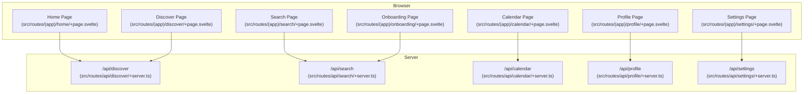
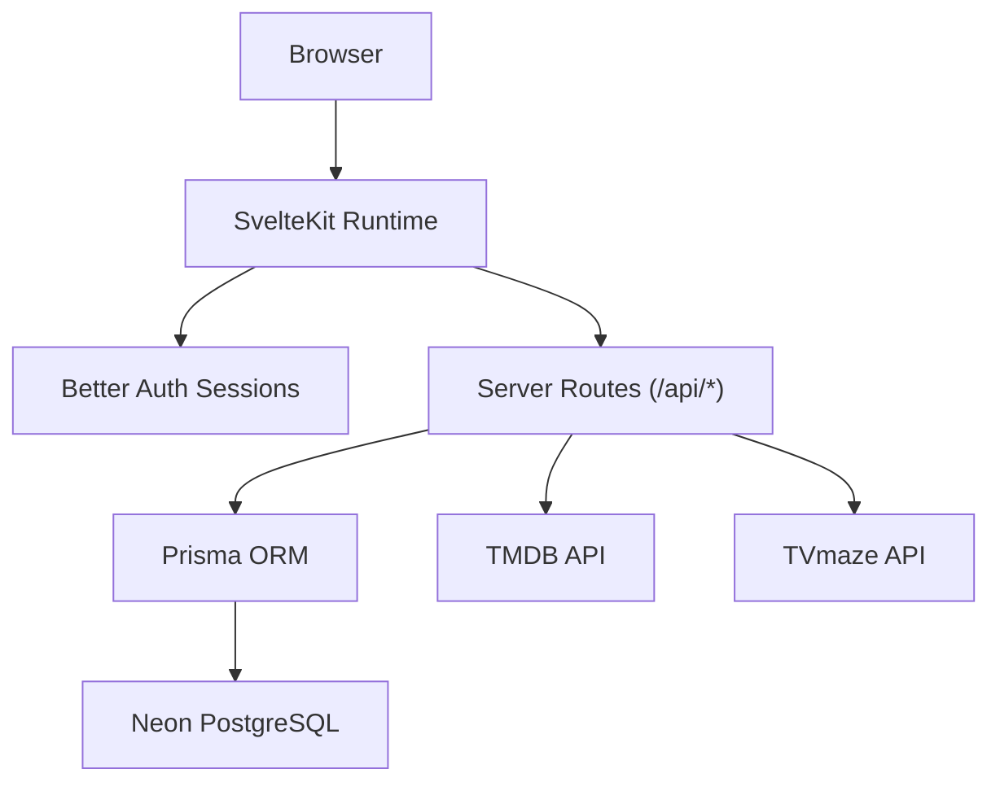
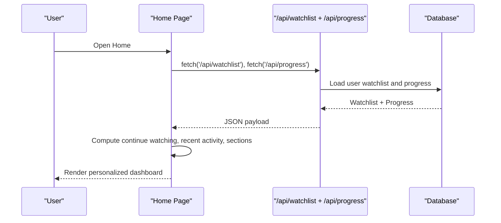
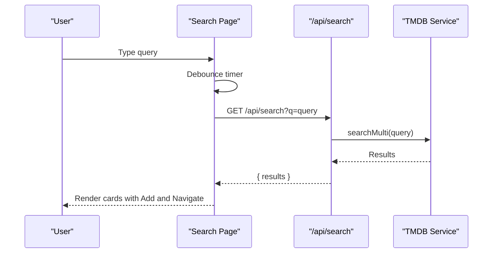
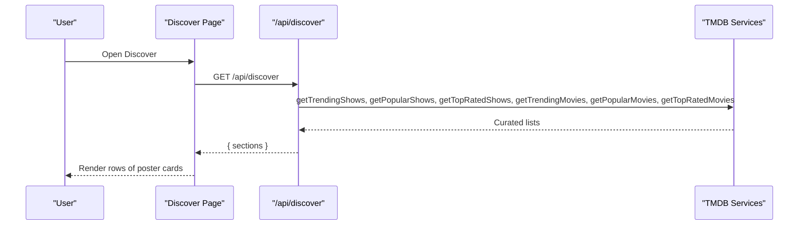
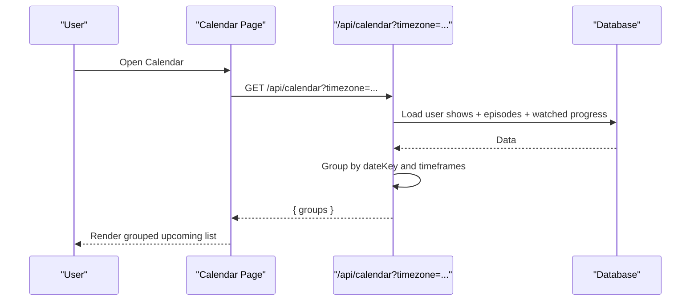
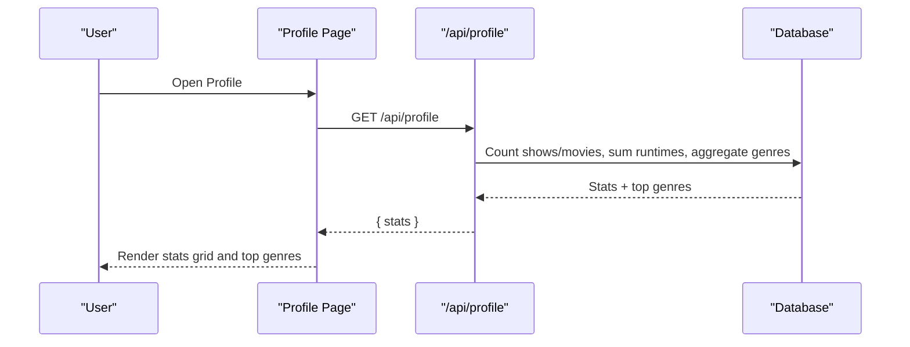
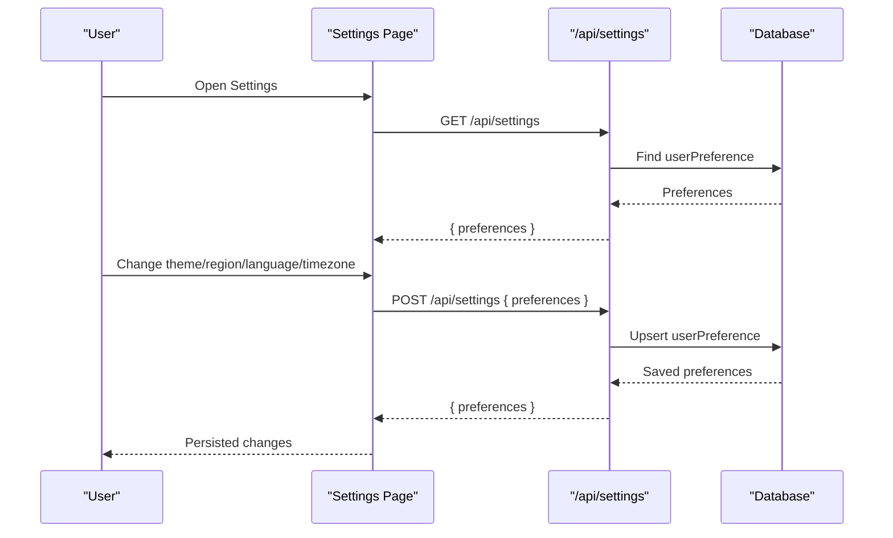
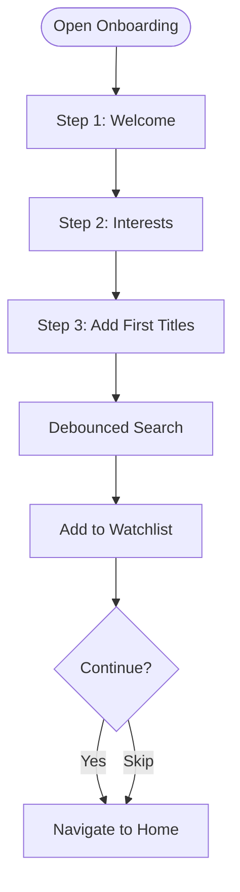
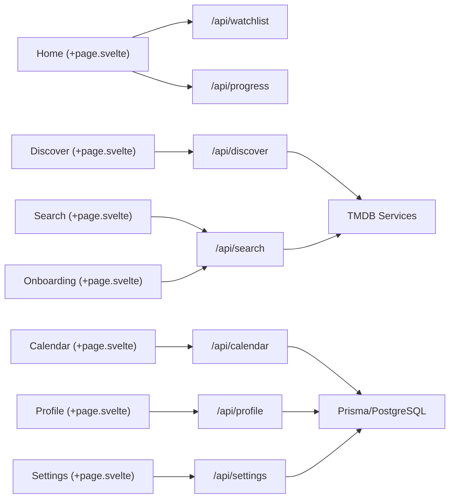

# Feature Implementations

<cite>
**Referenced Files in This Document**
- [README.md](file://README.md)
- [DESIGN.MD](file://DESIGN.MD)
- [SPEC.MD](file://SPEC.MD)
- [src/app.html](file://src/app.html)
- [src/hooks.server.ts](file://src/hooks.server.ts)
- [src/routes/(app)/home/+page.svelte](file://src/routes/(app)/home/+page.svelte)
- [src/routes/(app)/discover/+page.svelte](file://src/routes/(app)/discover/+page.svelte)
- [src/routes/(app)/search/+page.svelte](file://src/routes/(app)/search/+page.svelte)
- [src/routes/(app)/calendar/+page.svelte](file://src/routes/(app)/calendar/+page.svelte)
- [src/routes/(app)/profile/+page.svelte](file://src/routes/(app)/profile/+page.svelte)
- [src/routes/(app)/settings/+page.svelte](file://src/routes/(app)/settings/+page.svelte)
- [src/routes/(app)/onboarding/+page.svelte](file://src/routes/(app)/onboarding/+page.svelte)
- [src/routes/api/discover/+server.ts](file://src/routes/api/discover/+server.ts)
- [src/routes/api/search/+server.ts](file://src/routes/api/search/+server.ts)
- [src/routes/api/calendar/+server.ts](file://src/routes/api/calendar/+server.ts)
- [src/routes/api/profile/+server.ts](file://src/routes/api/profile/+server.ts)
- [src/routes/api/settings/+server.ts](file://src/routes/api/settings/+server.ts)
</cite>

## Table of Contents
1. [Introduction](#introduction)
2. [Project Structure](#project-structure)
3. [Core Components](#core-components)
4. [Architecture Overview](#architecture-overview)
5. [Detailed Component Analysis](#detailed-component-analysis)
6. [Dependency Analysis](#dependency-analysis)
7. [Performance Considerations](#performance-considerations)
8. [Troubleshooting Guide](#troubleshooting-guide)
9. [Conclusion](#conclusion)

## Introduction
This document explains the feature implementations for Screenlog, a modern, mobile-first watch tracker for TV shows, movies, and anime. It covers the home dashboard with personalized content, search functionality, content detail pages, calendar view, user profile and analytics, settings management, and onboarding experience. It also documents implementation patterns, data flows, UI interactions, state management, backend integration, customization, accessibility, and performance considerations.

## Project Structure
Screenlog is a SvelteKit application organized into:
- UI pages under src/routes/(app) for authenticated features
- API endpoints under src/routes/api for server-side operations
- Shared UI components, stores, and utilities under src/lib
- Database schema under prisma/schema.prisma
- Global theme initialization in src/app.html
- Session hydration in src/hooks.server.ts

**Diagram sources**
- [src/routes/(app)/home/+page.svelte](file://src/routes/(app)/home/+page.svelte)
- [src/routes/(app)/discover/+page.svelte](file://src/routes/(app)/discover/+page.svelte)
- [src/routes/(app)/search/+page.svelte](file://src/routes/(app)/search/+page.svelte)
- [src/routes/(app)/calendar/+page.svelte](file://src/routes/(app)/calendar/+page.svelte)
- [src/routes/(app)/profile/+page.svelte](file://src/routes/(app)/profile/+page.svelte)
- [src/routes/(app)/settings/+page.svelte](file://src/routes/(app)/settings/+page.svelte)
- [src/routes/(app)/onboarding/+page.svelte](file://src/routes/(app)/onboarding/+page.svelte)
- [src/routes/api/discover/+server.ts](file://src/routes/api/discover/+server.ts)
- [src/routes/api/search/+server.ts](file://src/routes/api/search/+server.ts)
- [src/routes/api/calendar/+server.ts](file://src/routes/api/calendar/+server.ts)
- [src/routes/api/profile/+server.ts](file://src/routes/api/profile/+server.ts)
- [src/routes/api/settings/+server.ts](file://src/routes/api/settings/+server.ts)

**Section sources**
- [README.md:16-26](file://README.md#L16-L26)
- [src/app.html:1-25](file://src/app.html#L1-L25)
- [src/hooks.server.ts:1-18](file://src/hooks.server.ts#L1-L18)

## Core Components
- Home dashboard: Personalized watchlist with sections for continue watching, recent activity, and paginated lists by status; immediate actions to mark episodes watched and navigate to detail.
- Discover: Trending, popular, and top-rated content sections; add-to-watchlist and detail navigation.
- Search: Debounced search with filters; result cards with add and navigate actions.
- Calendar: Grouped upcoming episodes by timeframes; timezone-aware grouping.
- Profile: Stats (tracked shows, completed, episodes, movies, watch time) and top genres.
- Settings: Theme selection, region/language/timezone preferences, sign out, and account deletion flow.
- Onboarding: Welcome, interest selection, search-and-add first titles, and completion.

**Section sources**
- [src/routes/(app)/home/+page.svelte:1-552](file://src/routes/(app)/home/+page.svelte#L1-L552)
- [src/routes/(app)/discover/+page.svelte:1-127](file://src/routes/(app)/discover/+page.svelte#L1-L127)
- [src/routes/(app)/search/+page.svelte:1-154](file://src/routes/(app)/search/+page.svelte#L1-L154)
- [src/routes/(app)/calendar/+page.svelte:1-93](file://src/routes/(app)/calendar/+page.svelte#L1-L93)
- [src/routes/(app)/profile/+page.svelte:1-85](file://src/routes/(app)/profile/+page.svelte#L1-L85)
- [src/routes/(app)/settings/+page.svelte:1-193](file://src/routes/(app)/settings/+page.svelte#L1-L193)
- [src/routes/(app)/onboarding/+page.svelte:1-132](file://src/routes/(app)/onboarding/+page.svelte#L1-L132)

## Architecture Overview
Screenlog follows a layered architecture:
- UI layer: SvelteKit pages and components
- Server/API layer: SvelteKit server routes handling authenticated operations
- Content integration: Calls to TMDB and TVmaze via server-only services
- Persistence: Prisma ORM over Neon PostgreSQL
- Authentication: Better Auth session hydration via hooks

**Diagram sources**
- [src/hooks.server.ts:1-18](file://src/hooks.server.ts#L1-L18)
- [src/routes/api/discover/+server.ts:1-21](file://src/routes/api/discover/+server.ts#L1-L21)
- [src/routes/api/search/+server.ts:1-16](file://src/routes/api/search/+server.ts#L1-L16)
- [src/routes/api/calendar/+server.ts:1-82](file://src/routes/api/calendar/+server.ts#L1-L82)
- [src/routes/api/profile/+server.ts:1-66](file://src/routes/api/profile/+server.ts#L1-L66)
- [src/routes/api/settings/+server.ts:1-29](file://src/routes/api/settings/+server.ts#L1-L29)

## Detailed Component Analysis

### Home Dashboard
The Home page aggregates personalized content:
- Loads watchlist and progress concurrently
- Computes derived data for continue watching, recent activity, and per-status sections
- Supports pagination per section and quick actions (mark episode watched, mark movie watched)
- Renders skeleton loaders and empty state guidance

**Diagram sources**
- [src/routes/(app)/home/+page.svelte:32-51](file://src/routes/(app)/home/+page.svelte#L32-L51)
- [src/routes/(app)/home/+page.svelte:96-123](file://src/routes/(app)/home/+page.svelte#L96-L123)

**Section sources**
- [src/routes/(app)/home/+page.svelte:1-552](file://src/routes/(app)/home/+page.svelte#L1-L552)

### Search
Search provides quick discovery with debounced input:
- Debounces user input to reduce network calls
- Filters results client-side by type
- Adds items to watchlist and navigates to detail via lookup endpoint

**Diagram sources**
- [src/routes/(app)/search/+page.svelte:18-36](file://src/routes/(app)/search/+page.svelte#L18-L36)
- [src/routes/api/search/+server.ts:5-15](file://src/routes/api/search/+server.ts#L5-L15)

**Section sources**
- [src/routes/(app)/search/+page.svelte:1-154](file://src/routes/(app)/search/+page.svelte#L1-L154)

### Discover
Discover renders curated sections from TMDB:
- Concurrently loads trending, popular, and top-rated shows and movies
- Uses a lookup endpoint to resolve internal IDs before navigation
- Renders poster cards with add-to-watchlist and click-to-detail actions

**Diagram sources**
- [src/routes/(app)/discover/+page.svelte:12-21](file://src/routes/(app)/discover/+page.svelte#L12-L21)
- [src/routes/api/discover/+server.ts:5-20](file://src/routes/api/discover/+server.ts#L5-L20)

**Section sources**
- [src/routes/(app)/discover/+page.svelte:1-127](file://src/routes/(app)/discover/+page.svelte#L1-L127)

### Calendar
Calendar groups upcoming episodes by timeframe:
- Loads user shows and episodes, excludes watched episodes
- Groups by today, tomorrow, this week, next week, later using user timezone
- Navigates to show detail on item click

**Diagram sources**
- [src/routes/(app)/calendar/+page.svelte:14-28](file://src/routes/(app)/calendar/+page.svelte#L14-L28)
- [src/routes/api/calendar/+server.ts:9-81](file://src/routes/api/calendar/+server.ts#L9-L81)

**Section sources**
- [src/routes/(app)/calendar/+page.svelte:1-93](file://src/routes/(app)/calendar/+page.svelte#L1-L93)

### Profile
Profile displays user stats and top genres:
- Aggregates counts and computes total watch time from episode and movie runtimes
- Builds top genres from show and movie genre lists
- Uses derived page data for user identity

**Diagram sources**
- [src/routes/(app)/profile/+page.svelte:12-21](file://src/routes/(app)/profile/+page.svelte#L12-L21)
- [src/routes/api/profile/+server.ts:5-65](file://src/routes/api/profile/+server.ts#L5-L65)

**Section sources**
- [src/routes/(app)/profile/+page.svelte:1-85](file://src/routes/(app)/profile/+page.svelte#L1-L85)

### Settings
Settings manages appearance and preferences:
- Loads current preferences and allows saving region, language, and timezone
- Updates theme via a store and persists preferences to the database
- Provides sign out and account deletion flow

**Diagram sources**
- [src/routes/(app)/settings/+page.svelte:21-31](file://src/routes/(app)/settings/+page.svelte#L21-L31)
- [src/routes/(app)/settings/+page.svelte:39-54](file://src/routes/(app)/settings/+page.svelte#L39-L54)
- [src/routes/api/settings/+server.ts:5-28](file://src/routes/api/settings/+server.ts#L5-L28)

**Section sources**
- [src/routes/(app)/settings/+page.svelte:1-193](file://src/routes/(app)/settings/+page.svelte#L1-L193)

### Onboarding
Onboarding accelerates first-time value:
- Welcome screen
- Interest selection (genres)
- Search-and-add first titles with immediate feedback
- Continues to Home after completion or skip

**Diagram sources**
- [src/routes/(app)/onboarding/+page.svelte:77-130](file://src/routes/(app)/onboarding/+page.svelte#L77-L130)

**Section sources**
- [src/routes/(app)/onboarding/+page.svelte:1-132](file://src/routes/(app)/onboarding/+page.svelte#L1-L132)

## Dependency Analysis
- UI pages depend on server routes for authenticated data and actions
- Server routes depend on Prisma for persistence and TMDB/TVmaze for content
- Theme initialization is bootstrapped in the HTML template
- Session hydration is centralized in hooks.server.ts

**Diagram sources**
- [src/routes/(app)/home/+page.svelte](file://src/routes/(app)/home/+page.svelte)
- [src/routes/(app)/discover/+page.svelte](file://src/routes/(app)/discover/+page.svelte)
- [src/routes/(app)/search/+page.svelte](file://src/routes/(app)/search/+page.svelte)
- [src/routes/(app)/calendar/+page.svelte](file://src/routes/(app)/calendar/+page.svelte)
- [src/routes/(app)/profile/+page.svelte](file://src/routes/(app)/profile/+page.svelte)
- [src/routes/(app)/settings/+page.svelte](file://src/routes/(app)/settings/+page.svelte)
- [src/routes/(app)/onboarding/+page.svelte](file://src/routes/(app)/onboarding/+page.svelte)
- [src/routes/api/discover/+server.ts](file://src/routes/api/discover/+server.ts)
- [src/routes/api/search/+server.ts](file://src/routes/api/search/+server.ts)
- [src/routes/api/calendar/+server.ts](file://src/routes/api/calendar/+server.ts)
- [src/routes/api/profile/+server.ts](file://src/routes/api/profile/+server.ts)
- [src/routes/api/settings/+server.ts](file://src/routes/api/settings/+server.ts)

**Section sources**
- [src/app.html:1-25](file://src/app.html#L1-L25)
- [src/hooks.server.ts:1-18](file://src/hooks.server.ts#L1-L18)

## Performance Considerations
- Debounced search reduces redundant network calls and improves responsiveness.
- Parallel loading of watchlist and progress on Home minimizes perceived latency.
- Skeleton loaders provide perceived performance and graceful loading states.
- Pagination per section limits DOM size and improves scrolling performance.
- Timezone-aware grouping avoids repeated conversions and ensures correctness.
- Theme initialization in HTML prevents FOUC and improves first paint.

[No sources needed since this section provides general guidance]

## Troubleshooting Guide
- Unauthorized responses from server routes indicate missing or invalid Better Auth sessions; verify hooks.server.ts hydration and client-side redirects.
- Toast notifications surface common errors for search, add-to-watchlist, and navigation failures; confirm network connectivity and API endpoints.
- Calendar grouping relies on user timezone; ensure timezone parameter is passed and user preferences are persisted.
- Profile stats aggregation depends on runtime data; missing runtimes are safely ignored to avoid partial results.

**Section sources**
- [src/routes/api/discover/+server.ts:6](file://src/routes/api/discover/+server.ts#L6)
- [src/routes/api/search/+server.ts:6](file://src/routes/api/search/+server.ts#L6)
- [src/routes/api/calendar/+server.ts:10](file://src/routes/api/calendar/+server.ts#L10)
- [src/routes/api/profile/+server.ts:6](file://src/routes/api/profile/+server.ts#L6)
- [src/routes/api/settings/+server.ts:6](file://src/routes/api/settings/+server.ts#L6)
- [src/routes/(app)/home/+page.svelte:47](file://src/routes/(app)/home/+page.svelte#L47)
- [src/routes/(app)/discover/+page.svelte:17](file://src/routes/(app)/discover/+page.svelte#L17)
- [src/routes/(app)/search/+page.svelte:31](file://src/routes/(app)/search/+page.svelte#L31)
- [src/routes/(app)/calendar/+page.svelte:20](file://src/routes/(app)/calendar/+page.svelte#L20)
- [src/routes/(app)/profile/+page.svelte:17](file://src/routes/(app)/profile/+page.svelte#L17)
- [src/routes/(app)/settings/+page.svelte:50](file://src/routes/(app)/settings/+page.svelte#L50)

## Conclusion
Screenlog’s feature set is implemented with a clean separation between UI, server routes, content services, and persistence. The design emphasizes instant actions, mobile-first UX, and personalized experiences. Server-side authentication and API boundaries protect secrets and normalize external data. The documented flows and patterns enable maintainability, customization, and scalability.