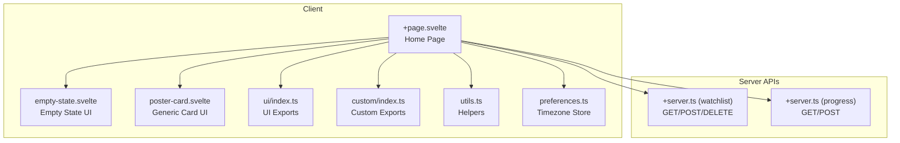
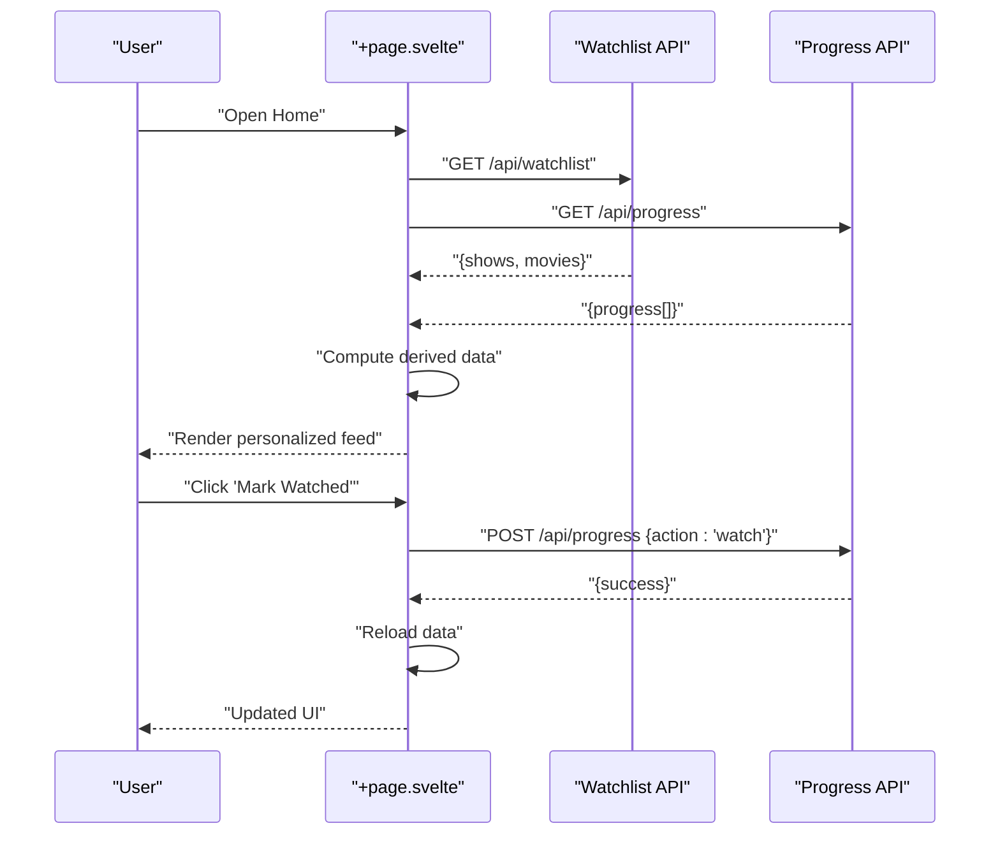
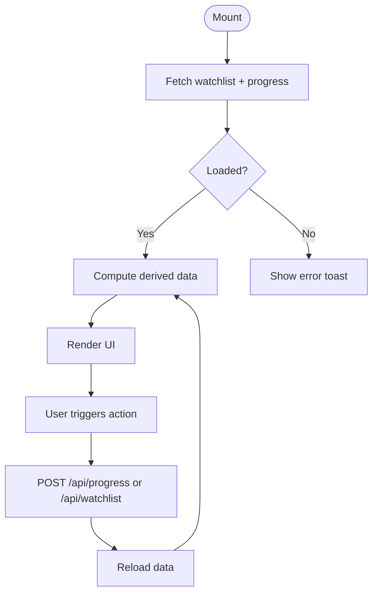
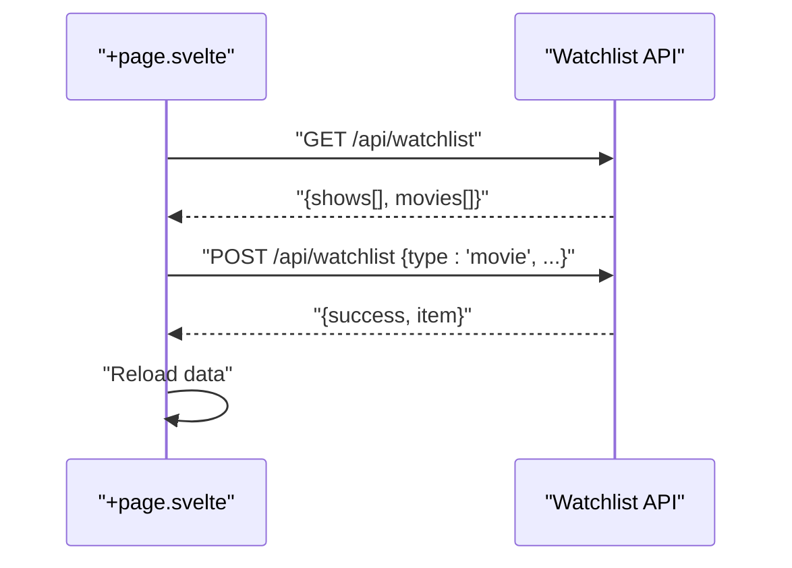
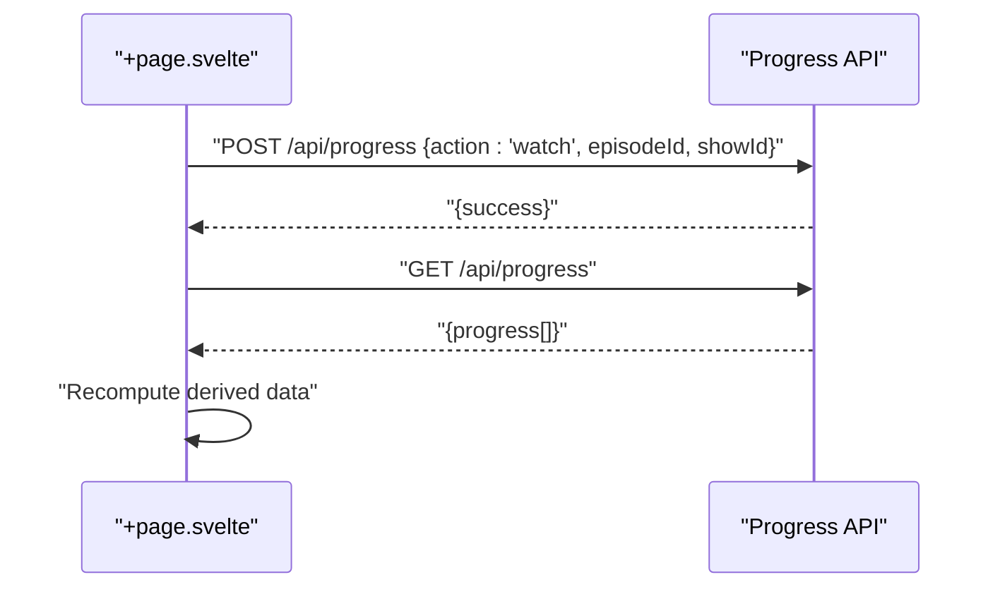
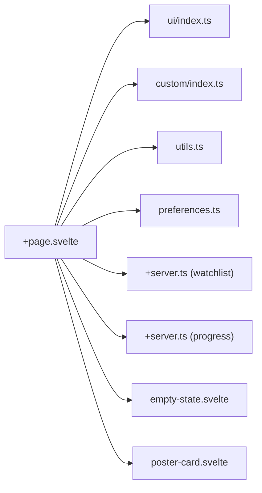

# Home Dashboard

<cite>
**Referenced Files in This Document**
- [+page.svelte](file://src/routes/(app)/home/+page.svelte)
- [preferences.ts](file://src/lib/stores/preferences.ts)
- [utils.ts](file://src/lib/utils.ts)
- [empty-state.svelte](file://src/lib/components/custom/empty-state.svelte)
- [poster-card.svelte](file://src/lib/components/custom/poster-card.svelte)
- [index.ts (custom)](file://src/lib/components/custom/index.ts)
- [index.ts (ui)](file://src/lib/components/ui/index.ts)
- [+server.ts (watchlist)](file://src/routes/api/watchlist/+server.ts)
- [+server.ts (progress)](file://src/routes/api/progress/+server.ts)
</cite>

## Table of Contents
1. [Introduction](#introduction)
2. [Project Structure](#project-structure)
3. [Core Components](#core-components)
4. [Architecture Overview](#architecture-overview)
5. [Detailed Component Analysis](#detailed-component-analysis)
6. [Dependency Analysis](#dependency-analysis)
7. [Performance Considerations](#performance-considerations)
8. [Troubleshooting Guide](#troubleshooting-guide)
9. [Conclusion](#conclusion)

## Introduction
This document describes the Home Dashboard feature that powers the personalized content feed and user interface. It covers the home page layout, data fetching from multiple sources, state management, responsive design, feed composition, content card rendering, pagination, and performance optimizations. It also outlines user engagement patterns and how actions like marking content as watched influence downstream state.

## Project Structure
The Home Dashboard is implemented as a Svelte page with local reactive state and derived computations. It integrates UI primitives, custom components, and utility helpers. Data is fetched via two primary API endpoints: watchlist and progress. The UI renders personalized content sections and supports tabbed navigation between TV shows and movies.

**Diagram sources**
- [+page.svelte](file://src/routes/(app)/home/+page.svelte)
- [empty-state.svelte](file://src/lib/components/custom/empty-state.svelte)
- [poster-card.svelte](file://src/lib/components/custom/poster-card.svelte)
- [index.ts (ui)](file://src/lib/components/ui/index.ts)
- [index.ts (custom)](file://src/lib/components/custom/index.ts)
- [utils.ts](file://src/lib/utils.ts)
- [preferences.ts](file://src/lib/stores/preferences.ts)
- [+server.ts (watchlist)](file://src/routes/api/watchlist/+server.ts)
- [+server.ts (progress)](file://src/routes/api/progress/+server.ts)

**Section sources**
- [+page.svelte](file://src/routes/(app)/home/+page.svelte)
- [index.ts (custom)](file://src/lib/components/custom/index.ts)
- [index.ts (ui)](file://src/lib/components/ui/index.ts)
- [utils.ts](file://src/lib/utils.ts)
- [preferences.ts](file://src/lib/stores/preferences.ts)
- [+server.ts (watchlist)](file://src/routes/api/watchlist/+server.ts)
- [+server.ts (progress)](file://src/routes/api/progress/+server.ts)

## Core Components
- Home Page (+page.svelte)
  - Manages loading state, watchlist, and progress data.
  - Implements derived computations for continue watching, recent activity, and per-section lists.
  - Provides pagination state per section and navigation controls.
  - Renders empty state when no content exists and skeleton loaders during initial load.
- Custom Components
  - EmptyState: Prominent empty state with primary and secondary actions.
  - PosterCard: Reusable card for content with optional add button and hover effects.
- Utilities
  - Poster URL generation, runtime formatting, and timezone-aware date helpers.
- Stores
  - User timezone store for localized time formatting.

Key responsibilities:
- Fetch watchlist and progress concurrently on mount.
- Compute derived views for continue watching and recent activity.
- Paginate and render content cards for shows and movies.
- Support user actions such as marking episodes as watched.

**Section sources**
- [+page.svelte](file://src/routes/(app)/home/+page.svelte)
- [empty-state.svelte](file://src/lib/components/custom/empty-state.svelte)
- [poster-card.svelte](file://src/lib/components/custom/poster-card.svelte)
- [utils.ts](file://src/lib/utils.ts)
- [preferences.ts](file://src/lib/stores/preferences.ts)

## Architecture Overview
The Home Dashboard follows a client-driven pattern:
- On mount, the page fetches watchlist and progress data in parallel.
- Derived state computes personalized lists and metadata (next episode, progress percentage).
- UI renders sections with pagination and responsive grids.
- Actions trigger updates to backend state and refresh data.

**Diagram sources**
- [+page.svelte](file://src/routes/(app)/home/+page.svelte)
- [+server.ts (watchlist)](file://src/routes/api/watchlist/+server.ts)
- [+server.ts (progress)](file://src/routes/api/progress/+server.ts)

## Detailed Component Analysis

### Home Page Layout and Sections
- Tabs: Switch between TV Shows and Movies.
- Continue Watching: Cards for ongoing shows with next episode and progress bar.
- Recent Activity: Horizontal scrolling row of recently watched content with timestamps.
- Per-status sections:
  - Shows: Watching, Completed, Plan to Watch, Paused / Dropped.
  - Movies: Favourites, Watched, Plan to Watch, Dropped.
- Empty State: Shown when no content is present, with call-to-action links.

Responsive design:
- Grid layouts adapt from 2 to 5 columns depending on viewport width.
- Horizontal scrolling for recent activity ensures usability on small screens.
- Lazy image loading improves initial load performance.

Accessibility:
- Proper ARIA labels for buttons and navigation.
- Semantic headings and section landmarks.

**Section sources**
- [+page.svelte](file://src/routes/(app)/home/+page.svelte)

### Data Fetching Patterns
- Initial Load: Parallel fetch of watchlist and progress.
- Action Updates: After marking an episode as watched, the page reloads data to reflect status changes.
- Derived Data: Computed from watchlist and progress to minimize re-computation.

**Diagram sources**
- [+page.svelte](file://src/routes/(app)/home/+page.svelte)
- [+server.ts (progress)](file://src/routes/api/progress/+server.ts)
- [+server.ts (watchlist)](file://src/routes/api/watchlist/+server.ts)

**Section sources**
- [+page.svelte](file://src/routes/(app)/home/+page.svelte)
- [+server.ts (progress)](file://src/routes/api/progress/+server.ts)
- [+server.ts (watchlist)](file://src/routes/api/watchlist/+server.ts)

### State Management
- Reactive state:
  - Loading flag for skeleton UI.
  - Watchlist (shows and movies).
  - Progress array.
  - Active tab selection.
  - Pagination state per section (shows and movies).
- Derived state:
  - Continue Watching: computed from watchlist and progress.
  - Recent Activity: deduplicated by showId, limited to top entries.
  - Per-status lists for shows and movies.
- Helpers:
  - Episode tracking and next episode calculation.
  - Time formatting using user timezone store.

**Section sources**
- [+page.svelte](file://src/routes/(app)/home/+page.svelte)
- [preferences.ts](file://src/lib/stores/preferences.ts)

### Personalized Content Display
- Continue Watching:
  - Displays next episode and progress percentage.
  - One-click “Mark Watched” action.
- Recent Activity:
  - Shows thumbnails with season/episode metadata and relative timestamps.
- Status-based sections:
  - Shows progress indicators on posters.
  - Status badges for quick recognition.
- Empty State:
  - Encourages exploration with links to search and discover.

**Section sources**
- [+page.svelte](file://src/routes/(app)/home/+page.svelte)
- [empty-state.svelte](file://src/lib/components/custom/empty-state.svelte)

### Content Cards Rendering
- PosterCard component:
  - Accepts poster path, title, year, type, genres, and optional add handler.
  - Supports hover-triggered add button with visual feedback.
- Home page cards:
  - Click navigates to detail route.
  - Progress bars for shows.
  - Status badges and runtime/year metadata.

**Section sources**
- [poster-card.svelte](file://src/lib/components/custom/poster-card.svelte)
- [+page.svelte](file://src/routes/(app)/home/+page.svelte)

### Pagination Implementation
- Items per page: fixed constant.
- Per-section page indices stored separately for shows and movies.
- Navigation controls:
  - Previous/Next buttons.
  - Page number buttons with current page highlighting.
- Derived pagination:
  - Slice arrays to current page window.
  - Compute total pages and visible range labels.

**Section sources**
- [+page.svelte](file://src/routes/(app)/home/+page.svelte)

### Infinite Scroll Considerations
- Current implementation uses pagination with explicit page controls.
- Infinite scroll is not implemented in the current code.
- Recommendation: Introduce intersection observer or scroll threshold to lazily load subsequent pages while preserving current UX patterns.

[No sources needed since this section provides general guidance]

### API Integrations

#### Watchlist API
- GET: Returns user’s shows and movies with nested seasons/episodes for shows.
- POST: Upserts show/movie into user’s list; creates missing show/movie records and seeds seasons/episodes for shows.
- DELETE: Removes entries from user’s list.

**Diagram sources**
- [+page.svelte](file://src/routes/(app)/home/+page.svelte)
- [+server.ts (watchlist)](file://src/routes/api/watchlist/+server.ts)

**Section sources**
- [+server.ts (watchlist)](file://src/routes/api/watchlist/+server.ts)

#### Progress API
- GET: Returns episode progress for a specific show or latest entries for the user.
- POST: Supports actions:
  - watch: marks an episode as watched and updates show status.
  - unwatch: removes progress for an episode and updates show status.
  - markSeason: marks all episodes in a season as watched.
  - markCaughtUp: marks all episodes as watched and sets appropriate status.
  - resetShow: clears progress and resets show status.

**Diagram sources**
- [+page.svelte](file://src/routes/(app)/home/+page.svelte)
- [+server.ts (progress)](file://src/routes/api/progress/+server.ts)

**Section sources**
- [+server.ts (progress)](file://src/routes/api/progress/+server.ts)

### User Engagement Patterns
- Continue Watching encourages resuming content with minimal friction.
- Recent Activity highlights social and personal momentum.
- Quick action buttons (“Mark Watched”) streamline progress updates.
- Status-based organization helps users quickly locate content by lifecycle stage.

[No sources needed since this section synthesizes patterns from earlier sections]

### A/B Testing and Personalization Strategies
- Current personalization:
  - Derived lists (continue watching, recent activity) based on user progress.
  - Status-based grouping for content discovery.
- A/B testing readiness:
  - No experimental branches detected in the current code.
  - Recommendations:
    - Introduce feature flags for alternative layouts or recommendation weights.
    - Add analytics hooks around section exposure and click-through rates.
    - Segment users by engagement metrics to tailor content ordering.

[No sources needed since this section provides general guidance]

## Dependency Analysis
- Home page depends on:
  - UI primitives (Button, Skeleton).
  - Custom components (EmptyState, PosterCard).
  - Utility helpers (poster URLs, runtime formatting).
  - Stores (user timezone).
  - Server APIs (watchlist, progress).
- Coupling:
  - Minimal coupling to external services via API endpoints.
  - Derived state reduces repeated computation and tight coupling to raw data.

**Diagram sources**
- [+page.svelte](file://src/routes/(app)/home/+page.svelte)
- [index.ts (ui)](file://src/lib/components/ui/index.ts)
- [index.ts (custom)](file://src/lib/components/custom/index.ts)
- [utils.ts](file://src/lib/utils.ts)
- [preferences.ts](file://src/lib/stores/preferences.ts)
- [+server.ts (watchlist)](file://src/routes/api/watchlist/+server.ts)
- [+server.ts (progress)](file://src/routes/api/progress/+server.ts)
- [empty-state.svelte](file://src/lib/components/custom/empty-state.svelte)
- [poster-card.svelte](file://src/lib/components/custom/poster-card.svelte)

**Section sources**
- [+page.svelte](file://src/routes/(app)/home/+page.svelte)
- [index.ts (ui)](file://src/lib/components/ui/index.ts)
- [index.ts (custom)](file://src/lib/components/custom/index.ts)
- [utils.ts](file://src/lib/utils.ts)
- [preferences.ts](file://src/lib/stores/preferences.ts)
- [+server.ts (watchlist)](file://src/routes/api/watchlist/+server.ts)
- [+server.ts (progress)](file://src/routes/api/progress/+server.ts)
- [empty-state.svelte](file://src/lib/components/custom/empty-state.svelte)
- [poster-card.svelte](file://src/lib/components/custom/poster-card.svelte)

## Performance Considerations
- Concurrent data fetching:
  - Watchlist and progress are fetched in parallel to reduce initial load time.
- Derived state:
  - Computation is memoized via Svelte’s derived to avoid redundant work.
- Image optimization:
  - Poster URL helper selects appropriate sizes; lazy loading is used on images.
- Pagination:
  - Limits rendered items per page to improve responsiveness.
- Skeleton loaders:
  - Provide perceived performance during initial load.
- Recommendations:
  - Virtualize long lists if content grows significantly.
  - Debounce or batch progress updates to reduce network churn.
  - Consider caching strategies for frequently accessed sections.

[No sources needed since this section provides general guidance]

## Troubleshooting Guide
- Empty state appears unexpectedly:
  - Verify watchlist and progress endpoints return data after login.
  - Confirm user is authenticated; unauthorized requests return errors.
- “Mark Watched” fails:
  - Check progress API response for errors.
  - Ensure episodeId and showId are valid.
- Progress not updating:
  - Confirm the page reloads data after action.
  - Verify derived computations are recalculated.
- Time formatting anomalies:
  - Ensure user timezone store is set appropriately.

**Section sources**
- [+page.svelte](file://src/routes/(app)/home/+page.svelte)
- [+server.ts (progress)](file://src/routes/api/progress/+server.ts)
- [+server.ts (watchlist)](file://src/routes/api/watchlist/+server.ts)
- [preferences.ts](file://src/lib/stores/preferences.ts)

## Conclusion
The Home Dashboard delivers a responsive, personalized feed by combining derived state, paginated sections, and concise action handlers. Its modular design leverages reusable UI components and utility helpers, while robust API integrations keep the user’s content state synchronized. Future enhancements could introduce infinite scroll, A/B testing hooks, and deeper personalization strategies to further improve engagement and performance.