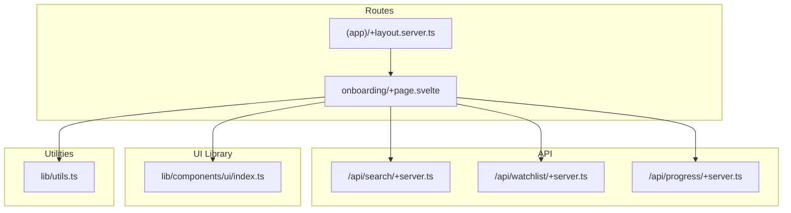
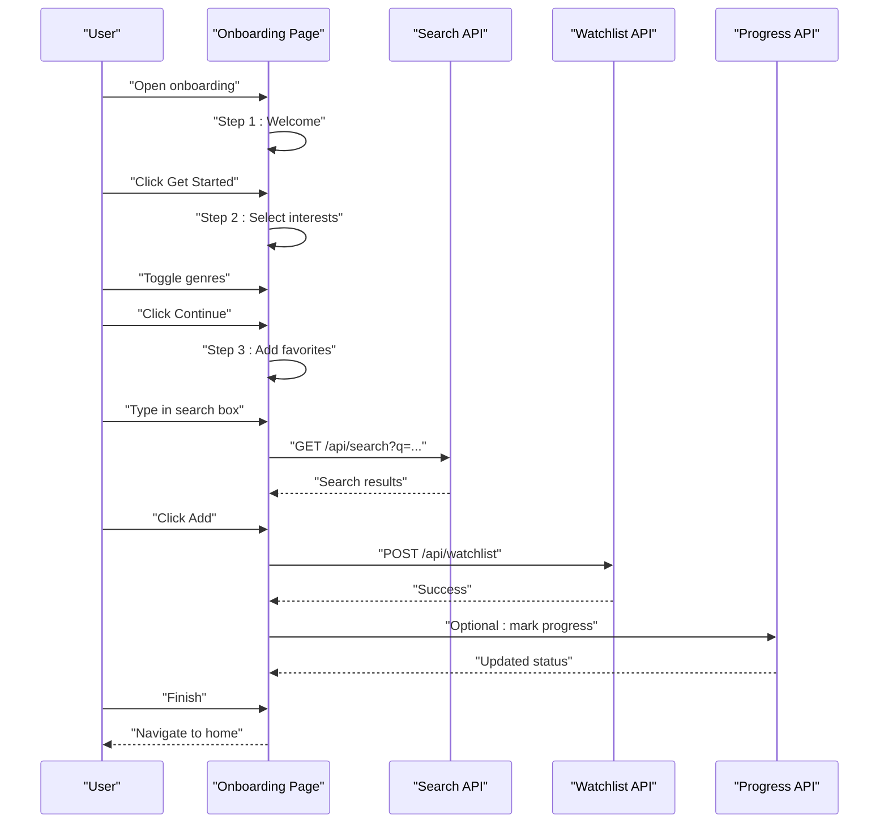
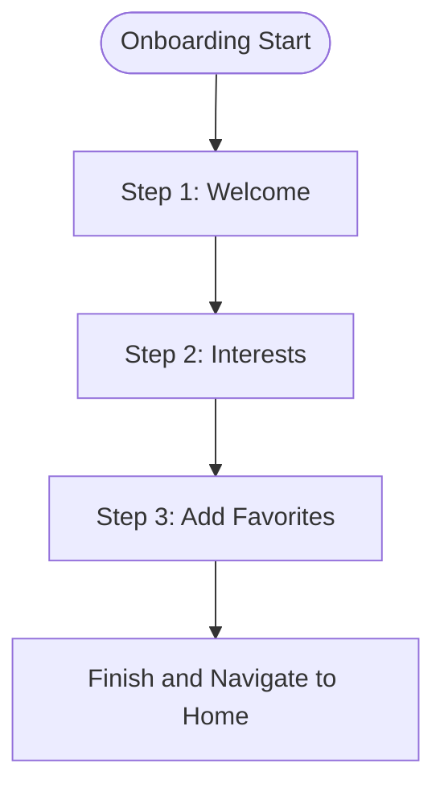
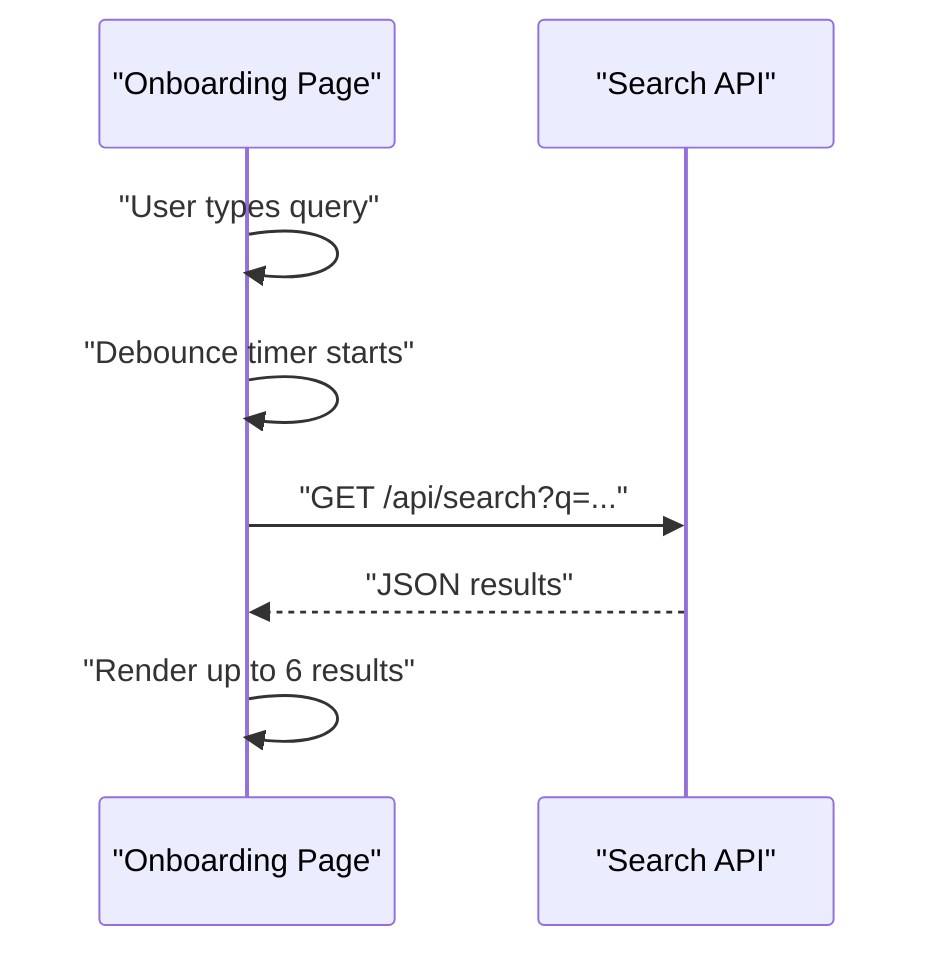
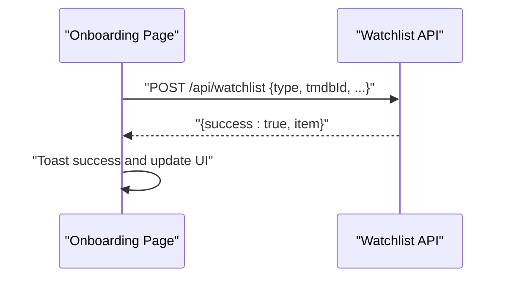
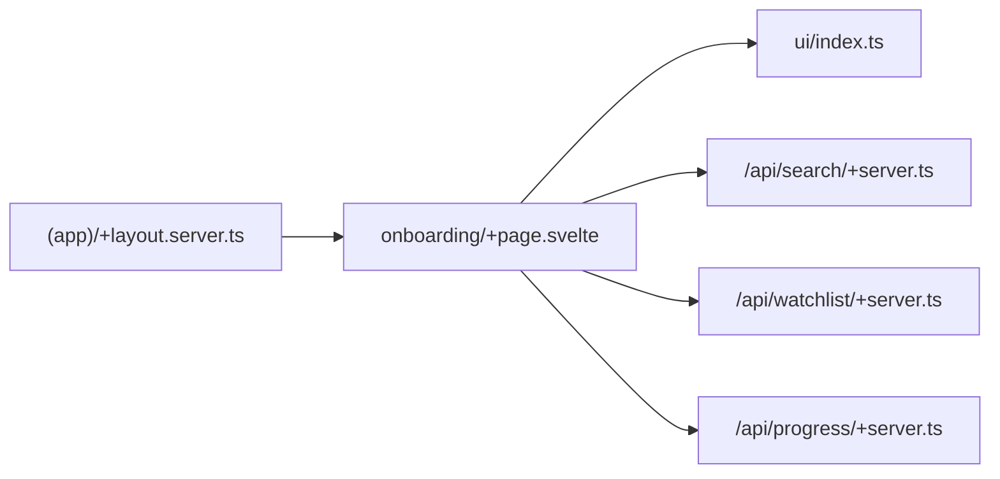

# Onboarding Experience

<cite>
**Referenced Files in This Document**
- [src/routes/(app)/onboarding/+page.svelte](file://src/routes/(app)/onboarding/+page.svelte)
- [src/routes/api/search/+server.ts](file://src/routes/api/search/+server.ts)
- [src/routes/api/watchlist/+server.ts](file://src/routes/api/watchlist/+server.ts)
- [src/routes/api/progress/+server.ts](file://src/routes/api/progress/+server.ts)
- [src/routes/(app)/+layout.server.ts](file://src/routes/(app)/+layout.server.ts)
- [src/lib/components/ui/index.ts](file://src/lib/components/ui/index.ts)
- [src/lib/utils.ts](file://src/lib/utils.ts)
</cite>

## Table of Contents
1. [Introduction](#introduction)
2. [Project Structure](#project-structure)
3. [Core Components](#core-components)
4. [Architecture Overview](#architecture-overview)
5. [Detailed Component Analysis](#detailed-component-analysis)
6. [Dependency Analysis](#dependency-analysis)
7. [Performance Considerations](#performance-considerations)
8. [Troubleshooting Guide](#troubleshooting-guide)
9. [Conclusion](#conclusion)
10. [Appendices](#appendices)

## Introduction
This document explains the Onboarding Experience for new users, focusing on the step-by-step welcome flow, interest selection interface, content recommendation setup, and tutorial integration. It also covers progressive disclosure, user preference collection, personalized content introduction, completion tracking, re-engagement flows for incomplete onboarding, A/B testing capabilities for onboarding variations, integration with the recommendation engine, accessibility considerations, error handling, and analytics tracking for onboarding success metrics.

## Project Structure
The onboarding experience is implemented as a Svelte page under the application routes, backed by API endpoints for search and watchlist management. The layout ensures authentication and exposes user preferences for downstream personalization.

**Diagram sources**
- [src/routes/(app)/onboarding/+page.svelte](file://src/routes/(app)/onboarding/+page.svelte)
- [src/routes/(app)/+layout.server.ts](file://src/routes/(app)/+layout.server.ts)
- [src/routes/api/search/+server.ts](file://src/routes/api/search/+server.ts)
- [src/routes/api/watchlist/+server.ts](file://src/routes/api/watchlist/+server.ts)
- [src/routes/api/progress/+server.ts](file://src/routes/api/progress/+server.ts)
- [src/lib/components/ui/index.ts](file://src/lib/components/ui/index.ts)
- [src/lib/utils.ts](file://src/lib/utils.ts)

**Section sources**
- [src/routes/(app)/onboarding/+page.svelte](file://src/routes/(app)/onboarding/+page.svelte)
- [src/routes/(app)/+layout.server.ts](file://src/routes/(app)/+layout.server.ts)

## Core Components
- Onboarding Page: Implements a three-step flow: welcome, interest selection, and initial content addition. Uses local reactive state to manage steps and selections, debounced search, and watchlist mutations.
- Search API: Provides authenticated multi-type search results for titles.
- Watchlist API: Handles adding shows/movies to the user’s watchlist and activity logging.
- Progress API: Manages episode progress and derived show status updates.
- Layout Server: Ensures authentication and provides default user preferences for personalization.

Key implementation references:
- Step management and interest toggling: [src/routes/(app)/onboarding/+page.svelte](file://src/routes/(app)/onboarding/+page.svelte)
- Debounced search and results rendering: [src/routes/(app)/onboarding/+page.svelte](file://src/routes/(app)/onboarding/+page.svelte)
- Watchlist mutation and toast feedback: [src/routes/(app)/onboarding/+page.svelte](file://src/routes/(app)/onboarding/+page.svelte)
- Search endpoint: [src/routes/api/search/+server.ts](file://src/routes/api/search/+server.ts)
- Watchlist endpoint: [src/routes/api/watchlist/+server.ts](file://src/routes/api/watchlist/+server.ts)
- Progress endpoint: [src/routes/api/progress/+server.ts](file://src/routes/api/progress/+server.ts)
- Authentication and preferences: [src/routes/(app)/+layout.server.ts](file://src/routes/(app)/+layout.server.ts)

**Section sources**
- [src/routes/(app)/onboarding/+page.svelte](file://src/routes/(app)/onboarding/+page.svelte)
- [src/routes/api/search/+server.ts](file://src/routes/api/search/+server.ts)
- [src/routes/api/watchlist/+server.ts](file://src/routes/api/watchlist/+server.ts)
- [src/routes/api/progress/+server.ts](file://src/routes/api/progress/+server.ts)
- [src/routes/(app)/+layout.server.ts](file://src/routes/(app)/+layout.server.ts)

## Architecture Overview
The onboarding flow is client-driven with server-backed APIs for search and persistence. The layout enforces authentication and exposes preferences for personalization.

**Diagram sources**
- [src/routes/(app)/onboarding/+page.svelte](file://src/routes/(app)/onboarding/+page.svelte)
- [src/routes/api/search/+server.ts](file://src/routes/api/search/+server.ts)
- [src/routes/api/watchlist/+server.ts](file://src/routes/api/watchlist/+server.ts)
- [src/routes/api/progress/+server.ts](file://src/routes/api/progress/+server.ts)

## Detailed Component Analysis

### Onboarding Page: Three-Step Flow
The onboarding page implements progressive disclosure across three steps:
- Step 1: Welcome screen with a primary CTA to proceed.
- Step 2: Interest selection via genre chips with keyboard support and visual feedback.
- Step 3: Initial content addition via search and quick add to watchlist.

Implementation highlights:
- Reactive state for step, selected interests, search query, and loading states.
- Debounced search to reduce network requests while typing.
- Toast notifications for user feedback on add/remove actions.
- Navigation to home on completion.

**Diagram sources**
- [src/routes/(app)/onboarding/+page.svelte](file://src/routes/(app)/onboarding/+page.svelte)

**Section sources**
- [src/routes/(app)/onboarding/+page.svelte](file://src/routes/(app)/onboarding/+page.svelte)

### Interest Selection Interface
- Genre list is rendered as interactive chips with toggle behavior.
- Keyboard accessibility: Enter and Space activate toggles.
- Visual feedback indicates selected vs unselected states.
- Progressive progression to the next step after selection.

Accessibility considerations:
- Tab index set for focusability.
- Keyboard activation for inclusive interaction.
- Clear visual states for selection.

**Section sources**
- [src/routes/(app)/onboarding/+page.svelte](file://src/routes/(app)/onboarding/+page.svelte)

### Content Recommendation Setup and Tutorial Integration
- Search integration allows users to discover content quickly.
- Quick-add buttons integrate with the watchlist API to seed recommendations.
- Tutorial integration can be layered on top of the search results area to guide first-time users.

Recommendations:
- Use tooltips or guided tours to explain search and add actions.
- Provide contextual help text for “Add” and “Skip for now.”

**Section sources**
- [src/routes/(app)/onboarding/+page.svelte](file://src/routes/(app)/onboarding/+page.svelte)
- [src/routes/api/search/+server.ts](file://src/routes/api/search/+server.ts)
- [src/routes/api/watchlist/+server.ts](file://src/routes/api/watchlist/+server.ts)

### Search and Discovery
- Debounced search with a 350ms delay reduces unnecessary API calls.
- Results are limited to the first six items for clarity.
- Loading state prevents redundant triggers.

**Diagram sources**
- [src/routes/(app)/onboarding/+page.svelte](file://src/routes/(app)/onboarding/+page.svelte)
- [src/routes/api/search/+server.ts](file://src/routes/api/search/+server.ts)

**Section sources**
- [src/routes/(app)/onboarding/+page.svelte](file://src/routes/(app)/onboarding/+page.svelte)
- [src/routes/api/search/+server.ts](file://src/routes/api/search/+server.ts)

### Watchlist Integration and Persistence
- Adds either a show or movie to the user’s watchlist.
- Upserts user-show or user-movie records and logs activity events.
- Supports “WATCHING” or “PLAN_TO_WATCH” statuses depending on type.

**Diagram sources**
- [src/routes/(app)/onboarding/+page.svelte](file://src/routes/(app)/onboarding/+page.svelte)
- [src/routes/api/watchlist/+server.ts](file://src/routes/api/watchlist/+server.ts)

**Section sources**
- [src/routes/(app)/onboarding/+page.svelte](file://src/routes/(app)/onboarding/+page.svelte)
- [src/routes/api/watchlist/+server.ts](file://src/routes/api/watchlist/+server.ts)

### Completion Tracking and Re-engagement
- Completion: Navigates to the home route upon finishing.
- Re-engagement: If the user skips adding favorites, they still reach the home page. To improve completion rates, consider:
  - A prompt to add at least one favorite before continuing.
  - A reminder banner on subsequent visits if onboarding was not completed.
  - Analytics to track drop-off points and optimize the flow.

**Section sources**
- [src/routes/(app)/onboarding/+page.svelte](file://src/routes/(app)/onboarding/+page.svelte)

### A/B Testing Capabilities for Onboarding Variations
- Current implementation uses a single linear flow. To enable A/B testing:
  - Randomize users into variants (e.g., classic flow, compact flow, tutorial-first).
  - Track conversion metrics per variant (completion rate, time-to-completion).
  - Persist variant assignment in user preferences or a dedicated experiment table.

[No sources needed since this section provides general guidance]

### Integration with Recommendation Engine
- Seed watchlist entries influence downstream recommendations.
- Future enhancements:
  - Surface recommended titles based on selected genres and added favorites.
  - Use progress API to refine suggestions as users mark episodes watched.

**Section sources**
- [src/routes/api/watchlist/+server.ts](file://src/routes/api/watchlist/+server.ts)
- [src/routes/api/progress/+server.ts](file://src/routes/api/progress/+server.ts)

### Accessibility Considerations
- Focus management: Buttons and chips have explicit tabindex for keyboard navigation.
- Keyboard activation: Enter and Space keys trigger toggles for chips.
- Visual states: Selected/unselected states clearly indicate current selection.
- Feedback: Toast notifications inform users of successful actions.

**Section sources**
- [src/routes/(app)/onboarding/+page.svelte](file://src/routes/(app)/onboarding/+page.svelte)

### Error Handling for Incomplete Setups
- Search errors: API returns structured error messages; UI remains responsive with loading states.
- Watchlist errors: Try/catch around fetch calls; user receives error toast.
- Unauthorized access: Layout server redirects unauthenticated users to sign-in.

**Section sources**
- [src/routes/api/search/+server.ts](file://src/routes/api/search/+server.ts)
- [src/routes/(app)/+layout.server.ts](file://src/routes/(app)/+layout.server.ts)
- [src/routes/(app)/onboarding/+page.svelte](file://src/routes/(app)/onboarding/+page.svelte)

### Analytics Tracking for Onboarding Success Metrics
- Recommended events:
  - Onboarding: started, interest_selected, item_added, completed.
  - Timing: time to first item added, time to completion.
  - Drop-off: step reached, last interaction before exit.
- Implementation hooks:
  - Emit events on step transitions and button clicks.
  - Capture completion on navigation to home.

[No sources needed since this section provides general guidance]

## Dependency Analysis
The onboarding page depends on UI primitives, search, and watchlist APIs. The layout ensures authentication and supplies default preferences.

**Diagram sources**
- [src/routes/(app)/onboarding/+page.svelte](file://src/routes/(app)/onboarding/+page.svelte)
- [src/routes/(app)/+layout.server.ts](file://src/routes/(app)/+layout.server.ts)
- [src/routes/api/search/+server.ts](file://src/routes/api/search/+server.ts)
- [src/routes/api/watchlist/+server.ts](file://src/routes/api/watchlist/+server.ts)
- [src/routes/api/progress/+server.ts](file://src/routes/api/progress/+server.ts)
- [src/lib/components/ui/index.ts](file://src/lib/components/ui/index.ts)

**Section sources**
- [src/routes/(app)/onboarding/+page.svelte](file://src/routes/(app)/onboarding/+page.svelte)
- [src/routes/(app)/+layout.server.ts](file://src/routes/(app)/+layout.server.ts)
- [src/lib/components/ui/index.ts](file://src/lib/components/ui/index.ts)

## Performance Considerations
- Debounced search reduces API calls during typing.
- Limiting search results to six items keeps the UI responsive.
- Toast notifications avoid heavy modal dialogs.
- Consider caching recent search results per session to minimize repeated queries.

[No sources needed since this section provides general guidance]

## Troubleshooting Guide
Common issues and resolutions:
- Unauthorized access: Ensure the user is signed in; the layout server redirects to sign-in if missing.
- Search returns empty: Verify the query is non-empty and network connectivity is available.
- Add fails: Confirm the backend responds successfully; check toast feedback for error messaging.
- Navigation stuck: Ensure the finish handler navigates to the intended route.

**Section sources**
- [src/routes/(app)/+layout.server.ts](file://src/routes/(app)/+layout.server.ts)
- [src/routes/(app)/onboarding/+page.svelte](file://src/routes/(app)/onboarding/+page.svelte)

## Conclusion
The Onboarding Experience provides a clear, accessible, and efficient path for new users to express interests, discover content, and seed their watchlist. By leveraging debounced search, immediate feedback, and authenticated APIs, the flow supports progressive disclosure and personalized content introduction. Future enhancements in A/B testing, analytics, and recommendation integration will further improve completion rates and user satisfaction.

## Appendices
- UI primitives used: Button, Input, and Label are exported from the UI library.
- Utility helpers: Formatting and timezone utilities are available for consistent presentation.

**Section sources**
- [src/lib/components/ui/index.ts](file://src/lib/components/ui/index.ts)
- [src/lib/utils.ts](file://src/lib/utils.ts)