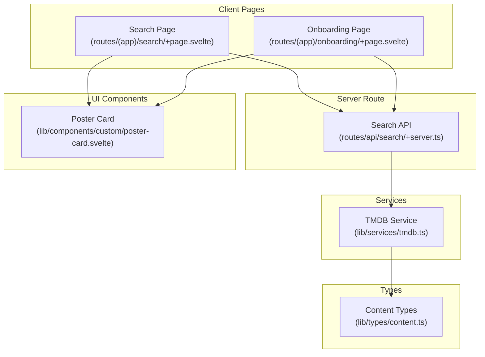
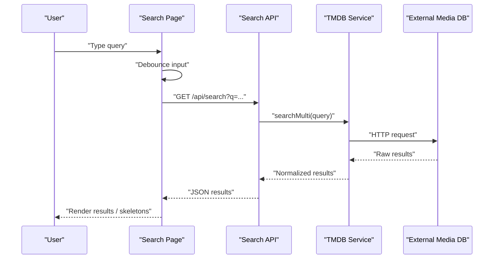
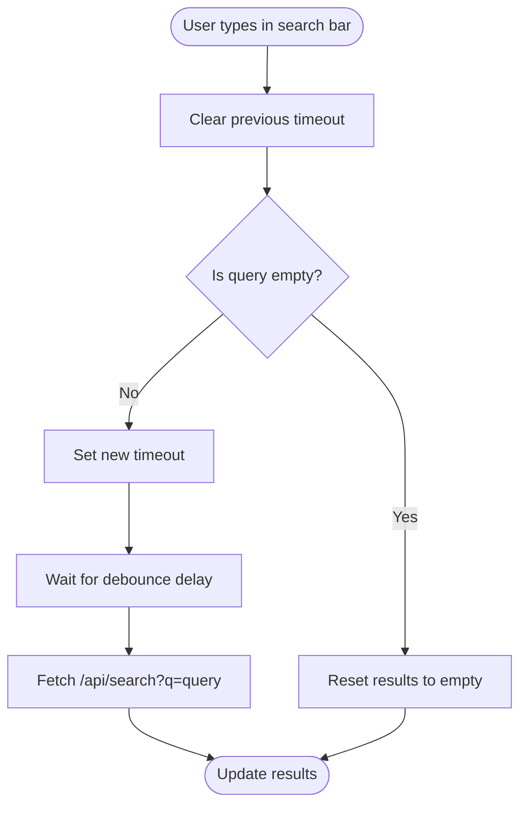
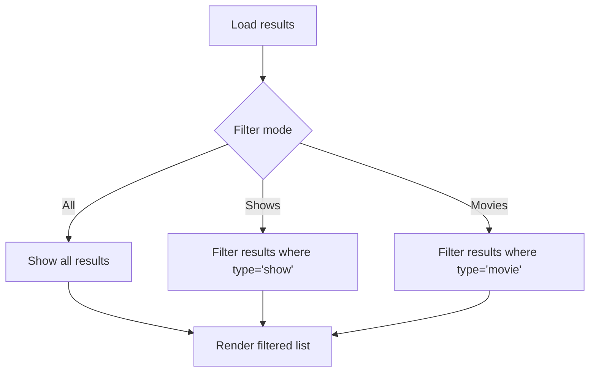
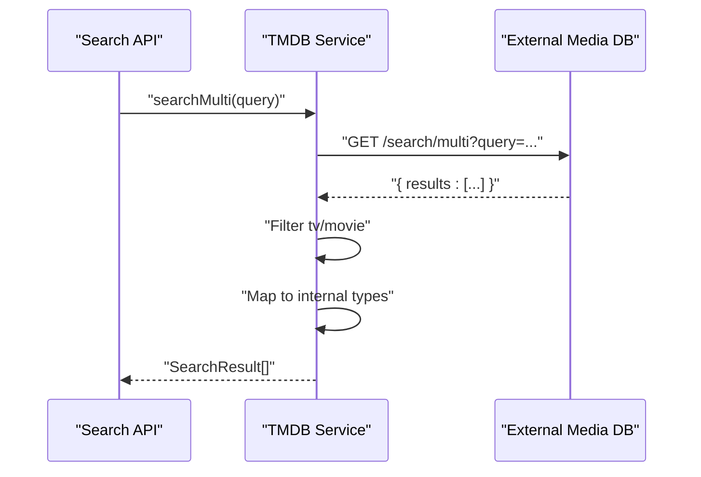
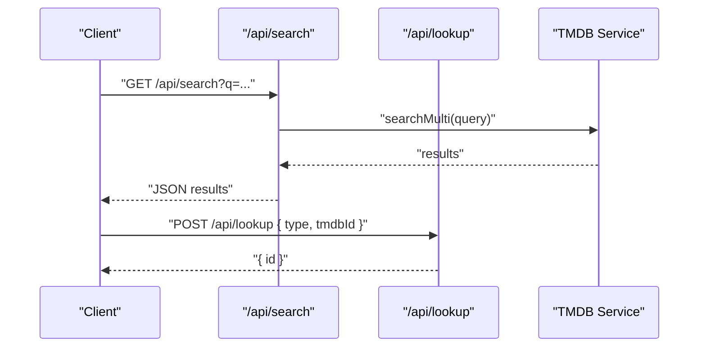
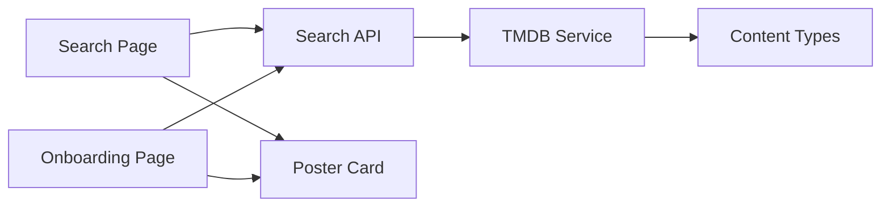

# Search Functionality

<cite>
**Referenced Files in This Document**
- [src/routes/(app)/search/+page.svelte](file://src/routes/(app)/search/+page.svelte)
- [src/routes/(app)/onboarding/+page.svelte](file://src/routes/(app)/onboarding/+page.svelte)
- [src/routes/api/search/+server.ts](file://src/routes/api/search/+server.ts)
- [src/lib/services/tmdb.ts](file://src/lib/services/tmdb.ts)
- [src/lib/types/content.ts](file://src/lib/types/content.ts)
- [src/lib/components/custom/poster-card.svelte](file://src/lib/components/custom/poster-card.svelte)
</cite>

## Table of Contents
1. [Introduction](#introduction)
2. [Project Structure](#project-structure)
3. [Core Components](#core-components)
4. [Architecture Overview](#architecture-overview)
5. [Detailed Component Analysis](#detailed-component-analysis)
6. [Dependency Analysis](#dependency-analysis)
7. [Performance Considerations](#performance-considerations)
8. [Troubleshooting Guide](#troubleshooting-guide)
9. [Conclusion](#conclusion)

## Introduction
This document explains the Search functionality for multi-source content discovery and filtering. It covers the search bar implementation, real-time search suggestions, search result categorization (shows, movies), advanced filtering options, the search algorithm, debouncing techniques, API integration patterns, and result presentation. It also outlines search history management, saved searches, autocomplete functionality, and analytics considerations. Finally, it addresses performance optimizations for large datasets, caching strategies, and user experience enhancements such as instant results and progressive loading.

## Project Structure
The search feature spans client-side Svelte components, a server route, and a service module that integrates with a third-party media database. The key files are:
- Client pages: search and onboarding pages implement the UI, debouncing, and filtering.
- Server route: validates user context and delegates search to the service.
- Service module: wraps external API calls and normalizes results.
- Types: define the shape of search results and content summaries.
- UI component: renders search results as interactive cards.

**Diagram sources**
- [src/routes/(app)/search/+page.svelte](file://src/routes/(app)/search/+page.svelte)
- [src/routes/(app)/onboarding/+page.svelte](file://src/routes/(app)/onboarding/+page.svelte)
- [src/routes/api/search/+server.ts](file://src/routes/api/search/+server.ts)
- [src/lib/services/tmdb.ts](file://src/lib/services/tmdb.ts)
- [src/lib/types/content.ts](file://src/lib/types/content.ts)
- [src/lib/components/custom/poster-card.svelte](file://src/lib/components/custom/poster-card.svelte)

**Section sources**
- [src/routes/(app)/search/+page.svelte](file://src/routes/(app)/search/+page.svelte)
- [src/routes/(app)/onboarding/+page.svelte](file://src/routes/(app)/onboarding/+page.svelte)
- [src/routes/api/search/+server.ts](file://src/routes/api/search/+server.ts)
- [src/lib/services/tmdb.ts](file://src/lib/services/tmdb.ts)
- [src/lib/types/content.ts](file://src/lib/types/content.ts)
- [src/lib/components/custom/poster-card.svelte](file://src/lib/components/custom/poster-card.svelte)

## Core Components
- Search Page: Implements the search bar, debounced search, category filters (All, Shows, Movies), loading skeletons, empty states, and navigation to detail pages via a lookup endpoint.
- Onboarding Page: Reuses the same debounced search pattern to help users add initial content to their watchlist.
- Search API: Validates user context, extracts the query, and calls the service to fetch results.
- TMDB Service: Performs the multi-search against an external media database, normalizes results, and exposes typed interfaces.
- Content Types: Defines the shape of search results and content summaries.
- Poster Card: Renders individual results with lazy loading and optional add-to-watchlist actions.

Key responsibilities:
- Debounce user input to reduce network requests.
- Filter results client-side by content type.
- Normalize external API responses into internal types.
- Provide progressive loading and graceful empty states.

**Section sources**
- [src/routes/(app)/search/+page.svelte](file://src/routes/(app)/search/+page.svelte)
- [src/routes/(app)/onboarding/+page.svelte](file://src/routes/(app)/onboarding/+page.svelte)
- [src/routes/api/search/+server.ts](file://src/routes/api/search/+server.ts)
- [src/lib/services/tmdb.ts](file://src/lib/services/tmdb.ts)
- [src/lib/types/content.ts](file://src/lib/types/content.ts)
- [src/lib/components/custom/poster-card.svelte](file://src/lib/components/custom/poster-card.svelte)

## Architecture Overview
The search flow connects the client UI to the server route and the external media database service. The server route enforces authentication and delegates to the service, which performs the actual search and returns normalized results.

**Diagram sources**
- [src/routes/(app)/search/+page.svelte](file://src/routes/(app)/search/+page.svelte)
- [src/routes/api/search/+server.ts](file://src/routes/api/search/+server.ts)
- [src/lib/services/tmdb.ts](file://src/lib/services/tmdb.ts)

## Detailed Component Analysis

### Search Bar and Real-Time Suggestions
- The search bar is bound to a reactive state variable and triggers a debounced search on input.
- Debouncing is implemented with a timeout cleared and reset on each keystroke, with a fixed delay to balance responsiveness and network usage.
- Real-time suggestions are not implemented in the current code; suggestions could be added by augmenting the service to return suggestion terms and rendering them in a dropdown.

**Diagram sources**
- [src/routes/(app)/search/+page.svelte](file://src/routes/(app)/search/+page.svelte)

**Section sources**
- [src/routes/(app)/search/+page.svelte](file://src/routes/(app)/search/+page.svelte)

### Advanced Filtering Options
- Category filters support three modes: All, Shows, Movies.
- Client-side filtering is derived from the current filter mode and applied to the results array.
- The filter buttons switch between modes and update the derived filtered list.

**Diagram sources**
- [src/routes/(app)/search/+page.svelte](file://src/routes/(app)/search/+page.svelte)

**Section sources**
- [src/routes/(app)/search/+page.svelte](file://src/routes/(app)/search/+page.svelte)

### Search Algorithm Implementation
- The server route extracts the query parameter and validates the user context before delegating to the service.
- The service performs a multi-search against the external media database, filters to supported media types, and maps fields to internal types.
- Results include identifiers, titles, years, poster/backdrop paths, and normalized content types.

**Diagram sources**
- [src/routes/api/search/+server.ts](file://src/routes/api/search/+server.ts)
- [src/lib/services/tmdb.ts](file://src/lib/services/tmdb.ts)

**Section sources**
- [src/routes/api/search/+server.ts](file://src/routes/api/search/+server.ts)
- [src/lib/services/tmdb.ts](file://src/lib/services/tmdb.ts)

### Debouncing Techniques
- A single timeout is used per search session; it is cleared on each keystroke and re-set after the debounce interval.
- The debounce delay is tuned to minimize network requests while keeping the UI responsive.
- Cleanup occurs on component destruction to prevent memory leaks.

**Section sources**
- [src/routes/(app)/search/+page.svelte](file://src/routes/(app)/search/+page.svelte)
- [src/routes/(app)/onboarding/+page.svelte](file://src/routes/(app)/onboarding/+page.svelte)

### API Integration Patterns
- The client calls the server route with the query parameter.
- The server validates the user context and forwards the query to the service.
- The service encapsulates HTTP calls, error handling, and response normalization.
- Lookup API is used to resolve internal identifiers for navigation to detail pages.

**Diagram sources**
- [src/routes/(app)/search/+page.svelte](file://src/routes/(app)/search/+page.svelte)
- [src/routes/api/search/+server.ts](file://src/routes/api/search/+server.ts)
- [src/lib/services/tmdb.ts](file://src/lib/services/tmdb.ts)

**Section sources**
- [src/routes/(app)/search/+page.svelte](file://src/routes/(app)/search/+page.svelte)
- [src/routes/api/search/+server.ts](file://src/routes/api/search/+server.ts)
- [src/lib/services/tmdb.ts](file://src/lib/services/tmdb.ts)

### Result Ranking Mechanisms
- No explicit ranking logic is present in the current implementation.
- Results are returned as-is from the external media database and filtered by supported types.
- Ranking could be introduced by:
  - Sorting by relevance score from the external API.
  - Applying local boosting factors (e.g., recency, popularity).
  - Introducing user-specific signals (e.g., previously watched or rated content).

[No sources needed since this section provides general guidance]

### Search History Management and Saved Searches
- No persistent search history or saved searches are implemented in the current code.
- To implement:
  - Persist recent queries in local storage or a backend store.
  - Allow users to save frequently used queries.
  - Provide quick-access chips for history entries.

[No sources needed since this section provides general guidance]

### Autocomplete Functionality
- No dedicated autocomplete dropdown is implemented.
- To implement:
  - Extend the service to return suggestion terms.
  - Render a dropdown below the search bar during typing.
  - Support keyboard navigation and selection.

[No sources needed since this section provides general guidance]

### Search Analytics
- No analytics events are emitted in the current code.
- To implement:
  - Track search queries, refinement clicks, and navigation events.
  - Measure latency and error rates for search requests.
  - Anonymize and aggregate metrics for privacy.

[No sources needed since this section provides general guidance]

### Result Presentation and UX Enhancements
- Loading skeletons improve perceived performance while results are fetched.
- Empty states guide users when no results are found.
- Progressive loading displays a grid of skeleton cards during loading.
- Poster cards render images lazily and include optional add-to-watchlist actions.

**Section sources**
- [src/routes/(app)/search/+page.svelte](file://src/routes/(app)/search/+page.svelte)
- [src/lib/components/custom/poster-card.svelte](file://src/lib/components/custom/poster-card.svelte)

## Dependency Analysis
The search feature exhibits clear separation of concerns:
- Client pages depend on the server route for data and on UI components for rendering.
- The server route depends on the service module for external API integration.
- The service module depends on content types for result normalization.

**Diagram sources**
- [src/routes/(app)/search/+page.svelte](file://src/routes/(app)/search/+page.svelte)
- [src/routes/(app)/onboarding/+page.svelte](file://src/routes/(app)/onboarding/+page.svelte)
- [src/routes/api/search/+server.ts](file://src/routes/api/search/+server.ts)
- [src/lib/services/tmdb.ts](file://src/lib/services/tmdb.ts)
- [src/lib/types/content.ts](file://src/lib/types/content.ts)
- [src/lib/components/custom/poster-card.svelte](file://src/lib/components/custom/poster-card.svelte)

**Section sources**
- [src/routes/(app)/search/+page.svelte](file://src/routes/(app)/search/+page.svelte)
- [src/routes/(app)/onboarding/+page.svelte](file://src/routes/(app)/onboarding/+page.svelte)
- [src/routes/api/search/+server.ts](file://src/routes/api/search/+server.ts)
- [src/lib/services/tmdb.ts](file://src/lib/services/tmdb.ts)
- [src/lib/types/content.ts](file://src/lib/types/content.ts)
- [src/lib/components/custom/poster-card.svelte](file://src/lib/components/custom/poster-card.svelte)

## Performance Considerations
- Debouncing reduces redundant network requests and improves responsiveness.
- Lazy-loading images in poster cards minimizes initial payload and improves scroll performance.
- Skeletons provide immediate feedback and reduce perceived latency.
- Client-side filtering avoids additional server round-trips for category toggling.
- Recommendations:
  - Add caching at the service layer to reuse recent search results.
  - Implement pagination for large result sets.
  - Consider preloading popular posters to reduce image load delays.
  - Monitor external API rate limits and apply backoff strategies.

[No sources needed since this section provides general guidance]

## Troubleshooting Guide
Common issues and resolutions:
- Unauthorized access: The server route checks for a valid user context and returns an unauthorized response if missing.
- Empty or invalid queries: The server route returns empty results for blank queries.
- Network failures: Client-side error handling displays a toast notification and leaves results empty.
- Navigation errors: Detail navigation uses a lookup endpoint; failures are handled gracefully with toasts.

**Section sources**
- [src/routes/api/search/+server.ts](file://src/routes/api/search/+server.ts)
- [src/routes/(app)/search/+page.svelte](file://src/routes/(app)/search/+page.svelte)
- [src/routes/(app)/onboarding/+page.svelte](file://src/routes/(app)/onboarding/+page.svelte)

## Conclusion
The Search functionality provides a robust foundation for multi-source content discovery with debounced queries, client-side filtering, and normalized results. The current implementation emphasizes user experience through progressive loading and clear empty states. Future enhancements can introduce autocomplete, analytics, search history, saved searches, and ranking mechanisms to further improve discoverability and engagement.