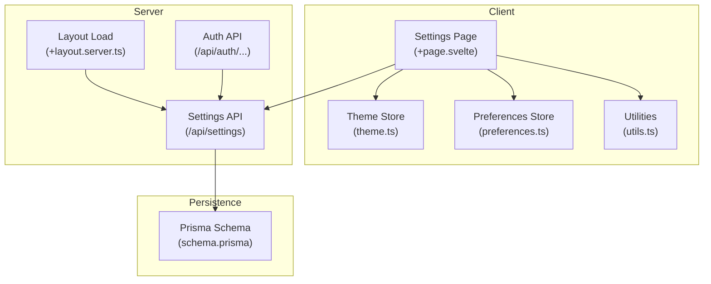
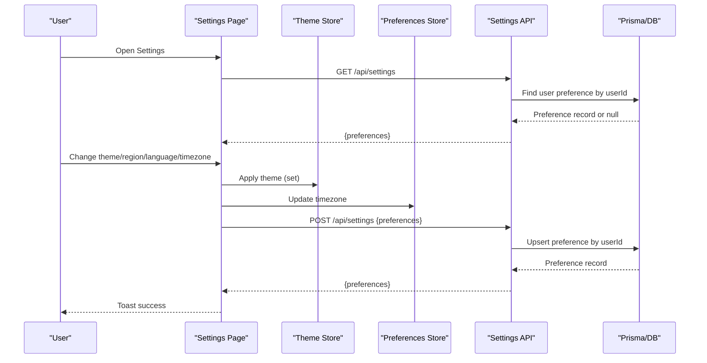
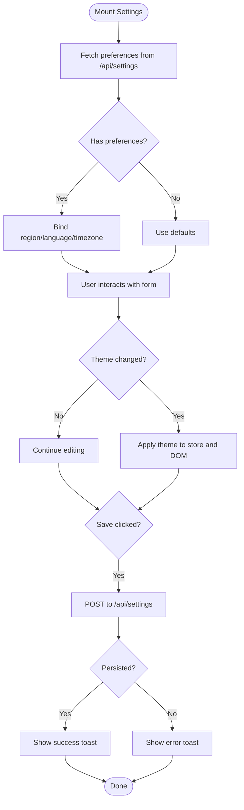
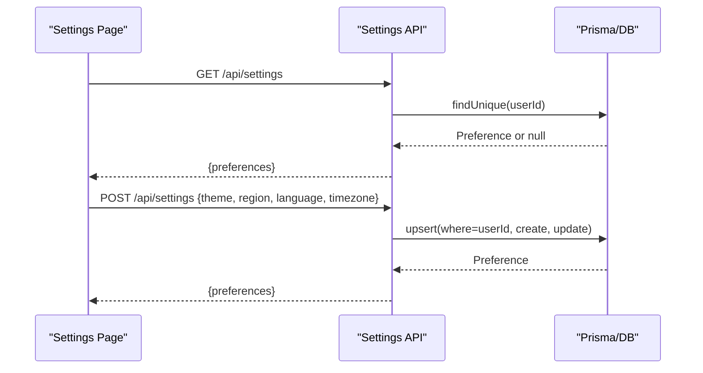
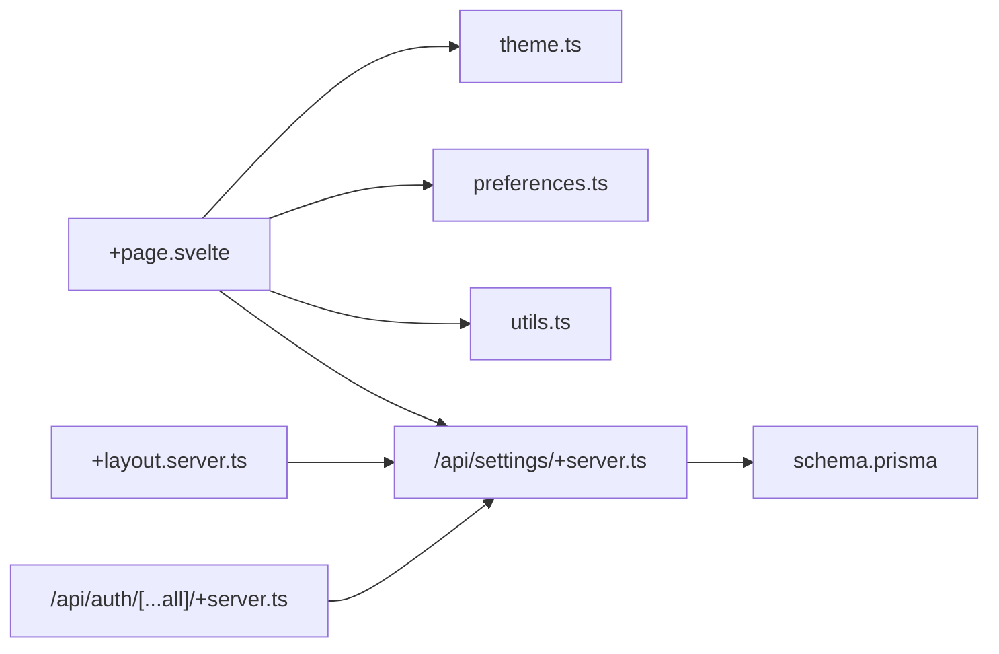
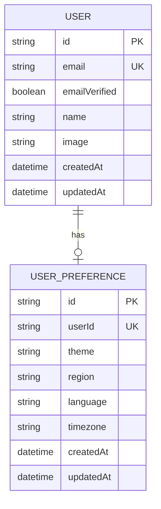

# Settings Management

<cite>
**Referenced Files in This Document**
- [src/routes/(app)/settings/+page.svelte](file://src/routes/(app)/settings/+page.svelte)
- [src/routes/api/settings/+server.ts](file://src/routes/api/settings/+server.ts)
- [src/routes/(app)/+layout.server.ts](file://src/routes/(app)/+layout.server.ts)
- [src/lib/stores/theme.ts](file://src/lib/stores/theme.ts)
- [src/lib/stores/preferences.ts](file://src/lib/stores/preferences.ts)
- [src/lib/utils.ts](file://src/lib/utils.ts)
- [prisma/schema.prisma](file://prisma/schema.prisma)
- [src/routes/api/auth/[...all]/+server.ts](file://src/routes/api/auth/[...all]/+server.ts)
- [src/routes/privacy/+page.svelte](file://src/routes/privacy/+page.svelte)
</cite>

## Table of Contents
1. [Introduction](#introduction)
2. [Project Structure](#project-structure)
3. [Core Components](#core-components)
4. [Architecture Overview](#architecture-overview)
5. [Detailed Component Analysis](#detailed-component-analysis)
6. [Dependency Analysis](#dependency-analysis)
7. [Performance Considerations](#performance-considerations)
8. [Troubleshooting Guide](#troubleshooting-guide)
9. [Conclusion](#conclusion)
10. [Appendices](#appendices)

## Introduction
This document describes the Settings Management feature that enables users to configure appearance, regional and language preferences, and timezone, as well as manage account actions such as signing out and account deletion. It explains how preference forms are implemented, how real-time updates are applied, how data is persisted, and how the system integrates with the authentication layer. Accessibility features, validation error handling, user feedback mechanisms, and cross-device synchronization are also covered.

## Project Structure
Settings Management spans a Svelte page component, a server route, shared stores for theme and timezone, a utility module for timezones, and the Prisma schema that defines persistence. Authentication is handled by a dedicated API route that delegates to the Better Auth adapter.

**Diagram sources**
- [src/routes/(app)/settings/+page.svelte](file://src/routes/(app)/settings/+page.svelte#L1-L170)
- [src/routes/api/settings/+server.ts:1-29](file://src/routes/api/settings/+server.ts#L1-L29)
- [src/routes/(app)/+layout.server.ts](file://src/routes/(app)/+layout.server.ts#L1-L16)
- [src/lib/stores/theme.ts:1-40](file://src/lib/stores/theme.ts#L1-L40)
- [src/lib/stores/preferences.ts:1-3](file://src/lib/stores/preferences.ts#L1-L3)
- [src/lib/utils.ts:62-82](file://src/lib/utils.ts#L62-L82)
- [prisma/schema.prisma:244-257](file://prisma/schema.prisma#L244-L257)
- [src/routes/api/auth/[...all]/+server.ts](file://src/routes/api/auth/[...all]/+server.ts#L1-L7)

**Section sources**
- [src/routes/(app)/settings/+page.svelte](file://src/routes/(app)/settings/+page.svelte#L1-L170)
- [src/routes/api/settings/+server.ts:1-29](file://src/routes/api/settings/+server.ts#L1-L29)
- [src/routes/(app)/+layout.server.ts](file://src/routes/(app)/+layout.server.ts#L1-L16)
- [src/lib/stores/theme.ts:1-40](file://src/lib/stores/theme.ts#L1-L40)
- [src/lib/stores/preferences.ts:1-3](file://src/lib/stores/preferences.ts#L1-L3)
- [src/lib/utils.ts:62-82](file://src/lib/utils.ts#L62-L82)
- [prisma/schema.prisma:244-257](file://prisma/schema.prisma#L244-L257)
- [src/routes/api/auth/[...all]/+server.ts](file://src/routes/api/auth/[...all]/+server.ts#L1-L7)

## Core Components
- Settings Page: Provides the UI for theme selection, region/language inputs, timezone selection, and account actions. Handles fetching current preferences, saving changes, and user feedback.
- Settings API: Implements GET and POST endpoints to retrieve and persist user preferences under the authenticated user’s ID.
- Theme Store: Manages theme state and applies CSS classes to the document root, with persistence in localStorage.
- Preferences Store: Holds the user’s selected timezone and exposes it to the UI.
- Utilities: Supplies timezone enumeration and formatting helpers used by the settings UI.
- Prisma Schema: Defines the UserPreference model and its relations to the User table.
- Auth API: Delegates authentication operations to Better Auth via Svelte Kit handlers.

**Section sources**
- [src/routes/(app)/settings/+page.svelte](file://src/routes/(app)/settings/+page.svelte#L1-L170)
- [src/routes/api/settings/+server.ts:1-29](file://src/routes/api/settings/+server.ts#L1-L29)
- [src/lib/stores/theme.ts:1-40](file://src/lib/stores/theme.ts#L1-L40)
- [src/lib/stores/preferences.ts:1-3](file://src/lib/stores/preferences.ts#L1-L3)
- [src/lib/utils.ts:62-82](file://src/lib/utils.ts#L62-L82)
- [prisma/schema.prisma:244-257](file://prisma/schema.prisma#L244-L257)
- [src/routes/api/auth/[...all]/+server.ts](file://src/routes/api/auth/[...all]/+server.ts#L1-L7)

## Architecture Overview
The Settings feature follows a layered pattern:
- UI layer: Svelte component renders settings and binds form values to reactive state.
- Store layer: Theme and timezone stores synchronize UI state and persist selections.
- API layer: Server route validates authentication and persists preferences to the database.
- Persistence layer: Prisma model encapsulates preference storage and relationships.

**Diagram sources**
- [src/routes/(app)/settings/+page.svelte](file://src/routes/(app)/settings/+page.svelte#L21-L54)
- [src/lib/stores/theme.ts:14-35](file://src/lib/stores/theme.ts#L14-L35)
- [src/lib/stores/preferences.ts:1-3](file://src/lib/stores/preferences.ts#L1-L3)
- [src/routes/api/settings/+server.ts:5-28](file://src/routes/api/settings/+server.ts#L5-L28)
- [prisma/schema.prisma:244-257](file://prisma/schema.prisma#L244-L257)

## Detailed Component Analysis

### Settings Page (+page.svelte)
Responsibilities:
- Initialize preferences from the server on mount.
- Render theme selection buttons and apply changes immediately via the theme store.
- Provide inputs for region and language.
- Provide a searchable timezone selector backed by a utility that enumerates supported timezones.
- Persist all preferences via a single POST to the settings API.
- Provide account actions: sign out and account deletion flow with confirmation.

Key behaviors:
- Real-time updates: Theme changes are applied immediately by updating the theme store and the document root class.
- Data persistence: On save, sends a JSON payload containing region, language, and timezone to the settings API endpoint.
- User feedback: Uses toast notifications for success and error scenarios.
- Accessibility: The timezone button supports keyboard activation (Enter/Space) and includes an icon and label.

**Diagram sources**
- [src/routes/(app)/settings/+page.svelte](file://src/routes/(app)/settings/+page.svelte#L21-L54)
- [src/lib/stores/theme.ts:14-35](file://src/lib/stores/theme.ts#L14-L35)
- [src/lib/stores/preferences.ts:1-3](file://src/lib/stores/preferences.ts#L1-L3)
- [src/lib/utils.ts:62-82](file://src/lib/utils.ts#L62-L82)
- [src/routes/api/settings/+server.ts:15-28](file://src/routes/api/settings/+server.ts#L15-L28)

**Section sources**
- [src/routes/(app)/settings/+page.svelte](file://src/routes/(app)/settings/+page.svelte#L1-L170)
- [src/lib/stores/theme.ts:1-40](file://src/lib/stores/theme.ts#L1-L40)
- [src/lib/stores/preferences.ts:1-3](file://src/lib/stores/preferences.ts#L1-L3)
- [src/lib/utils.ts:62-82](file://src/lib/utils.ts#L62-L82)
- [src/routes/api/settings/+server.ts:1-29](file://src/routes/api/settings/+server.ts#L1-L29)

### Settings API (/api/settings)
Responsibilities:
- Enforce authentication: Reject unauthenticated requests.
- Retrieve preferences: Return existing preferences for the authenticated user.
- Upsert preferences: Create or update preferences for the user with sensible defaults.

Processing logic:
- GET: Loads the user’s preference by userId.
- POST: Reads JSON body, upserts preferences using userId as the unique key, and returns the persisted record.

**Diagram sources**
- [src/routes/api/settings/+server.ts:5-28](file://src/routes/api/settings/+server.ts#L5-L28)
- [prisma/schema.prisma:244-257](file://prisma/schema.prisma#L244-L257)

**Section sources**
- [src/routes/api/settings/+server.ts:1-29](file://src/routes/api/settings/+server.ts#L1-L29)
- [prisma/schema.prisma:244-257](file://prisma/schema.prisma#L244-L257)

### Theme Store (theme.ts)
Responsibilities:
- Manage theme state with three modes: light, dark, system.
- Apply theme to the document root by toggling a CSS class.
- Persist the selected theme in localStorage.
- Initialize theme on app start based on stored preference or system preference.

Integration:
- The settings page invokes the theme store to apply changes immediately upon user selection.

**Section sources**
- [src/lib/stores/theme.ts:1-40](file://src/lib/stores/theme.ts#L1-L40)
- [src/routes/(app)/settings/+page.svelte](file://src/routes/(app)/settings/+page.svelte#L88-L109)

### Preferences Store (preferences.ts)
Responsibilities:
- Expose a writable store for the user’s selected timezone.
- Used by the settings page to reflect and persist timezone changes.

Integration:
- On successful save, the settings page updates the timezone store and displays a toast.

**Section sources**
- [src/lib/stores/preferences.ts:1-3](file://src/lib/stores/preferences.ts#L1-L3)
- [src/routes/(app)/settings/+page.svelte](file://src/routes/(app)/settings/+page.svelte#L47-L48)

### Utilities (utils.ts)
Responsibilities:
- Provide timezone enumeration via the platform’s Intl API with a fallback list.
- Offer formatting helpers used elsewhere in the app.

Integration:
- The settings page uses the timezone utility to populate the dropdown and filter options during search.

**Section sources**
- [src/lib/utils.ts:62-82](file://src/lib/utils.ts#L62-L82)
- [src/routes/(app)/settings/+page.svelte](file://src/routes/(app)/settings/+page.svelte#L19-L37)

### Prisma Schema (schema.prisma)
Responsibilities:
- Define the UserPreference model with fields for theme, region, language, and timezone.
- Establish a one-to-one relationship with the User model via userId.

Constraints and defaults:
- theme defaults to “system”.
- timezone defaults to “Asia/Colombo”.

**Section sources**
- [prisma/schema.prisma:244-257](file://prisma/schema.prisma#L244-L257)

### Authentication Integration
Responsibilities:
- The settings page performs sign-out by calling the auth API endpoint.
- The layout load ensures only authenticated users can access protected pages, including settings.

Integration:
- The auth API route delegates to Better Auth via Svelte Kit handlers.

**Section sources**
- [src/routes/(app)/settings/+page.svelte](file://src/routes/(app)/settings/+page.svelte#L56-L63)
- [src/routes/(app)/+layout.server.ts](file://src/routes/(app)/+layout.server.ts#L5-L16)
- [src/routes/api/auth/[...all]/+server.ts](file://src/routes/api/auth/[...all]/+server.ts#L1-L7)

## Dependency Analysis
The settings feature exhibits low coupling and clear separation of concerns:
- The settings page depends on the theme store, preferences store, and utilities.
- The settings API depends on the database client and enforces authentication via the request context.
- The Prisma schema defines persistence and relationships.

**Diagram sources**
- [src/routes/(app)/settings/+page.svelte](file://src/routes/(app)/settings/+page.svelte#L1-L170)
- [src/lib/stores/theme.ts:1-40](file://src/lib/stores/theme.ts#L1-L40)
- [src/lib/stores/preferences.ts:1-3](file://src/lib/stores/preferences.ts#L1-L3)
- [src/lib/utils.ts:62-82](file://src/lib/utils.ts#L62-L82)
- [src/routes/api/settings/+server.ts:1-29](file://src/routes/api/settings/+server.ts#L1-L29)
- [prisma/schema.prisma:244-257](file://prisma/schema.prisma#L244-L257)
- [src/routes/(app)/+layout.server.ts](file://src/routes/(app)/+layout.server.ts#L1-L16)
- [src/routes/api/auth/[...all]/+server.ts](file://src/routes/api/auth/[...all]/+server.ts#L1-L7)

**Section sources**
- [src/routes/(app)/settings/+page.svelte](file://src/routes/(app)/settings/+page.svelte#L1-L170)
- [src/routes/api/settings/+server.ts:1-29](file://src/routes/api/settings/+server.ts#L1-L29)
- [src/routes/(app)/+layout.server.ts](file://src/routes/(app)/+layout.server.ts#L1-L16)
- [src/lib/stores/theme.ts:1-40](file://src/lib/stores/theme.ts#L1-L40)
- [src/lib/stores/preferences.ts:1-3](file://src/lib/stores/preferences.ts#L1-L3)
- [src/lib/utils.ts:62-82](file://src/lib/utils.ts#L62-L82)
- [prisma/schema.prisma:244-257](file://prisma/schema.prisma#L244-L257)
- [src/routes/api/auth/[...all]/+server.ts](file://src/routes/api/auth/[...all]/+server.ts#L1-L7)

## Performance Considerations
- Minimizing reflows: Theme changes toggle a single CSS class on the document root, which is efficient.
- Debouncing user input: The timezone search filters in-memory, avoiding extra network calls.
- Single save operation: Grouping preferences into one POST reduces round-trips and potential race conditions.
- Local persistence: Theme and timezone selections are persisted locally to avoid repeated server requests after initial load.

## Troubleshooting Guide
Common issues and resolutions:
- Unauthorized access to settings:
  - Symptom: 401 response when accessing settings.
  - Cause: Missing or expired session.
  - Resolution: Redirect to sign-in; ensure the layout guard redirects unauthenticated users.
  - Section sources
    - [src/routes/api/settings/+server.ts](file://src/routes/api/settings/+server.ts#L6)
    - [src/routes/(app)/+layout.server.ts](file://src/routes/(app)/+layout.server.ts#L6-L8)
- Save failures:
  - Symptom: Toast indicates failure when saving preferences.
  - Cause: Network error or server-side exception.
  - Resolution: Retry after checking connectivity; inspect server logs for exceptions.
  - Section sources
    - [src/routes/(app)/settings/+page.svelte](file://src/routes/(app)/settings/+page.svelte#L49-L53)
    - [src/routes/api/settings/+server.ts:25-27](file://src/routes/api/settings/+server.ts#L25-L27)
- Timezone picker empty or slow:
  - Symptom: No timezones shown or long initialization.
  - Cause: Platform Intl API not supported or large list rendering.
  - Resolution: The utility falls back to a predefined list; ensure search input is trimmed.
  - Section sources
    - [src/lib/utils.ts:62-82](file://src/lib/utils.ts#L62-L82)
    - [src/routes/(app)/settings/+page.svelte](file://src/routes/(app)/settings/+page.svelte#L14-L37)
- Theme not applying:
  - Symptom: Theme change does not reflect visually.
  - Cause: Missing CSS class on the document root or store not updated.
  - Resolution: Verify the theme store is invoked and the class is present on the root element.
  - Section sources
    - [src/lib/stores/theme.ts:14-25](file://src/lib/stores/theme.ts#L14-L25)
    - [src/routes/(app)/settings/+page.svelte](file://src/routes/(app)/settings/+page.svelte#L88-L109)

## Conclusion
The Settings Management feature provides a cohesive, accessible, and responsive way for users to control appearance, regional preferences, and timezone. It leverages Svelte stores for immediate feedback, a unified API for persistence, and Prisma for robust data modeling. Authentication integration ensures secure access, while local persistence and a fallback timezone list improve reliability and user experience.

## Appendices

### Accessibility Features
- Keyboard navigation: The timezone selector button supports Enter and Space keys to open/close the dropdown.
- Clear labeling: Inputs and buttons use labels and icons to aid comprehension.
- Visual feedback: Immediate theme application and toast notifications confirm actions.

**Section sources**
- [src/routes/(app)/settings/+page.svelte](file://src/routes/(app)/settings/+page.svelte#L126-L140)

### Validation and Error Handling
- Client-side: The settings page disables the save button during submission and shows toasts for success and error.
- Server-side: The settings API returns 401 for unauthorized requests and 500 with an error message on exceptions.
- Authentication: The layout load redirects unauthenticated users to the sign-in page.

**Section sources**
- [src/routes/(app)/settings/+page.svelte](file://src/routes/(app)/settings/+page.svelte#L47-L53)
- [src/routes/api/settings/+server.ts:6-12](file://src/routes/api/settings/+server.ts#L6-L12)
- [src/routes/(app)/+layout.server.ts](file://src/routes/(app)/+layout.server.ts#L6-L8)

### Data Persistence Model

**Diagram sources**
- [prisma/schema.prisma:11-31](file://prisma/schema.prisma#L11-L31)
- [prisma/schema.prisma:244-257](file://prisma/schema.prisma#L244-L257)

### Privacy and Data Handling
- Cookies: Session cookies maintain login state; theme preference is stored locally.
- Data deletion: Users can request account deletion via support channels.

**Section sources**
- [src/routes/privacy/+page.svelte:37-44](file://src/routes/privacy/+page.svelte#L37-L44)