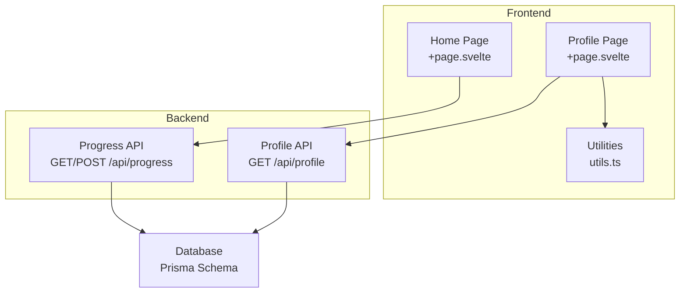
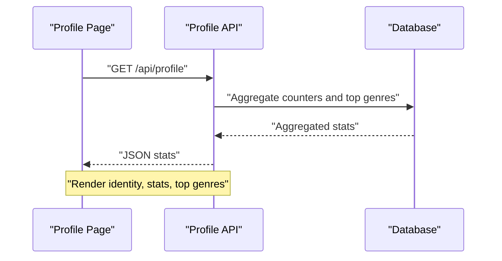
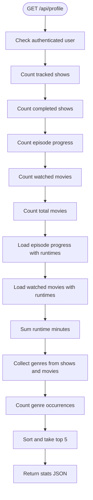
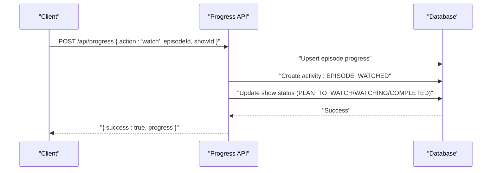
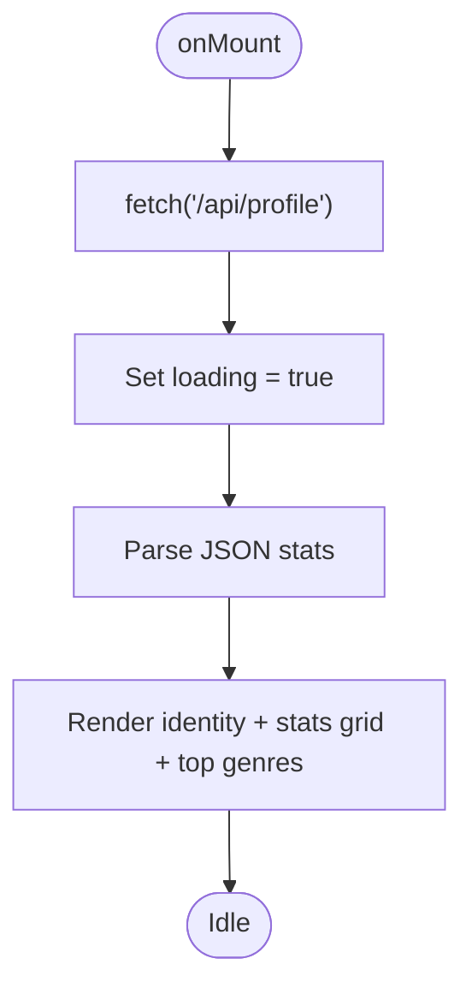
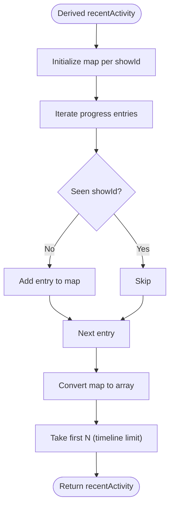
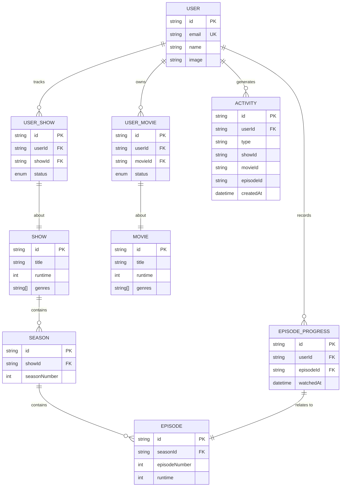
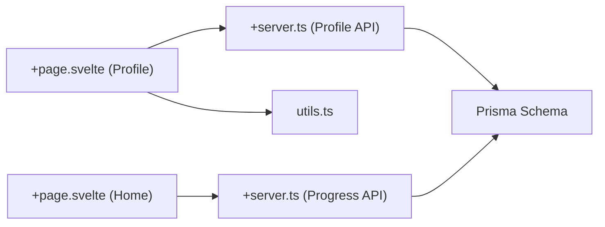

# User Profile & Analytics

<cite>
**Referenced Files in This Document**
- [schema.prisma](file://prisma/schema.prisma)
- [+page.svelte (Profile)](file://src/routes/(app)/profile/+page.svelte)
- [+server.ts (Profile API)](file://src/routes/api/profile/+server.ts)
- [+server.ts (Progress API)](file://src/routes/api/progress/+server.ts)
- [utils.ts](file://src/lib/utils.ts)
- [+page.svelte (Home Feed)](file://src/routes/(app)/home/+page.svelte)
</cite>

## Table of Contents
1. [Introduction](#introduction)
2. [Project Structure](#project-structure)
3. [Core Components](#core-components)
4. [Architecture Overview](#architecture-overview)
5. [Detailed Component Analysis](#detailed-component-analysis)
6. [Dependency Analysis](#dependency-analysis)
7. [Performance Considerations](#performance-considerations)
8. [Troubleshooting Guide](#troubleshooting-guide)
9. [Conclusion](#conclusion)
10. [Appendices](#appendices)

## Introduction
This document describes the User Profile and Analytics feature responsible for displaying personal statistics, activity tracking, completion metrics, genre preferences, and recent activity highlights. It explains how profile data is aggregated, how progress and activity are recorded, and how the frontend renders insights. It also outlines privacy controls, data export opportunities, historical statistics, recommendations grounded in viewing patterns, performance optimizations for large datasets, caching strategies, and real-time update considerations.

## Project Structure
The feature spans a small set of coordinated modules:
- Database schema defines the domain model and relationships.
- A server endpoint aggregates profile statistics for the authenticated user.
- A second server endpoint manages episode progress and related activity events.
- The Profile page fetches and renders statistics.
- Utility helpers format runtime and other display values.
- The Home page demonstrates recent activity derived from progress data.

**Diagram sources**
- [schema.prisma:108-242](file://prisma/schema.prisma#L108-L242)
- [+page.svelte (Profile)](file://src/routes/(app)/profile/+page.svelte#L12-L21)
- [+page.svelte (Home Feed)](file://src/routes/(app)/home/+page.svelte#L92-L129)
- [+server.ts (Profile API):5-65](file://src/routes/api/profile/+server.ts#L5-L65)
- [+server.ts (Progress API):34-58](file://src/routes/api/progress/+server.ts#L34-L58)
- [utils.ts:32-38](file://src/lib/utils.ts#L32-L38)

**Section sources**
- [schema.prisma:108-242](file://prisma/schema.prisma#L108-L242)
- [+page.svelte (Profile)](file://src/routes/(app)/profile/+page.svelte#L12-L21)
- [+page.svelte (Home Feed)](file://src/routes/(app)/home/+page.svelte#L92-L129)
- [+server.ts (Profile API):5-65](file://src/routes/api/profile/+server.ts#L5-L65)
- [+server.ts (Progress API):34-58](file://src/routes/api/progress/+server.ts#L34-L58)
- [utils.ts:32-38](file://src/lib/utils.ts#L32-L38)

## Core Components
- Profile statistics aggregation service: Computes tracked shows, completed shows, episodes watched, movies watched, total movies, total watch time, and top genres.
- Progress and activity service: Manages episode progress, updates show status, records activity events, and supports bulk actions.
- Profile UI: Displays identity, stats cards, top genres, and skeleton loaders while fetching.
- Utilities: Formats runtime and other display values.

Key responsibilities:
- Aggregation: Counters and totals are computed via Prisma queries and simple loops.
- Status computation: Show status transitions based on episode progress counts.
- Activity recording: New activity entries are created upon episode watch events.
- Rendering: Stats are rendered in responsive cards with genre badges.

**Section sources**
- [+server.ts (Profile API):9-61](file://src/routes/api/profile/+server.ts#L9-L61)
- [+server.ts (Progress API):6-32](file://src/routes/api/progress/+server.ts#L6-L32)
- [+page.svelte (Profile)](file://src/routes/(app)/profile/+page.svelte#L42-L83)
- [utils.ts:32-38](file://src/lib/utils.ts#L32-L38)

## Architecture Overview
The analytics pipeline connects user actions to persisted state and UI rendering:
- Frontend requests profile stats and progress.
- Backend computes aggregations and returns structured data.
- Progress mutations update episode progress and derive show status.
- Activity logs capture recent events for timelines.

**Diagram sources**
- [+page.svelte (Profile)](file://src/routes/(app)/profile/+page.svelte#L12-L21)
- [+server.ts (Profile API):5-65](file://src/routes/api/profile/+server.ts#L5-L65)

## Detailed Component Analysis

### Profile Statistics Aggregation
The backend endpoint performs:
- Counts for tracked shows, completed shows, episodes watched, movies watched, and total movies.
- Total watch time by summing episode runtimes and watched movie runtimes.
- Top genres by collecting genres from tracked shows and movies, counting occurrences, sorting, and returning the top five.

**Diagram sources**
- [+server.ts (Profile API):9-61](file://src/routes/api/profile/+server.ts#L9-L61)

**Section sources**
- [+server.ts (Profile API):9-61](file://src/routes/api/profile/+server.ts#L9-L61)

### Progress Tracking and Status Updates
The progress endpoint:
- Retrieves paginated recent progress entries for the user.
- Supports marking episodes as watched/unwatched, marking seasons, catching up a show, and resetting a show.
- On watch, creates an activity event and updates show status accordingly.
- On unwatch or season actions, recalculates show status.

**Diagram sources**
- [+server.ts (Progress API):60-127](file://src/routes/api/progress/+server.ts#L60-L127)

**Section sources**
- [+server.ts (Progress API):34-58](file://src/routes/api/progress/+server.ts#L34-L58)
- [+server.ts (Progress API):60-127](file://src/routes/api/progress/+server.ts#L60-L127)

### Profile UI Rendering
The Profile page:
- Fetches stats on mount and displays skeleton loaders until loaded.
- Renders identity (initials, name, email).
- Displays stats cards for tracked shows, completed shows, episodes watched, movies watched, and total watch time.
- Shows top genres as labeled badges.

**Diagram sources**
- [+page.svelte (Profile)](file://src/routes/(app)/profile/+page.svelte#L12-L21)
- [+page.svelte (Profile)](file://src/routes/(app)/profile/+page.svelte#L42-L83)
- [utils.ts:32-38](file://src/lib/utils.ts#L32-L38)

**Section sources**
- [+page.svelte (Profile)](file://src/routes/(app)/profile/+page.svelte#L12-L21)
- [+page.svelte (Profile)](file://src/routes/(app)/profile/+page.svelte#L42-L83)
- [utils.ts:32-38](file://src/lib/utils.ts#L32-L38)

### Recent Activity Timeline (Derived from Progress)
The Home page demonstrates a recent activity timeline derived from progress data:
- Builds a map keyed by show ID from recent progress entries.
- Limits to the most recent entry per show.
- Formats relative timestamps and renders poster thumbnails with show/episode metadata.

**Diagram sources**
- [+page.svelte (Home Feed)](file://src/routes/(app)/home/+page.svelte#L107-L123)

**Section sources**
- [+page.svelte (Home Feed)](file://src/routes/(app)/home/+page.svelte#L92-L129)
- [+page.svelte (Home Feed)](file://src/routes/(app)/home/+page.svelte#L298-L335)

### Data Model Overview
The schema defines the core entities and relationships used by the analytics feature:
- Users track shows and movies, maintain episode progress, and generate activity events.
- Shows and Movies carry genres and runtime metadata used for analytics.
- Status enums define progression states for shows and movies.

**Diagram sources**
- [schema.prisma:108-242](file://prisma/schema.prisma#L108-L242)

**Section sources**
- [schema.prisma:108-242](file://prisma/schema.prisma#L108-L242)

## Dependency Analysis
- Profile page depends on:
  - Profile API for stats.
  - Utilities for runtime formatting.
- Progress API depends on:
  - Database models for counts, joins, and updates.
  - Enumerations for status transitions.
- Home page depends on:
  - Progress data to derive recent activity.

**Diagram sources**
- [+page.svelte (Profile)](file://src/routes/(app)/profile/+page.svelte#L12-L21)
- [+page.svelte (Home Feed)](file://src/routes/(app)/home/+page.svelte#L92-L129)
- [+server.ts (Profile API):5-65](file://src/routes/api/profile/+server.ts#L5-L65)
- [+server.ts (Progress API):34-58](file://src/routes/api/progress/+server.ts#L34-L58)
- [utils.ts:32-38](file://src/lib/utils.ts#L32-L38)
- [schema.prisma:108-242](file://prisma/schema.prisma#L108-L242)

**Section sources**
- [+page.svelte (Profile)](file://src/routes/(app)/profile/+page.svelte#L12-L21)
- [+page.svelte (Home Feed)](file://src/routes/(app)/home/+page.svelte#L92-L129)
- [+server.ts (Profile API):5-65](file://src/routes/api/profile/+server.ts#L5-L65)
- [+server.ts (Progress API):34-58](file://src/routes/api/progress/+server.ts#L34-L58)
- [utils.ts:32-38](file://src/lib/utils.ts#L32-L38)
- [schema.prisma:108-242](file://prisma/schema.prisma#L108-L242)

## Performance Considerations
- Aggregation efficiency:
  - Use targeted Prisma queries with includes only when necessary.
  - Consider precomputing frequently accessed metrics (e.g., total watch time) at write time to reduce read-time aggregation.
- Pagination and limits:
  - The progress endpoint already limits returned entries; keep limits reasonable for large histories.
- Indexing:
  - Ensure database indexes exist on frequently filtered fields (e.g., user ID, timestamps).
- Caching:
  - Cache profile stats per user session with short TTL to reduce repeated heavy computations.
  - Invalidate cache on significant changes (e.g., new episode watch, status change).
- Real-time updates:
  - For live updates, consider pushing incremental changes via SSE or WebSocket and updating local state without refetching.
- Batch operations:
  - Bulk actions (e.g., mark season) already leverage upsert loops; ensure they are executed efficiently and avoid redundant writes.

[No sources needed since this section provides general guidance]

## Troubleshooting Guide
- Unauthorized access:
  - Profile and progress endpoints check for an authenticated user and return unauthorized responses when missing.
- Error handling:
  - Both endpoints wrap logic in try/catch and return structured error messages with appropriate HTTP status codes.
- Data inconsistencies:
  - Show status relies on episode progress counts; ensure progress updates occur before status checks.
- Activity visibility:
  - Recent activity is derived from progress; ensure progress entries exist for items to appear.

**Section sources**
- [+server.ts (Profile API):5-65](file://src/routes/api/profile/+server.ts#L5-L65)
- [+server.ts (Progress API):34-58](file://src/routes/api/progress/+server.ts#L34-L58)
- [+server.ts (Progress API):129-131](file://src/routes/api/progress/+server.ts#L129-L131)

## Conclusion
The User Profile and Analytics feature integrates lightweight aggregation, progress tracking, and activity logging to deliver actionable insights. The current implementation focuses on correctness and simplicity, with clear extension points for advanced analytics, caching, and real-time updates.

[No sources needed since this section summarizes without analyzing specific files]

## Appendices

### Privacy Controls for Profile Visibility
- Current state: The profile page displays public identity (name, email) and computed stats for the authenticated user.
- Recommendations:
  - Add user preference toggles for profile visibility (public/private).
  - Implement server-side checks to restrict access to non-public profiles.
  - Allow users to hide sensitive stats (e.g., total watch time) based on preferences.

[No sources needed since this section provides general guidance]

### Data Export Functionality
- Current state: No explicit export endpoint exists.
- Recommendations:
  - Add endpoints to export profile stats, watch history, and activity logs in standardized formats (e.g., CSV/JSON).
  - Include filtering by date range and content type.
  - Provide asynchronous export jobs for large datasets.

[No sources needed since this section provides general guidance]

### Historical Statistics and Personalized Recommendations
- Historical statistics:
  - Store periodic snapshots of key metrics (e.g., weekly watch totals) to enable trend analysis.
- Personalized recommendations:
  - Use top genres and recently watched content to suggest similar items.
  - Combine watch history with metadata to refine discovery.

[No sources needed since this section provides general guidance]

### Achievement Systems and Social Sharing
- Achievements:
  - Define milestones (e.g., “Watch 50 episodes”, “Complete 10 shows”) and badge rewards.
- Social sharing:
  - Allow sharing of top genres, recent activity tiles, and profile highlights with privacy controls.

[No sources needed since this section provides general guidance]