# Component Structure

<cite>
**Referenced Files in This Document**
- [package.json](file://package.json)
- [svelte.config.js](file://svelte.config.js)
- [src/lib/components/ui/index.ts](file://src/lib/components/ui/index.ts)
- [src/lib/components/ui/button.svelte](file://src/lib/components/ui/button.svelte)
- [src/lib/components/ui/input.svelte](file://src/lib/components/ui/input.svelte)
- [src/lib/components/ui/label.svelte](file://src/lib/components/ui/label.svelte)
- [src/lib/components/ui/skeleton.svelte](file://src/lib/components/ui/skeleton.svelte)
- [src/lib/components/custom/index.ts](file://src/lib/components/custom/index.ts)
- [src/lib/components/custom/poster-card.svelte](file://src/lib/components/custom/poster-card.svelte)
- [src/lib/components/custom/status-pill.svelte](file://src/lib/components/custom/status-pill.svelte)
- [src/lib/components/custom/empty-state.svelte](file://src/lib/components/custom/empty-state.svelte)
- [src/lib/utils.ts](file://src/lib/utils.ts)
- [src/routes/+error.svelte](file://src/routes/+error.svelte)
</cite>

## Table of Contents
1. [Introduction](#introduction)
2. [Project Structure](#project-structure)
3. [Core Components](#core-components)
4. [Architecture Overview](#architecture-overview)
5. [Detailed Component Analysis](#detailed-component-analysis)
6. [Dependency Analysis](#dependency-analysis)
7. [Performance Considerations](#performance-considerations)
8. [Troubleshooting Guide](#troubleshooting-guide)
9. [Conclusion](#conclusion)
10. [Appendices](#appendices)

## Introduction
This document describes the component structure of Screenlog’s SvelteKit frontend with a focus on the dual-component architecture:
- UI components: reusable base building blocks (Button, Input, Label, Skeleton)
- Custom components: domain-specific components (PosterCard, StatusPill, EmptyState)

It explains component organization patterns, export structures, naming conventions, prop interfaces, event handling, slots, and composition patterns. It also provides guidelines for creating new components that align with existing conventions.

## Project Structure
The component system is organized under a dedicated folder with two submodules:
- src/lib/components/ui: Base UI primitives exported via a barrel index
- src/lib/components/custom: Domain-specific components exported via a barrel index

Utility helpers live under src/lib/utils.ts and are shared across components for styling and data formatting.

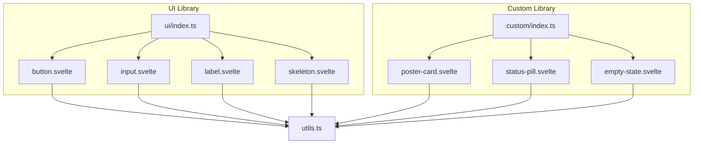

**Diagram sources**
- [src/lib/components/ui/index.ts:1-5](file://src/lib/components/ui/index.ts#L1-L5)
- [src/lib/components/custom/index.ts:1-4](file://src/lib/components/custom/index.ts#L1-L4)
- [src/lib/components/ui/button.svelte:1-45](file://src/lib/components/ui/button.svelte#L1-L45)
- [src/lib/components/ui/input.svelte:1-16](file://src/lib/components/ui/input.svelte#L1-L16)
- [src/lib/components/ui/label.svelte:1-11](file://src/lib/components/ui/label.svelte#L1-L11)
- [src/lib/components/ui/skeleton.svelte:1-8](file://src/lib/components/ui/skeleton.svelte#L1-L8)
- [src/lib/components/custom/poster-card.svelte:1-68](file://src/lib/components/custom/poster-card.svelte#L1-L68)
- [src/lib/components/custom/status-pill.svelte:1-32](file://src/lib/components/custom/status-pill.svelte#L1-L32)
- [src/lib/components/custom/empty-state.svelte:1-44](file://src/lib/components/custom/empty-state.svelte#L1-L44)
- [src/lib/utils.ts:1-82](file://src/lib/utils.ts#L1-L82)

**Section sources**
- [src/lib/components/ui/index.ts:1-5](file://src/lib/components/ui/index.ts#L1-L5)
- [src/lib/components/custom/index.ts:1-4](file://src/lib/components/custom/index.ts#L1-L4)
- [src/lib/utils.ts:1-82](file://src/lib/utils.ts#L1-L82)

## Core Components
This section documents the four base UI components and their roles, props, and composition patterns.

- Button
  - Purpose: Standard interactive control with variant and size options
  - Props: variant, size, class, and forwards native button attributes
  - Composition: Uses a variant map and a size map for consistent styling
  - Event handling: Inherits all button events; children rendered via a slot
  - Export: Available from ui/index.ts

- Input
  - Purpose: Text input with built-in focus and disabled styles
  - Props: class, value (bindable), and forwards native input attributes
  - Composition: Integrates with form bindings and Tailwind-based styles
  - Event handling: Supports all input events via spread attributes
  - Export: Available from ui/index.ts

- Label
  - Purpose: Associates text with form controls
  - Props: class, children, and forwards native label attributes
  - Composition: Renders slotted content and applies peer-disabled styles
  - Event handling: Inherits label click behavior
  - Export: Available from ui/index.ts

- Skeleton
  - Purpose: Provides loading placeholders
  - Props: class
  - Composition: Simple animated div with pulse animation
  - Export: Available from ui/index.ts

Naming conventions:
- Component filenames are kebab-case
- Barrel exports use PascalCase identifiers
- Props are typed with union literals for variant/size enums

Export structure:
- ui/index.ts re-exports default exports from each component
- custom/index.ts re-exports default exports from each component

**Section sources**
- [src/lib/components/ui/button.svelte:1-45](file://src/lib/components/ui/button.svelte#L1-L45)
- [src/lib/components/ui/input.svelte:1-16](file://src/lib/components/ui/input.svelte#L1-L16)
- [src/lib/components/ui/label.svelte:1-11](file://src/lib/components/ui/label.svelte#L1-L11)
- [src/lib/components/ui/skeleton.svelte:1-8](file://src/lib/components/ui/skeleton.svelte#L1-L8)
- [src/lib/components/ui/index.ts:1-5](file://src/lib/components/ui/index.ts#L1-L5)

## Architecture Overview
The component architecture follows a layered pattern:
- Utilities layer: Shared styling and formatting helpers
- UI primitives: Reusable base components with consistent APIs
- Domain components: Higher-level components composed from UI primitives
- Application pages: Pages import domain components and pass domain-specific props

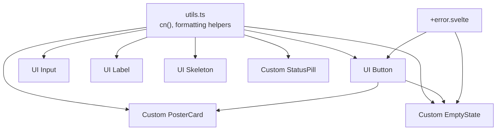

**Diagram sources**
- [src/lib/utils.ts:1-82](file://src/lib/utils.ts#L1-L82)
- [src/lib/components/ui/button.svelte:1-45](file://src/lib/components/ui/button.svelte#L1-L45)
- [src/lib/components/ui/input.svelte:1-16](file://src/lib/components/ui/input.svelte#L1-L16)
- [src/lib/components/ui/label.svelte:1-11](file://src/lib/components/ui/label.svelte#L1-L11)
- [src/lib/components/ui/skeleton.svelte:1-8](file://src/lib/components/ui/skeleton.svelte#L1-L8)
- [src/lib/components/custom/poster-card.svelte:1-68](file://src/lib/components/custom/poster-card.svelte#L1-L68)
- [src/lib/components/custom/status-pill.svelte:1-32](file://src/lib/components/custom/status-pill.svelte#L1-L32)
- [src/lib/components/custom/empty-state.svelte:1-44](file://src/lib/components/custom/empty-state.svelte#L1-L44)
- [src/routes/+error.svelte:1-30](file://src/routes/+error.svelte#L1-L30)

## Detailed Component Analysis

### UI Button
- Props and behavior
  - variant: union of predefined variants with mapped styles
  - size: union of predefined sizes with mapped heights and paddings
  - class: optional extra classes merged with cn()
  - children: renders via a slot for flexible content
  - Forwards rest attributes to the underlying button element
- Composition pattern
  - Uses a variant map and a size map keyed by literal strings
  - Merges Tailwind utility classes with cn() for safe overrides
- Event handling
  - Inherits all button events; consumers bind click handlers directly
- Slots
  - Children slot enables icon/text combinations and custom content

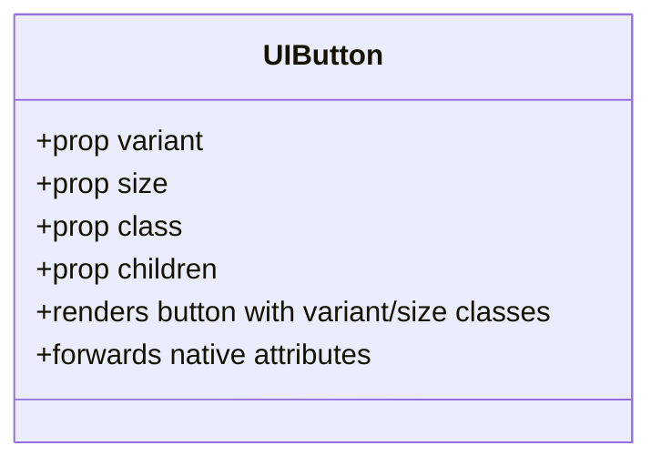

**Diagram sources**
- [src/lib/components/ui/button.svelte:1-45](file://src/lib/components/ui/button.svelte#L1-L45)

**Section sources**
- [src/lib/components/ui/button.svelte:1-45](file://src/lib/components/ui/button.svelte#L1-L45)

### UI Input
- Props and behavior
  - class: optional extra classes
  - value: bindable for controlled/uncontrolled patterns
  - Forwards rest attributes to the underlying input element
- Composition pattern
  - Applies focus-visible and disabled styles consistently
- Event handling
  - Inherits all input events via attribute spread

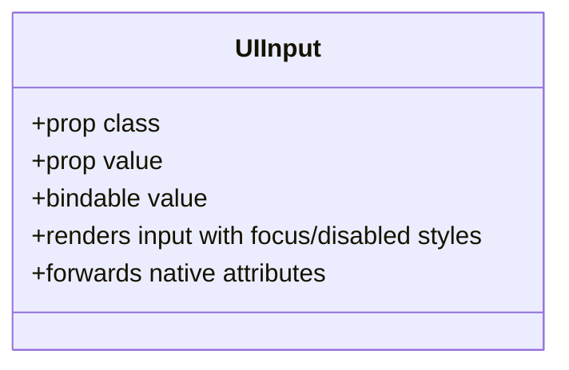

**Diagram sources**
- [src/lib/components/ui/input.svelte:1-16](file://src/lib/components/ui/input.svelte#L1-L16)

**Section sources**
- [src/lib/components/ui/input.svelte:1-16](file://src/lib/components/ui/input.svelte#L1-L16)

### UI Label
- Props and behavior
  - class: optional extra classes
  - children: renders slotted content
  - Forwards rest attributes to the underlying label element
- Composition pattern
  - Uses peer-disabled styles to reflect disabled states of associated inputs

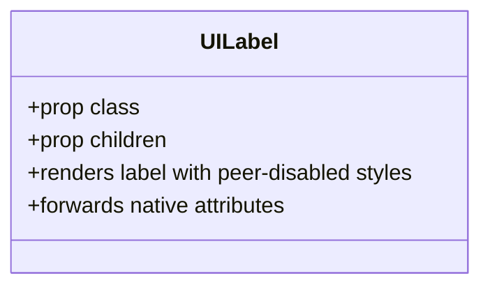

**Diagram sources**
- [src/lib/components/ui/label.svelte:1-11](file://src/lib/components/ui/label.svelte#L1-L11)

**Section sources**
- [src/lib/components/ui/label.svelte:1-11](file://src/lib/components/ui/label.svelte#L1-L11)

### UI Skeleton
- Props and behavior
  - class: optional extra classes
- Composition pattern
  - Simple animated container with pulse animation

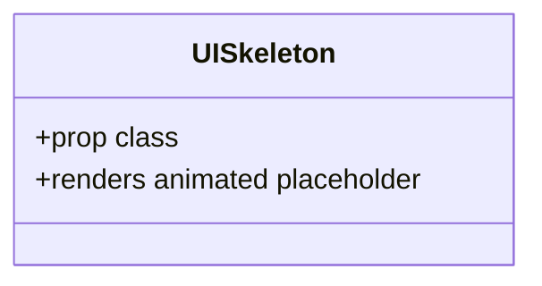

**Diagram sources**
- [src/lib/components/ui/skeleton.svelte:1-8](file://src/lib/components/ui/skeleton.svelte#L1-L8)

**Section sources**
- [src/lib/components/ui/skeleton.svelte:1-8](file://src/lib/components/ui/skeleton.svelte#L1-L8)

### Custom PosterCard
- Purpose
  - Domain-specific card for media items with optional add-to-list affordance
- Props and behavior
  - posterPath, title, year, type, genres, added, onAdd, onClick, class
  - Conditionally renders an image or a fallback message
  - Conditionally renders an add button with icon based on added state
  - Composes UI Button for the add action
- Event handling
  - onClick triggers consumer handler
  - onAdd triggered with event propagation stopped to avoid double-firing
- Slots
  - No explicit slots; uses implicit children rendering in nested Button
- Composition pattern
  - Uses utility helpers for image URLs and class merging
  - Uses icons from lucide-svelte

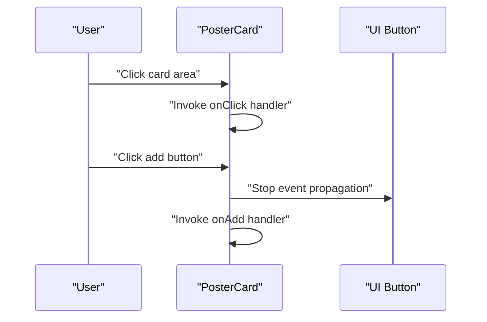

**Diagram sources**
- [src/lib/components/custom/poster-card.svelte:1-68](file://src/lib/components/custom/poster-card.svelte#L1-L68)
- [src/lib/components/ui/button.svelte:1-45](file://src/lib/components/ui/button.svelte#L1-L45)

**Section sources**
- [src/lib/components/custom/poster-card.svelte:1-68](file://src/lib/components/custom/poster-card.svelte#L1-L68)

### Custom StatusPill
- Purpose
  - Displays a status label with color-coded semantic meaning
- Props and behavior
  - status: maps to color and label text via internal dictionaries
- Composition pattern
  - Uses utility helpers for class merging
  - Renders a span with computed classes and label text

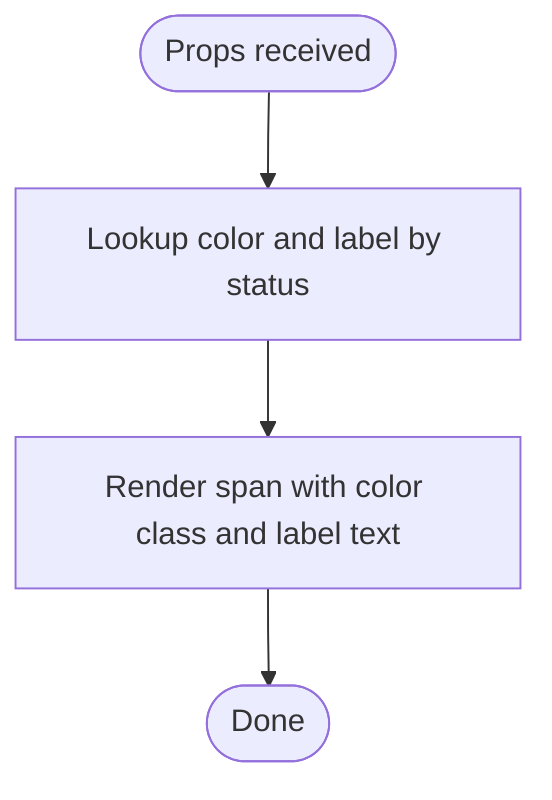

**Diagram sources**
- [src/lib/components/custom/status-pill.svelte:1-32](file://src/lib/components/custom/status-pill.svelte#L1-L32)

**Section sources**
- [src/lib/components/custom/status-pill.svelte:1-32](file://src/lib/components/custom/status-pill.svelte#L1-L32)

### Custom EmptyState
- Purpose
  - A reusable empty state layout with optional icon, title, description, and actions
- Props and behavior
  - icon, title, description, actionLabel/actionHref, secondaryActionLabel/secondaryActionHref
  - Conditionally renders icon, actions, and links
- Composition pattern
  - Uses anchor elements for actions
  - Composes UI Button indirectly via link styles in the template

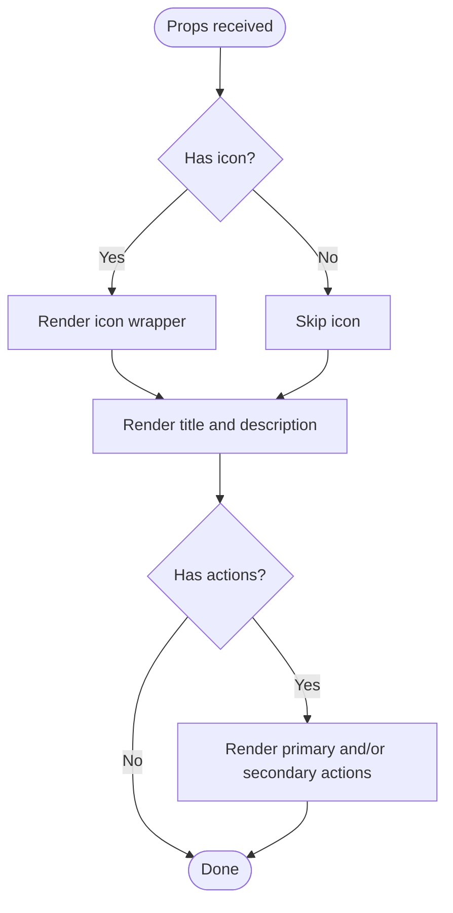

**Diagram sources**
- [src/lib/components/custom/empty-state.svelte:1-44](file://src/lib/components/custom/empty-state.svelte#L1-L44)

**Section sources**
- [src/lib/components/custom/empty-state.svelte:1-44](file://src/lib/components/custom/empty-state.svelte#L1-L44)

### Example Usage in Application
- The error page demonstrates importing UI Button and composing it with icons and navigation actions
- It illustrates how domain components (EmptyState) can be composed from UI primitives

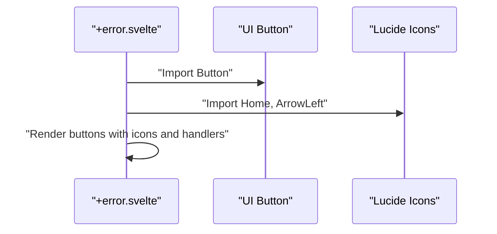

**Diagram sources**
- [src/routes/+error.svelte:1-30](file://src/routes/+error.svelte#L1-L30)
- [src/lib/components/ui/button.svelte:1-45](file://src/lib/components/ui/button.svelte#L1-L45)

**Section sources**
- [src/routes/+error.svelte:1-30](file://src/routes/+error.svelte#L1-L30)

## Dependency Analysis
- Internal dependencies
  - All UI and custom components depend on utils.ts for class merging and formatting
  - Custom components compose UI primitives (e.g., PosterCard composes UI Button)
- External dependencies
  - Tailwind utilities and merge helpers
  - Lucide icons for UI embellishment
  - Svelte runes mode enforced in svelte.config.js

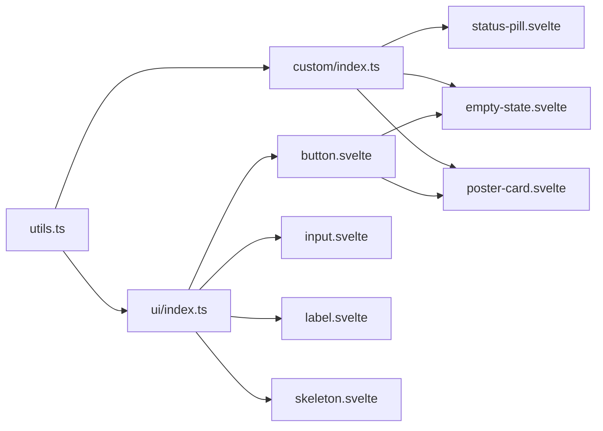

**Diagram sources**
- [src/lib/utils.ts:1-82](file://src/lib/utils.ts#L1-L82)
- [src/lib/components/ui/index.ts:1-5](file://src/lib/components/ui/index.ts#L1-L5)
- [src/lib/components/custom/index.ts:1-4](file://src/lib/components/custom/index.ts#L1-L4)
- [src/lib/components/ui/button.svelte:1-45](file://src/lib/components/ui/button.svelte#L1-L45)
- [src/lib/components/custom/poster-card.svelte:1-68](file://src/lib/components/custom/poster-card.svelte#L1-L68)

**Section sources**
- [package.json:26-44](file://package.json#L26-L44)
- [svelte.config.js:1-18](file://svelte.config.js#L1-L18)

## Performance Considerations
- Prefer lazy image loading for media-heavy components (already applied in PosterCard)
- Minimize unnecessary re-renders by passing stable props and avoiding inline function expressions in templates
- Use cn() to merge classes efficiently and avoid conflicting Tailwind utilities
- Keep custom components thin by composing UI primitives rather than duplicating styles

## Troubleshooting Guide
- Variant/Size mismatches
  - Ensure variant and size props match the allowed union literals in Button and Input
- Missing icons
  - Verify lucide-svelte is installed and icons are imported where used
- Image URLs
  - PosterCard relies on utility helpers for image URLs; confirm posterPath values are valid or null
- Disabled states
  - Input and Button apply disabled styles; ensure consumers do not override with !important

**Section sources**
- [src/lib/components/ui/button.svelte:1-45](file://src/lib/components/ui/button.svelte#L1-L45)
- [src/lib/components/ui/input.svelte:1-16](file://src/lib/components/ui/input.svelte#L1-L16)
- [src/lib/components/custom/poster-card.svelte:1-68](file://src/lib/components/custom/poster-card.svelte#L1-L68)
- [package.json:37-37](file://package.json#L37-L37)

## Conclusion
Screenlog’s component architecture cleanly separates reusable UI primitives from domain-specific components. The barrel-indexed exports, consistent prop typing, and shared utility layer enable predictable composition and maintainability. Following the documented patterns ensures new components integrate seamlessly and preserve a cohesive design system.

## Appendices

### Guidelines for Creating New Components
- Choose the appropriate module
  - Place reusable primitives in ui/
  - Place domain-specific components in custom/
- Naming and exports
  - Use kebab-case for filenames; export PascalCase identifiers from the barrel index
- Props and types
  - Define props with union literals for constrained values (e.g., variant, size)
  - Use optional props with defaults where appropriate
- Composition
  - Compose from UI primitives when possible
  - Forward attributes to underlying elements to preserve interop
- Styling
  - Use cn() to merge classes safely
  - Apply Tailwind utilities consistently with existing patterns
- Slots and events
  - Support children slots for flexible content
  - Forward native events; avoid duplicating event handling logic
- Testing and usage
  - Demonstrate usage in a real page (e.g., +page.svelte or +error.svelte)
  - Keep examples minimal and focused

[No sources needed since this section provides general guidance]