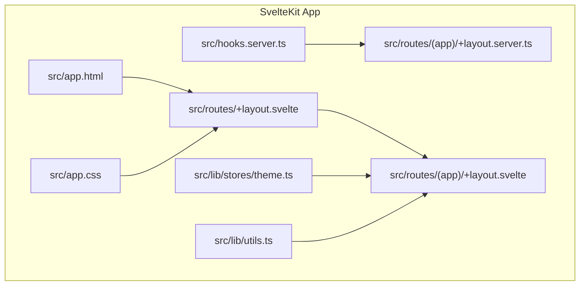
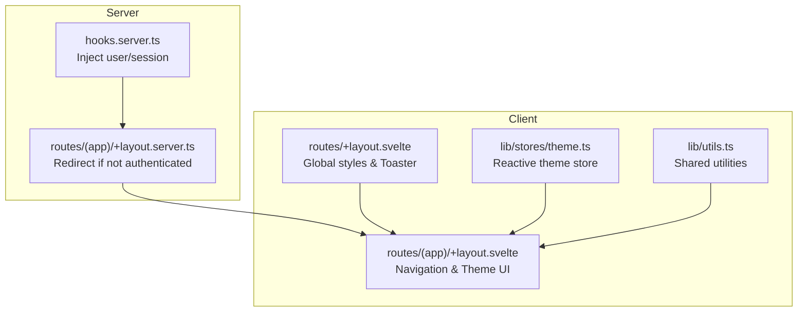
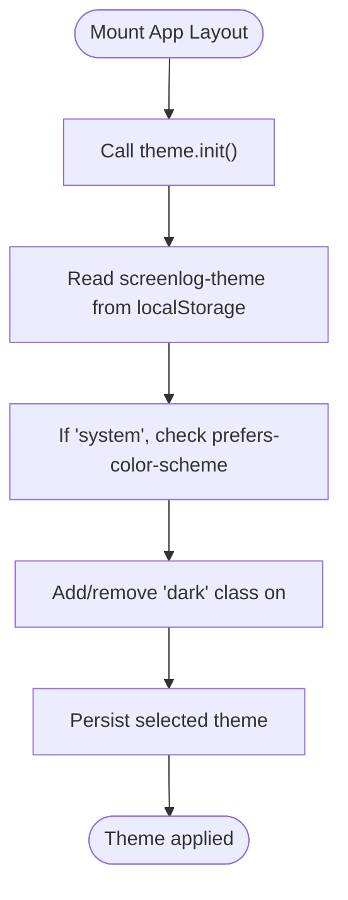
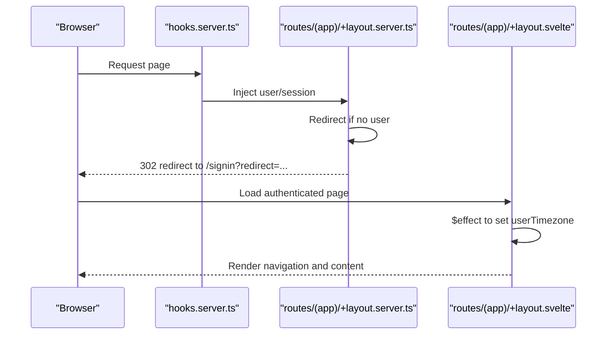
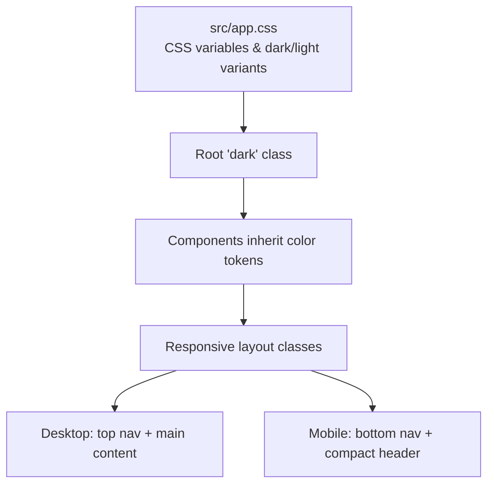
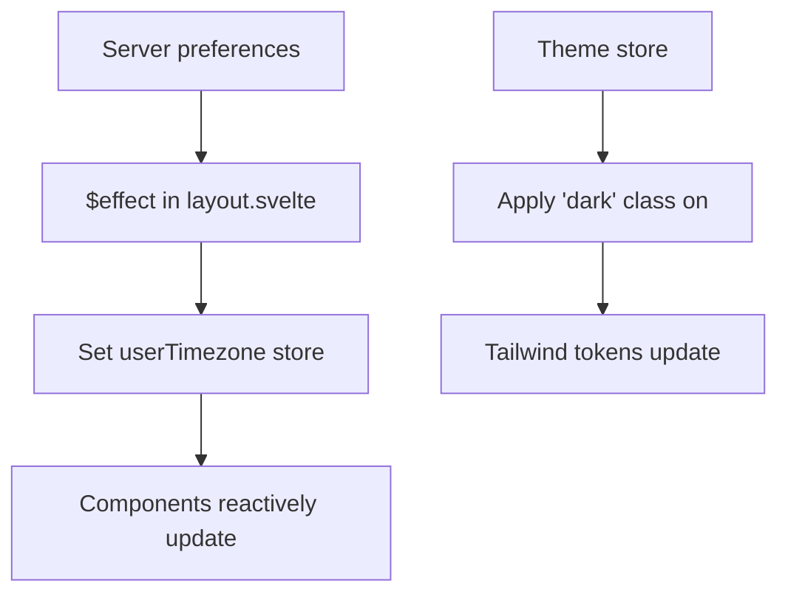
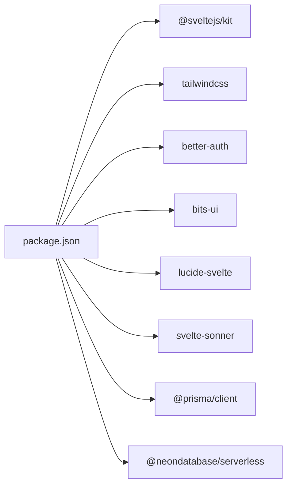

# Frontend Architecture

<cite>
**Referenced Files in This Document**
- [package.json](file://package.json)
- [svelte.config.js](file://svelte.config.js)
- [src/app.html](file://src/app.html)
- [src/app.css](file://src/app.css)
- [src/hooks.server.ts](file://src/hooks.server.ts)
- [src/routes/+layout.svelte](file://src/routes/+layout.svelte)
- [src/routes/(app)/+layout.server.ts](file://src/routes/(app)/+layout.server.ts)
- [src/routes/(app)/+layout.svelte](file://src/routes/(app)/+layout.svelte)
- [src/lib/stores/theme.ts](file://src/lib/stores/theme.ts)
- [src/lib/utils.ts](file://src/lib/utils.ts)
</cite>

## Table of Contents
1. [Introduction](#introduction)
2. [Project Structure](#project-structure)
3. [Core Components](#core-components)
4. [Architecture Overview](#architecture-overview)
5. [Detailed Component Analysis](#detailed-component-analysis)
6. [Dependency Analysis](#dependency-analysis)
7. [Performance Considerations](#performance-considerations)
8. [Troubleshooting Guide](#troubleshooting-guide)
9. [Conclusion](#conclusion)
10. [Appendices](#appendices)

## Introduction
This document describes the frontend architecture of Screenlog, focusing on the SvelteKit implementation and component organization. It explains the component-based architecture with UI components and custom components, the store-based state management system (including theme management and user preferences), the routing structure with authenticated routes and layout components, the styling approach using Tailwind CSS and responsive design patterns, and provides guidelines for extending the UI framework while maintaining design consistency.

## Project Structure
The project follows SvelteKit’s conventional file-based routing and layout hierarchy. Key areas:
- Routes: Organized under src/routes with route groups for authenticated and public sections.
- Layouts: Root layout initializes global styles and notifications; authenticated app layout manages navigation, theme, and user preferences.
- Stores: Centralized state management for theme and user preferences.
- Utilities: Shared helpers for class merging, formatting, and media URLs.
- Styles: Global Tailwind CSS with a custom theme system using CSS variables and a dark mode toggle.

**Diagram sources**
- [src/app.html:1-25](file://src/app.html#L1-L25)
- [src/app.css:1-88](file://src/app.css#L1-L88)
- [src/hooks.server.ts:1-18](file://src/hooks.server.ts#L1-L18)
- [src/routes/+layout.svelte:1-25](file://src/routes/+layout.svelte#L1-L25)
- [src/routes/(app)/+layout.server.ts](file://src/routes/(app)/+layout.server.ts#L1-L17)
- [src/routes/(app)/+layout.svelte](file://src/routes/(app)/+layout.svelte#L1-L147)
- [src/lib/stores/theme.ts:1-40](file://src/lib/stores/theme.ts#L1-L40)
- [src/lib/utils.ts:1-82](file://src/lib/utils.ts#L1-L82)

**Section sources**
- [package.json:1-47](file://package.json#L1-L47)
- [svelte.config.js:1-18](file://svelte.config.js#L1-L18)
- [src/app.html:1-25](file://src/app.html#L1-L25)
- [src/app.css:1-88](file://src/app.css#L1-L88)
- [src/hooks.server.ts:1-18](file://src/hooks.server.ts#L1-L18)
- [src/routes/+layout.svelte:1-25](file://src/routes/+layout.svelte#L1-L25)
- [src/routes/(app)/+layout.server.ts](file://src/routes/(app)/+layout.server.ts#L1-L17)
- [src/routes/(app)/+layout.svelte](file://src/routes/(app)/+layout.svelte#L1-L147)
- [src/lib/stores/theme.ts:1-40](file://src/lib/stores/theme.ts#L1-L40)
- [src/lib/utils.ts:1-82](file://src/lib/utils.ts#L1-L82)

## Core Components
- Theme Store: Provides reactive theme state with persistence and automatic OS preference detection.
- Utility Functions: Provide class merging, date/time formatting, runtime formatting, initials extraction, and TMDB image URL helpers.
- Root Layout: Initializes global styles, notifications, and sets up the Toaster.
- App Layout: Manages authenticated navigation, theme dropdown, sign-out flow, and renders page content with responsive desktop/mobile layouts.

Key responsibilities:
- Theme Store: Applies theme to the document element and persists selection.
- Utils: Centralized helpers for consistent UI behavior and data formatting.
- Root Layout: Ensures global styles and toast notifications are available across pages.
- App Layout: Handles authenticated navigation, user menu, and responsive UI.

**Section sources**
- [src/lib/stores/theme.ts:1-40](file://src/lib/stores/theme.ts#L1-L40)
- [src/lib/utils.ts:1-82](file://src/lib/utils.ts#L1-L82)
- [src/routes/+layout.svelte:1-25](file://src/routes/+layout.svelte#L1-L25)
- [src/routes/(app)/+layout.svelte](file://src/routes/(app)/+layout.svelte#L1-L147)

## Architecture Overview
The frontend architecture centers around SvelteKit’s runtime and compile-time features:
- Runtime: Server hooks inject user/session into events; authenticated layout enforces access control via redirects.
- State: Reactive stores manage theme and user preferences; effects initialize preferences from server-provided data.
- UI: Shared utilities and Tailwind CSS variables define consistent styling; responsive patterns adapt to desktop and mobile.
- Routing: Route groups separate authenticated and public flows; nested layouts encapsulate shared behavior.

**Diagram sources**
- [src/hooks.server.ts:1-18](file://src/hooks.server.ts#L1-L18)
- [src/routes/(app)/+layout.server.ts](file://src/routes/(app)/+layout.server.ts#L1-L17)
- [src/routes/+layout.svelte:1-25](file://src/routes/+layout.svelte#L1-L25)
- [src/routes/(app)/+layout.svelte](file://src/routes/(app)/+layout.svelte#L1-L147)
- [src/lib/stores/theme.ts:1-40](file://src/lib/stores/theme.ts#L1-L40)
- [src/lib/utils.ts:1-82](file://src/lib/utils.ts#L1-L82)

## Detailed Component Analysis

### Theme Management System
The theme system is implemented as a Svelte store with:
- Persistence: Uses local storage to remember user choice.
- Automatic detection: Falls back to OS preference when set to “system”.
- DOM application: Adds/removes the “dark” class on the root element.
- Initialization: Runs on mount to reflect persisted or detected theme.

**Diagram sources**
- [src/routes/+layout.svelte:9-11](file://src/routes/+layout.svelte#L9-L11)
- [src/lib/stores/theme.ts:33-35](file://src/lib/stores/theme.ts#L33-L35)
- [src/lib/stores/theme.ts:14-25](file://src/lib/stores/theme.ts#L14-L25)
- [src/app.html:9-19](file://src/app.html#L9-L19)

**Section sources**
- [src/lib/stores/theme.ts:1-40](file://src/lib/stores/theme.ts#L1-L40)
- [src/routes/+layout.svelte:9-11](file://src/routes/+layout.svelte#L9-L11)
- [src/app.html:9-19](file://src/app.html#L9-L19)

### Authenticated Navigation and Preferences
The authenticated layout:
- Enforces authentication via server-side redirect to sign-in when unauthenticated.
- Initializes user timezone from server-provided preferences using an effect.
- Renders a responsive navigation bar with icons and links.
- Provides a theme selector dropdown and a sign-out action.

**Diagram sources**
- [src/hooks.server.ts:1-18](file://src/hooks.server.ts#L1-L18)
- [src/routes/(app)/+layout.server.ts](file://src/routes/(app)/+layout.server.ts#L5-L16)
- [src/routes/(app)/+layout.svelte](file://src/routes/(app)/+layout.svelte#L22-L27)

**Section sources**
- [src/routes/(app)/+layout.server.ts](file://src/routes/(app)/+layout.server.ts#L1-L17)
- [src/routes/(app)/+layout.svelte](file://src/routes/(app)/+layout.svelte#L1-L147)

### Styling Approach and Responsive Design
Styling is built with Tailwind CSS v4 using:
- CSS variables for theme tokens and layered color schemes (background, foreground, card, popover, primary, secondary, muted, accent, destructive, border, input, ring, sidebar).
- A dark mode variant toggled via the “dark” class on the root element.
- Responsive breakpoints for desktop and mobile navigation:
  - Desktop: Top navigation bar with links and theme selector.
  - Mobile: Fixed bottom navigation bar and compact header.
- Utilities for class merging and consistent spacing.

**Diagram sources**
- [src/app.css:3-35](file://src/app.css#L3-L35)
- [src/app.css:37-87](file://src/app.css#L37-L87)
- [src/app.html:2-19](file://src/app.html#L2-L19)
- [src/routes/(app)/+layout.svelte](file://src/routes/(app)/+layout.svelte#L48-L146)

**Section sources**
- [src/app.css:1-88](file://src/app.css#L1-L88)
- [src/app.html:1-25](file://src/app.html#L1-L25)
- [src/routes/(app)/+layout.svelte](file://src/routes/(app)/+layout.svelte#L48-L146)

### Component Composition and Reactivity Patterns
- Reactive stores: Theme store exposes subscribe/set/init for reactive updates.
- Effects: Initialize user timezone from server data using Svelte’s $effect.
- Derived state: Computed user data from page store.
- Event-driven actions: Theme dropdown toggles, sign-out fetch, and navigation.

**Diagram sources**
- [src/routes/(app)/+layout.svelte](file://src/routes/(app)/+layout.svelte#L22-L27)
- [src/lib/stores/theme.ts:14-25](file://src/lib/stores/theme.ts#L14-L25)
- [src/app.css:37-87](file://src/app.css#L37-L87)

**Section sources**
- [src/routes/(app)/+layout.svelte](file://src/routes/(app)/+layout.svelte#L22-L27)
- [src/lib/stores/theme.ts:1-40](file://src/lib/stores/theme.ts#L1-L40)

### UI Components and Custom Components
The component directory structure indicates:
- UI primitives: button.svelte, input.svelte, label.svelte, skeleton.svelte.
- Custom components: empty-state.svelte, poster-card.svelte, status-pill.svelte.
- Index exports: centralized re-exports for easy imports across the app.

Guidelines:
- Keep UI primitives small, single-responsibility, and theme-aware via Tailwind tokens.
- Encapsulate custom components with consistent props and slots for flexibility.
- Re-export via index.ts to maintain a clean import surface.

**Section sources**
- [src/lib/components/ui/index.ts](file://src/lib/components/ui/index.ts)
- [src/lib/components/custom/index.ts](file://src/lib/components/custom/index.ts)

## Dependency Analysis
External dependencies relevant to frontend architecture:
- SvelteKit: Framework runtime and routing.
- Tailwind CSS: Utility-first styling with CSS variables.
- Better Auth: Authentication provider integration.
- Bits UI, Lucide Svelte, Svelte Sonner: UI primitives, icons, and toast notifications.
- Prisma, Neon Postgres: Backend data access for preferences and sessions.

**Diagram sources**
- [package.json:15-45](file://package.json#L15-L45)

**Section sources**
- [package.json:1-47](file://package.json#L1-L47)

## Performance Considerations
- Prefer Svelte’s runes mode for efficient reactivity and smaller bundles.
- Use CSS variables for theming to avoid expensive reflows and enable smooth transitions.
- Lazy-load images using poster/backdrop URL helpers to reduce initial payload.
- Minimize unnecessary re-renders by deriving computed values and scoping state to nearest components.
- Defer non-critical UI updates (e.g., theme dropdown) until after hydration.

[No sources needed since this section provides general guidance]

## Troubleshooting Guide
Common issues and resolutions:
- Authentication redirect loop: Verify server hook correctly extracts session and redirects unauthenticated users to sign-in with a redirect parameter.
- Theme not applying: Confirm theme store initialization runs on mount and that the “dark” class is toggled on the root element.
- Timezone mismatch: Ensure server preferences are returned and the $effect in the layout applies the value to the timezone store.

**Section sources**
- [src/hooks.server.ts:4-17](file://src/hooks.server.ts#L4-L17)
- [src/routes/(app)/+layout.server.ts](file://src/routes/(app)/+layout.server.ts#L5-L16)
- [src/routes/(app)/+layout.svelte](file://src/routes/(app)/+layout.svelte#L22-L27)
- [src/lib/stores/theme.ts:33-35](file://src/lib/stores/theme.ts#L33-L35)

## Conclusion
Screenlog’s frontend leverages SvelteKit’s modern runtime and compile-time features to deliver a responsive, theme-aware application. The store-based state management, centralized utilities, and modular component structure enable scalable UI development. The routing model with authenticated layouts and server hooks ensures secure access and consistent user experiences across devices.

[No sources needed since this section summarizes without analyzing specific files]

## Appendices
- Extending the UI framework:
  - Add new UI primitives to the ui directory and export via index.ts.
  - Introduce custom components in the custom directory with consistent props and Tailwind-based styling.
  - Use cn() for conditional class composition and keep tokens aligned with CSS variables.
- Maintaining design consistency:
  - Define new tokens in app.css and consume them via Tailwind utilities.
  - Use the theme store to drive dark/light variants and ensure components remain theme-aware.
  - Keep navigation patterns uniform across desktop and mobile layouts.

[No sources needed since this section provides general guidance]