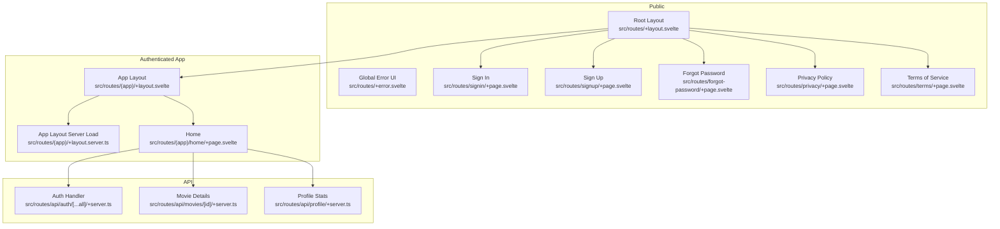
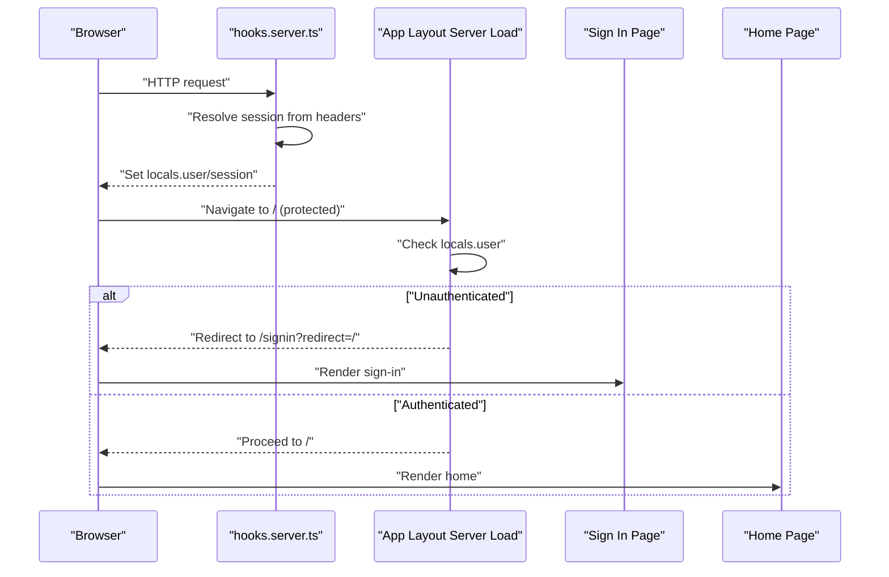
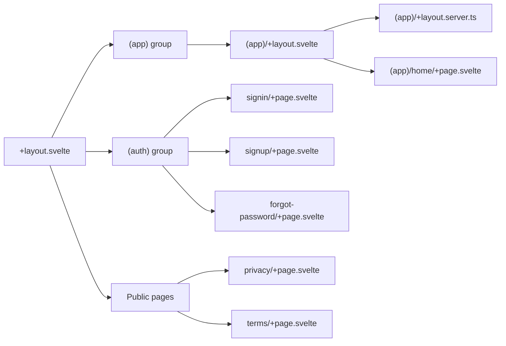
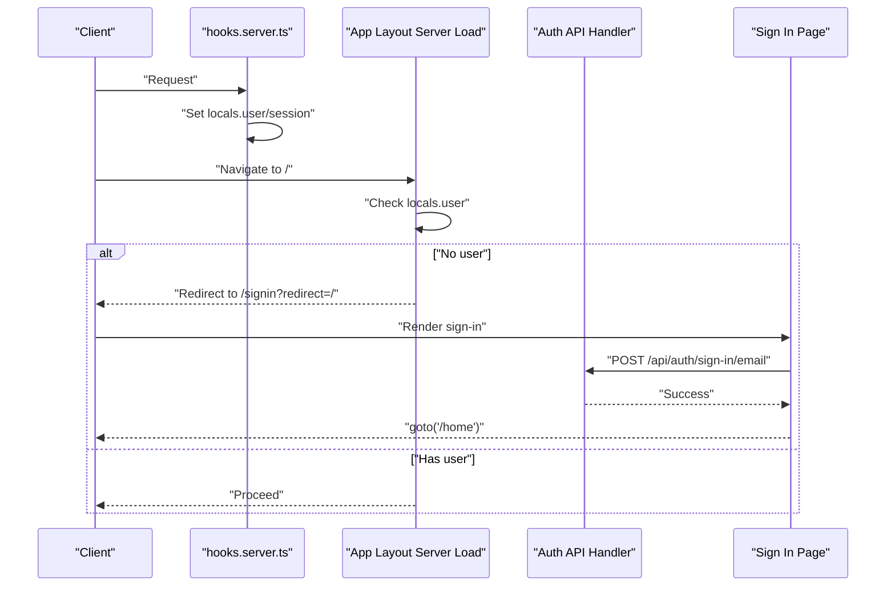
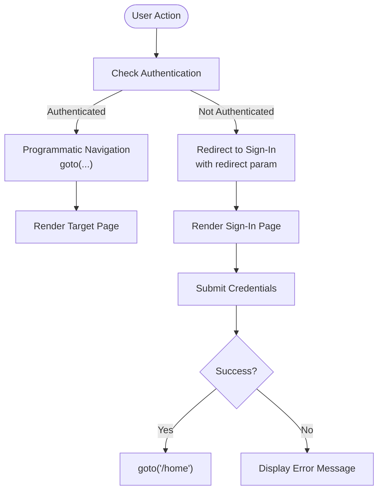
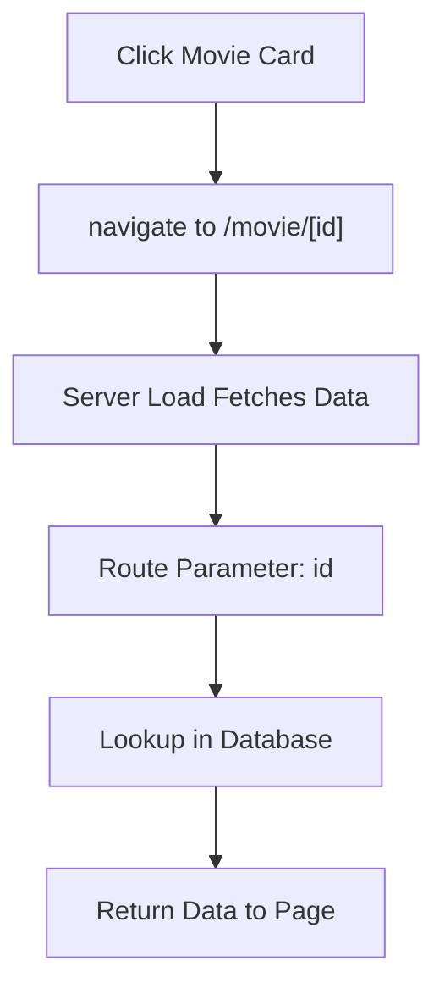
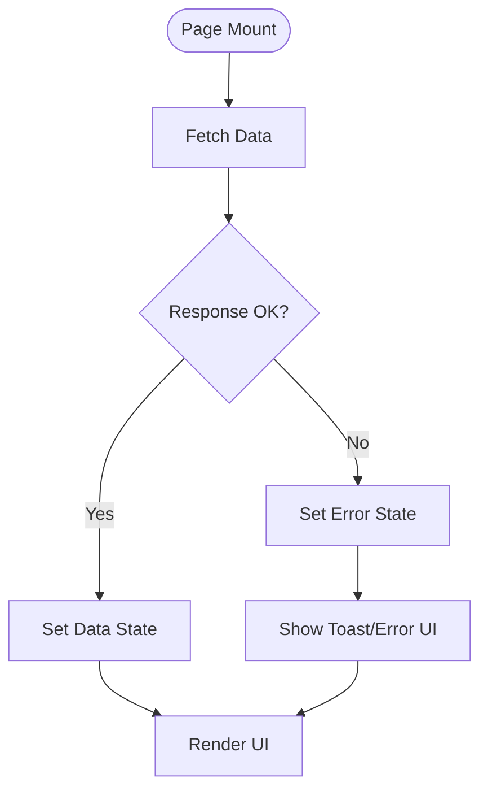
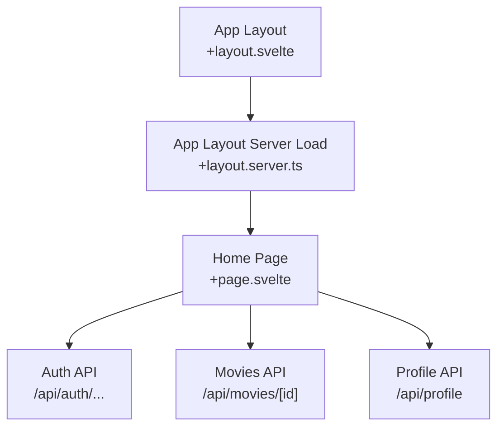
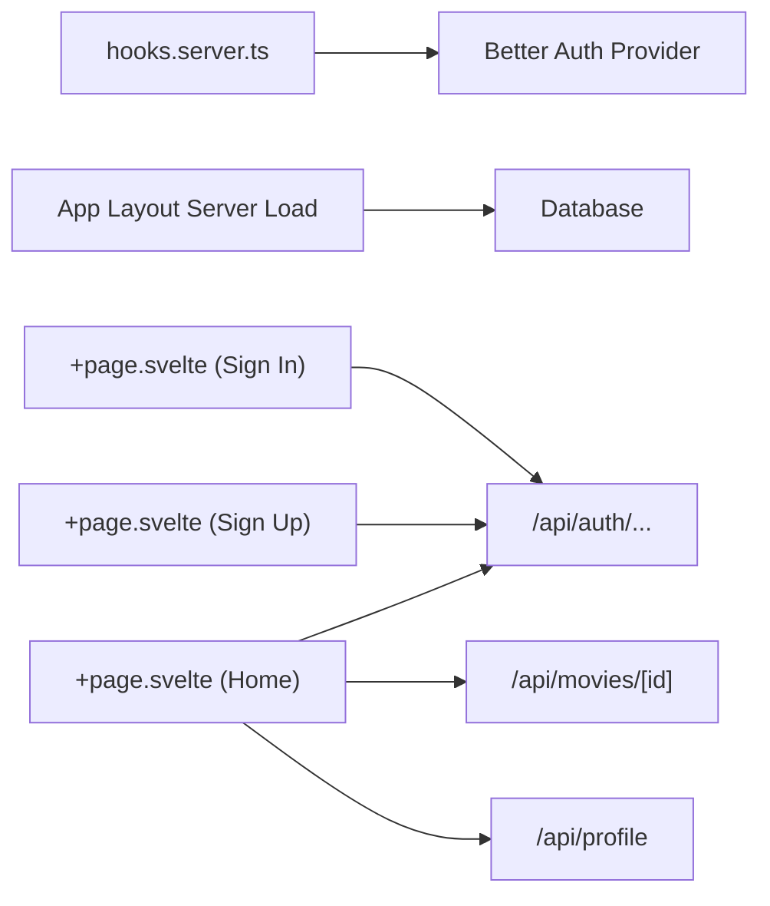

# Routing & Navigation

<cite>
**Referenced Files in This Document**
- [src/routes/+layout.svelte](file://src/routes/+layout.svelte)
- [src/routes/+error.svelte](file://src/routes/+error.svelte)
- [src/hooks.server.ts](file://src/hooks.server.ts)
- [src/routes/(app)/+layout.svelte](file://src/routes/(app)/+layout.svelte)
- [src/routes/(app)/+layout.server.ts](file://src/routes/(app)/+layout.server.ts)
- [src/routes/(app)/home/+page.svelte](file://src/routes/(app)/home/+page.svelte)
- [src/routes/signin/+page.svelte](file://src/routes/signin/+page.svelte)
- [src/routes/signup/+page.svelte](file://src/routes/signup/+page.svelte)
- [src/routes/forgot-password/+page.svelte](file://src/routes/forgot-password/+page.svelte)
- [src/routes/privacy/+page.svelte](file://src/routes/privacy/+page.svelte)
- [src/routes/terms/+page.svelte](file://src/routes/terms/+page.svelte)
- [src/routes/api/auth/[...all]/+server.ts](file://src/routes/api/auth/[...all]/+server.ts)
- [src/routes/api/movies/[id]/+server.ts](file://src/routes/api/movies/[id]/+server.ts)
- [src/routes/api/profile/+server.ts](file://src/routes/api/profile/+server.ts)
</cite>

## Table of Contents
1. [Introduction](#introduction)
2. [Project Structure](#project-structure)
3. [Core Components](#core-components)
4. [Architecture Overview](#architecture-overview)
5. [Detailed Component Analysis](#detailed-component-analysis)
6. [Dependency Analysis](#dependency-analysis)
7. [Performance Considerations](#performance-considerations)
8. [Troubleshooting Guide](#troubleshooting-guide)
9. [Conclusion](#conclusion)

## Introduction
This document explains the routing and navigation model for Screenlog’s SvelteKit application. It covers route organization into authenticated routes (app), public authentication routes (auth), and public informational pages; the layout hierarchy and nested routes; authentication flow and route protection; navigation patterns including programmatic navigation and route parameters; and how server-side data loading integrates with page components. It also documents error handling and loading states.

## Project Structure
The routing model is organized around:
- Public base layout and global error handling
- Authenticated app routes protected by a layout guard
- Public authentication and informational pages
- API routes for server-side data and authentication handlers

**Diagram sources**
- [src/routes/+layout.svelte:1-25](file://src/routes/+layout.svelte#L1-L25)
- [src/routes/+error.svelte:1-31](file://src/routes/+error.svelte#L1-L31)
- [src/routes/(app)/+layout.svelte](file://src/routes/(app)/+layout.svelte#L1-L147)
- [src/routes/(app)/+layout.server.ts](file://src/routes/(app)/+layout.server.ts#L1-L17)
- [src/routes/(app)/home/+page.svelte](file://src/routes/(app)/home/+page.svelte#L1-L552)
- [src/routes/signin/+page.svelte:1-77](file://src/routes/signin/+page.svelte#L1-L77)
- [src/routes/signup/+page.svelte:1-98](file://src/routes/signup/+page.svelte#L1-L98)
- [src/routes/forgot-password/+page.svelte:1-52](file://src/routes/forgot-password/+page.svelte#L1-L52)
- [src/routes/privacy/+page.svelte:1-52](file://src/routes/privacy/+page.svelte#L1-L52)
- [src/routes/terms/+page.svelte:1-52](file://src/routes/terms/+page.svelte#L1-L52)
- [src/routes/api/auth/[...all]/+server.ts](file://src/routes/api/auth/[...all]/+server.ts#L1-L7)
- [src/routes/api/movies/[id]/+server.ts](file://src/routes/api/movies/[id]/+server.ts#L1-L19)
- [src/routes/api/profile/+server.ts:1-66](file://src/routes/api/profile/+server.ts#L1-L66)

**Section sources**
- [src/routes/+layout.svelte:1-25](file://src/routes/+layout.svelte#L1-L25)
- [src/routes/+error.svelte:1-31](file://src/routes/+error.svelte#L1-L31)
- [src/routes/(app)/+layout.svelte](file://src/routes/(app)/+layout.svelte#L1-L147)
- [src/routes/(app)/+layout.server.ts](file://src/routes/(app)/+layout.server.ts#L1-L17)
- [src/routes/(app)/home/+page.svelte](file://src/routes/(app)/home/+page.svelte#L1-L552)
- [src/routes/signin/+page.svelte:1-77](file://src/routes/signin/+page.svelte#L1-L77)
- [src/routes/signup/+page.svelte:1-98](file://src/routes/signup/+page.svelte#L1-L98)
- [src/routes/forgot-password/+page.svelte:1-52](file://src/routes/forgot-password/+page.svelte#L1-L52)
- [src/routes/privacy/+page.svelte:1-52](file://src/routes/privacy/+page.svelte#L1-L52)
- [src/routes/terms/+page.svelte:1-52](file://src/routes/terms/+page.svelte#L1-L52)
- [src/routes/api/auth/[...all]/+server.ts](file://src/routes/api/auth/[...all]/+server.ts#L1-L7)
- [src/routes/api/movies/[id]/+server.ts](file://src/routes/api/movies/[id]/+server.ts#L1-L19)
- [src/routes/api/profile/+server.ts:1-66](file://src/routes/api/profile/+server.ts#L1-L66)

## Core Components
- Root layout initializes global styles, theme, and notifications, and renders child layouts/pages.
- Global error UI handles rendering errors with navigation controls.
- App layout provides authenticated navigation, theme switching, and user actions, and renders child pages.
- App layout server load enforces authentication and injects user preferences.
- Public authentication pages implement sign-in, sign-up, and forgot-password flows with programmatic navigation.
- API routes encapsulate server-side data loading and authentication delegation.

**Section sources**
- [src/routes/+layout.svelte:1-25](file://src/routes/+layout.svelte#L1-L25)
- [src/routes/+error.svelte:1-31](file://src/routes/+error.svelte#L1-L31)
- [src/routes/(app)/+layout.svelte](file://src/routes/(app)/+layout.svelte#L1-L147)
- [src/routes/(app)/+layout.server.ts](file://src/routes/(app)/+layout.server.ts#L1-L17)
- [src/routes/signin/+page.svelte:1-77](file://src/routes/signin/+page.svelte#L1-L77)
- [src/routes/signup/+page.svelte:1-98](file://src/routes/signup/+page.svelte#L1-L98)
- [src/routes/forgot-password/+page.svelte:1-52](file://src/routes/forgot-password/+page.svelte#L1-L52)

## Architecture Overview
The routing architecture separates concerns:
- Public routes (auth and informational) are accessible without authentication.
- Authenticated routes are protected by a layout guard that redirects unauthenticated users to the sign-in page with a redirect parameter.
- Programmatic navigation uses SvelteKit’s navigation helpers to move between pages.
- Server-side data loading is performed via API routes, while client-side navigation remains declarative.

**Diagram sources**
- [src/hooks.server.ts:1-18](file://src/hooks.server.ts#L1-L18)
- [src/routes/(app)/+layout.server.ts](file://src/routes/(app)/+layout.server.ts#L1-L17)
- [src/routes/signin/+page.svelte:1-77](file://src/routes/signin/+page.svelte#L1-L77)
- [src/routes/(app)/home/+page.svelte](file://src/routes/(app)/home/+page.svelte#L1-L552)

## Detailed Component Analysis

### Route Groups and Nested Layouts
- Public group: Routes under the root layout without authentication protection.
- Authenticated group: Routes under the app layout group, enforced by a layout server load.
- Nested routes: Pages inside the app group render within the app layout, inheriting navigation and user context.

**Diagram sources**
- [src/routes/+layout.svelte:1-25](file://src/routes/+layout.svelte#L1-L25)
- [src/routes/(app)/+layout.svelte](file://src/routes/(app)/+layout.svelte#L1-L147)
- [src/routes/(app)/+layout.server.ts](file://src/routes/(app)/+layout.server.ts#L1-L17)
- [src/routes/(app)/home/+page.svelte](file://src/routes/(app)/home/+page.svelte#L1-L552)
- [src/routes/signin/+page.svelte:1-77](file://src/routes/signin/+page.svelte#L1-L77)
- [src/routes/signup/+page.svelte:1-98](file://src/routes/signup/+page.svelte#L1-L98)
- [src/routes/forgot-password/+page.svelte:1-52](file://src/routes/forgot-password/+page.svelte#L1-L52)
- [src/routes/privacy/+page.svelte:1-52](file://src/routes/privacy/+page.svelte#L1-L52)
- [src/routes/terms/+page.svelte:1-52](file://src/routes/terms/+page.svelte#L1-L52)

**Section sources**
- [src/routes/+layout.svelte:1-25](file://src/routes/+layout.svelte#L1-L25)
- [src/routes/(app)/+layout.svelte](file://src/routes/(app)/+layout.svelte#L1-L147)
- [src/routes/(app)/+layout.server.ts](file://src/routes/(app)/+layout.server.ts#L1-L17)
- [src/routes/(app)/home/+page.svelte](file://src/routes/(app)/home/+page.svelte#L1-L552)
- [src/routes/signin/+page.svelte:1-77](file://src/routes/signin/+page.svelte#L1-L77)
- [src/routes/signup/+page.svelte:1-98](file://src/routes/signup/+page.svelte#L1-L98)
- [src/routes/forgot-password/+page.svelte:1-52](file://src/routes/forgot-password/+page.svelte#L1-L52)
- [src/routes/privacy/+page.svelte:1-52](file://src/routes/privacy/+page.svelte#L1-L52)
- [src/routes/terms/+page.svelte:1-52](file://src/routes/terms/+page.svelte#L1-L52)

### Authentication Flow and Route Protection
- Session resolution occurs globally during request handling to populate user context.
- The app layout server load checks for a valid user and redirects to sign-in with the current pathname as a redirect parameter when missing.
- Sign-in and sign-up pages perform submission handling and navigate programmatically upon success.

**Diagram sources**
- [src/hooks.server.ts:1-18](file://src/hooks.server.ts#L1-L18)
- [src/routes/(app)/+layout.server.ts](file://src/routes/(app)/+layout.server.ts#L1-L17)
- [src/routes/api/auth/[...all]/+server.ts](file://src/routes/api/auth/[...all]/+server.ts#L1-L7)
- [src/routes/signin/+page.svelte:1-77](file://src/routes/signin/+page.svelte#L1-L77)

**Section sources**
- [src/hooks.server.ts:1-18](file://src/hooks.server.ts#L1-L18)
- [src/routes/(app)/+layout.server.ts](file://src/routes/(app)/+layout.server.ts#L1-L17)
- [src/routes/signin/+page.svelte:1-77](file://src/routes/signin/+page.svelte#L1-L77)
- [src/routes/signup/+page.svelte:1-98](file://src/routes/signup/+page.svelte#L1-L98)
- [src/routes/api/auth/[...all]/+server.ts](file://src/routes/api/auth/[...all]/+server.ts#L1-L7)

### Navigation Patterns and Programmatic Navigation
- Programmatic navigation is used to move between pages after successful authentication or user actions.
- The app layout provides a responsive navigation bar with active-state highlighting based on the current URL.
- Buttons and links trigger navigation to internal routes or external pages.

**Diagram sources**
- [src/routes/(app)/+layout.svelte](file://src/routes/(app)/+layout.svelte#L1-L147)
- [src/routes/(app)/+layout.server.ts](file://src/routes/(app)/+layout.server.ts#L1-L17)
- [src/routes/signin/+page.svelte:1-77](file://src/routes/signin/+page.svelte#L1-L77)
- [src/routes/(app)/home/+page.svelte](file://src/routes/(app)/home/+page.svelte#L1-L552)

**Section sources**
- [src/routes/(app)/+layout.svelte](file://src/routes/(app)/+layout.svelte#L1-L147)
- [src/routes/(app)/home/+page.svelte](file://src/routes/(app)/home/+page.svelte#L1-L552)
- [src/routes/signin/+page.svelte:1-77](file://src/routes/signin/+page.svelte#L1-L77)

### Route Parameters Handling
- Dynamic routes use bracket notation to capture parameters.
- Example: movie details route captures an identifier parameter to load specific data via an API endpoint.

**Diagram sources**
- [src/routes/(app)/home/+page.svelte](file://src/routes/(app)/home/+page.svelte#L1-L552)
- [src/routes/api/movies/[id]/+server.ts](file://src/routes/api/movies/[id]/+server.ts#L1-L19)

**Section sources**
- [src/routes/(app)/home/+page.svelte](file://src/routes/(app)/home/+page.svelte#L1-L552)
- [src/routes/api/movies/[id]/+server.ts](file://src/routes/api/movies/[id]/+server.ts#L1-L19)

### Loading States and Error Handling
- Global error UI displays status and error messages with navigation buttons.
- Pages implement loading states and error messaging during asynchronous operations.
- API routes return structured responses and appropriate HTTP statuses for client handling.

**Diagram sources**
- [src/routes/+error.svelte:1-31](file://src/routes/+error.svelte#L1-L31)
- [src/routes/(app)/home/+page.svelte](file://src/routes/(app)/home/+page.svelte#L1-L552)
- [src/routes/api/profile/+server.ts:1-66](file://src/routes/api/profile/+server.ts#L1-L66)

**Section sources**
- [src/routes/+error.svelte:1-31](file://src/routes/+error.svelte#L1-L31)
- [src/routes/(app)/home/+page.svelte](file://src/routes/(app)/home/+page.svelte#L1-L552)
- [src/routes/api/profile/+server.ts:1-66](file://src/routes/api/profile/+server.ts#L1-L66)

### Relationship Between Routes and Page Components
- App layout and server load provide user context and enforce authentication.
- Home page orchestrates client-side navigation and server-side data fetching via API routes.
- Public pages manage their own navigation and user onboarding flows.

**Diagram sources**
- [src/routes/(app)/+layout.svelte](file://src/routes/(app)/+layout.svelte#L1-L147)
- [src/routes/(app)/+layout.server.ts](file://src/routes/(app)/+layout.server.ts#L1-L17)
- [src/routes/(app)/home/+page.svelte](file://src/routes/(app)/home/+page.svelte#L1-L552)
- [src/routes/api/auth/[...all]/+server.ts](file://src/routes/api/auth/[...all]/+server.ts#L1-L7)
- [src/routes/api/movies/[id]/+server.ts](file://src/routes/api/movies/[id]/+server.ts#L1-L19)
- [src/routes/api/profile/+server.ts:1-66](file://src/routes/api/profile/+server.ts#L1-L66)

**Section sources**
- [src/routes/(app)/+layout.svelte](file://src/routes/(app)/+layout.svelte#L1-L147)
- [src/routes/(app)/+layout.server.ts](file://src/routes/(app)/+layout.server.ts#L1-L17)
- [src/routes/(app)/home/+page.svelte](file://src/routes/(app)/home/+page.svelte#L1-L552)
- [src/routes/api/auth/[...all]/+server.ts](file://src/routes/api/auth/[...all]/+server.ts#L1-L7)
- [src/routes/api/movies/[id]/+server.ts](file://src/routes/api/movies/[id]/+server.ts#L1-L19)
- [src/routes/api/profile/+server.ts:1-66](file://src/routes/api/profile/+server.ts#L1-L66)

## Dependency Analysis
- Global hook depends on the authentication provider to populate user/session in locals.
- App layout server load depends on the database to fetch user preferences.
- Pages depend on API routes for server-side data loading and on navigation helpers for programmatic navigation.
- Public pages depend on navigation helpers for returning to previous contexts.

**Diagram sources**
- [src/hooks.server.ts:1-18](file://src/hooks.server.ts#L1-L18)
- [src/routes/(app)/+layout.server.ts](file://src/routes/(app)/+layout.server.ts#L1-L17)
- [src/routes/(app)/home/+page.svelte](file://src/routes/(app)/home/+page.svelte#L1-L552)
- [src/routes/signin/+page.svelte:1-77](file://src/routes/signin/+page.svelte#L1-L77)
- [src/routes/signup/+page.svelte:1-98](file://src/routes/signup/+page.svelte#L1-L98)
- [src/routes/api/auth/[...all]/+server.ts](file://src/routes/api/auth/[...all]/+server.ts#L1-L7)
- [src/routes/api/movies/[id]/+server.ts](file://src/routes/api/movies/[id]/+server.ts#L1-L19)
- [src/routes/api/profile/+server.ts:1-66](file://src/routes/api/profile/+server.ts#L1-L66)

**Section sources**
- [src/hooks.server.ts:1-18](file://src/hooks.server.ts#L1-L18)
- [src/routes/(app)/+layout.server.ts](file://src/routes/(app)/+layout.server.ts#L1-L17)
- [src/routes/(app)/home/+page.svelte](file://src/routes/(app)/home/+page.svelte#L1-L552)
- [src/routes/signin/+page.svelte:1-77](file://src/routes/signin/+page.svelte#L1-L77)
- [src/routes/signup/+page.svelte:1-98](file://src/routes/signup/+page.svelte#L1-L98)
- [src/routes/api/auth/[...all]/+server.ts](file://src/routes/api/auth/[...all]/+server.ts#L1-L7)
- [src/routes/api/movies/[id]/+server.ts](file://src/routes/api/movies/[id]/+server.ts#L1-L19)
- [src/routes/api/profile/+server.ts:1-66](file://src/routes/api/profile/+server.ts#L1-L66)

## Performance Considerations
- Batch concurrent requests to reduce latency when loading related datasets (e.g., watchlist and progress).
- Use pagination to limit initial payload sizes for lists.
- Cache frequently accessed data client-side to minimize repeated network requests.
- Keep server-side loads minimal and focused to avoid blocking the main thread.

## Troubleshooting Guide
- Authentication redirects: If redirected to sign-in unexpectedly, verify session headers and ensure the global hook resolves the user.
- Unauthorized API responses: Confirm the user is authenticated before calling protected endpoints.
- Navigation failures: Ensure programmatic navigation targets existing routes and that the app layout is rendering child content.
- Error UI: Use the global error page to diagnose unexpected runtime errors and inspect status/error messages.

**Section sources**
- [src/hooks.server.ts:1-18](file://src/hooks.server.ts#L1-L18)
- [src/routes/(app)/+layout.server.ts](file://src/routes/(app)/+layout.server.ts#L1-L17)
- [src/routes/+error.svelte:1-31](file://src/routes/+error.svelte#L1-L31)
- [src/routes/(app)/home/+page.svelte](file://src/routes/(app)/home/+page.svelte#L1-L552)

## Conclusion
Screenlog’s routing model cleanly separates public and authenticated concerns, with a robust authentication guard and a responsive app layout. Programmatic navigation and server-side data loading integrate seamlessly with SvelteKit’s routing primitives, enabling a smooth user experience across public pages, authentication flows, and authenticated features.