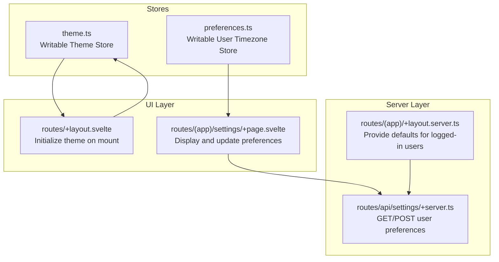
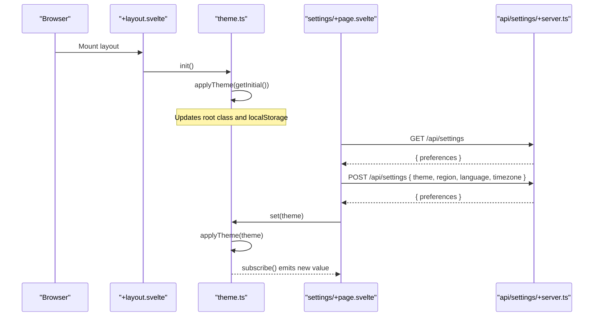
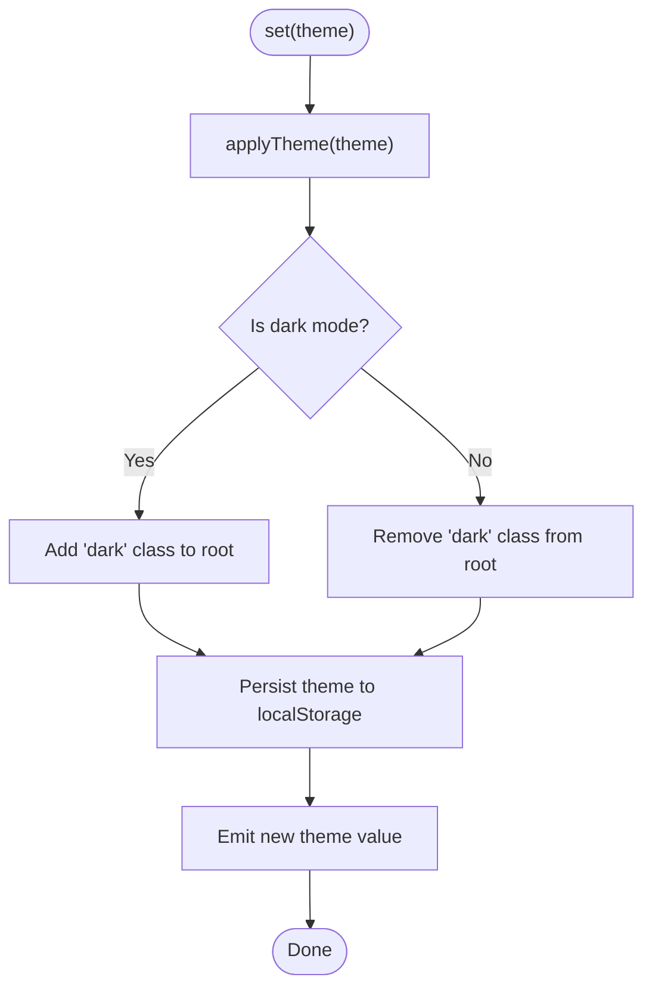
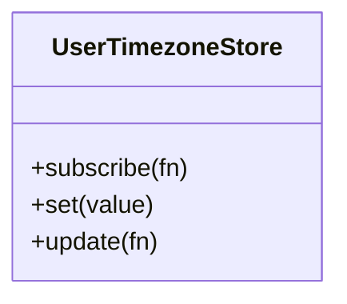
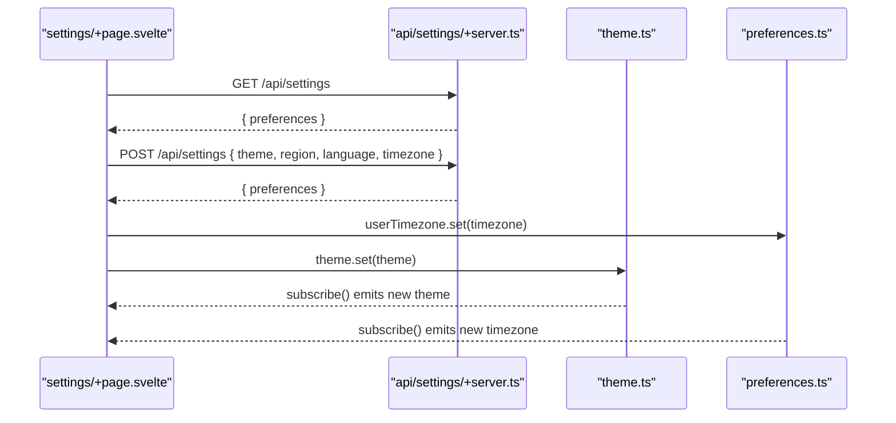
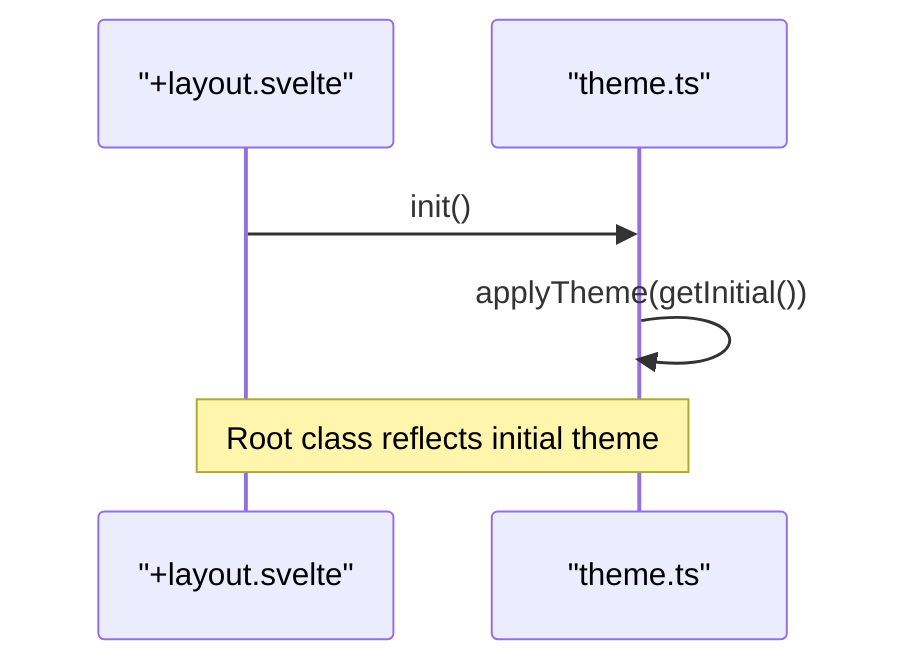
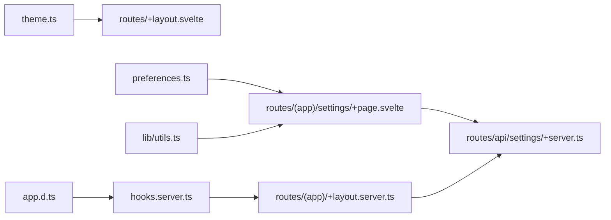

# State Management

<cite>
**Referenced Files in This Document**
- [src/lib/stores/theme.ts](file://src/lib/stores/theme.ts)
- [src/lib/stores/preferences.ts](file://src/lib/stores/preferences.ts)
- [src/routes/+layout.svelte](file://src/routes/+layout.svelte)
- [src/routes/(app)/settings/+page.svelte](file://src/routes/(app)/settings/+page.svelte)
- [src/routes/api/settings/+server.ts](file://src/routes/api/settings/+server.ts)
- [src/routes/(app)/+layout.server.ts](file://src/routes/(app)/+layout.server.ts)
- [src/lib/utils.ts](file://src/lib/utils.ts)
- [src/hooks.server.ts](file://src/hooks.server.ts)
- [src/app.d.ts](file://src/app.d.ts)
</cite>

## Table of Contents
1. [Introduction](#introduction)
2. [Project Structure](#project-structure)
3. [Core Components](#core-components)
4. [Architecture Overview](#architecture-overview)
5. [Detailed Component Analysis](#detailed-component-analysis)
6. [Dependency Analysis](#dependency-analysis)
7. [Performance Considerations](#performance-considerations)
8. [Troubleshooting Guide](#troubleshooting-guide)
9. [Conclusion](#conclusion)
10. [Appendices](#appendices)

## Introduction
This document explains the state management architecture for Screenlog’s SvelteKit application. The system uses Svelte stores for global state, focusing on:
- Theme store for dark/light/system mode switching and system preference detection
- Preferences store for user settings and application behavior configuration
It covers store initialization, subscription patterns, state update mechanisms, best practices for store organization, avoiding memory leaks, optimizing reactivity, and guidelines for extending the state management system.

## Project Structure
The state management is centered around two primary stores located under the library stores module:
- Theme store: responsible for theme selection and DOM class updates
- Preferences store: exposes user timezone preference as a writable store

These stores are consumed by application layout and settings pages, and backed by server-side persistence via an API route.

**Diagram sources**
- [src/lib/stores/theme.ts:1-40](file://src/lib/stores/theme.ts#L1-L40)
- [src/lib/stores/preferences.ts:1-4](file://src/lib/stores/preferences.ts#L1-L4)
- [src/routes/+layout.svelte:1-25](file://src/routes/+layout.svelte#L1-L25)
- [src/routes/(app)/settings/+page.svelte](file://src/routes/(app)/settings/+page.svelte#L1-L193)
- [src/routes/(app)/+layout.server.ts](file://src/routes/(app)/+layout.server.ts#L1-L16)
- [src/routes/api/settings/+server.ts:1-28](file://src/routes/api/settings/+server.ts#L1-L28)

**Section sources**
- [src/lib/stores/theme.ts:1-40](file://src/lib/stores/theme.ts#L1-L40)
- [src/lib/stores/preferences.ts:1-4](file://src/lib/stores/preferences.ts#L1-L4)
- [src/routes/+layout.svelte:1-25](file://src/routes/+layout.svelte#L1-L25)
- [src/routes/(app)/settings/+page.svelte](file://src/routes/(app)/settings/+page.svelte#L1-L193)
- [src/routes/api/settings/+server.ts:1-28](file://src/routes/api/settings/+server.ts#L1-L28)
- [src/routes/(app)/+layout.server.ts](file://src/routes/(app)/+layout.server.ts#L1-L16)

## Core Components
- Theme store
  - Provides a typed theme value with three modes: system, light, dark
  - Persists the user’s choice to local storage
  - Applies a class to the root element to reflect the active theme
  - Exposes subscribe, set, and init methods
- Preferences store
  - Exposes a writable store for user timezone
  - Initialized with a default value suitable for onboarding

Usage highlights:
- Theme store is initialized during client-side layout mount
- Settings page reads and writes preferences via a dedicated API route
- Server-side layout provides default preferences for authenticated users

**Section sources**
- [src/lib/stores/theme.ts:1-40](file://src/lib/stores/theme.ts#L1-L40)
- [src/lib/stores/preferences.ts:1-4](file://src/lib/stores/preferences.ts#L1-L4)
- [src/routes/+layout.svelte:1-25](file://src/routes/+layout.svelte#L1-L25)
- [src/routes/(app)/settings/+page.svelte](file://src/routes/(app)/settings/+page.svelte#L1-L193)
- [src/routes/api/settings/+server.ts:1-28](file://src/routes/api/settings/+server.ts#L1-L28)
- [src/routes/(app)/+layout.server.ts](file://src/routes/(app)/+layout.server.ts#L1-L16)

## Architecture Overview
The state management architecture follows a unidirectional data flow:
- Stores are created on the client and optionally hydrated from persisted values
- UI components subscribe to stores and render reactive updates
- Actions trigger store updates, which propagate to subscribers
- Server-side logic supplies defaults and persists user preferences

**Diagram sources**
- [src/routes/+layout.svelte:1-25](file://src/routes/+layout.svelte#L1-L25)
- [src/lib/stores/theme.ts:1-40](file://src/lib/stores/theme.ts#L1-L40)
- [src/routes/(app)/settings/+page.svelte](file://src/routes/(app)/settings/+page.svelte#L1-L193)
- [src/routes/api/settings/+server.ts:1-28](file://src/routes/api/settings/+server.ts#L1-L28)

## Detailed Component Analysis

### Theme Store
The theme store encapsulates:
- Initial value resolution from browser environment and local storage
- A function to apply the theme to the document root class
- Public methods: subscribe, set, init

Key behaviors:
- On set, the store applies the theme immediately and persists the selection
- On init, it applies the initial theme without emitting a change
- Uses media queries to detect system preference when configured to “system”

**Diagram sources**
- [src/lib/stores/theme.ts:1-40](file://src/lib/stores/theme.ts#L1-L40)

**Section sources**
- [src/lib/stores/theme.ts:1-40](file://src/lib/stores/theme.ts#L1-L40)

### Preferences Store
The preferences store currently exposes a writable store for user timezone. It is initialized with a sensible default and can be updated by UI actions.

**Diagram sources**
- [src/lib/stores/preferences.ts:1-4](file://src/lib/stores/preferences.ts#L1-L4)

**Section sources**
- [src/lib/stores/preferences.ts:1-4](file://src/lib/stores/preferences.ts#L1-L4)

### Settings Page Integration
The settings page demonstrates:
- Fetching preferences from the server on mount
- Updating preferences via POST to the settings API
- Triggering store updates after successful persistence
- Rendering a timezone selector powered by a utility that lists supported timezones

**Diagram sources**
- [src/routes/(app)/settings/+page.svelte](file://src/routes/(app)/settings/+page.svelte#L1-L193)
- [src/routes/api/settings/+server.ts:1-28](file://src/routes/api/settings/+server.ts#L1-L28)
- [src/lib/stores/theme.ts:1-40](file://src/lib/stores/theme.ts#L1-L40)
- [src/lib/stores/preferences.ts:1-4](file://src/lib/stores/preferences.ts#L1-L4)

**Section sources**
- [src/routes/(app)/settings/+page.svelte](file://src/routes/(app)/settings/+page.svelte#L1-L193)
- [src/routes/api/settings/+server.ts:1-28](file://src/routes/api/settings/+server.ts#L1-L28)
- [src/lib/utils.ts:62-82](file://src/lib/utils.ts#L62-L82)

### Layout Initialization
The application layout initializes the theme store on mount, ensuring the correct class is applied to the root element before rendering child components.

**Diagram sources**
- [src/routes/+layout.svelte:1-25](file://src/routes/+layout.svelte#L1-L25)
- [src/lib/stores/theme.ts:1-40](file://src/lib/stores/theme.ts#L1-L40)

**Section sources**
- [src/routes/+layout.svelte:1-25](file://src/routes/+layout.svelte#L1-L25)
- [src/lib/stores/theme.ts:1-40](file://src/lib/stores/theme.ts#L1-L40)

## Dependency Analysis
The state management system exhibits low coupling and clear separation of concerns:
- Stores are pure Svelte stores with minimal side effects
- UI components depend on stores via Svelte’s reactive declarations
- Server-side logic provides defaults and persists preferences
- Utilities supply helper functions used by UI components

**Diagram sources**
- [src/lib/stores/theme.ts:1-40](file://src/lib/stores/theme.ts#L1-L40)
- [src/lib/stores/preferences.ts:1-4](file://src/lib/stores/preferences.ts#L1-L4)
- [src/routes/+layout.svelte:1-25](file://src/routes/+layout.svelte#L1-L25)
- [src/routes/(app)/settings/+page.svelte](file://src/routes/(app)/settings/+page.svelte#L1-L193)
- [src/routes/api/settings/+server.ts:1-28](file://src/routes/api/settings/+server.ts#L1-L28)
- [src/routes/(app)/+layout.server.ts](file://src/routes/(app)/+layout.server.ts#L1-L16)
- [src/lib/utils.ts:1-82](file://src/lib/utils.ts#L1-L82)
- [src/hooks.server.ts:1-17](file://src/hooks.server.ts#L1-L17)
- [src/app.d.ts:1-22](file://src/app.d.ts#L1-L22)

**Section sources**
- [src/lib/stores/theme.ts:1-40](file://src/lib/stores/theme.ts#L1-L40)
- [src/lib/stores/preferences.ts:1-4](file://src/lib/stores/preferences.ts#L1-L4)
- [src/routes/+layout.svelte:1-25](file://src/routes/+layout.svelte#L1-L25)
- [src/routes/(app)/settings/+page.svelte](file://src/routes/(app)/settings/+page.svelte#L1-L193)
- [src/routes/api/settings/+server.ts:1-28](file://src/routes/api/settings/+server.ts#L1-L28)
- [src/routes/(app)/+layout.server.ts](file://src/routes/(app)/+layout.server.ts#L1-L16)
- [src/lib/utils.ts:1-82](file://src/lib/utils.ts#L1-L82)
- [src/hooks.server.ts:1-17](file://src/hooks.server.ts#L1-L17)
- [src/app.d.ts:1-22](file://src/app.d.ts#L1-L22)

## Performance Considerations
- Prefer derived stores for computed values to minimize unnecessary recomputation
- Avoid frequent store updates in tight loops; batch updates when possible
- Keep store shape flat to reduce deep equality checks and improve Svelte’s reactivity
- Use onMount initialization for client-only side effects to prevent hydration mismatches
- Debounce or throttle user-driven updates (e.g., theme toggles) if extended to more frequent actions

## Troubleshooting Guide
Common issues and resolutions:
- Theme not applying on first load
  - Ensure the layout initializes the theme store on mount
  - Verify the root element class is updated and local storage persists the theme
- Timezone changes not reflected in UI
  - Confirm the preferences store is updated after saving settings
  - Check that UI components subscribe to the store and re-render
- Unauthorized access to settings API
  - The API requires an authenticated user; ensure the server hook sets locals.user/session
- Type errors in app typing
  - Verify Locals and PageData interfaces align with the server hook and layout server load

**Section sources**
- [src/routes/+layout.svelte:1-25](file://src/routes/+layout.svelte#L1-L25)
- [src/lib/stores/theme.ts:1-40](file://src/lib/stores/theme.ts#L1-L40)
- [src/routes/(app)/settings/+page.svelte](file://src/routes/(app)/settings/+page.svelte#L1-L193)
- [src/routes/api/settings/+server.ts:1-28](file://src/routes/api/settings/+server.ts#L1-L28)
- [src/hooks.server.ts:1-17](file://src/hooks.server.ts#L1-L17)
- [src/app.d.ts:1-22](file://src/app.d.ts#L1-L22)

## Conclusion
Screenlog’s state management leverages Svelte stores to manage theme and user preferences effectively. The theme store integrates with system preferences and local storage, while the preferences store provides a foundation for user-specific settings. The architecture is straightforward, easy to extend, and optimized for reactivity and maintainability.

## Appendices

### Best Practices for Store Organization
- Encapsulate store logic behind factory functions to centralize side effects
- Keep stores small and focused; split concerns across multiple stores
- Use typed stores to enforce contract compliance
- Initialize stores on the client when side effects are involved
- Avoid memory leaks by unsubscribing long-lived subscriptions when components unmount

### Extending the State Management System
- Add new stores under the stores directory with clear responsibilities
- Integrate new stores in relevant components using Svelte’s reactive declarations
- Persist and hydrate new stores via server APIs similar to the settings endpoint
- Provide server-side defaults for authenticated users to ensure consistent UX