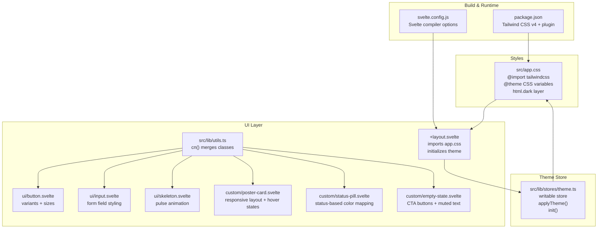
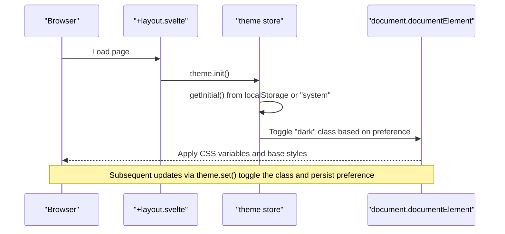
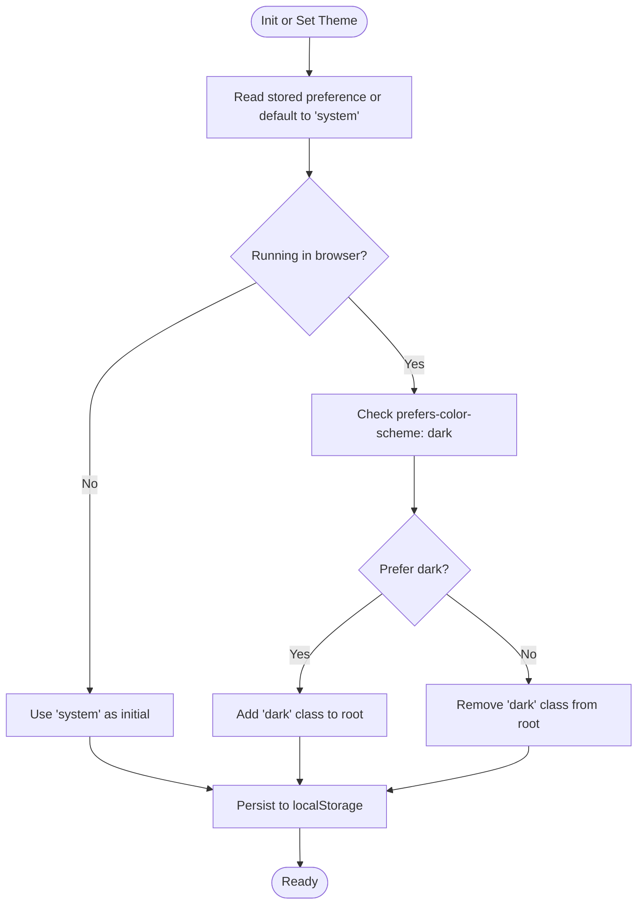
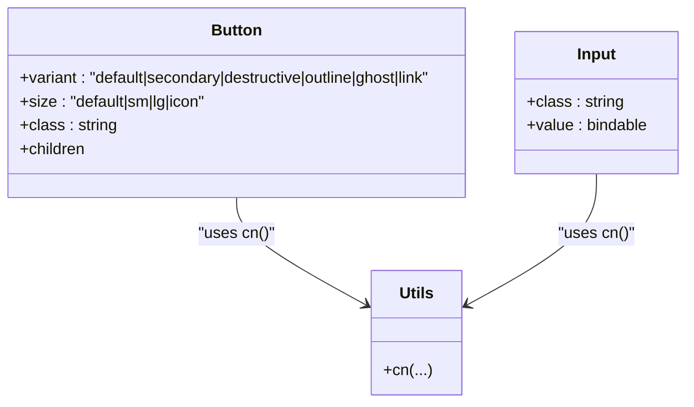
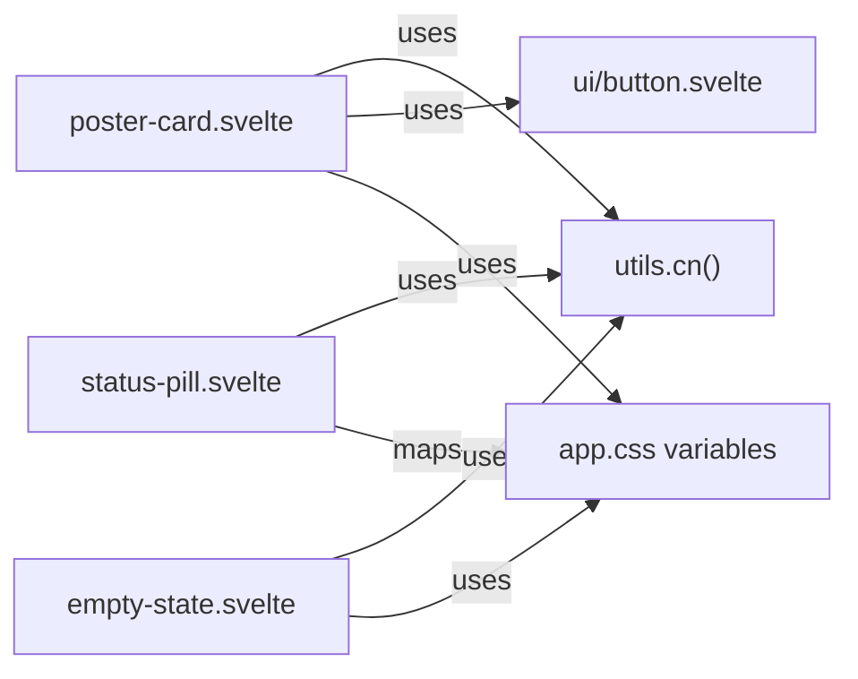
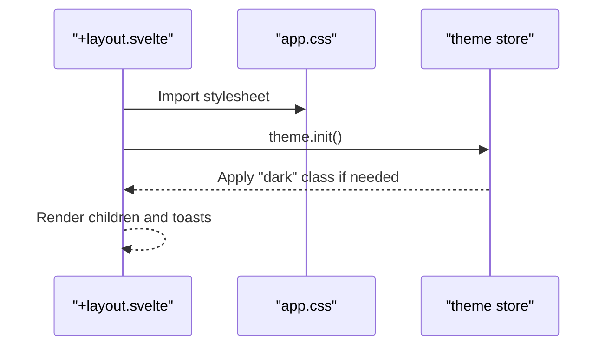
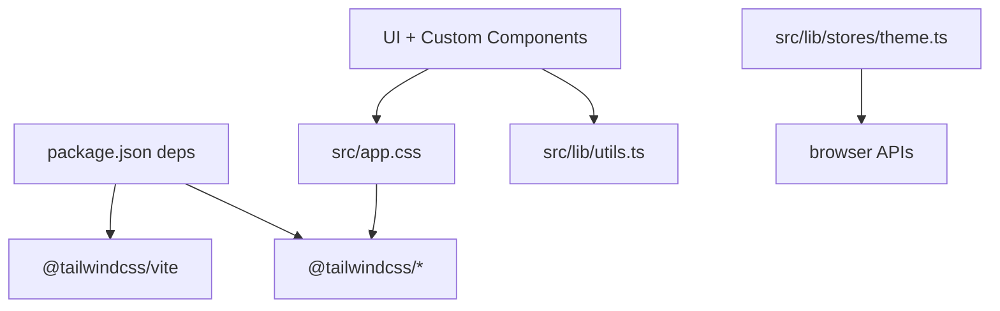

# Styling & Theming

<cite>
**Referenced Files in This Document**
- [src/app.css](file://src/app.css)
- [package.json](file://package.json)
- [svelte.config.js](file://svelte.config.js)
- [src/routes/+layout.svelte](file://src/routes/+layout.svelte)
- [src/lib/stores/theme.ts](file://src/lib/stores/theme.ts)
- [src/lib/utils.ts](file://src/lib/utils.ts)
- [src/lib/components/ui/button.svelte](file://src/lib/components/ui/button.svelte)
- [src/lib/components/ui/input.svelte](file://src/lib/components/ui/input.svelte)
- [src/lib/components/ui/skeleton.svelte](file://src/lib/components/ui/skeleton.svelte)
- [src/lib/components/custom/poster-card.svelte](file://src/lib/components/custom/poster-card.svelte)
- [src/lib/components/custom/status-pill.svelte](file://src/lib/components/custom/status-pill.svelte)
- [src/lib/components/custom/empty-state.svelte](file://src/lib/components/custom/empty-state.svelte)
</cite>

## Table of Contents
1. [Introduction](#introduction)
2. [Project Structure](#project-structure)
3. [Core Components](#core-components)
4. [Architecture Overview](#architecture-overview)
5. [Detailed Component Analysis](#detailed-component-analysis)
6. [Dependency Analysis](#dependency-analysis)
7. [Performance Considerations](#performance-considerations)
8. [Troubleshooting Guide](#troubleshooting-guide)
9. [Conclusion](#conclusion)
10. [Appendices](#appendices)

## Introduction
This document explains Screenlog’s styling and theming system. It covers Tailwind CSS integration, the utility-first approach, the theme system (including dark/light mode switching and system preference detection), CSS architecture, custom styles, responsive design patterns, component styling approaches, CSS variables usage, theme-aware styling, and the relationship between Svelte components and styling. It also provides guidelines for maintaining design consistency, creating reusable style patterns, and extending the theme system.

## Project Structure
Screenlog integrates Tailwind CSS v4 via the official Tailwind Vite plugin and defines a custom theme using CSS variables. Global styles are centralized in the application stylesheet, while component-level styles leverage Tailwind utilities and a shared utility function for merging classes. A Svelte store manages theme preferences and applies them to the document element.

**Diagram sources**
- [package.json:15-45](file://package.json#L15-L45)
- [svelte.config.js:1-18](file://svelte.config.js#L1-L18)
- [src/app.css:1-88](file://src/app.css#L1-L88)
- [src/routes/+layout.svelte:1-25](file://src/routes/+layout.svelte#L1-L25)
- [src/lib/stores/theme.ts:1-40](file://src/lib/stores/theme.ts#L1-L40)
- [src/lib/utils.ts:1-82](file://src/lib/utils.ts#L1-L82)
- [src/lib/components/ui/button.svelte:1-45](file://src/lib/components/ui/button.svelte#L1-L45)
- [src/lib/components/ui/input.svelte:1-16](file://src/lib/components/ui/input.svelte#L1-L16)
- [src/lib/components/ui/skeleton.svelte:1-8](file://src/lib/components/ui/skeleton.svelte#L1-L8)
- [src/lib/components/custom/poster-card.svelte:1-68](file://src/lib/components/custom/poster-card.svelte#L1-L68)
- [src/lib/components/custom/status-pill.svelte:1-32](file://src/lib/components/custom/status-pill.svelte#L1-L32)
- [src/lib/components/custom/empty-state.svelte:1-44](file://src/lib/components/custom/empty-state.svelte#L1-L44)

**Section sources**
- [package.json:15-45](file://package.json#L15-L45)
- [svelte.config.js:1-18](file://svelte.config.js#L1-L18)
- [src/app.css:1-88](file://src/app.css#L1-L88)
- [src/routes/+layout.svelte:1-25](file://src/routes/+layout.svelte#L1-L25)
- [src/lib/stores/theme.ts:1-40](file://src/lib/stores/theme.ts#L1-L40)
- [src/lib/utils.ts:1-82](file://src/lib/utils.ts#L1-L82)

## Core Components
- Tailwind CSS integration: Installed via the Tailwind Vite plugin and imported globally.
- Theme system: A Svelte store persists user preference, detects system preference, and toggles a class on the document element to switch themes.
- CSS architecture: Uses CSS variables defined under a Tailwind @theme block and layered styles for base resets and theme-specific overrides.
- Utility-first styling: Components compose Tailwind utilities with a shared cn() utility for safe class merging.
- Responsive patterns: Components use responsive prefixes and flexible layouts to adapt across breakpoints.

**Section sources**
- [package.json:30-42](file://package.json#L30-L42)
- [src/app.css:1-88](file://src/app.css#L1-L88)
- [src/lib/stores/theme.ts:14-35](file://src/lib/stores/theme.ts#L14-L35)
- [src/lib/utils.ts:4-6](file://src/lib/utils.ts#L4-L6)
- [src/lib/components/ui/button.svelte:17-31](file://src/lib/components/ui/button.svelte#L17-L31)

## Architecture Overview
The styling architecture centers on:
- Global stylesheet defining theme tokens and base layer styles.
- Theme store applying a “dark” class to the root element based on user/system preference.
- Components consuming Tailwind utilities and CSS variables for consistent, theme-aware rendering.

**Diagram sources**
- [src/routes/+layout.svelte:9-11](file://src/routes/+layout.svelte#L9-L11)
- [src/lib/stores/theme.ts:6-35](file://src/lib/stores/theme.ts#L6-L35)

## Detailed Component Analysis

### Theme Store and System Preference Detection
The theme store encapsulates:
- Initial theme resolution from localStorage or system preference.
- Applying the theme by toggling a class on the root element.
- Persisting the selected theme.

**Diagram sources**
- [src/lib/stores/theme.ts:7-35](file://src/lib/stores/theme.ts#L7-L35)

**Section sources**
- [src/lib/stores/theme.ts:1-40](file://src/lib/stores/theme.ts#L1-L40)

### Global Styles and CSS Variables (@theme)
The global stylesheet:
- Imports Tailwind utilities.
- Defines a @theme block with color tokens and radii.
- Provides base layer styles that vary by a “dark” class on the root element.
- Establishes default border, background, and text colors using CSS variables.

Key characteristics:
- Tokens are defined once and reused across components.
- Base layer switches variable sets depending on the presence of the “dark” class.
- Utilities like border-color, background-color, and text-color derive from variables.

**Section sources**
- [src/app.css:1-88](file://src/app.css#L1-L88)

### Utility Function for Class Merging (cn)
The cn utility:
- Merges Tailwind classes safely using a merge function.
- Prevents conflicts and duplicates when composing dynamic class lists.

Usage patterns:
- Buttons combine base utilities with variant and size classes.
- Inputs and skeletons merge base styles with optional overrides.

**Section sources**
- [src/lib/utils.ts:4-6](file://src/lib/utils.ts#L4-L6)
- [src/lib/components/ui/button.svelte:34-40](file://src/lib/components/ui/button.svelte#L34-L40)
- [src/lib/components/ui/input.svelte:8-15](file://src/lib/components/ui/input.svelte#L8-L15)
- [src/lib/components/ui/skeleton.svelte:7](file://src/lib/components/ui/skeleton.svelte#L7)

### UI Components: Button and Input
- Button:
  - Accepts variant and size props.
  - Composes base utilities with variant and size maps.
  - Uses CSS variables for colors and transitions.
- Input:
  - Inherits base form field styles.
  - Uses CSS variables for borders, backgrounds, and focus rings.

**Diagram sources**
- [src/lib/components/ui/button.svelte:1-45](file://src/lib/components/ui/button.svelte#L1-L45)
- [src/lib/components/ui/input.svelte:1-16](file://src/lib/components/ui/input.svelte#L1-L16)
- [src/lib/utils.ts:4-6](file://src/lib/utils.ts#L4-L6)

**Section sources**
- [src/lib/components/ui/button.svelte:17-31](file://src/lib/components/ui/button.svelte#L17-L31)
- [src/lib/components/ui/button.svelte:34-40](file://src/lib/components/ui/button.svelte#L34-L40)
- [src/lib/components/ui/input.svelte:8-15](file://src/lib/components/ui/input.svelte#L8-L15)

### Custom Components: Poster Card, Status Pill, Empty State
- Poster Card:
  - Responsive vertical stack with aspect-ratio image area.
  - Conditional overlay button with opacity transitions on hover.
  - Uses CSS variables for backgrounds and muted text.
- Status Pill:
  - Maps status values to color classes.
  - Uses CSS variables for background and foreground colors.
- Empty State:
  - Centered layout with optional icon and call-to-action links.
  - Uses primary and secondary button styles composed with Tailwind utilities.

**Diagram sources**
- [src/lib/components/custom/poster-card.svelte:29-67](file://src/lib/components/custom/poster-card.svelte#L29-L67)
- [src/lib/components/custom/status-pill.svelte:6-15](file://src/lib/components/custom/status-pill.svelte#L6-L15)
- [src/lib/components/custom/empty-state.svelte:23-43](file://src/lib/components/custom/empty-state.svelte#L23-L43)
- [src/lib/utils.ts:4-6](file://src/lib/utils.ts#L4-L6)
- [src/app.css:1-88](file://src/app.css#L1-L88)

**Section sources**
- [src/lib/components/custom/poster-card.svelte:29-67](file://src/lib/components/custom/poster-card.svelte#L29-L67)
- [src/lib/components/custom/status-pill.svelte:6-15](file://src/lib/components/custom/status-pill.svelte#L6-L15)
- [src/lib/components/custom/empty-state.svelte:23-43](file://src/lib/components/custom/empty-state.svelte#L23-L43)

### Layout Integration and Initialization
The root layout:
- Imports the global stylesheet.
- Initializes the theme store on mount.
- Renders notifications via a toast component.

**Diagram sources**
- [src/routes/+layout.svelte:2-24](file://src/routes/+layout.svelte#L2-L24)
- [src/lib/stores/theme.ts:33-35](file://src/lib/stores/theme.ts#L33-L35)

**Section sources**
- [src/routes/+layout.svelte:1-25](file://src/routes/+layout.svelte#L1-L25)

## Dependency Analysis
- Tailwind CSS v4 is integrated via the Tailwind Vite plugin and included in dependencies.
- The theme store depends on browser APIs for media queries and localStorage.
- Components depend on the cn utility for class composition and on CSS variables for theme-aware colors.

**Diagram sources**
- [package.json:30-42](file://package.json#L30-L42)
- [src/app.css:1-88](file://src/app.css#L1-L88)
- [src/lib/stores/theme.ts:14-24](file://src/lib/stores/theme.ts#L14-L24)
- [src/lib/utils.ts:4-6](file://src/lib/utils.ts#L4-L6)

**Section sources**
- [package.json:30-42](file://package.json#L30-L42)
- [src/lib/stores/theme.ts:14-24](file://src/lib/stores/theme.ts#L14-L24)
- [src/lib/utils.ts:4-6](file://src/lib/utils.ts#L4-L6)

## Performance Considerations
- Prefer Tailwind utilities over ad-hoc CSS to reduce bundle size and maintain consistency.
- Use the cn utility to avoid redundant class declarations and minimize reflows.
- Keep CSS variables centralized to limit cascade complexity and improve theme switching performance.
- Avoid excessive nesting in Svelte components; prefer flat, utility-driven compositions.

## Troubleshooting Guide
- Theme not applying on first load:
  - Verify the theme store initializes and toggles the “dark” class on the root element.
  - Confirm the base layer in the stylesheet targets the “dark” class correctly.
- Theme preference not persisting:
  - Ensure localStorage is available and readable in the browser context.
  - Check that the store writes the preference after initialization.
- Unexpected color or contrast:
  - Inspect the CSS variable assignments in the @theme block and base layer.
  - Confirm components use variables (e.g., background, foreground, border) rather than hardcoded values.

**Section sources**
- [src/lib/stores/theme.ts:14-35](file://src/lib/stores/theme.ts#L14-L35)
- [src/app.css:37-87](file://src/app.css#L37-L87)

## Conclusion
Screenlog’s styling system combines Tailwind CSS v4 with a centralized theme built on CSS variables and a Svelte store. The theme store respects user choice and system preference, toggling a single class on the root element to switch between light and dark palettes. Components adopt a utility-first approach, leveraging a shared cn utility and CSS variables to remain consistent and theme-aware. This architecture enables scalable, maintainable styling and a smooth theming experience.

## Appendices

### Guidelines for Maintaining Design Consistency
- Centralize tokens in the @theme block and consume them via CSS variables.
- Use the cn utility for composing component classes.
- Prefer variant and size maps for UI primitives to enforce uniform behavior.
- Keep base layer styles minimal and rely on variables for theme switching.

### Creating Reusable Style Patterns
- Define consistent variants and sizes for interactive components.
- Encapsulate common layouts (e.g., centered content, grid gaps) with utility classes.
- Use semantic status mappings (as seen in the status pill) to keep color choices consistent.

### Extending the Theme System
- Add new CSS variables under @theme for additional roles (e.g., “card”, “sidebar”).
- Extend the base layer to adjust variables per theme.
- Introduce new variants in component prop maps and update the cn composition accordingly.