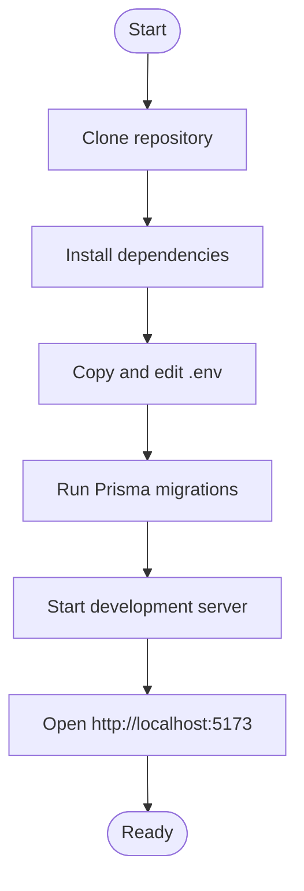
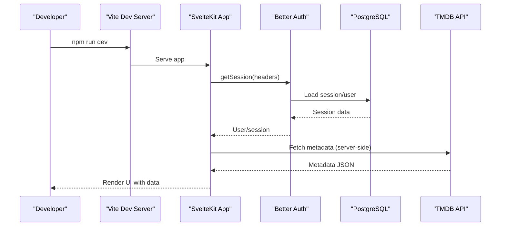
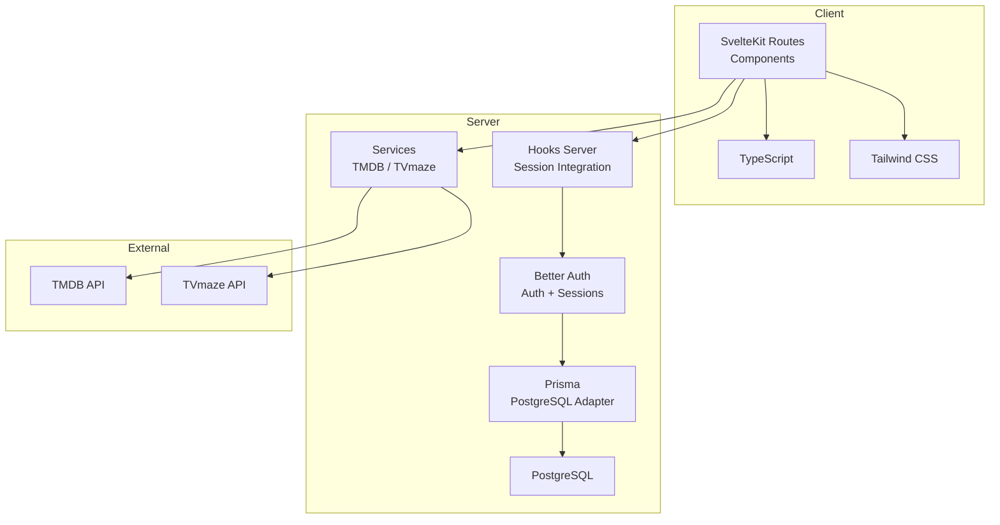

# Getting Started

<cite>
**Referenced Files in This Document**
- [README.md](file://README.md)
- [package.json](file://package.json)
- [prisma/schema.prisma](file://prisma/schema.prisma)
- [src/lib/server/auth.ts](file://src/lib/server/auth.ts)
- [src/lib/services/tmdb.ts](file://src/lib/services/tmdb.ts)
- [src/lib/services/tvmaze.ts](file://src/lib/services/tvmaze.ts)
- [src/hooks.server.ts](file://src/hooks.server.ts)
- [svelte.config.js](file://svelte.config.js)
- [vite.config.ts](file://vite.config.ts)
- [tsconfig.json](file://tsconfig.json)
</cite>

## Table of Contents
1. [Introduction](#introduction)
2. [System Requirements](#system-requirements)
3. [Prerequisites](#prerequisites)
4. [Installation Steps](#installation-steps)
5. [Environment Variables](#environment-variables)
6. [Development Workflow](#development-workflow)
7. [Architecture Overview](#architecture-overview)
8. [Troubleshooting Guide](#troubleshooting-guide)
9. [Conclusion](#conclusion)

## Introduction
Screenlog is a modern, mobile-first watch tracker for TV shows, movies, and anime. It provides features such as episode tracking, calendar views, discovery feeds, and user profiles, built with SvelteKit, TypeScript, Better Auth, Prisma, and the TMDB/TVmaze APIs.

This guide focuses on rapid onboarding: prerequisites, installation, environment configuration, and running the development server. It also includes troubleshooting tips and recommended IDE setup to help you get productive quickly.

## System Requirements
- Operating system: macOS, Linux, or Windows
- RAM: Minimum 8 GB recommended for smooth development experience
- Disk space: ~500 MB for dependencies plus database storage
- Network: Internet access for downloading dependencies and accessing TMDB/TVmaze APIs

## Prerequisites
Before installing Screenlog, ensure you have:
- Node.js 20 or newer
- A PostgreSQL-compatible database (PostgreSQL 12+ recommended; the project targets Prisma’s PostgreSQL provider)
- A TMDB API key for metadata retrieval
- Optional: A TVmaze API key for episode data (not required; TMDB is primary)

Notes:
- The project uses Prisma with PostgreSQL and Better Auth for authentication.
- The README documents the prerequisites and environment variables.

**Section sources**
- [README.md:29-34](file://README.md#L29-L34)

## Installation Steps
Follow these steps to set up Screenlog locally:

1. Clone the repository
   - Use your preferred Git client or command line to clone the repository and navigate into the project directory.

2. Install dependencies
   - Run the package manager install script to fetch all required packages.

3. Configure environment variables
   - Copy the example environment file to create your local .env.
   - Edit .env to add your credentials for the database, Better Auth, and TMDB.

4. Initialize the database
   - Run Prisma migrations to set up the schema in your database.

5. Start the development server
   - Launch the Vite-powered development server and open the app in your browser.

6. Verify the setup
   - Visit http://localhost:5173 to confirm the app loads and you can sign in.

**Section sources**
- [README.md:35-71](file://README.md#L35-L71)
- [package.json:7-14](file://package.json#L7-L14)

## Environment Variables
Configure the following environment variables in your .env file:

- DATABASE_URL: PostgreSQL connection string used by Prisma
- BETTER_AUTH_SECRET: Secret used by Better Auth for secure sessions
- BETTER_AUTH_URL: Base URL of your application (used for redirects and cookies)
- TMDB_API_KEY: Your TMDB API read access token
- TVMAZE_API_KEY: Optional; TVmaze API key if you intend to use TVmaze-specific features

Notes:
- These variables are referenced by the application at runtime.
- The README provides a concise list of variables and their purpose.

**Section sources**
- [README.md:73-82](file://README.md#L73-L82)
- [src/lib/server/auth.ts:4](file://src/lib/server/auth.ts#L4)
- [src/lib/services/tmdb.ts:1](file://src/lib/services/tmdb.ts#L1)

## Development Workflow
Recommended workflow for local development:

- Start the dev server
  - Use the configured script to launch the development server.

- Iterate on features
  - Modify Svelte components under src/routes and shared logic under src/lib.
  - Use TypeScript for type-safe development.

- Database schema changes
  - After editing Prisma schema, run migrations to update the database.

- Authentication and sessions
  - Better Auth manages user sessions and authentication. Hooks integrate session data into requests.

- Styling and UI
  - Tailwind CSS is integrated via Vite and SvelteKit; use utility classes for responsive UI.

- External APIs
  - TMDB and TVmaze are accessed server-side to keep API keys private.

**Section sources**
- [README.md:83-89](file://README.md#L83-L89)
- [src/hooks.server.ts:4-17](file://src/hooks.server.ts#L4-L17)
- [src/lib/server/auth.ts:6-24](file://src/lib/server/auth.ts#L6-L24)
- [vite.config.ts:1-8](file://vite.config.ts#L1-L8)
- [svelte.config.js:1-18](file://svelte.config.js#L1-L18)
- [tsconfig.json:1-21](file://tsconfig.json#L1-L21)

## Architecture Overview
High-level components and their roles:

- Frontend
  - SvelteKit routes and components render the UI.
  - TypeScript enforces type safety.
  - Tailwind CSS provides styling.

- Backend
  - Better Auth handles authentication and session management.
  - Prisma connects to PostgreSQL and manages schema and queries.
  - Server-side API endpoints integrate with TMDB and TVmaze.

- External Services
  - TMDB API supplies show/movie metadata.
  - TVmaze API supplies episode data (optional).

**Diagram sources**
- [src/hooks.server.ts:1-18](file://src/hooks.server.ts#L1-L18)
- [src/lib/server/auth.ts:1-27](file://src/lib/server/auth.ts#L1-L27)
- [prisma/schema.prisma:1-8](file://prisma/schema.prisma#L1-L8)
- [src/lib/services/tmdb.ts:1-167](file://src/lib/services/tmdb.ts#L1-L167)
- [src/lib/services/tvmaze.ts:1-24](file://src/lib/services/tvmaze.ts#L1-L24)

## Troubleshooting Guide
Common setup issues and resolutions:

- Node.js version mismatch
  - Symptom: Errors during install or runtime related to unsupported syntax.
  - Resolution: Upgrade to Node.js 20 or newer.

- PostgreSQL connectivity errors
  - Symptom: Migration or runtime errors indicating database connection failures.
  - Resolution: Verify DATABASE_URL format and connectivity; ensure the database server is reachable and accepts connections.

- Better Auth session errors
  - Symptom: Redirect loops or session loading failures.
  - Resolution: Confirm BETTER_AUTH_SECRET and BETTER_AUTH_URL match your environment and CORS/trusted origins are correctly set.

- TMDB API key invalid or missing
  - Symptom: API calls fail with unauthorized or invalid key errors.
  - Resolution: Obtain a valid TMDB API key and set TMDB_API_KEY in .env.

- Port already in use
  - Symptom: Dev server fails to start due to port conflict.
  - Resolution: Stop the conflicting process or configure Vite to use another port.

- Prisma client generation issues
  - Symptom: Missing client or runtime errors after schema changes.
  - Resolution: Reinstall dependencies and re-run migrations.

- TypeScript errors
  - Symptom: Type checking failures.
  - Resolution: Use the provided check script to diagnose and fix type issues.

**Section sources**
- [README.md:29-34](file://README.md#L29-L34)
- [README.md:73-82](file://README.md#L73-L82)
- [src/lib/server/auth.ts:4](file://src/lib/server/auth.ts#L4)
- [src/lib/services/tmdb.ts:14-17](file://src/lib/services/tmdb.ts#L14-L17)
- [package.json:12-13](file://package.json#L12-L13)

## Conclusion
You now have the essentials to install, configure, and run Screenlog locally. Use the steps above to clone, install, configure environment variables, initialize the database, and start the development server. Refer to the troubleshooting section if you encounter issues. For advanced topics like building for production or deploying, consult the project’s scripts and configuration files.