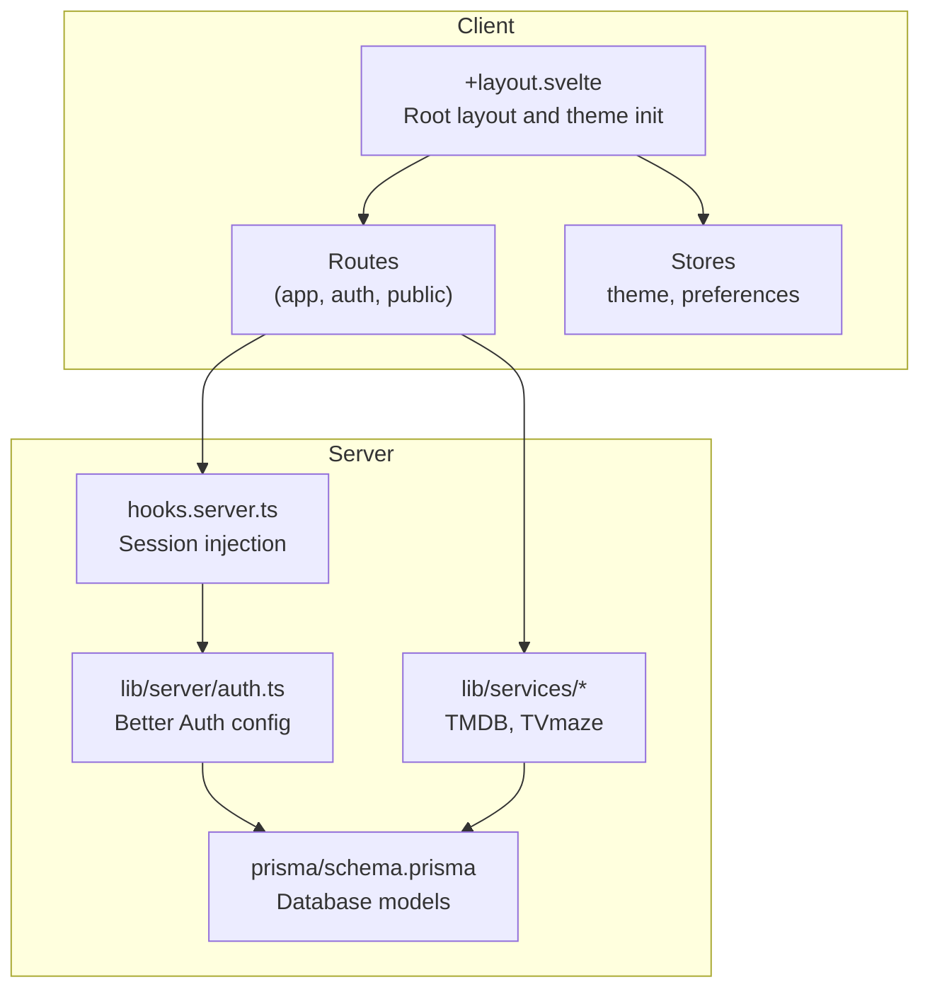
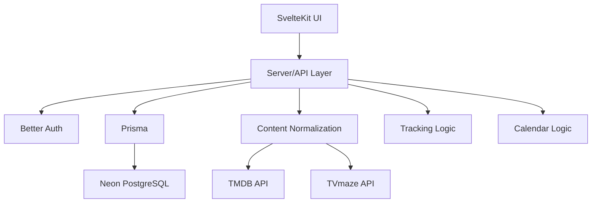
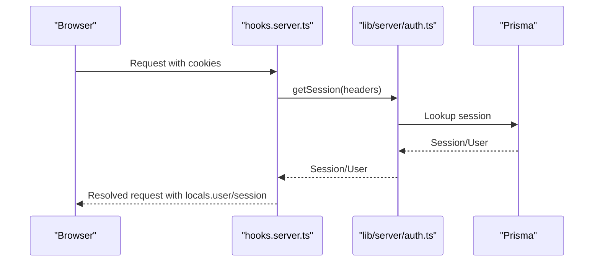
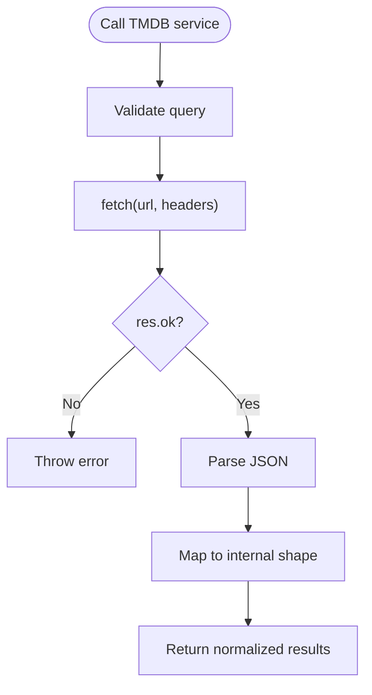
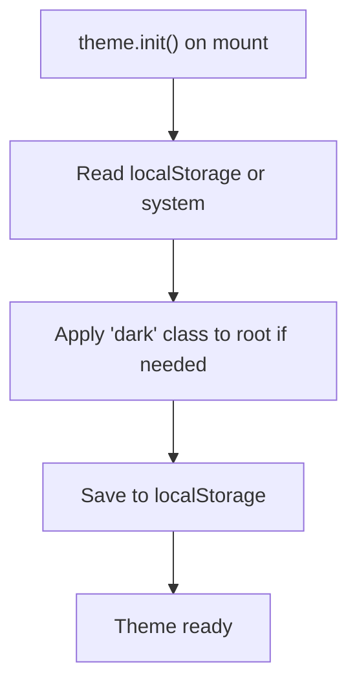
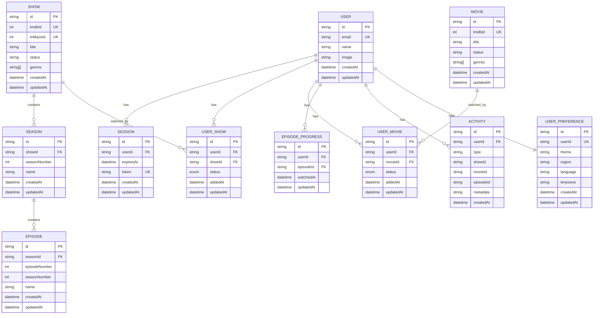
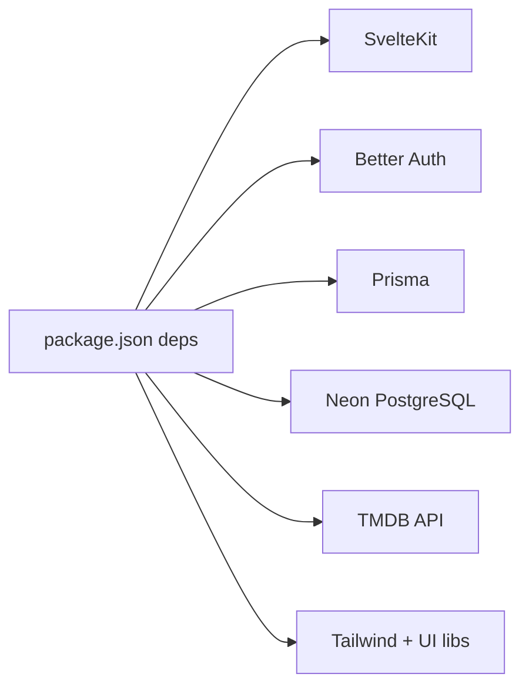

# Project Overview

<cite>
**Referenced Files in This Document**
- [README.md](file://README.md)
- [DESIGN.MD](file://DESIGN.MD)
- [SPEC.MD](file://SPEC.MD)
- [package.json](file://package.json)
- [prisma/schema.prisma](file://prisma/schema.prisma)
- [src/hooks.server.ts](file://src/hooks.server.ts)
- [src/lib/server/auth.ts](file://src/lib/server/auth.ts)
- [src/lib/services/tmdb.ts](file://src/lib/services/tmdb.ts)
- [src/lib/stores/theme.ts](file://src/lib/stores/theme.ts)
- [src/lib/stores/preferences.ts](file://src/lib/stores/preferences.ts)
- [src/routes/+layout.svelte](file://src/routes/+layout.svelte)
</cite>

## Table of Contents
1. [Introduction](#introduction)
2. [Project Structure](#project-structure)
3. [Core Components](#core-components)
4. [Architecture Overview](#architecture-overview)
5. [Detailed Component Analysis](#detailed-component-analysis)
6. [Dependency Analysis](#dependency-analysis)
7. [Performance Considerations](#performance-considerations)
8. [Troubleshooting Guide](#troubleshooting-guide)
9. [Conclusion](#conclusion)

## Introduction
Screenlog is a modern, mobile-first watch tracking application designed to help users organize, track, and discover TV shows, movies, and anime. Its purpose is to provide a fast, cinematic, and personal experience that centers around the core habit loop: search content → add to watchlist → track progress → see what to watch next → mark watched → review upcoming releases → discover more content. The platform emphasizes instant actions, mobile-native feel, poster-driven visuals, and a clean, minimal aesthetic that feels premium and content-first.

Key differentiators:
- Mobile-first design with bottom navigation on mobile and adaptive desktop layouts
- Server-side-only external API access to protect secrets and normalize content
- Built-in theme system (system, dark, light) with persistent preferences
- Integrated authentication via Better Auth with secure sessions
- Structured layers separating UI, server/API, content integration, tracking logic, and persistence

Target audience:
- New users needing a guided onboarding to quickly add their first content
- Active trackers who want fast access to next episodes, upcoming releases, and progress controls
- Casual users who want a simple watchlist and discovery experience

**Section sources**
- [README.md:1-15](file://README.md#L1-L15)
- [SPEC.MD:3-28](file://SPEC.MD#L3-L28)
- [DESIGN.MD:29-45](file://DESIGN.MD#L29-L45)

## Project Structure
The project is organized as a SvelteKit full-stack application with clear separation of concerns:
- UI and routing live under src/routes
- Server-only logic and authentication under src/lib/server
- External API integrations under src/lib/services
- Shared stores and utilities under src/lib/stores
- Database schema under prisma/schema.prisma
- Root-level configuration files define the tech stack and environment variables

**Diagram sources**
- [src/routes/+layout.svelte:1-25](file://src/routes/+layout.svelte#L1-L25)
- [src/hooks.server.ts:1-18](file://src/hooks.server.ts#L1-L18)
- [src/lib/server/auth.ts:1-27](file://src/lib/server/auth.ts#L1-L27)
- [src/lib/services/tmdb.ts:1-167](file://src/lib/services/tmdb.ts#L1-L167)
- [prisma/schema.prisma:1-258](file://prisma/schema.prisma#L1-L258)

**Section sources**
- [README.md:90-110](file://README.md#L90-L110)
- [SPEC.MD:30-48](file://SPEC.MD#L30-L48)

## Core Components
- Authentication and session management via Better Auth with secure cookie handling and session lifetimes
- Content integration layer wrapping TMDB and TVmaze APIs with normalized responses and caching-ready models
- Theme system with persistent storage and system preference detection
- Database models for users, sessions, content metadata, watchlist relationships, episode progress, and user preferences
- Server hooks that inject session context into all requests

Practical examples:
- Onboarding flow: welcome → interests → add first titles → set initial progress → continue to Home
- Tracking workflow: mark episode watched → immediate UI update → progress recalculated → “Watch Next” updated
- Discovery workflow: browse trending/popular/top-rated → add to watchlist → view detail → adjust status

**Section sources**
- [SPEC.MD:151-243](file://SPEC.MD#L151-L243)
- [SPEC.MD:485-520](file://SPEC.MD#L485-L520)
- [SPEC.MD:626-675](file://SPEC.MD#L626-L675)
- [DESIGN.MD:475-497](file://DESIGN.MD#L475-L497)
- [DESIGN.MD:355-420](file://DESIGN.MD#L355-L420)

## Architecture Overview
Screenlog follows a layered architecture:
- UI Layer: SvelteKit pages/components, Tailwind CSS, and UI component libraries
- Server/API Layer: SvelteKit server routes handling auth-protected operations, search, watchlist actions, progress updates, discovery, calendar, and profile
- Content Integration Layer: Server-only calls to TMDB and TVmaze, with response normalization and caching strategies
- Tracking Logic Layer: Business logic for watchlist state, episode progress, next episode calculation, and stats
- Persistence Layer: Prisma models mapped to Neon PostgreSQL, including user accounts, sessions, content metadata, relationships, and preferences

**Diagram sources**
- [DESIGN.MD:243-274](file://DESIGN.MD#L243-L274)
- [DESIGN.MD:277-352](file://DESIGN.MD#L277-L352)

**Section sources**
- [DESIGN.MD:243-274](file://DESIGN.MD#L243-L274)
- [DESIGN.MD:277-352](file://DESIGN.MD#L277-L352)

## Detailed Component Analysis

### Authentication and Session Management
- Better Auth configured with Prisma adapter, secure session cookies, and trusted origins aligned with the base URL
- Server hook injects session and user into locals for protected routes
- Email/password enabled with auto sign-in and session lifetime management

**Diagram sources**
- [src/hooks.server.ts:1-18](file://src/hooks.server.ts#L1-L18)
- [src/lib/server/auth.ts:1-27](file://src/lib/server/auth.ts#L1-L27)

**Section sources**
- [src/lib/server/auth.ts:1-27](file://src/lib/server/auth.ts#L1-L27)
- [src/hooks.server.ts:1-18](file://src/hooks.server.ts#L1-L18)

### Content Integration (TMDB)
- Server-only module wraps TMDB API calls with typed responses and normalized structures
- Supports search, show details, season/episode listings, and discovery endpoints
- Enforces API key security by keeping it server-side

**Diagram sources**
- [src/lib/services/tmdb.ts:1-167](file://src/lib/services/tmdb.ts#L1-L167)

**Section sources**
- [src/lib/services/tmdb.ts:1-167](file://src/lib/services/tmdb.ts#L1-L167)

### Theme System and Preferences
- Persistent theme store with system preference detection and localStorage persistence
- Root class toggling to apply dark mode
- User timezone store for localized calendar and activity handling

**Diagram sources**
- [src/lib/stores/theme.ts:1-40](file://src/lib/stores/theme.ts#L1-L40)
- [src/lib/stores/preferences.ts:1-4](file://src/lib/stores/preferences.ts#L1-L4)
- [src/routes/+layout.svelte:1-25](file://src/routes/+layout.svelte#L1-L25)

**Section sources**
- [src/lib/stores/theme.ts:1-40](file://src/lib/stores/theme.ts#L1-L40)
- [src/lib/stores/preferences.ts:1-4](file://src/lib/stores/preferences.ts#L1-L4)
- [src/routes/+layout.svelte:1-25](file://src/routes/+layout.svelte#L1-L25)

### Database Schema Highlights
- User, Session, Account, Verification for Better Auth
- Content models: Show, Season, Episode, Movie
- User relationships: UserShow, UserMovie for watchlist and status
- EpisodeProgress for watched state
- Activity for user activity history
- UserPreference for theme and locale settings

**Diagram sources**
- [prisma/schema.prisma:10-258](file://prisma/schema.prisma#L10-L258)

**Section sources**
- [prisma/schema.prisma:10-258](file://prisma/schema.prisma#L10-L258)

## Dependency Analysis
- Tech stack: SvelteKit, TypeScript, Better Auth, Prisma, Neon PostgreSQL, TMDB API, TVmaze API, Tailwind CSS, UI component libraries
- External dependencies are declared in package.json; server-only modules prevent exposure of API keys to the client
- Database models define relationships between users, content, progress, and preferences

**Diagram sources**
- [package.json:15-45](file://package.json#L15-L45)

**Section sources**
- [package.json:15-45](file://package.json#L15-L45)
- [SPEC.MD:30-48](file://SPEC.MD#L30-L48)

## Performance Considerations
- Prefer server-side API calls to avoid exposing secrets and reduce client-side complexity
- Normalize and cache content where appropriate to minimize repeated external requests
- Keep UI updates optimistic with controlled fallbacks to maintain perceived speed
- Use responsive layouts and efficient grids to maintain smooth interactions on mobile devices

## Troubleshooting Guide
Common issues and resolutions:
- Authentication failures: Verify Better Auth secret and base URL environment variables; ensure trusted origins include the app URL
- Missing external API data: Confirm TMDB API key is set and server-only; check normalized response mapping
- Theme not applying: Ensure theme initialization runs on the client and localStorage is accessible
- Database migration errors: Run Prisma migrations and confirm DATABASE_URL connectivity

**Section sources**
- [README.md:73-82](file://README.md#L73-L82)
- [src/lib/server/auth.ts:4-24](file://src/lib/server/auth.ts#L4-L24)
- [src/lib/services/tmdb.ts:1-17](file://src/lib/services/tmdb.ts#L1-L17)
- [src/lib/stores/theme.ts:14-35](file://src/lib/stores/theme.ts#L14-L35)

## Conclusion
Screenlog delivers a polished, mobile-first watch tracking experience centered on simplicity and speed. Its layered architecture, strict server-side API access, and thoughtful UX principles enable users to quickly build meaningful watchlists, track progress with instant feedback, and discover new content. The combination of a robust tech stack, clear data models, and a coherent design system positions the project strongly for iterative growth while maintaining a premium, content-driven feel.