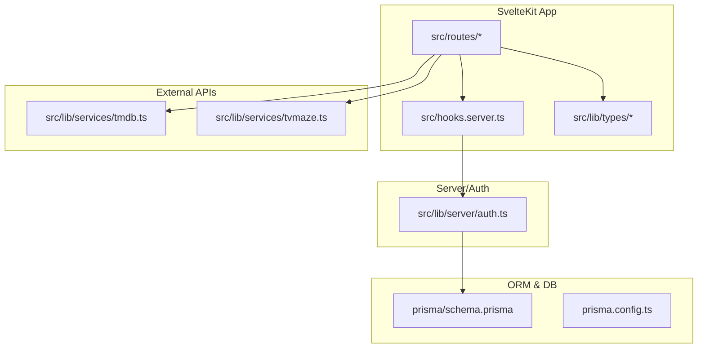
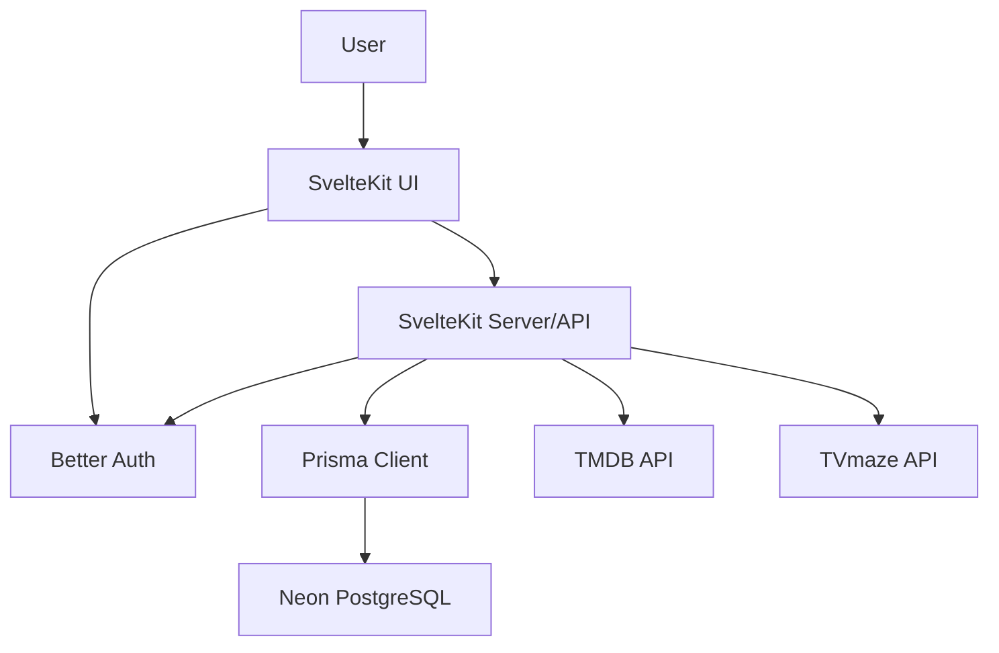
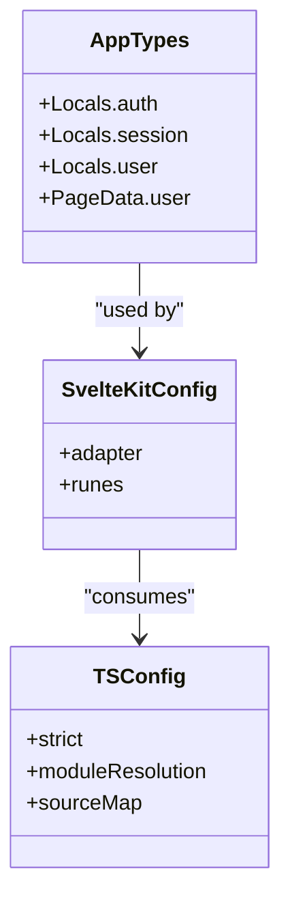
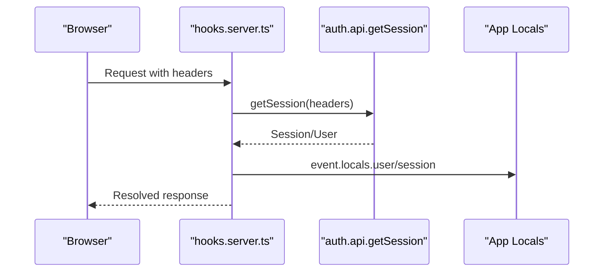
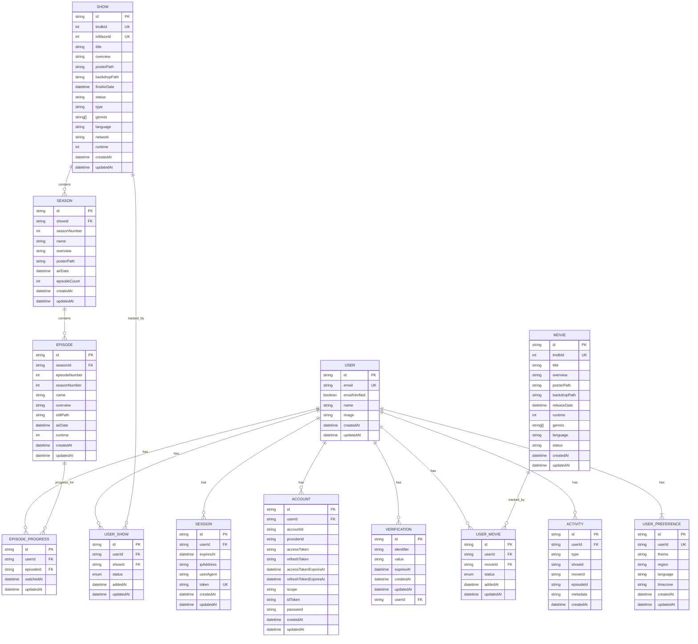
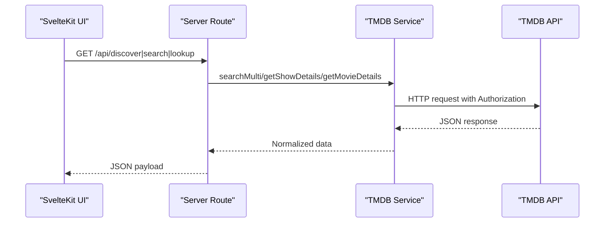
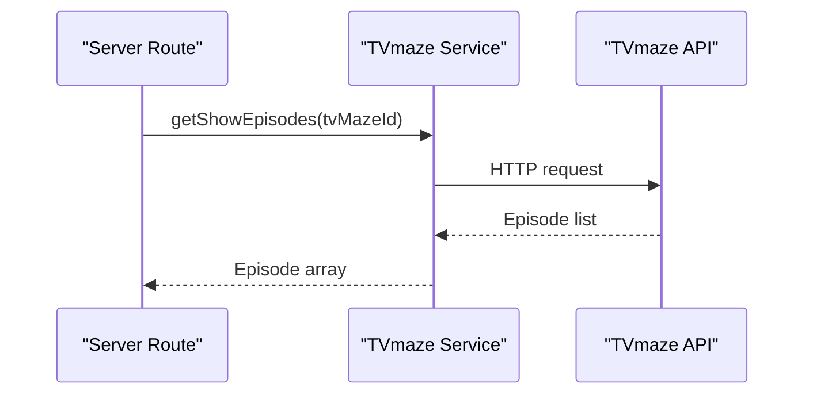
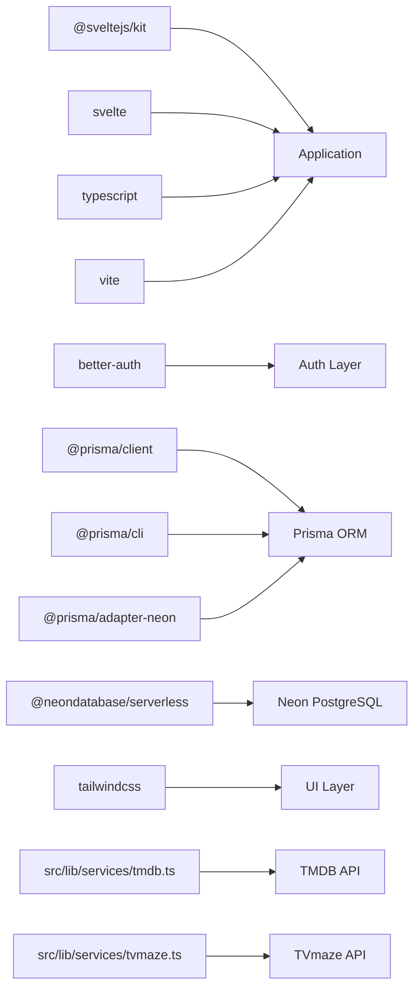

# Technology Stack & Dependencies

<cite>
**Referenced Files in This Document**
- [package.json](file://package.json)
- [svelte.config.js](file://svelte.config.js)
- [tsconfig.json](file://tsconfig.json)
- [src/app.d.ts](file://src/app.d.ts)
- [prisma/schema.prisma](file://prisma/schema.prisma)
- [prisma.config.ts](file://prisma.config.ts)
- [src/lib/server/auth.ts](file://src/lib/server/auth.ts)
- [src/hooks.server.ts](file://src/hooks.server.ts)
- [src/lib/services/tmdb.ts](file://src/lib/services/tmdb.ts)
- [src/lib/services/tvmaze.ts](file://src/lib/services/tvmaze.ts)
- [src/lib/types/content.ts](file://src/lib/types/content.ts)
- [DESIGN.MD](file://DESIGN.MD)
</cite>

## Table of Contents
1. [Introduction](#introduction)
2. [Project Structure](#project-structure)
3. [Core Components](#core-components)
4. [Architecture Overview](#architecture-overview)
5. [Detailed Component Analysis](#detailed-component-analysis)
6. [Dependency Analysis](#dependency-analysis)
7. [Performance Considerations](#performance-considerations)
8. [Troubleshooting Guide](#troubleshooting-guide)
9. [Conclusion](#conclusion)
10. [Appendices](#appendices)

## Introduction
This document provides a comprehensive technology stack and dependency guide for Screenlog. It explains the full-stack ecosystem, including SvelteKit as the framework, TypeScript for type safety, Better Auth for authentication, Prisma ORM for database operations, and Neon PostgreSQL for scalable database hosting. It also covers Tailwind CSS for styling, TMDB API integration for movie/TV metadata, and TVmaze API for episode data. Version compatibility requirements, dependency relationships, and architectural rationale are documented alongside upgrade guidance and replacement options for each component.

## Project Structure
Screenlog is organized as a SvelteKit application with a clear separation between UI, server/API, content integration, and persistence layers. The repository includes:
- Frontend and routing under src/routes
- Server hooks and authentication under src/lib/server
- Prisma schema and configuration under prisma
- Shared content types under src/lib/types
- External API services under src/lib/services

**Diagram sources**
- [svelte.config.js:1-18](file://svelte.config.js#L1-L18)
- [src/hooks.server.ts:1-18](file://src/hooks.server.ts#L1-L18)
- [src/lib/server/auth.ts:1-27](file://src/lib/server/auth.ts#L1-L27)
- [prisma/schema.prisma:1-258](file://prisma/schema.prisma#L1-L258)
- [prisma.config.ts:1-15](file://prisma.config.ts#L1-L15)
- [src/lib/services/tmdb.ts:1-166](file://src/lib/services/tmdb.ts#L1-L166)
- [src/lib/services/tvmaze.ts:1-23](file://src/lib/services/tvmaze.ts#L1-L23)

**Section sources**
- [DESIGN.MD:243-274](file://DESIGN.MD#L243-L274)
- [svelte.config.js:1-18](file://svelte.config.js#L1-L18)

## Core Components
This section documents each core technology, its role, version compatibility, and integration points.

- SvelteKit
  - Role: Full-stack framework handling routing, server-side logic, and UI rendering.
  - Version compatibility: SvelteKit v2.x with Svelte v5+.
  - Integration: Adapter-auto for deployment, TypeScript support via tsconfig.json, and server hooks for auth/session injection.
  - Upgrade guidance: Align SvelteKit and Svelte major versions; keep vite and plugin versions current.

- TypeScript
  - Role: Static typing for safer development and better DX.
  - Configuration: Strict mode enabled, bundler module resolution, and SvelteKit tsconfig extension.
  - Upgrade guidance: Increment TypeScript major versions cautiously; verify SvelteKit and plugin compatibility.

- Better Auth
  - Role: Authentication and session management with email/password and secure cookie handling.
  - Integration: Server hook injects session/user into locals; Prisma adapter used for persistence.
  - Upgrade guidance: Follow Better Auth release notes; ensure adapter compatibility with Prisma major versions.

- Prisma ORM
  - Role: Database client and schema management; generates type-safe queries.
  - Schema: Defines user, session, account, verification, content (show/movie), progress, and preference models.
  - Integration: Used by Better Auth adapter and application services; Neon adapter configured.
  - Upgrade guidance: Keep Prisma client and adapter versions aligned; review migration strategy for breaking changes.

- Neon PostgreSQL
  - Role: Scalable, serverless Postgres hosting; connected via Prisma adapter.
  - Integration: DATABASE_URL environment variable drives connection; adapter configured in Prisma config.
  - Upgrade guidance: Monitor Neon service upgrades; test connection and migration scripts post-upgrade.

- Tailwind CSS
  - Role: Utility-first CSS framework for rapid UI development.
  - Integration: Vite plugin configured; used across components and pages.
  - Upgrade guidance: Review Tailwind v4 breaking changes; update plugins and purge paths accordingly.

- TMDB API
  - Role: Movie/TV metadata (search, trending, popular, top rated, details).
  - Integration: Server-side service with bearer token; returns normalized types.
  - Upgrade guidance: Respect API rate limits; handle 429/5xx gracefully; update endpoints per TMDB changes.

- TVmaze API
  - Role: Episode data and show episode lists.
  - Integration: Server-side service; used for episode refresh in calendar logic.
  - Upgrade guidance: Handle partial/missing episode data; cache where appropriate.

**Section sources**
- [package.json:15-45](file://package.json#L15-L45)
- [tsconfig.json:1-21](file://tsconfig.json#L1-L21)
- [svelte.config.js:1-18](file://svelte.config.js#L1-L18)
- [src/app.d.ts:1-23](file://src/app.d.ts#L1-L23)
- [src/lib/server/auth.ts:1-27](file://src/lib/server/auth.ts#L1-L27)
- [src/hooks.server.ts:1-18](file://src/hooks.server.ts#L1-L18)
- [prisma/schema.prisma:1-258](file://prisma/schema.prisma#L1-L258)
- [prisma.config.ts:1-15](file://prisma.config.ts#L1-L15)
- [src/lib/services/tmdb.ts:1-166](file://src/lib/services/tmdb.ts#L1-L166)
- [src/lib/services/tvmaze.ts:1-23](file://src/lib/services/tvmaze.ts#L1-L23)
- [DESIGN.MD:9-25](file://DESIGN.MD#L9-L25)

## Architecture Overview
Screenlog follows a layered architecture:
- UI Layer: SvelteKit with Tailwind CSS, shadcn-svelte, Bits UI, and Lucide Svelte.
- Server/API Layer: SvelteKit server routes and hooks.
- Content Integration Layer: TMDB and TVmaze APIs accessed server-side.
- Tracking Logic Layer: Business logic for watchlist, progress, and calendar.
- Persistence Layer: Better Auth and application data via Prisma and Neon.

**Diagram sources**
- [DESIGN.MD:243-274](file://DESIGN.MD#L243-L274)
- [src/lib/server/auth.ts:1-27](file://src/lib/server/auth.ts#L1-L27)
- [prisma/schema.prisma:1-258](file://prisma/schema.prisma#L1-L258)

**Section sources**
- [DESIGN.MD:243-274](file://DESIGN.MD#L243-L274)

## Detailed Component Analysis

### SvelteKit and TypeScript
- SvelteKit configuration enforces runes mode for application code and uses adapter-auto for deployment flexibility.
- TypeScript strictness and bundler module resolution improve correctness and build performance.
- Global app typing integrates Better Auth session/user into SvelteKit locals for type-safe access across pages.

**Diagram sources**
- [svelte.config.js:1-18](file://svelte.config.js#L1-L18)
- [tsconfig.json:1-21](file://tsconfig.json#L1-L21)
- [src/app.d.ts:1-23](file://src/app.d.ts#L1-L23)

**Section sources**
- [svelte.config.js:1-18](file://svelte.config.js#L1-L18)
- [tsconfig.json:1-21](file://tsconfig.json#L1-L21)
- [src/app.d.ts:1-23](file://src/app.d.ts#L1-L23)

### Better Auth Integration
- Authentication is centralized in a single auth module using Prisma adapter for PostgreSQL.
- Server hooks inject session/user into SvelteKit locals for route guards and page data.
- Cookie prefix and trusted origins are configured for secure operation.

**Diagram sources**
- [src/hooks.server.ts:1-18](file://src/hooks.server.ts#L1-L18)
- [src/lib/server/auth.ts:1-27](file://src/lib/server/auth.ts#L1-L27)

**Section sources**
- [src/lib/server/auth.ts:1-27](file://src/lib/server/auth.ts#L1-L27)
- [src/hooks.server.ts:1-18](file://src/hooks.server.ts#L1-L18)
- [src/app.d.ts:1-23](file://src/app.d.ts#L1-L23)

### Prisma ORM and Neon PostgreSQL
- Prisma schema defines core models for users, sessions, accounts, verification, content (shows/movies), progress, and preferences.
- Prisma client and adapter are configured via prisma.config.ts with DATABASE_URL from environment variables.
- Neon adapter is used for Postgres connectivity.

**Diagram sources**
- [prisma/schema.prisma:1-258](file://prisma/schema.prisma#L1-L258)

**Section sources**
- [prisma/schema.prisma:1-258](file://prisma/schema.prisma#L1-L258)
- [prisma.config.ts:1-15](file://prisma.config.ts#L1-L15)

### TMDB API Integration
- Server-side service wraps TMDB API calls with bearer token authentication.
- Normalizes search results, show details, season episodes, and movie details into shared content types.
- Used by discovery and lookup endpoints to serve normalized data to the UI.

**Diagram sources**
- [src/lib/services/tmdb.ts:1-166](file://src/lib/services/tmdb.ts#L1-L166)
- [src/lib/types/content.ts:1-63](file://src/lib/types/content.ts#L1-L63)

**Section sources**
- [src/lib/services/tmdb.ts:1-166](file://src/lib/services/tmdb.ts#L1-L166)
- [src/lib/types/content.ts:1-63](file://src/lib/types/content.ts#L1-L63)

### TVmaze API Integration
- Server-side service fetches show episodes for calendar and episode progression logic.
- Returns minimal episode metadata for downstream processing.

**Diagram sources**
- [src/lib/services/tvmaze.ts:1-23](file://src/lib/services/tvmaze.ts#L1-L23)

**Section sources**
- [src/lib/services/tvmaze.ts:1-23](file://src/lib/services/tvmaze.ts#L1-L23)

## Dependency Analysis
This section maps key dependencies and their relationships across the stack.

**Diagram sources**
- [package.json:15-45](file://package.json#L15-L45)
- [src/lib/server/auth.ts:1-27](file://src/lib/server/auth.ts#L1-L27)
- [prisma/schema.prisma:1-258](file://prisma/schema.prisma#L1-L258)
- [src/lib/services/tmdb.ts:1-166](file://src/lib/services/tmdb.ts#L1-L166)
- [src/lib/services/tvmaze.ts:1-23](file://src/lib/services/tvmaze.ts#L1-L23)

**Section sources**
- [package.json:15-45](file://package.json#L15-L45)

## Performance Considerations
- Prefer server-side API calls to external services to avoid exposing credentials and reduce client load.
- Cache frequently accessed external data (e.g., trending, popular) to minimize repeated network calls.
- Use Prisma’s query optimization and indexes (e.g., activity index) to improve database performance.
- Keep UI updates minimal and leverage Svelte’s reactivity to avoid unnecessary re-renders.
- Monitor Neon connection pooling and adjust workload accordingly.

## Troubleshooting Guide
- Authentication failures
  - Verify Better Auth secret and base URL environment variables.
  - Confirm server hooks are injecting session/user into locals.
  - Check cookie domain and trusted origins configuration.

- Database connectivity
  - Ensure DATABASE_URL is set and reachable.
  - Run Prisma migrations and verify adapter compatibility.

- External API errors
  - Handle non-OK responses from TMDB/TVmaze and surface user-friendly messages.
  - Respect rate limits and implement retry/backoff logic.

- Type errors
  - Re-run type checks and ensure tsconfig strictness is maintained.
  - Update types when external API schemas change.

**Section sources**
- [src/hooks.server.ts:1-18](file://src/hooks.server.ts#L1-L18)
- [src/lib/server/auth.ts:1-27](file://src/lib/server/auth.ts#L1-L27)
- [prisma.config.ts:1-15](file://prisma.config.ts#L1-L15)
- [src/lib/services/tmdb.ts:1-166](file://src/lib/services/tmdb.ts#L1-L166)
- [src/lib/services/tvmaze.ts:1-23](file://src/lib/services/tvmaze.ts#L1-L23)

## Conclusion
Screenlog’s technology stack combines SvelteKit, TypeScript, Better Auth, Prisma, Neon, Tailwind CSS, and external APIs to deliver a modern, type-safe, and scalable watch tracking application. The layered architecture ensures clear separation of concerns, while Prisma and Neon provide robust persistence. Following the upgrade guidance and best practices outlined here will help maintain stability and performance as the project evolves.

## Appendices

### Version Compatibility Matrix
- SvelteKit: ^2.57.0
- Svelte: ^5.55.2
- TypeScript: ^6.0.2
- Better Auth: ^1.6.9
- Prisma: ^6.19.3
- Prisma Adapter (Neon): ^7.8.0
- Neon PostgreSQL: ^1.1.0
- Tailwind CSS: ^4.2.4
- TMDB API: Public REST API
- TVmaze API: Public REST API

**Section sources**
- [package.json:15-45](file://package.json#L15-L45)

### Upgrade Guidance and Replacement Options
- SvelteKit
  - Upgrade: Align SvelteKit and Svelte major versions; test adapter and plugin compatibility.
  - Replacement: Consider SvelteKit alternatives only if migration tooling and ecosystem parity are available.

- TypeScript
  - Upgrade: Increment TypeScript major versions cautiously; verify SvelteKit and plugin compatibility.
  - Replacement: Consider migrating to a strongly typed alternative only if ecosystem alignment is guaranteed.

- Better Auth
  - Upgrade: Follow Better Auth release notes; ensure adapter compatibility with Prisma major versions.
  - Replacement: Evaluate alternatives with equivalent session management and Prisma adapter support.

- Prisma
  - Upgrade: Keep Prisma client and adapter versions aligned; review migration strategy for breaking changes.
  - Replacement: Consider alternatives like Drizzle ORM or Kysely if schema ergonomics and migration tooling match requirements.

- Neon PostgreSQL
  - Upgrade: Monitor Neon service upgrades; test connection and migration scripts post-upgrade.
  - Replacement: Evaluate managed Postgres providers with similar serverless scaling and adapter support.

- Tailwind CSS
  - Upgrade: Review Tailwind v4 breaking changes; update plugins and purge paths accordingly.
  - Replacement: Evaluate alternatives like UnoCSS or vanilla CSS tooling if utility-first workflow remains desired.

- TMDB API
  - Upgrade: Respect API rate limits; handle 429/5xx gracefully; update endpoints per TMDB changes.
  - Replacement: Evaluate alternative media metadata providers with comparable coverage and data normalization.

- TVmaze API
  - Upgrade: Handle partial/missing episode data; cache where appropriate.
  - Replacement: Evaluate alternative episode/airdate providers with similar reliability and data freshness.

**Section sources**
- [package.json:15-45](file://package.json#L15-L45)
- [DESIGN.MD:9-25](file://DESIGN.MD#L9-L25)