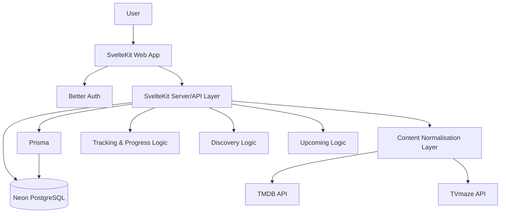
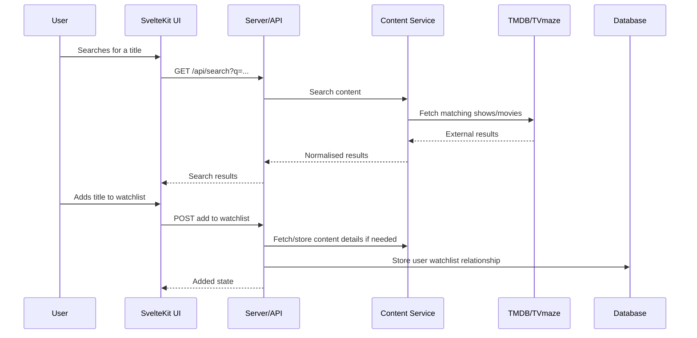
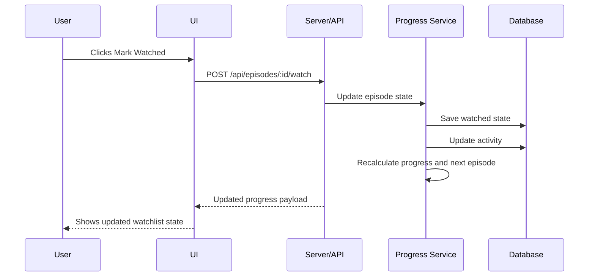
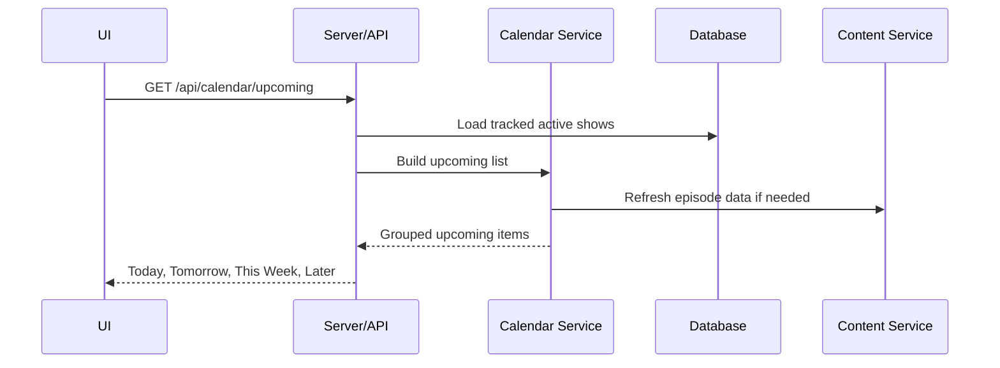

# Design Document

## Overview

This document defines the V1 design for a modern watch tracker web application. The app helps users track TV shows, movies, and anime, manage their watchlist, follow episode progress, see upcoming releases, and discover new content.

The design focuses on a minimal but high-quality product experience: fast, cinematic, mobile-first, clean, and attractive without becoming visually noisy.

V1 is a full-stack SvelteKit application using:

- SvelteKit
- TypeScript
- Better Auth
- Neon PostgreSQL
- Prisma
- TMDB API
- TVmaze API
- Tailwind CSS
- shadcn-svelte
- Bits UI
- Lucide Svelte
- Motion (Previously Framer Motion)
- Dark and light mode

The application should be built as a proper product foundation, not a throwaway prototype. It must have clean separation between UI, backend actions, external API integrations, normalised content models, and user tracking logic.

---

## Design Goals

### Primary Goals

- Build a beautiful and practical watch tracker for TV shows, movies, and anime.
- Make the Home / Watchlist screen immediately useful.
- Allow users to track episodes and movies with minimal friction.
- Provide a clean discovery experience powered by public metadata APIs.
- Support both dark and light mode from V1.
- Keep the UI premium, minimal, and mobile-first.
- Prepare clean backend boundaries so the product can grow later.

### Non-Goals for V1

V1 should not include community features, comments, followers, groups, meme creation, complex AI recommendations, native mobile app code, paid streaming availability, or social feeds.

The goal is to perfect the tracking loop first.

---

## User Experience Principles

### 1. Tracking Should Be Instant

The most important action in the product is marking something as watched. This should feel instant and clear.

Actions like adding to watchlist, marking episodes watched, changing status, and marking movies watched should update the UI immediately or with a very short loading state.

### 2. The App Should Feel Mobile-Native

Even though V1 is a web app, it should feel natural on mobile:

- Bottom navigation on mobile
- Large touch targets
- Poster-based cards
- Smooth sheet/dialog interactions
- Minimal page clutter
- Fast visual feedback
- Clean empty states

### 3. Posters Carry the Visual Identity

The UI should use film/show posters and backdrops as the main visual layer. The design should not depend on heavy decoration. The content itself should make the app feel rich.

### 4. Minimal But Not Plain

Minimal does not mean boring. The product should feel premium through spacing, contrast, typography, card design, subtle motion, and excellent content hierarchy.

### 5. Useful Before It Is Social

The app should be valuable even if the user never follows anyone or reads community content. The private watchlist and tracking experience must stand on its own.

---

## Visual Design Direction

### Overall Feel

The interface should feel:

- Premium
- Cinematic
- Calm
- Fast
- Personal
- Modern
- Content-first
- Slightly editorial

Avoid a generic dashboard look.

### Theme Direction

The app supports three theme settings:

- System
- Dark
- Light

Dark mode should feel like the primary brand experience. Light mode must still feel polished and intentional.

### Dark Mode

Dark mode should use:

- Deep neutral backgrounds
- Soft elevated surfaces
- Subtle borders
- High-quality poster contrast
- Clear accent colour
- Comfortable readable text
- Avoid pure black everywhere unless used deliberately

Recommended feeling: cinematic, focused, premium.

### Light Mode

Light mode should use:

- Soft off-white backgrounds
- Clean cards
- Muted borders
- Clear black/neutral typography
- Controlled accent usage
- Spacious layouts

Recommended feeling: clean, modern, calm.

### Accent Colour

Use one primary accent colour consistently. It should feel modern and entertainment-friendly, but not childish.

Suggested direction:

- Electric violet / rich purple
- Soft amber
- Blue-violet
- Neon lime only if used very carefully

Pick one accent and use it for primary actions, active navigation states, selected chips, and key progress highlights.

Do not overuse the accent colour.

### Typography

Use a modern sans-serif font with strong readability.

Recommended approach:

- One primary font family
- Strong font weight hierarchy
- Large, confident page titles
- Medium-weight section headings
- Comfortable body text
- Small metadata text with muted colour

Avoid overly decorative typography.

### Spacing and Layout

Use generous spacing. The product should feel premium and breathable.

- Cards should not feel cramped.
- Poster grids should have consistent gaps.
- Detail pages should use strong hero spacing.
- Mobile pages should avoid dense text blocks.
- Important actions should be visually obvious.

### Motion

Use minimal motion only where it improves feel:

- Button press feedback
- Card hover/focus states
- Sheet/dialog transitions
- Skeleton loading
- Quick watched-state updates

Avoid heavy animation libraries for V1 unless already needed.

---

## Information Architecture

### Public Routes

- Landing page
- Sign in
- Sign up
- Forgot password
- Optional public show detail
- Optional public movie detail
- Terms
- Privacy

### Authenticated Routes

- Onboarding
- Home / Watchlist
- Search
- Discover
- Calendar / Upcoming
- Show Detail
- Movie Detail
- Profile
- Settings

### Mobile Navigation

Bottom navigation:

1. Home
2. Search
3. Calendar
4. Discover
5. Profile

Settings should be accessible from Profile.

### Desktop Navigation

Desktop can use a top or side navigation pattern:

- Home
- Search
- Calendar
- Discover
- Profile
- Settings

The desktop UI should not feel like a stretched mobile screen. It should use wider layouts, grids, and richer detail page composition.

---

## System Architecture

### Architecture Notes

- SvelteKit handles UI, routing, server-side logic, and API endpoints.
- Better Auth handles authentication and sessions.
- Prisma manages database access.
- TMDB and TVmaze must only be called from the server side.
- External API keys must never be exposed to the browser.
- The UI should consume clean internal response shapes, not raw external API responses.
- Content should be cached or stored after first fetch where appropriate.

---

## Application Layers

### 1. UI Layer

Responsible for:

- Pages
- Components
- Theme rendering
- User interactions
- Loading states
- Empty states
- Form handling
- Responsive layout

Built using:

- SvelteKit
- Svelte components
- Tailwind CSS
- shadcn-svelte
- Bits UI
- Lucide Svelte

### 2. Server/API Layer

Responsible for:

- Auth-protected operations
- Search requests
- Watchlist actions
- Episode progress actions
- Movie tracking actions
- Discover data
- Calendar data
- Profile stats
- Settings updates

### 3. Content Integration Layer

Responsible for:

- Calling TMDB
- Calling TVmaze
- Mapping external data into internal formats
- Handling missing metadata
- Caching useful content
- Merging show, season, and episode data where needed

### 4. Tracking Logic Layer

Responsible for:

- User watchlist state
- Show statuses
- Episode watched/unwatched state
- Movie watched state
- Next episode calculation
- Progress calculation
- Recently watched activity
- Basic stats

### 5. Persistence Layer

Responsible for:

- User accounts
- Sessions
- Stored content metadata
- Watchlist relationships
- Progress data
- Activity history
- Theme/settings preferences

Do not over-design the database in this document. The implementation should choose sensible Prisma models based on these product requirements.

---

## Data Flow

### Search and Add Content

### Mark Episode Watched

### Calendar / Upcoming

---

## Core Pages

## Landing Page

### Purpose

Introduce the product and guide users to sign up or sign in.

### Design

Minimal, premium, poster-inspired, with a strong headline and clear CTA.

### Required Sections

- Hero section
- Short explanation of the product
- Feature highlights
- CTA section

### CTA Examples

- Start Tracking
- Sign In
- Explore Your Watchlist

The landing page should not be overbuilt. V1 priority is the authenticated app.

---

## Authentication Pages

### Pages

- Sign in
- Sign up
- Forgot password

### Requirements

- Clean form layout
- Clear errors
- Loading state
- Password visibility toggle if simple
- Google login if included
- Responsive design
- Theme-aware styling

### Design Style

Use centred cards on desktop and full-screen comfortable forms on mobile.

---

## Onboarding

### Purpose

Get users from empty account to useful watchlist as quickly as possible.

### Flow

1. Welcome
2. Interests
3. Add first titles
4. Set initial progress
5. Continue to Home

### Onboarding Design

Use a guided, card-based flow. Keep it light and fast.

### Important Behaviour

Users can skip, but the empty Home state must clearly guide them back to Search or Discover.

---

## Home / Watchlist

### Purpose

This is the main product screen. It should answer one question:

What should I watch next?

### Required Sections

- Continue Watching
- Watch Next
- Upcoming Soon
- Movies Watchlist
- Recently Watched
- Completed Shows

### Layout

Mobile:

- Stacked sections
- Horizontal poster/card rows where useful
- Bottom navigation
- Quick action buttons

Desktop:

- Wider grid layout
- Main watchlist column
- Side panel for upcoming/recent stats if appropriate

### Key Components

- WatchNextCard
- ProgressBar
- StatusPill
- PosterThumbnail
- EmptyState
- SectionHeader

### Key Behaviours

- Mark episode watched
- Open show detail
- Open movie detail
- Remove from watchlist
- Change status
- View more for long sections

---

## Search

### Purpose

Find and add content quickly.

### Required Features

- Search input
- Debounced search
- Filters: All, Shows, Movies
- Result cards
- Add button
- Added state
- Loading skeleton
- No results state
- Error state

### Layout

Mobile:

- Search input fixed near top
- Results as vertical cards

Desktop:

- Search input top
- Results grid/list hybrid

### Result Card

Shows:

- Poster
- Title
- Year
- Type
- Short overview
- Add/Added button

---

## Show Detail

### Purpose

Show detailed series information and allow full progress control.

### Required Sections

- Cinematic hero
- Actions
- Metadata
- Overview
- Progress summary
- Season selector
- Episode list
- Bulk actions

### Hero Design

Use backdrop as background treatment where available. Overlay content carefully for readability.

### Actions

- Add to Watchlist
- Remove
- Change status
- Mark Caught Up
- Mark Completed
- Reset Progress

### Episode List

Each row includes:

- Watched state
- Episode number
- Title
- Air date
- Runtime if available
- Expandable overview if available

### Bulk Actions

Include:

- Mark season as watched
- Mark previous episodes as watched
- Mark show as caught up
- Reset progress

Bulk actions that affect many episodes should use confirmation.

---

## Movie Detail

### Purpose

Let users save, track, and mark movies as watched.

### Required Sections

- Hero
- Actions
- Metadata
- Overview

### Actions

- Add to Watchlist
- Mark Watched
- Remove
- Favourite if simple

### Movie Statuses

- Plan to Watch
- Watched
- Favourite
- Dropped / Not Interested

---

## Calendar / Upcoming

### Purpose

Show upcoming episodes from the user’s own tracked shows.

### Required Groups

- Today
- Tomorrow
- This Week
- Next Week
- Later

### Calendar Item

Each item includes:

- Poster thumbnail
- Show title
- Episode number
- Episode title
- Release date
- Status label

### Empty State

If no upcoming episodes exist, guide users to Discover or Search.

---

## Discover

### Purpose

Help users find new content without overwhelming them.

### Required Sections

- Trending Shows
- Trending Movies
- Popular Shows
- Popular Movies
- Top Rated Shows
- Top Rated Movies
- Simple recommendations based on watchlist genres if enough data exists

### Design

Use poster grids and horizontal rows. Keep section headings clear.

### Card Behaviour

- Open detail
- Add to watchlist
- Show Added state

---

## Profile

### Purpose

Show personal progress and basic watch identity.

### Required Sections

- User identity
- Basic stats
- Currently watching
- Completed shows
- Movies watched
- Recently watched
- Top genres if available

### Stats

Include:

- Shows tracked
- Shows completed
- Episodes watched
- Movies watched
- Total watch time estimate
- Top genres

### Design

Profile should feel rewarding, not like an admin page.

---

## Settings

### Required Settings

- Account details
- Theme: System / Dark / Light
- Region if useful
- Language if simple
- Notification placeholder
- Delete account
- Sign out

### Design

Simple, clean, grouped settings sections.

---

## Component Design

### Use Library Components For

Use shadcn-svelte and Bits UI for:

- Buttons
- Inputs
- Dialogs
- Dropdowns
- Tabs
- Sheets
- Toasts
- Forms
- Command/search patterns
- Switches
- Selects
- Tooltips where useful

### Custom Components To Build

Build these as product-specific components:

- PosterCard
- WatchNextCard
- SearchResultCard
- ShowHero
- MovieHero
- EpisodeRow
- SeasonSelector
- ProgressBar
- StatusPill
- CalendarReleaseCard
- StatsCard
- EmptyState
- LoadingSkeleton
- BottomNavigation
- ThemeToggle

### PosterCard

Used across Discover, Search, Watchlist, Profile.

Should support:

- Poster image
- Fallback state
- Title
- Year
- Type label
- Add/Added action
- Hover/focus state
- Responsive sizing

### EpisodeRow

Should support:

- Watched/unwatched state
- Episode code
- Title
- Date
- Runtime
- Expandable details
- Loading/disabled state during updates

### WatchNextCard

Should support:

- Poster
- Show title
- Episode code
- Episode title
- Progress
- Mark watched
- Open detail

### EmptyState

Should support:

- Icon or small illustration
- Title
- Short description
- Primary action
- Secondary action if needed

---

## API Design

### API Principles

- Keep API responses consistent.
- Keep frontend models clean.
- Validate inputs.
- Protect authenticated actions.
- Hide external API complexity from UI.
- Never expose external API keys.
- Return useful error messages.

### Suggested API Areas

- `/api/search`
- `/api/shows`
- `/api/movies`
- `/api/watchlist`
- `/api/progress`
- `/api/calendar`
- `/api/discover`
- `/api/profile`
- `/api/settings`

### Response Style

Use predictable JSON response shapes.

For successful responses, return the updated state needed by the UI. For example, after marking an episode watched, return updated progress and next episode data so the UI can refresh intelligently.

For errors, return a clean message and a stable error code where useful.

---

## External API Strategy

### TMDB

Use for:

- Movie search
- Show search
- Movie details
- Show details
- Posters
- Backdrops
- Genres
- Trending
- Popular
- Top rated
- Similar or recommended titles

### TVmaze

Use for:

- TV episode structure
- Air dates
- Schedules
- Episode metadata where helpful

### Normalisation

Create internal content shapes for:

- Search result
- Show summary
- Show detail
- Season
- Episode
- Movie summary
- Movie detail
- Calendar item
- Discover item

The UI should only work with these internal shapes.

### Caching

Cache enough data to make the app feel fast and reduce repeated external calls.

Practical V1 approach:

- Store content metadata after a user adds it.
- Reuse stored metadata for watchlist and detail pages.
- Refresh episode and upcoming data when needed.
- Avoid refetching unchanged data on every page load.

---

## State and Interaction Design

### Optimistic Updates

Use optimistic updates for simple actions where safe:

- Mark episode watched
- Mark episode unwatched
- Add to watchlist
- Mark movie watched
- Change simple status

If the server fails, revert the UI state and show a short error message.

### Toasts

Use toasts lightly.

Good examples:

- Added to watchlist
- Episode marked watched
- Movie marked watched
- Couldn’t update progress. Try again.

Avoid excessive toasts for every tiny interaction.

### Confirmation Dialogs

Use confirmation for destructive or bulk actions:

- Reset progress
- Remove from watchlist if it deletes progress
- Mark entire season watched
- Delete account

---

## Error Handling

### External API Errors

If TMDB or TVmaze fails:

- Show a friendly error.
- Do not expose raw API errors.
- Allow retry where useful.
- Avoid breaking the full page if partial data exists.

### Missing Metadata

Handle gracefully:

- Missing poster
- Missing backdrop
- Missing overview
- Missing runtime
- Missing episode image
- Missing air date

Use fallbacks instead of broken UI.

### Auth Errors

Show clear form-level or field-level errors.

Examples:

- Invalid email or password.
- This email is already registered.
- Your session has expired. Please sign in again.

---

## Loading and Empty States

### Loading

Use skeletons for:

- Poster grids
- Watchlist cards
- Episode rows
- Detail page hero
- Stats cards

### Empty States

Every major page should have a helpful empty state.

Examples:

Home:

Start tracking your first show and we’ll show you what to watch next.

Calendar:

No upcoming episodes yet. Add currently airing shows to see what’s coming.

Search:

No results found. Try another title.

Discover:

Couldn’t load trending content right now. Please try again.

---

## Responsiveness

### Mobile

Mobile is the priority.

Requirements:

- Bottom navigation
- Thumb-friendly actions
- Cards sized for posters
- No tiny tap targets
- Show detail pages should stack cleanly
- Episode rows should be readable
- Search should be fast and easy

### Tablet/Desktop

Desktop should use space well.

Requirements:

- Grid layouts for discovery
- Wider detail page composition
- Optional side panels for stats/upcoming
- Avoid overstretched mobile cards

---

## Accessibility

V1 should include:

- Semantic HTML
- Keyboard navigable controls
- Visible focus states
- Accessible dialogs and dropdowns
- Proper labels for form fields
- Sufficient contrast in both themes
- Alt text or fallback handling for images
- Clear button labels
- No important action hidden behind hover only

Use Bits UI and shadcn-svelte accessibility foundations properly.

---

## Performance

### Requirements

- Lazy load poster-heavy content.
- Use responsive images where possible.
- Avoid loading too many results at once.
- Debounce search.
- Cache external API data where useful.
- Keep client-side JavaScript reasonable.
- Avoid unnecessary page reloads after actions.
- Use skeletons to improve perceived speed.

### Priority Pages

Performance matters most on:

- Home / Watchlist
- Search
- Show Detail
- Discover
- Calendar

---

## Security Considerations

- External API keys must stay server-side.
- Authenticated actions must be protected.
- Validate all user input.
- Prevent users from modifying another user’s watchlist/progress.
- Use secure session handling through Better Auth.
- Avoid leaking sensitive user information.
- Delete account flow must require confirmation.
- Rate-limit or protect high-frequency search routes if needed.

---

## Testing Strategy

### Manual Testing

Test:

- Sign up
- Sign in
- Sign out
- Onboarding
- Search
- Add show
- Add movie
- Mark episode watched
- Mark episode unwatched
- Mark movie watched
- Change show status
- Calendar upcoming
- Discover add action
- Profile stats updates
- Theme switching
- Mobile layout
- Light and dark mode

### Automated Testing Where Practical

Prioritise testing for:

- Progress calculation
- Next episode calculation
- Watchlist state
- API normalisation
- Auth-protected endpoints
- Theme persistence

Do not overbuild testing before the core product works, but make critical tracking logic reliable.

---

## Acceptance Criteria

### Product

- Users can create accounts and sign in.
- Users can complete or skip onboarding.
- Users can search shows and movies.
- Users can add content to a watchlist.
- Users can track show progress by episode.
- Users can mark movies as watched.
- Users can see what to watch next.
- Users can see upcoming episodes from tracked shows.
- Users can discover trending/popular content.
- Users can view basic profile stats.
- Users can use dark and light mode.

### Design

- The UI feels polished and modern.
- Mobile experience is strong.
- Dark mode and light mode both look intentional.
- Poster-heavy screens load gracefully.
- Empty states are helpful.
- Error states are human-friendly.
- Core actions are easy to understand.

### Technical

- External APIs are called server-side.
- API keys are not exposed.
- Frontend uses normalised internal data.
- Authenticated actions are protected.
- Progress updates correctly after watched/unwatched actions.
- Missing metadata does not break the UI.
- App is structured cleanly enough for future expansion.

---

## Recommended Build Order

1. Project setup
2. Tailwind and theme system
3. shadcn-svelte / Bits UI setup
4. Base app shell and navigation
5. Authentication
6. Onboarding shell
7. External API service layer
8. Search
9. Add to watchlist
10. Show detail
11. Episode tracking
12. Movie detail and tracking
13. Home / Watchlist
14. Calendar / Upcoming
15. Discover
16. Profile and stats
17. Settings
18. Loading/empty/error states
19. Responsive polish
20. Final UI polish

---

## Final Design Direction

The V1 should feel like a polished personal entertainment tracker.

It should not try to be everything. It should do the core job beautifully:

- Help users track what they watch.
- Show them what to watch next.
- Keep progress organised.
- Make upcoming episodes easy to see.
- Make discovery enjoyable.
- Look premium in both dark and light mode.

The strongest version of this product is minimal, fast, cinematic, and useful every time the user opens it.
